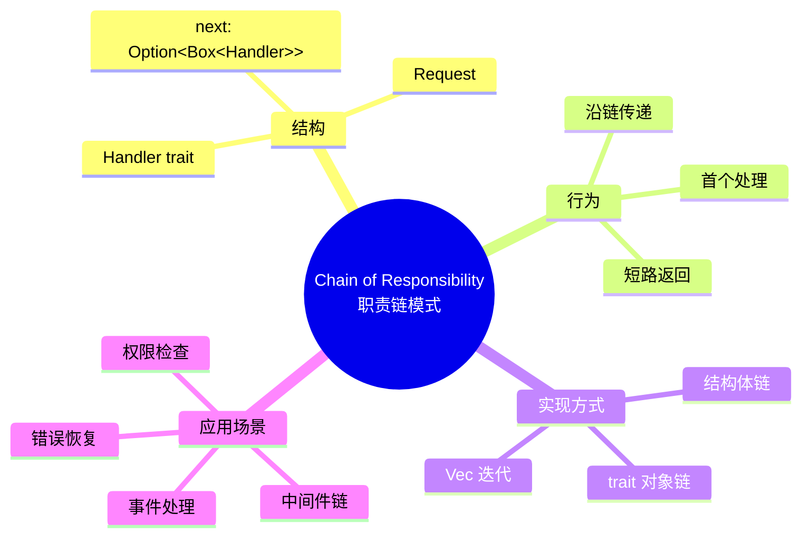
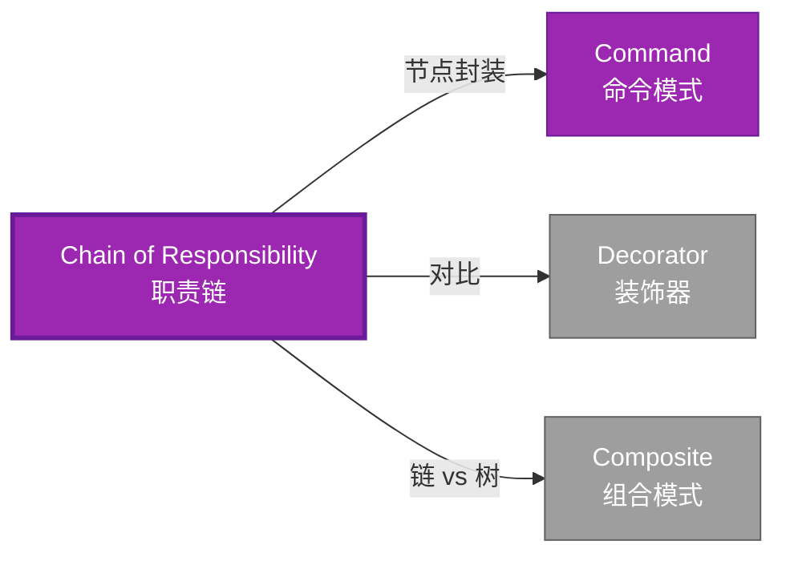

# Chain of Responsibility 形式化分析

> **创建日期**: 2026-02-12
> **最后更新**: 2026-02-28
> **Rust 版本**: 1.93.1+ (Edition 2024)
> **状态**: ✅ 已完成
> **分类**: 行为型
> **安全边界**: 纯 Safe
> **23 模式矩阵**: [README §23 模式多维对比矩阵](../README.md#23-模式多维对比矩阵) 第 13 行（Chain of Responsibility）
> **证明深度**: L3（完整证明）

---

## 📊 目录 {#-目录}

- [Chain of Responsibility 形式化分析](#chain-of-responsibility-形式化分析)
  - [📊 目录 {#-目录}](#-目录--目录)
  - [形式化定义](#形式化定义)
    - [Def 1.1（Chain of Responsibility 结构）](#def-11chain-of-responsibility-结构)
    - [Axiom CR1（链有穷公理）](#axiom-cr1链有穷公理)
    - [Axiom CR2（请求传递公理）](#axiom-cr2请求传递公理)
    - [定理 CR-T1（链无悬垂定理）](#定理-cr-t1链无悬垂定理)
    - [定理 CR-T2（递归处理安全定理）](#定理-cr-t2递归处理安全定理)
    - [推论 CR-C1（纯 Safe Chain）](#推论-cr-c1纯-safe-chain)
    - [概念定义-属性关系-解释论证 层次汇总](#概念定义-属性关系-解释论证-层次汇总)
  - [Rust 实现与代码示例](#rust-实现与代码示例)
  - [完整证明](#完整证明)
    - [形式化论证链](#形式化论证链)
    - [与 Rust 类型系统的联系](#与-rust-类型系统的联系)
    - [内存安全保证](#内存安全保证)
  - [典型场景](#典型场景)
  - [完整场景示例：HTTP 中间件链](#完整场景示例http-中间件链)
  - [相关模式](#相关模式)
  - [实现变体](#实现变体)
  - [反例：链中形成环](#反例链中形成环)
  - [选型决策树](#选型决策树)
  - [与 GoF 对比](#与-gof-对比)
  - [边界](#边界)
  - [与 Rust 1.93 的对应](#与-rust-193-的对应)
  - [思维导图](#思维导图)
  - [与其他模式的关系图](#与其他模式的关系图)
  - [实质内容五维自检](#实质内容五维自检)

---

## 形式化定义

### Def 1.1（Chain of Responsibility 结构）

设 $H$ 为处理器类型，$R$ 为请求类型。Chain 是一个三元组 $\mathcal{CR} = (H, R, \mathit{next})$，满足：

- $H$ 持有 $\mathrm{Option}\langle H \rangle$ 下一处理器
- $\mathit{handle}(h, r) : H \times R \to \mathrm{Option}\langle R \rangle$ 或 $R \to ()$
- 若 $h$ 不处理，则委托 $\mathit{handle}(h.\mathit{next}, r)$
- **链有穷**：无环，深度有界

**形式化表示**：
$$\mathcal{CR} = \langle H, R, \mathit{next}: \mathrm{Option}\langle \mathrm{Box}\langle H \rangle \rangle, \mathit{handle}: H \times R \rightarrow \mathrm{Option}\langle R \rangle \rangle$$

---

### Axiom CR1（链有穷公理）

$$\forall h: H,\, \text{处理器链有穷；无环}$$

链有穷；无环。

### Axiom CR2（请求传递公理）

$$\mathit{handle}(h, r) \text{ 不处理 } \implies \mathit{next}(h) \neq \mathrm{None} \land \mathit{handle}(\mathit{next}(h), r)$$

请求沿链传递；至多一个处理器处理，或全部尝试。

---

### 定理 CR-T1（链无悬垂定理）

`Option<Box<Handler>>` 链由 [ownership_model](../../../formal_methods/ownership_model.md) 保证无悬垂。

**证明**：

1. **所有权链**：
   - 每个 `Handler` 拥有 `next: Option<Box<Handler>>`
   - `Box` 拥有下一处理器
   - 所有权单向传递

2. **生命周期**：
   - 头节点存活期间，整个链有效
   - 头节点释放时，递归释放整个链

3. **无悬垂**：
   - 无裸指针
   - 借用检查保证引用有效

由 ownership_model T1，得证。$\square$

---

### 定理 CR-T2（递归处理安全定理）

递归或循环处理时借用规则满足；由 [borrow_checker_proof](../../../formal_methods/borrow_checker_proof.md)。

**证明**：

1. **递归处理**：

   ```rust
   fn handle(&self, req: &Request) -> bool {
       if self.can_handle(req) { true }
       else if let Some(ref n) = self.next { n.handle(req) }
       else { false }
   }
   ```

2. **借用分析**：
   - `&self` 借用当前处理器
   - `ref n` 借用 `next` 中的 `Box<Handler>`
   - 递归调用 `n.handle(req)`：子借用

3. **终止性**：链有穷（Axiom CR1），递归终止

由 borrow_checker_proof 借用规则，得证。$\square$

---

### 推论 CR-C1（纯 Safe Chain）

Chain 为纯 Safe；`Option<Box<Handler>>` 链式委托，无 `unsafe`。

**证明**：

1. `Option<Box<H>>`：标准库 Safe API
2. 递归处理：Safe Rust
3. 借用规则：编译期检查
4. 无 `unsafe` 块

由 CR-T1、CR-T2 及 [safe_unsafe_matrix](../../05_boundary_system/safe_unsafe_matrix.md) SBM-T1，得证。$\square$

---

### 概念定义-属性关系-解释论证 层次汇总

| 层次 | 内容 | 本页对应 |
| :--- | :--- | :--- |
| **概念定义层** | Def 1.1（Chain 结构）、Axiom CR1/CR2（有穷无环、请求传递） | 上 |
| **属性关系层** | Axiom CR1/CR2 $\rightarrow$ 定理 CR-T1/CR-T2 $\rightarrow$ 推论 CR-C1；依赖 ownership、borrow | 上 |
| **解释论证层** | CR-T1/CR-T2 完整证明；反例：链中形成环 | §完整证明、§反例 |

---

## Rust 实现与代码示例

```rust
type Request = String;

struct Handler {
    can_handle: fn(&Request) -> bool,
    next: Option<Box<Handler>>,
}

impl Handler {
    fn handle(&self, req: &Request) -> bool {
        if (self.can_handle)(req) {
            println!("Handled: {}", req);
            true
        } else if let Some(ref n) = self.next {
            n.handle(req)
        } else {
            false
        }
    }
}

// 构建链：h1 -> h2 -> None
let h2 = Handler {
    can_handle: |r| r.contains("B"),
    next: None,
};
let h1 = Handler {
    can_handle: |r| r.contains("A"),
    next: Some(Box::new(h2)),
};
h1.handle(&"B".into());  // 委托至 h2
```

**形式化对应**：`Handler` 即 $H$；`Request` 即 $R$；`next_handler` 即 $\mathrm{Option}\langle H \rangle$。

---

## 完整证明

### 形式化论证链

```text
Axiom CR1 (链有穷)
    ↓ 依赖
ownership_model T1
    ↓ 保证
定理 CR-T1 (链无悬垂)
    ↓ 组合
Axiom CR2 (请求传递)
    ↓ 依赖
borrow_checker_proof
    ↓ 保证
定理 CR-T2 (递归处理安全)
    ↓ 结论
推论 CR-C1 (纯 Safe Chain)
```

### 与 Rust 类型系统的联系

| Rust 特性 | Chain 实现 | 类型安全保证 |
| :--- | :--- | :--- |
| `Option<Box<T>>` | 链式结构 | 有穷链 |
| 递归方法 | 请求传递 | 借用检查 |
| `fn` 指针 | 处理逻辑 | 类型签名 |
| 借用规则 | 委托安全 | 编译期检查 |

### 内存安全保证

1. **无悬垂**：所有权链保证节点有效
2. **无环**：`Box` 单向所有权
3. **借用安全**：递归委托符合借用规则
4. **终止性**：链有穷保证递归终止

---

## 典型场景

| 场景 | 说明 |
| :--- | :--- |
| 请求过滤/中间件 | HTTP 中间件链、日志/认证/限流 |
| 事件处理 | 事件沿链传递，首个能处理者消费 |
| 错误恢复 | 多级 fallback，逐级尝试 |
| 权限检查 | 多级审批，层级委托 |

---

## 完整场景示例：HTTP 中间件链

**场景**：请求依次经日志→认证；任一失败则短路返回。

```rust
type Request = (String, Vec<String>);  // (path, headers)

struct LogHandler { next: Option<Box<AuthHandler>> }
struct AuthHandler { next: Option<Box<EndHandler>> }
struct EndHandler;

impl LogHandler {
    fn handle(&self, req: &Request) -> Option<String> {
        println!("Request: {}", req.0);
        self.next.as_ref().and_then(|n| n.handle(req))
    }
}

impl AuthHandler {
    fn handle(&self, req: &Request) -> Option<String> {
        if req.1.iter().any(|h| h.starts_with("Auth: ")) {
            self.next.as_ref().and_then(|n| n.handle(req))
        } else {
            Some("401 Unauthorized".into())
        }
    }
}

impl EndHandler {
    fn handle(&self, _req: &Request) -> Option<String> {
        Some("OK".into())
    }
}

// 链：Log → Auth → End；请求沿链传递
let chain = LogHandler {
    next: Some(Box::new(AuthHandler {
        next: Some(Box::new(EndHandler)),
    })),
};
```

**形式化对应**：`LogHandler`、`AuthHandler` 即 $H$；`Request` 即 $R$；`next` 即 $\mathrm{Option}\langle H \rangle$；Axiom CR1 由 `Box` 链无环保证。

---

## 相关模式

| 模式 | 关系 |
| :--- | :--- |
| [Command](command.md) | 链中每节点可封装为 Command |
| [Decorator](../02_structural/decorator.md) | 链式包装，但 Chain 为委托传递 |
| [Composite](../02_structural/composite.md) | 树结构 vs 链结构；可组合使用 |

---

## 实现变体

| 变体 | 说明 | 适用 |
| :--- | :--- | :--- |
| 结构体链 | `Option<Box<Handler>>`，如上示例 | 链固定、类型同质 |
| trait 链 | `trait Handler { fn handle(&self, req: &R) -> Option<()>; fn next(&self) -> Option<&dyn Handler>; }` | 需多态处理器 |
| 迭代器链 | `handlers.iter().find_map(\|h\| h.handle(req))` | 链为 `Vec`，顺序尝试 |

---

## 反例：链中形成环

**错误**：用 `Rc<RefCell<Handler>>` 等使 `next` 指回前驱，形成环。

```rust
// 若用 Rc 使 h1.next 指向包含 h1 的 h2 → 形成环
// handle(req) 递归时永不终止 → 栈溢出
```

**后果**：`handle` 无限递归；栈溢出。**Axiom CR1** 要求链有穷、无环。`Box` 链天然无环（所有权单向）。

---

## 选型决策树

```text
请求需沿链传递、首个能处理者消费？
├── 是 → 链式委托？ → Option<Box<Handler>>
│       └── Vec 顺序尝试？ → handlers.iter().find_map
├── 需一对多通知？ → Observer
└── 需封装操作？ → Command
```

---

## 与 GoF 对比

| GoF | Rust 对应 | 差异 |
| :--- | :--- | :--- |
| Handler 链 | Option<Box<Handler>> | 等价 |
| 委托 next | as_deref().and_then(\|n\| n.handle(req)) | 等价 |
| 无环 | Box 单向所有权 | 天然无环 |

---

## 边界

| 维度 | 分类 |
| :--- | :--- |
| 安全 | 纯 Safe |
| 支持 | 原生 |
| 表达 | 等价 |

---

## 与 Rust 1.93 的对应

| 1.93 特性 | 与本模式 | 说明 |
| :--- | :--- | :--- |
| 无新增影响 | — | 1.93 无影响 Chain of Responsibility 语义的变更 |
| 92 项落点 | 无 | 本模式未涉及 [RUST_193_COUNTEREXAMPLES_INDEX](../../../RUST_193_COUNTEREXAMPLES_INDEX.md) 特定项 |

---

## 思维导图



---

## 与其他模式的关系图



---

## 实质内容五维自检

| 自检项 | 状态 | 说明 |
| :--- | :--- | :--- |
| 形式化 | ✅ | Def 1.1、Axiom CR1/CR2、定理 CR-T1/T2（L3 完整证明）、推论 CR-C1 |
| 代码 | ✅ | 可运行示例、HTTP 中间件链 |
| 场景 | ✅ | 典型场景、完整示例 |
| 反例 | ✅ | 链中形成环 |
| 衔接 | ✅ | ownership、CE-T1 |
| 权威对应 | ✅ | [GoF](../README.md#与-gof-原书对应)、[formal_methods](../../../formal_methods/README.md)、[INTERNATIONAL_FORMAL_VERIFICATION_INDEX](../../../INTERNATIONAL_FORMAL_VERIFICATION_INDEX.md) |
