# Command 形式化分析

> **创建日期**: 2026-02-12
> **最后更新**: 2026-02-20
> **Rust 版本**: 1.93.0+ (Edition 2024)
> **状态**: ✅ 已完成
> **分类**: 行为型
> **安全边界**: 纯 Safe
> **23 模式矩阵**: [README §23 模式多维对比矩阵](../README.md#23-模式多维对比矩阵) 第 14 行（Command）
> **证明深度**: L3（完整证明）

---

## 📊 目录 {#-目录}

- [Command 形式化分析](#command-形式化分析)
  - [📊 目录 {#-目录}](#-目录--目录)
  - [形式化定义](#形式化定义)
    - [Def 1.1（Command 结构）](#def-11command-结构)
    - [Axiom CM1（可存储公理）](#axiom-cm1可存储公理)
    - [Axiom CM2（闭包即命令公理）](#axiom-cm2闭包即命令公理)
    - [定理 CM-T1（闭包类型安全定理）](#定理-cm-t1闭包类型安全定理)
    - [定理 CM-T2（存储与跨线程定理）](#定理-cm-t2存储与跨线程定理)
    - [推论 CM-C1（纯 Safe Command）](#推论-cm-c1纯-safe-command)
    - [概念定义-属性关系-解释论证 层次汇总](#概念定义-属性关系-解释论证-层次汇总)
  - [Rust 实现与代码示例](#rust-实现与代码示例)
  - [完整证明](#完整证明)
    - [形式化论证链](#形式化论证链)
    - [与 Rust 类型系统的联系](#与-rust-类型系统的联系)
    - [内存安全保证](#内存安全保证)
  - [典型场景](#典型场景)
  - [完整场景示例：可撤销文本编辑器](#完整场景示例可撤销文本编辑器)
  - [相关模式](#相关模式)
  - [实现变体](#实现变体)
  - [反例：命令副作用不可逆](#反例命令副作用不可逆)
  - [选型决策树](#选型决策树)
  - [与 GoF 对比](#与-gof-对比)
  - [边界](#边界)
  - [与 Rust 1.93 的对应](#与-rust-193-的对应)
  - [思维导图](#思维导图)
  - [与其他模式的关系图](#与其他模式的关系图)
  - [实质内容五维自检](#实质内容五维自检)

---

## 形式化定义

### Def 1.1（Command 结构）

设 $C$ 为命令类型。Command 是一个三元组 $\mathcal{CM} = (C, \mathit{execute}, \mathit{undo})$，满足：

- $\exists \mathit{execute} : C \to ()$ 或 $\mathit{execute} : C \to \mathrm{Result}$
- $C$ 封装操作与参数
- 可存储、队列、撤销（若支持）
- **可逆性**（可选）：$\mathit{undo}(\mathit{execute}(c)) = \mathit{id}$

**形式化表示**：
$$\mathcal{CM} = \langle C, \mathit{execute}: C \rightarrow \mathrm{Result}\langle (), E \rangle, \mathit{undo}: C \rightarrow \mathrm{Result}\langle (), E \rangle \rangle$$

---

### Axiom CM1（可存储公理）

$$\forall c: C,\, c\text{ 可存储；可 defer 执行}$$

命令对象可存储；可 defer 执行。

### Axiom CM2（闭包即命令公理）

$$\text{闭包 }\mathit{Fn}() \text{ 或 } \mathit{FnOnce}() \text{ 即命令；捕获环境为参数}$$

闭包 `Fn` 或 `FnOnce` 即命令；捕获环境为参数。

---

### 定理 CM-T1（闭包类型安全定理）

闭包 `Fn() -> R` 或 `FnOnce() -> R` 即命令；由 [type_system_foundations](../../../type_theory/type_system_foundations.md) 类型安全。

**证明**：

1. **闭包类型**：`Box<dyn Fn() -> R>` 或 `impl Fn() -> R`
2. **类型推导**：编译期推导捕获变量类型
3. **类型安全**：调用时参数/返回类型检查
4. **生命周期**：捕获变量的生命周期检查

由 type_system_foundations 类型保持性，得证。$\square$

---

### 定理 CM-T2（存储与跨线程定理）

`Box<dyn Fn()>` 可存储、可跨边界传递；满足 Send 则可跨线程。

**证明**：

1. **堆分配**：`Box` 存储在堆上，生命周期独立于栈
2. **trait 对象**：`dyn Fn()` 动态派发
3. **Send 约束**：`Box<dyn Fn()>: Send` 当捕获变量 `: Send`
4. **线程安全**：编译期检查 Send/Sync

由 ownership_model 及 Send/Sync 约束，得证。$\square$

---

### 推论 CM-C1（纯 Safe Command）

Command 为纯 Safe；闭包或 trait 封装操作，无 `unsafe`。

**证明**：

1. 闭包：Safe Rust 特性
2. trait `Command`：纯 Safe
3. `Box<dyn Fn()>`：Safe trait 对象
4. 无 `unsafe` 块

由 CM-T1、CM-T2 及 [safe_unsafe_matrix](../../05_boundary_system/safe_unsafe_matrix.md) SBM-T1，得证。$\square$

---

### 概念定义-属性关系-解释论证 层次汇总

| 层次 | 内容 | 本页对应 |
| :--- | :--- | :--- |
| **概念定义层** | Def 1.1（Command 结构）、Axiom CM1/CM2（可存储、闭包即命令） | 上 |
| **属性关系层** | Axiom CM1/CM2 $\rightarrow$ 定理 CM-T1/CM-T2 $\rightarrow$ 推论 CM-C1；依赖 type、ownership、Send | 上 |
| **解释论证层** | CM-T1/CM-T2 完整证明；反例：命令副作用不可逆 | §完整证明、§反例 |

---

## Rust 实现与代码示例

```rust
// 方式一：闭包
let x = 42;
let cmd: Box<dyn Fn() -> i32> = Box::new(move || x + 1);
let result = cmd();
assert_eq!(result, 43);

// 方式二：Trait 命令
trait Command {
    fn execute(&self);
}

struct PrintCommand(pub String);
impl Command for PrintCommand {
    fn execute(&self) {
        println!("{}", self.0);
    }
}

// 存储命令队列
let mut queue: Vec<Box<dyn Command>> = vec![];
queue.push(Box::new(PrintCommand("hello".into())));
for cmd in &queue {
    cmd.execute();
}

// 撤销/重做
trait ReversibleCommand {
    fn execute(&mut self);
    fn undo(&mut self);
}

struct IncrementCommand { value: i32, prev: Option<i32> }
impl ReversibleCommand for IncrementCommand {
    fn execute(&mut self) {
        self.prev = Some(self.value);
        self.value += 1;
    }
    fn undo(&mut self) {
        if let Some(p) = self.prev {
            self.value = p;
            self.prev = None;
        }
    }
}
```

**形式化对应**：`Command` trait 或 `Fn`/`FnOnce` 即 $C$；`execute` 即 $\mathit{execute}$。

---

## 完整证明

### 形式化论证链

```text
Axiom CM1 (可存储)
    ↓ 实现
Box<dyn Fn()>
    ↓ 依赖
type_system
    ↓ 保证
定理 CM-T1 (闭包类型安全)
    ↓ 组合
Axiom CM2 (闭包即命令)
    ↓ 依赖
Send/Sync
    ↓ 保证
定理 CM-T2 (存储与跨线程)
    ↓ 结论
推论 CM-C1 (纯 Safe Command)
```

### 与 Rust 类型系统的联系

| Rust 特性 | Command 实现 | 类型安全保证 |
| :--- | :--- | :--- |
| `Fn`/`FnOnce` | 闭包命令 | 捕获类型推导 |
| `Box<dyn Trait>` | 存储命令 | 动态派发安全 |
| `Send`/`Sync` | 跨线程 | 编译期检查 |
| trait | 可撤销命令 | 接口一致性 |

### 内存安全保证

1. **闭包安全**：捕获变量生命周期检查
2. **存储安全**：`Box` 堆分配，生命周期管理
3. **撤销安全**：状态保存/恢复类型安全
4. **队列安全**：Vec 存储，所有权明确

---

## 典型场景

| 场景 | 说明 |
| :--- | :--- |
| 撤销/重做 | 编辑器、事务、历史记录 |
| 任务队列 | 延迟执行、批处理 |
| 宏/脚本 | 录制与回放操作 |
| 异步调度 | Future 即可恢复命令 |

---

## 完整场景示例：可撤销文本编辑器

**场景**：插入/删除字符；支持 undo/redo 栈；命令对象封装操作与逆操作。

```rust
trait EditorCommand {
    fn execute(&mut self, doc: &mut String);
    fn undo(&mut self, doc: &mut String);
}

struct InsertCommand { pos: usize, ch: char }
impl EditorCommand for InsertCommand {
    fn execute(&mut self, doc: &mut String) {
        doc.insert(self.pos, self.ch);
    }
    fn undo(&mut self, doc: &mut String) {
        doc.remove(self.pos);
    }
}

struct DeleteCommand { pos: usize, removed: Option<char> }
impl EditorCommand for DeleteCommand {
    fn execute(&mut self, doc: &mut String) {
        if self.pos < doc.len() {
            self.removed = Some(doc.remove(self.pos));
        }
    }
    fn undo(&mut self, doc: &mut String) {
        if let Some(c) = self.removed.take() {
            doc.insert(self.pos, c);
        }
    }
}

struct Editor {
    doc: String,
    undo_stack: Vec<Box<dyn EditorCommand>>,
}
impl Editor {
    fn apply(&mut self, mut cmd: Box<dyn EditorCommand>) {
        cmd.execute(&mut self.doc);
        self.undo_stack.push(cmd);
    }
}
// 使用：editor.apply(Box::new(InsertCommand { pos: 0, ch: 'x' }));
```

**形式化对应**：`EditorCommand` 即 $C$；`execute`/`undo` 为可逆操作；由 Axiom CM1、CM2。

---

## 相关模式

| 模式 | 关系 |
| :--- | :--- |
| [Observer](observer.md) | 观察者可接收命令；命令可作为事件 |
| [Chain of Responsibility](chain_of_responsibility.md) | 链中节点可封装为 Command |
| [Memento](memento.md) | 撤销需 Memento 保存状态 |

---

## 实现变体

| 变体 | 说明 | 适用 |
| :--- | :--- | :--- |
| `Box<dyn Fn()>` | 无参数、无返回值 | 简单操作 |
| `Box<dyn FnOnce()>` | 消费型；可移动捕获 | 一次性执行 |
| `trait Command` | 可扩展、可存储 | 撤销/重做、队列 |
| `Future` | 异步命令 | async/await 任务 |

---

## 反例：命令副作用不可逆

**错误**：命令执行 I/O、网络请求等不可逆操作，`undo` 无法恢复。

```rust
impl ReversibleCommand for SendEmailCommand {
    fn execute(&mut self) { /* 邮件已发送 */ }
    fn undo(&mut self) { /* 无法撤回 */ }
}
```

**结论**：撤销仅对纯函数或可逆状态有效；需在设计时区分可逆/不可逆命令。

---

## 选型决策树

```text
需要封装可存储/可撤销的操作？
├── 是 → 需撤销？ → trait ReversibleCommand
│       └── 仅执行？ → Box<dyn Fn> 或 trait Command
├── 需一对多通知？ → Observer
└── 需沿链传递？ → Chain of Responsibility
```

---

## 与 GoF 对比

| GoF | Rust 对应 | 差异 |
| :--- | :--- | :--- |
| 命令接口 | trait Command 或 Fn | 等价 |
| 具体命令 | impl Command | 等价 |
| 撤销 | undo 方法 | 等价 |

---

## 边界

| 维度 | 分类 |
| :--- | :--- |
| 安全 | 纯 Safe |
| 支持 | 原生 |
| 表达 | 等价 |

---

## 与 Rust 1.93 的对应

| 1.93 特性 | 与本模式 | 说明 |
| :--- | :--- | :--- |
| 无新增影响 | — | 1.93 无影响 Command 语义的变更 |
| 92 项落点 | 无 | 本模式未涉及 [RUST_193_COUNTEREXAMPLES_INDEX](../../../RUST_193_COUNTEREXAMPLES_INDEX.md) 特定项 |

---

## 思维导图

```mermaid
mindmap
  root((Command<br/>命令模式))
    结构
      Command trait
      execute()
      undo()
    行为
      封装请求
      延迟执行
      可撤销
    实现方式
      闭包 Fn/FnOnce
      Box&lt;dyn Command&gt;
      async Future
    应用场景
      撤销/重做
      任务队列
      宏录制
      事务管理
```

---

## 与其他模式的关系图

```mermaid
graph LR
    C[Command<br/>命令模式] -->|作为事件| O[Observer<br/>观察者]
    C -->|链节点| CR[Chain of Responsibility<br/>职责链]
    C -->|需状态保存| M[Memento<br/>备忘录]
    C -.->|对比| F[Future<br/>异步任务]
    style C fill:#9C27B0,stroke:#6A1B9A,stroke-width:3px,color:#fff
    style O fill:#9C27B0,stroke:#6A1B9A,color:#fff
    style CR fill:#9C27B0,stroke:#6A1B9A,color:#fff
    style M fill:#9C27B0,stroke:#6A1B9A,color:#fff
    style F fill:#9E9E9E,stroke:#616161,color:#fff
```



---

## 实质内容五维自检

| 自检项 | 状态 | 说明 |
| :--- | :--- | :--- |
| 形式化 | ✅ | Def 1.1、Axiom CM1/CM2、定理 CM-T1/T2（L3 完整证明）、推论 CM-C1 |
| 代码 | ✅ | 可运行示例、可撤销编辑器 |
| 场景 | ✅ | 典型场景、完整示例 |
| 反例 | ✅ | 命令副作用不可逆 |
| 衔接 | ✅ | ownership、CE-T2、Send |
| 权威对应 | ✅ | [GoF](../README.md#与-gof-原书对应)、[formal_methods](../../../formal_methods/README.md)、[INTERNATIONAL_FORMAL_VERIFICATION_INDEX](../../../INTERNATIONAL_FORMAL_VERIFICATION_INDEX.md) |
