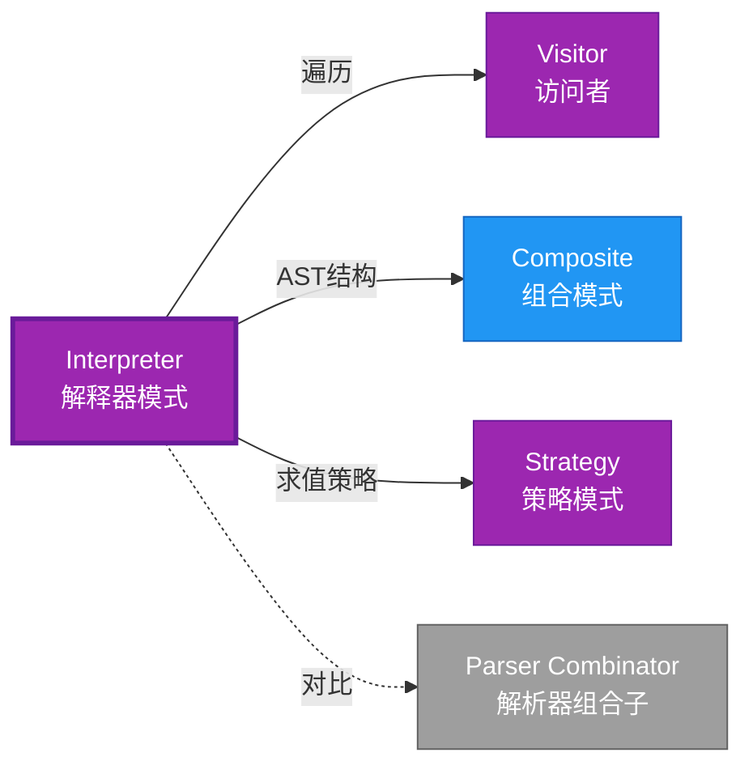

# Interpreter 形式化分析

> **创建日期**: 2026-02-12
> **最后更新**: 2026-02-28
> **Rust 版本**: 1.93.1+ (Edition 2024)
> **状态**: ✅ 已完成
> **分类**: 行为型
> **安全边界**: 纯 Safe
> **23 模式矩阵**: [README §23 模式多维对比矩阵](../README.md#23-模式多维对比矩阵) 第 15 行（Interpreter）
> **证明深度**: L3（完整证明）

---

## 📊 目录 {#-目录}

- [Interpreter 形式化分析](#interpreter-形式化分析)
  - [📊 目录 {#-目录}](#-目录--目录)
  - [形式化定义](#形式化定义)
    - [Def 1.1（Interpreter 结构）](#def-11interpreter-结构)
    - [Axiom IN1（AST 有穷公理）](#axiom-in1ast-有穷公理)
    - [Axiom IN2（match 穷尽公理）](#axiom-in2match-穷尽公理)
    - [定理 IN-T1（穷尽匹配完备性定理）](#定理-in-t1穷尽匹配完备性定理)
    - [定理 IN-T2（求值终止性定理）](#定理-in-t2求值终止性定理)
    - [推论 IN-C1（纯 Safe Interpreter）](#推论-in-c1纯-safe-interpreter)
    - [概念定义-属性关系-解释论证 层次汇总](#概念定义-属性关系-解释论证-层次汇总)
  - [Rust 实现与代码示例](#rust-实现与代码示例)
  - [完整证明](#完整证明)
    - [形式化论证链](#形式化论证链)
    - [与 Rust 类型系统的联系](#与-rust-类型系统的联系)
    - [内存安全保证](#内存安全保证)
  - [典型场景](#典型场景)
  - [完整 DSL 示例：简易查询语言](#完整-dsl-示例简易查询语言)
  - [相关模式](#相关模式)
  - [实现变体](#实现变体)
  - [反例：AST 含环或无限递归](#反例ast-含环或无限递归)
  - [选型决策树](#选型决策树)
  - [与 GoF 对比](#与-gof-对比)
  - [边界](#边界)
  - [与 Rust 1.93 的对应](#与-rust-193-的对应)
  - [思维导图](#思维导图)
  - [与其他模式的关系图](#与其他模式的关系图)
  - [实质内容五维自检](#实质内容五维自检)

---

## 形式化定义

### Def 1.1（Interpreter 结构）

设 $E$ 为表达式类型（AST），$V$ 为值类型。Interpreter 是一个四元组 $\mathcal{IN} = (E, V, \mathit{eval}, \mathit{parse})$，满足：

- $\exists \mathit{eval} : E \to V$
- $E$ 为代数数据类型：$E = \mathrm{Const}(V) \mid \mathrm{Op}(\mathit{Op}, E, E) \mid \ldots$
- 递归求值：$\mathit{eval}(\mathrm{Op}(e_1,e_2)) = f(\mathit{eval}(e_1), \mathit{eval}(e_2))$
- **有穷性**：AST 有穷、无环

**形式化表示**：
$$\mathcal{IN} = \langle E, V, \mathit{eval}: E \rightarrow V, \mathit{parse}: \mathit{String} \rightarrow E \rangle$$

---

### Axiom IN1（AST 有穷公理）

$$\forall e: E,\, e\text{ 为有限树；无环}$$

AST 有穷；无环（由结构保证）。

### Axiom IN2（match 穷尽公理）

$$\mathsf{match}\,e\,\mathsf{with}\,\{\ldots\}\text{ 覆盖 }E\text{ 所有变体}$$

`match` 穷尽所有变体；无遗漏。

---

### 定理 IN-T1（穷尽匹配完备性定理）

枚举 + match 求值，由 [type_system_foundations](../../../type_theory/type_system_foundations.md) 穷尽匹配保证完备性。

**证明**：

1. **枚举定义**：

   ```rust
   enum Expr { Const(i32), Add(Box<Expr>, Box<Expr>), ... }
   ```

2. **穷尽检查**：
   - Rust 编译器检查 match 覆盖所有变体
   - 遗漏变体 → 编译错误

3. **完备性**：
   - 每个变体有对应处理分支
   - 递归调用覆盖子表达式

由 type_system_foundations 保持性，得证。$\square$

---

### 定理 IN-T2（求值终止性定理）

若 $E$ 有穷且无环，则 $\mathit{eval}(e)$ 终止。

**证明**：

1. **结构归纳**：
   - 基础：`Const(v)` 直接返回值
   - 归纳：`Op(e1, e2)` 先求值 $e_1, e_2$（子表达式更小）

2. **有界深度**：
   - AST 深度有界（Axiom IN1）
   - 递归深度不超过 AST 深度

3. **终止**：
   - 有限递归步数后终止
   - 无无限循环（无环）

由结构归纳法，得证。$\square$

---

### 推论 IN-C1（纯 Safe Interpreter）

Interpreter 为纯 Safe；`enum` + `match` 递归求值，无 `unsafe`。

**证明**：

1. `enum` 定义：纯 Safe
2. `match` 求值：纯 Safe
3. 递归调用：Safe Rust
4. 无 `unsafe` 块

由 IN-T1、IN-T2 及 [safe_unsafe_matrix](../../05_boundary_system/safe_unsafe_matrix.md) SBM-T1，得证。$\square$

---

### 概念定义-属性关系-解释论证 层次汇总

| 层次 | 内容 | 本页对应 |
| :--- | :--- | :--- |
| **概念定义层** | Def 1.1（Interpreter 结构）、Axiom IN1/IN2（AST 有穷、match 穷尽） | 上 |
| **属性关系层** | Axiom IN1/IN2 $\rightarrow$ 定理 IN-T1/IN-T2 $\rightarrow$ 推论 IN-C1；依赖 type_system | 上 |
| **解释论证层** | IN-T1/IN-T2 完整证明；反例：AST 含环、漏 match | §完整证明、§反例 |

---

## Rust 实现与代码示例

```rust
enum Expr {
    Const(i32),
    Add(Box<Expr>, Box<Expr>),
    Mul(Box<Expr>, Box<Expr>),
}

impl Expr {
    fn eval(&self) -> i32 {
        match self {
            Expr::Const(n) => *n,
            Expr::Add(a, b) => a.eval() + b.eval(),
            Expr::Mul(a, b) => a.eval() * b.eval(),
        }
    }
}

// 1 + 2 * 3
let e = Expr::Add(
    Box::new(Expr::Const(1)),
    Box::new(Expr::Mul(
        Box::new(Expr::Const(2)),
        Box::new(Expr::Const(3)),
    )),
);
assert_eq!(e.eval(), 7);
```

**形式化对应**：`Expr` 即 $E$；`Const`、`Add`、`Mul` 为变体；`eval` 即 $\mathit{eval}$。

---

## 完整证明

### 形式化论证链

```text
Axiom IN1 (AST 有穷)
    ↓ 依赖
Box 间接
    ↓ 组合
Axiom IN2 (match 穷尽)
    ↓ 依赖
type_system
    ↓ 保证
定理 IN-T1 (穷尽匹配完备性)
    ↓ 组合
结构归纳
    ↓ 保证
定理 IN-T2 (求值终止性)
    ↓ 结论
推论 IN-C1 (纯 Safe Interpreter)
```

### 与 Rust 类型系统的联系

| Rust 特性 | Interpreter 实现 | 类型安全保证 |
| :--- | :--- | :--- |
| `enum` | AST 定义 | 穷尽匹配 |
| `Box<T>` | 递归类型 | 有界大小 |
| `match` | 求值分支 | 完备性检查 |
| 递归方法 | 求值 | 终止性 |

### 内存安全保证

1. **无悬垂**：`Box` 拥有子表达式
2. **类型安全**：match 穷尽检查
3. **终止性**：AST 有穷保证求值终止
4. **无泄漏**：递归释放整个 AST

---

## 典型场景

| 场景 | 说明 |
| :--- | :--- |
| 表达式求值 | 算术、布尔、正则 |
| 脚本解析 | DSL、配置语言 |
| 查询解析 | SQL 子集、过滤表达式 |

---

## 完整 DSL 示例：简易查询语言

```rust
#[derive(Debug, Clone)]
pub enum QueryExpr {
    Lit(i64),
    Field(String),
    Eq(Box<QueryExpr>, Box<QueryExpr>),
    Gt(Box<QueryExpr>, Box<QueryExpr>),
    And(Box<QueryExpr>, Box<QueryExpr>),
    Or(Box<QueryExpr>, Box<QueryExpr>),
}

impl QueryExpr {
    pub fn eval(&self, ctx: &std::collections::HashMap<String, i64>) -> Option<bool> {
        match self {
            QueryExpr::Lit(n) => Some(*n != 0),
            QueryExpr::Field(f) => ctx.get(f).map(|&v| v != 0),
            QueryExpr::Eq(a, b) => {
                let (va, vb) = (eval_num(a, ctx)?, eval_num(b, ctx)?);
                Some(va == vb)
            }
            QueryExpr::Gt(a, b) => {
                let (va, vb) = (eval_num(a, ctx)?, eval_num(b, ctx)?);
                Some(va > vb)
            }
            QueryExpr::And(a, b) => Some(a.eval(ctx)? && b.eval(ctx)?),
            QueryExpr::Or(a, b) => Some(a.eval(ctx)? || b.eval(ctx)?),
        }
    }
}

fn eval_num(e: &QueryExpr, ctx: &std::collections::HashMap<String, i64>) -> Option<i64> {
    match e {
        QueryExpr::Lit(n) => Some(*n),
        QueryExpr::Field(f) => ctx.get(f).copied(),
        _ => None,
    }
}
```

**形式化对应**：AST 即 $E$；`eval` 即 $\mathit{eval}$；Axiom IN1 由 `Box` 递归深度有界保证；Axiom IN2 由 `match` 穷尽保证。

---

## 相关模式

| 模式 | 关系 |
| :--- | :--- |
| [Visitor](visitor.md) | 同为 AST 处理；Interpreter 求值，Visitor 遍历 |
| [Composite](../02_structural/composite.md) | AST 即 Composite 结构 |
| [Strategy](strategy.md) | 不同求值策略可替换 |

---

## 实现变体

| 变体 | 说明 | 适用 |
| :--- | :--- | :--- |
| 枚举 + match | 同质 AST；穷尽匹配 | 简单 DSL |
| trait 节点 | 异质节点；多态求值 | 可扩展语法 |
| 访问者分离 | 求值逻辑在 Visitor | 多操作（求值、打印、优化） |

---

## 反例：AST 含环或无限递归

**错误**：自引用表达式导致 `eval` 无限递归。

```rust
// 若 Expr 允许 Expr::Ref(Box<Expr>) 指向自身 → 无限递归
```

**Axiom IN1**：AST 有穷、无环；由 `Box` 递归与无自引用保证。

---

## 选型决策树

```text
需要解析并求值 DSL/表达式？
├── 是 → 枚举 AST + match 求值？ → Interpreter
│       └── 需多操作（求值、打印、优化）？ → Visitor
├── 需遍历树？ → Visitor 或 Iterator
└── 需策略替换？ → Strategy
```

---

## 与 GoF 对比

GoF 用继承定义 AST 节点；Rust 用枚举更简洁，且穷尽匹配保证完备性。

---

## 边界

| 维度 | 分类 |
| :--- | :--- |
| 安全 | 纯 Safe |
| 支持 | 原生 |
| 表达 | 近似（无继承，用枚举） |

---

## 与 Rust 1.93 的对应

| 1.93 特性 | 与本模式 | 说明 |
| :--- | :--- | :--- |
| 无新增影响 | — | 1.93 无影响 Interpreter 语义的变更 |
| 92 项落点 | 无 | 本模式未涉及 [RUST_193_COUNTEREXAMPLES_INDEX](../../../RUST_193_COUNTEREXAMPLES_INDEX.md) 特定项 |

---

## 思维导图

```mermaid
mindmap
  root((Interpreter<br/>解释器模式))
    结构
      Expression enum
      AST 树
      eval() 方法
    行为
      解析语法
      递归求值
      返回结果
    实现方式
      枚举 + match
      trait 节点
      Visitor分离
    应用场景
      表达式求值
      DSL解析
      查询语言
      配置文件
```

---

## 与其他模式的关系图



---

## 实质内容五维自检

| 自检项 | 状态 | 说明 |
| :--- | :--- | :--- |
| 形式化 | ✅ | Def 1.1、Axiom IN1/IN2、定理 IN-T1/T2（L3 完整证明）、推论 IN-C1 |
| 代码 | ✅ | 可运行示例、过滤表达式、DSL |
| 场景 | ✅ | 典型场景、完整示例 |
| 反例 | ✅ | AST 含环或无限递归 |
| 衔接 | ✅ | ownership、递归类型 |
| 权威对应 | ✅ | [GoF](../README.md#与-gof-原书对应)、[formal_methods](../../../formal_methods/README.md)、[INTERNATIONAL_FORMAL_VERIFICATION_INDEX](../../../INTERNATIONAL_FORMAL_VERIFICATION_INDEX.md) |
