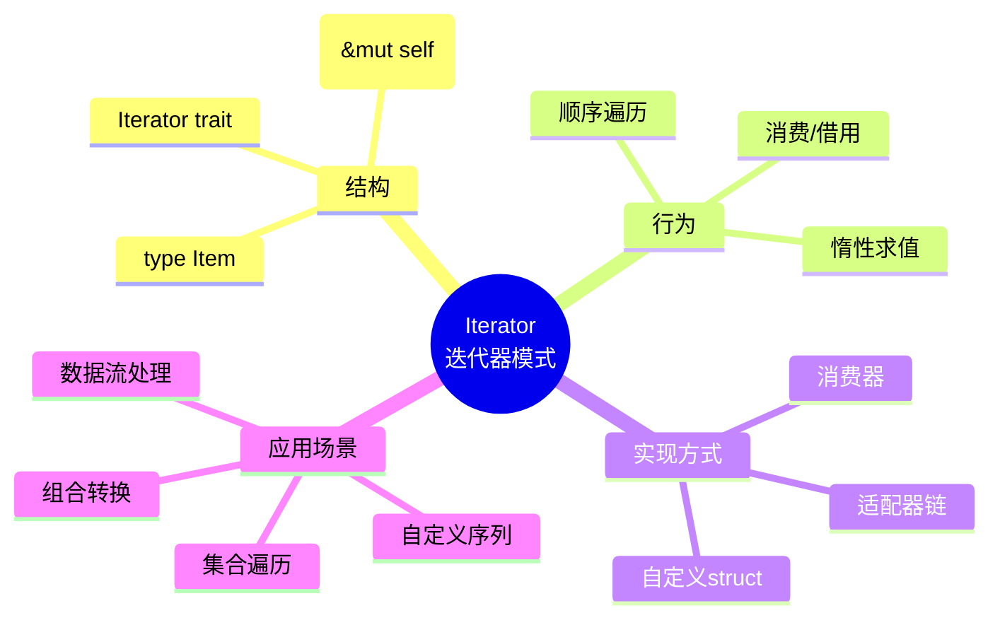
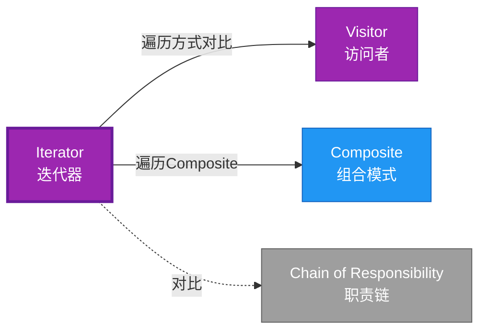

# Iterator 形式化分析

> **创建日期**: 2026-02-12
> **最后更新**: 2026-02-20
> **Rust 版本**: 1.93.0+ (Edition 2024)
> **状态**: ✅ 已完成
> **分类**: 行为型
> **安全边界**: 纯 Safe
> **23 模式矩阵**: [README §23 模式多维对比矩阵](../README.md#23-模式多维对比矩阵) 第 16 行（Iterator）
> **证明深度**: L3（完整证明）

---

## 📊 目录

- [Iterator 形式化分析](#iterator-形式化分析)
  - [📊 目录](#-目录)
  - [形式化定义](#形式化定义)
    - [Def 1.1（Iterator 结构）](#def-11iterator-结构)
    - [Axiom IT1（单次访问公理）](#axiom-it1单次访问公理)
    - [Axiom IT2（可变借用公理）](#axiom-it2可变借用公理)
    - [定理 IT-T1（Iterator trait 类型安全定理）](#定理-it-t1iterator-trait-类型安全定理)
    - [定理 IT-T2（可变借用安全定理）](#定理-it-t2可变借用安全定理)
    - [推论 IT-C1（纯 Safe Iterator）](#推论-it-c1纯-safe-iterator)
    - [概念定义-属性关系-解释论证 层次汇总](#概念定义-属性关系-解释论证-层次汇总)
  - [Rust 实现与代码示例](#rust-实现与代码示例)
  - [完整证明](#完整证明)
    - [形式化论证链](#形式化论证链)
    - [与 Rust 类型系统的联系](#与-rust-类型系统的联系)
    - [内存安全保证](#内存安全保证)
  - [典型场景](#典型场景)
  - [相关模式](#相关模式)
  - [反例：迭代中修改集合](#反例迭代中修改集合)
  - [实现变体](#实现变体)
  - [与标准库衔接](#与标准库衔接)
  - [选型决策树](#选型决策树)
  - [边界](#边界)
  - [与 Rust 1.93 的对应](#与-rust-193-的对应)
  - [思维导图](#思维导图)
  - [与其他模式的关系图](#与其他模式的关系图)
  - [实质内容五维自检](#实质内容五维自检)

---

## 形式化定义

### Def 1.1（Iterator 结构）

设 $I$ 为迭代器类型，$T$ 为元素类型。Iterator 是一个三元组 $\mathcal{IT} = (I, T, \mathit{next})$，满足：

- $\exists \mathit{next} : \&mut I \to \mathrm{Option}\langle T \rangle$
- 迭代器持有序列状态（位置、引用等）
- 消耗或借用产生元素；每次 `next` 至多产生一个元素
- **迭代契约**：每个元素至多访问一次；无重复、无遗漏

**形式化表示**：
$$\mathcal{IT} = \langle I, T, \mathit{next}: \&mut I \rightarrow \mathrm{Option}\langle T \rangle \rangle$$

---

### Axiom IT1（单次访问公理）

$$\forall i: I,\, \mathit{next}(i) = \mathrm{Some}(t) \implies t\text{ 不会被后续 }\mathit{next}\text{ 再次返回}$$

`next` 最多返回一次每个元素；无重复、无遗漏（由实现保证）。

### Axiom IT2（可变借用公理）

$$\mathit{next}(&mut self)\text{ 满足借用规则；同时仅一个活跃迭代器}$$

迭代器可变借用：`&mut self` 满足借用规则；同时仅一个活跃迭代器或为 FusedIterator。

---

### 定理 IT-T1（Iterator trait 类型安全定理）

`Iterator` trait 由标准库定义；`for` 糖语法保证类型安全。由 [type_system_foundations](../../../type_theory/type_system_foundations.md)。

**证明**：

1. **trait 定义**：

   ```rust
   trait Iterator {
       type Item;
       fn next(&mut self) -> Option<Self::Item>;
   }
   ```

2. **类型关联**：`Item` 关联类型确定元素类型
3. **for 语法糖**：

   ```rust
   for x in iter { ... }  // 等价于 while let Some(x) = iter.next()
   ```

4. **类型检查**：编译期检查 `x: Item`

由 type_system_foundations 保持性，得证。$\square$

---

### 定理 IT-T2（可变借用安全定理）

`&mut self` 可变借用保证迭代器内部状态一致；由 [borrow_checker_proof](../../../formal_methods/borrow_checker_proof.md)。

**证明**：

1. **独占借用**：`&mut self` 保证同一时间仅一个可变引用
2. **状态一致性**：
   - `next()` 可安全修改迭代器状态
   - 无数据竞争
3. **迭代器失效**：
   - 集合被修改后，迭代器失效（编译期检测或运行时检测）

由 borrow_checker_proof 互斥规则，得证。$\square$

---

### 推论 IT-C1（纯 Safe Iterator）

Iterator 为纯 Safe；`Iterator` trait 标准库定义，`for` 糖语法，无 `unsafe`。

**证明**：

1. `Iterator` trait：标准库 Safe API
2. `for` 循环：Safe 语法糖
3. 组合子：`map`、`filter` 等纯 Safe
4. 无 `unsafe` 块（用户实现可含 unsafe，但 trait 本身 Safe）

由 IT-T1、IT-T2 及 [safe_unsafe_matrix](../../05_boundary_system/safe_unsafe_matrix.md) SBM-T1，得证。$\square$

---

### 概念定义-属性关系-解释论证 层次汇总

| 层次 | 内容 | 本页对应 |
| :--- | :--- | :--- |
| **概念定义层** | Def 1.1（Iterator 结构）、Axiom IT1/IT2（无重复、可变借用） | 上 |
| **属性关系层** | Axiom IT1/IT2 $\rightarrow$ 定理 IT-T1/IT-T2 $\rightarrow$ 推论 IT-C1；依赖 type、borrow | 上 |
| **解释论证层** | IT-T1/IT-T2 完整证明；反例：迭代中修改集合 | §完整证明、§反例 |

---

## Rust 实现与代码示例

```rust
struct Counter { count: u32 }

impl Iterator for Counter {
    type Item = u32;
    fn next(&mut self) -> Option<Self::Item> {
        if self.count < 5 {
            let c = self.count;
            self.count += 1;
            Some(c)
        } else {
            None
        }
    }
}

// 使用
for n in Counter { count: 0 } {
    println!("{}", n);  // 0, 1, 2, 3, 4
}
```

**形式化对应**：`Counter` 即 $I$；`Item = u32` 即 $T$；`next(&mut self)` 即 $\mathit{next}$。

---

## 完整证明

### 形式化论证链

```
Axiom IT1 (单次访问)
    ↓ 依赖
type_system
    ↓ 保证
定理 IT-T1 (Iterator trait 类型安全)
    ↓ 组合
Axiom IT2 (可变借用)
    ↓ 依赖
borrow_checker_proof
    ↓ 保证
定理 IT-T2 (可变借用安全)
    ↓ 结论
推论 IT-C1 (纯 Safe Iterator)
```

### 与 Rust 类型系统的联系

| Rust 特性 | Iterator 实现 | 类型安全保证 |
| :--- | :--- | :--- |
| `trait Iterator` | 迭代器接口 | 类型关联 |
| `type Item` | 元素类型 | 关联类型 |
| `&mut self` | 可变借用 | 独占访问 |
| `for` 语法 | 遍历 | 类型检查 |

### 内存安全保证

1. **无悬垂**：迭代器可能持有集合引用，生命周期检查
2. **借用安全**：`&mut self` 独占访问
3. **迭代器失效**：修改集合导致迭代器失效（检测机制）
4. **类型安全**：`Item` 类型确定

---

## 典型场景

| 场景 | 说明 |
| :--- | :--- |
| 集合遍历 | `Vec`、`HashMap`、`BTreeMap` 等 |
| 惰性流 | `map`、`filter`、`take` 链式 |
| 自定义序列 | 计数器、生成器、游标 |
| 适配器 | `zip`、`chain`、`enumerate` |

---

## 相关模式

| 模式 | 关系 |
| :--- | :--- |
| [Visitor](visitor.md) | 遍历方式不同；Iterator 顺序，Visitor 深度优先 |
| [Composite](../02_structural/composite.md) | 可对 Composite 实现 Iterator |
| [Chain of Responsibility](chain_of_responsibility.md) | 链式传递 vs 迭代消费 |

---

## 反例：迭代中修改集合

**错误**：在 `for x in vec.iter()` 内对 `vec` 执行 `push`/`remove`。

```rust
let mut v = vec![1, 2, 3];
for x in v.iter() {
    v.push(*x);  // 编译错误：同时存在 borrow 与 borrow_mut
}
```

**结论**：Axiom IT2；可变借用互斥；`iter()` 与 `push` 不可同时活跃。

---

## 实现变体

| 变体 | 说明 | 适用 |
| :--- | :--- | :--- |
| 结构体 + next | 自定义迭代器；实现 trait | 新集合类型 |
| 适配器链 | `iter().map().filter()` | 惰性转换 |
| 消费器 | `collect`、`sum`、`fold` | 聚合结果 |

---

## 与标准库衔接

`Iterator` trait 为核心抽象；`map`、`filter`、`collect` 等为组合子。所有组合均保持 Safe。

---

## 选型决策树

```text
需要顺序遍历集合/序列？
├── 是 → 标准集合？ → iter()/into_iter()
│       └── 自定义序列？ → impl Iterator
├── 需按类型施加不同操作？ → Visitor
└── 需链式传递？ → Chain of Responsibility
```

---

## 边界

| 维度 | 分类 |
| :--- | :--- |
| 安全 | 纯 Safe |
| 支持 | 原生 |
| 表达 | 等价 |

---

## 与 Rust 1.93 的对应

| 1.93 特性 | 与本模式 | 说明 |
| :--- | :--- | :--- |
| 无新增影响 | — | 1.93 无影响 Iterator 语义的变更 |
| 92 项落点 | 无 | 本模式未涉及 [RUST_193_COUNTEREXAMPLES_INDEX](../../../RUST_193_COUNTEREXAMPLES_INDEX.md) 特定项 |

---

## 思维导图



---

## 与其他模式的关系图



---

## 实质内容五维自检

| 自检项 | 状态 | 说明 |
| :--- | :--- | :--- |
| 形式化 | ✅ | Def 1.1、Axiom IT1/IT2、定理 IT-T1/T2（L3 完整证明）、推论 IT-C1 |
| 代码 | ✅ | 可运行示例 |
| 场景 | ✅ | 典型场景表 |
| 反例 | ✅ | 迭代中修改集合 |
| 衔接 | ✅ | 标准库 Iterator、ownership |
| 权威对应 | ✅ | [GoF](../README.md#与-gof-原书对应)、[formal_methods](../../../formal_methods/README.md)、[INTERNATIONAL_FORMAL_VERIFICATION_INDEX](../../../INTERNATIONAL_FORMAL_VERIFICATION_INDEX.md) |
