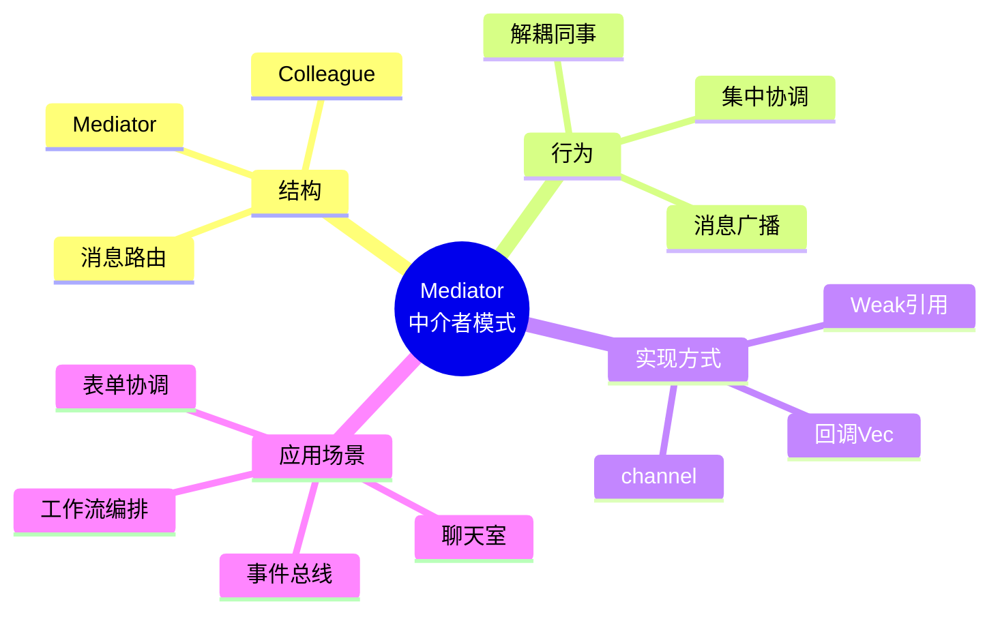
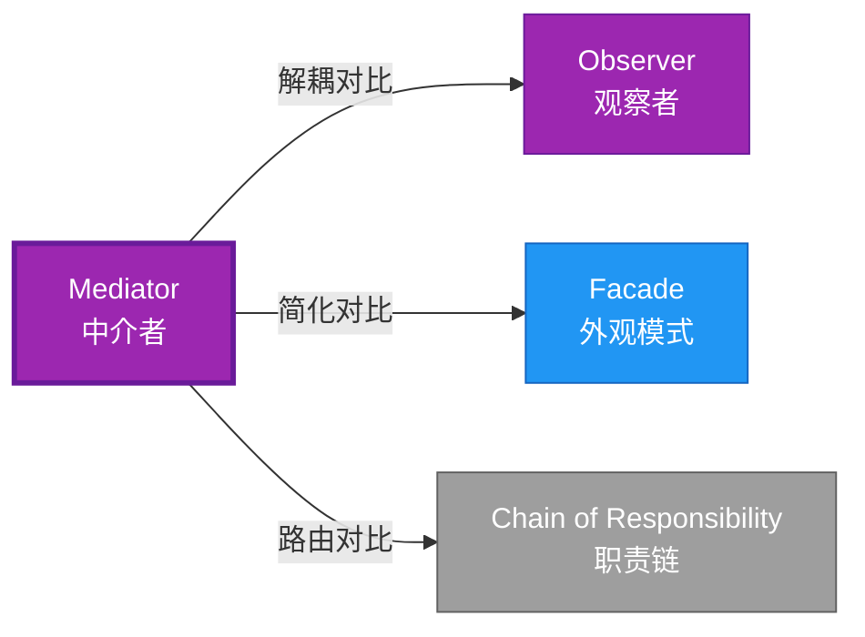

# Mediator 形式化分析

> **创建日期**: 2026-02-12
> **最后更新**: 2026-02-28
> **Rust 版本**: 1.93.1+ (Edition 2024)
> **状态**: ✅ 已完成
> **分类**: 行为型
> **安全边界**: 纯 Safe
> **23 模式矩阵**: [README §23 模式多维对比矩阵](../README.md#23-模式多维对比矩阵) 第 17 行（Mediator）
> **证明深度**: L3（完整证明）

---

## 📊 目录 {#-目录}

- [Mediator 形式化分析](#mediator-形式化分析)
  - [📊 目录 {#-目录}](#-目录--目录)
  - [形式化定义](#形式化定义)
    - [Def 1.1（Mediator 结构）](#def-11mediator-结构)
    - [Axiom ME1（无直接耦合公理）](#axiom-me1无直接耦合公理)
    - [Axiom ME2（无循环引用公理）](#axiom-me2无循环引用公理)
    - [定理 ME-T1（循环引用避免定理）](#定理-me-t1循环引用避免定理)
    - [定理 ME-T2（消息路由安全定理）](#定理-me-t2消息路由安全定理)
    - [推论 ME-C1（纯 Safe Mediator）](#推论-me-c1纯-safe-mediator)
    - [概念定义-属性关系-解释论证 层次汇总](#概念定义-属性关系-解释论证-层次汇总)
  - [Rust 实现与代码示例](#rust-实现与代码示例)
  - [完整证明](#完整证明)
    - [形式化论证链](#形式化论证链)
  - [典型场景](#典型场景)
  - [完整场景示例：聊天室（channel 实现）](#完整场景示例聊天室channel-实现)
  - [相关模式](#相关模式)
  - [实现变体](#实现变体)
  - [反例：同事直接引用](#反例同事直接引用)
  - [选型决策树](#选型决策树)
  - [与 GoF 对比](#与-gof-对比)
  - [边界](#边界)
  - [与 Rust 1.93 的对应](#与-rust-193-的对应)
  - [思维导图](#思维导图)
  - [与其他模式的关系图](#与其他模式的关系图)
  - [实质内容五维自检](#实质内容五维自检)

---

## 形式化定义

### Def 1.1（Mediator 结构）

设 $M$ 为中介者类型，$C_1, \ldots, C_n$ 为同事类型。Mediator 是一个三元组 $\mathcal{ME} = (M, \{C_i\}, \mathit{mediate})$，满足：

- $M$ 持有或可访问 $C_1, \ldots, C_n$
- $C_i$ 通过 $M$ 与 $C_j$ 通信，而非直接引用
- $\mathit{mediate}(m, c_i, \mathit{msg})$ 由 $M$ 路由至目标
- **去耦合**：同事间无直接依赖

**形式化表示**：
$$\mathcal{ME} = \langle M, \{C_i\}_{i=1}^n, \mathit{mediate}: M \times C_i \times \mathit{Msg} \rightarrow \mathrm{Action} \rangle$$

---

### Axiom ME1（无直接耦合公理）

$$\forall i \neq j,\, C_i\text{ 不直接引用 }C_j\text{；仅通过 }M\text{ 通信}$$

同事间无直接耦合；仅通过中介通信。

### Axiom ME2（无循环引用公理）

$$\text{避免循环引用；用 }\mathit{Weak}\text{ 或重构为无环}$$

避免循环引用；用 `Weak` 或重构为无环。

---

### 定理 ME-T1（循环引用避免定理）

`Rc`/`Weak` 或 `Arc` 管理循环引用时避免自引用；由 [ownership_model](../../../formal_methods/ownership_model.md) 与借用规则。

**证明**：

1. **弱引用模式**：

   ```rust
   struct Mediator { colleagues: Vec<Weak<Colleague>> }
   ```

2. **所有权与弱引用**：
   - `Rc<Colleague>`：拥有同事
   - `Weak<Colleague>`：不增加引用计数
   - 避免循环引用导致的内存泄漏

3. **升级安全**：
   - `Weak::upgrade()` 返回 `Option<Rc<T>>`
   - 原对象已释放时返回 `None`

由 ownership_model 及 `Weak` 语义，得证。$\square$

---

### 定理 ME-T2（消息路由安全定理）

channel 或回调消息传递满足借用规则；无数据竞争。

**证明**：

1. **channel 模式**：

   ```rust
   let (tx, rx) = mpsc::channel();
   // tx.send(msg) → 所有权转移
   // rx.recv() → 接收所有权
   ```

2. **所有权转移**：
   - 消息发送时所有权转移
   - 无共享可变状态
   - 无数据竞争

3. **类型安全**：
   - `Send` 约束保证跨线程安全
   - 编译期检查

由 ownership_model 及 Send/Sync 约束，得证。$\square$

---

### 推论 ME-C1（纯 Safe Mediator）

Mediator 为纯 Safe；`Vec<Box<dyn Fn>>` 或 channel 路由，无 `unsafe`。

**证明**：

1. `Weak` 引用：Safe API
2. channel：标准库 Safe API
3. 回调：`Box<dyn Fn>` Safe trait 对象
4. 无 `unsafe` 块

由 ME-T1、ME-T2 及 [safe_unsafe_matrix](../../05_boundary_system/safe_unsafe_matrix.md) SBM-T1，得证。$\square$

---

### 概念定义-属性关系-解释论证 层次汇总

| 层次 | 内容 | 本页对应 |
| :--- | :--- | :--- |
| **概念定义层** | Def 1.1（Mediator 结构）、Axiom ME1/ME2（无直接耦合、避免循环引用） | 上 |
| **属性关系层** | Axiom ME1/ME2 $\rightarrow$ 定理 ME-T1/ME-T2 $\rightarrow$ 推论 ME-C1；依赖 ownership、borrow | 上 |
| **解释论证层** | ME-T1/ME-T2 完整证明；反例：同事直接引用 | §完整证明、§反例 |

---

## Rust 实现与代码示例

```rust
struct Mediator {
    handlers: Vec<Box<dyn Fn(&str)>>,
}

impl Mediator {
    fn broadcast(&self, msg: &str) {
        for h in &self.handlers {
            h(msg);
        }
    }
}

// 同事通过 Mediator 通信
let m = Mediator {
    handlers: vec![
        Box::new(|msg| println!("A received: {}", msg)),
        Box::new(|msg| println!("B received: {}", msg)),
    ],
};
m.broadcast("hello");
```

---

## 完整证明

### 形式化论证链

```text
Axiom ME1 (无直接耦合)
    ↓ 实现
channel / Weak
    ↓ 保证
定理 ME-T2 (消息路由安全)
    ↓ 组合
Axiom ME2 (无循环引用)
    ↓ 依赖
ownership_model
    ↓ 保证
定理 ME-T1 (循环引用避免)
    ↓ 结论
推论 ME-C1 (纯 Safe Mediator)
```

---

## 典型场景

| 场景 | 说明 |
| :--- | :--- |
| 对话框/表单 | 多个控件互不引用，通过 Mediator 协调 |
| 聊天室 | 用户仅知 Mediator，消息经其广播 |
| 工作流编排 | 任务节点通过协调器通信 |
| 事件总线 | 发布/订阅中心化路由 |

---

## 完整场景示例：聊天室（channel 实现）

```rust
use std::sync::mpsc;
use std::thread;

struct ChatMessage { from: String, content: String }

struct ChatMediator {
    tx: mpsc::Sender<ChatMessage>,
}

impl ChatMediator {
    fn broadcast(&self, msg: ChatMessage) {
        let _ = self.tx.send(msg);
    }
}

fn run_room(rx: mpsc::Receiver<ChatMessage>) {
    for msg in rx {
        println!("[broadcast] {}: {}", msg.from, msg.content);
    }
}
```

---

## 相关模式

| 模式 | 关系 |
| :--- | :--- |
| [Observer](observer.md) | 同为解耦；Mediator 集中路由，Observer 一对多 |
| [Facade](../02_structural/facade.md) | Facade 简化接口；Mediator 协调多对象 |
| [Chain of Responsibility](chain_of_responsibility.md) | 链式传递 vs 集中路由 |

---

## 实现变体

| 变体 | 说明 | 适用 |
| :--- | :--- | :--- |
| `Vec<Box<dyn Fn>>` | 广播回调；无同事引用 | 简单事件总线 |
| `Weak<Colleague>` | 同事注册；避免循环 | 需同事身份 |
| channel | 消息传递；完全解耦 | 异步、跨线程 |

---

## 反例：同事直接引用

**错误**：Colleague 直接持有其他 Colleague 的引用，绕过 Mediator。

```rust
struct BadColleague {
    mediator: Rc<Mediator>,
    other: Rc<Colleague>,  // 直接耦合，违反 Axiom ME1
}
```

---

## 选型决策树

```text
需要多对象协调、避免直接耦合？
├── 是 → 集中路由？ → Mediator（结构体 + channel / Weak）
├── 需一对多通知？ → Observer
├── 需简化多接口？ → Facade
└── 需沿链传递？ → Chain of Responsibility
```

---

## 与 GoF 对比

| GoF | Rust 对应 | 差异 |
| :--- | :--- | :--- |
| 中介者接口 | trait 或 结构体 | 等价 |
| 同事注册 | Vec、Weak | 等价 |
| 无直接引用 | 仅持 Mediator | 等价 |

---

## 边界

| 维度 | 分类 |
| :--- | :--- |
| 安全 | 纯 Safe |
| 支持 | 原生 |
| 表达 | 等价 |

---

## 与 Rust 1.93 的对应

| 1.93 特性 | 与本模式 | 说明 |
| :--- | :--- | :--- |
| 无新增影响 | — | 1.93 无影响 Mediator 语义的变更 |
| 92 项落点 | 无 | 本模式未涉及 [RUST_193_COUNTEREXAMPLES_INDEX](../../../RUST_193_COUNTEREXAMPLES_INDEX.md) 特定项 |

---

## 思维导图



---

## 与其他模式的关系图



---

## 实质内容五维自检

| 自检项 | 状态 | 说明 |
| :--- | :--- | :--- |
| 形式化 | ✅ | Def 1.1、Axiom ME1/ME2、定理 ME-T1/T2（L3 完整证明）、推论 ME-C1 |
| 代码 | ✅ | 可运行示例、聊天室 |
| 场景 | ✅ | 典型场景、完整示例 |
| 反例 | ✅ | 同事直接引用 |
| 衔接 | ✅ | channel、Send/Sync、CE-T2 |
| 权威对应 | ✅ | [GoF](../README.md#与-gof-原书对应)、[formal_methods](../../../formal_methods/README.md)、[INTERNATIONAL_FORMAL_VERIFICATION_INDEX](../../../INTERNATIONAL_FORMAL_VERIFICATION_INDEX.md) |
