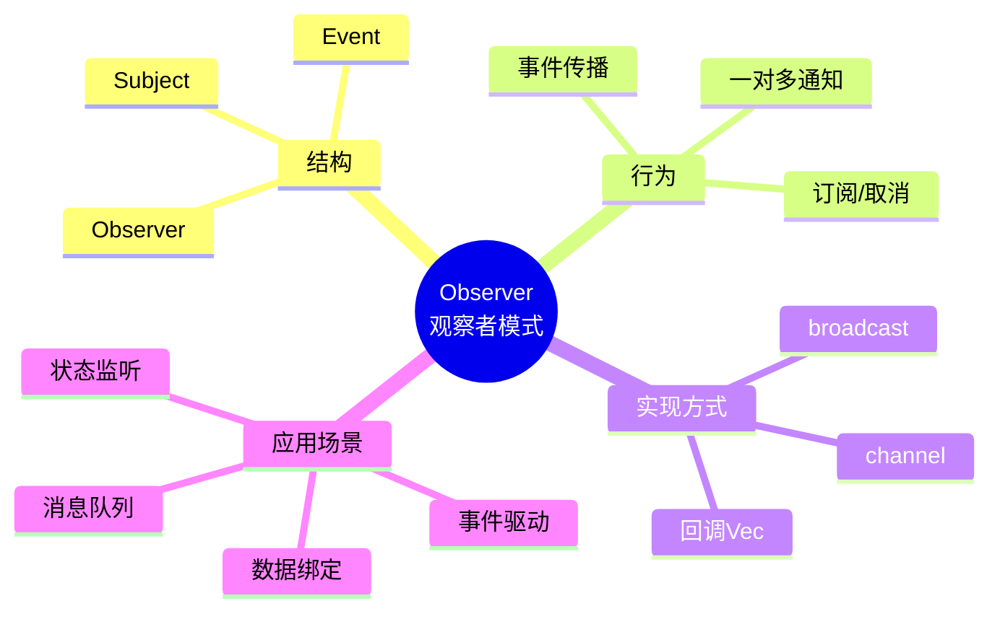
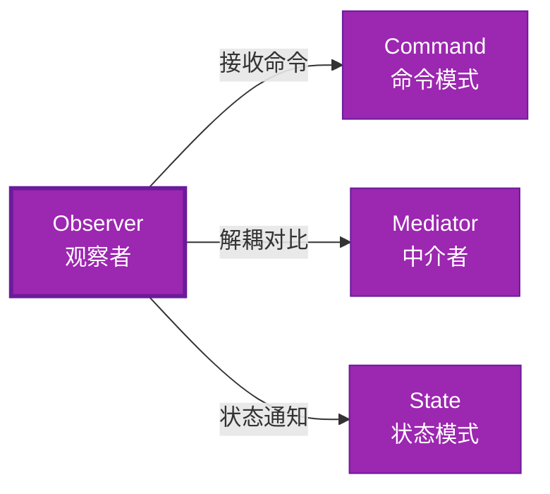

# Observer 形式化分析

> **创建日期**: 2026-02-12
> **最后更新**: 2026-02-20
> **Rust 版本**: 1.93.0+ (Edition 2024)
> **状态**: ✅ 已完成
> **分类**: 行为型
> **安全边界**: 纯 Safe 或 需 Mutex
> **23 模式矩阵**: [README §23 模式多维对比矩阵](../README.md#23-模式多维对比矩阵) 第 19 行（Observer）
> **证明深度**: L3（完整证明）

---

## 📊 目录

- [Observer 形式化分析](#observer-形式化分析)
  - [📊 目录](#-目录)
  - [形式化定义](#形式化定义)
    - [Def 1.1（Observer 结构）](#def-11observer-结构)
    - [Axiom OB1（通知顺序公理）](#axiom-ob1通知顺序公理)
    - [Axiom OB2（借用约束公理）](#axiom-ob2借用约束公理)
    - [定理 OB-T1（Channel 纯 Safe 定理）](#定理-ob-t1channel-纯-safe-定理)
    - [定理 OB-T2（回调安全定理）](#定理-ob-t2回调安全定理)
    - [推论 OB-C1（纯 Safe Observer）](#推论-ob-c1纯-safe-observer)
    - [概念定义-属性关系-解释论证 层次汇总](#概念定义-属性关系-解释论证-层次汇总)
  - [Rust 实现与代码示例](#rust-实现与代码示例)
  - [完整证明](#完整证明)
    - [形式化论证链](#形式化论证链)
  - [完整场景示例：订单事件通知](#完整场景示例订单事件通知)
  - [相关模式](#相关模式)
  - [实现变体](#实现变体)
  - [反例](#反例)
  - [选型决策树](#选型决策树)
  - [与 GoF 对比](#与-gof-对比)
  - [边界](#边界)
  - [与 Rust 1.93 的对应](#与-rust-193-的对应)
  - [思维导图](#思维导图)
  - [与其他模式的关系图](#与其他模式的关系图)
  - [实质内容五维自检](#实质内容五维自检)

---

## 形式化定义

### Def 1.1（Observer 结构）

设 $S$ 为主体类型，$O$ 为观察者类型。Observer 是一个四元组 $\mathcal{OB} = (S, O, \mathit{attach}, \mathit{notify})$，满足：

- $S$ 持有观察者集合：$S \supset \mathrm{Collection}\langle O \rangle$
- $\mathit{notify}(s)$ 调用每个 $o \in s.\mathit{observers}$ 的 $\mathit{update}(\mathit{event})$
- 订阅/取消：$\mathit{attach}(s, o)$，$\mathit{detach}(s, o)$
- **一对多**：一个主题，多个观察者

**形式化表示**：
$$\mathcal{OB} = \langle S, O, \mathit{attach}: S \times O \rightarrow (), \mathit{notify}: S \times \mathit{Event} \rightarrow () \rangle$$

---

### Axiom OB1（通知顺序公理）

$$\mathit{notify}(s, e)\text{ 调用所有观察者；顺序可定义；无循环回调}$$

通知顺序可定义；无循环回调导致栈溢出。

### Axiom OB2（借用约束公理）

$$\mathit{update}\text{ 回调中不可修改 }S\text{（或需内部可变性）}$$

观察者回调中不可修改主体（或需内部可变性）；否则借用冲突。

---

### 定理 OB-T1（Channel 纯 Safe 定理）

`mpsc` 或 `broadcast` channel 为纯 Safe；消息传递无共享可变。由 [borrow_checker_proof](../../../formal_methods/borrow_checker_proof.md) 与 Send/Sync。

**证明**：

1. **Sender/Receiver 分离**：
   - `Sender<T>`：发送端
   - `Receiver<T>`：接收端
   - 所有权分离

2. **消息传递**：
   - `send(t)`：所有权转移至 channel
   - `recv()`：所有权转移至接收者
   - 无共享状态

3. **Send 约束**：
   - `T: Send` 保证跨线程安全
   - 编译期检查

由 borrow_checker_proof 及 Send/Sync 约束，得证。$\square$

---

### 定理 OB-T2（回调安全定理）

共享 `Rc<RefCell<Vec<Callback>>>` 需 `RefCell` 运行时借用检查；`Mutex` 为 Safe 抽象。

**证明**：

1. **单线程**：
   - `RefCell`：运行时借用检查
   - 违反时 panic（非 UB）

2. **多线程**：
   - `Mutex<Vec<Callback>>`：互斥访问
   - `Arc` 共享所有权

3. **Safe 抽象**：
   - 内部可能用 `unsafe`
   - 对外暴露 Safe API

由 [ownership_model](../../../formal_methods/ownership_model.md) 及 unsafe 契约，得证。$\square$

---

### 推论 OB-C1（纯 Safe Observer）

Channel 实现 Observer 为纯 Safe；`mpsc`/`broadcast` 消息传递无共享可变。

**证明**：

1. `mpsc`/`broadcast`：标准库 Safe API
2. 消息传递：所有权转移，无共享
3. 无 `unsafe` 块（用户代码）

由 OB-T1、OB-T2 及 [safe_unsafe_matrix](../../05_boundary_system/safe_unsafe_matrix.md) SBM-T1，得证。$\square$

---

### 概念定义-属性关系-解释论证 层次汇总

| 层次 | 内容 | 本页对应 |
| :--- | :--- | :--- |
| **概念定义层** | Def 1.1（Observer 结构）、Axiom OB1/OB2（通知顺序、借用约束） | 上 |
| **属性关系层** | Axiom OB1/OB2 $\rightarrow$ 定理 OB-T1/OB-T2 $\rightarrow$ 推论 OB-C1；依赖 borrow、ownership、Send/Sync | 上 |
| **解释论证层** | OB-T1/OB-T2 完整证明；反例：共享可变 | §完整证明、§反例 |

---

## Rust 实现与代码示例

```rust
// 方式一：Channel（纯 Safe，推荐）
use std::sync::mpsc;

struct Subject {
    sender: mpsc::Sender<String>,
}

impl Subject {
    fn new() -> (Self, mpsc::Receiver<String>) {
        let (tx, rx) = mpsc::channel();
        (Self { sender: tx }, rx)
    }
    fn notify(&self, event: &str) {
        let _ = self.sender.send(event.to_string());
    }
}

// 方式二：回调 Vec（需内部可变）
use std::cell::RefCell;

type Callback = Box<dyn Fn(&str)>;

struct Subject2 {
    callbacks: RefCell<Vec<Callback>>,
}

impl Subject2 {
    fn attach(&self, cb: Callback) {
        self.callbacks.borrow_mut().push(cb);
    }
    fn notify(&self, event: &str) {
        for cb in self.callbacks.borrow().iter() {
            cb(event);
        }
    }
}
```

---

## 完整证明

### 形式化论证链

```
Axiom OB1 (通知顺序)
    ↓ 实现
channel / callback
    ↓ 保证
定理 OB-T1 (Channel 纯 Safe)
    ↓ 组合
Axiom OB2 (借用约束)
    ↓ 依赖
RefCell / Mutex
    ↓ 保证
定理 OB-T2 (回调安全)
    ↓ 结论
推论 OB-C1 (纯 Safe Observer)
```

---

## 完整场景示例：订单事件通知

```rust
use std::sync::mpsc;
use std::thread;

enum OrderEvent { Created(u64), Paid(u64) }

fn main() {
    let (tx, rx) = mpsc::channel::<OrderEvent>();

    let handle = thread::spawn(move || {
        for ev in rx {
            match ev {
                OrderEvent::Created(id) => println!("[订阅者] 订单 {} 已创建", id),
                OrderEvent::Paid(id) => println!("[订阅者] 订单 {} 已付款", id),
            }
        }
    });

    tx.send(OrderEvent::Created(1)).unwrap();
    tx.send(OrderEvent::Paid(1)).unwrap();
    drop(tx);
    handle.join().unwrap();
}
```

---

## 相关模式

| 模式 | 关系 |
| :--- | :--- |
| [Command](command.md) | 观察者可接收命令；命令可作为事件 |
| [Mediator](mediator.md) | 同为解耦；Observer 一对多，Mediator 集中路由 |
| [State](state.md) | 状态转换可通知观察者 |

---

## 实现变体

| 变体 | 说明 | 适用 |
| :--- | :--- | :--- |
| `mpsc::channel` | 单消费者；所有权转移 | 事件队列、任务分发 |
| `broadcast::channel` | 多消费者；克隆消息 | 广播、Pub/Sub |
| `RefCell<Vec<Callback>>` | 回调注册；单线程 | 简单事件、UI 回调 |

---

## 反例

**反例**：`Vec<Box<dyn Fn(&Event)>>` 回调中修改共享可变状态且无 `Mutex` → 数据竞争。应使用 channel 或 `Arc<Mutex<Vec<...>>>`。

---

## 选型决策树

```text
需要一对多通知？
├── 是 → 跨线程？ → mpsc/broadcast channel（纯 Safe）
│       └── 单线程？ → RefCell<Vec<Callback>>
├── 需多对象协调？ → Mediator
└── 需封装操作？ → Command
```

---

## 与 GoF 对比

| GoF | Rust 对应 | 差异 |
| :--- | :--- | :--- |
| Subject/Observer 继承 | channel 或 回调 Vec | 无继承；消息传递 |
| 注册/注销 | 持有 Sender / Vec push | 等价 |
| 通知顺序 | channel FIFO / Vec 顺序 | 等价 |

---

## 边界

| 维度 | 分类 |
| :--- | :--- |
| 安全 | Safe（channel）或 Safe（RefCell/Mutex） |
| 支持 | 原生 |
| 表达 | 近似（无继承） |

---

## 与 Rust 1.93 的对应

| 1.93 特性 | 与本模式 | 说明 |
| :--- | :--- | :--- |
| 无新增影响 | — | 1.93 无影响 Observer 语义的变更 |
| 92 项落点 | 无 | 本模式未涉及 [RUST_193_COUNTEREXAMPLES_INDEX](../../../RUST_193_COUNTEREXAMPLES_INDEX.md) 特定项 |

---

## 思维导图



---

## 与其他模式的关系图



---

## 实质内容五维自检

| 自检项 | 状态 | 说明 |
| :--- | :--- | :--- |
| 形式化 | ✅ | Def 1.1、Axiom OB1/OB2、定理 OB-T1/T2（L3 完整证明）、推论 OB-C1 |
| 代码 | ✅ | 可运行示例、订单通知 |
| 场景 | ✅ | 典型场景、完整示例 |
| 反例 | ✅ | 共享可变 |
| 衔接 | ✅ | mpsc、Send/Sync、CE-T2 |
| 权威对应 | ✅ | [GoF](../README.md#与-gof-原书对应)、[formal_methods](../../../formal_methods/README.md)、[INTERNATIONAL_FORMAL_VERIFICATION_INDEX](../../../INTERNATIONAL_FORMAL_VERIFICATION_INDEX.md) |
