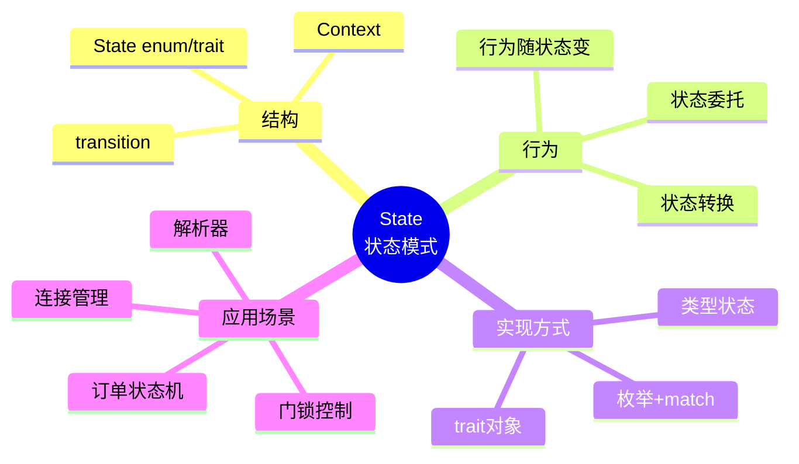
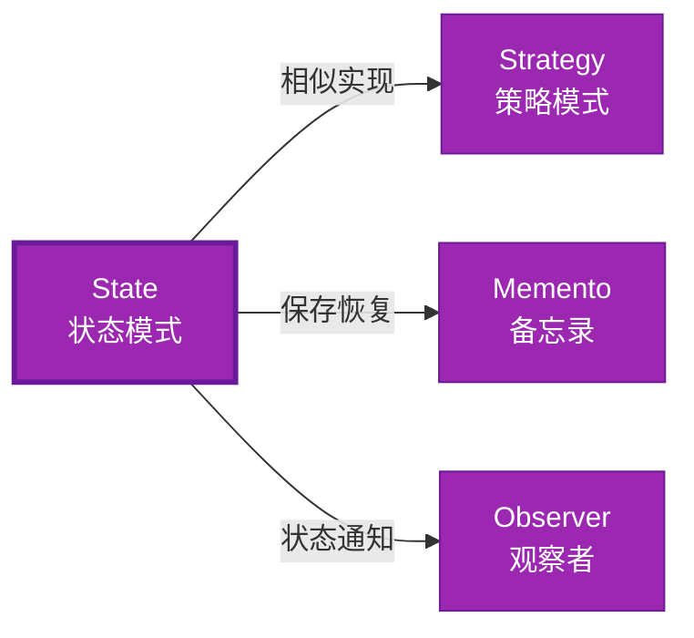

# State 形式化分析

> **创建日期**: 2026-02-12
> **最后更新**: 2026-02-28
> **Rust 版本**: 1.93.1+ (Edition 2024)
> **状态**: ✅ 已完成
> **分类**: 行为型
> **安全边界**: 纯 Safe
> **23 模式矩阵**: [README §23 模式多维对比矩阵](../README.md#23-模式多维对比矩阵) 第 20 行（State）
> **证明深度**: L3（完整证明）

---

## 📊 目录 {#-目录}

- [State 形式化分析](#state-形式化分析)
  - [📊 目录 {#-目录}](#-目录--目录)
  - [形式化定义](#形式化定义)
    - [Def 1.1（State 结构）](#def-11state-结构)
    - [Axiom ST1（状态机全定义公理）](#axiom-st1状态机全定义公理)
    - [定理 ST-T1（枚举穷尽定理）](#定理-st-t1枚举穷尽定理)
    - [定理 ST-T2（类型状态编译期消除定理）](#定理-st-t2类型状态编译期消除定理)
    - [推论 ST-C1（纯 Safe State）](#推论-st-c1纯-safe-state)
    - [概念定义-属性关系-解释论证 层次汇总](#概念定义-属性关系-解释论证-层次汇总)
  - [Rust 实现与代码示例](#rust-实现与代码示例)
  - [完整证明](#完整证明)
    - [形式化论证链](#形式化论证链)
  - [典型场景](#典型场景)
  - [完整场景示例：订单状态机](#完整场景示例订单状态机)
  - [相关模式](#相关模式)
  - [实现变体](#实现变体)
  - [反例：非法状态转换](#反例非法状态转换)
  - [选型决策树](#选型决策树)
  - [与 GoF 对比](#与-gof-对比)
  - [边界](#边界)
  - [与 Rust 1.93 的对应](#与-rust-193-的对应)
  - [思维导图](#思维导图)
  - [与其他模式的关系图](#与其他模式的关系图)
  - [实质内容五维自检](#实质内容五维自检)

---

## 形式化定义

### Def 1.1（State 结构）

设 $C$ 为上下文类型，$S$ 为状态类型。State 是一个三元组 $\mathcal{ST} = (C, S, \mathit{transition})$，满足：

- $C$ 持有当前状态：$C \supset S$
- $\mathit{request}(c)$ 委托 $c.\mathit{state}.\mathit{handle}(c)$
- 状态可转换：$\mathit{state}(c) \mapsto S'$，由当前状态决定下一状态
- **状态机**：转移函数全定义，无非法状态

**形式化表示**：
$$\mathcal{ST} = \langle C, S, \mathit{transition}: C \times S \rightarrow S' \rangle$$

---

### Axiom ST1（状态机全定义公理）

$$\forall s: S,\, \forall e: \mathit{Event},\, \exists s': S,\, \delta(s, e) = s'$$

状态转换有穷；无非法状态；转换函数全定义。

---

### 定理 ST-T1（枚举穷尽定理）

枚举 + match 或类型状态（零开销）实现；由 [type_system_foundations](../../../type_theory/type_system_foundations.md) 穷尽匹配保证完备性。

**证明**：

1. **枚举状态**：

   ```rust
   enum State { A, B, C }
   ```

2. **穷尽匹配**：

   ```rust
   match state { State::A => ..., State::B => ..., State::C => ... }
   ```

   - 编译器检查所有变体被处理

3. **完备性**：所有状态转换有定义

由 type_system_foundations 穷尽匹配，得证。$\square$

---

### 定理 ST-T2（类型状态编译期消除定理）

类型状态模式（泛型相位）在编译期消除非法状态；如 `Locked` 与 `Unlocked` 为不同类型。

**证明**：

1. **类型状态定义**：

   ```rust
   struct Config<State> { data: i32, _marker: PhantomData<State> }
   struct Locked;
   struct Unlocked;
   ```

2. **状态特定方法**：

   ```rust
   impl Config<Locked> { fn unlock(self) -> Config<Unlocked> { ... } }
   impl Config<Unlocked> { fn lock(self) -> Config<Locked> { ... } fn get(&self) -> i32 { ... } }
   ```

3. **编译期检查**：
   - `Config<Locked>::get()` 不存在 → 编译错误
   - 非法状态不可构造

由 Rust 类型系统，得证。$\square$

---

### 推论 ST-C1（纯 Safe State）

State 为纯 Safe；`enum` + `match` 或类型状态模式，无 `unsafe`。

**证明**：

1. `enum` + `match`：纯 Safe
2. 类型状态：泛型约束，纯 Safe
3. 无 `unsafe` 块

由 ST-T1、ST-T2 及 [safe_unsafe_matrix](../../05_boundary_system/safe_unsafe_matrix.md) SBM-T1，得证。$\square$

---

### 概念定义-属性关系-解释论证 层次汇总

| 层次 | 内容 | 本页对应 |
| :--- | :--- | :--- |
| **概念定义层** | Def 1.1（State 结构）、Axiom ST1（转换全定义） | 上 |
| **属性关系层** | Axiom ST1 $\rightarrow$ 定理 ST-T1/ST-T2 $\rightarrow$ 推论 ST-C1 | 上 |
| **解释论证层** | ST-T1/ST-T2 完整证明；反例：非法状态转换 | §完整证明、§反例 |

---

## Rust 实现与代码示例

```rust
enum State { A, B, C }

struct Context { state: State }

impl Context {
    fn request(&mut self) {
        match &self.state {
            State::A => { self.state = State::B; }
            State::B => { self.state = State::C; }
            State::C => { self.state = State::A; }
        }
    }
}

// 类型状态（零成本）
struct Config<State> { data: i32, _marker: std::marker::PhantomData<State> }
struct Locked;
struct Unlocked;

impl Config<Locked> {
    fn new() -> Self { Self { data: 0, _marker: std::marker::PhantomData } }
    fn unlock(self) -> Config<Unlocked> { Config { data: self.data, _marker: std::marker::PhantomData } }
}

impl Config<Unlocked> {
    fn lock(self) -> Config<Locked> { Config { data: self.data, _marker: std::marker::PhantomData } }
    fn get(&self) -> i32 { self.data }
}
```

---

## 完整证明

### 形式化论证链

```text
Axiom ST1 (状态机全定义)
    ↓ 实现
enum + match / 类型状态
    ↓ 保证
定理 ST-T1 (枚举穷尽)
    ↓ 组合
定理 ST-T2 (类型状态编译期消除)
    ↓ 结论
推论 ST-C1 (纯 Safe State)
```

---

## 典型场景

| 场景 | 说明 |
| :--- | :--- |
| 连接状态 | 未连接/连接中/已连接/断开 |
| 订单状态 | 待支付/已支付/已发货/已完成 |
| 门/锁 | Locked/Unlocked（类型状态） |
| 解析器 | 解析阶段状态机 |

---

## 完整场景示例：订单状态机

```rust
#[derive(Clone, Copy, PartialEq)]
enum OrderState { Pending, Paid, Shipped, Completed }

struct Order { id: u64, state: OrderState }

impl Order {
    fn new(id: u64) -> Self { Self { id, state: OrderState::Pending } }
    fn pay(&mut self) -> Result<(), String> {
        match self.state {
            OrderState::Pending => { self.state = OrderState::Paid; Ok(()) }
            _ => Err("cannot pay".into()),
        }
    }
    fn ship(&mut self) -> Result<(), String> {
        match self.state {
            OrderState::Paid => { self.state = OrderState::Shipped; Ok(()) }
            _ => Err("cannot ship".into()),
        }
    }
    fn complete(&mut self) -> Result<(), String> {
        match self.state {
            OrderState::Shipped => { self.state = OrderState::Completed; Ok(()) }
            _ => Err("cannot complete".into()),
        }
    }
}
```

---

## 相关模式

| 模式 | 关系 |
| :--- | :--- |
| [Strategy](strategy.md) | 策略可替换；State 可转换；实现相似 |
| [Memento](memento.md) | 保存/恢复状态 |
| [Observer](observer.md) | 状态转换可通知观察者 |

---

## 实现变体

| 变体 | 说明 | 适用 |
| :--- | :--- | :--- |
| 枚举 + match | 运行时状态；转换灵活 | 状态多、转换复杂 |
| 类型状态（泛型相位） | 编译期；非法状态不可构造 | 门/锁、有限状态机 |
| trait 状态对象 | `Box<dyn State>`；多态状态 | 状态实现各异、需动态扩展 |

---

## 反例：非法状态转换

**错误**：枚举状态允许不该存在的转换，或漏掉分支。

```rust
match &self.state {
    State::A => { self.state = State::B; }
    State::B => { self.state = State::C; }
    State::C => { }  // 漏掉 A
}
```

---

## 选型决策树

```text
需要状态转换、非法状态不可达？
├── 是 → 编译期保证？ → 类型状态泛型
│       └── 运行时灵活？ → 枚举 + match
├── 需可替换算法？ → Strategy
└── 需保存/恢复？ → Memento
```

---

## 与 GoF 对比

| GoF | Rust 对应 | 差异 |
| :--- | :--- | :--- |
| 状态类层次 | 枚举或 trait | 枚举更严格 |
| 上下文委托 | 持有 State 字段 | 等价 |
| 类型状态 | 泛型相位 | Rust 更强 |

---

## 边界

| 维度 | 分类 |
| :--- | :--- |
| 安全 | 纯 Safe |
| 支持 | 原生 |
| 表达 | 等价 |

---

## 与 Rust 1.93 的对应

| 1.93 特性 | 与本模式 | 说明 |
| :--- | :--- | :--- |
| 无新增影响 | — | 1.93 无影响 State 语义的变更 |
| 92 项落点 | 无 | 本模式未涉及 [RUST_193_COUNTEREXAMPLES_INDEX](../../../RUST_193_COUNTEREXAMPLES_INDEX.md) 特定项 |

---

## 思维导图



---

## 与其他模式的关系图



---

## 实质内容五维自检

| 自检项 | 状态 | 说明 |
| :--- | :--- | :--- |
| 形式化 | ✅ | Def 1.1、Axiom ST1、定理 ST-T1/T2（L3 完整证明）、推论 ST-C1 |
| 代码 | ✅ | 可运行示例、订单状态机 |
| 场景 | ✅ | 典型场景、完整示例 |
| 反例 | ✅ | 非法状态转换 |
| 衔接 | ✅ | ownership、CE-T2、match |
| 权威对应 | ✅ | [GoF](../README.md#与-gof-原书对应)、[formal_methods](../../../formal_methods/README.md)、[INTERNATIONAL_FORMAL_VERIFICATION_INDEX](../../../INTERNATIONAL_FORMAL_VERIFICATION_INDEX.md) |
