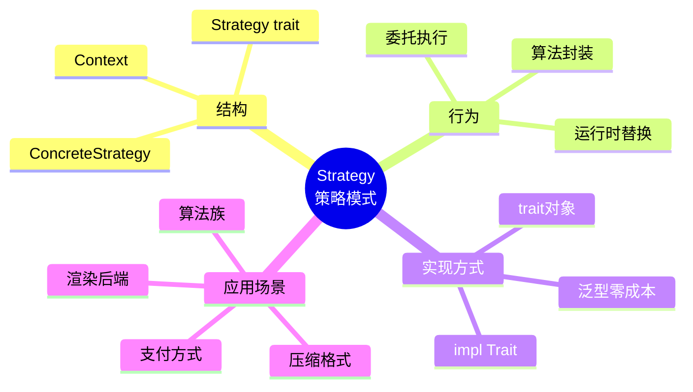
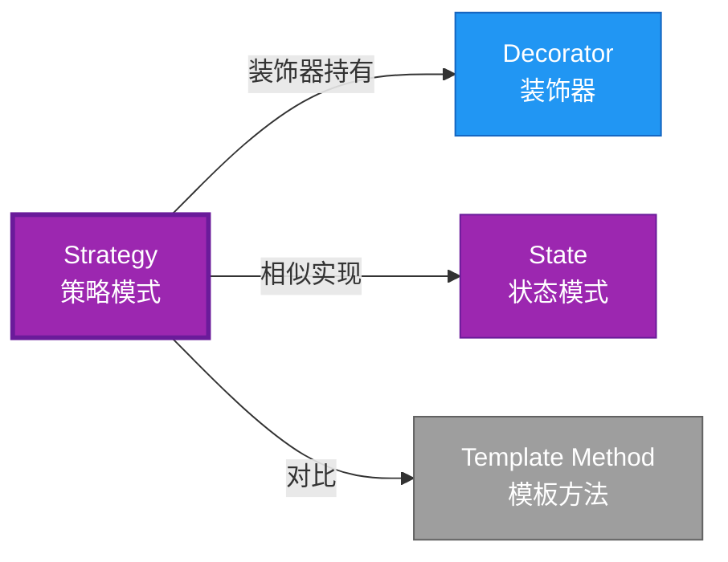

# Strategy 形式化分析

> **创建日期**: 2026-02-12
> **最后更新**: 2026-02-28
> **Rust 版本**: 1.93.1+ (Edition 2024)
> **状态**: ✅ 已完成
> **分类**: 行为型
> **安全边界**: 纯 Safe
> **23 模式矩阵**: [README §23 模式多维对比矩阵](../README.md#23-模式多维对比矩阵) 第 21 行（Strategy）
> **证明深度**: L3（完整证明）

---

## 📊 目录 {#-目录}

- [Strategy 形式化分析](#strategy-形式化分析)
  - [📊 目录 {#-目录}](#-目录--目录)
  - [形式化定义](#形式化定义)
    - [Def 1.1（Strategy 结构）](#def-11strategy-结构)
    - [Axiom SR1（接口一致公理）](#axiom-sr1接口一致公理)
    - [Axiom SR2（所有权独立公理）](#axiom-sr2所有权独立公理)
    - [定理 SR-T1（trait 多态安全定理）](#定理-sr-t1trait-多态安全定理)
    - [定理 SR-T2（借用互斥定理）](#定理-sr-t2借用互斥定理)
    - [推论 SR-C1（纯 Safe Strategy）](#推论-sr-c1纯-safe-strategy)
    - [概念定义-属性关系-解释论证 层次汇总](#概念定义-属性关系-解释论证-层次汇总)
  - [Rust 实现与代码示例](#rust-实现与代码示例)
  - [完整证明](#完整证明)
    - [形式化论证链](#形式化论证链)
  - [典型场景](#典型场景)
  - [完整场景示例：压缩格式策略](#完整场景示例压缩格式策略)
  - [相关模式](#相关模式)
  - [实现变体](#实现变体)
  - [反例：策略持有共享可变状态](#反例策略持有共享可变状态)
  - [选型决策树](#选型决策树)
  - [与 GoF 对比](#与-gof-对比)
  - [边界](#边界)
  - [与 Rust 1.93 的对应](#与-rust-193-的对应)
  - [思维导图](#思维导图)
  - [与其他模式的关系图](#与其他模式的关系图)
  - [实质内容五维自检](#实质内容五维自检)

---

## 形式化定义

### Def 1.1（Strategy 结构）

设 $C$ 为上下文类型，$S$ 为策略类型。Strategy 是一个三元组 $\mathcal{SG} = (C, S, \mathit{execute})$，满足：

- $C$ 持有 $S$：$C \supset S$
- $\mathit{execute}(c) = c.\mathit{strategy}.\mathit{algorithm}(c.\mathit{data})$
- 策略可替换：$S$ 实现 trait $\mathcal{T}$，不同 impl 可互换
- **算法族**：同一接口，不同实现

**形式化表示**：
$$\mathcal{SG} = \langle C, S, \mathit{execute}: C \rightarrow R \rangle$$

---

### Axiom SR1（接口一致公理）

$$\forall s_1, s_2: S,\, s_1: \mathcal{T} \land s_2: \mathcal{T} \implies \mathit{interchangeable}(s_1, s_2)$$

策略接口一致；不同策略对相同输入类型产生相同输出类型。

### Axiom SR2（所有权独立公理）

$$\Omega(S) \cap \Omega(C) = \emptyset \text{ 或 } C \text{ 拥有 } S$$

上下文持有策略的所有权或引用；无循环依赖。

---

### 定理 SR-T1（trait 多态安全定理）

trait 定义策略接口；`impl Trait` 或 `dyn Trait` 实现多态；由 [trait_system_formalization](../../../type_theory/trait_system_formalization.md) 解析正确性。

**证明**：

1. **trait 定义**：

   ```rust
   trait Strategy { fn execute(&self, data: &[i32]) -> i32; }
   ```

2. **多态实现**：
   - `impl Strategy for StrategyA`
   - `impl Strategy for StrategyB`

3. **类型安全**：
   - 编译期检查实现完整性
   - 调用时类型解析正确

由 trait_system_formalization，得证。$\square$

---

### 定理 SR-T2（借用互斥定理）

策略调用时借用规则：`&self` 不可变调用策略；`&mut self` 可变时仍满足互斥。由 [borrow_checker_proof](../../../formal_methods/borrow_checker_proof.md)。

**证明**：

1. **不可变调用**：

   ```rust
   fn run(&self) -> i32 { self.strategy.execute(&self.data) }
   ```

2. **借用分析**：
   - `&self` 借用上下文
   - `&self.strategy` 借用策略
   - `&self.data` 借用数据
   - 无冲突

3. **可变情况**：
   - `&mut self` 独占借用
   - 策略和数据可同时可变访问

由 borrow_checker_proof，得证。$\square$

---

### 推论 SR-C1（纯 Safe Strategy）

Strategy 为纯 Safe；trait 多态策略，无 `unsafe`。

**证明**：

1. trait 定义：纯 Safe
2. impl 实现：纯 Safe
3. 多态调用：纯 Safe
4. 无 `unsafe` 块

由 SR-T1、SR-T2 及 [safe_unsafe_matrix](../../05_boundary_system/safe_unsafe_matrix.md) SBM-T1，得证。$\square$

---

### 概念定义-属性关系-解释论证 层次汇总

| 层次 | 内容 | 本页对应 |
| :--- | :--- | :--- |
| **概念定义层** | Def 1.1（Strategy 结构）、Axiom SR1/SR2（接口一致、所有权） | 上 |
| **属性关系层** | Axiom SR1/SR2 $\rightarrow$ 定理 SR-T1/SR-T2 $\rightarrow$ 推论 SR-C1 | 上 |
| **解释论证层** | SR-T1/SR-T2 完整证明；反例：策略持有共享可变 | §完整证明、§反例 |

---

## Rust 实现与代码示例

```rust
trait Strategy {
    fn execute(&self, data: &[i32]) -> i32;
}

struct SumStrategy;
impl Strategy for SumStrategy {
    fn execute(&self, data: &[i32]) -> i32 { data.iter().sum() }
}

struct MaxStrategy;
impl Strategy for MaxStrategy {
    fn execute(&self, data: &[i32]) -> i32 { *data.iter().max().unwrap_or(&0) }
}

struct Context<S: Strategy> {
    strategy: S,
    data: Vec<i32>,
}

impl<S: Strategy> Context<S> {
    fn new(strategy: S, data: Vec<i32>) -> Self { Self { strategy, data } }
    fn run(&self) -> i32 { self.strategy.execute(&self.data) }
}

// 编译期多态
let ctx = Context::new(SumStrategy, vec![1, 2, 3]);
assert_eq!(ctx.run(), 6);
```

---

## 完整证明

### 形式化论证链

```text
Axiom SR1 (接口一致)
    ↓ 实现
trait Strategy
    ↓ 保证
定理 SR-T1 (trait 多态安全)
    ↓ 组合
Axiom SR2 (所有权独立)
    ↓ 依赖
borrow_checker_proof
    ↓ 保证
定理 SR-T2 (借用互斥)
    ↓ 结论
推论 SR-C1 (纯 Safe Strategy)
```

---

## 典型场景

| 场景 | 说明 |
| :--- | :--- |
| 排序/搜索算法 | 不同策略可互换 |
| 压缩/序列化 | 多种格式策略 |
| 验证规则 | 不同校验策略 |
| 渲染/布局 | 不同渲染后端 |

---

## 完整场景示例：压缩格式策略

```rust
trait CompressStrategy {
    fn compress(&self, data: &[u8]) -> Vec<u8>;
}

struct GzipStrategy;
impl CompressStrategy for GzipStrategy {
    fn compress(&self, data: &[u8]) -> Vec<u8> { data.to_vec() }
}

struct ZstdStrategy;
impl CompressStrategy for ZstdStrategy {
    fn compress(&self, data: &[u8]) -> Vec<u8> { data.to_vec() }
}

struct Exporter<S: CompressStrategy> {
    strategy: S,
}

impl<S: CompressStrategy> Exporter<S> {
    fn new(strategy: S) -> Self { Self { strategy } }
    fn export(&self, data: &[u8]) -> Vec<u8> { self.strategy.compress(data) }
}
```

---

## 相关模式

| 模式 | 关系 |
| :--- | :--- |
| [Decorator](../02_structural/decorator.md) | 装饰器可持有多态策略 |
| [State](state.md) | 策略可替换；State 可转换 |
| [Template Method](template_method.md) | 同为算法定制；Strategy 为组合，Template 为继承等价 |

---

## 实现变体

| 变体 | 说明 | 适用 |
| :--- | :--- | :--- |
| 泛型 `Context<S: Strategy>` | 编译期单态化，零成本 | 策略类型已知 |
| `Box<dyn Strategy>` | 运行时多态 | 策略动态选择 |
| `impl Strategy` 返回值 | 类型擦除 | 作为函数返回值 |

---

## 反例：策略持有共享可变状态

**错误**：策略内部用 `static mut` 或 `Arc<Mutex<>>` 共享可变，多 Context 共享同一策略时产生隐式耦合。

```rust
struct BadStrategy { counter: Arc<Mutex<u32>> }
impl Strategy for BadStrategy {
    fn execute(&self, data: &[i32]) -> i32 {
        *self.counter.lock().unwrap() += 1;
        data.iter().sum()
    }
}
```

---

## 选型决策树

```text
需要可替换算法？
├── 是 → 编译期确定？ → Context<S: Strategy>（泛型）
│       └── 运行时选择？ → Box<dyn Strategy>
├── 需算法骨架+钩子？ → Template Method
└── 需状态转换？ → State
```

---

## 与 GoF 对比

| GoF | Rust 对应 | 差异 |
| :--- | :--- | :--- |
| 策略接口 | trait + impl | 等价 |
| 上下文 | 泛型或 trait 对象 | 等价 |
| 运行时绑定 | `Box<dyn Strategy>` | 等价 |

---

## 边界

| 维度 | 分类 |
| :--- | :--- |
| 安全 | 纯 Safe |
| 支持 | 原生 |
| 表达 | 等价 |

---

## 与 Rust 1.93 的对应

| 1.93 特性 | 与本模式 | 说明 |
| :--- | :--- | :--- |
| 无新增影响 | — | 1.93 无影响 Strategy 语义的变更 |
| 92 项落点 | 无 | 本模式未涉及 [RUST_193_COUNTEREXAMPLES_INDEX](../../../RUST_193_COUNTEREXAMPLES_INDEX.md) 特定项 |

---

## 思维导图



---

## 与其他模式的关系图



---

## 实质内容五维自检

| 自检项 | 状态 | 说明 |
| :--- | :--- | :--- |
| 形式化 | ✅ | Def 1.1、Axiom SR1/SR2、定理 SR-T1/T2（L3 完整证明）、推论 SR-C1 |
| 代码 | ✅ | 可运行示例、压缩格式策略 |
| 场景 | ✅ | 典型场景、完整示例 |
| 反例 | ✅ | 策略持有共享可变状态 |
| 衔接 | ✅ | trait、ownership、CE-T2、CE-PAT1 |
| 权威对应 | ✅ | [GoF](../README.md#与-gof-原书对应)、[formal_methods](../../../formal_methods/README.md)、[INTERNATIONAL_FORMAL_VERIFICATION_INDEX](../../../INTERNATIONAL_FORMAL_VERIFICATION_INDEX.md) |
