# Template Method 形式化分析

> **创建日期**: 2026-02-12
> **最后更新**: 2026-02-20
> **Rust 版本**: 1.93.0+ (Edition 2024)
> **状态**: ✅ 已完成
> **分类**: 行为型
> **安全边界**: 纯 Safe
> **23 模式矩阵**: [README §23 模式多维对比矩阵](../README.md#23-模式多维对比矩阵) 第 22 行（Template Method）
> **证明深度**: L3（完整证明）

---

## 📊 目录

- [Template Method 形式化分析](#template-method-形式化分析)
  - [📊 目录](#-目录)
  - [形式化定义](#形式化定义)
    - [概念定义-属性关系-解释论证 层次汇总](#概念定义-属性关系-解释论证-层次汇总)
  - [Rust 实现与代码示例](#rust-实现与代码示例)
  - [完整证明](#完整证明)
  - [典型场景](#典型场景)
  - [完整场景示例：数据导入流水线](#完整场景示例数据导入流水线)
  - [相关模式](#相关模式)
  - [实现变体](#实现变体)
  - [反例：覆盖 template 破坏骨架](#反例覆盖-template-破坏骨架)
  - [选型决策树](#选型决策树)
  - [与 GoF 对比](#与-gof-对比)
  - [边界](#边界)
  - [与 Rust 1.93 的对应](#与-rust-193-的对应)
  - [思维导图](#思维导图)
  - [与其他模式的关系图](#与其他模式的关系图)
  - [实质内容五维自检](#实质内容五维自检)

---

## 形式化定义

### Def 1.1（Template Method 结构）

设 $T$ 为模板类型。Template Method 是一个三元组 $\mathcal{TM} = (T, \mathit{template}, \{h_i\})$，满足：

- $\exists \mathit{template\_op} : T \to R$，定义算法骨架
- $\mathit{template\_op}$ 内部调用 $h_1(), h_2(), \ldots$ 钩子
- 子类实现 $h_i$；Rust 用 trait 默认方法 + override
- **骨架固定**：模板方法体不变；钩子可定制

**形式化表示**：
$$\mathcal{TM} = \langle T, \mathit{template}: T \rightarrow R, \{h_i: T \rightarrow R_i\} \rangle$$

---

### Axiom TM1（骨架不变公理）

$$\forall t: T,\, \mathit{template}(t)\text{ 的调用顺序固定；仅 }h_i\text{ 可定制}$$

骨架不变；钩子可定制。

### Axiom TM2（钩子可选公理）

$$h_i\text{ 可有无默认实现；}\mathit{impl}\text{ 可选择性覆盖}$$

钩子可有无默认实现；`impl` 可选择性覆盖。

---

### 定理 TM-T1（trait 默认方法定理）

trait 默认方法：`fn template(&self) { self.hook1(); self.hook2(); }`；由 [trait_system_formalization](../../../type_theory/trait_system_formalization.md)。

**证明**：

1. **trait 定义**：
   ```rust
   trait Algorithm {
       fn template(&self) -> String {
           let mut s = String::new();
           s.push_str(&self.step1());
           s.push_str(&self.step2());
           s
       }
       fn step1(&self) -> String;
       fn step2(&self) -> String;
   }
   ```

2. **默认方法**：`template` 有默认实现
3. **必需方法**：`step1`、`step2` 需实现
4. **类型安全**：编译期检查实现完整性

由 trait_system_formalization，得证。$\square$

---

### 定理 TM-T2（骨架不变性定理）

`template` 方法体固定；各 `impl` 仅提供 `step_i`，不修改 `template` 调用顺序。

**证明**：

1. **trait 定义固定**：`template` 默认方法不可覆盖（除非显式覆盖）
2. **impl 约束**：impl 只能实现必需方法
3. **约定**：约定不覆盖 `template`

由 Rust trait 系统，得证。$\square$

---

### 推论 TM-C1（近似表达）

Template Method 与 [expressive_inexpressive_matrix](../../05_boundary_system/expressive_inexpressive_matrix.md) 表一致；$\mathit{ExprB}(\mathrm{TemplateMethod}) = \mathrm{Approx}$（无 OOP 继承）。

**证明**：

1. 功能等价：trait 默认方法 = 模板方法
2. 无继承：Rust 用组合而非继承
3. 标记为 Approximate

由 TM-T1、TM-T2 及 expressive_inexpressive_matrix，得证。$\square$

---

### 概念定义-属性关系-解释论证 层次汇总

| 层次 | 内容 | 本页对应 |
| :--- | :--- | :--- |
| **概念定义层** | Def 1.1（Template Method 结构）、Axiom TM1/TM2（骨架不变、钩子可选） | 上 |
| **属性关系层** | Axiom TM1/TM2 $\rightarrow$ 定理 TM-T1/TM-T2 $\rightarrow$ 推论 TM-C1 | 上 |
| **解释论证层** | TM-T1/TM-T2 完整证明；反例：覆盖 template | §完整证明、§反例 |

---

## Rust 实现与代码示例

```rust
trait Algorithm {
    fn template(&self) -> String {
        let mut s = String::new();
        s.push_str(&self.step1());
        s.push_str(&self.step2());
        s
    }
    fn step1(&self) -> String;
    fn step2(&self) -> String;
}

struct ImplA;
impl Algorithm for ImplA {
    fn step1(&self) -> String { "A1".into() }
    fn step2(&self) -> String { "A2".into() }
}

struct ImplB;
impl Algorithm for ImplB {
    fn step1(&self) -> String { "B1".into() }
    fn step2(&self) -> String { "B2".into() }
}

let a = ImplA;
assert_eq!(a.template(), "A1A2");
```

---

## 完整证明

### 形式化论证链

```
Axiom TM1 (骨架不变)
    ↓ 实现
trait 默认方法
    ↓ 保证
定理 TM-T1 (trait 默认方法)
    ↓ 组合
Axiom TM2 (钩子可选)
    ↓ 保证
定理 TM-T2 (骨架不变性)
    ↓ 结论
推论 TM-C1 (近似表达)
```

---

## 典型场景

| 场景 | 说明 |
| :--- | :--- |
| 算法骨架 | 排序、搜索、序列化流程 |
| 生命周期钩子 | 初始化/清理、before/after |
| 测试框架 | setup/teardown、用例执行流程 |

---

## 完整场景示例：数据导入流水线

```rust
trait DataImport {
    fn run(&self, raw: &str) -> Result<u64, String> {
        let validated = self.validate(raw)?;
        let parsed = self.parse(&validated)?;
        let transformed = self.transform(parsed)?;
        self.persist(&transformed)
    }
    fn validate(&self, raw: &str) -> Result<String, String>;
    fn parse(&self, s: &str) -> Result<Vec<Record>, String>;
    fn transform(&self, records: Vec<Record>) -> Result<Vec<Record>, String>;
    fn persist(&self, records: &[Record]) -> Result<u64, String>;
}

struct Record { id: u64, name: String }

struct CsvImport;
impl DataImport for CsvImport {
    fn validate(&self, raw: &str) -> Result<String, String> {
        if raw.is_empty() { Err("empty".into()) } else { Ok(raw.into()) }
    }
    fn parse(&self, s: &str) -> Result<Vec<Record>, String> {
        Ok(s.lines().enumerate().map(|(i, l)| Record { id: i as u64, name: l.into() }).collect())
    }
    fn transform(&self, r: Vec<Record>) -> Result<Vec<Record>, String> { Ok(r) }
    fn persist(&self, r: &[Record]) -> Result<u64, String> { Ok(r.len() as u64) }
}
```

---

## 相关模式

| 模式 | 关系 |
| :--- | :--- |
| [Strategy](strategy.md) | 同为算法定制；Template 为骨架，Strategy 为替换 |
| [Factory Method](../01_creational/factory_method.md) | 工厂方法可为模板钩子 |
| [Observer](observer.md) | 钩子可触发观察者 |

---

## 实现变体

| 变体 | 说明 | 适用 |
| :--- | :--- | :--- |
| trait 默认方法 | `fn template(&self)` 调用钩子 | 标准实现 |
| 宏 | 生成模板骨架 | 减少样板 |
| 组合 + 策略 | 钩子由 Strategy 提供 | 更灵活 |

---

## 反例：覆盖 template 破坏骨架

**错误**：某 impl 覆盖 `template` 而非钩子，破坏算法骨架。

```rust
impl Algorithm for BadImpl {
    fn template(&self) -> String { "hardcoded".into() }  // 忽略 step1/step2
}
```

---

## 选型决策树

```text
需要算法骨架、步骤可定制？
├── 是 → trait 默认方法？ → Template Method
├── 需完全替换算法？ → Strategy
├── 需工厂创建？ → Factory Method（可作钩子）
└── 需状态转换？ → State
```

---

## 与 GoF 对比

| GoF | Rust 对应 | 差异 |
| :--- | :--- | :--- |
| 抽象类 | trait | 无状态 |
| 继承覆盖 | impl | 无继承 |
| 骨架+钩子 | 默认方法+必需方法 | 等价 |

---

## 边界

| 维度 | 分类 |
| :--- | :--- |
| 安全 | 纯 Safe |
| 支持 | 原生 |
| 表达 | 近似（无继承） |

---

## 与 Rust 1.93 的对应

| 1.93 特性 | 与本模式 | 说明 |
| :--- | :--- | :--- |
| 无新增影响 | — | 1.93 无影响 Template Method 语义的变更 |
| 92 项落点 | 无 | 本模式未涉及 [RUST_193_COUNTEREXAMPLES_INDEX](../../../RUST_193_COUNTEREXAMPLES_INDEX.md) 特定项 |

---

## 思维导图

```mermaid
mindmap
  root((Template Method<br/>模板方法模式))
    结构
      trait Algorithm
      template() 默认方法
      step1() 钩子
      step2() 钩子
    行为
      算法骨架固定
      钩子可定制
      流程控制
    实现方式
      trait默认方法
      宏生成
      组合策略
    应用场景
      算法流程
      生命周期钩子
      测试框架
      数据处理
```

---

## 与其他模式的关系图

```mermaid
graph LR
    TM[Template Method<br/>模板方法] -->|算法定制对比| S[Strategy<br/>策略模式]
    TM -->|钩子创建| FM[Factory Method<br/>工厂方法]
    TM -->|钩子通知| O[Observer<br/>观察者]
    style TM fill:#9C27B0,stroke:#6A1B9A,stroke-width:3px,color:#fff
    style S fill:#9E9E9E,stroke:#616161,color:#fff
    style FM fill:#4CAF50,stroke:#2E7D32,color:#fff
    style O fill:#9C27B0,stroke:#6A1B9A,color:#fff
```



---

## 实质内容五维自检

| 自检项 | 状态 | 说明 |
| :--- | :--- | :--- |
| 形式化 | ✅ | Def 1.1、Axiom TM1/TM2、定理 TM-T1/T2（L3 完整证明）、推论 TM-C1 |
| 代码 | ✅ | 可运行示例 |
| 场景 | ✅ | 典型场景表 |
| 反例 | ✅ | 覆盖 template 破坏骨架 |
| 衔接 | ✅ | trait 默认方法、ownership |
| 权威对应 | ✅ | [GoF](../README.md#与-gof-原书对应)、[formal_methods](../../../formal_methods/README.md)、[INTERNATIONAL_FORMAL_VERIFICATION_INDEX](../../../INTERNATIONAL_FORMAL_VERIFICATION_INDEX.md) |
