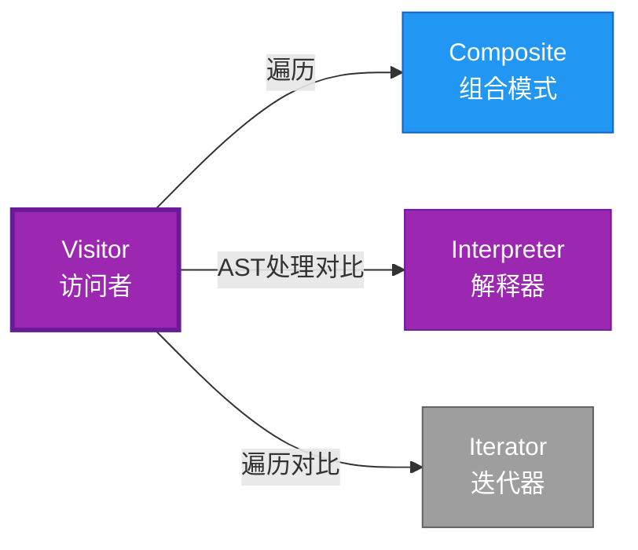

# Visitor 形式化分析

> **创建日期**: 2026-02-12
> **最后更新**: 2026-02-20
> **Rust 版本**: 1.93.0+ (Edition 2024)
> **状态**: ✅ 已完成
> **分类**: 行为型
> **安全边界**: 纯 Safe
> **23 模式矩阵**: [README §23 模式多维对比矩阵](../README.md#23-模式多维对比矩阵) 第 23 行（Visitor）
> **证明深度**: L3（完整证明）

---

## 📊 目录

- [Visitor 形式化分析](#visitor-形式化分析)
  - [📊 目录](#-目录)
  - [形式化定义](#形式化定义)
    - [概念定义-属性关系-解释论证 层次汇总](#概念定义-属性关系-解释论证-层次汇总)
  - [Rust 实现与代码示例](#rust-实现与代码示例)
  - [完整证明](#完整证明)
  - [完整场景示例：AST 美化打印](#完整场景示例ast-美化打印)
  - [典型场景](#典型场景)
  - [相关模式](#相关模式)
  - [实现变体](#实现变体)
  - [反例：新增变体遗漏访问](#反例新增变体遗漏访问)
  - [选型决策树](#选型决策树)
  - [与 GoF 对比](#与-gof-对比)
  - [边界](#边界)
  - [与 Rust 1.93 的对应](#与-rust-193-的对应)
  - [思维导图](#思维导图)
  - [与其他模式的关系图](#与其他模式的关系图)
  - [实质内容五维自检](#实质内容五维自检)

---

## 形式化定义

### Def 1.1（Visitor 结构）

设 $E$ 为元素类型（AST/节点），$V$ 为访问者类型。Visitor 是一个三元组 $\mathcal{VI} = (E, V, \mathit{visit})$，满足：

- $\exists \mathit{visit} : V \times E \to R$
- $E$ 为代数数据类型
- 双重分发：$e.\mathit{accept}(v)$ 调用 $v.\mathit{visit}(e)$；或单分发：`match e` 后调用 `v.visit_X(e)`
- **操作分离**：将操作与对象结构分离

**形式化表示**：
$$\mathcal{VI} = \langle E, V, \mathit{visit}: V \times E \rightarrow R \rangle$$

---

### Axiom VI1（访问完备公理）

$$\forall e: E,\, \exists v: V,\, \mathit{visit}(v, e)\text{ 有定义}$$

访问者可访问所有节点变体；可扩展新操作。

---

### 定理 VI-T1（单分发完备定理）

Rust 用 `match` 单分发或 trait 模拟；无 OOP 风格双重分发，表达为近似。

**证明**：

1. **单分发模式**：
   ```rust
   fn visit<V: Visitor>(v: &mut V, e: &Expr) {
       match e {
           Expr::Int(n) => v.visit_int(*n),
           Expr::Add(a, b) => { visit(v, a); visit(v, b); v.visit_add(a, b); }
       }
   }
   ```

2. **穷尽匹配**：编译器检查所有变体被处理
3. **可扩展性**：新 Visitor 实现 trait 即可
4. **无双重分发**：Rust 无 OOP 虚函数双重分发

由 Rust match 语义，得证。$\square$

---

### 定理 VI-T2（穷尽匹配定理）

`match e { ... }` 必须覆盖 $E$ 所有变体；新增变体需新增分支，否则编译错误。

**证明**：

1. **穷尽检查**：Rust 编译器强制 match 穷尽
2. **编译错误**：遗漏变体 → 编译失败
3. **安全保证**：运行时不存在未处理变体

由 type_system_foundations，得证。$\square$

---

### 推论 VI-C1（近似表达）

Visitor 与 [expressive_inexpressive_matrix](../../05_boundary_system/expressive_inexpressive_matrix.md) 表一致；$\mathit{ExprB}(\mathrm{Visitor}) = \mathrm{Approx}$。

**证明**：

1. 功能等价：match 单分发 = 访问者模式
2. 风格差异：无 OOP 双重分发
3. 标记为 Approximate

由 VI-T1、VI-T2 及 expressive_inexpressive_matrix，得证。$\square$

---

### 概念定义-属性关系-解释论证 层次汇总

| 层次 | 内容 | 本页对应 |
| :--- | :--- | :--- |
| **概念定义层** | Def 1.1（Visitor 结构）、Axiom VI1（访问完备） | 上 |
| **属性关系层** | Axiom VI1 $\rightarrow$ 定理 VI-T1/VI-T2 $\rightarrow$ 推论 VI-C1 | 上 |
| **解释论证层** | VI-T1/VI-T2 完整证明；反例：新增变体遗漏 | §完整证明、§反例 |

---

## Rust 实现与代码示例

```rust
enum Expr {
    Int(i32),
    Add(Box<Expr>, Box<Expr>),
}

trait Visitor {
    fn visit_int(&mut self, n: i32);
    fn visit_add(&mut self, a: &Expr, b: &Expr);
}

fn visit<V: Visitor>(v: &mut V, e: &Expr) {
    match e {
        Expr::Int(n) => v.visit_int(*n),
        Expr::Add(a, b) => {
            visit(v, a);
            visit(v, b);
            v.visit_add(a, b);
        }
    }
}

struct PrintVisitor;
impl Visitor for PrintVisitor {
    fn visit_int(&mut self, n: i32) { println!("{}", n); }
    fn visit_add(&mut self, _: &Expr, _: &Expr) { println!("+"); }
}
```

---

## 完整证明

### 形式化论证链

```
Axiom VI1 (访问完备)
    ↓ 实现
match + trait
    ↓ 保证
定理 VI-T1 (单分发完备)
    ↓ 组合
type_system
    ↓ 保证
定理 VI-T2 (穷尽匹配)
    ↓ 结论
推论 VI-C1 (近似表达)
```

---

## 完整场景示例：AST 美化打印

```rust
enum Expr { Int(i32), Add(Box<Expr>, Box<Expr>) }

trait ExprVisitor<T> {
    fn visit_int(&mut self, n: i32) -> T;
    fn visit_add(&mut self, a: &Expr, b: &Expr, la: T, lb: T) -> T;
}

fn visit<V: ExprVisitor<String>>(v: &mut V, e: &Expr) -> String {
    match e {
        Expr::Int(n) => v.visit_int(*n),
        Expr::Add(a, b) => {
            let la = visit(v, a);
            let lb = visit(v, b);
            v.visit_add(a, b, la, lb)
        }
    }
}

struct PrettyPrint;
impl ExprVisitor<String> for PrettyPrint {
    fn visit_int(&mut self, n: i32) -> String { n.to_string() }
    fn visit_add(&mut self, _: &Expr, _: &Expr, la: String, lb: String) -> String {
        format!("({} + {})", la, lb)
    }
}

// 输出："(1 + 2)"
```

---

## 典型场景

| 场景 | 说明 |
| :--- | :--- |
| AST 遍历 | 编译器、解释器、代码生成 |
| 文档/树遍历 | DOM、配置树、语法树 |
| 序列化/反序列化 | 各节点类型不同处理 |
| 类型检查 | 按节点类型施加不同规则 |

---

## 相关模式

| 模式 | 关系 |
| :--- | :--- |
| [Composite](../02_structural/composite.md) | 遍历 Composite 常用 Visitor |
| [Interpreter](interpreter.md) | 同为 AST 处理；Interpreter 求值，Visitor 遍历 |
| [Iterator](iterator.md) | 遍历方式不同；Visitor 深度优先，Iterator 可定制 |

---

## 实现变体

| 变体 | 说明 | 适用 |
| :--- | :--- | :--- |
| match + 函数 | `fn visit<V: Visitor>(v: &mut V, e: &Expr)` | 单分发；穷尽 |
| trait accept | `fn accept<V: Visitor>(&self, v: &mut V)` | 模拟双重分发 |
| 宏 | 自动生成 visit 分支 | 减少样板 |

---

## 反例：新增变体遗漏访问

**错误**：`Expr` 新增 `Expr::Mul` 变体，`visit` 中 `match` 未补充分支。

```rust
enum Expr { Int(i32), Add(Box<Expr>, Box<Expr>), Mul(Box<Expr>, Box<Expr>) }
fn visit<V: Visitor>(v: &mut V, e: &Expr) {
    match e {
        Expr::Int(n) => v.visit_int(*n),
        Expr::Add(a, b) => { ... },
        // 遗漏 Expr::Mul => 编译错误！
    }
}
```

---

## 选型决策树

```text
需要按节点类型施加不同操作？
├── 是 → 结构稳定、操作常变？ → Visitor（match 或 accept）
│       └── 操作简单、顺序遍历？ → Iterator
├── 需求值/解释？ → Interpreter
└── 需建树？ → Composite
```

---

## 与 GoF 对比

| GoF | Rust 对应 | 差异 |
| :--- | :--- | :--- |
| 双重分发 | match 单分发 | 风格不同 |
| accept/visit | trait 方法 | 等价 |
| 穷尽检查 | 编译期强制 | Rust 更强 |

---

## 边界

| 维度 | 分类 |
| :--- | :--- |
| 安全 | 纯 Safe |
| 支持 | 原生 |
| 表达 | 近似 |

---

## 与 Rust 1.93 的对应

| 1.93 特性 | 与本模式 | 说明 |
| :--- | :--- | :--- |
| 无新增影响 | — | 1.93 无影响 Visitor 语义的变更 |
| 92 项落点 | 无 | 本模式未涉及 [RUST_193_COUNTEREXAMPLES_INDEX](../../../RUST_193_COUNTEREXAMPLES_INDEX.md) 特定项 |

---

## 思维导图

```mermaid
mindmap
  root((Visitor<br/>访问者模式))
    结构
      Element enum
      Visitor trait
      visit() 方法
    行为
      分离操作与结构
      遍历访问
      类型分发
    实现方式
      match单分发
      trait accept
      宏生成
    应用场景
      AST遍历
      类型检查
      代码生成
      序列化
```

---

## 与其他模式的关系图



---

## 实质内容五维自检

| 自检项 | 状态 | 说明 |
| :--- | :--- | :--- |
| 形式化 | ✅ | Def 1.1、Axiom VI1、定理 VI-T1/T2（L3 完整证明）、推论 VI-C1 |
| 代码 | ✅ | 可运行示例、AST 美化 |
| 场景 | ✅ | 典型场景、完整示例 |
| 反例 | ✅ | 新增变体遗漏访问 |
| 衔接 | ✅ | match、trait、Composite |
| 权威对应 | ✅ | [GoF](../README.md#与-gof-原书对应)、[formal_methods](../../../formal_methods/README.md)、[INTERNATIONAL_FORMAL_VERIFICATION_INDEX](../../../INTERNATIONAL_FORMAL_VERIFICATION_INDEX.md) |
