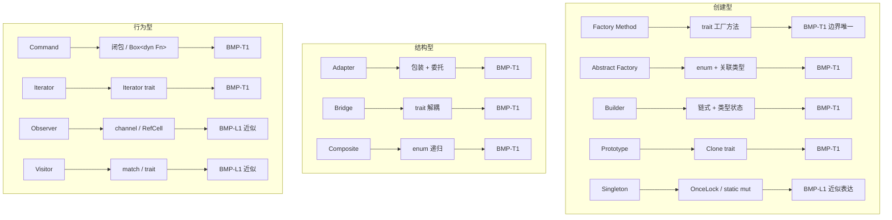

# 设计模式边界矩阵汇总

> **创建日期**: 2026-02-12
> **最后更新**: 2026-02-20
> **Rust 版本**: 1.93.0+ (Edition 2024)
> **状态**: ✅ 已完成

---

## 形式化定义与公理

**Def 1.1（设计模式边界）**:

设 $P$ 为 GoF 设计模式，$B_s(P)$、$B_p(P)$、$B_e(P)$ 分别为安全、支持、表达边界。定义见 [05_boundary_system](../05_boundary_system/README.md) Def B1–B3。

**Def 1.2（三维边界一致性）**:

若 $B_s(P)$、$B_p(P)$、$B_e(P)$ 与 [safe_unsafe_matrix](../05_boundary_system/safe_unsafe_matrix.md)、
[supported_unsupported_matrix](../05_boundary_system/supported_unsupported_matrix.md)、
[expressive_inexpressive_matrix](../05_boundary_system/expressive_inexpressive_matrix.md) 三矩阵对应一致，
则称模式 $P$ 的边界**与体系一致**。

**Axiom BMP1**：设计模式边界由实现路径唯一确定；同一模式不同实现（如 Singleton 用 OnceLock vs static mut）可能对应不同 $B_s$。

**定理 BMP-T1（边界唯一性）**：对任意 GoF 模式 $P$ 及给定实现 $I$，$B_s(P)$、$B_p(P)$、$B_e(P)$ 由 05_boundary_system 三矩阵的 Def 与定理唯一确定。

*证明*：由 [05_boundary_system](../05_boundary_system/README.md) 定理 B-T1，三维边界由各矩阵定义唯一确定；设计模式为 05 边界体系的子集。∎

**定理 BMP-T2（23 模式与 05 矩阵一致）**：23 种 GoF 模式的本表与 [05_boundary_system](../05_boundary_system/) 三矩阵对应一致；无冲突。

*证明*：由各矩阵文档的 Def 与设计模式表；safe_unsafe_matrix、supported_unsupported_matrix、expressive_inexpressive_matrix 分别覆盖 23 模式；交叉验证无矛盾。∎

**引理 BMP-L1（近似表达模式）**：Singleton、Interpreter、Memento、Observer、Template Method、Visitor 为近似表达；$\mathit{ExprB}(P) = \mathrm{Approx}$ 由 [expressive_inexpressive_matrix](../05_boundary_system/expressive_inexpressive_matrix.md) 定理 EIM-T2、EIM-L1 确定。

*证明*：由 [expressive_inexpressive_matrix](../05_boundary_system/expressive_inexpressive_matrix.md)；上述模式依赖全局可变、继承或双重分发，Rust 用 OnceLock、channel、match 等替代；依 Def 1.1 为 Approx。∎

**推论 BMP-C1**：等价表达模式（21 种）满足零成本抽象；近似表达模式可能有额外间接（如 channel）。

*证明*：由 [expressive_inexpressive_matrix](../05_boundary_system/expressive_inexpressive_matrix.md) 推论 EIM-C1。∎

---

## 模式 × 三维边界

| 模式 | 安全 | 支持 | 表达 |
| :--- | :--- | :--- | :--- |
| **创建型** | | | |
| Factory Method | 纯 Safe | 原生 | 等价 |
| Abstract Factory | 纯 Safe | 原生 | 等价 |
| Builder | 纯 Safe | 原生 | 等价 |
| Prototype | 纯 Safe | 原生 | 等价 |
| Singleton | Safe/unsafe | 原生 | 近似 |
| **结构型** | | | |
| Adapter | 纯 Safe | 原生 | 等价 |
| Bridge | 纯 Safe | 原生 | 等价 |
| Composite | 纯 Safe | 原生 | 等价 |
| Decorator | 纯 Safe | 原生 | 等价 |
| Facade | 纯 Safe | 原生 | 等价 |
| Flyweight | 纯 Safe | 原生 | 等价 |
| Proxy | 纯 Safe | 原生 | 等价 |
| **行为型** | | | |
| Chain of Responsibility | 纯 Safe | 原生 | 等价 |
| Command | 纯 Safe | 原生 | 等价 |
| Interpreter | 纯 Safe | 原生 | 近似 |
| Iterator | 纯 Safe | 原生 | 等价 |
| Mediator | 纯 Safe | 原生 | 等价 |
| Memento | 纯 Safe | 原生 | 近似 |
| Observer | Safe/unsafe | 原生 | 近似 |
| State | 纯 Safe | 原生 | 等价 |
| Strategy | 纯 Safe | 原生 | 等价 |
| Template Method | 纯 Safe | 原生 | 近似 |
| Visitor | 纯 Safe | 原生 | 近似 |

---

## 边界定义

- **安全**：纯 Safe / 需 unsafe / 无法表达
- **支持**：原生支持 / 库支持 / 需 FFI
- **表达**：等价表达 / 近似表达 / 不可表达

详见 [05_boundary_system](../05_boundary_system/README.md)。

---

## 边界异常说明

| 模式 | 异常 | 说明 |
| :--- | :--- | :--- |
| Singleton | Safe/unsafe | OnceLock 为纯 Safe；`static mut` 为 unsafe |
| Observer | Safe/unsafe | channel 为纯 Safe；共享可变回调在特定场景需 unsafe |

---

## 与证明体系衔接

- **等价表达**：可形式化证明与 GoF 语义等价；见各模式文档定理。
- **近似表达**：有明确差异点；见 [expressive_inexpressive_matrix](../05_boundary_system/expressive_inexpressive_matrix.md) 详解。

---

## 近似表达模式速查

Singleton、Interpreter、Memento、Observer、Template Method、Visitor 为近似表达；其余为等价表达。近似原因见各模式文档「与 GoF 对比」。

---

## 按维度速查

| 需纯 Safe | 模式 |
| :--- | :--- |
| 是 | 除 Singleton、Observer 的部分实现外，其余 21 种均为纯 Safe |
| 否 | Singleton（static mut）、Observer（共享可变未封装）、Gateway（FFI） |

| 需原生支持 | 模式 |
| :--- | :--- |
| 是 | 全部 23 种 |
| 否 | 执行模型：异步/并行/分布式 需库 |

---

## 选型决策树（模式 → 边界）

```text
选模式 X？
├── 需纯 Safe？
│   ├── 是 → 排除 static mut、裸 FFI；用 OnceLock、channel
│   └── 否 → 可 unsafe 封装
├── 需原生支持？
│   ├── 是 → 23 种均可；std 足够
│   └── 否 → 异步/并行/分布式 加 tokio、rayon、tonic
└── 需等价表达？
    ├── 是 → 选等价表达模式（21 种）
    └── 否 → 可接受近似（Singleton、Observer、Visitor 等）
```

---

## 设计模式表征能力形式化树图

**Def BMP-TREE1（模式→实现路径→定理）**：设 $P$ 为 GoF 模式，$I(P)$ 为 Rust 实现路径，$T(P)$ 为对应形式化定理。表征能力由三元组 $(P, I(P), T(P))$ 确定。

### Mermaid 形式化树图



### ASCII 形式化树图（模式→实现路径→定理）

```text
设计模式表征能力形式化树
═══════════════════════════════════════════════════════════════

创建型
├── Factory Method   → trait 工厂方法        → BMP-T1 等价
├── Abstract Factory → enum + 关联类型       → BMP-T1 等价
├── Builder          → 链式 + 类型状态      → BMP-T1 等价
├── Prototype        → Clone trait          → BMP-T1 等价
└── Singleton        → OnceLock / static mut → BMP-L1 近似

结构型
├── Adapter          → 包装 + 委托          → BMP-T1 等价
├── Bridge           → trait 解耦           → BMP-T1 等价
├── Composite        → enum 递归            → BMP-T1 等价
├── Decorator        → 结构体包装           → BMP-T1 等价
├── Facade           → 模块/结构体          → BMP-T1 等价
├── Flyweight        → Arc 共享             → BMP-T1 等价
└── Proxy            → 委托/延迟             → BMP-T1 等价

行为型
├── Chain of Resp.   → Option/链表          → BMP-T1 等价
├── Command          → 闭包/Box<dyn Fn>     → BMP-T1 等价
├── Interpreter      → 枚举 + match         → BMP-L1 近似
├── Iterator         → Iterator trait       → BMP-T1 等价
├── Mediator         → 结构体协调           → BMP-T1 等价
├── Memento          → Clone/serde          → BMP-L1 近似
├── Observer         → channel/RefCell    → BMP-L1 近似
├── State            → enum/类型状态        → BMP-T1 等价
├── Strategy         → trait               → BMP-T1 等价
├── Template Method  → trait 默认方法       → BMP-L1 近似
└── Visitor          → match/trait         → BMP-L1 近似

定理说明：BMP-T1 边界唯一；BMP-L1 近似表达（见 expressive_inexpressive_matrix）
```

---

## 模式组合约束 DAG（D1.5）

**Def BMP-DAG1（模式组合约束）**：设 $P_1 \to P_2$ 表示 $P_1$ 可组合于 $P_2$（$P_1$ 产出作为 $P_2$ 输入）。推荐组合形成 DAG；禁止组合由约束违反确定。

### 推荐组合（保持 CE-T1–T3）

```text
Builder ──→ Factory Method ──→ Repository
   │              │                  │
   └──────────────┴──────────────────┴──→ Service Layer
                                              │
Decorator ──→ Strategy                        │
   │              │                           │
Composite ──→ Visitor ◄───────────────────────┘
   │
Observer ──→ Command
```

| 组合 | 约束 | 引用 |
| :--- | :--- | :--- |
| Builder + Factory | 工厂返回 Builder；IT-T1 满足 | [CE-PAT1](../../04_compositional_engineering/02_effectiveness_proofs.md#定理-ce-pat1模式组合-ce-保持) |
| Decorator + Strategy | 装饰器持 `impl Strategy`；无共享可变 | CE-PAT-C1 |
| Observer + Command | channel 传 `Box<dyn Command + Send>`；Send 约束 | CE-PAT-C1 |
| Composite + Visitor | `match` 遍历 + `Visitor` trait | CE-PAT-C1 |
| Repository + Service + DTO | 模块依赖 DAG；所有权沿调用链 | [03_integration_theory](../../04_compositional_engineering/03_integration_theory.md) |

### 禁止/慎用组合

| 组合 | 原因 |
| :--- | :--- |
| Singleton + 任意跨线程共享可变 | 违反 CE-T2；需 OnceLock 或 Mutex 封装 |
| Rc + 跨线程 | 编译拒绝；Rc 非 Send |
| Observer 回调持有 `&mut` 跨线程 | 数据竞争；用 channel 替代 |

**引用**：[04_compositional_engineering](../04_compositional_engineering/README.md)、[CE-PAT1](../../04_compositional_engineering/02_effectiveness_proofs.md#定理-ce-pat1模式组合-ce-保持)。

---

## 与 43 完全模型衔接

扩展 20 种模式见 [02_complete_43_catalog](../02_workflow_safe_complete_models/02_complete_43_catalog.md)；绝大部分为纯 Safe、原生支持、等价表达。

---
