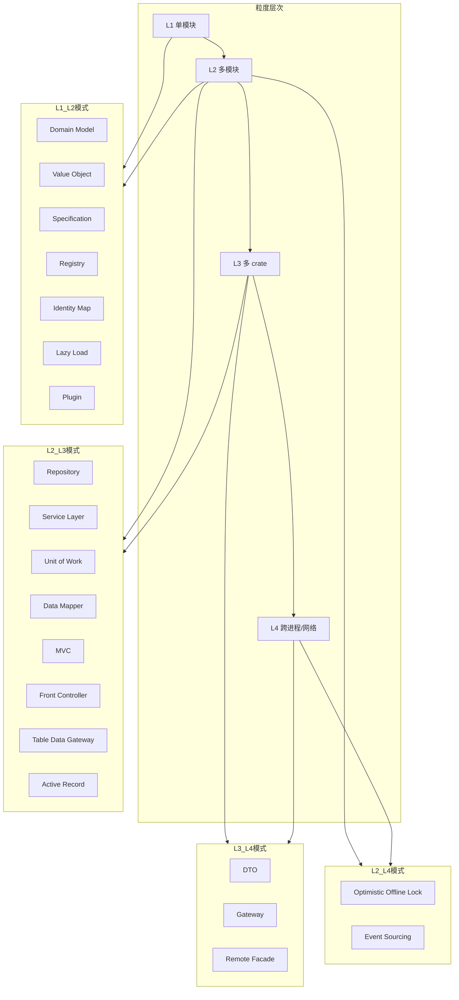

# 组合软件工程有效性形式论证

> **创建日期**: 2026-02-12
> **最后更新**: 2026-02-12
> **Rust 版本**: 1.93.0+ (Edition 2024)
> **状态**: 100% 完成

---

## 📊 目录

- [组合软件工程有效性形式论证](#组合软件工程有效性形式论证)
  - [宗旨](#宗旨)
  - [设计模式组合示例（实质内容）](#设计模式组合示例实质内容)
  - [组合完整代码示例（层次推进）](#组合完整代码示例层次推进)
  - [文档索引](#文档索引)
  - [核心问题](#核心问题)
  - [形式化论证汇总](#形式化论证汇总)
  - [组件成熟度与构建能力确定性](#组件成熟度与构建能力确定性)
  - [L3/L4 验证手段细化](#l3l4-验证手段细化)
  - [架构模式→成熟度层级映射](#架构模式成熟度层级映射)
  - [构建能力确定性判定树](#构建能力确定性判定树)
  - [表达力×组合联合判定树（支柱 2+3）](#表达力组合联合判定树支柱-23)
  - [组件构建能力形式化树图（与 43 模式联合）](#组件构建能力形式化树图与-43-模式联合)
  - [定理速查](#定理速查)
  - [实践要点](#实践要点)
  - [组合选型决策树（层次推进）](#组合选型决策树层次推进)
  - [组合反例（层次推进）](#组合反例层次推进)
  - [组合反例→编译错误映射（CE-T1/T2/T3）](#组合反例编译错误映射ce-t1t2t3)

---

## 宗旨

论证 Rust 组合软件工程的有效性：形式化定义组合、建立有效性定理、与 ownership/borrow/trait 衔接。

---

## 设计模式组合示例（实质内容）

| 组合 | 实现要点 | 形式化衔接 |
| :--- | :--- | :--- |
| Builder + Factory Method | 工厂返回 Builder | CE-T1、CE-T3；[CE-PAT1](02_effectiveness_proofs.md#定理-ce-pat1模式组合-ce-保持)、[模式组合约束 DAG](../01_design_patterns_formal/04_boundary_matrix.md#模式组合约束-dagd15) |
| Decorator + Strategy | 装饰器持 `impl Strategy` | CE-T2（无共享可变） |
| Observer + Command | channel 传 `Box<dyn Command>` | CE-T2（Send 约束） |
| Composite + Visitor | `match` 遍历 + `Visitor` trait | CE-T1、CE-T3 |
| Repository + Service Layer | 模块依赖、trait 组合 | [03_integration_theory](03_integration_theory.md) IT-T1 |
| Builder + Factory + Repository | 订单创建→工厂选择→持久化完整链条 | [03_integration_theory](03_integration_theory.md) § 完整多模式组合链条 |

---

## 组合完整代码示例（层次推进）

### 示例 1：Builder + Factory Method

```rust
trait Product { fn name(&self) -> &str; }

struct Config { host: String, port: u16 }
struct ConfigBuilder { host: Option<String>, port: Option<u16> }
impl ConfigBuilder {
    fn new() -> Self { Self { host: None, port: None } }
    fn host(mut self, h: &str) -> Self { self.host = Some(h.into()); self }
    fn port(mut self, p: u16) -> Self { self.port = Some(p); self }
    fn build(self) -> Result<Config, String> {
        Ok(Config {
            host: self.host.ok_or("host required")?,
            port: self.port.unwrap_or(8080),
        })
    }
}

trait ConfigFactory {
    fn create(&self) -> Result<Config, String>;
}
struct DefaultFactory;
impl ConfigFactory for DefaultFactory {
    fn create(&self) -> Result<Config, String> {
        ConfigBuilder::new().host("localhost").port(8080).build()
    }
}
// 工厂返回 Builder 链；所有权与 CE-T1 一致
```

### 示例 2：Repository + Service Layer + DTO（完整链条）

```rust
// DTO：跨边界
#[derive(Clone, serde::Serialize, serde::Deserialize)]
pub struct OrderDto { pub id: u64, pub amount: u64 }

// Domain Model
pub struct Order { id: u64, amount: u64 }
impl From<OrderDto> for Order { fn from(d: OrderDto) -> Self { Self { id: d.id, amount: d.amount } } }

// Repository
trait OrderRepository {
    fn save(&mut self, o: &Order) -> Result<(), String>;
    fn find(&self, id: u64) -> Option<Order>;
}

// Service Layer：编排
pub struct OrderService<R: OrderRepository> { repo: R }
impl<R: OrderRepository> OrderService<R> {
    pub fn place_order(&mut self, dto: OrderDto) -> Result<u64, String> {
        let order = Order::from(dto);
        self.repo.save(&order)?;
        Ok(order.id)
    }
}
// 模块依赖：Service 依赖 Repository；所有权沿调用链传递；CE-T1/T2/T3
```

---

## 文档索引

| 文档 | 内容 |
| :--- | :--- |
| [01_formal_composition](01_formal_composition.md) | 组合的形式化定义 |
| [02_effectiveness_proofs](02_effectiveness_proofs.md) | 有效性定理与证明 |
| [03_integration_theory](03_integration_theory.md) | 与 ownership/borrow/trait 的衔接 |

---

## 核心问题

1. **组合的形式化**：模块、crate、trait、泛型如何组合？组合满足何种性质？
2. **有效性**：组合后的系统保持内存安全、类型安全、无数据竞争？
3. **与已有证明衔接**：如何引用 ownership、borrow、trait 的定理？

---

## 形式化论证汇总

**Def CE1（组合有效性）**：设 $C = M_1 \oplus \cdots \oplus M_n$ 为模块组合。若 $C$ 满足 CE-T1、CE-T2、CE-T3，则称 $C$ **有效**。

**Axiom CE1**：组合无循环依赖；`pub` 边界为模块间唯一接口；跨模块调用保持类型与所有权 semantics。

**定理 CE-T1–T3**：见 [01_formal_composition](01_formal_composition.md)、[02_effectiveness_proofs](02_effectiveness_proofs.md)；组合保持内存安全、数据竞争自由、类型安全。

**推论 CE-C1**：若各 $M_i$ 为 Safe 且良型，则有效组合 $C$ 为 Safe 且良型。*证明*：由 CE-T1、CE-T2、CE-T3 直接。∎

---

## 组件成熟度与构建能力确定性

**Def CE-MAT1（组件成熟度）**：

设 $\mathit{Level}(C) \in \{\mathrm{L1}, \mathrm{L2}, \mathrm{L3}, \mathrm{L4}\}$ 为组件 $C$ 的**成熟度层级**：

- **L1 单模块**：单一 `mod`；无跨模块依赖；构造路径唯一
- **L2 多模块**：多 `mod` 组合；依赖图为 DAG；CE-T1–T3 可静态判定
- **L3 crate 生态**：多 crate 组合；`Cargo.toml` 依赖；需语义版本与兼容性
- **L4 架构模式**：跨 crate、跨进程或跨网络；Repository、Service Layer、分布式模式；部分需运行时验证

**Axiom CE-MAT1**：$\mathit{Level}(C) \geq \mathit{Level}(C')$ 当且仅当 $C$ 的依赖粒度不细于 $C'$；L1 ⊆ L2 ⊆ L3 ⊆ L4。

**定理 CE-MAT-T1（构建能力确定性）**：若 $C$ 为 L1 或 L2，则 $C$ 的有效性（CE-T1–T3）可**静态判定**（`cargo check`、clippy）；若 $C$ 为 L3 或 L4，则需额外运行时验证或集成测试。

*证明*：由 [01_formal_composition](01_formal_composition.md) Def 1.3 无环、接口一致；L1/L2 的依赖图与类型在编译时完全可知；L3/L4 涉及 crate 版本、跨进程通信，需集成测试或契约验证。∎

**推论 CE-MAT-C1**：目标架构 → 依赖图 → 有效性检查（CE-T1–T3）形成**构建能力确定性判定**；L1/L2 可判定为有效或无效；L3/L4 可判定为「需进一步验证」。

---

## L3/L4 验证手段细化

**Def CE-VER1（L3/L4 验证手段）**：L3（多 crate）、L4（跨进程/分布式）的有效性判定需在 `cargo check` 之外增加以下手段：

| 层级 | 验证手段 | 说明 |
| :--- | :--- | :--- |
| **L3 多 crate** | cargo check + 集成测试 | 跨 crate 类型兼容、语义版本约束 |
| | cargo test、cargo build | 构建与单元测试通过 |
| | clippy、cargo udeps | 未使用依赖、lint 一致性 |
| | 语义版本兼容性检查 | 主版本、minor 兼容 |
| **L4 跨进程/分布式** | 集成测试 | 端到端、跨进程调用 |
| | 契约验证 | API 契约、协议一致性 |
| | Miri | 未定义行为检测（若涉及 unsafe） |
| | 模糊测试（cargo-fuzz） | 边界输入、崩溃发现 |
| | 分布式事务测试 | 一致性、超时、重试 |

### L3/L4 验证工具索引

| 工具 | 用途 | 层级 | 链接/命令 |
| :--- | :--- | :--- | :--- |
| **cargo-semver-checks** | 语义版本兼容性检查 | L3 | `cargo install cargo-semver-checks` |
| **cargo-audit** | 依赖漏洞扫描 | L3 | `cargo install cargo-audit` |
| **cargo-udeps** | 未使用依赖检测 | L3 | `cargo install cargo-udeps` |
| **cargo-fuzz** | 模糊测试 | L4 | `cargo install cargo-fuzz` |
| **Miri** | 未定义行为检测 | L4 | `cargo +nightly miri test` |
| **Pact** | 消费者契约测试 | L4 | [pact.io](https://pact.io/) |
| **OpenAPI/Swagger** | API 契约定义与校验 | L4 | 契约即文档、代码生成 |
| **gRPC/protobuf** | 跨进程契约 | L4 | tonic、prost |

---

## 架构模式→成熟度层级映射

与 [02_complete_43_catalog](../02_workflow_safe_complete_models/02_complete_43_catalog.md) 的 20 扩展模式对应：

| 架构模式 | 成熟度层级 | 说明 |
| :--- | :--- | :--- |
| Domain Model、Value Object、Specification | L1–L2 | 单模块或同 crate 内 |
| Repository、Service Layer、Unit of Work、Data Mapper | L2–L3 | 多模块、可能跨 crate |
| DTO、Gateway、Remote Facade | L3–L4 | 跨 crate、跨进程/网络 |
| Registry、Identity Map、Lazy Load、Plugin | L1–L2 | 单 crate 内 |
| MVC、Front Controller | L2–L3 | Web 分层、可能多 crate |
| Table Data Gateway、Active Record | L2–L3 | 数据层、可能跨 crate |
| Optimistic Offline Lock、Event Sourcing | L2–L4 | 并发/分布式场景 |

**Def CE-ARCH1**：Repository、Service Layer、DTO、Gateway 等模式在 L4 场景下需显式引用 CE-T1–T3；跨边界时所有权、Send/Sync 沿序列化/反序列化传递。

---

## 构建能力确定性判定树

```text
目标架构是什么？
├── 单模块（单文件/单 mod）
│   └── L1；cargo check 即可判定 CE-T1–T3
├── 多模块（同 crate 内多 mod）
│   └── L2；依赖图 DAG、pub 边界 → cargo check 判定
├── 多 crate（Cargo 依赖）
│   └── L3；语义版本、兼容性 + cargo check + 集成测试（见 § L3/L4 验证手段）
└── 跨进程/跨网络（分布式、微服务）
    └── L4；架构模式（Repository、Gateway、DTO）+ 契约/集成测试/Miri/模糊测试（见 § L3/L4 验证手段）
```

**衔接**：与 [02_workflow_safe_complete_models](../02_workflow_safe_complete_models/)、[02_complete_43_catalog](../02_workflow_safe_complete_models/02_complete_43_catalog.md)、[05_boundary_system](../05_boundary_system/) 三维矩阵一致；选型决策树见 [03_semantic_boundary_map](../02_workflow_safe_complete_models/03_semantic_boundary_map.md)。

---

## 表达力×组合联合判定树（支柱 2+3）

**用途**：选型时同时考虑「表达边界」（等价/近似/不可表达）与「组合层级」（L1–L4）。

```text
模式选型 = 表达力 × 组合层级
├── 表达力：等价 / 近似 / 不可表达（见 04_expressiveness_boundary）
└── 组合层级：L1 单模块 / L2 多模块 / L3 多 crate / L4 跨进程

联合判定示例：
├── 等价 + L1/L2 → cargo check 即可；如 Factory、Builder、Repository
├── 近似 + L1/L2 → 选 Rust 替代（OnceLock、channel）；如 Singleton、Observer
├── 等价 + L3/L4 → 需集成测试、契约；如 DTO、Gateway、Remote Facade
└── 不可表达 → 规避或重构；如全局可变、多继承
```

| 表达力 | L1/L2 | L3/L4 |
| :--- | :--- | :--- |
| **等价** | cargo check 判定 CE-T1–T3 | cargo check + 集成测试 + 契约 |
| **近似** | 选 Rust 惯用替代；cargo check | 替代 + 跨边界验证 |
| **不可表达** | 规避；重构为等价/近似 | 同上 |

**引用**：[04_expressiveness_boundary](../02_workflow_safe_complete_models/04_expressiveness_boundary.md) 等价/近似/不可表达表；[RESEARCH_PILLARS_AND_SUSTAINABLE_PLAN](../../RESEARCH_PILLARS_AND_SUSTAINABLE_PLAN.md) 支柱 2+3。

---

## 组件构建能力形式化树图（与 43 模式联合）

**Def CE-TREE1（模块→crate→进程→网络）**：设 $G$ 为依赖图，$\mathit{Level}(G) \in \{\mathrm{L1}, \mathrm{L2}, \mathrm{L3}, \mathrm{L4}\}$ 由 $G$ 的粒度确定。架构模式 $P$ 映射到 $\mathit{Level}(P)$ 由 [02_complete_43_catalog](../02_workflow_safe_complete_models/02_complete_43_catalog.md) 与 CE-MAT1 联合定义。

### Mermaid 形式化树图



### ASCII 形式化树图（模块→crate→进程→网络）

```text
组件构建能力形式化树（与 02_complete_43_catalog 联合）
═══════════════════════════════════════════════════════════════

粒度层次
  模块 ──→ crate ──→ 进程 ──→ 网络
  L1        L2       L3       L4

L1 单模块（单 mod）
├── 验证：cargo check
├── 定理：CE-MAT-T1 静态判定
└── 模式：Domain Model、Value Object、Specification、Registry、Identity Map、Lazy Load、Plugin

L2 多模块（同 crate 内多 mod）
├── 验证：cargo check、依赖图 DAG
├── 定理：CE-MAT-T1 静态判定
└── 模式：Repository、Service Layer、Unit of Work、Data Mapper、MVC、Front Controller、Table Data Gateway、Active Record

L3 多 crate（Cargo 依赖）
├── 验证：cargo check + 集成测试 + 语义版本
├── 定理：CE-MAT-T1 需额外验证
└── 模式：DTO、Gateway（跨 crate）、Remote Facade

L4 跨进程/跨网络（分布式、微服务）
├── 验证：契约/集成测试/Miri/模糊测试
├── 定理：CE-MAT-T1 需运行时验证
└── 模式：DTO、Gateway、Remote Facade、Optimistic Offline Lock、Event Sourcing

架构模式→成熟度层级（与 02_complete_43_catalog 20 扩展模式对应）
```

---

## 定理速查

| 定理 | 陈述 |
| :--- | :--- |
| CE-T1 | 组合保持内存安全 |
| CE-T2 | 组合保持数据竞争自由 |
| CE-T3 | 组合保持类型安全 |

组合时所有权传递、借用规则、Send/Sync 在模块边界不变。
详见 [02_effectiveness_proofs](02_effectiveness_proofs.md)。

---

## 实践要点

- **无循环依赖**：`cargo check` 可检测；`mod` 图需为 DAG
- **pub 边界**：跨模块仅通过 `pub` 接口；内部实现可私有
- **trait 约束**：泛型 `T: Trait` 在组合边界保持
- **验证**：组合后运行测试；CE-T1/T2/T3 用 cargo、clippy、MIRI 验证

---

## 组合选型决策树（层次推进）

```text
需组合多模块/多模式？
├── 创建 + 构建？ → Builder + Factory Method
├── 编排 + 持久化？ → Service Layer + Repository + DTO
├── 装饰 + 策略？ → Decorator + Strategy
├── 事件 + 操作？ → Observer + Command（channel 传命令）
├── 树 + 遍历？ → Composite + Visitor
├── 需事务边界？ → Unit of Work + Repository
└── 需跨边界？ → DTO + Gateway + Remote Facade
```

---

## 组合反例（层次推进）

| 反例 | 后果 | 规避 |
| :--- | :--- | :--- |
| 循环依赖 A→B→A | 编译失败 | 提取公共模块、依赖倒置 |
| 跨模块泄漏 `unsafe` | 破坏 CE-T1 | 最小化 unsafe 边界、安全抽象 |
| 跨线程传 `Rc` | 编译错误 | 用 `Arc`；Send/Sync 约束 |
| 泛型约束不一致 | 类型不匹配 | 统一 trait 约束、文档化接口 |
| pub 泄漏内部可变 | 破坏封装 | 仅 pub 必要 API；内部 RefCell 封装 |

---

## 组合反例→编译错误映射（CE-T1/T2/T3）

| 违反定理 | 典型错误码 | 典型信息 | 修复方向 |
| :--- | :--- | :--- | :--- |
| **CE-T1**（内存安全） | E0382 | borrow of moved value | 避免使用已移动值；检查所有权 |
| | E0503 | cannot use (value was moved) | 同上 |
| | E0505 | cannot move out of (value is borrowed) | 缩短借用作用域；先 drop 借用 |
| | E0507 | cannot move out of borrowed content | 用 `clone` 或重构所有权 |
| **CE-T2**（数据竞争自由） | E0499 | cannot borrow as mutable more than once | 避免并发可变借用；用 channel |
| | E0502 | cannot borrow as immutable (already borrowed as mutable) | 缩短可变借用作用域 |
| | E0378 | Send/Sync 相关 | 跨线程用 `Arc`；确保 `T: Send + Sync` |
| **CE-T3**（类型安全） | E0308 | mismatched types | 统一类型；检查 `From`/`Into` |
| | E0277 | trait bound not satisfied | 满足泛型约束；`T: Trait` |
| | E0433 | unresolved import | 检查 `pub`、模块路径 |

**引用**：[ERROR_CODE_MAPPING](../../../02_reference/ERROR_CODE_MAPPING.md)
