> **Canonical 说明**: 本目录为 `docs/research_notes/software_design_theory/07_crate_architectures/` 下的 crate 架构分析索引。若只需要使用指南与生态定位，请优先参考 `concept/06_ecosystem/`、`knowledge/06_ecosystem/` 与 `content/ecosystem/` 中的对应深度文。本目录保留架构级深度内容，并与权威来源通过 canonical 标注形成互补。
>
> 已重定向至权威深度文的 crate：Tokio、Axum、SQLx（含进阶）。
> **⚠️ 历史文档提示**：
>
> 本文档包含 `async-std`、`wasm32-wasi` 等已归档或已重命名的生态引用（Reference）。
> 其中技术观点反映了对应时间点的社区状态，可能与当前（Rust 1.96+）推荐实践不一致。
> 学习时请以 `concept/`、`knowledge/` 及官方文档为准。
> **Rust 版本**: 1.97.0+ (Edition 2024)
>
> - `async-std` 已进入维护模式，新项目建议优先考虑 Tokio / smol。
> - `wasm32-wasi` 已重命名为 `wasm32-wasip1`；WASI Preview 2 目标为 `wasm32-wasip2`。
> **概念族**: 软件设计 / Crate 架构

---

# Rust 工业级 Crate 架构解构总索引 {#rust-工业级-crate-架构解构总索引}

> **EN**: Crate Architecture Master Index
> **Summary**: Rust 工业级 Crate 架构解构总索引 Crate Architecture Master Index. (stub/archive redirect)
> **内容分级**: [归档级]
>
> **分级**: [B]
> **Bloom 层级**: L4-L5
> **定位**: 本目录对 Rust 生态中 **42 个核心工业级 crate / 生态专题** 进行系统性架构解构，揭示类型系统（Type System）、零成本抽象（Zero-Cost Abstraction）、组合性设计在真实工程中的运用方式。
> **方法论对齐**: 软件架构分析 (Software Architecture Analysis) · 设计恢复 (Design Recovery) · 架构权衡分析方法 (ATAM)

---

## 📑 目录 {#目录}
>
> **[来源: [Rust Reference](https://doc.rust-lang.org/reference/)]**

- [Rust 工业级 Crate 架构解构总索引 {#rust-工业级-crate-架构解构总索引}](#rust-工业级-crate-架构解构总索引-rust-工业级-crate-架构解构总索引)
  - [📑 目录 {#目录}](#-目录-目录)
  - [一、解构范围与选型标准 {#一解构范围与选型标准}](#一解构范围与选型标准-一解构范围与选型标准)
  - [二、Crate 架构全景矩阵 {#二crate-架构全景矩阵}](#二crate-架构全景矩阵-二crate-架构全景矩阵)
  - [三、按层次分类的架构图谱 {#三按层次分类的架构图谱}](#三按层次分类的架构图谱-三按层次分类的架构图谱)
  - [四、设计模式横切分析 {#四设计模式横切分析}](#四设计模式横切分析-四设计模式横切分析)
  - [五、类型系统利用对比 {#五类型系统利用对比}](#五类型系统利用对比-五类型系统利用对比)
  - [六、学习路径推荐 {#六学习路径推荐}](#六学习路径推荐-六学习路径推荐)
    - [路径 A：异步 Web 全栈（推荐优先级：高） {#路径-a异步-web-全栈推荐优先级高}](#路径-a异步-web-全栈推荐优先级高-路径-a异步-web-全栈推荐优先级高)
    - [路径 B：数据密集型系统（推荐优先级：高） {#路径-b数据密集型系统推荐优先级高}](#路径-b数据密集型系统推荐优先级高-路径-b数据密集型系统推荐优先级高)
    - [路径 C：系统编程与图形（推荐优先级：中） {#路径-c系统编程与图形推荐优先级中}](#路径-c系统编程与图形推荐优先级中-路径-c系统编程与图形推荐优先级中)
    - [路径 D：工具与 CLI（推荐优先级：中） {#路径-d工具与-cli推荐优先级中}](#路径-d工具与-cli推荐优先级中-路径-d工具与-cli推荐优先级中)
    - [路径 E：分布式 RPC 与 WASM（推荐优先级：中） {#路径-e分布式-rpc-与-wasm推荐优先级中}](#路径-e分布式-rpc-与-wasm推荐优先级中-路径-e分布式-rpc-与-wasm推荐优先级中)
    - [路径 F：底层系统编程（推荐优先级：高） {#路径-f底层系统编程推荐优先级高}](#路径-f底层系统编程推荐优先级高-路径-f底层系统编程推荐优先级高)
    - [路径 H：缓存与分布式协调（推荐优先级：高） {#路径-h缓存与分布式协调推荐优先级高}](#路径-h缓存与分布式协调推荐优先级高-路径-h缓存与分布式协调推荐优先级高)
    - [路径 I：云原生与 Kubernetes（推荐优先级：高） {#路径-i云原生与-kubernetes推荐优先级高}](#路径-i云原生与-kubernetes推荐优先级高-路径-i云原生与-kubernetes推荐优先级高)
    - [路径 G：可观测性与系统监控（推荐优先级：高） {#路径-g可观测性与系统监控推荐优先级高}](#路径-g可观测性与系统监控推荐优先级高-路径-g可观测性与系统监控推荐优先级高)
    - [路径 J：GUI 与跨平台 UI（推荐优先级：中） {#路径-jgui-与跨平台-ui推荐优先级中}](#路径-jgui-与跨平台-ui推荐优先级中-路径-jgui-与跨平台-ui推荐优先级中)
    - [路径 G：高性能并发与数据结构（推荐优先级：高） {#路径-g高性能并发与数据结构推荐优先级高}](#路径-g高性能并发与数据结构推荐优先级高-路径-g高性能并发与数据结构推荐优先级高)
  - [Canonical 来源说明 {#canonical-来源说明}](#canonical-来源说明-canonical-来源说明)
  - [七、与其他概念文件的交叉引用 {#七与其他概念文件的交叉引用}](#七与其他概念文件的交叉引用-七与其他概念文件的交叉引用)
  - [权威来源索引 {#权威来源索引}](#权威来源索引-权威来源索引)
  - [权威来源参考 {#权威来源参考}](#权威来源参考-权威来源参考)
  - [学术权威参考 {#学术权威参考}](#学术权威参考-学术权威参考)

---

## 一、解构范围与选型标准 {#一解构范围与选型标准}

> [Rust Crate Ecosystem Analysis · crates.io download statistics](https://crates.io/)

本目录选取 crate 的**三层标准**：

| 层级 | 标准 | 代表 Crate |
|:---|:---|:---|
| **基础设施层** | 被 1000+ downstream crates 依赖，构成 Rust 异步（Async）/网络/并行基础 | Tokio, Hyper, Tower, Rayon |
| **应用框架层** | 年下载量 1000万+，定义领域编程模型 | Axum, Actix-web, Serde, Clap, Reqwest, SQLx, Diesel |
| **领域专业层** | 在特定领域（游戏、图形、科学计算）成为事实标准 | Bevy, Wgpu, nalgebra/ndarray |

**排除标准**：

- 实验性/个人项目（GitHub stars < 1000 且无稳定 release）
- 已被官方弃用的 crate（如 `async-std [已归档]`）
- 纯 FFI 封装层（无 Rust  idiomatic 设计创新）

---

## 二、Crate 架构全景矩阵 {#二crate-架构全景矩阵}
>
> **[来源: [The Rust Programming Language](https://doc.rust-lang.org/book/)]**

| 编号 | Crate | 领域 | 核心抽象 | 类型系统关键利用 | 零成本特性 | 文件链接 |
|:---:|:---|:---|:---|:---|:---:|:---|
| 01 | **Serde** | 序列化 | Serializer/Deserializer + Visitor | 编译期格式选择、单态化（Monomorphization）消除虚调用 | ✅ 无运行时（Runtime）反射 | [01_serde_architecture.md](01_serde_architecture.md) |
| 02 | **Tower** | 中间件 | Service + Layer trait | 关联类型、Monoid 组合、无装箱栈 | ✅ 编译期中间件栈 | [02_tower_architecture.md](02_tower_architecture.md) |
| 03 | **Diesel** | ORM/查询 | Typestate SQL 构建器 | 连贯接口类型链、FromRow 推导 | ✅ 编译期 SQL 验证 | [03_diesel_architecture.md](03_diesel_architecture.md) |
| 04 | **Clap** | CLI 解析 | Derive macro + Builder 双 API | FromStr、ValueEnum、 exhaustive match | ✅ 无运行时反射 | [04_clap_architecture.md](04_clap_architecture.md) |
| 05 | **Bevy** | 游戏引擎 | ECS (Entity-Component-System) | HRTB 安全借用（Borrowing）、Archetype 存储 | ✅ 连续内存布局 | [05_bevy_architecture.md](05_bevy_architecture.md) |
| 06 | **Tokio** | 异步运行时 | Runtime = Scheduler + IO Driver + Timer | Future + Pin、Send/Sync 跨 await 传播 | ✅ 工作窃取无锁队列 | [06_tokio_architecture.md](06_tokio_architecture.md)（已重定向 → [Tokio 深度解析](../../../../content/ecosystem/deep_dives/02_tokio_deep_dive.md)） |
| 07 | **Axum** | Web 框架 | Router → Handler → Tower Service | FromRequest、State 注入、matchit 路由 | ✅ 编译期路由匹配 | [07_axum_architecture.md](07_axum_architecture.md)（已重定向 → [Axum 深度解析](../../../../content/ecosystem/deep_dives/01_axum_deep_dive.md)） |
| 08 | **Hyper** | HTTP 实现 | Body trait + Request/Response | 泛型（Generics） Body、零拷贝解析 | ✅ httparse 零分配 | [08_hyper_architecture.md](08_hyper_architecture.md) |
| 09 | **SQLx** | SQL 工具 | query! / query_as! 宏（Macro） + Pool | 编译期查询验证、FromRow、Database trait | ✅ 编译期 SQL 检查 | [09_sqlx_architecture.md](09_sqlx_architecture.md)（已重定向 → [SQLx 深度解析](../../../../knowledge/06_ecosystem/databases/02_sqlx_deep_dive.md)） |
| 10 | **Reqwest** | HTTP 客户端 | ClientBuilder → RequestBuilder → Response | 泛型（Generics） JSON/Form 体、中间件扩展 | ✅ 复用 Hyper 连接池 | [10_reqwest_architecture.md](10_reqwest_architecture.md) |
| 11 | **Wgpu** | GPU 图形 | Adapter → Device → Queue → Pipeline | BindGroup 类型安全、Naga 着色器验证 | ✅ 显式 GPU 内存管理 | [11_wgpu_architecture.md](11_wgpu_architecture.md) |
| 12 | **Actix-web** | Web 框架 | HttpServer → App → Route (Actor 模型) | Actor trait、Transform 中间件、FromRequest | ✅ Actor 无锁消息传递 | [12_actix_web_architecture.md](12_actix_web_architecture.md) |
| 13 | **Rayon** | 数据并行 | ParallelIterator + join() + scope() | Send 边界、fork-join 类型安全 | ✅ 顺序回退无开销 | [13_rayon_architecture.md](13_rayon_architecture.md) |
| 14 | **nalgebra / ndarray** | 科学计算 | Matrix<T,R,C,S> / ArrayBase<S,D> | 类型级维度、Const<N>、Dimension trait | ✅ BLAS 可选后端 | [14_nalgebra_architecture.md](14_nalgebra_architecture.md) |
| 15 | **SQLx (进阶)** | SQL 工具 | 编译期宏展开与连接池深度分析 | `query!` 宏的 Token 流处理、连接池状态机 | ✅ 编译期 SQL 检查 | [15_sqlx_advanced_architecture.md](15_sqlx_advanced_architecture.md)（已重定向 → [SQLx 深度解析](../../../../knowledge/06_ecosystem/databases/02_sqlx_deep_dive.md)） |
| 16 | **Tonic** | gRPC 框架 | `service` 宏 + `prost` 编解码 + Tower 中间件 | gRPC 状态机类型、流式响应 `Streaming<T>` | ✅ 编译期服务定义 | [09_tonic_architecture.md](09_tonic_architecture.md) |
| 17 | **wasm-bindgen** | WASM 绑定 | `#[wasm_bindgen]` 宏 + JS 胶水生成 | 跨语言类型映射、内存所有权（Ownership）桥接 | ✅ 零成本 FFI 抽象 | [10_wasm_bindgen_architecture.md](10_wasm_bindgen_architecture.md) |
| 18 | **Tracing** | 可观测性 | `Span` + `Event` + `Subscriber` + `Layer` | 结构化字段 `Value` trait、零成本条件编译 | ✅ 无 Subscriber 时零开销 | [18_tracing_architecture.md](18_tracing_architecture.md) |
| 19 | **Crossbeam** | 无锁并发 | `epoch::pin` + 无锁队列/通道 | EBR 内存回收、`AtomicCell` 类型安全 | ✅ Lock-free 保证 | [19_crossbeam_architecture.md](19_crossbeam_architecture.md) |
| 20 | **Ratatui** | TUI 框架 | `Widget::render` + `Buffer::diff` | 即时模式渲染、`Backend` trait 抽象 | ✅ 差分渲染 O(变更) | [20_ratatui_architecture.md](20_ratatui_architecture.md) |
| 21 | **mio** | IO 多路复用 | `Poll` + `Registry` + `Token` + `Waker` | 跨平台 epoll/kqueue/IOCP 统一抽象 | ✅ 与直接 epoll 零额外开销 | [21_mio_architecture.md](21_mio_architecture.md) |
| 22 | **redis-rs** | 缓存 / 消息 / 分布式协调 | `Client` → `MultiplexedConnection` / `ConnectionManager` / `PubSub` / `ClusterClient` | `FromRedisValue` / `ToRedisArgs` trait、命令返回类型静态化 | ✅ 单连接多路复用零额外连接开销 | [22_redis_architecture.md](22_redis_architecture.md) |
| 23 | **mongodb-rust-driver** | 文档数据库 / NoSQL | `Client` → `Database` → `Collection<T>` | `Serialize`/`Deserialize` 类型参数、`bson::doc!` 编译期构造 | ✅ 内置连接池、BSON 原生模型 | [23_mongodb_architecture.md](23_mongodb_architecture.md) |
| 24 | **regex** | 文本处理 / 模式匹配（Pattern Matching） | `Regex` / `RegexBuilder` / `RegexSet` | 不可变 `Regex` 共享、`Captures<'t>` 生命周期（Lifetimes）借用 | ✅ 线性时间保证、DFA/NFA/Hybrid 引擎 | [24_regex_architecture.md](24_regex_architecture.md) |
| 25 | **chrono** | 日期时间 / 时区 | `DateTime<Tz>` / `NaiveDateTime` / `Duration` | `TimeZone` trait 类型化时区、`TimeDelta` 正负 Duration | ✅ Naive 与带时区类型在编译期分离 | [25_chrono_architecture.md](25_chrono_architecture.md) |
| 26 | **rdkafka** | 消息队列 / 流处理 | `ClientConfig` → `FutureProducer` / `StreamConsumer` | 异步 Future / Stream、Consumer Group 语义静态化 | ✅ 复用 librdkafka 高性能协议栈 | [26_kafka_architecture.md](26_kafka_architecture.md) |
| 27 | **kube-rs** | 云原生 / Kubernetes | `Client` → `Api<K>` / `Controller` / `watcher` | `Resource` trait、`#[derive(CustomResource)]`、类型化 API 路径 | ✅ 编译期资源类型与 API Group/Version 匹配 | [27_kube_rs_architecture.md](27_kube_rs_architecture.md) |
| 28 | **lapin** | 消息队列 / AMQP / RabbitMQ | `Connection` → `Channel` → `Publisher` / `Consumer` | 异步 Channel、Publisher Confirm、Stream Consumer 类型化 | ✅ 纯 Rust AMQP 协议实现 | [28_lapin_architecture.md](28_lapin_architecture.md) |
| 29 | **GUI / 跨平台 UI** | 桌面 / Web / 原生 GUI | Tauri / Dioxus / Leptos / egui / iced | Command 桥接、响应式信号、即时模式、Elm 架构 | ✅ 单一代码库多平台渲染 | [29_gui_cross_platform_ui_architecture.md](29_gui_cross_platform_ui_architecture.md) |
| 30 | **meilisearch-sdk** | 全文搜索 | `Client` → `Index` → `SearchQuery` / `TaskInfo` | serde 类型化文档、HTTP Client trait、搜索 Builder | ✅ 无运行时反射的 REST 客户端 | [30_meilisearch_architecture.md](30_meilisearch_architecture.md) |
| 31 | **surrealdb** | 文档-图数据库 | `Surreal<C: Connection>` → CRUD / `query` | 引擎类型参数、serde 边界、参数化 SurrealQL | ✅ 同一 API 覆盖远程与嵌入式引擎 | [31_surrealdb_architecture.md](31_surrealdb_architecture.md) |
| 32 | **vector** | 向量搜索 / ANN | `Index<V>` → `search` | `Vector` trait 固定维度、索引类型参数 | ✅ 纯内存零依赖 | [32_vector_architecture.md](32_vector_architecture.md) |
| 33 | **sentry** | 错误追踪 / 可观测性 | `Client` / `Hub` / `Scope` / `Transaction` | RAII Guard、线程本地 Hub、Scope 闭包（Closures） | ✅ 无 Recorder 时事件丢弃成本低 | [33_sentry_architecture.md](33_sentry_architecture.md) |
| 34 | **metrics** | 指标门面 / Prometheus | `Recorder` trait + `counter!` / `gauge!` / `histogram!` | `Key` 与标签、`Counter`/`Gauge`/`Histogram` 句柄 | ✅ 未安装 Recorder 时近似零开销 | [34_metrics_architecture.md](34_metrics_architecture.md) |
| 35 | **ort** | AI 推理 / ONNX Runtime | `Session` / `Tensor` / `ExecutionProvider` | 元素类型参数 `Tensor<T>`、`DynValue` 提取校验 | ✅ 复用 ONNX Runtime C++ 后端，Rust 层零额外拷贝 | [35_ort_architecture.md](35_ort_architecture.md) |
| 36 | **tract** | AI 推理 / 纯 Rust 引擎 | `Onnx` / `TypedModel` / `SimplePlan` | 类型化计算图、执行计划不可变 | ✅ 零外部动态库、编译期图优化 | [36_tract_architecture.md](36_tract_architecture.md) |
| 37 | **aws-sdk-rust** | 云 SDK / AWS | `SdkConfig` / `Client` / Operation Builder | Builder 必填字段类型约束、`SdkError<E>` 服务错误分离 | ✅ Smithy 生成强类型 API，避免运行时字段缺失 | [37_aws_sdk_architecture.md](37_aws_sdk_architecture.md) |
| 38 | **azure-sdk-rust** | 云 SDK / Azure | `TokenCredential` / `Pager<T>` / `Poller<T>` | 凭证 trait 抽象、响应 `into_model()` 类型解包 | ✅ 统一核心抽象跨服务复用 | [38_azure_sdk_architecture.md](38_azure_sdk_architecture.md) |
| 39 | **Salvo** | Web 框架 | `Router` → `#[handler]` → `Request` / `Response` | 宏驱动 Handler、`FlowCtrl` 中间件链 | ✅ 基于 Hyper 的高性能路由 | [39_salvo_architecture.md](39_salvo_architecture.md) |
| 40 | **ntex** | Web 框架 / 可组合网络服务 | `HttpServer` → `App` → `#[web::get]` | 自研 HTTP 协议栈、运行时无关 Service trait | ✅ async/await 原生、Actix-web 兼容 API | [40_ntex_architecture.md](40_ntex_architecture.md) |
| 41 | **Askama** | 模板引擎 | `#[derive(Template)]` → `render()` | 编译期 Jinja-like 模板、字段类型检查 | ✅ 运行时零模板解析开销 | [41_askama_architecture.md](41_askama_architecture.md) |
| 42 | **Maud** | 模板引擎 | `html!` 过程宏（Procedural Macro） → `Markup` | 编译期 HTML DSL、`Render` trait 组件化 | ✅ 模板即 Rust 代码 | [42_maud_architecture.md](42_maud_architecture.md) |

> [crates.io download statistics · docs.rs API documentation](https://crates.io/)

---

## 三、按层次分类的架构图谱 {#三按层次分类的架构图谱}
>
> **[来源: [Rust Standard Library](https://doc.rust-lang.org/std/)]**

```mermaid
graph TD
    subgraph 基础设施层["基础设施层 (Foundation)"]
        TOKIO[Tokio<br/>异步运行时]
        HYPER[Hyper<br/>HTTP 协议]
        TOWER[Tower<br/>中间件抽象]
        RAYON[Rayon<br/>数据并行]
    end

    subgraph 应用框架层["应用框架层 (Framework)"]
        AXUM[Axum<br/>Web 框架]
        ACTIX[Actix-web<br/>Actor Web]
        SERDE[Serde<br/>序列化]
        CLAP[Clap<br/>CLI 解析]
        REQ[Reqwest<br/>HTTP 客户端]
        SQLX[SQLx<br/>SQL 工具]
        DIESEL[Diesel<br/>ORM]
        TONIC[Tonic<br/>gRPC 框架]
    end

    subgraph 领域专业层["领域专业层 (Domain)"]
        BEVY[Bevy<br/>游戏引擎]
        WGPU[Wgpu<br/>GPU 图形]
        NALG[nalgebra<br/>线性代数]
    end

    subgraph WASM 互操作层["WASM 互操作层"]
        WBINDGEN[wasm-bindgen<br/>JS 绑定]
    end

    subgraph 可观测性层["可观测性层"]
        TRACE[Tracing<br/>结构化诊断]
        SENTRY[sentry<br/>错误追踪]
        METRICS[metrics<br/>指标门面]
    end

    subgraph 并发原语层["并发原语层"]
        CB[Crossbeam<br/>无锁数据结构]
    end

    subgraph IO 多路复用层["IO 多路复用层"]
        MIO[mio<br/>跨平台事件通知]
    end

    subgraph 缓存与消息层["缓存与消息层"]
        REDIS[redis-rs<br/>Redis 客户端]
        KAFKA[rdkafka<br/>Kafka 客户端]
        LAPIN[lapin<br/>RabbitMQ 客户端]
    end

    subgraph 二线 Web 框架与模板引擎层["二线 Web 框架与模板引擎层"]
        SALVO[Salvo<br/>Web 框架]
        NTEX[ntex<br/>可组合网络服务]
        ASKAMA[Askama<br/>Jinja-like 模板]
        MAUD[Maud<br/>HTML DSL 宏]
    end

    subgraph 全文搜索层["全文搜索层"]
        MEILISEARCH[meilisearch-sdk<br/>Meilisearch 搜索]
    end

    subgraph 文档数据库层["文档数据库层"]
        MONGODB[mongodb-rust-driver<br/>MongoDB 客户端]
        SURREALDB[surrealdb<br/>SurrealDB 客户端]
    end

    subgraph 向量数据库层["向量数据库层"]
        VECTOR[vector<br/>向量最近邻搜索]
    end

    subgraph 文本处理与验证层["文本处理与验证层"]
        REGEX[regex<br/>正则表达式引擎]
    end

    subgraph TUI 层["TUI 层"]
        TUI[Ratatui<br/>终端界面]
    end

    subgraph GUI 与跨平台 UI 层["GUI 与跨平台 UI 层"]
        GUI[GUI / 跨平台 UI<br/>Tauri / Dioxus / Leptos / egui / iced]
    end

    subgraph 日期时间层["日期时间层"]
        CHRONO[chrono<br/>日期时间]
    end

    subgraph 云原生与 Kubernetes 层["云原生与 Kubernetes 层"]
        KUBE[kube-rs<br/>Kubernetes 客户端]
    end

    subgraph AI 推理与云 SDK 层["AI 推理与云 SDK 层"]
        ORT[ort<br/>ONNX Runtime Rust]
        TRACT[tract<br/>纯 Rust 推理引擎]
        AWS[aws-sdk-rust<br/>AWS SDK]
        AZURE[azure-sdk-rust<br/>Azure SDK]
    end

    TOKIO --> AXUM
    TOKIO --> ACTIX
    HYPER --> AXUM
    HYPER --> REQ
    TOWER --> AXUM
    TOWER --> ACTIX
    SERDE --> AXUM
    SERDE --> SQLX
    SERDE --> REQ
    SERDE --> TONIC
    CLAP --> AXUM
    CLAP --> ACTIX
    TONIC --> HYPER
    WBINDGEN --> BEVY
    TRACE --> AXUM
    TRACE --> TONIC
    CB --> TOKIO
    CB --> RAYON
    MIO --> TOKIO
    MIO --> HYPER
    REDIS --> TOKIO
    KAFKA --> TOKIO
    LAPIN --> TOKIO
    MONGODB --> TOKIO
    REGEX --> CLAP
    REGEX --> REQ
    TUI --> CLAP
    GUI --> TOKIO
    GUI --> WGPU
    GUI --> WBINDGEN
    CHRONO --> TOKIO
    KUBE --> TOKIO
    MEILISEARCH --> REQ
    MEILISEARCH --> TOKIO
    SURREALDB --> TOKIO
    VECTOR --> NALG
    SENTRY --> TOKIO
    METRICS --> TOKIO
    ORT --> TOKIO
    TRACT --> TOKIO
    AWS --> TOKIO
    AZURE --> TOKIO
```

> **认知功能**: 此图展示 42 个 crate / 生态专题的**依赖层级关系**——基础设施层 crate 被上层框架依赖，形成 Rust 生态的「技术栈地基」。
> [来源: crates.io dependency graph analysis]

---

## 四、设计模式横切分析 {#四设计模式横切分析}
>
> **[来源: [Rustonomicon](https://doc.rust-lang.org/nomicon/)]**

| 设计模式 | 应用 Crate | Rust 类型系统如何支持 |
|:---|:---|:---|
| **Visitor** | Serde | `Serializer`/`Deserializer` trait + `Visitor` 回调，避免运行时类型分支 |
| **Typestate** | Diesel | 每个查询操作返回不同类型，`FilterDsl` 等 trait 链确保无效 SQL 不可构造 |
| **Builder** | Clap, Reqwest | `ClientBuilder` → `Client`，关联类型保证配置完整后才能构建 |
| **Service Layer** | Tower, Axum, Actix-web, ntex | `Service<Request>` trait 统一中间件与处理器接口，`Layer` 实现洋葱模型组合 |
| **ECS** | Bevy | `Query<&T, With<U>>` 使用 HRTB 在编译期保证组件借用不重叠 |
| **Actor** | Actix-web | `Actor` + `Handler<M>` trait，消息类型在编译期路由到对应处理器 |
| **Strategy** | Wgpu | `Backends::VULKAN \| METAL \| DX12` 运行时策略选择，trait 对象隐藏后端差异 |
| **Command + Typeclass** | redis-rs | `FromRedisValue` / `ToRedisArgs` 将动态 RESP 协议静态类型化 |
| **Producer/Consumer 类型化** | rdkafka | `FutureProducer` / `StreamConsumer` 在编译期区分读写语义 |
| **宏驱动 Handler** | Salvo | `#[handler]` 在编译期将 async fn 转换为 Service |
| **编译期模板** | Askama, Maud | 派生宏 / 过程宏（Procedural Macro）在编译期生成渲染代码，消除运行时解析 |
| **声明式控制器** | kube-rs | `Controller::new` + `reconcile` 将 Kubernetes 控制器模式类型化 |
| **Fork-Join** | Rayon | `join(f, g)` 类型要求 `f: FnOnce() -> R1 + Send`，编译期保证线程安全 |
| **Command + State 注入** | Tauri | `State<T>` 在编译期保证单例被注入到命令处理器 |
| **响应式组件** | Dioxus / Leptos | `signal` / `use_signal` 在类型级别区分读写与派生 |
| **即时模式** | egui | 每帧 `&mut Ui` 借用避免持久组件树，交互结果立即返回 |
| **Elm 架构** | iced | `Message` 枚举（Enum）穷举交互，`update` 强制纯函数状态迁移 |
| **FFI 安全封装 + Strategy** | ort | `ExecutionProvider` trait/enum 运行时选择后端，Rust 类型隐藏 C API |
| **纯 Rust 类型化图** | tract | `TypedModel` 与 `SimplePlan` 将神经网络图结构静态化 |
| **代码生成客户端** | aws-sdk-rust | Smithy 生成每服务 `Client` 与强类型 Builder，编译期约束请求参数 |
| **统一核心抽象** | azure-sdk-rust | `TokenCredential`、`Pager<T>`、`Poller<T>` 跨服务复用同一接口 |

> Rust Design Patterns Book; GoF Design Patterns; [Rust API Guidelines](https://rust-lang.github.io/api-guidelines/)

---

## 五、类型系统利用对比 {#五类型系统利用对比}
>
> **[来源: [Rust By Example](https://doc.rust-lang.org/rust-by-example/)]**

| 技术维度 | Serde | Tower | Diesel | Bevy | Tokio |
| :--- | :--- | :--- | :--- | :--- | :--- |
| **泛型** | `Serialize<T>` / `Deserialize<'de, T>` | `Service<Request>` | `QueryDsl<Table>` | `Query<'w, 's, Q, F>` | `Future<Output = T>` |
| **关联类型** | `Serializer::Ok`, `Visitor::Value` | `Service::Response`, `Layer::Service` | `Backend::RawValue` | `Component::Storage` | `Stream::Item` |
| **Trait Bound** | `T: Serialize` | `S: Service<Req>` | `T: Queryable<DB>` | `Q: WorldQuery` | `T: Send + 'static` |
| **生命周期** | `Deserialize<'de>` 借用反序列化数据 | `Service::call` 返回自有 Future | `Query<'a, T>` 借用连接 | `Query<'w, 's>` 双生命周期 | `Pin<&mut Self>` 自引用 |
| **宏** | `#[derive(Serialize)]` | 无（纯 trait） | `table!`, `#[derive(Queryable)]` | `#[derive(Component)]` | `select!`, `spawn!` |
| **零成本证明** | 单态化消除虚调用 | 编译期中间件栈内联 | 类型状态消除运行时 SQL 检查 | Archetype 连续内存无 indirection | work-stealing 无全局锁 |
| 技术维度 | Tonic | wasm-bindgen | Tracing | Crossbeam | Ratatui | mio |
| :--- | :--- | :--- | :--- | :--- | :--- | :--- |
| **核心抽象** | `Streaming<T>` / `Response<T>` | `#[wasm_bindgen]` 生成的接口 | `Span` / `Event` / `Subscriber` | `epoch::pin` / `ArrayQueue` | `Widget::render` / `Buffer::diff` | `Poll` / `Registry` / `Token` |
| **泛型** | `Streaming<T>` / `Response<T>` | `#[wasm_bindgen]` 生成的接口 | `Subscriber` 泛型化 | `ArrayQueue<T>` | `StatefulWidget` 泛型状态 | `Registry` 泛型平台后端 |
| **关联类型** | `Service::Response` | `JsValue` 跨语言表示 | `Value` trait 结构化字段 | `AtomicCell<T>` 原子类型 | `StatefulWidget::State` | `Event` 平台相关类型 |
| **Trait Bound** | `T: prost::Message` | `T: Into<JsValue>` | `V: Visit` | `T: Send` | `W: Widget` | `T: Token` |
| **生命周期** | `Streaming<'a, T>` 流借用 | 手动内存管理边界 | `Span` 显式进入/退出 | `pin` 保护对象生命周期 | `Frame` 局部渲染生命周期 | `Registry` 与 `Poll` 同步 |
| **宏** | `#[tonic::service]` | `#[wasm_bindgen]` | `tracing::instrument!` | 无 | `#[derive(Widget)]` | 无 |
| **零成本证明** | gRPC 编码零拷贝 | JS ↔ WASM 无额外拷贝 | 无 Subscriber 时编译期消除 | Lock-free 无内核切换 | 差分渲染仅输出变更 | 与直接 epoll 等价的系统调用数 |
| 技术维度 | Salvo | ntex | Askama | Maud |
| :--- | :--- | :--- | :--- | :--- |
| **核心抽象** | `Router` / `#[handler]` / `Request` / `Response` | `HttpServer` / `App` / `#[web::get]` / `Service` | `#[derive(Template)]` / `render()` | `html!` macro / `Markup` / `Render` |
| **泛型** | `Handler<T>` | `Service<Req>` | `Template` trait | `Render` trait |
| **关联类型** | `Handler::Output` | `Service::Response` | `Template::Sink` | — |
| **Trait Bound** | `T: Handler` | `S: Service<Req>` | `T: Template` | `T: Render` |
| **生命周期** | `&mut Request` 借用请求对象 | `Payload` 流式 body | 模板字段借用上下文 | `Markup` 持有字符串引用 |
| **宏** | `#[handler]` | `#[web::get]` 等 | `#[derive(Template)]` | `html!` |
| **零成本证明** | Handler 调用静态分发 | Service 调用静态分发 | 编译期生成 fmt 调用 | 编译期生成 fmt 调用 |
| 技术维度 | redis-rs |
| :--- | :--- |
| **核心抽象** | `Client` / `MultiplexedConnection` / `ConnectionManager` / `PubSub` / `ClusterClient` |
| 技术维度 | GUI / 跨平台 UI |
| :--- | :--- |
| **核心抽象** | Tauri `Command` / Dioxus `Element` / Leptos `signal` / egui `Ui` / iced `Model-Message-update-view` |
| **泛型** | `State<T>` / `Component
` / `Element` / `App` |
| **关联类型** | `Service::Response`（Tauri 内部）/ `App::ui` |
| **Trait Bound** | `T: Serialize`（Tauri 命令返回值）/ `W: Widget` |
| **生命周期** | `Element<'a>` / `&mut Ui` 每帧借用 |
| **宏** | `#[tauri::command]` / `rsx!` / `view!` |
| **零成本证明** | 响应式图编译期剪枝、即时模式无持久组件树开销 |
| **泛型** | `Commands<RV: FromRedisValue>`、Pipeline 泛型结果 |
| **关联类型** | `FromRedisValue::Error`、`ToRedisArgs` 编码类型 |
| **Trait Bound** | `T: FromRedisValue`、`T: ToRedisArgs` |
| **生命周期** | 异步连接通过 `Arc` 共享，生命周期由运行时管理 |
| **宏** | 无（纯 trait 与命令构造） |
| **零成本证明** | 多路复用连接避免每任务一个 TCP 连接 |
| 技术维度 | rdkafka |
| :--- | :--- |
| **核心抽象** | `ClientConfig` / `FutureProducer` / `StreamConsumer` / `ConsumerContext` |
| **泛型** | `FutureRecord<..>` / `MessageStream<'_, T>` |
| **关联类型** | `ProducerContext::DeliveryOpaque`、`ConsumerContext::RebalanceType` |
| **Trait Bound** | `K: ToBytes` / `V: ToBytes`、`M: Message` |
| **生命周期** | `MessageStream` 借用（Borrowing） `Consumer`；`BorrowedMessage` 受限于 poll 周期 |
| **宏** | 无（纯 trait 与配置驱动） |
| **零成本证明** | 复用 librdkafka C 实现，Rust 层仅做类型化包装 |
| 技术维度 | kube-rs |
| :--- | :--- |
| **核心抽象** | `Client` / `Api<K>` / `Controller` / `watcher` / `#[derive(CustomResource)]` |
| **泛型** | `Api<K: Resource>`、CRD 派生类型参数 |
| **关联类型** | `Resource::DynamicType`、`Resource::Scope` |
| **Trait Bound** | `K: Resource`、`K: DeserializeOwned` |
| **生命周期** | `Client` 通过 `Arc` 共享；watcher 返回自有事件对象 |
| **宏** | `#[derive(CustomResource)]`、`#[kube(...)]` |
| **零成本证明** | 编译期确定 API 路径，运行时无动态 Group/Version 查找开销 |
| 技术维度 | meilisearch-sdk |
| :--- | :--- |
| **核心抽象** | `Client<Http>` / `Index<Http>` / `SearchQuery` / `TaskInfo` |
| **泛型** | `Client<Http: HttpClient>`、搜索 `execute::<T: DeserializeOwned>` |
| **关联类型** | `HttpClient::Request` / `HttpClient::Response` |
| **Trait Bound** | `T: Serialize`（写入）、`T: DeserializeOwned`（读取） |
| **生命周期** | 搜索命中反序列化为自有值，不依赖原始请求生命周期 |
| **宏** | 无（纯 trait + builder） |
| **零成本证明** | 默认 reqwest 连接池复用；序列化单态化消除动态分发 |
| 技术维度 | surrealdb |
| :--- | :--- |
| **核心抽象** | `Surreal<C: Connection>` / `Response` / `RecordId` |
| **泛型** | `Surreal<C>` 引擎类型参数、CRUD 方法 `T: Serialize + DeserializeOwned` |
| **关联类型** | `Connection::Response` |
| **Trait Bound** | `C: Connection`、`T: Serialize + DeserializeOwned` |
| **生命周期** | `Response::take` 返回自有值，避免借用数据库句柄 |
| **宏** | 无（纯 trait 与类型参数） |
| **零成本证明** | 同一泛型 API 覆盖远程/嵌入式，无运行时引擎分发 |
| 技术维度 | vector |
| :--- | :--- |
| **核心抽象** | `Vector` trait / `Index<V>` |
| **泛型** | `Index<V: Vector>`、搜索 `query: &V` |
| **关联类型** | `Vector::Dimension`（如固定长度数组维度） |
| **Trait Bound** | `V: Vector` |
| **生命周期** | `Index::build` 借用原始向量；搜索借用量化向量 |
| **宏** | 无 |
| **零成本证明** | 维度在编译期确定，避免运行时向量长度检查 |
| 技术维度 | sentry |
| :--- | :--- |
| **核心抽象** | `Client` / `Hub` / `Scope` / `Transaction` / `Span` |
| **泛型** | `SentryFuture<F>` 绑定 Future 到 Hub |
| **关联类型** | `Integration::Factory` |
| **Trait Bound** | `T: Into<Event<'static>>` 等 |
| **生命周期** | Scope 与 Event 使用 `'static` 或 clone，适配异步任务 |
| **宏** | `sentry::release_name!`、集成宏 |
| **零成本证明** | 无 Client 时事件构造仍低成本；Hub 栈避免全局锁 |
| 技术维度 | metrics |
| :--- | :--- |
| **核心抽象** | `Recorder` trait / `Key` / `Counter` / `Gauge` / `Histogram` |
| **泛型** | 宏生成的句柄类型与 Recorder 实现解耦 |
| **关联类型** | `Recorder::Counter`、`Recorder::Gauge`、`Recorder::Histogram` |
| **Trait Bound** | 名称/标签实现 `Into<Key>` |
| **生命周期** | 句柄持有 `'static`  Recorder 引用；指标值即时记录 |
| **宏** | `counter!`、`gauge!`、`histogram!`、`describe_*!` |
| **零成本证明** | 无 Recorder 时仅一次原子 load；句柄避免重复 key 分配 |
| 技术维度 | ort |
| :--- | :--- |
| **核心抽象** | `Session` / `Tensor<T>` / `DynValue` / `ExecutionProvider` |
| **泛型** | `Tensor<T>`、输出 `try_extract_tensor::<T>()` |
| **关联类型** | `SessionInputs` / `SessionOutputs` 索引类型 |
| **Trait Bound** | `T: TensorValueType`、输入数据实现 `OwnedTensorArrayData` |
| **生命周期** | `SessionOutputs` 拥有输出值，视图借用受限于其作用域 |
| **宏** | `ort::inputs!` 构造命名/位置输入 |
| **零成本证明** | Rust API 直接映射到 ONNX Runtime C API，无额外拷贝 |
| 技术维度 | tract |
| :--- | :--- |
| **核心抽象** | `Onnx` / `TypedModel` / `SimplePlan` / `Tensor` |
| **泛型** | `SimplePlan<F, O, M>` 参数化 Fact、Op、Graph |
| **关联类型** | `Fact` 描述张量形状与类型 |
| **Trait Bound** | `F: Fact + Clone + 'static`、算子实现 `Op` |
| **生命周期** | `TypedModel` 优化后生成独立 `SimplePlan`，运行期共享 |
| **宏** | `tvec!` 小向量字面量 |
| **零成本证明** | 图优化在加载期完成，运行时按静态计划直接执行 |
| 技术维度 | aws-sdk-rust |
| :--- | :--- |
| **核心抽象** | `SdkConfig` / `Client` / Operation Builder / `SdkError<E>` |
| **泛型** | `SdkError<E>`、分页 `Paginator<Item = T>` |
| **关联类型** | `Service::Response`（Smithy 生成） |
| **Trait Bound** | 操作输入实现 Smithy `Serialize`、输出实现 `Deserialize` |
| **生命周期** | `Client` 内含 `Arc<SdkConfig>`，可跨任务克隆复用 |
| **宏** | 无（由 Smithy 模型生成代码） |
| **零成本证明** | 强类型 Builder 在编译期消除无效请求构造 |
| 技术维度 | azure-sdk-rust |
| :--- | :--- |
| **核心抽象** | `TokenCredential` / `Pager<T>` / `Poller<T>` / `Response<T, F>` |
| **泛型** | `Pager<T, F>`、`Response<T, F>` |
| **关联类型** | `TokenCredential::Error` |
| **Trait Bound** | 凭证实现 `TokenCredential`、响应模型实现 `Model` |
| **生命周期** | `Client` 共享 credential，响应 `into_model()` 解包为自有模型 |
| **宏** | 派生宏生成 SafeDebug 等非穷尽类型格式 |
| **零成本证明** | 统一分页/轮询抽象避免各服务重复实现 |

> 来源: [Rust Reference · TRPL · Rustonomicon · 各 crate 官方文档](https://doc.rust-lang.org/reference/)

---

## 六、学习路径推荐 {#六学习路径推荐}
>
> **[来源: [Rust Cookbook](https://rust-lang-nursery.github.io/rust-cookbook/)]**

### 路径 A：异步 Web 全栈（推荐优先级：高） {#路径-a异步-web-全栈推荐优先级高}
>
> **[来源: [crates.io](https://crates.io/)]**

1. **Tokio** → 理解异步运行时核心（调度、IO、Timer）
2. **Hyper** → 理解 HTTP 协议抽象（Body、Request/Response）
3. **Tower** → 理解中间件组合模型（Service/Layer）
4. **Axum** 或 **Actix-web** → 理解 Web 框架如何将上述组件组装为应用层
5. **Salvo** / **ntex** → 了解二线框架的设计差异与适用场景（可选）
6. **Askama** / **Maud** → 了解类型安全模板引擎的编译期渲染模型（可选）

### 路径 B：数据密集型系统（推荐优先级：高） {#路径-b数据密集型系统推荐优先级高}
>
> **[来源: [docs.rs](https://docs.rs/)]**

1. **Serde** → 类型安全序列化基础
2. **SQLx** / **Diesel** → 数据库交互的类型安全层
3. **redis-rs** → 缓存、消息队列与分布式协调
4. **mongodb-rust-driver** → 文档数据库与 NoSQL 数据持久化
5. **rdkafka** → 消息队列、流处理与分布式日志管道
6. **lapin** → AMQP/RabbitMQ 异步消息队列
7. **Rayon** → 数据并行加速计算
8. **nalgebra/ndarray** → 数值计算与科学计算
9. **chrono** → 日期时间处理、时区计算与格式化解析
10. **meilisearch-sdk** → 全文搜索与 typo-tolerant 查询
11. **surrealdb** → 文档-图数据库与 SurrealQL
12. **vector** → 向量最近邻搜索与嵌入检索

### 路径 C：系统编程与图形（推荐优先级：中） {#路径-c系统编程与图形推荐优先级中}
>
> **[来源: [Rust Reference](https://doc.rust-lang.org/reference/)]**

1. **Tokio** → 异步基础
2. **Wgpu** → GPU 编程与显式内存管理
3. **Bevy** → ECS 架构在游戏引擎中的极致运用

### 路径 D：工具与 CLI（推荐优先级：中） {#路径-d工具与-cli推荐优先级中}
>
> **[来源: [The Rust Programming Language](https://doc.rust-lang.org/book/)]**

1. **Clap** → 声明式 CLI 解析
2. **Serde** → 配置文件的序列化
3. **Reqwest** → 与外部 API 的 HTTP 交互

### 路径 E：分布式 RPC 与 WASM（推荐优先级：中） {#路径-e分布式-rpc-与-wasm推荐优先级中}
>
> **[来源: [Rust Standard Library](https://doc.rust-lang.org/std/)]**

1. **Tonic** → gRPC 服务定义与流式通信
2. **wasm-bindgen** → Rust/WASM 与 JS 生态的互操作
3. **Tower** → 中间件组合与横切关注点

### 路径 F：底层系统编程（推荐优先级：高） {#路径-f底层系统编程推荐优先级高}
>
> **[来源: [Rustonomicon](https://doc.rust-lang.org/nomicon/)]**

1. **mio** → IO 多路复用与事件驱动基础
2. **Tokio** → 基于 mio 的异步运行时构建
3. **Crossbeam** → 无锁并发原语补充

### 路径 H：缓存与分布式协调（推荐优先级：高） {#路径-h缓存与分布式协调推荐优先级高}
>
> **[来源: [Redis 官方文档](https://redis.io/documentation)]**

1. **redis-rs** → Redis 客户端核心抽象与异步连接管理
2. **rdkafka** → Kafka Producer/Consumer、Consumer Group 与 Offset 管理
3. **lapin** → AMQP/RabbitMQ 连接、Channel、Publisher Confirm 与 Consumer ACK
4. **mongodb-rust-driver** → MongoDB 文档模型、聚合管道与变更流
5. **Tokio** → 异步运行时基础
6. **Crossbeam** → 无锁并发原语补充

### 路径 I：云原生与 Kubernetes（推荐优先级：高） {#路径-i云原生与-kubernetes推荐优先级高}
>
> **[来源: [Kubernetes 官方文档](https://kubernetes.io/docs/home/)]**
>
> 1. **kube-rs** → Kubernetes 客户端、watcher、Controller 与 CRD 派生
> 2. **k8s-openapi** → Kubernetes API 核心资源类型
> 3. **Tokio** → 异步运行时基础
> 4. **Tracing** → Operator 与控制器可观测性

### 路径 G：可观测性与系统监控（推荐优先级：高） {#路径-g可观测性与系统监控推荐优先级高}
>
> **[来源: [Rust By Example](https://doc.rust-lang.org/rust-by-example/)]**

1. **Tracing** → 结构化日志与分布式追踪基础
2. **Tokio** → 异步运行时与 tracing 集成
3. **Ratatui** → 构建终端监控面板与交互式调试工具
4. **sentry** → 错误追踪、崩溃报告与性能监控
5. **metrics** → 指标门面、Prometheus 导出与可观测性指标

### 路径 J：GUI 与跨平台 UI（推荐优先级：中） {#路径-jgui-与跨平台-ui推荐优先级中}
>
> **[来源: [areweguiyet.com](https://areweguiyet.com/)]**

1. **egui** → 即时模式 GUI 与每帧渲染模型
2. **iced** → Elm 架构与声明式 UI
3. **Tauri** → Web 技术封装桌面应用与 Command 桥接
4. **Dioxus / Leptos** → 响应式组件与同构 Web 渲染

### 路径 G：高性能并发与数据结构（推荐优先级：高） {#路径-g高性能并发与数据结构推荐优先级高}
>
> **[来源: [Rust Cookbook](https://rust-lang-nursery.github.io/rust-cookbook/)]**

1. **Crossbeam** → 无锁并发原语与 EBR 内存回收
2. **Tokio** → 基于 Crossbeam-deque 的工作窃取调度器
3. **Rayon** → 数据并行 fork-join 模式

---

## Canonical 来源说明 {#canonical-来源说明}

> 为减少 `07_crate_architectures/` 与 `knowledge/06_ecosystem/`、`content/ecosystem/` 之间的主题重叠，以下 crate 的架构文件已改为重定向 stub，其权威内容迁移至对应深度文；其余文件在头部添加了 canonical 说明，指明使用指南应优先查看的位置。

| Crate | 当前状态 | 权威来源 | 使用指南/概念参考 |
|:---|:---|:---|:---|
| **Tokio** | 已重定向 | [content/ecosystem/deep_dives/02_tokio_deep_dive.md](../../../../content/ecosystem/deep_dives/02_tokio_deep_dive.md) | [concept/03_advanced/01_async/02_async.md](../../../../concept/03_advanced/01_async/02_async.md) |
| **Axum** | 已重定向 | [content/ecosystem/deep_dives/01_axum_deep_dive.md](../../../../content/ecosystem/deep_dives/01_axum_deep_dive.md) | [concept/06_ecosystem/27_web_frameworks.md](../../../../concept/06_ecosystem/04_web_and_networking/27_web_frameworks.md) |
| **SQLx** | 已重定向 | [knowledge/06_ecosystem/databases/02_sqlx_deep_dive.md](../../../../knowledge/06_ecosystem/databases/02_sqlx_deep_dive.md) | [concept/06_ecosystem/23_database_access.md](../../../../concept/06_ecosystem/06_data_and_distributed/23_database_access.md) |
| **SQLx (进阶)** | 已重定向 | [knowledge/06_ecosystem/databases/02_sqlx_deep_dive.md](../../../../knowledge/06_ecosystem/databases/02_sqlx_deep_dive.md) | [concept/06_ecosystem/37_database_systems.md](../../../../concept/06_ecosystem/06_data_and_distributed/37_database_systems.md) |
| 其他 crate | 保留并添加 canonical 说明 | 见各文件头部 | 见各文件头部 |

## 七、与其他概念文件的交叉引用 {#七与其他概念文件的交叉引用}
>
> **[来源: [crates.io](https://crates.io/)]**

- [concept L6: 设计模式](../../../../concept/06_ecosystem/03_design_patterns/02_patterns.md) — GoF 23 种模式与 crate 级架构的对应关系
- [concept L6: 系统可组合性](../../../../concept/06_ecosystem/03_design_patterns/30_system_composability.md) — Tower Layer、Iterator chain、Rayon pipeline 的组合性定理
- [concept L4: 形式验证工具链](../../../../concept/04_formal/04_model_checking/05_verification_toolchain.md) — Kani、Miri 对 unsafe crate 的验证实践
- [concept L3: 异步编程](../../../../concept/03_advanced/01_async/02_async.md) — Tokio/Axum 的 async/await 语义基础
- [concept L3: 并发编程](../../../../concept/03_advanced/00_concurrency/01_concurrency.md) — Rayon、Bevy 系统的并发安全（Concurrency Safety）保证
- [22_redis_architecture.md](22_redis_architecture.md) — redis-rs 缓存、消息队列与分布式协调
- [23_mongodb_architecture.md](23_mongodb_architecture.md) — mongodb-rust-driver 文档数据库、NoSQL 与异步数据访问
- [24_regex_architecture.md](24_regex_architecture.md) — regex 正则表达式引擎、文本匹配与验证
- [25_chrono_architecture.md](25_chrono_architecture.md) — chrono 日期时间、时区、Duration 与格式化解析
- [26_kafka_architecture.md](26_kafka_architecture.md) — rdkafka 消息队列、流处理与 Consumer Group
- [27_kube_rs_architecture.md](27_kube_rs_architecture.md) — kube-rs Kubernetes 客户端、Controller 与 CRD 派生
- [28_lapin_architecture.md](28_lapin_architecture.md) — lapin AMQP/RabbitMQ 异步消息队列
- [29_gui_cross_platform_ui_architecture.md](29_gui_cross_platform_ui_architecture.md) — GUI / 跨平台 UI 生态（Tauri / Dioxus / Leptos / egui / iced）
- [30_meilisearch_architecture.md](30_meilisearch_architecture.md) — meilisearch-sdk 全文搜索、索引与查询
- [31_surrealdb_architecture.md](31_surrealdb_architecture.md) — surrealdb 文档-图数据库与 SurrealQL
- [32_vector_architecture.md](32_vector_architecture.md) — vector 向量最近邻搜索
- [33_sentry_architecture.md](33_sentry_architecture.md) — sentry 错误追踪与性能监控
- [34_metrics_architecture.md](34_metrics_architecture.md) — metrics 指标门面与 Prometheus 导出
- [35_ort_architecture.md](35_ort_architecture.md) — ort ONNX Runtime Rust 绑定
- [36_tract_architecture.md](36_tract_architecture.md) — tract 纯 Rust 推理引擎
- [37_aws_sdk_architecture.md](37_aws_sdk_architecture.md) — aws-sdk-rust AWS SDK
- [38_azure_sdk_architecture.md](38_azure_sdk_architecture.md) — azure-sdk-rust Azure SDK
- [39_salvo_architecture.md](39_salvo_architecture.md) — Salvo Web 框架架构
- [40_ntex_architecture.md](40_ntex_architecture.md) — ntex 可组合网络服务框架架构
- [41_askama_architecture.md](41_askama_architecture.md) — Askama 编译期模板引擎架构
- [42_maud_architecture.md](42_maud_architecture.md) — Maud 编译期 HTML DSL 宏架构
- [docs: Workflow Patterns 所有权分析](../../../../archive/rust-ownership-decidability/16-program-semantics/09-workflow-ownership-analysis.md)（归档只读） — 分布式系统中工作流模式与 Rust 所有权的交互

---

> **权威来源**: [Rust Reference](https://doc.rust-lang.org/reference/) · [The Rust Programming Language](https://doc.rust-lang.org/book/) · [Rust API Guidelines](https://rust-lang.github.io/api-guidelines/) · [crates.io](https://crates.io/) · [docs.rs](https://docs.rs/)
>
> **文档版本**: 1.1
> **对应 Rust 版本**: 1.97.0+ (Edition 2024)
> **最后更新**: 2026-07-01
> **状态**: ✅ 已统一 canonical 来源（Tokio / Axum / SQLx 已重定向，其余文件已添加 canonical 说明）

---

## 权威来源索引 {#权威来源索引}

> **[来源: [crates.io](https://crates.io/)]**
>
> **[来源: [docs.rs](https://docs.rs/)]**
>
> **[来源: [Rust Reference](https://doc.rust-lang.org/reference/)]**
>
> **[来源: [The Rust Programming Language](https://doc.rust-lang.org/book/)]**
>
> **[来源: [Rust Standard Library](https://doc.rust-lang.org/std/)]**
>
> **权威来源**: [Rust Reference](https://doc.rust-lang.org/reference/), [The Rust Programming Language](https://doc.rust-lang.org/book/), [Rust Standard Library](https://doc.rust-lang.org/std/)
>
> **权威来源对齐变更日志**: 2026-05-22 补全权威来源标注 [Authority Source Sprint Batch 9](../../../../concept/00_meta/02_sources/international_authority_index.md)

---

## 权威来源参考 {#权威来源参考}

> **来源**: [Rust API Guidelines](https://rust-lang.github.io/api-guidelines/)
> **来源**: [Rust Design Patterns](https://rust-unofficial.github.io/patterns/))
> **来源**: [This Week in Rust](https://this-week-in-rust.org/)

## 学术权威参考 {#学术权威参考}

- [RustBelt](https://plv.mpi-sws.org/rustbelt/popl18/)
- [Aeneas](https://aeneasverif.github.io/)
- [Oxide](https://arxiv.org/abs/1903.00982)
