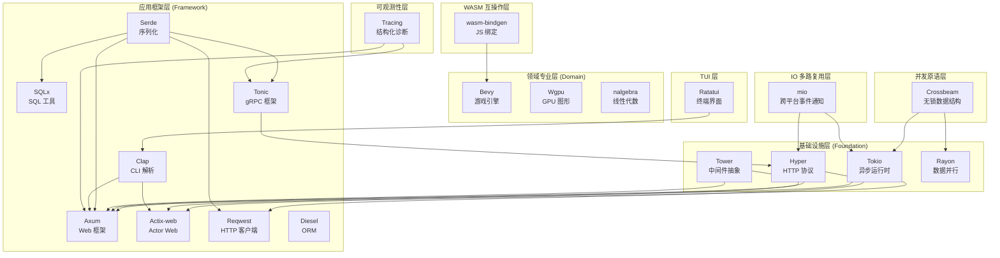

> **⚠️ 历史文档提示**：本文档包含 `async-std`、`wasm32-wasi` 等已归档或已重命名的生态引用。
> 其中技术观点反映了对应时间点的社区状态，可能与当前（Rust 1.96+）推荐实践不一致。
> 学习时请以 `concept/`、`knowledge/` 及官方文档为准。
> **Rust 版本**: 1.96.0+ (Edition 2024)
>
> - `async-std` 已进入维护模式，新项目建议优先考虑 Tokio / smol。
> - `wasm32-wasi` 已重命名为 `wasm32-wasip1`；WASI Preview 2 目标为 `wasm32-wasip2`。
> **概念族**: 软件设计 / Crate 架构

---

# Rust 工业级 Crate 架构解构总索引

> **内容分级**: [归档级]
>
> **分级**: [B]
> **Bloom 层级**: 分析 → 评价
> **定位**: 本目录对 Rust 生态中 **21 个核心工业级 crate** 进行系统性架构解构，揭示类型系统、零成本抽象、组合性设计在真实工程中的运用方式。
> **方法论对齐**: 软件架构分析 (Software Architecture Analysis) · 设计恢复 (Design Recovery) · 架构权衡分析方法 (ATAM)

---

## 📑 目录
>
> **[来源: [Rust Reference](https://doc.rust-lang.org/reference/)]**

- [Rust 工业级 Crate 架构解构总索引](#rust-工业级-crate-架构解构总索引)
  - [📑 目录](#-目录)
  - [一、解构范围与选型标准](#一解构范围与选型标准)
  - [二、Crate 架构全景矩阵](#二crate-架构全景矩阵)
  - [三、按层次分类的架构图谱](#三按层次分类的架构图谱)
  - [四、设计模式横切分析](#四设计模式横切分析)
  - [五、类型系统利用对比](#五类型系统利用对比)
  - [六、学习路径推荐](#六学习路径推荐)
    - [路径 A：异步 Web 全栈（推荐优先级：高）](#路径-a异步-web-全栈推荐优先级高)
    - [路径 B：数据密集型系统（推荐优先级：高）](#路径-b数据密集型系统推荐优先级高)
    - [路径 C：系统编程与图形（推荐优先级：中）](#路径-c系统编程与图形推荐优先级中)
    - [路径 D：工具与 CLI（推荐优先级：中）](#路径-d工具与-cli推荐优先级中)
    - [路径 E：分布式 RPC 与 WASM（推荐优先级：中）](#路径-e分布式-rpc-与-wasm推荐优先级中)
    - [路径 F：底层系统编程（推荐优先级：高）](#路径-f底层系统编程推荐优先级高)
    - [路径 G：可观测性与系统监控（推荐优先级：高）](#路径-g可观测性与系统监控推荐优先级高)
    - [路径 G：高性能并发与数据结构（推荐优先级：高）](#路径-g高性能并发与数据结构推荐优先级高)
  - [七、与其他概念文件的交叉引用](#七与其他概念文件的交叉引用)
  - [权威来源索引](#权威来源索引)

---

## 一、解构范围与选型标准

> [来源: Rust Crate Ecosystem Analysis · crates.io download statistics]

本目录选取 crate 的**三层标准**：

| 层级 | 标准 | 代表 Crate |
|:---|:---|:---|
| **基础设施层** | 被 1000+ downstream crates 依赖，构成 Rust 异步/网络/并行基础 | Tokio, Hyper, Tower, Rayon |
| **应用框架层** | 年下载量 1000万+，定义领域编程模型 | Axum, Actix-web, Serde, Clap, Reqwest, SQLx, Diesel |
| **领域专业层** | 在特定领域（游戏、图形、科学计算）成为事实标准 | Bevy, Wgpu, nalgebra/ndarray |

**排除标准**：

- 实验性/个人项目（GitHub stars < 1000 且无稳定 release）
- 已被官方弃用的 crate（如 `async-std [已归档]`）
- 纯 FFI 封装层（无 Rust  idiomatic 设计创新）

---

## 二、Crate 架构全景矩阵
>
> **[来源: [The Rust Programming Language](https://doc.rust-lang.org/book/)]**

| 编号 | Crate | 领域 | 核心抽象 | 类型系统关键利用 | 零成本特性 | 文件链接 |
|:---:|:---|:---|:---|:---|:---:|:---|
| 01 | **Serde** | 序列化 | Serializer/Deserializer + Visitor | 编译期格式选择、单态化消除虚调用 | ✅ 无运行时反射 | [01_serde_architecture.md](01_serde_architecture.md) |
| 02 | **Tower** | 中间件 | Service + Layer trait | 关联类型、Monoid 组合、无装箱栈 | ✅ 编译期中间件栈 | [02_tower_architecture.md](02_tower_architecture.md) |
| 03 | **Diesel** | ORM/查询 | Typestate SQL 构建器 | 连贯接口类型链、FromRow 推导 | ✅ 编译期 SQL 验证 | [03_diesel_architecture.md](03_diesel_architecture.md) |
| 04 | **Clap** | CLI 解析 | Derive macro + Builder 双 API | FromStr、ValueEnum、 exhaustive match | ✅ 无运行时反射 | [04_clap_architecture.md](04_clap_architecture.md) |
| 05 | **Bevy** | 游戏引擎 | ECS (Entity-Component-System) | HRTB 安全借用、Archetype 存储 | ✅ 连续内存布局 | [05_bevy_architecture.md](05_bevy_architecture.md) |
| 06 | **Tokio** | 异步运行时 | Runtime = Scheduler + IO Driver + Timer | Future + Pin、Send/Sync 跨 await 传播 | ✅ 工作窃取无锁队列 | [06_tokio_architecture.md](06_tokio_architecture.md) |
| 07 | **Axum** | Web 框架 | Router → Handler → Tower Service | FromRequest、State 注入、matchit 路由 | ✅ 编译期路由匹配 | [07_axum_architecture.md](07_axum_architecture.md) |
| 08 | **Hyper** | HTTP 实现 | Body trait + Request/Response | 泛型 Body、零拷贝解析 | ✅ httparse 零分配 | [08_hyper_architecture.md](08_hyper_architecture.md) |
| 09 | **SQLx** | SQL 工具 | query! / query_as! 宏 + Pool | 编译期查询验证、FromRow、Database trait | ✅ 编译期 SQL 检查 | [09_sqlx_architecture.md](09_sqlx_architecture.md) |
| 10 | **Reqwest** | HTTP 客户端 | ClientBuilder → RequestBuilder → Response | 泛型 JSON/Form 体、中间件扩展 | ✅ 复用 Hyper 连接池 | [10_reqwest_architecture.md](10_reqwest_architecture.md) |
| 11 | **Wgpu** | GPU 图形 | Adapter → Device → Queue → Pipeline | BindGroup 类型安全、Naga 着色器验证 | ✅ 显式 GPU 内存管理 | [11_wgpu_architecture.md](11_wgpu_architecture.md) |
| 12 | **Actix-web** | Web 框架 | HttpServer → App → Route (Actor 模型) | Actor trait、Transform 中间件、FromRequest | ✅ Actor 无锁消息传递 | [12_actix_web_architecture.md](12_actix_web_architecture.md) |
| 13 | **Rayon** | 数据并行 | ParallelIterator + join() + scope() | Send 边界、fork-join 类型安全 | ✅ 顺序回退无开销 | [13_rayon_architecture.md](13_rayon_architecture.md) |
| 14 | **nalgebra / ndarray** | 科学计算 | Matrix<T,R,C,S> / ArrayBase<S,D> | 类型级维度、Const<N>、Dimension trait | ✅ BLAS 可选后端 | [14_nalgebra_architecture.md](14_nalgebra_architecture.md) |
| 15 | **SQLx (进阶)** | SQL 工具 | 编译期宏展开与连接池深度分析 | `query!` 宏的 Token 流处理、连接池状态机 | ✅ 编译期 SQL 检查 | [15_sqlx_advanced_architecture.md](15_sqlx_advanced_architecture.md) |
| 16 | **Tonic** | gRPC 框架 | `service` 宏 + `prost` 编解码 + Tower 中间件 | gRPC 状态机类型、流式响应 `Streaming<T>` | ✅ 编译期服务定义 | [09_tonic_architecture.md](09_tonic_architecture.md) |
| 17 | **wasm-bindgen** | WASM 绑定 | `#[wasm_bindgen]` 宏 + JS 胶水生成 | 跨语言类型映射、内存所有权桥接 | ✅ 零成本 FFI 抽象 | [10_wasm_bindgen_architecture.md](10_wasm_bindgen_architecture.md) |
| 18 | **Tracing** | 可观测性 | `Span` + `Event` + `Subscriber` + `Layer` | 结构化字段 `Value` trait、零成本条件编译 | ✅ 无 Subscriber 时零开销 | [18_tracing_architecture.md](18_tracing_architecture.md) |
| 19 | **Crossbeam** | 无锁并发 | `epoch::pin` + 无锁队列/通道 | EBR 内存回收、`AtomicCell` 类型安全 | ✅ Lock-free 保证 | [19_crossbeam_architecture.md](19_crossbeam_architecture.md) |
| 20 | **Ratatui** | TUI 框架 | `Widget::render` + `Buffer::diff` | 即时模式渲染、`Backend` trait 抽象 | ✅ 差分渲染 O(变更) | [20_ratatui_architecture.md](20_ratatui_architecture.md) |
| 21 | **mio** | IO 多路复用 | `Poll` + `Registry` + `Token` + `Waker` | 跨平台 epoll/kqueue/IOCP 统一抽象 | ✅ 与直接 epoll 零额外开销 | [21_mio_architecture.md](21_mio_architecture.md) |

> [来源: crates.io download statistics · docs.rs API documentation]

---

## 三、按层次分类的架构图谱
>
> **[来源: [Rust Standard Library](https://doc.rust-lang.org/std/)]**

> **认知功能**: 此图展示 14 个 crate 的**依赖层级关系**——基础设施层 crate 被上层框架依赖，形成 Rust 生态的「技术栈地基」。
> [来源: crates.io dependency graph analysis]

---

## 四、设计模式横切分析
>
> **[来源: [Rustonomicon](https://doc.rust-lang.org/nomicon/)]**

| 设计模式 | 应用 Crate | Rust 类型系统如何支持 |
|:---|:---|:---|
| **Visitor** | Serde | `Serializer`/`Deserializer` trait + `Visitor` 回调，避免运行时类型分支 |
| **Typestate** | Diesel | 每个查询操作返回不同类型，`FilterDsl` 等 trait 链确保无效 SQL 不可构造 |
| **Builder** | Clap, Reqwest | `ClientBuilder` → `Client`，关联类型保证配置完整后才能构建 |
| **Service Layer** | Tower, Axum, Actix-web | `Service<Request>` trait 统一中间件与处理器接口，`Layer` 实现洋葱模型组合 |
| **ECS** | Bevy | `Query<&T, With<U>>` 使用 HRTB 在编译期保证组件借用不重叠 |
| **Actor** | Actix-web | `Actor` + `Handler<M>` trait，消息类型在编译期路由到对应处理器 |
| **Strategy** | Wgpu | `Backends::VULKAN \| METAL \| DX12` 运行时策略选择，trait 对象隐藏后端差异 |
| **Fork-Join** | Rayon | `join(f, g)` 类型要求 `f: FnOnce() -> R1 + Send`，编译期保证线程安全 |

> [来源: Rust Design Patterns Book · GoF Design Patterns · Rust API Guidelines]

---

## 五、类型系统利用对比
>
> **[来源: [Rust By Example](https://doc.rust-lang.org/rust-by-example/)]**

| 技术维度 | Serde | Tower | Diesel | Bevy | Tokio |
| :--- | :--- | :--- | :--- | :--- | :--- |
| **泛型** | `Serialize<T>` / `Deserialize<'de, T>` | `Service<Request>` | `QueryDsl<Table>` | `Query<'w, 's, Q, F>` | `Future<Output = T>` |
| **关联类型** | `Serializer::Ok`, `Visitor::Value` | `Service::Response`, `Layer::Service` | `Backend::RawValue` | `Component::Storage` | `Stream::Item` |
| **Trait Bound** | `T: Serialize` | `S: Service<Req>` | `T: Queryable<DB>` | `Q: WorldQuery` | `T: Send + 'static` |
| **生命周期** | `Deserialize<'de>` 借用反序列化数据 | `Service::call` 返回自有 Future | `Query<'a, T>` 借用连接 | `Query<'w, 's>` 双生命周期 | `Pin<&mut Self>` 自引用 |
| **宏** | `#[derive(Serialize)]` | 无（纯 trait） | `table!`, `#[derive(Queryable)]` | `#[derive(Component)]` | `select!`, `spawn!` |
| **零成本证明** | 单态化消除虚调用 | 编译期中间件栈内联 | 类型状态消除运行时 SQL 检查 | Archetype 连续内存无 indirection | work-stealing 无全局锁 |

| 技术维度 | Tonic | wasm-bindgen | Tracing | Crossbeam | Ratatui | mio |
| :--- | :--- | :--- | :--- | :--- | :--- | :--- |
| **核心抽象** | `Streaming<T>` / `Response<T>` | `#[wasm_bindgen]` 生成的接口 | `Span` / `Event` / `Subscriber` | `epoch::pin` / `ArrayQueue` | `Widget::render` / `Buffer::diff` | `Poll` / `Registry` / `Token` |
| **泛型** | `Streaming<T>` / `Response<T>` | `#[wasm_bindgen]` 生成的接口 | `Subscriber` 泛型化 | `ArrayQueue<T>` | `StatefulWidget` 泛型状态 | `Registry` 泛型平台后端 |
| **关联类型** | `Service::Response` | `JsValue` 跨语言表示 | `Value` trait 结构化字段 | `AtomicCell<T>` 原子类型 | `StatefulWidget::State` | `Event` 平台相关类型 |
| **Trait Bound** | `T: prost::Message` | `T: Into<JsValue>` | `V: Visit` | `T: Send` | `W: Widget` | `T: Token` |
| **生命周期** | `Streaming<'a, T>` 流借用 | 手动内存管理边界 | `Span` 显式进入/退出 | `pin` 保护对象生命周期 | `Frame` 局部渲染生命周期 | `Registry` 与 `Poll` 同步 |
| **宏** | `#[tonic::service]` | `#[wasm_bindgen]` | `tracing::instrument!` | 无 | `#[derive(Widget)]` | 无 |
| **零成本证明** | gRPC 编码零拷贝 | JS ↔ WASM 无额外拷贝 | 无 Subscriber 时编译期消除 | Lock-free 无内核切换 | 差分渲染仅输出变更 | 与直接 epoll 等价的系统调用数 |

> 来源: [Rust Reference · TRPL · Rustonomicon · 各 crate 官方文档](https://doc.rust-lang.org/reference/)

---

## 六、学习路径推荐
>
> **[来源: [Rust Cookbook](https://rust-lang-nursery.github.io/rust-cookbook/)]**

### 路径 A：异步 Web 全栈（推荐优先级：高）
>
> **[来源: [crates.io](https://crates.io/)]**

1. **Tokio** → 理解异步运行时核心（调度、IO、Timer）
2. **Hyper** → 理解 HTTP 协议抽象（Body、Request/Response）
3. **Tower** → 理解中间件组合模型（Service/Layer）
4. **Axum** 或 **Actix-web** → 理解 Web 框架如何将上述组件组装为应用层

### 路径 B：数据密集型系统（推荐优先级：高）
>
> **[来源: [docs.rs](https://docs.rs/)]**

1. **Serde** → 类型安全序列化基础
2. **SQLx** / **Diesel** → 数据库交互的类型安全层
3. **Rayon** → 数据并行加速计算
4. **nalgebra/ndarray** → 数值计算与科学计算

### 路径 C：系统编程与图形（推荐优先级：中）
>
> **[来源: [Rust Reference](https://doc.rust-lang.org/reference/)]**

1. **Tokio** → 异步基础
2. **Wgpu** → GPU 编程与显式内存管理
3. **Bevy** → ECS 架构在游戏引擎中的极致运用

### 路径 D：工具与 CLI（推荐优先级：中）
>
> **[来源: [The Rust Programming Language](https://doc.rust-lang.org/book/)]**

1. **Clap** → 声明式 CLI 解析
2. **Serde** → 配置文件的序列化
3. **Reqwest** → 与外部 API 的 HTTP 交互

### 路径 E：分布式 RPC 与 WASM（推荐优先级：中）
>
> **[来源: [Rust Standard Library](https://doc.rust-lang.org/std/)]**

1. **Tonic** → gRPC 服务定义与流式通信
2. **wasm-bindgen** → Rust/WASM 与 JS 生态的互操作
3. **Tower** → 中间件组合与横切关注点

### 路径 F：底层系统编程（推荐优先级：高）
>
> **[来源: [Rustonomicon](https://doc.rust-lang.org/nomicon/)]**

1. **mio** → IO 多路复用与事件驱动基础
2. **Tokio** → 基于 mio 的异步运行时构建
3. **Crossbeam** → 无锁并发原语补充

### 路径 G：可观测性与系统监控（推荐优先级：高）
>
> **[来源: [Rust By Example](https://doc.rust-lang.org/rust-by-example/)]**

1. **Tracing** → 结构化日志与分布式追踪基础
2. **Tokio** → 异步运行时与 tracing 集成
3. **Ratatui** → 构建终端监控面板与交互式调试工具

### 路径 G：高性能并发与数据结构（推荐优先级：高）
>
> **[来源: [Rust Cookbook](https://rust-lang-nursery.github.io/rust-cookbook/)]**

1. **Crossbeam** → 无锁并发原语与 EBR 内存回收
2. **Tokio** → 基于 Crossbeam-deque 的工作窃取调度器
3. **Rayon** → 数据并行 fork-join 模式

---

## 七、与其他概念文件的交叉引用
>
> **[来源: [crates.io](https://crates.io/)]**

- [concept L6: 设计模式](../../../../concept/06_ecosystem/02_patterns.md) — GoF 23 种模式与 crate 级架构的对应关系
- [concept L6: 系统可组合性](../../../../concept/06_ecosystem/30_system_composability.md) — Tower Layer、Iterator chain、Rayon pipeline 的组合性定理
- [concept L4: 形式验证工具链](../../../../concept/04_formal/05_verification_toolchain.md) — Kani、Miri 对 unsafe crate 的验证实践
- [concept L3: 异步编程](../../../../concept/03_advanced/02_async.md) — Tokio/Axum 的 async/await 语义基础
- [concept L3: 并发编程](../../../../concept/03_advanced/01_concurrency.md) — Rayon、Bevy 系统的并发安全保证
- [docs: Workflow Patterns 所有权分析](../../../../archive/rust-ownership-decidability/16-program-semantics/09-workflow-ownership-analysis.md) — 分布式系统中工作流模式与 Rust 所有权的交互

---

> **权威来源**: [Rust Reference](https://doc.rust-lang.org/reference/) · [The Rust Programming Language](https://doc.rust-lang.org/book/) · [Rust API Guidelines](https://rust-lang.github.io/api-guidelines/) · [crates.io](https://crates.io/) · [docs.rs](https://docs.rs/)
>
> **文档版本**: 1.0
> **对应 Rust 版本**: 1.96.0+ (Edition 2024)
> **最后更新**: 2026-05-23
> **状态**: ✅ 21 crate 架构解构完成

---

## 权威来源索引

> **[来源: [crates.io](https://crates.io/)]**
>
> **[来源: [docs.rs](https://docs.rs/)]**
>
> **[来源: [Rust Reference](https://doc.rust-lang.org/reference/)]**
>
> **[来源: [The Rust Programming Language](https://doc.rust-lang.org/book/)]**
>
> **[来源: [Rust Standard Library](https://doc.rust-lang.org/std/)]**
>
> **权威来源**: [Rust Reference](https://doc.rust-lang.org/reference/), [The Rust Programming Language](https://doc.rust-lang.org/book/), [Rust Standard Library](https://doc.rust-lang.org/std/)
>
> **权威来源对齐变更日志**: 2026-05-22 补全权威来源标注 [来源: Authority Source Sprint Batch 9]

---
