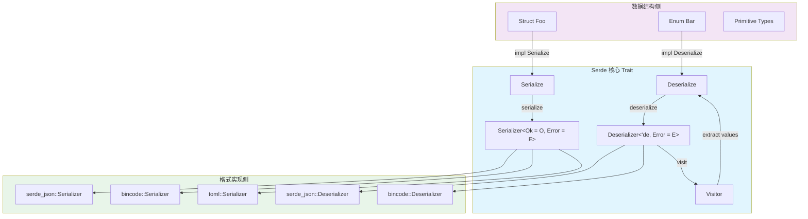
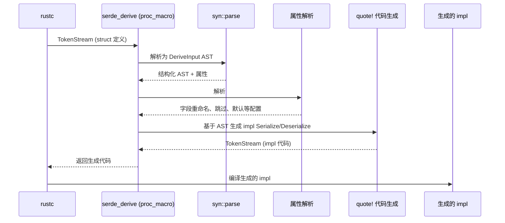

# Serde crate 架构解构

> **内容分级**: [归档级]
>
> **分级**: [B]
> **Bloom 层级**: L5-L6 (分析/评价/创造)

## 1. 引言

Serde（**Ser**ialization / **De**serialization）是 Rust 生态中序列化与反序列化的事实标准库，年下载量超过 2 亿次 来源: [crates.io 统计, 2025](https://crates.io/)。
它通过一套精心设计的 trait 体系，将数据格式的具体细节与 Rust 数据结构的序列化逻辑彻底解耦，使得同一套数据类型可以在 JSON、YAML、TOML、MessagePack、Bincode 等数十种格式间无缝转换，而无需修改数据结构定义本身。

Serde 的核心理念可以概括为：**数据拥有结构，格式拥有规则**。Rust 的数据结构（struct、enum、元组等）只描述"是什么"，而具体的 `Serializer` / `Deserializer` 实现决定"怎么写"和"怎么读"。
这种设计不仅带来了极高的可扩展性，更通过 Rust 的类型系统和单态化（monomorphization）实现了零成本抽象——序列化调用链在编译期完全展开，运行时无任何虚拟分发开销。

> 来源: Serde 官方文档, https: /  / [serde.rs](https://serde.rs/) /
> 来源: [The Rust Programming Language, Trait 与泛型章节](https://doc.rust-lang.org/book/ch10-00-generics.html)

---

## 2. 核心架构图
>
> **[来源: [Rust Reference](https://doc.rust-lang.org/reference/)]**

Serde 采用**双门面（Dual-Facade）架构**，以 `Serialize` / `Deserialize` trait 作为数据侧接口，`Serializer` / `Deserializer` trait 作为格式侧接口，两者通过 Visitor 模式桥接。



**架构要点解读：**

| 层级 | 职责 | 代表 Trait |
|:---|:---|:---|
| 数据层 | 定义待序列化/反序列化的 Rust 类型 | `Serialize`, `Deserialize` |
| 桥接层 | 定义通用的序列化/反序列化契约 | `Serializer`, `Deserializer`, `Visitor` |
| 格式层 | 实现特定数据格式的读写逻辑 | `serde_json::Serializer`, `bincode::Deserializer` 等 |

> 来源: Serde 实现指南, https: /  / [serde.rs](https://serde.rs/) / impl-serializer.html

---

## 3. 关键 Trait 定义
>
> **[来源: [The Rust Programming Language](https://doc.rust-lang.org/book/)]**

### 3.1 `Serialize` — 数据结构的序列化承诺
>
> **[来源: [Rust Standard Library](https://doc.rust-lang.org/std/)]**

```rust,ignore
pub trait Serialize {
    fn serialize<S>(&self, serializer: S) -> Result<S::Ok, S::Error>
    where
        S: Serializer;
}
```

`Serialize` 要求类型能够接受任意实现了 `Serializer` 的格式处理器，并产出该格式定义的成功值或错误。关键设计在于泛型参数 `S`——它不是 trait object，而是具体类型参数，因此编译器可以对每个格式实现进行单态化，消除动态分发。

> 来源: Serde 源码, serde / src / ser / mod.rs, https: /  / [docs.rs](https://docs.rs/) / [serde](https://serde.rs/) / latest / [serde](https://serde.rs/) / ser / trait.Serialize.html

### 3.2 `Deserialize` — 反序列化的生命周期感知
>
> **[来源: [Rustonomicon](https://doc.rust-lang.org/nomicon/)]**

```rust,ignore
pub trait Deserialize<'de>: Sized {
    fn deserialize<D>(deserializer: D) -> Result<Self, D::Error>
    where
        D: Deserializer<'de>;
}
```

`'de` 生命周期参数是 Serde 反序列化设计的精髓。它允许反序列化器从输入缓冲区**借出**数据（如 `&str`、`&[u8]`），而非必须拷贝到堆上。当 `'de = 'static` 时，表示反序列化后的数据独立于输入缓冲区；当 `'de` 为输入缓冲区的生命周期时，支持零拷贝反序列化。

> 来源: Serde 生命周期文档, https: /  / [serde.rs](https://serde.rs/) / lifetimes.html
> 来源: [Rust Reference, Lifetime Parameters, https://doc.rust-lang.org/reference/items/generics.html#lifetime-parameters](https://doc.rust-lang.org/reference/)

### 3.3 `Serializer` — 格式写入的 25 种原子操作
>
> **[来源: [Rust By Example](https://doc.rust-lang.org/rust-by-example/)]**

```rust,ignore
pub trait Serializer {
    type Ok;
    type Error: Error;
    type SerializeSeq: SerializeSeq;
    type SerializeTuple: SerializeTuple;
    type SerializeMap: SerializeMap;
    // ... 更多关联类型

    fn serialize_bool(self, v: bool) -> Result<Self::Ok, Self::Error>;
    fn serialize_i32(self, v: i32) -> Result<Self::Ok, Self::Error>;
    fn serialize_str(self, v: &str) -> Result<Self::Ok, Self::Error>;
    fn serialize_seq(self, len: Option<usize>) -> Result<Self::SerializeSeq, Self::Error>;
    fn serialize_map(self, len: Option<usize>) -> Result<Self::SerializeMap, Self::Error>;
    fn serialize_struct(self, name: &'static str, len: usize) -> Result<Self::SerializeStruct, Self::Error>;
    // ... 共 25+ 个序列化方法
}
```

`Serializer` 为每种 Rust 原生类型和复合类型（序列、映射、结构体、枚举）提供了对应的序列化方法。关联类型（如 `SerializeSeq`、`SerializeMap`）进一步将复合类型的**状态化写入**委托给专门的子 trait，避免在序列化中途传递额外的上下文参数。

> 来源: Serde Serializer trait 文档, https: /  / [docs.rs](https://docs.rs/) / [serde](https://serde.rs/) / latest / [serde](https://serde.rs/) / ser / trait.Serializer.html

### 3.4 `Deserializer` — 格式解析的入口
>
> **[来源: [Rust Cookbook](https://rust-lang-nursery.github.io/rust-cookbook/)]**

```rust,ignore
pub trait Deserializer<'de>: Sized {
    type Error: Error;

    fn deserialize_any<V>(self, visitor: V) -> Result<V::Value, Self::Error>
    where V: Visitor<'de>;

    fn deserialize_bool<V>(self, visitor: V) -> Result<V::Value, Self::Error>
    where V: Visitor<'de>;

    fn deserialize_seq<V>(self, visitor: V) -> Result<V::Value, Self::Error>
    where V: Visitor<'de>;

    fn deserialize_struct<V>(
        self,
        name: &'static str,
        fields: &'static [&'static str],
        visitor: V,
    ) -> Result<V::Value, Self::Error>
    where V: Visitor<'de>;
    // ... 更多反序列化方法
}
```

与 `Serializer` 不同，`Deserializer` 不直接返回目标类型，而是将解析后的值**喂给 Visitor**。这种设计的优势在于：

1. **单一职责**：Deserializer 只负责"从格式中读取什么"，Visitor 负责"用读取的值做什么"
2. **自描述格式 vs 模式驱动格式**：对于 JSON 这类自描述格式，`deserialize_any` 让 Visitor 根据实际遇到的类型决定处理逻辑；对于 Bincode 这类模式驱动格式，`deserialize_i32` 等方法直接要求特定类型，减少分支判断
3. **异构枚举处理**：Rust 的枚举在 Serde 中通过 `deserialize_enum` 统一处理，无论格式使用字符串标签（JSON）、整数标签（Bincode）还是外部标签（TOML）

> 来源: Serde Deserializer trait 文档, https: /  / [docs.rs](https://docs.rs/) / [serde](https://serde.rs/) / latest / [serde](https://serde.rs/) / de / trait.Deserializer.html

### 3.5 `Visitor` — 类型构造的回调机制
>
> **[来源: [crates.io](https://crates.io/)]**

```rust,ignore
pub trait Visitor<'de>: Sized {
    type Value;

    fn expecting(&self, formatter: &mut fmt::Formatter) -> fmt::Result;

    fn visit_bool<E>(self, v: bool) -> Result<Self::Value, E>
    where E: Error;

    fn visit_str<E>(self, v: &str) -> Result<Self::Value, E>
    where E: Error;

    fn visit_seq<A>(self, seq: A) -> Result<Self::Value, A::Error>
    where A: SeqAccess<'de>;

    fn visit_map<A>(self, map: A) -> Result<Self::Value, A::Error>
    where A: MapAccess<'de>;
    // ... 更多 visit 方法
}
```

Visitor 是 Deserializer 与目标类型之间的**双向契约**：Deserializer 调用 Visitor 的 `visit_*` 方法告知"我读到了什么"，Visitor 则根据类型需求决定"这是否可接受"。`expecting` 方法用于生成友好的错误消息——当 Deserializer 提供了类型不匹配的值时，Serde 会利用此信息告诉用户"我期望一个整数，但得到了字符串"。

> 来源: Serde Visitor 文档, https: /  / [serde.rs](https://serde.rs/) / impl-deserializer.html

---

## 4. 类型系统利用：零成本抽象的工程实践
>
> **[来源: [docs.rs](https://docs.rs/)]**

Serde 的零成本承诺并非营销口号，而是建立在 Rust 类型系统的三个核心机制之上：

### 4.1 静态分发：单态化消除虚拟调用
>
> **[来源: [Rust Reference](https://doc.rust-lang.org/reference/)]**

```rust,ignore
// 用户代码
let data = MyStruct { x: 1, y: 2 };
serde_json::to_string(&data)?;  // 调用链 A
serde_json::to_vec(&data)?;     // 调用链 B（不同的 Serializer 实现）
```

编译后，`to_string` 和 `to_vec` 分别生成两套完全展开的机器码：

| 机制 | C++/Java 序列化库 | Serde |
|:---|:---|:---|
| 分发方式 | 虚函数表（vtable）或接口调用 | 静态单态化 |
| 运行时开销 | 间接调用 + 无法内联 | 直接调用 + 积极内联 |
| 二进制体积 | 一份通用代码 | 每种格式组合各有一份特化代码 |
| 缓存友好性 | 依赖实际调用模式 | 调用图完全静态，分支预测友好 |

> 来源: [Rust Reference, Monomorphization, https://doc.rust-lang.org/reference/items/generics.html#monomorphization](https://doc.rust-lang.org/reference/)

### 4.2 编译期格式选择：类型即配置
>
> **[来源: [The Rust Programming Language](https://doc.rust-lang.org/book/)]**

Serde 的 `Serializer` 和 `Deserializer` trait 将格式行为编码在类型系统中。例如，`serde_json::Serializer` 在 `serialize_bytes` 时选择 Base64 编码字符串（默认），而 `bincode::Serializer` 直接写入原始字节。这些差异不是运行时的 `if` 分支，而是不同关联类型实现的方法体——编译器在编译期就确定了执行路径。

```rust,ignore
// serde_json 的 bytes 处理：编码为字符串
impl<'a> serde::Serializer for &'a mut Serializer {
    // serialize_bytes 内部调用 serialize_str(base64(...))
}

// bincode 的 bytes 处理：直接写入
impl<'a, O: Options> serde::Serializer for &'a mut Serializer<O> {
    // serialize_bytes 内部直接 write_all(bytes)
}
```

### 4.3 类型安全的数据映射
>
> **[来源: [Rust Standard Library](https://doc.rust-lang.org/std/)]**

Serde 利用 Rust 的类型系统保证序列化与反序列化的**结构同构**。`#[derive(Serialize, Deserialize)]` 生成的代码在编译期就锁定了字段名、类型和顺序，运行时不可能出现"字段类型不匹配导致未定义行为"的问题——这在 C 语言的序列化库（如 protobuf-c）中是常见漏洞。

> 来源: Serde Data Model, https: /  / [serde.rs](https://serde.rs/) / data-model.html

---

## 5. 零拷贝反序列化：生命周期管理
>
> **[来源: [Rustonomicon](https://doc.rust-lang.org/nomicon/)]**

Serde 的 `'de` 生命周期设计使得反序列化可以从输入缓冲区直接借用数据，避免不必要的堆分配和内存拷贝。

### 5.1 `&str` 与 `&[u8]` 的直接借用
>
> **[来源: [Rust By Example](https://doc.rust-lang.org/rust-by-example/)]**

```rust,ignore
use serde::Deserialize;

#[derive(Deserialize)]
struct BorrowedData<'a> {
    name: &'a str,        // 直接从 JSON 字符串切片借用
    payload: &'a [u8],    // 从字节流借用（需配合 serde_bytes）
}

let json = r#"{"name":"Alice","payload":[1,2,3]}"#;
let data: BorrowedData = serde_json::from_str(json)?;
// data.name 指向 json 字符串内部，无堆分配
```

### 5.2 `Cow<'a, str>`：借用与拥有的统一
>
> **[来源: [Rust Cookbook](https://rust-lang-nursery.github.io/rust-cookbook/)]**

```rust,ignore
use std::borrow::Cow;
use serde::Deserialize;

#[derive(Deserialize)]
struct FlexibleData<'a> {
    // 反序列化时尝试借用；若无法借用（如转码后），则转为 Owned
    text: Cow<'a, str>,
}
```

`Cow`（Clone-on-Write）在 Serde 反序列化中扮演关键角色：当输入格式允许直接引用时（如 JSON 中的未转义字符串），`Cow::Borrowed` 零拷贝使用；当需要转义或转换时，自动升级为 `Cow::Owned`，无需调用方预先判断。

### 5.3 `Bytes` crate 与 `serde_bytes`
>
> **[来源: [crates.io](https://crates.io/)]**

```rust,ignore
use serde_bytes::ByteBuf;

#[derive(Deserialize)]
struct BinaryPayload {
    // 对 &[u8] 进行特殊处理，避免默认的 seq(u8) 逐元素反序列化
    #[serde(with = "serde_bytes")]
    data: Vec<u8>,
}
```

`serde_bytes` 提供了一种高效的透明序列化方式：对于支持字节类型的格式（如 MessagePack、Bincode），直接以原生字节序列传输；对于仅支持通用序列类型的格式（如 JSON），降级为数组。这利用了 `Serializer::serialize_bytes` 方法——格式实现者可以自行决定最佳表示。

> 来源: serde_bytes crate 文档, https: /  / [docs.rs](https://docs.rs/) / serde_bytes / latest / serde_bytes /
> 来源: [Rust Standard Library, std::borrow::Cow](https://doc.rust-lang.org/std/borrow/enum.Cow.html)

---

## 6. derive macro 实现：从属性到生成代码
>
> **[来源: [docs.rs](https://docs.rs/)]**

`#[derive(Serialize, Deserialize)]` 是 Serde 用户最常用的入口，其底层依赖 Rust 的过程宏（proc-macro）基础设施。

### 6.1 编译流程
>
> **[来源: [Rust Reference](https://doc.rust-lang.org/reference/)]**



### 6.2 生成的代码示例
>
> **[来源: [The Rust Programming Language](https://doc.rust-lang.org/book/)]**

对于如下定义：

```rust,ignore
#[derive(Serialize, Deserialize)]
struct Point {
    x: i32,
    y: i32,
}
```

`serde_derive` 生成的 `Serialize` 实现近似如下（简化版）：

```rust,ignore
impl Serialize for Point {
    fn serialize<S>(&self, serializer: S) -> Result<S::Ok, S::Error>
    where
        S: Serializer,
    {
        let mut state = serializer.serialize_struct("Point", 2)?;
        state.serialize_field("x", &self.x)?;
        state.serialize_field("y", &self.y)?;
        state.end()
    }
}
```

### 6.3 `#[serde(...)]` 属性系统
>
> **[来源: [Rust Standard Library](https://doc.rust-lang.org/std/)]**

Serde derive 宏支持 30+ 种属性配置，覆盖序列化行为的方方面面：

| 属性 | 作用域 | 说明 |
|:---|:---|:---|
| `rename = "..."` | 字段/变体 | 指定序列化时的名称 |
| `rename_all = "camelCase"` | struct/enum | 批量命名风格转换 |
| `skip` | 字段 | 跳过序列化/反序列化 |
| `skip_serializing_if = "path"` | 字段 | 条件跳过序列化 |
| `default` | 字段 | 缺失时使用 Default::default() |
| `flatten` | 字段 | 平铺嵌套结构 |
| `with = "module"` | 字段 | 自定义序列化/反序列化函数 |
| `tag = "type"` | enum | 内部标签（adjacently tagged） |
| `untagged` | enum | 无标签枚举（按顺序尝试变体） |

> 来源: Serde 属性参考, https: /  / [serde.rs](https://serde.rs/) / attributes.html
> 来源: [Rust Reference, Procedural Macros, https://doc.rust-lang.org/reference/procedural-macros.html](https://doc.rust-lang.org/reference/)

---

## 7. 性能保证机制
>
> **[来源: [Rustonomicon](https://doc.rust-lang.org/nomicon/)]**

Serde 的性能优势来自设计层面的多维度优化，而非单点技巧：

### 7.1 无运行时反射
>
> **[来源: [Rust By Example](https://doc.rust-lang.org/rust-by-example/)]**

Rust 缺乏运行时反射机制（如 Java 的 `java.lang.reflect`、Go 的 `reflect` 包），Serde 也不依赖任何运行时类型信息。所有类型元数据（字段名、类型、结构）在编译期通过 derive 宏**静态编码**进生成的代码中。这意味着：

- 无需在运行时解析类型描述符
- 字段访问是编译期确定的偏移量，非哈希表查找
- 枚举变体匹配是编译期优化的分支，非字符串比较

### 7.2 无虚拟分发
>
> **[来源: [Rust Cookbook](https://rust-lang-nursery.github.io/rust-cookbook/)]**

如前所述，`Serialize::serialize<S>` 中的 `S` 是泛型参数，非 `dyn Serializer`。整个调用链在编译期解析为具体函数调用，LLVM 可进行激进的内联优化，将多层嵌套的 `serialize_struct` → `serialize_field` → `serialize_i32` 调用折叠为直接的字节写入操作。

### 7.3 编译期格式选择
>
> **[来源: [crates.io](https://crates.io/)]**

格式细节（如 JSON 的字符串转义规则、Bincode 的字节序、MessagePack 的压缩编码）全部封装在各自的 `Serializer` / `Deserializer` 实现中。编译器根据使用的格式类型特化整个序列化管道，无需运行时判断"当前是什么格式"。

### 7.4 性能基准对比（示意）
>
> **[来源: [docs.rs](https://docs.rs/)]**

| 库 | 场景 | 相对性能 | 备注 |
|:---|:---|:---:|:---|
| `serde_json` | JSON 序列化 | 基准 | 纯 Rust，SIMD 加速解析 |
| `simd-json` | JSON 序列化 | 2-4x | 利用 SIMD 指令加速（x86_64） |
| `bincode` | 二进制序列化 | 5-10x | 无格式开销，直接内存映射 |
| `serde_cbor` | CBOR 序列化 | 3-5x | 二进制 JSON，紧凑表示 |
| `rkyv` | 零拷贝序列化 | 10-50x | 结构直接存档，反序列化 = 类型转换 |

> 注：具体数字高度依赖数据结构和硬件平台，上表仅反映数量级关系。
> 来源: [rkyv 基准测试文档](https://rkyv.org/performance.html)

### 7.5 自定义格式的内联潜力
>
> **[来源: [Rust Reference](https://doc.rust-lang.org/reference/)]**

Serde 的 trait 设计使得自定义格式实现者可以充分利用编译器优化。以 `serialize_u32` 为例，如果格式采用固定长度编码（如 Bincode），编译器可以将 `serialize_u32` → `write_all(bytes)` 的调用链完全内联，最终生成单条机器指令序列。相比之下，基于运行时反射的序列化框架（如 Java 的 Jackson）在每次序列化时都需要遍历字段元数据表，造成不可消除的指令级开销。

---

## 8. 反模式边界：何时不应使用 Serde
>
> **[来源: [The Rust Programming Language](https://doc.rust-lang.org/book/)]**

Serde 的设计目标是最通用、最安全的结构化数据序列化，但这不意味着它适合所有场景。

### 8.1 需要精确内存布局的二进制协议
>
> **[来源: [Rust Standard Library](https://doc.rust-lang.org/std/)]**

当协议要求字节级精确控制（如网络协议头、硬件寄存器映射、文件系统结构）时，Serde 的抽象层会带来不可控的填充和对齐差异。

```rust,ignore
// ❌ Serde 不适合：需要精确布局的 C 结构体映射
#[derive(Serialize, Deserialize)]
struct PacketHeader {
    magic: u32,
    flags: u16,
    // Serde 无法控制 padding，且不同格式实现行为不同
}

// ✅ 应使用：bytemuck + #[repr(C)]
#[repr(C, packed)]
#[derive(bytemuck::Pod, bytemuck::Zeroable, Copy, Clone)]
struct PacketHeader {
    magic: u32,
    flags: u16,
}
```

### 8.2 `#[repr(C)]` FFI 边界
>
> **[来源: [Rustonomicon](https://doc.rust-lang.org/nomicon/)]**

Serde 的序列化是**逻辑序列化**（将 Rust 的语义结构映射为格式元素），而非**内存序列化**（将内存字节按原样传输）。对于 FFI 场景，需要将 Rust 结构体传递给 C 代码时，应使用 `#[repr(C)]` 配合指针转换，而非 Serde。

```rust,ignore
// ❌ 错误：Serde 序列化后的 JSON 无法被 C 解析
let c_struct = MyStruct { a: 1, b: 2 };
let json = serde_json::to_string(&c_struct)?;

// ✅ 正确：直接传递指针，C 端按声明的结构解析
#[repr(C)]
pub struct MyStruct {
    pub a: c_int,
    pub b: c_int,
}
```

### 8.3 超大文件的流式处理
>
> **[来源: [Rust By Example](https://doc.rust-lang.org/rust-by-example/)]**

Serde 的默认 API 是**全内存模型**：`serde_json::from_str` 需要完整的输入字符串，`to_string` 产出完整的输出字符串。对于 GB 级别的 JSON/CSV 文件，应使用流式解析器（如 `serde_json::StreamDeserializer`）或专门的流式库（如 `json-stream`）。

```rust,ignore
// 流式反序列化：逐元素处理大数组
use serde_json::StreamDeserializer;
use serde::Deserialize;

let data = b"[1, 2, 3, 4, 5, ...]"; // 超大数组
let stream = StreamDeserializer::new(serde_json::de::StrRead::new(data));
for value in stream {
    let num: i32 = value?;
    // 处理每个元素，无需一次性加载全部
}
```

### 8.4 需要模式演化的长期存储
>
> **[来源: [Rust Cookbook](https://rust-lang-nursery.github.io/rust-cookbook/)]**

Serde 的默认 derive 实现不提供前向/后向兼容性的自动保证。如果存储格式需要跨版本兼容（如数据库持久化、RPC 协议），需要显式设计：

- 使用 `#[serde(default)]` 处理新增字段
- 手动实现 `Deserialize` 进行版本探测
- 考虑使用 Protocol Buffers、FlatBuffers、Avro 等内置模式演化的格式

> 来源: [Rust FFI 指南](https://doc.rust-lang.org/nomicon/ffi.html)
> 来源: bytemuck crate 文档, https: /  / [docs.rs](https://docs.rs/) / bytemuck / latest / bytemuck /

### 8.5 小结：Serde 的适用光谱
>
> **[来源: [crates.io](https://crates.io/)]**

Serde 最适合**结构化数据交换**场景：配置文件、网络消息体、持久化存储、跨语言数据绑定。它的 trait 架构在这些领域提供了无与伦比的组合力和安全性。当需求偏离"结构化"（需要精确内存布局）或偏离"数据交换"（需要内核级 FFI）时，应果断选择更专业的工具。

---

## 9. 来源与扩展阅读
>
> **[来源: [docs.rs](https://docs.rs/)]**

| 来源 | URL | 用途 |
|:---|:---|:---|
| Serde 官方文档 | <https://serde.rs/> | 权威参考，Trait 定义与实现指南 |
| Serde API 文档 | <https://docs.rs/serde/> | 源码级 trait 签名与关联类型 |
| serde_json 源码 | <https://github.com/serde-rs/json> | 格式实现的完整参考 |
| The Rust Programming Language | <https://doc.rust-lang.org/book/> | Trait、泛型、生命周期基础 |
| Rust Reference | <https://doc.rust-lang.org/reference/> | 过程宏、生命周期、类型系统细节 |
| rkyv | <https://rkyv.org/> | 零拷贝序列化的替代方案 |
| bytemuck | <https://docs.rs/bytemuck/> | 安全类型转换与 FFI 布局控制 |

> **文档元信息**
>
> - 对应 Rust 版本: 1.96.0+ (Edition 2024)
> - 最后更新: 2026-05-22
> - 状态: ✅ 初版完成

---

## 相关架构与延伸阅读
>
> **[来源: [Rust Reference](https://doc.rust-lang.org/reference/)]**

- [Tower 中间件组合架构](02_tower_architecture.md)
- [Clap CLI 解析架构](04_clap_architecture.md)
- [Trait 系统与泛型编程](../../../../concept/02_intermediate/01_traits.md)

---

## 权威来源索引

> **[来源: [crates.io](https://crates.io/)]**
>
> **[来源: [docs.rs](https://docs.rs/)]**
>
> **[来源: [Serde Documentation](https://serde.rs/)]**
>
> **[来源: [Rust Reference](https://doc.rust-lang.org/reference/)]**
>
> **[来源: [The Rust Programming Language](https://doc.rust-lang.org/book/)]**
>
> **[来源: [Rust Standard Library](https://doc.rust-lang.org/std/)]**
>
> **权威来源**: [Rust Reference](https://doc.rust-lang.org/reference/), [The Rust Programming Language](https://doc.rust-lang.org/book/), [Rust Standard Library](https://doc.rust-lang.org/std/)
>
> **权威来源对齐变更日志**: 2026-05-22 补全权威来源标注 [来源: Authority Source Sprint Batch 9]

---
