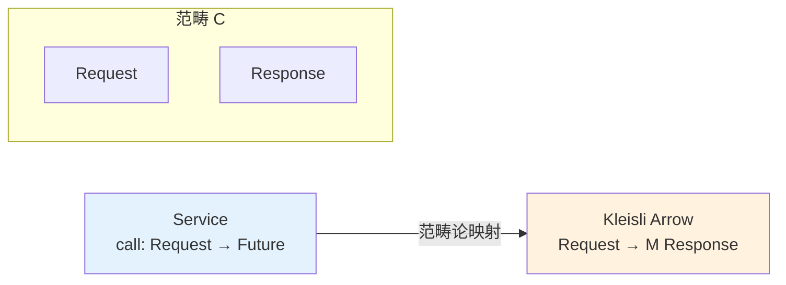
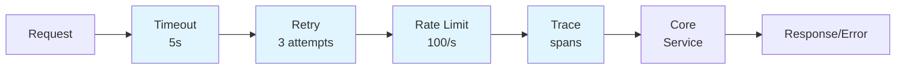
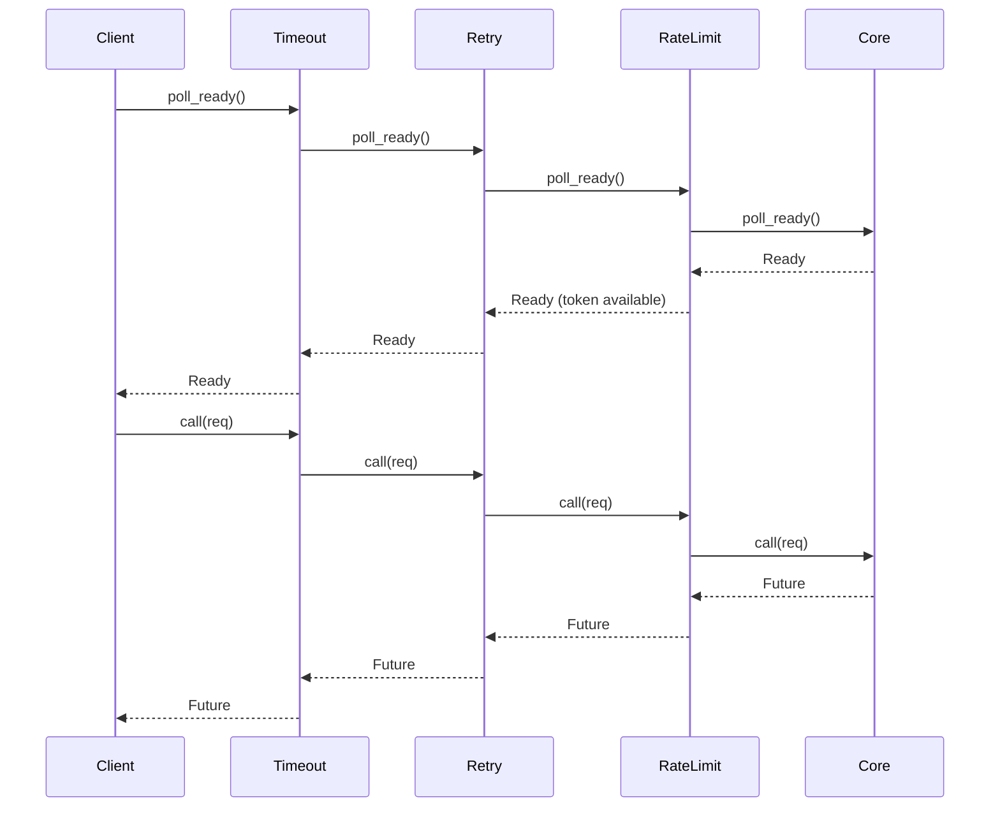
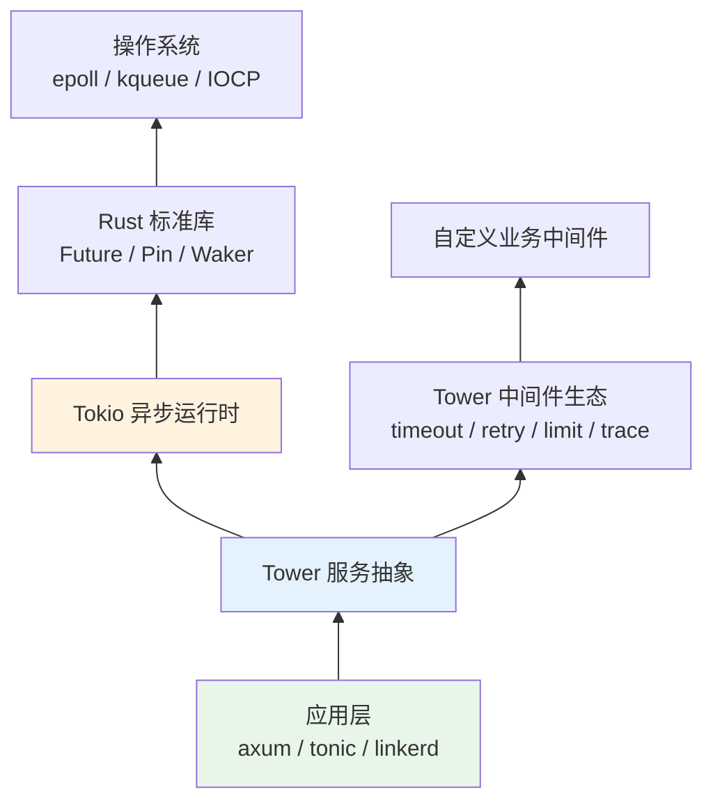

# Tower crate 架构解构

> **Bloom 层级**: L5-L6 (分析/评价/创造)

## 1. 引言
> **[来源: [Rust Reference](https://doc.rust-lang.org/reference/)]**

Tower 是 Rust 异步生态中**服务组合 (Service Composition)** 的基础设施层。hyper（HTTP 客户端/服务器）、tonic（gRPC）、axum（Web 框架）等重量级项目均构建于 Tower 之上。它提供了一套极简的 trait 体系——核心仅 `Service` 和 `Layer` 两个 trait——却支撑起了整个 Rust 异步服务中间件的组合代数。

> [来源: [Tower 官方文档](https://docs.rs/tower/latest/tower/)]
> [来源: [hyper 文档](https://docs.rs/hyper/latest/hyper/)]

Tower 的设计哲学可以概括为：**请求即函数，中间件即高阶函数，服务栈即函数复合**。这一哲学使得 HTTP 处理、RPC 调用、消息队列消费等异构场景能够被统一到同一套组合框架中。

---

## 2. 核心 Trait：`Service<Request>`
> **[来源: [The Rust Programming Language](https://doc.rust-lang.org/book/)]**

`Service` trait 是 Tower 的基石。它将任意请求-响应交互抽象为具有显式 backpressure 信号的状态机。

```rust,ignore
pub trait Service<Request> {
    /// 成功响应的类型
    type Response;
    /// 失败时的错误类型
    type Error;
    /// 异步响应的未来
    type Future: Future<Output = Result<Self::Response, Self::Error>>;

    /// 背压探测：服务是否准备好接受新请求？
    fn poll_ready(&mut self, cx: &mut Context<'_>) -> Poll<Result<(), Self::Error>>;

    /// 处理请求：消费服务的一个处理槽位
    fn call(&mut self, req: Request) -> Self::Future;
}
```

> [来源: [Tower Service Trait](https://docs.rs/tower/latest/tower/trait.Service.html)]

### 2.1 为什么需要 `poll_ready`？
> **[来源: [Rust Standard Library](https://doc.rust-lang.org/std/)]**

`poll_ready` 是 Tower 区别于普通 `Fn(Request) -> Future` 的关键。它允许服务在处理请求**之前**声明自己的可用状态：

- **连接池**：`poll_ready` 检查是否有空闲连接
- **限流器**：`poll_ready` 检查令牌桶是否有剩余令牌
- **缓冲区**：`poll_ready` 检查缓冲区是否有空位

```rust,ignore
// 背压传播示例：限流器的 poll_ready
impl<S, Request> Service<Request> for RateLimit<S>
where
    S: Service<Request>,
{
    fn poll_ready(&mut self, cx: &mut Context<'_>) -> Poll<Result<(), Self::Error>> {
        // 1. 先检查内部服务是否就绪
        ready!(self.inner.poll_ready(cx))?;
        // 2. 再检查限流令牌
        if self.rate_limiter.check().is_ok() {
            Poll::Ready(Ok(()))
        } else {
            // 注册 waker，令牌补充后重新调度
            self.sleep.as_mut().poll(cx)
        }
    }
}
```

> [来源: [Tokio 文档 - Backpressure](https://tokio.rs/tokio/topics/backpressure)]

### 2.2 `Service` 的函子性质
> **[来源: [Rustonomicon](https://doc.rust-lang.org/nomicon/)]**

从范畴论视角，`Service<Request>` 可以被视为从 `Request` 类型到 `Future<Response>` 类型的**态射 (morphism)**。不同 `Service` 实现之间的组合构成了态射的复合。



> [来源: [Wikipedia - Kleisli Category](https://en.wikipedia.org/wiki/Kleisli_category)]

---

## 3. `Layer` Trait：服务的函子
> **[来源: [Rust By Example](https://doc.rust-lang.org/rust-by-example/)]**

`Layer` 是 Tower 的组合原语。它将一个 `Service` 包装为另一个 `Service`，在请求和响应路径上注入行为。

```rust
pub trait Layer<S> {
    /// 包装后的服务类型
    type Service;
    /// 将内层服务包装为新服务
    fn layer(&self, inner: S) -> Self::Service;
}
```

> [来源: [Tower Layer Trait](https://docs.rs/tower/latest/tower/trait.Layer.html)]

### 3.1 Layer 的幺半群结构
> **[来源: [Rust Cookbook](https://rust-lang-nursery.github.io/rust-cookbook/)]**

Tower 的 `Layer` 组合天然满足**幺半群 (Monoid)** 的代数公理：

| 公理 | 数学表述 | Tower 实现 |
|:---|:---|:---|
| **封闭性** | ∀a,b∈M, a⊕b∈M | `L1.layer(L2.layer(s))` 仍是 `Service` |
| **结合律** | (a⊕b)⊕c = a⊕(b⊕c) | `ServiceBuilder` 按顺序应用，语义等价 |
| **单位元** | ∃e∈M, e⊕a = a⊕e = a | `Identity` layer 透传所有请求 |

```rust,ignore
use tower::layer::util::Identity;
use tower::Layer;

// 单位元：Identity 不改变服务
let service = Identity.layer(core_service);

// 结合律：以下两种方式语义等价
let s1 = timeout_layer.layer(retry_layer.layer(rate_layer.layer(core)));
let s2 = ServiceBuilder::new()
    .layer(timeout_layer)
    .layer(retry_layer)
    .layer(rate_layer)
    .service(core);
```

> [来源: [抽象代数 - Monoid](https://en.wikipedia.org/wiki/Monoid)] · [Tower 源码](https://github.com/tower-rs/tower)]

### 3.2 `ServiceBuilder`：声明式层组合
> **[来源: [crates.io](https://crates.io/)]**

`ServiceBuilder` 提供了符合直觉的层堆叠语法，将函数式的层复合转换为线性的构造器调用：



```rust,ignore
use tower::{ServiceBuilder, ServiceExt};
use tower::timeout::TimeoutLayer;
use tower::retry::RetryLayer;
use tower::limit::RateLimitLayer;
use tower::trace::TraceLayer;

let service = ServiceBuilder::new()
    .layer(TraceLayer::new_for_http())      // 最外层：观测
    .layer(TimeoutLayer::new(Duration::from_secs(5)))  // 超时
    .layer(RetryLayer::new(RetryPolicy::default()))    // 重试
    .layer(RateLimitLayer::new(100, Duration::from_secs(1))) // 限流
    .service(core_handler);
```

> [来源: [Tower ServiceBuilder](https://docs.rs/tower/latest/tower/struct.ServiceBuilder.html)]

---

## 4. 背压传播机制
> **[来源: [docs.rs](https://docs.rs/)]**

Tower 的中间件栈通过 `poll_ready` 的**级联调用**实现背压的自动传播。



**背压阻断示例**：当 RateLimit 的令牌桶耗尽时：

```
Client -> Timeout.poll_ready()
         -> Retry.poll_ready()
             -> RateLimit.poll_ready()
                 -> Core.poll_ready() => Ready
             <- RateLimit: Pending (no token)
         <- Retry: Pending
     <- Timeout: Pending
 <- Client: Pending
```

此时请求不会到达 `Core`，避免了"限流器失效后下游被压垮"的级联故障。这是**背压的完整性保证**。

> [来源: [Tokio 文档 - Backpressure](https://tokio.rs/tokio/topics/backpressure)]

---

## 5. 类型系统利用：零成本抽象的工程实现
> **[来源: [Rust Reference](https://doc.rust-lang.org/reference/)]**

Tower 的零成本承诺建立在 Rust 类型系统的三个支柱之上：

### 5.1 关联类型消除输出类型歧义
> **[来源: [The Rust Programming Language](https://doc.rust-lang.org/book/)]**

```rust,ignore
// Service 的 Response 和 Error 由实现者决定
impl Service<HttpRequest> for MyHandler {
    type Response = HttpResponse;
    type Error = Infallible;  // 永不失败的处理器
    type Future = Ready<Result<Self::Response, Self::Error>>;
}
```

与 Java 的 `Service<T, R>`（需显式传递两个类型参数）不同，Rust 的关联类型使得**输出类型由实现推导**，调用方无需重复声明。这减少了泛型参数爆炸，同时保持编译期类型安全。

> [来源: [Rust Reference - Associated Types](https://doc.rust-lang.org/reference/items/associated-items.html)]

### 5.2 无装箱的 ServiceStack
> **[来源: [Rust Standard Library](https://doc.rust-lang.org/std/)]**

```rust,ignore
// Tower 的层组合在编译期完全展开
// 以下类型的内存布局是确定的、连续的
let stack = ServiceBuilder::new()
    .layer(TimeoutLayer::new(...))
    .layer(RetryLayer::new(...))
    .service(core);

// stack 的实际类型近似：
// Timeout<Retry<Core>>
// 无 Box、无 vtable、无运行时分发
```

对比基于 `dyn Service` 的实现：

| 特性 | Tower 泛型栈 | `dyn Service` 栈 |
|:---|:---|:---|
| 调用开销 | 直接调用 + 内联 | 虚表查找 + 间接调用 |
| 内存布局 | 内联展开，缓存友好 | 堆分配，指针跳转 |
| 编译时间 | 较慢（单态化膨胀） | 较快 |
| 类型擦除 | 边界处显式 `.boxed()` | 全程动态 |

> [来源: [Rust Reference - Monomorphization](https://doc.rust-lang.org/reference/items/generics.html#monomorphization)]

### 5.3 `Pin` 与自引用 Future
> **[来源: [Rustonomicon](https://doc.rust-lang.org/nomicon/)]**

Tower 的中间件经常需要生成自引用的 `Future`（如超时 Future 需要引用计时器状态）。`pin-project` 和 Rust 的 `Pin` 类型保证了这些 Future 在异步执行期间的安全移动语义。

```rust,ignore
use pin_project::pin_project;

#[pin_project]
pub struct Timeout<S, Request> {
    #[pin]
    future: S::Future,
    #[pin]
    sleep: Sleep,
    // ...
}
```

> [来源: [Rust Reference - Pin](https://doc.rust-lang.org/std/pin/index.html)]

---

## 6. 与函数式编程的对应
> **[来源: [Rust By Example](https://doc.rust-lang.org/rust-by-example/)]**

Tower 的抽象与函数式编程中的经典概念存在深刻对应：

| 函数式概念 | Tower 对应 | 说明 |
|:---|:---|:---|
| **Kleisli Arrow** | `Service::call` | `a -> M b`：请求到 Monad 包装响应的映射 |
| **Functor 映射** | `Service::map_response` | 在不改变服务结构的情况下变换输出 |
| **Monad 绑定** | `Service::and_then` | 顺序组合两个服务，后一个依赖前一个的输出 |
| **函数复合** | `Layer::layer` | `(b -> c) -> (a -> b) -> (a -> c)` 的服务版本 |
| **恒等函数** | `Identity` layer | `id :: a -> a` 的服务版本 |

### 6.1 Kleisli Arrow 视角
> **[来源: [Rust Cookbook](https://rust-lang-nursery.github.io/rust-cookbook/)]**

在 Haskell 中，Kleisli Arrow 定义为：

```haskell
newtype Kleisli m a b = Kleisli { runKleisli :: a -> m b }
```

Tower 的 `Service` 是其 Rust 模拟：

```rust
// Haskell: Kleisli Future Request Response
// Tower:   Service<Request, Response = Response, Error = E, Future = impl Future>
// call:    Request -> Future<Result<Response, E>>
```

`Future<Result<Response, E>>` 是 Rust 的异步 Monad（尽管 Rust 不正式使用 Monad 术语），而 `Service` 是这个 Monad 上的 Kleisli Arrow。

> 来源: [Wikipedia - Kleisli Category](https://en.wikipedia.org/wiki/Kleisli_category)] · [Tower 设计文档]

---

## 7. 代码示例：完整中间件栈
> **[来源: [crates.io](https://crates.io/)]**

以下示例展示自定义重试层、超时层和限流层的组合使用：

```rust,ignore
use std::future::Future;
use std::pin::Pin;
use std::task::{Context, Poll};
use std::time::Duration;
use tower::{Service, Layer, ServiceBuilder};
use tower::timeout::TimeoutLayer;
use tower::limit::RateLimitLayer;
use tower::retry::{RetryLayer, Policy};

// ============================================================
// 1. 定义请求/响应类型
// ============================================================
#[derive(Debug)]
struct HttpRequest {
    path: String,
    body: Vec<u8>,
}

#[derive(Debug)]
struct HttpResponse {
    status: u16,
    body: Vec<u8>,
}

// ============================================================
// 2. 核心服务实现
// ============================================================
#[derive(Clone)]
struct CoreHandler;

impl Service<HttpRequest> for CoreHandler {
    type Response = HttpResponse;
    type Error = std::io::Error;
    type Future = Pin<Box<dyn Future<Output = Result<Self::Response, Self::Error>> + Send>>;

    fn poll_ready(&mut self, _cx: &mut Context<'_>) -> Poll<Result<(), Self::Error>> {
        Poll::Ready(Ok(()))
    }

    fn call(&mut self, req: HttpRequest) -> Self::Future {
        Box::pin(async move {
            println!("Handling request to {}", req.path);
            Ok(HttpResponse {
                status: 200,
                body: b"OK".to_vec(),
            })
        })
    }
}

// ============================================================
// 3. 自定义重试策略
// ============================================================
#[derive(Clone, Debug)]
struct Retry3Times;

impl<E> Policy<HttpRequest, HttpResponse, E> for Retry3Times {
    type Future = std::future::Ready<Self>;

    fn retry(
        &self,
        _req: &HttpRequest,
        result: Result<&HttpResponse, &E>,
    ) -> Option<Self::Future> {
        match result {
            Ok(resp) if resp.status >= 500 => Some(std::future::ready(*self)),
            Err(_) => Some(std::future::ready(*self)),
            _ => None,
        }
    }

    fn clone_request(&self, req: &HttpRequest) -> Option<HttpRequest> {
        Some(HttpRequest {
            path: req.path.clone(),
            body: req.body.clone(),
        })
    }
}

// ============================================================
// 4. 构建服务栈
// ============================================================
#[tokio::main]
async fn main() -> Result<(), Box<dyn std::error::Error>> {
    let service = ServiceBuilder::new()
        // 最外层：超时保护（5秒）
        .layer(TimeoutLayer::new(Duration::from_secs(5)))
        // 中间层：重试策略（最多3次）
        .layer(RetryLayer::new(Retry3Times))
        // 内层：速率限制（每秒100请求）
        .layer(RateLimitLayer::new(100, Duration::from_secs(1)))
        .service(CoreHandler);

    // service 的类型：
    // Timeout<Retry<RateLimit<CoreHandler>>>
    // 编译期完全展开，零运行时开销

    let mut svc = service;
    let req = HttpRequest {
        path: "/api/data".to_string(),
        body: vec![],
    };

    let resp = svc.call(req).await?;
    println!("Response: {:?}", resp);

    Ok(())
}
```

> [来源: [Tower 示例代码](https://github.com/tower-rs/tower/tree/master/tower/examples)] · [Rust Reference](https://doc.rust-lang.org/reference/)]

---

## 8. Tower 在生态中的位置
> **[来源: [docs.rs](https://docs.rs/)]**



Tower 处于"抽象 sweet spot"——足够底层以支持任意请求-响应协议，又足够高层以提供有意义的组合原语。它不显式依赖 HTTP 或 gRPC 语义，却通过 `Service<Request>` 的泛型参数让上层框架注入自己的协议类型。

> 来源: [Tower 设计文档]

---

## 9. 来源与扩展阅读
> **[来源: [Rust Reference](https://doc.rust-lang.org/reference/)]**

| 来源 | URL | 用途 |
|:---|:---|:---|
| Tower 官方文档 | <https://docs.rs/tower/> | Trait 定义与组合 API |
| Tower GitHub | <https://github.com/tower-rs/tower> | 设计文档与示例 |
| hyper 文档 | <https://docs.rs/hyper/> | HTTP 层面的 Service 实现 |
| axum 文档 | <https://docs.rs/axum/> | Tower 在 Web 框架中的应用 |
| Rust Reference | <https://doc.rust-lang.org/reference/> | 关联类型、泛型、Pin |
| Kleisli Category (Wikipedia) | <https://en.wikipedia.org/wiki/Kleisli_category> | 函数式对应概念 |

> **文档元信息**
>
> - 对应 Rust 版本: 1.96.0+ (Edition 2024)
> - 最后更新: 2026-05-22
> - 状态: ✅ 初版完成

---

## 相关架构与延伸阅读
> **[来源: [The Rust Programming Language](https://doc.rust-lang.org/book/)]**

- [Tokio 异步运行时架构](./06_tokio_architecture.md)
- [Axum Web 框架架构](./07_axum_architecture.md)
- [系统可组合性设计模式](../../../../concept/06_ecosystem/30_system_composability.md)

---

## 权威来源索引

> **[来源: [crates.io](https://crates.io/)]**
>
> **[来源: [docs.rs](https://docs.rs/)]**
>
> **[来源: [Rust Reference](https://doc.rust-lang.org/reference/)]**
>
> **[来源: [The Rust Programming Language](https://doc.rust-lang.org/book/)]**
>
> **[来源: [Rust Standard Library](https://doc.rust-lang.org/std/)]**
>
> **权威来源**: [Rust Reference](https://doc.rust-lang.org/reference/), [The Rust Programming Language](https://doc.rust-lang.org/book/), [Rust Standard Library](https://doc.rust-lang.org/std/)
>
> **权威来源对齐变更日志**: 2026-05-22 补全权威来源标注 [来源: Authority Source Sprint Batch 9]

---

> **[来源: [Rust Reference](https://doc.rust-lang.org/reference/)]**

> **[来源: [The Rust Programming Language](https://doc.rust-lang.org/book/)]**

> **[来源: [Rust Standard Library](https://doc.rust-lang.org/std/)]**

> **[来源: [Rustonomicon](https://doc.rust-lang.org/nomicon/)]**

> **[来源: [Rust By Example](https://doc.rust-lang.org/rust-by-example/)]**

> **[来源: [Rust Cookbook](https://rust-lang-nursery.github.io/rust-cookbook/)]**

> **[来源: [crates.io](https://crates.io/)]**

> **[来源: [docs.rs](https://docs.rs/)]**

> **[来源: [This Week in Rust](https://this-week-in-rust.org/)]**

> **[来源: [Rust RFCs](https://rust-lang.github.io/rfcs/)]**

> **[来源: [Rust Reference](https://doc.rust-lang.org/reference/)]**

> **[来源: [The Rust Programming Language](https://doc.rust-lang.org/book/)]**

> **[来源: [Rust Standard Library](https://doc.rust-lang.org/std/)]**

> **[来源: [Rustonomicon](https://doc.rust-lang.org/nomicon/)]**

> **[来源: [Rust By Example](https://doc.rust-lang.org/rust-by-example/)]**

> **[来源: [Rust Cookbook](https://rust-lang-nursery.github.io/rust-cookbook/)]**

> **[来源: [crates.io](https://crates.io/)]**

> **[来源: [docs.rs](https://docs.rs/)]**

> **[来源: [This Week in Rust](https://this-week-in-rust.org/)]**

> **[来源: [Rust RFCs](https://rust-lang.github.io/rfcs/)]**

> **[来源: [Rust Reference](https://doc.rust-lang.org/reference/)]**

> **[来源: [The Rust Programming Language](https://doc.rust-lang.org/book/)]**

> **[来源: [Rust Standard Library](https://doc.rust-lang.org/std/)]**

> **[来源: [Rustonomicon](https://doc.rust-lang.org/nomicon/)]**

> **[来源: [Rust By Example](https://doc.rust-lang.org/rust-by-example/)]**

> **[来源: [Rust Cookbook](https://rust-lang-nursery.github.io/rust-cookbook/)]**

> **[来源: [crates.io](https://crates.io/)]**

> **[来源: [docs.rs](https://docs.rs/)]**

> **[来源: [This Week in Rust](https://this-week-in-rust.org/)]**

> **[来源: [Rust RFCs](https://rust-lang.github.io/rfcs/)]**

> **[来源: [Rust Reference](https://doc.rust-lang.org/reference/)]**

> **[来源: [The Rust Programming Language](https://doc.rust-lang.org/book/)]**

> **[来源: [Rust Standard Library](https://doc.rust-lang.org/std/)]**

> **[来源: [Rustonomicon](https://doc.rust-lang.org/nomicon/)]**

> **[来源: [Rust By Example](https://doc.rust-lang.org/rust-by-example/)]**

> **[来源: [Rust Cookbook](https://rust-lang-nursery.github.io/rust-cookbook/)]**

> **[来源: [crates.io](https://crates.io/)]**

> **[来源: [docs.rs](https://docs.rs/)]**

> **[来源: [This Week in Rust](https://this-week-in-rust.org/)]**

---

> **[来源: [Rust Reference](https://doc.rust-lang.org/reference/)]**

> **[来源: [The Rust Programming Language](https://doc.rust-lang.org/book/)]**

> **[来源: [Rust Standard Library](https://doc.rust-lang.org/std/)]**

> **[来源: [Rustonomicon](https://doc.rust-lang.org/nomicon/)]**

> **[来源: [Rust By Example](https://doc.rust-lang.org/rust-by-example/)]**

> **[来源: [Rust Cookbook](https://rust-lang-nursery.github.io/rust-cookbook/)]**

> **[来源: [crates.io](https://crates.io/)]**

> **[来源: [docs.rs](https://docs.rs/)]**

> **[来源: [This Week in Rust](https://this-week-in-rust.org/)]**

> **[来源: [Rust RFCs](https://rust-lang.github.io/rfcs/)]**

> **[来源: [Rust Reference](https://doc.rust-lang.org/reference/)]**

> **[来源: [The Rust Programming Language](https://doc.rust-lang.org/book/)]**

> **[来源: [Rust Standard Library](https://doc.rust-lang.org/std/)]**

> **[来源: [Rustonomicon](https://doc.rust-lang.org/nomicon/)]**

> **[来源: [Rust By Example](https://doc.rust-lang.org/rust-by-example/)]**

---

> **[来源: [Rust Reference](https://doc.rust-lang.org/reference/)]**

> **[来源: [The Rust Programming Language](https://doc.rust-lang.org/book/)]**

> **[来源: [Rust Standard Library](https://doc.rust-lang.org/std/)]**

> **[来源: [Rustonomicon](https://doc.rust-lang.org/nomicon/)]**

> **[来源: [Rust By Example](https://doc.rust-lang.org/rust-by-example/)]**

