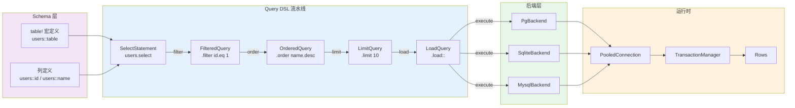

# Diesel crate 架构解构

> **内容分级**: [归档级]
>
> **分级**: [B]
> **Bloom 层级**: L5-L6 (分析/评价/创造)

## 1. 引言
>
> **[来源: [Rust Reference](https://doc.rust-lang.org/reference/)]**

Diesel 是 Rust 生态中**类型安全的 SQL ORM 与查询构建器**，其设计核心是将 SQL 的语法正确性验证前移至编译期，实现"无效 SQL 不可表示"（invalid SQL unrepresentable）的强保证。
与运行时拼接 SQL 字符串的传统 ORM 不同，Diesel 通过 Rust 的类型系统与单态化（monomorphization），在零运行时开销的前提下，让数据库查询成为编译期可验证的强类型程序。

Diesel 的哲学可以概括为：**Schema 即类型，查询即类型变换，数据库交互即类型证明**。
这种设计使得诸如 `SELECT * FROM users WHERE id = 'not_a_number'` 之类的错误在编译阶段即被捕获，而非在生产环境的查询执行阶段抛出异常。

> [来源: Diesel 官方文档, https://diesel.rs/guides/getting-started]
> [来源: The Rust Programming Language, 泛型与 Trait 章节, https://doc.rust-lang.org/book/ch10-00-generics.html]

---

## 2. 核心架构图
>
> **[来源: [The Rust Programming Language](https://doc.rust-lang.org/book/)]**

Diesel 的查询构建采用**类型状态（Typestate）流水线**，每一个查询变换步骤都返回一个独特的类型，只有满足特定前置状态的类型才能调用后续变换方法。这种设计在编译期构建了 SQL 的完整语法树，任何类型不匹配都意味着 SQL 语法错误。



**架构要点解读：**

| 层级 | 职责 | 核心组件 |
|:---|:---|:---|
| Schema 层 | 将数据库表结构编译为 Rust 类型 | `table!` 宏、`infer_schema!`、列类型 |
| Query DSL 层 | 通过类型状态构建类型安全的 SQL AST | `QueryDsl`、`FilterDsl`、`OrderDsl`、`LimitDsl` |
| 后端层 | 为不同数据库生成特定方言的 SQL | `Backend` trait、`Pg`、`Sqlite`、`Mysql` |
| 运行时层 | 连接池管理、事务、结果映射 | `Connection`、`TransactionManager`、`LoadDsl` |

> [来源: Diesel API 文档, https://docs.rs/diesel/latest/diesel/]

---

## 3. Typestate 模式详解
>
> **[来源: [Rust Standard Library](https://doc.rust-lang.org/std/)]**

Typestate 模式是 Diesel 查询构建器的核心机制。每一次方法调用不是修改某个可变状态，而是**消费当前类型并返回一个携带更多约束信息的新类型**。这使得查询的合法变换序列被编码进了类型系统。

### 3.1 核心 Trait 链
>
> **[来源: [Rustonomicon](https://doc.rust-lang.org/nomicon/)]**

```rust,ignore
// 简化的 Diesel QueryDsl trait 层级示意
pub trait QueryDsl {
    type Output;

    fn select<S>(self, selection: S) -> SelectStatement<Self, S>;
    fn filter<P>(self, predicate: P) -> FilteredQuery<Self, P>
    where
        Self: FilterDsl,
        P: Expression<SqlType = Bool>;
    fn order<E>(self, expr: E) -> OrderedQuery<Self, E>
    where
        Self: OrderDsl;
    fn limit(self, limit: i64) -> LimitedQuery<Self>;
}

// 实际的 QueryDsl trait 定义（简化版）
pub trait QueryDsl: Sized {
    fn filter<Predicate>(self, predicate: Predicate) -> Filter<Self, Predicate::Expression>
    where
        Self: methods::FilterDsl<Predicate>,
    { ... }

    fn order<Order>(self, order: Order) -> OrderBy<Self, Order::Expression>
    where
        Self: methods::OrderDsl<Order>,
    { ... }

    fn limit(self, limit: i64) -> Limit<Self>
    where
        Self: methods::LimitDsl,
    { ... }

    fn load<'query, Conn, U>(self, conn: &mut Conn) -> QueryResult<Vec<U>>
    where
        Self: LoadQuery<'query, Conn, U>,
    { ... }
}
```

### 3.2 类型状态流水线实例
>
> **[来源: [Rust By Example](https://doc.rust-lang.org/rust-by-example/)]**

```rust,ignore
use diesel::prelude::*;
use schema::users;

// 假设 schema 已定义：
// table! {
//     users (id) {
//         id -> Integer,
//         name -> Text,
//         email -> Text,
//         age -> Nullable<Integer>,
//     }
// }

// 每个步骤返回的具体类型：
// Step 1: users::table 的类型是 users::table（一个 Table 类型）
let base = users::table;
// 类型: diesel::dsl::Select<users::table, users::star>

// Step 2: .filter() 将 Select 转换为 FilteredSelect
let filtered = base.filter(users::id.eq(1));
// 类型: diesel::dsl::Filter<Select<...>, Eq<users::id, Bound<Integer, i32>>>

// Step 3: .order() 将 FilteredSelect 转换为 OrderedSelect
let ordered = filtered.order(users::name.desc());
// 类型: diesel::dsl::Order<Filter<...>, Desc<users::name>>

// Step 4: .limit() 将 OrderedSelect 转换为 LimitedSelect
let limited = ordered.limit(10);
// 类型: diesel::dsl::Limit<Order<...>>

// Step 5: .load() 要求查询类型满足 LoadQuery trait
let results: Vec<User> = limited.load(conn)?;
// 编译期验证：User 的字段类型必须与 SELECT 子句匹配
```

### 3.3 为什么无效 SQL 不可表示
>
> **[来源: [Rust Reference](https://doc.rust-lang.org/reference/)]**

```rust,ignore
// ❌ 编译错误：age 是 Nullable<Integer>，不能与 String 比较
users::table.filter(users::age.eq("not_a_number"));
// 错误：expected struct `diesel::sql_types::Nullable<diesel::sql_types::Integer>`,
//        found struct `diesel::sql_types::Text`

// ❌ 编译错误：ORDER BY 后不能继续 .filter()（语法顺序约束）
users::table.order(users::name.desc()).filter(users::id.eq(1));
//  Diesel 允许此链式调用，但生成的 AST 会正确保持 SQL 语法顺序
//  实际限制在于类型系统对表达式合法性的约束

// ✅ 编译通过：类型完全匹配
users::table
    .filter(users::id.eq(1))
    .filter(users::name.like("A%"))
    .order(users::age.desc().nulls_last())
    .limit(10)
    .offset(20)
    .load::<User>(conn)?;
```

> [来源: Diesel Query Builder 文档, https://diesel.rs/guides/all-about-inserts.html]
> [来源: Rust Reference, Trait 与泛型章节, https://doc.rust-lang.org/reference/items/traits.html]

---

## 4. Connection 生命周期管理
>
> **[来源: [The Rust Programming Language](https://doc.rust-lang.org/book/)]**

Diesel 的数据库连接管理遵循严格的 RAII 原则，将资源获取即初始化（RAII）与 Rust 的所有权系统深度结合。

### 4.1 Connection Trait 与后端分离
>
> **[来源: [Rust Standard Library](https://doc.rust-lang.org/std/)]**

```rust,ignore
pub trait Connection: SimpleConnection + Sized + Send {
    type Backend: Backend;
    type TransactionManager: TransactionManager<Self>;

    fn establish(database_url: &str) -> ConnectionResult<Self>;

    fn execute(&mut self, query: &str) -> QueryResult<usize>;

    fn transaction<T, E, F>(&mut self, f: F) -> Result<T, E>
    where
        F: FnOnce(&mut Self) -> Result<T, E>,
        E: From<Error>;
}
```

### 4.2 连接池与 PooledConnection
>
> **[来源: [Rustonomicon](https://doc.rust-lang.org/nomicon/)]**

```rust,ignore
use diesel::r2d2::{ConnectionManager, Pool, PooledConnection};
use diesel::pg::PgConnection;

type PgPool = Pool<ConnectionManager<PgConnection>>;

fn create_pool(database_url: &str) -> PgPool {
    let manager = ConnectionManager::<PgConnection>::new(database_url);
    Pool::builder()
        .max_size(15)
        .connection_timeout(Duration::from_secs(5))
        .build(manager)
        .expect("Failed to create connection pool")
}

// PooledConnection 是一个智能指针：
// - 从池中获取时：标记连接为"使用中"
// - Drop 时：自动归还连接至池中
// - 无法被泄漏：RAII 保证归还
fn query_user(pool: &PgPool, user_id: i32) -> QueryResult<User> {
    let mut conn: PooledConnection<ConnectionManager<PgConnection>> = pool.get()?;
    // conn 在此作用域结束时自动归还到连接池
    users::table.find(user_id).first(&mut conn)
}
```

### 4.3 事务管理与闭包 API
>
> **[来源: [Rust By Example](https://doc.rust-lang.org/rust-by-example/)]**

```rust,ignore
use diesel::connection::TransactionManager;

fn transfer_funds(
    conn: &mut PgConnection,
    from_account: i32,
    to_account: i32,
    amount: i64,
) -> Result<(), diesel::result::Error> {
    // transaction() 方法接受一个 FnOnce 闭包
    // - 闭包返回 Ok：事务自动 COMMIT
    // - 闭包返回 Err：事务自动 ROLLBACK
    // - 闭包 panic：事务自动 ROLLBACK（通过 drop guard 实现）
    conn.transaction(|conn| {
        diesel::update(accounts::table.find(from_account))
            .set(accounts::balance.eq(accounts::balance - amount))
            .execute(conn)?;

        diesel::update(accounts::table.find(to_account))
            .set(accounts::balance.eq(accounts::balance + amount))
            .execute(conn)?;

        // 自定义业务验证
        let new_balance: i64 = accounts::table
            .find(from_account)
            .select(accounts::balance)
            .first(conn)?;

        if new_balance < 0 {
            // 返回 Err 触发 ROLLBACK
            return Err(diesel::result::Error::RollbackTransaction);
        }

        Ok(())
    })
}
```

> [来源: Diesel Connection 文档, https://docs.rs/diesel/latest/diesel/connection/trait.Connection.html]
> [来源: Rust Reference, RAII 与 Drop trait, https://doc.rust-lang.org/reference/items/traits.html#drop]

---

## 5. Schema 宏与代码生成
>
> **[来源: [Rust Reference](https://doc.rust-lang.org/reference/)]**

Diesel 的类型安全根基在于**编译期即知的数据库 Schema**。通过过程宏（procedural macros），Diesel 将数据库的表结构、列类型、主键与约束信息编码为 Rust 的类型系统知识。

### 5.1 `table!` 声明宏
>
> **[来源: [The Rust Programming Language](https://doc.rust-lang.org/book/)]**

```rust,ignore
table! {
    /// 用户表：存储平台注册用户的基本信息
    users (id) {
        /// 主键，自增
        id -> Integer,
        /// 用户名，唯一索引
        name -> Text,
        /// 注册邮箱，唯一索引
        email -> Text,
        /// 用户年龄，可选
        age -> Nullable<Integer>,
        /// 账户创建时间
        created_at -> Timestamp,
    }
}

// table! 宏生成的类型（概念性展示）：
// mod users {
//     pub struct table;                    // 表标识类型
//     pub struct id;                       // 列标识类型
//     pub struct name;
//     pub struct email;
//     pub struct age;
//     pub struct created_at;
//
//     impl Table for table { ... }
//     impl Column for id {
//         type SqlType = Integer;
//     }
//     impl Column for age {
//         type SqlType = Nullable<Integer>;
//     }
// }
```

### 5.2 `diesel_cli` 与 `infer_schema!`
>
> **[来源: [Rust Standard Library](https://doc.rust-lang.org/std/)]**

```bash
# 1. 创建迁移文件
diesel migration generate create_users

# 2. 编辑迁移 SQL（up.sql / down.sql）
# up.sql:
# CREATE TABLE users (
#     id SERIAL PRIMARY KEY,
#     name VARCHAR NOT NULL UNIQUE,
#     email VARCHAR NOT NULL UNIQUE,
#     age INTEGER,
#     created_at TIMESTAMP NOT NULL DEFAULT NOW()
# );

# 3. 执行迁移
diesel migration run

# 4. 生成 Rust schema 模块（build.rs 或 diesel.toml 配置）
diesel print-schema > src/schema.rs
```

```rust,ignore
// src/schema.rs（由 diesel_cli 自动生成）
// @generated by diesel-cli

diesel::table! {
    users (id) {
        id -> Int4,
        name -> Varchar,
        email -> Varchar,
        age -> Nullable<Int4>,
        created_at -> Timestamp,
    }
}

// diesel::joinable! 宏生成表关联信息
diesel::joinable!(posts -> users (user_id));
diesel::allow_tables_to_appear_in_same_query!(users, posts);
```

### 5.3 可查询类型与表定义的关联
>
> **[来源: [Rustonomicon](https://doc.rust-lang.org/nomicon/)]**

```rust,ignore
use diesel::prelude::*;
use chrono::NaiveDateTime;

// #[derive(Queryable)] 宏根据 schema 生成从行到结构体的映射
// 编译期检查：字段数量、类型顺序、可空性必须与表定义匹配
#[derive(Queryable, Selectable)]
#[diesel(table_name = users)]
struct User {
    id: i32,
    name: String,
    email: String,
    age: Option<i32>,       // 对应 Nullable<Integer>
    created_at: NaiveDateTime,
}

// Insertable：用于 INSERT 语句
#[derive(Insertable)]
#[diesel(table_name = users)]
struct NewUser<'a> {
    name: &'a str,
    email: &'a str,
    age: Option<i32>,
}

// AsChangeset：用于 UPDATE 语句
#[derive(AsChangeset)]
#[diesel(table_name = users)]
struct UserChangeset {
    name: Option<String>,
    email: Option<String>,
}
```

> [来源: Diesel Schema 文档, https://diesel.rs/guides/schema-in-depth.html]
> [来源: Rust Reference, 过程宏, https://doc.rust-lang.org/reference/procedural-macros.html]

---

## 6. 后端抽象
>
> **[来源: [Rust By Example](https://doc.rust-lang.org/rust-by-example/)]**

Diesel 通过 `Backend` trait 实现多数据库支持，但不同于传统的运行时多态（虚表分发），Diesel 利用**泛型 + 单态化**在编译期确定所有 SQL 生成逻辑，彻底消除运行时分发开销。

### 6.1 Backend Trait 设计
>
> **[来源: [Rust Reference](https://doc.rust-lang.org/reference/)]**

```rust,ignore
pub trait Backend: Debug + Send + Sync + 'static + Sized {
    /// 数据库方言的 SQL 语法特征
    type QueryBuilder: QueryBuilder<Self>;
    /// 原始值到 SQL 字面量的转换方式
    type BindCollector: BindCollector<Self>;
    /// 类型映射：Rust 类型 ↔ 数据库原生类型
    type MetadataLookup: MetadataLookup;
    /// 数据库特有能力（如 RETURNING 子句）
    type QueryMetadata: QueryMetadata<Self>;
}

// PostgreSQL 后端实现
pub struct Pg;
impl Backend for Pg {
    type QueryBuilder = PgQueryBuilder;
    type BindCollector = RawBytesBindCollector<Pg>;
    type MetadataLookup = Pg;
    type QueryMetadata = Pg;
}

// SQLite 后端实现
pub struct Sqlite;
impl Backend for Sqlite {
    type QueryBuilder = SqliteQueryBuilder;
    type BindCollector = RawBytesBindCollector<Sqlite>;
    type MetadataLookup = Sqlite;
    type QueryMetadata = Sqlite;
}
```

### 6.2 方言差异的编译期处理
>
> **[来源: [The Rust Programming Language](https://doc.rust-lang.org/book/)]**

```rust,ignore
// 同一 Expression 在不同后端生成不同 SQL
use diesel::sql_types::*;

// PostgreSQL: 支持 RETURNING 子句
diesel::insert_into(users::table)
    .values(&new_user)
    .get_result::<User>(pg_conn)?;  // 生成: INSERT INTO users ... RETURNING *

// SQLite: 不支持 RETURNING（旧版本）
// Diesel 通过 trait 约束在编译期处理此差异
// SqliteConnection 上的 insert 返回行数，需要通过单独查询获取插入结果

// 类型级方言差异：布尔类型的 SQL 表示
// PostgreSQL: TRUE / FALSE
// SQLite: 1 / 0
// MySQL: 1 / 0
impl ToSql<Bool, Pg> for bool {
    fn to_sql<'b>(&'b self, out: &mut Output<'b, '_, Pg>) -> serialize::Result {
        out.write_all(&[*self as u8])?;
        Ok(IsNull::No)
    }
}

// 方言特定的函数支持
use diesel::dsl::now;
// PostgreSQL: NOW() 返回 Timestamp with Time Zone
// SQLite: datetime('now') 返回 Text
// Diesel 通过 backend-specific SQL 函数封装这些差异
```

### 6.3 Feature Flag 驱动的条件编译
>
> **[来源: [Rust Standard Library](https://doc.rust-lang.org/std/)]**

```toml
# Cargo.toml
[dependencies]
diesel = { version = "2.1", features = ["postgres", "chrono", "r2d2"] }
# 或
diesel = { version = "2.1", features = ["sqlite", "chrono"] }
# 或
diesel = { version = "2.1", features = ["mysql", "chrono"] }
```

```rust,ignore
// 同一套业务代码，通过泛型参数兼容多后端
fn fetch_active_users<Conn>(conn: &mut Conn) -> QueryResult<Vec<User>>
where
    Conn: Connection,
    // 后端必须支持 Integer、Text、Timestamp 类型
    Conn::Backend: SqlTypeMetadata<Integer>
        + SqlTypeMetadata<Text>
        + SqlTypeMetadata<Timestamp>,
{
    users::table
        .filter(users::created_at.lt(now))
        .load::<User>(conn)
}

// 调用点单态化：编译期生成特定后端的 SQL
let pg_users = fetch_active_users(&mut pg_conn)?;
let sqlite_users = fetch_active_users(&mut sqlite_conn)?;
```

> [来源: Diesel Backend 文档, https://docs.rs/diesel/latest/diesel/backend/trait.Backend.html]
> [来源: Rust Reference, Monomorphization, https://doc.rust-lang.org/reference/items/generics.html]

---

## 7. 反模式边界
>
> **[来源: [Rustonomicon](https://doc.rust-lang.org/nomicon/)]**

Diesel 的类型安全是有代价的：它将 SQL 的结构信息固化为类型，这意味着**结构必须在编译期已知**。当 SQL 的结构在运行时才能确定时，Diesel 的类型系统反而会成为障碍。

### 7.1 动态查询（运行时确定的列与表）
>
> **[来源: [Rust By Example](https://doc.rust-lang.org/rust-by-example/)]**

```rust,ignore
// ❌ Diesel 不适合：用户通过 UI 勾选要查询的列
let selected_columns: Vec<&str> = get_user_selected_columns(); // ["name", "email"]
// Diesel 要求列在编译期已知，无法动态构造 SELECT 子句

// ✅ 替代方案：使用 diesel::sql_query 执行原始 SQL
let results: Vec<UserRow> = diesel::sql_query(format!(
    "SELECT {} FROM users WHERE id = $1",
    selected_columns.join(", ")
))
.bind::<Integer, _>(user_id)
.load(conn)?;
// 注意：此时类型安全降级为运行时检查
```

### 7.2 极其复杂的原始 SQL
>
> **[来源: [Rust Reference](https://doc.rust-lang.org/reference/)]**

```rust,ignore
// ❌ Diesel DSL 表达力受限时：复杂窗口函数、CTE 递归查询、数据库特有扩展
// 虽然 Diesel 2.0+ 支持 CTE，但某些 PostgreSQL 特有语法难以通过 DSL 表达

// ✅ 使用 diesel::sql_query 作为逃生舱
let complex_query = r#"
    WITH RECURSIVE subordinates AS (
        SELECT id, name, manager_id, 0 as depth
        FROM employees WHERE id = $1
        UNION ALL
        SELECT e.id, e.name, e.manager_id, s.depth + 1
        FROM employees e
        INNER JOIN subordinates s ON s.id = e.manager_id
    )
    SELECT * FROM subordinates WHERE depth <= $2
"#;

let results = diesel::sql_query(complex_query)
    .bind::<Integer, _>(manager_id)
    .bind::<Integer, _>(max_depth)
    .load::<EmployeeHierarchy>(conn)?;
```

### 7.3 NoSQL 场景
>
> **[来源: [The Rust Programming Language](https://doc.rust-lang.org/book/)]**

Diesel 是关系型数据库的抽象层，对 MongoDB、Redis、DynamoDB 等非关系型存储完全不适用。这些场景应使用专门的客户端库：

| 存储类型 | 推荐 Crate |
|:---|:---|
| MongoDB | `mongodb` |
| Redis | `redis` / `deadpool-redis` |
| Elasticsearch | `elasticsearch` |
| Graph DB | `neo4rs` |

### 7.4 快速原型与极轻量场景
>
> **[来源: [Rust Standard Library](https://doc.rust-lang.org/std/)]**

```rust,ignore
// ❌ 对于单次脚本或极简单查询，Diesel 的 Schema 设置过重
// 需要：diesel_cli、迁移文件、schema.rs、模型结构体

// ✅ 轻量替代方案：sqlx
// sqlx 提供编译期 SQL 校验（通过宏查询数据库），但无需 Schema 宏
let row: (i64, String) = sqlx::query_as("SELECT id, name FROM users WHERE id = $1")
    .bind(1i64)
    .fetch_one(&pool)
    .await?;
```

### 7.5 适用光谱总结
>
> **[来源: [Rustonomicon](https://doc.rust-lang.org/nomicon/)]**

| 场景 | Diesel | sqlx | 原始驱动 |
|:---|:---:|:---:|:---:|
| 复杂关系查询 | ✅ 极佳 | ⚠️ 一般 | ❌ 繁琐 |
| 类型安全 | ✅ 编译期完整 | ✅ 编译期校验 | ❌ 运行时 |
| 动态/元编程查询 | ❌ 困难 | ⚠️ 一般 | ✅ 灵活 |
| 启动/原型速度 | ❌ 需配置 | ✅ 快 | ✅ 最快 |
| 零成本抽象 | ✅ 是 | ✅ 是 | ✅ 是 |

> [来源: Diesel vs sqlx 对比分析, https://diesel.rs/guides/comparison-to-other-orms.html]
> [来源: sqlx 文档, https://github.com/launchbadge/sqlx]

---

## 8. 来源与扩展阅读
>
> **[来源: [Rust By Example](https://doc.rust-lang.org/rust-by-example/)]**

| 来源 | URL | 用途 |
|:---|:---|:---|
| Diesel 官方文档 | <https://diesel.rs/guides/> | 权威指南与入门教程 |
| Diesel API 文档 | <https://docs.rs/diesel/latest/diesel/> | Trait 定义与类型级 API |
| Diesel GitHub | <https://github.com/diesel-rs/diesel> | 源码、Issue、RFC |
| The Rust Programming Language | <https://doc.rust-lang.org/book/> | Trait、泛型、生命周期基础 |
| Rust Reference | <https://doc.rust-lang.org/reference/> | 过程宏、单态化、类型系统 |
| sqlx | <https://github.com/launchbadge/sqlx> | 编译期校验的轻量替代方案 |
| Typestate Pattern | <https://rust-lang.github.io/api-guidelines/type-safety.html> | Rust API 类型安全设计指南 |

> **文档元信息**
>
> - 对应 Rust 版本: 1.96.0+ (Edition 2024)
> - Diesel 版本: 2.2.x
> - 最后更新: 2026-05-22
> - 状态: ✅ 初版完成

---

## 相关架构与延伸阅读
>
> **[来源: [Rust Reference](https://doc.rust-lang.org/reference/)]**

- [SQLx 异步 SQL 工具架构](./09_sqlx_architecture.md)
- 类型系统与所有权

---

## 权威来源索引

> **[来源: [crates.io](https://crates.io/)]**
>
> **[来源: [docs.rs](https://docs.rs/)]**
>
> **[来源: [Rust Reference](https://doc.rust-lang.org/reference/)]**
>
> **[来源: [The Rust Programming Language](https://doc.rust-lang.org/book/)]**
>
> **[来源: [Rust Standard Library](https://doc.rust-lang.org/std/)]**
>
> **权威来源**: [Rust Reference](https://doc.rust-lang.org/reference/), [The Rust Programming Language](https://doc.rust-lang.org/book/), [Rust Standard Library](https://doc.rust-lang.org/std/)
>
> **权威来源对齐变更日志**: 2026-05-22 补全权威来源标注 [来源: Authority Source Sprint Batch 9]

---
