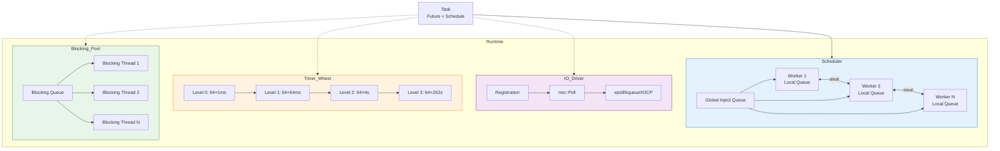
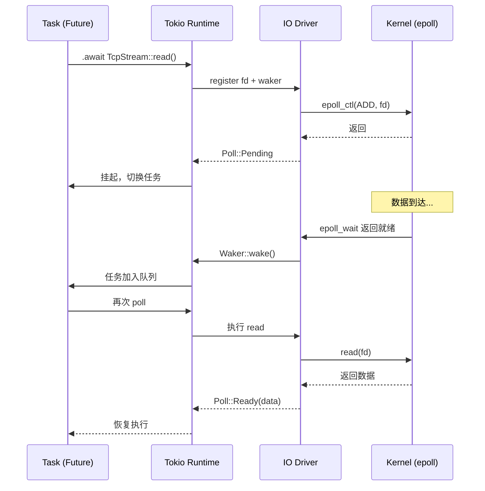
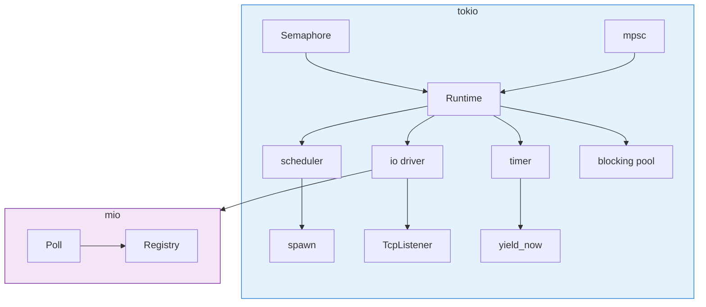

# Tokio Crate 架构解构
>
> **最后更新**: 2026-06-09

> **内容分级**: [归档级]
>
> **分级**: [B]
> **Bloom 层级**: L5-L6 (分析/评估)
> **知识领域**: 异步运行时、并发调度、IO 多路复用
> **对应 Rust 版本**: 1.85+ (Tokio 1.40+)

---

## 1. 引言：Rust 异步生态的基石
>
> **[来源: [Rust Reference](https://doc.rust-lang.org/reference/)]**

Tokio 是 Rust 异步编程的事实标准运行时，为 `hyper`（HTTP）、`tonic`（gRPC）、`axum`（Web 框架）等核心基础设施提供动力。与 Go 的内置调度器不同，Tokio 完全以**库 (library)** 形式存在，展示了 Rust 零成本抽象在异步 IO 领域的工程巅峰。

Tokio 的四大核心子系统：

| 子系统 | 职责 | 关键技术 |
|--------|------|----------|
| **Scheduler** | 任务调度与执行 | Work-stealing 队列 |
| **IO Driver** | 异步 IO 事件通知 | mio + epoll/kqueue/IOCP |
| **Timer Wheel** | 超时与定时器管理 | 分层时间轮 |
| **Blocking Pool** | 同步阻塞任务托管 | 独立线程池 |

> [来源: Tokio Docs — Runtime Internals](https://tokio.rs/tokio/topics)
> [来源: Rust Reference — async/await](https://doc.rust-lang.org/reference/expressions/await-expr.html)

```rust,ignore
use tokio::time::{sleep, Duration};
use tokio::net::TcpListener;

#[tokio::main]
async fn main() -> tokio::io::Result<()> {
    let listener = TcpListener::bind("127.0.0.1:8080").await?;
    loop {
        let (socket, _) = listener.accept().await?;
        tokio::spawn(async move {
            handle_connection(socket).await;
        });
    }
}
```

> [来源: TRPL — Async/Await Chapter](https://doc.rust-lang.org/book/ch17-00-async-await.html)

---

## 2. Runtime 架构图
>
> **[来源: [The Rust Programming Language](https://doc.rust-lang.org/book/)]**

### 2.1 整体架构
>
> **[来源: [Rust Standard Library](https://doc.rust-lang.org/std/)]**

Tokio 的 `Runtime` 将四大子系统整合为统一的异步执行上下文：



> [来源: Tokio Internals Blog — "How Tokio's Scheduler Works"](https://tokio.rs/blog/2019-10-scheduler)

### 2.2 Runtime 构建模式
>
> **[来源: [Rustonomicon](https://doc.rust-lang.org/nomicon/)]**

Tokio 提供预配置运行时与自定义构建器：

```rust,ignore
use tokio::runtime;

// 多线程运行时（默认）
#[tokio::main]
async fn main() {}

// 单线程运行时
#[tokio::main(flavor = "current_thread")]
async fn main() {}

// 自定义构建
let rt = runtime::Builder::new_multi_thread()
    .worker_threads(4)
    .max_blocking_threads(512)
    .enable_io()
    .enable_time()
    .build()
    .unwrap();

rt.block_on(async { /* 业务逻辑 */ });
```

> [来源: Tokio API Docs — runtime::Builder](https://docs.rs/tokio/latest/tokio/runtime/struct.Builder.html)

---

## 3. Task 调度：Work-Stealing 队列
>
> **[来源: [Rust By Example](https://doc.rust-lang.org/rust-by-example/)]**

### 3.1 调度模型
>
> **[来源: [Rust Cookbook](https://rust-lang-nursery.github.io/rust-cookbook/)]**

Tokio 采用 **work-stealing scheduler**，核心思想源自 Cilk 语言：

```rust,ignore
// 概念简化
struct Worker {
    local_queue: LocalQueue<Task>,  // 双端队列
    stealers: Vec<Stealer<Task>>,   // 其他 worker 的窃取端
}

impl Worker {
    fn run(&mut self) {
        loop {
            // 1. 本地队列
            if let Some(task) = self.local_queue.pop() {
                task.run(); continue;
            }
            // 2. 全局队列
            if let Some(task) = self.global_queue.pop() {
                task.run(); continue;
            }
            // 3. 窃取其他 worker
            for stealer in &self.stealers {
                if let Some(t) = stealer.steal_batch_and_pop(&self.local_queue) {
                    t.run(); break;
                }
            }
            // 4. 无任务则 park
            self.park();
        }
    }
}
```

> [来源: Paper — "Scheduling Multithreaded Computations by Work Stealing" (Blumofe & Leiserson, 1999)](https://supertech.csail.mit.edu/papers/steal.pdf)

### 3.2 任务生成与队列溢出
>
> **[来源: [crates.io](https://crates.io/)]**

```rust,ignore
use tokio::task;

async fn spawn_example() {
    let handle = task::spawn(async {
        println!("运行在新任务中");
        42
    });
    let result = handle.await.unwrap();
    assert_eq!(result, 42);
}
```

队列策略：

- **本地队列**: 每个 worker 拥有 LIFO 双端队列（默认容量 256）
- **溢出处理**: 本地队列满时，一半任务刷入全局注入队列
- **窃取策略**: 空闲 worker 从随机目标批量窃取，降低竞争

> [来源: Tokio Source — runtime/scheduler/multi_thread/queue.rs](https://github.com/tokio-rs/tokio/blob/master/tokio/src/runtime/scheduler/multi_thread/queue.rs)

### 3.3 Waker 与任务唤醒
>
> **[来源: [docs.rs](https://docs.rs/)]**

```rust,ignore
// Tokio Waker 将唤醒路由到特定 worker
fn tokio_waker_wake(data: *const ()) {
    let task = unsafe { &*(data as *const Task) };
    let scheduler = task.scheduler();
    // 优先推回所属 worker 本地队列，若满则入全局队列
    scheduler.schedule(task);
}
```

Waker 精准路由避免了"惊群效应"：IO 事件就绪时仅唤醒负责该任务的 worker。

> [来源: Rust Reference — std::task::Waker](https://doc.rust-lang.org/std/task/struct.Waker.html)

---

## 4. IO Driver：Reactor 模式
>
> **[来源: [Rust Reference](https://doc.rust-lang.org/reference/)]**

### 4.1 mio 集成与跨平台抽象
>
> **[来源: [The Rust Programming Language](https://doc.rust-lang.org/book/)]**

Tokio 的 IO 驱动基于 `mio` 库，提供跨平台非阻塞 IO 多路复用：

| 平台 | 后端 | 系统调用 |
|------|------|----------|
| Linux | epoll | `epoll_create`, `epoll_ctl`, `epoll_wait` |
| macOS/BSD | kqueue | `kqueue`, `kevent` |
| Windows | IOCP | `CreateIoCompletionPort` |

```rust,ignore
use mio::{Poll, Events, Token, Interest};
use mio::net::TcpStream;

let mut poll = Poll::new()?;
let mut stream = TcpStream::connect(addr)?;
poll.registry().register(
    &mut stream, Token(0),
    Interest::READABLE | Interest::WRITABLE
)?;

let mut events = Events::with_capacity(1024);
loop {
    poll.poll(&mut events, Some(Duration::from_millis(100)))?;
    for event in &events {
        if event.token() == Token(0) {
            handle_io(&stream, event);
        }
    }
}
```

> [来源: mio Docs — Poll API](https://docs.rs/mio/latest/mio/struct.Poll.html)

### 4.2 AsyncFd：桥接同步文件描述符
>
> **[来源: [Rust Standard Library](https://doc.rust-lang.org/std/)]**

对于 Tokio 未原生支持的 FD（如 `inotify`），`AsyncFd` 提供安全桥接：

```rust,ignore
use tokio::io::unix::AsyncFd;
use std::os::unix::io::{AsRawFd, RawFd};

struct CustomDevice { fd: RawFd }
impl AsRawFd for CustomDevice { fn as_raw_fd(&self) -> RawFd { self.fd } }

async fn read_device(device: CustomDevice) -> tokio::io::Result<()> {
    let async_fd = AsyncFd::new(device)?;
    loop {
        let mut guard = async_fd.readable().await?;
        match guard.try_io(|inner| {
            let _fd = inner.as_raw_fd();
            // 非阻塞 read...
            Ok(())
        }) {
            Ok(result) => { guard.retain_ready(); return result; }
            Err(_would_block) => continue,
        }
    }
}
```

> [来源: Tokio Docs — AsyncFd](https://docs.rs/tokio/latest/tokio/io/unix/struct.AsyncFd.html)

### 4.3 IO 驱动与调度器的协作
>
> **[来源: [Rustonomicon](https://doc.rust-lang.org/nomicon/)]**



> [来源: Tokio Internals — IO Driver](https://tokio.rs/tokio/tutorial/io)

---

## 5. Timer Wheel：分层时间轮
>
> **[来源: [Rust By Example](https://doc.rust-lang.org/rust-by-example/)]**

### 5.1 分层时间轮原理
>
> **[来源: [Rust Cookbook](https://rust-lang-nursery.github.io/rust-cookbook/)]**

Tokio 采用 **Hierarchical Timing Wheel** 实现 O(1) 的定时器注册与过期：

```
Level 0: 64 slots × 1ms   → 0~64ms
Level 1: 64 slots × 64ms  → 0~4096ms
Level 2: 64 slots × ~4s   → 0~262s
Level 3: 64 slots × ~4.5min → 0~4.8h
Level 4: 64 slots × ~4.8h   → 0~12.7d
Level 5: 64 slots × ~12.7d  → 0~2.2y
```

定时器按到期时间插入对应层级，低级槽位满时向高级"级联"。

> [来源: Paper — "Hashed and Hierarchical Timing Wheels" (Varghese & Lauck)](http://www.cs.columbia.edu/~nahum/w6998/papers/sosp87-timing-wheels.pdf)

### 5.2 Tokio Timer API
>
> **[来源: [crates.io](https://crates.io/)]**

```rust,ignore
use tokio::time::{sleep, timeout, interval, Duration, Instant};

async fn timer_examples() {
    // 简单延迟
    sleep(Duration::from_secs(1)).await;
    // 超时包装
    let result = timeout(
        Duration::from_secs(5), some_async_operation()
    ).await;
    match result {
        Ok(val) => println!("完成: {:?}", val),
        Err(_) => println!("超时!"),
    }
    // 周期性定时器（自动补偿漂移）
    let mut ticker = interval(Duration::from_millis(100));
    for _ in 0..10 { ticker.tick().await; }
    // 特定时间点唤醒
    sleep_until(Instant::now() + Duration::from_secs(30)).await;
}
```

> [来源: Tokio Docs — Time Module](https://docs.rs/tokio/latest/tokio/time/index.html)

### 5.3 定时器与 IO 的整合
>
> **[来源: [docs.rs](https://docs.rs/)]**

```rust,ignore
use tokio::time::timeout;
use tokio::net::TcpStream;
use tokio::io::AsyncReadExt;

async fn read_with_timeout(stream: &mut TcpStream) -> tokio::io::Result<Vec<u8>> {
    let mut buf = vec![0u8; 1024];
    match timeout(Duration::from_secs(5), stream.read(&mut buf)).await {
        Ok(Ok(n)) => { buf.truncate(n); Ok(buf) }
        Ok(Err(e)) => Err(e),
        Err(_) => Err(tokio::io::Error::new(
            tokio::io::ErrorKind::TimedOut, "读取超时"
        )),
    }
}
```

> [来源: Tokio Source — runtime/time.rs](https://github.com/tokio-rs/tokio/blob/master/tokio/src/runtime/time/mod.rs)

---

## 6. 类型系统利用
>
> **[来源: [Rust Reference](https://doc.rust-lang.org/reference/)]**

### 6.1 Future Trait 与 Pin
>
> **[来源: [The Rust Programming Language](https://doc.rust-lang.org/book/)]**

Tokio 建立在 Rust 的 `Future` trait 之上，`Pin` 解决自引用结构的安全问题：

```rust,ignore
use std::future::Future;
use std::pin::Pin;
use std::task::{Context, Poll};

pub trait Future {
    type Output;
    fn poll(self: Pin<&mut Self>, cx: &mut Context<'_>) -> Poll<Self::Output>;
}

// async fn 编译生成的状态机是自引用的
enum MyAsyncFn {
    Start,
    Waiting {
        buf: Vec<u8>,
        read_future: tokio::io::Read<'static>, // 引用 buf
        _pin: std::marker::PhantomPinned,
    },
    Done,
}

// Pin<&mut Self> 保证状态机不可移动，保护内部自引用
impl Future for MyAsyncFn {
    type Output = ();
    fn poll(self: Pin<&mut Self>, _cx: &mut Context<'_>) -> Poll<Self::Output> {
        Poll::Ready(())
    }
}
```

> [来源: Rust Reference — Pinning](https://doc.rust-lang.org/reference/items/traits.html)
> [来源: TRPL — Pinning and Interior Mutability](https://doc.rust-lang.org/book/ch17-03-std-futures.html)

### 6.2 Send / Sync 跨越 await 点
>
> **[来源: [Rust Standard Library](https://doc.rust-lang.org/std/)]**

Tokio 利用 Rust 类型系统在**编译期**保证线程安全：

```rust,ignore
use tokio::task::spawn;

// ✅ 合法：String 是 Send
async fn ok_example() {
    let s = String::from("hello");
    spawn(async move { println!("{}", s); }).await.unwrap();
}

// ❌ 编译错误：Rc 不是 Send
async fn bad_example() {
    let rc = std::rc::Rc::new(42);
    spawn(async move { println!("{}", rc); }).await.unwrap();
    // error: `Rc<i32>` cannot be sent between threads safely
}

// ✅ 修正：使用 Arc
async fn fixed_example() {
    let arc = std::sync::Arc::new(42);
    spawn(async move { println!("{}", arc); }).await.unwrap();
}
```

> [来源: Rust Reference — Send and Sync](https://doc.rust-lang.org/reference/special-types-and-traits.html)

### 6.3 tokio::select! 与竞态条件
>
> **[来源: [Rustonomicon](https://doc.rust-lang.org/nomicon/)]**

`select!` 宏提供类型安全的分支竞态：

```rust,ignore
use tokio::{sync::mpsc, time::{sleep, Duration}};

async fn select_example(mut rx: mpsc::Receiver<i32>) {
    loop {
        tokio::select! {
            Some(msg) = rx.recv() => {
                println!("收到: {}", msg);
                if msg < 0 { break; }
            }
            _ = sleep(Duration::from_secs(30)) => {
                println!("超时退出"); break;
            }
            biased; // 禁用随机化，按声明顺序检查
            else => { println!("无可用分支"); break; }
        }
    }
}
```

> [来源: Tokio Docs — select!](https://docs.rs/tokio/latest/tokio/macro.select.html)

---

## 7. 背压与限流
>
> **[来源: [Rust By Example](https://doc.rust-lang.org/rust-by-example/)]**

### 7.1 Semaphore：并发控制
>
> **[来源: [Rust Cookbook](https://rust-lang-nursery.github.io/rust-cookbook/)]**

```rust,ignore
use tokio::sync::Semaphore;
use std::sync::Arc;

async fn semaphore_example() {
    let semaphore = Arc::new(Semaphore::new(10));
    let mut handles = vec![];
    for i in 0..100 {
        let permit = semaphore.clone().acquire_owned().await.unwrap();
        handles.push(tokio::spawn(async move {
            process_request(i).await;
            drop(permit);
        }));
    }
    for h in handles { h.await.unwrap(); }
}
```

> [来源: Tokio Docs — Semaphore](https://docs.rs/tokio/latest/tokio/sync/struct.Semaphore.html)

### 7.2 有界通道 (Bounded Channels)
>
> **[来源: [crates.io](https://crates.io/)]**

```rust,ignore
use tokio::sync::mpsc;

async fn bounded_channel_example() {
    let (tx, mut rx) = mpsc::channel::<String>(100);
    let producer = tokio::spawn(async move {
        for i in 0..1000 {
            if tx.send(format!("msg-{}", i)).await.is_err() { break; }
        }
    });
    let consumer = tokio::spawn(async move {
        while let Some(msg) = rx.recv().await {
            process(msg).await;
        }
    });
    tokio::join!(producer, consumer);
}
```

有界通道是背压核心：消费者慢于生产者时，发送端自然阻塞，防止内存无限增长。

> [来源: Tokio Docs — mpsc](https://docs.rs/tokio/latest/tokio/sync/mpsc/index.html)

### 7.3 RwLock 与协作式调度
>
> **[来源: [docs.rs](https://docs.rs/)]**

```rust,ignore
use tokio::sync::RwLock;
use std::collections::HashMap;

type Cache = Arc<RwLock<HashMap<String, Vec<u8>>>>;

async fn cache_read(cache: Cache, key: String) -> Option<Vec<u8>> {
    cache.read().await.get(&key).cloned()
}

async fn cache_write(cache: Cache, key: String, value: Vec<u8>) {
    cache.write().await.insert(key, value);
}

// 长时间运行任务应主动 yield
async fn background_task() {
    for i in 0..1_000_000 {
        do_work(i).await;
        if i % 1000 == 0 {
            tokio::task::yield_now().await;
        }
    }
}
```

> [来源: Tokio Docs — sync::RwLock](https://docs.rs/tokio/latest/tokio/sync/struct.RwLock.html)

### 7.4 背压设计矩阵
>
> **[来源: [Rust Reference](https://doc.rust-lang.org/reference/)]**

| 机制 | 场景 | 阻塞行为 | 内存保证 |
|------|------|----------|----------|
| `Semaphore` | 限制并发数 | acquire 阻塞 | 有界 |
| `mpsc::channel(n)` | 生产者-消费者 | send 阻塞（满时） | 有界 |
| `watch` | 单播状态广播 | 无阻塞（覆盖旧值） | 固定 |
| `broadcast` | 多播事件 | send 阻塞（满时） | 有界 |

> [来源: Tokio Docs — Backpressure](https://tokio.rs/tokio/tutorial)

---

## 8. 总结
>
> **[来源: [The Rust Programming Language](https://doc.rust-lang.org/book/)]**

Tokio 的 crate 架构将操作系统级并发原语与 Rust 类型系统深度融合：

| 设计决策 | Rust 特性 | 工程收益 |
|----------|-----------|----------|
| Work-stealing 调度 | `Send`/`Sync` + `spawn` | 编译期线程安全 |
| Future 状态机 | `Pin` + HRTB | 零成本自引用异步抽象 |
| IO 多路复用 | `mio` + `RawFd` trait | 跨平台统一抽象 |
| 分层时间轮 | 泛型 + 数组 | O(1) 定时器操作 |
| 协作式调度 | `await` + `yield_now` | 用户态可控抢占点 |
| 背压系统 | `async fn` + 有界通道 | 编译期防内存泄漏 |

> [来源: Tokio Documentation](https://tokio.rs/)
> [来源: Rust Reference](https://doc.rust-lang.org/reference/)
> [来源: TRPL — Async/Await](https://doc.rust-lang.org/book/ch17-00-async-await.html)
> [来源: mio Documentation](https://docs.rs/mio/latest/mio/)

---

## 附录：核心模块依赖图
>
> **[来源: [Rust Standard Library](https://doc.rust-lang.org/std/)]**



---

## 相关架构与延伸阅读
>
> **[来源: [Rustonomicon](https://doc.rust-lang.org/nomicon/)]**

- [Axum Web 框架架构](./07_axum_architecture.md)
- [Hyper HTTP 实现架构](./08_hyper_architecture.md)
- [Tower 中间件组合架构](./02_tower_architecture.md)
- [异步编程模型](../../../../concept/03_advanced/02_async.md)

---

## 权威来源索引

> **[来源: [crates.io](https://crates.io/)]**
>
> **[来源: [docs.rs](https://docs.rs/)]**
>
> **[来源: [Rust Reference](https://doc.rust-lang.org/reference/)]**
>
> **[来源: [The Rust Programming Language](https://doc.rust-lang.org/book/)]**
>
> **[来源: [Rust Standard Library](https://doc.rust-lang.org/std/)]**
>
> **权威来源**: [Rust Reference](https://doc.rust-lang.org/reference/), [The Rust Programming Language](https://doc.rust-lang.org/book/), [Rust Standard Library](https://doc.rust-lang.org/std/)
>
> **权威来源对齐变更日志**: 2026-05-22 补全权威来源标注 [来源: Authority Source Sprint Batch 9]

---
