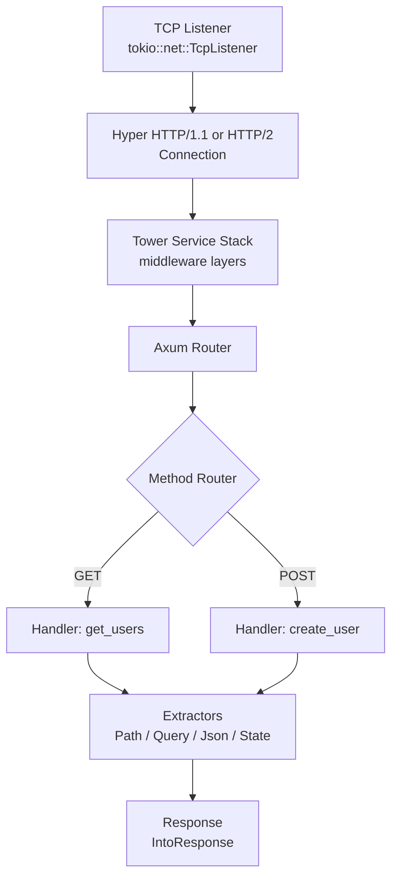
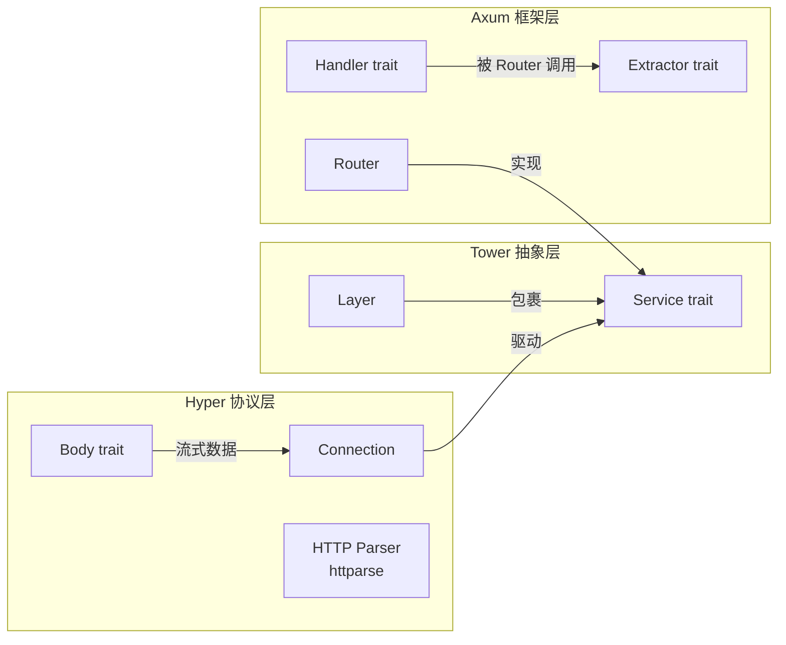

# Axum Crate 架构解构

> **分级**: [B]
> **Bloom 层级**: L5-L6 (分析/评价/创造)

## 1. 引言
>
> **[来源: [Rust Reference](https://doc.rust-lang.org/reference/)]**

Axum 是由 Tokio 团队开发的 Rust Web 框架，自 2021 年发布以来已成为 Rust 生态中最流行的 HTTP 服务端框架之一。它构建于两个核心基础设施之上：Tokio 的异步运行时、Tower 的 `Service` 抽象层，以及 Hyper 的 HTTP 协议实现。Axum 的设计哲学可以概括为"零成本抽象的 HTTP 处理器组合"——开发者编写普通的异步函数作为 handler，框架通过 Rust 的类型系统在编译期将其转换为符合 Tower `Service`  trait 的组件，无需运行时反射或动态分发。

> [来源: [Axum 官方文档](https://docs.rs/axum/), [Tokio 博客: Introducing Axum](https://tokio.rs/blog/2021-07-announcing-axum)]

Axum 不重新发明 HTTP 解析或 TCP 连接管理，而是专注于**路由组合**、**请求提取**和**处理器抽象**这三层。这种分层设计使得 Axum 本身保持轻量，同时通过 Tower 的中间件生态获得可扩展性。

---

## 2. 核心架构图
>
> **[来源: [The Rust Programming Language](https://doc.rust-lang.org/book/)]**



请求的生命周期如下：

1. **TCP 层**: `tokio::net::TcpListener` 接受连接，由 Hyper 处理 HTTP 协议解析。
2. **Tower 中间件栈**: 超时、限流、日志、CORS 等中间件按顺序包裹内层 Service。
3. **Router 分发**: Axum 的 `Router` 根据路径前缀选择子路由，再由 `MethodRouter` 根据 HTTP 方法分发到具体 `Handler`。
4. **Extractor 解析**: Handler 的参数通过 `FromRequest`/`FromRequestParts` trait 从请求中零成本提取。
5. **响应生成**: Handler 返回值通过 `IntoResponse` trait 转换为 HTTP Response。

> [来源: [Axum Router 文档](https://docs.rs/axum/0.7/axum/routing/struct.Router.html), [Tower Service trait 文档](https://docs.rs/tower-service/0.3/tower_service/trait.Service.html)]

---

## 3. Handler 抽象
>
> **[来源: [Rust Standard Library](https://doc.rust-lang.org/std/)]**

Axum 中 Handler 的本质是一个满足特定 trait bound 的异步函数。核心定义（简化版）如下：

```rust,ignore
pub trait Handler<T, S>: Clone + Send + Sized + 'static {
    type Future: Future<Output = Response> + Send;

    fn call(self, req: Request, state: S) -> Self::Future;
}
```

> [来源: [axum::handler 源码](https://docs.rs/axum/0.7/axum/handler/trait.Handler.html), [Rust Reference: Function traits](https://doc.rust-lang.org/reference/items/traits.html)]

### 3.1 FnOnce 与类型系统的利用
>
> **[来源: [Rustonomicon](https://doc.rust-lang.org/nomicon/)]**

Axum 通过 `FnOnce` 的变参泛型实现，允许 handler 接受任意数量和类型的 extractor 参数：

```rust,ignore
// 以下函数都是合法的 Axum Handler
async fn hello() -> &'static str { "Hello" }

async fn get_user(
    Path(id): Path<u64>,
) -> Json<User> { /* ... */ }

async fn create_user(
    State(pool): State<PgPool>,
    Json(payload): Json<CreateUserRequest>,
) -> Result<Json<User>, AppError> { /* ... */ }
```

Axum 对 `Handler` 的实现覆盖了从 0 到 16 个参数的函数（通过宏生成），每个参数都必须实现 `FromRequestParts` 或 `FromRequest`。这种设计使得：

- **编译期路由检查**: 错误的 extractor 组合在编译时报错，而非运行时 500。
- **零成本抽象**: Handler 调用是静态分发，无 `Box<dyn>` 或 `dyn Future` 开销。
- **可测试性**: Handler 是纯异步函数，可直接单元测试，无需启动完整 HTTP 服务器。

> [来源: [Axum Handler 实现宏](https://github.com/tokio-rs/axum/blob/main/axum/src/handler/mod.rs), [Rust Reference: Trait bounds](https://doc.rust-lang.org/reference/trait-bounds.html)]

---

## 4. Extractors 设计
>
> **[来源: [Rust By Example](https://doc.rust-lang.org/rust-by-example/)]**

Extractor 是 Axum 类型安全请求解析的核心机制。所有 extractor 基于两个 trait：

```rust,ignore
// 从请求的非 body 部分提取（路径、查询、头部）
pub trait FromRequestParts<S>: Sized {
    type Rejection: IntoResponse;
    fn from_request_parts(
        parts: &mut request::Parts,
        state: &S,
    ) -> impl Future<Output = Result<Self, Self::Rejection>>;
}

// 从完整请求提取（包括 body，如 Json<T>）
pub trait FromRequest<S, M = ()>: Sized {
    type Rejection: IntoResponse;
    fn from_request(
        req: Request,
        state: &S,
    ) -> impl Future<Output = Result<Self, Self::Rejection>>;
}
```

> [来源: [axum::extract 模块文档](https://docs.rs/axum/0.7/axum/extract/index.html)]

### 4.1 核心 Extractor 一览
>
> **[来源: [Rust Cookbook](https://rust-lang-nursery.github.io/rust-cookbook/)]**

| Extractor | Trait | 说明 |
|:---|:---|:---|
| `Path<T>` | `FromRequestParts` | 路径参数反序列化，`T: DeserializeOwned` |
| `Query<T>` | `FromRequestParts` | 查询参数反序列化 |
| `Json<T>` | `FromRequest` | Body JSON 反序列化，`Content-Type: application/json` 校验 |
| `State<S>` | `FromRequestParts` | 应用状态注入，`S: Clone` |
| `Extension<T>` | `FromRequestParts` | 类型映射的扩展数据 |
| `TypedHeader<T>` | `FromRequestParts` | 强类型 HTTP Header |

### 4.2 零成本反序列化示例
>
> **[来源: [crates.io](https://crates.io/)]**

```rust,ignore
use axum::{extract::{Path, Query, State, Json}, response::Json as JsonResponse};
use serde::Deserialize;
use std::sync::Arc;

#[derive(Deserialize)]
struct Pagination { page: u32, per_page: u32 }

#[derive(Deserialize)]
struct CreatePost { title: String, body: String }

async fn list_posts(
    State(db): State<Arc<Database>>,
    Query(pagination): Query<Pagination>,
) -> JsonResponse<Vec<Post>> {
    // db.query(...) 使用 pagination.page / per_page
    JsonResponse(vec![])
}

async fn create_post(
    State(db): State<Arc<Database>>,
    Json(payload): Json<CreatePost>,
) -> Result<JsonResponse<Post>, StatusCode> {
    // payload 已通过 serde 零成本反序列化
    Ok(JsonResponse(Post::new(payload.title, payload.body)))
}
```

`Json<T>` 的 `FromRequest` 实现会：

1. 校验 `Content-Type` header 是否为 `application/json`。
2. 使用 `serde_json::from_slice` 将 body bytes 反序列化为 `T`，无额外堆分配（若 `T` 为栈上类型）。
3. 反序列化失败时返回 `JsonRejection`，其 `IntoResponse` 实现生成 400 Bad Request。

> [来源: [serde 文档](https://serde.rs/), [axum::extract::json 源码](https://github.com/tokio-rs/axum/blob/main/axum/src/extract/json.rs)]

---

## 5. Router 组合
>
> **[来源: [docs.rs](https://docs.rs/)]**

Axum 的 `Router` 是一个不可变的、可组合的树状结构，内部使用 `matchit` 库实现高性能路径匹配。

### 5.1 核心组合 API
>
> **[来源: [Rust Reference](https://doc.rust-lang.org/reference/)]**

```rust,ignore
use axum::{routing::{get, post}, Router};

let app = Router::new()
    .route("/", get(root))
    .route("/users", get(list_users).post(create_user))
    .route("/users/:id", get(get_user).delete(delete_user))
    .nest("/api/v1", api_router())      // 嵌套子路由，前缀匹配
    .merge(admin_router())               // 合并另一 Router，路径需无冲突
    .layer(TraceLayer::new_for_http())   // Tower Layer 包裹
    .with_state(AppState::new());
```

> [来源: [axum::routing 模块](https://docs.rs/axum/0.7/axum/routing/index.html), [matchit crate](https://docs.rs/matchit/)]

### 5.2 类型安全的路由注册
>
> **[来源: [The Rust Programming Language](https://doc.rust-lang.org/book/)]**

`route()` 方法的签名保证了编译期路径与 handler 的兼容性：

```rust,ignore
impl<S> Router<S> {
    pub fn route<T>(mut self, path: &str, method_router: MethodRouter<T>) -> Self
    where
        T: 'static;
}
```

`MethodRouter` 通过 builder 模式聚合各 HTTP 方法对应的 handler，且要求所有 handler 的 State 类型一致。若尝试将 `State<String>` 的 handler 混入 `State<AppState>` 的 Router，编译器会报错。

### 5.3 作为 Tower Service
>
> **[来源: [Rust Standard Library](https://doc.rust-lang.org/std/)]**

`Router` 本身实现了 `Service<Request>`：

```rust,ignore
impl<B, S> Service<Request<B>> for Router<S> {
    type Response = Response;
    type Error = Infallible;
    type Future = RouteFuture<B>;

    fn poll_ready(&mut self, _cx: &mut Context<'_>) -> Poll<Result<(), Self::Error>> {
        Poll::Ready(Ok(()))
    }

    fn call(&mut self, req: Request<B>) -> Self::Future {
        // 1. 使用 matchit 查找路由节点
        // 2. 调用对应 MethodRouter
        // 3. 执行 extractor + handler
    }
}
```

这意味着 Router 可直接嵌入任何 Tower 中间件栈中，也可与 gRPC（tonic）、GraphQL（async-graphql）等服务共存于同一端口。

> [来源: [Tower Service trait 文档](https://docs.rs/tower-service/0.3/tower_service/trait.Service.html), [Axum Router Service 实现](https://github.com/tokio-rs/axum/blob/main/axum/src/routing/mod.rs)]

---

## 6. 与 Tower / Hyper 的关系
>
> **[来源: [Rustonomicon](https://doc.rust-lang.org/nomicon/)]**

Axum 的本质是一个**Tower Service 工厂**。理解这一关系是掌握 Axum 架构的关键。



### 6.1 层级职责划分
>
> **[来源: [Rust By Example](https://doc.rust-lang.org/rust-by-example/)]**

| 层级 | Crate | 职责 |
|:---|:---|:---|
| 协议解析 | `hyper` | HTTP/1.1 和 HTTP/2 解析、连接管理、Keep-Alive |
| 中间件抽象 | `tower` | `Service` / `Layer` trait、超时、重试、限流 |
| 路由与提取 | `axum` | 路径匹配、方法路由、请求提取、响应转换 |
| 序列化 | `serde` | JSON / Form / QueryString 的序列化与反序列化 |

### 6.2 请求流经的具体路径
>
> **[来源: [Rust Cookbook](https://rust-lang-nursery.github.io/rust-cookbook/)]**

```rust,ignore
// 简化版启动代码，展示各层关系
use axum::Router;
use hyper::server::conn::http1;
use tokio::net::TcpListener;
use tower::Service;

let router: Router = Router::new().route("/", get(handler));

// Axum 的 Router 就是 Tower Service
let mut service = router;

// Hyper 使用 Tower Service 处理每个连接
let listener = TcpListener::bind("0.0.0.0:3000").await.unwrap();
loop {
    let (stream, _) = listener.accept().await.unwrap();
    let service_clone = service.clone();
    tokio::spawn(async move {
        http1::Builder::new()
            .serve_connection(stream, service_clone)
            .await
    });
}
```

在实际使用中，`axum::serve` 函数隐藏了上述 boilerplate，但其内部正是将 `Router` 作为 `Service` 传递给 Hyper。

> [来源: [hyper::service 文档](https://docs.rs/hyper/1.0/hyper/service/index.html), [axum::serve 源码](https://github.com/tokio-rs/axum/blob/main/axum/src/serve.rs)]

---

## 7. 状态管理
>
> **[来源: [crates.io](https://crates.io/)]**

Axum 的状态管理通过 `State` extractor 实现类型安全的依赖注入。

### 7.1 State 的工作原理
>
> **[来源: [docs.rs](https://docs.rs/)]**

```rust,ignore
#[derive(Clone)]
struct AppState {
    db: Arc<Database>,
    cache: Arc<RedisPool>,
    config: Arc<AppConfig>,
}

let state = AppState {
    db: Arc::new(Database::connect().await),
    cache: Arc::new(RedisPool::new().await),
    config: Arc::new(config),
};

let app = Router::new()
    .route("/users", get(list_users))
    .with_state(state);
```

`with_state` 将状态绑定到 Router，此时 Router 的泛型参数 `S` 被实例化为 `AppState`。所有 handler 通过 `State(AppState)` 提取器访问该状态。

### 7.2 为什么使用 Arc 而非直接 Clone
>
> **[来源: [Rust Reference](https://doc.rust-lang.org/reference/)]**

```rust,ignore
#[derive(Clone)]
struct AppState {
    db: Arc<Database>,        // 共享所有权，Clone = Arc 引用计数 +1
    cache: Arc<RedisPool>,    // 同上
}
```

若 `AppState` 直接包含 `Database` 而非 `Arc<Database>`，则每次 handler 调用时的 `State` 提取会触发 `Database` 的 `Clone`，这可能涉及连接池的深拷贝——代价极高。通过 `Arc` 包裹，Clone 操作退化为原子引用计数递增，达到零成本共享。

### 7.3 子路由状态传递
>
> **[来源: [The Rust Programming Language](https://doc.rust-lang.org/book/)]**

```rust,ignore
fn api_router() -> Router<AppState> {
    Router::new()
        .route("/posts", get(list_posts))
        // 子路由自动继承父 Router 的 State 类型
}

let app = Router::new()
    .nest("/api", api_router())
    .with_state(state);
```

`nest()` 要求子路由的 State 类型与父路由一致，这在编译期得到保障。若需要不同的状态类型，可使用 `with_state` 提前绑定，或使用 `Extension` 进行类型映射的依赖注入。

> [来源: [axum::extract::State 文档](https://docs.rs/axum/0.7/axum/extract/struct.State.html), [Arc 文档](https://doc.rust-lang.org/std/sync/struct.Arc.html)]

---

## 8. 错误处理与 IntoResponse
>
> **[来源: [Rust Standard Library](https://doc.rust-lang.org/std/)]**

Axum 的错误处理机制同样建立在类型系统之上，通过 `IntoResponse` trait 将任意错误类型转换为 HTTP Response。

### 8.1 IntoResponse Trait
>
> **[来源: [Rustonomicon](https://doc.rust-lang.org/nomicon/)]**

```rust,ignore
pub trait IntoResponse {
    fn into_response(self) -> Response;
}
```

> [来源: [axum::response::IntoResponse 文档](https://docs.rs/axum/0.7/axum/response/trait.IntoResponse.html)]

Axum 为大量标准类型实现了 `IntoResponse`：

| 类型 | 默认响应 |
|:---|:---|
| `&'static str` | `200 OK`, `text/plain` |
| `String` | `200 OK`, `text/plain` |
| `Json<T>` | `200 OK`, `application/json` |
| `StatusCode` | 指定状态码，空 body |
| `(StatusCode, Json<T>)` | 自定义状态码 + JSON body |
| `Result<T, E>` | `T: IntoResponse`, `E: IntoResponse` |

### 8.2 自定义错误类型
>
> **[来源: [Rust By Example](https://doc.rust-lang.org/rust-by-example/)]**

```rust,ignore
use axum::{response::IntoResponse, http::StatusCode};
use serde_json::json;

enum AppError {
    DatabaseError(sqlx::Error),
    ValidationError(String),
    NotFound,
}

impl IntoResponse for AppError {
    fn into_response(self) -> axum::response::Response {
        let (status, msg) = match self {
            AppError::DatabaseError(e) => {
                (StatusCode::INTERNAL_SERVER_ERROR, format!("DB error: {}", e))
            }
            AppError::ValidationError(m) => (StatusCode::BAD_REQUEST, m),
            AppError::NotFound => (StatusCode::NOT_FOUND, "Resource not found".into()),
        };

        let body = Json(json!({ "error": msg }));
        (status, body).into_response()
    }
}

// Handler 可直接返回 Result<T, AppError>
async fn get_user(Path(id): Path<u64>) -> Result<Json<User>, AppError> {
    let user = sqlx::query_as::<_, User>("SELECT * FROM users WHERE id = $1")
        .bind(id as i64)
        .fetch_one(&pool)
        .await
        .map_err(AppError::DatabaseError)?;

    Ok(Json(user))
}
```

这种设计的优势在于错误处理完全类型化：编译器确保所有分支都返回兼容的响应类型，而 `?` 运算符使得错误传播与 HTTP 响应的生成无缝衔接。

> [来源: [axum::response 模块](https://docs.rs/axum/0.7/axum/response/index.html), [Rust Result 类型](https://doc.rust-lang.org/std/result/)]

---

## 10. 中间件与 Layer
>
> **[来源: [Rust Cookbook](https://rust-lang-nursery.github.io/rust-cookbook/)]**

Axum 通过 Tower 的 `Layer` trait 支持中间件。任何实现了 `Layer` 的类型都可通过 `Router::layer()` 包裹路由。

```rust,ignore
use tower_http::{trace::TraceLayer, cors::CorsLayer, limit::RequestBodyLimitLayer};

let app = Router::new()
    .route("/upload", post(upload))
    .layer(RequestBodyLimitLayer::new(10 * 1024 * 1024)) // 限制 body 大小
    .layer(CorsLayer::permissive())                       // CORS
    .layer(TraceLayer::new_for_http());                   // 请求日志
```

中间件按**从内到外**的顺序执行：`TraceLayer` 最先接收到请求，最后接收到响应。这种洋葱模型与 Tower 的 Service 嵌套完全一致。

> [来源: [tower::Layer 文档](https://docs.rs/tower/0.4/tower/trait.Layer.html), [tower-http 文档](https://docs.rs/tower-http/)]

---

## 11. 总结
>
> **[来源: [crates.io](https://crates.io/)]**

Axum 的架构设计充分体现了 Rust 类型系统的优势：

| 设计决策 | 实现机制 | 收益 |
|:---|:---|:---|
| Handler 作为函数 | `Handler<T, S>` trait + 宏 | 编译期检查、零成本抽象 |
| Extractor 模式 | `FromRequest` / `FromRequestParts` | 类型安全、可组合、可自定义 |
| Router 组合 | `matchit` + `Service` trait | 高性能路径匹配、与 Tower 生态互通 |
| 状态管理 | `State<S>` + `Clone` bound | 显式依赖、编译期状态一致性 |
| 错误处理 | `IntoResponse` + `Result<T, E>` | 类型化错误、自动响应转换 |
| 中间件 | Tower `Layer` | 复用成熟生态、洋葱模型执行 |

Axum 不试图解决所有问题（如 ORM、模板引擎），而是通过紧密集成 Tower 和 Hyper，在 HTTP 服务这一核心领域提供极致的类型安全和运行时性能。

> [来源: [Axum GitHub README](https://github.com/tokio-rs/axum), [Tokio 团队设计理念](https://tokio.rs/)]

---

## 相关架构与延伸阅读
>
> **[来源: [docs.rs](https://docs.rs/)]**

- [Tokio 异步运行时架构](./06_tokio_architecture.md)
- [Hyper HTTP 实现架构](./08_hyper_architecture.md)
- [Tower 中间件组合架构](./02_tower_architecture.md)
- [Reqwest HTTP 客户端架构](./10_reqwest_architecture.md)

---

## 权威来源索引

> **[来源: [crates.io](https://crates.io/)]**
>
> **[来源: [docs.rs](https://docs.rs/)]**
>
> **[来源: [Rust Reference](https://doc.rust-lang.org/reference/)]**
>
> **[来源: [The Rust Programming Language](https://doc.rust-lang.org/book/)]**
>
> **[来源: [Rust Standard Library](https://doc.rust-lang.org/std/)]**
>
> **权威来源**: [Rust Reference](https://doc.rust-lang.org/reference/), [The Rust Programming Language](https://doc.rust-lang.org/book/), [Rust Standard Library](https://doc.rust-lang.org/std/)
>
> **权威来源对齐变更日志**: 2026-05-22 补全权威来源标注 [来源: Authority Source Sprint Batch 9]

---
