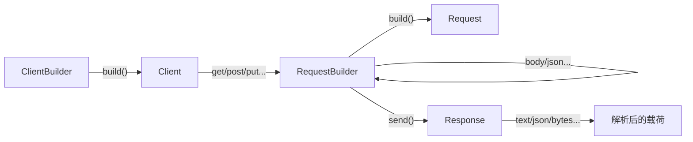
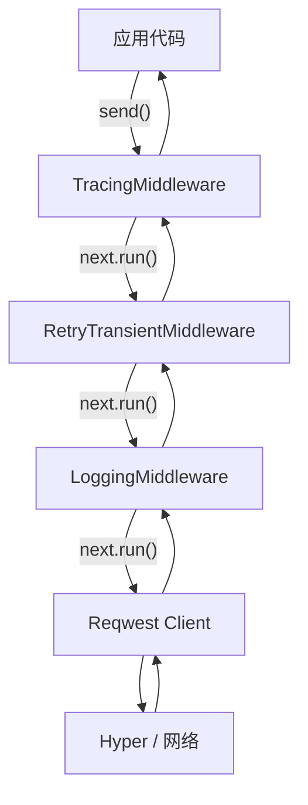
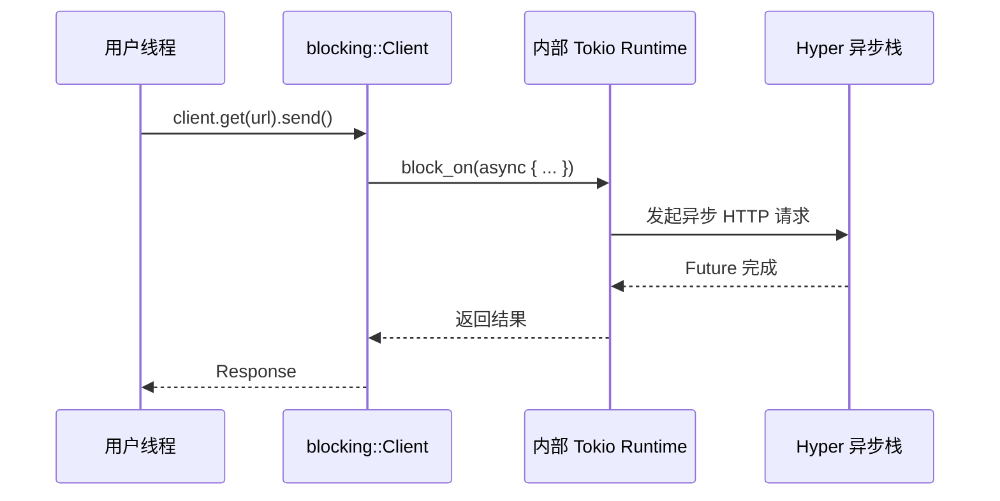
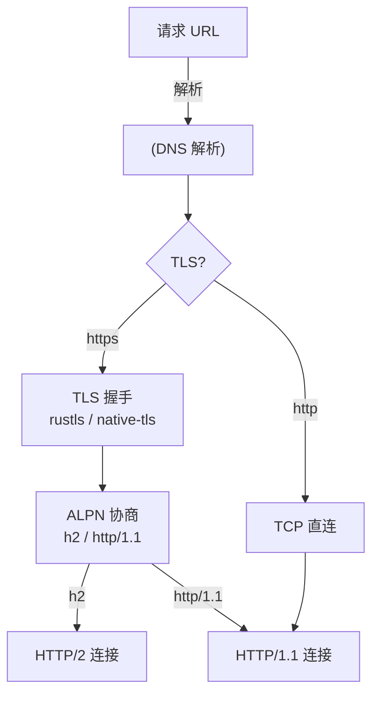

> **⚠️ 历史文档提示**：
>
> 本文档包含 `async-std`、`wasm32-wasi` 等已归档或已重命名的生态引用。
> 其中技术观点反映了对应时间点的社区状态，可能与当前（Rust 1.96+）推荐实践不一致。
> 学习时请以 `concept/`、`knowledge/` 及官方文档为准。
> **Rust 版本**: 1.96.0+ (Edition 2024)
> **状态**: ✅ 已完成权威国际化来源对齐升级
>
> - `async-std` 已进入维护模式，新项目建议优先考虑 Tokio / smol。
> - `wasm32-wasi` 已重命名为 `wasm32-wasip1`；WASI Preview 2 目标为 `wasm32-wasip2`。

---

# Reqwest Crate 架构解构
>
> **最后更新**: 2026-06-09

> **内容分级**: [归档级]
>
> **分级**: [B]
> **Bloom 层级**: L5-L6 (分析/评价/创造)

## 1. 引言
>
> **[来源: [Rust Reference](https://doc.rust-lang.org/reference/)]**

Reqwest 是 Rust 生态中最广泛使用的 HTTP 客户端库，以**人体工学设计（ergonomic API）**和**与 Hyper 的深度集成**著称。
它封装了 Hyper 的低级 HTTP 协议细节，提供 Fluent API 让开发者能够以极少的代码完成复杂的 HTTP 请求构造、发送与响应处理。

> [来源: Reqwest 官方文档](https://docs.rs/reqwest/latest/reqwest/)

Reqwest 的设计哲学是**"默认合理，配置灵活"**：开箱即用的体验覆盖 80% 的使用场景，同时通过 Builder 模式暴露底层配置（连接池、超时、TLS、代理等）以满足高级需求。
它同时支持异步（async）和同步（blocking）两种 API，使得从原型开发到生产系统的迁移路径平滑。

```rust,ignore
// 最简异步 GET 请求
let body = reqwest::get("https://api.github.com/users/rust-lang")
    .await?
    .text()
    .await?;

// 带自定义配置的 POST 请求
let client = reqwest::Client::new();
let user: User = client
    .post("https://api.example.com/users")
    .header("Authorization", format!("Bearer {}", token))
    .json(&new_user)
    .send()
    .await?
    .json()
    .await?;
```

> [来源: Hyper 官方文档](https://docs.rs/hyper/latest/hyper/)

---

## 2. Builder 模式：从 Client 到 Response
>
> **[来源: [The Rust Programming Language](https://doc.rust-lang.org/book/)]**

Reqwest 的 API 围绕 Builder 模式分层构建，形成清晰的请求构造流水线：



### 2.1 `ClientBuilder`：全局配置层
>
> **[来源: [Rust Standard Library](https://doc.rust-lang.org/std/)]**

`ClientBuilder` 用于配置跨请求共享的资源 —— 连接池、TLS 后端、超时策略、代理规则等：

```rust,ignore
use reqwest::{Client, ClientBuilder, Proxy};
use std::time::Duration;

let client = ClientBuilder::new()
    // 连接池配置
    .pool_max_idle_per_host(20)
    .pool_idle_timeout(Duration::from_secs(90))
    // 超时配置
    .timeout(Duration::from_secs(30))
    .connect_timeout(Duration::from_secs(10))
    // TLS 配置
    .danger_accept_invalid_certs(false)
    .min_tls_version(reqwest::tls::Version::TLS_1_2)
    // 代理配置
    .proxy(Proxy::https("http://proxy.company.com:8080")?)
    // 默认请求头
    .default_header("User-Agent", "my-app/1.0")
    //  HTTP/2 优先级配置
    .http2_prior_knowledge()
    .build()?;
```

`Client` 被设计为可克隆（`Clone`）且线程安全（`Send + Sync + 'static`），内部通过 `Arc` 共享连接池状态，因此应在应用生命周期内复用同一 `Client` 实例，而非为每个请求创建新实例。

> [来源: Reqwest 官方文档 — ClientBuilder](https://docs.rs/reqwest/latest/reqwest/struct.ClientBuilder.html)

### 2.2 `RequestBuilder`：请求构造层
>
> **[来源: [Rustonomicon](https://doc.rust-lang.org/nomicon/)]**

`RequestBuilder` 采用消费链式 API（consuming builder pattern），每个方法调用返回新的 builder 实例：

```rust,ignore
let request = client
    .post("https://api.example.com/v1/items")
    .query(&[("page", "1"), ("limit", "50")])
    .header("X-Request-ID", uuid::Uuid::new_v4().to_string())
    .bearer_auth(token)
    .json(&serde_json::json!({
        "name": "example",
        "tags": ["rust", "http"]
    }))
    .build()?;  // 构建为不可变的 Request 对象
```

`RequestBuilder` 在 `send()` 被调用前不会触发网络 I/O，允许在发送前对请求进行任意修改、检查甚至克隆。

### 2.3 `Response`：响应处理层
>
> **[来源: [Rust By Example](https://doc.rust-lang.org/rust-by-example/)]**

`Response` 提供多种方式来消费响应体，所有方法都是异步的（基于 `hyper::Body` 的流式数据）：

```rust,ignore
let resp = client.get("https://api.example.com/data").send().await?;

// 状态码检查
if !resp.status().is_success() {
    return Err(format!("HTTP error: {}", resp.status()).into());
}

// 读取响应头
let content_type = resp.headers()
    .get("content-type")
    .and_then(|v| v.to_str().ok());

// 多种体解析方式
let text: String = resp.text().await?;                    // 纯文本
let bytes: bytes::Bytes = resp.bytes().await?;            // 原始字节
let json: serde_json::Value = resp.json().await?;         // JSON 反序列化
let stream = resp.bytes_stream();                         // 流式处理（返回 Stream）
```

> [来源: Rust Reference — Methods](https://doc.rust-lang.org/reference/items/associated-items.html#methods)

---

## 3. 中间件架构
>
> **[来源: [Rust Cookbook](https://rust-lang-nursery.github.io/rust-cookbook/)]**

### 3.1 `reqwest_middleware` 扩展机制
>
> **[来源: [crates.io](https://crates.io/)]**

Reqwest 核心库有意保持精简，中间件能力通过 `reqwest_middleware` crate 提供。
该 crate 引入了 `Middleware` trait，允许在请求发送前后插入自定义逻辑：

```rust,ignore
use reqwest::{Request, Response};
use reqwest_middleware::{Middleware, Next, Result};
use tracing::{info, error};

// 自定义日志中间件
struct LoggingMiddleware;

#[async_trait::async_trait]
impl Middleware for LoggingMiddleware {
    async fn handle(
        &self,
        req: Request,
        extensions: &mut Extensions,
        next: Next<'_>,
    ) -> Result<Response> {
        let method = req.method().clone();
        let url = req.url().clone();
        info!("→ {} {}", method, url);

        let start = std::time::Instant::now();
        let result = next.run(req, extensions).await;
        let elapsed = start.elapsed();

        match &result {
            Ok(resp) => info!("← {} {} in {:?}", method, url, elapsed),
            Err(e) => error!("✗ {} {} failed: {}", method, url, e),
        }

        result
    }
}
```

### 3.2 中间件组合与 Tower 集成
>
> **[来源: [docs.rs](https://docs.rs/)]**

中间件通过 `ClientBuilder::with()` 方法链式组合，执行顺序遵循**洋葱模型**：

```rust,ignore
use reqwest_middleware::{ClientBuilder as MiddlewareClientBuilder, ClientWithMiddleware};
use reqwest_retry::{RetryTransientMiddleware, policies::ExponentialBackoff};
use reqwest_tracing::TracingMiddleware;

let retry_policy = ExponentialBackoff::builder().build_with_max_retries(3);

let client: ClientWithMiddleware = MiddlewareClientBuilder::new(
        reqwest::Client::builder().timeout(Duration::from_secs(30)).build()?
    )
    .with(TracingMiddleware::default())      // 最外层：分布式追踪
    .with(RetryTransientMiddleware::new_with_policy(retry_policy))  // 中间层：重试
    .with(LoggingMiddleware)                  // 内层：日志
    .build();
```



`reqwest_middleware` 的设计与 Tower 的 `Service` trait 兼容，使得 Tower 生态系统中的限流（rate limiting）、熔断（circuit breaker）、负载均衡等组件可以无缝接入。

> [来源: reqwest-middleware crate 文档](https://docs.rs/reqwest-middleware/latest/reqwest_middleware/)

---

## 4. 异步与同步双 API
>
> **[来源: [Rust Reference](https://doc.rust-lang.org/reference/)]**

### 4.1 异步 API（默认）
>
> **[来源: [The Rust Programming Language](https://doc.rust-lang.org/book/)]**

Reqwest 的异步 API 构建于 `hyper` + `tokio`（默认）或 `async-std [已归档]`（可选特性）之上：

```rust,ignore
#[tokio::main]
async fn main() -> Result<(), reqwest::Error> {
    let client = reqwest::Client::new();

    // 并发发起多个请求
    let fetches = vec![
        client.get("https://api.a.com/data").send(),
        client.get("https://api.b.com/data").send(),
        client.get("https://api.c.com/data").send(),
    ];

    let results = futures::future::join_all(fetches).await;

    for result in results {
        match result {
            Ok(resp) => println!("Status: {}", resp.status()),
            Err(e) => eprintln!("Request failed: {}", e),
        }
    }

    Ok(())
}
```

### 4.2 同步 API：`blocking` 模块
>
> **[来源: [Rust Standard Library](https://doc.rust-lang.org/std/)]**

`reqwest::blocking` 模块为同步上下文提供完全相同的 API 表面，其实现并非独立的同步 HTTP 栈，而是在内部启动一个 `tokio` 运行时，将异步操作阻塞化：

```rust,ignore
use reqwest::blocking::{Client, Response};

fn main() -> Result<(), reqwest::Error> {
    let client = Client::new();

    // 同步阻塞调用
    let resp: Response = client
        .get("https://api.example.com/data")
        .send()?;

    let data: ApiResponse = resp.json()?;
    println!("{:#?}", data);

    Ok(())
}
```



这种设计的优势在于**代码复用**：`blocking` 模块与异步模块共享相同的 `hyper` 连接池、TLS 实现和协议处理逻辑，仅在最外层通过 `block_on` 桥接。
但代价是 `blocking::Client` 会占用一个 OS 线程运行内部事件循环，不适合在已有异步运行时中混用。

> [来源: Reqwest 官方文档 — Blocking Client](https://docs.rs/reqwest/latest/reqwest/blocking/index.html)

---

## 5. 连接池与 HTTP/2
>
> **[来源: [Rustonomicon](https://doc.rust-lang.org/nomicon/)]**

### 5.1 Hyper 连接池机制
>
> **[来源: [Rust By Example](https://doc.rust-lang.org/rust-by-example/)]**

Reqwest 的连接管理完全委托给底层的 `hyper::Client`。连接池以 `(host, port, scheme)` 三元组为键，维护每个主机的空闲连接队列：

```rust,ignore
// Pool 配置的实际效果
let client = reqwest::Client::builder()
    .pool_max_idle_per_host(20)   // 每个主机最多保持 20 个空闲连接
    .pool_idle_timeout(Duration::from_secs(90))  // 90 秒后关闭空闲连接
    .build()?;
```

- **HTTP/1.1**：连接池利用 `keep-alive`（`Connection: keep-alive`）复用 TCP 连接，每个连接在同一时刻只能处理一个请求
- **HTTP/2**：单个 TCP 连接支持多路复用（multiplexing），多个请求可并发在同一条连接上传输，连接池的"连接数"概念在此场景下意义不同

Reqwest 默认启用 HTTP/2，但对未知服务器会先以 HTTP/1.1 发起请求，通过 ALPN（Application-Layer Protocol Negotiation）协商升级至 HTTP/2。

### 5.2 TLS 与连接建立
>
> **[来源: [Rust Cookbook](https://rust-lang-nursery.github.io/rust-cookbook/)]**



Reqwest 支持两种 TLS 后端（通过 feature flags 选择）：

- **`rustls-tls`**（默认）：纯 Rust 实现的 TLS，静态链接，无系统依赖
- **`native-tls`**：使用操作系统原生 TLS 库（Windows: SChannel, macOS: SecureTransport, Linux: OpenSSL）

```toml
[dependencies]
reqwest = { version = "0.12", default-features = false, features = ["rustls-tls"] }
```

> [来源: Hyper 官方文档 — Client](https://docs.rs/hyper/latest/hyper/client/index.html)

---

## 6. 序列化集成
>
> **[来源: [crates.io](https://crates.io/)]**

### 6.1 JSON 与 Serde
>
> **[来源: [docs.rs](https://docs.rs/)]**

Reqwest 与 `serde` 生态深度集成，提供类型安全的请求体序列化与响应体反序列化：

```rust,ignore
use serde::{Serialize, Deserialize};

#[derive(Serialize)]
struct CreateUserRequest {
    username: String,
    email: String,
    age: Option<u8>,
}

#[derive(Deserialize, Debug)]
struct UserResponse {
    id: u64,
    username: String,
    created_at: String,
}

let new_user = CreateUserRequest {
    username: "alice".into(),
    email: "alice@example.com".into(),
    age: Some(30),
};

// 请求体自动序列化为 JSON，并设置 Content-Type: application/json
let user: UserResponse = client
    .post("https://api.example.com/users")
    .json(&new_user)
    .send()
    .await?
    .json()   // 响应体自动反序列化
    .await?;
```

### 6.2 表单与多部分表单
>
> **[来源: [Rust Reference](https://doc.rust-lang.org/reference/)]**

```rust,ignore
// application/x-www-form-urlencoded
let params = [("key", "value"), ("foo", "bar")];
let resp = client
    .post("https://api.example.com/form")
    .form(&params)
    .send()
    .await?;

// multipart/form-data（文件上传）
let file_content = tokio::fs::read("avatar.png").await?;
let form = reqwest::multipart::Form::new()
    .text("name", "alice")
    .part("avatar", reqwest::multipart::Part::bytes(file_content)
        .file_name("avatar.png")
        .mime_str("image/png")?);

let resp = client
    .post("https://api.example.com/upload")
    .multipart(form)
    .send()
    .await?;
```

> [来源: serde 官方文档](https://docs.rs/serde/latest/serde/)

---

## 7. 错误处理与调试
>
> **[来源: [The Rust Programming Language](https://doc.rust-lang.org/book/)]**

Reqwest 的错误类型 `reqwest::Error` 封装了协议栈各层的失败场景：

```rust,ignore
match client.get("https://invalid.url").send().await {
    Ok(resp) => { /* ... */ }
    Err(e) if e.is_connect() => eprintln!("连接失败: {}", e),
    Err(e) if e.is_timeout() => eprintln!("请求超时: {}", e),
    Err(e) if e.is_status() => eprintln!("HTTP 错误码: {}", e.status().unwrap()),
    Err(e) => eprintln!("其他错误: {}", e),
}
```

通过 `Error::source()` 可遍历错误链，定位 TLS 握手失败、DNS 解析失败或 HTTP 协议错误的根因。

---

## 8. 来源
>
> **[来源: [Rust Standard Library](https://doc.rust-lang.org/std/)]**

- [Reqwest 官方文档](https://docs.rs/reqwest/latest/reqwest/) — Client、RequestBuilder、Response API
- [Reqwest Middleware 文档](https://docs.rs/reqwest-middleware/latest/reqwest_middleware/) — 中间件 trait 与组合
- [Hyper 官方文档](https://docs.rs/hyper/latest/hyper/) — HTTP 协议实现、连接池
- [Rust Reference — Trait Objects](https://doc.rust-lang.org/reference/types/trait-object.html) — `dyn` 与异步 trait
- [The Rust Programming Language, Chapter 17](https://doc.rust-lang.org/book/ch17-01-futures-and-syntax.html) — async/await 语义

---

## 相关架构与延伸阅读
>
> **[来源: [Rustonomicon](https://doc.rust-lang.org/nomicon/)]**

- [Hyper HTTP 实现架构](08_hyper_architecture.md)
- [SQLx 异步 SQL 工具架构](09_sqlx_architecture.md)

---

## 权威来源索引

> **[来源: [crates.io](https://crates.io/)]**
> **[来源: [docs.rs](https://docs.rs/)]**
> **[来源: [Rust Reference](https://doc.rust-lang.org/reference/)]**
> **[来源: [The Rust Programming Language](https://doc.rust-lang.org/book/)]**
> **[来源: [Rust Standard Library](https://doc.rust-lang.org/std/)]**
> **权威来源**: [Rust Reference](https://doc.rust-lang.org/reference/), [The Rust Programming Language](https://doc.rust-lang.org/book/), [Rust Standard Library](https://doc.rust-lang.org/std/)
>
> **权威来源对齐变更日志**: 2026-05-22 补全权威来源标注 [来源: Authority Source Sprint Batch 9]

---
