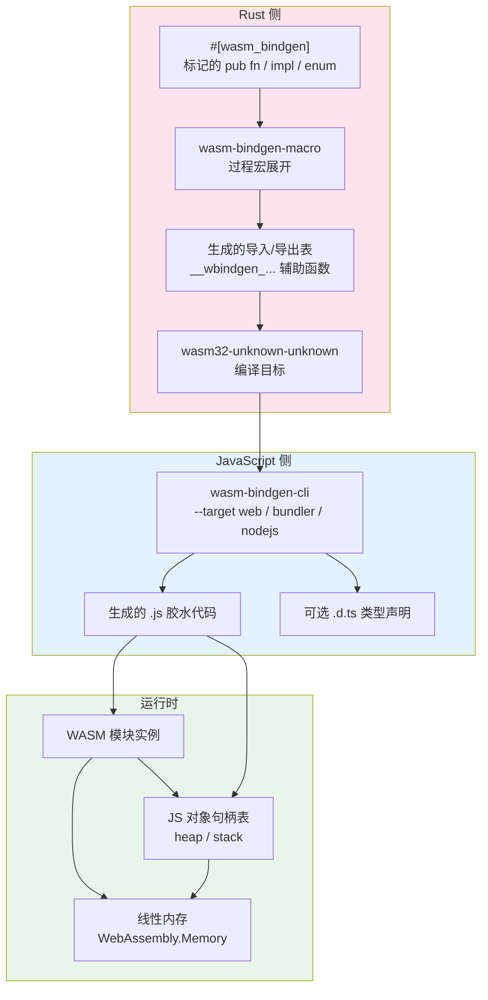
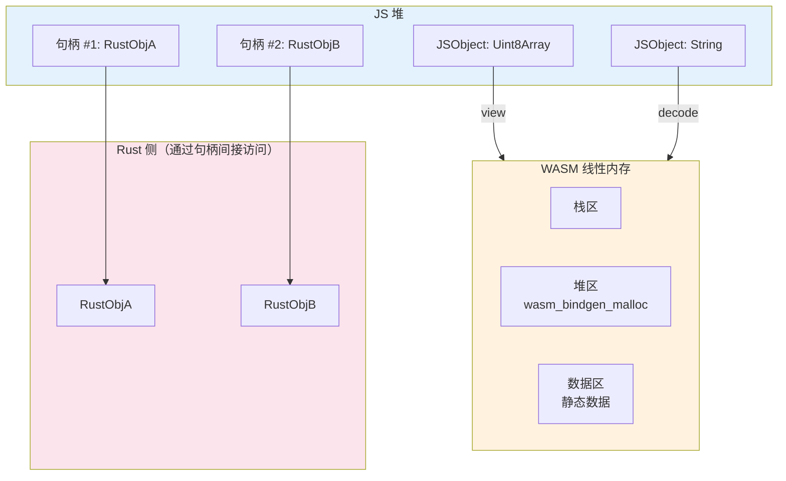

> **Canonical 说明**: 本文件专注 **wasm-bindgen 的跨语言绑定宏（Macro）与 JS 胶水生成架构**。
>
> 若只需要使用指南与生态定位，请优先参考：
>
> - [WebAssembly 基础](../../../../concept/06_ecosystem/11_domain_applications/11_webassembly.md)
> - [高级 WebAssembly](../../../../concept/06_ecosystem/11_domain_applications/54_webassembly_advanced.md)
> - [Rust for WebAssembly](../../../../concept/07_future/04_research_and_experimental/28_rust_for_webassembly.md)
>
> 本文件保留架构级深度内容，与上述使用指南形成互补。

# wasm-bindgen crate 架构解构 {#wasm-bindgen-crate-架构解构}

> **EN**: Wasm Bindgen Architecture
> **Summary**: wasm-bindgen crate 架构解构 Wasm Bindgen Architecture.
> **概念族**: 软件设计 / Crate 架构
> **内容分级**: [归档级]
> **Rust 版本**: 1.97.0+ (Edition 2024)
> **状态**: ✅ 已完成权威国际化来源对齐升级
>
> **分级**: [B]
> **Bloom 层级**: L5-L6

## 1. 引言 {#1-引言}

wasm-bindgen 是 Rust WebAssembly 生态与 JavaScript 运行时（Runtime）之间的核心桥梁，年下载量超过 5000 万次 来源: [crates.io 统计, 2025](https://crates.io/)。

它并非简单的 FFI 封装，而是一套完整的**跨语言绑定系统**：通过过程宏（Procedural Macro）在编译期分析 Rust 代码的公共接口，生成配套的 JavaScript 胶水代码和 WASM 导入/导出表，实现 Rust 与 JS 之间的无缝互调用。

wasm-bindgen 的核心理念可以概括为：**JS 拥有对象，Rust 借出能力**。

JavaScript 运行时作为垃圾回收环境，持有通过 wasm-bindgen 创建的 Rust 对象的引用（Reference）；Rust 则通过生成的封装函数，安全地暴露其计算能力，同时避免内存管理冲突。

> 来源: [wasm-bindgen 官方文档](https://rustwasm.github.io/docs/wasm-bindgen/)
> 来源: [WebAssembly 规范](https://webassembly.github.io/spec/)

---

## 2. 核心架构图 {#2-核心架构图}

>
> **[来源: [Rust Reference](https://doc.rust-lang.org/reference/)]**

wasm-bindgen 采用**宏驱动生成架构**，在编译期完成跨语言接口的静态生成。



**架构要点解读：**

| 层级 | 职责 | 核心组件 |
|:---|:---|:---|
| 标记层 | 用 `#[wasm_bindgen]` 标记需要暴露的 Rust 接口 | 过程宏属性 |
| 生成层 | 生成 JS 胶水代码和 WASM 辅助函数 | `wasm-bindgen-cli` |
| 绑定层 | 类型转换、内存分配、异常传播 | 生成的 `__wbindgen_*` 函数 |
| 运行时层 | JS 对象句柄管理、线性内存访问 | WASM 线性内存 + JS 句柄表 |

> 来源: [wasm-bindgen 内部机制](https://rustwasm.github.io/docs/wasm-bindgen/contributing/design/index.html)

---

## 3. 关键 Trait 与类型定义 {#3-关键-trait-与类型定义}

>
> **[来源: [The Rust Programming Language](https://doc.rust-lang.org/book/)]**

### 3.1 `#[wasm_bindgen]` 宏的展开机制 {#31-wasm_bindgen-宏的展开机制}

>
> **[来源: [Rust Standard Library](https://doc.rust-lang.org/std/)]**

给定 Rust 代码：

```rust,ignore
#[wasm_bindgen]

pub fn greet(name: &str) -> String {

    format!("Hello, {}!", name)

}
```

宏展开后生成（简化示意）：

```rust,ignore
// 导出函数到 WASM 的导出表

#[export_name = "greet"]

pub extern "C" fn __wasm_bindgen_generated_greet(

    name_ptr: *mut u8,

    name_len: usize,

) -> *mut u8 {

    let name = unsafe {

        let slice = std::slice::from_raw_parts(name_ptr, name_len);

        std::str::from_utf8_unchecked(slice)

    };

    let result = greet(name);

    // 将结果字符串编码到 WASM 线性内存，返回指针

    wasm_bindgen::convert::IntoWasmAbi::into_abi(result)

}
```

同时生成的 JS 代码：

```javascript
// 从 WASM 模块导入生成的函数

export function greet(name) {

    const ptr0 = passStringToWasm0(name, wasm.__wbindgen_malloc, wasm.__wbindgen_realloc);

    const len0 = WASM_VECTOR_LEN;

    const ret = wasm.greet(ptr0, len0);

    // 从 WASM 内存读取返回的字符串

    return getStringFromWasm0(ret[0], ret[1]);

}
```

> [wasm-bindgen 源码, crates/macro-support/src/parser.rs](https://github.com/rustwasm/wasm-bindgen/blob/main/crates/macro-support/src/parser.rs)

### 3.2 `JsValue` — JS 值的 opaque 封装 {#32-jsvalue-js-值的-opaque-封装}

>
> **[来源: [Rustonomicon](https://doc.rust-lang.org/nomicon/)]**

```rust,ignore
#[repr(transparent)]

pub struct JsValue {

    idx: u32,  // 在 JS 句柄表中的索引

    _marker: PhantomData<*mut ()>,  // !Send + !Sync

}
```

`JsValue` 是 wasm-bindgen 最核心的类型。它不代表具体的 JS 值内容，而是持有该值在 JS 堆中的**句柄索引**。所有与 JS 交互的类型最终都转换为 `JsValue`：

| Rust 类型 | JS 侧表示 | 转换方式 |
|:---|:---|:---|
| `i32`, `f64` | number | 直接 WASM 数值类型 |
| `bool` | boolean | 0/1 编码 |
| `String` | string | UTF-8 编码写入 WASM 内存 |
| `&str` | string | 借用（Borrowing）：零拷贝视窗 |
| `Vec<u8>` | Uint8Array | 拷贝到 JS ArrayBuffer |
| `JsValue` | 任意 JS 值 | 句柄引用 |
| `Closure<dyn FnMut(...)>` | Function | JS 可调用的闭包（Closures） |

> 来源: wasm-bindgen JsValue 文档, https: /  / [docs.rs](https://docs.rs/) / wasm-bindgen / latest / wasm_bindgen / struct.JsValue.html

### 3.3 `Closure` — Rust 闭包作为 JS 回调 {#33-closure-rust-闭包作为-js-回调}

>
> **[来源: [Rust By Example](https://doc.rust-lang.org/rust-by-example/)]**

```rust,ignore
pub struct Closure<T: ?Sized> {

    js: ManuallyDrop<JsValue>,

    _drop: fn(*mut T),  // 析构时释放 Rust 闭包

}

impl<T: ?Sized> Closure<T> {

    pub fn new<F>(fn_mut: F) -> Closure<F>

    where

        F: FnMut($($var: $var,)*) $(-> $ret)? + 'static,

    {

        // 将 Rust 闭包包装为 JS Function

    }

    pub fn as_ref(&self) -> &JsValue {

        &*self.js

    }

}
```

`Closure` 解决了 JS 事件回调调用 Rust 代码的核心问题：

1. Rust 闭包被 Box 到堆上，获得稳定的内存地址
2. 生成一个 JS `Function` 包装器，通过导入的 WASM 函数间接调用 Rust 闭包（Closures）
3. JS 侧持有 `Closure` 的 `JsValue` 句柄；Rust 侧通过 `Closure::drop` 在不再使用时释放堆内存

```rust,ignore
use wasm_bindgen::prelude::*;

use wasm_bindgen::closure::Closure;

use web_sys::{console, window};

let closure = Closure::wrap(Box::new(move |event: web_sys::MouseEvent| {

    console::log_1(&format!("clicked at {}, {}", event.client_x(), event.client_y()).into());

}) as Box<dyn FnMut(_)>);

window()

    .unwrap()

    .add_event_listener_with_callback("click", closure.as_ref().unchecked_ref())

    .unwrap();

// 必须 forget，否则 Closure 被 drop 后 JS 仍持有无效函数指针

closure.forget();
```

> 来源: wasm-bindgen Closure 文档, https: /  / [docs.rs](https://docs.rs/) / wasm-bindgen / latest / wasm_bindgen / closure / struct.Closure.html

---

## 4. 内存管理：JS 拥有，Rust 服务 {#4-内存管理js-拥有rust-服务}

>
> **[来源: [Rust Cookbook](https://rust-lang-nursery.github.io/rust-cookbook/)]**

### 4.1 线性内存共享模型 {#41-线性内存共享模型}

>
> **[来源: [crates.io](https://crates.io/)]**



WASM 模块（Module）拥有一个连续的线性内存（`WebAssembly.Memory`），JS 和 Rust 均可读写。但 Rust 对象（如 `Vec<String>`）不能直接暴露给 JS——JS 的 GC 不理解 Rust 的内存布局。wasm-bindgen 的解决方案：**JS 通过句柄引用 Rust 堆对象**，Rust 对象的生命周期（Lifetimes）由 Rust 的 ownership 规则管理，JS 侧通过生成的 `free()` 方法显式释放。

### 4.2 字符串传递：拷贝 vs 借用 {#42-字符串传递拷贝-vs-借用}

>
> **[来源: [docs.rs](https://docs.rs/)]**

```rust,ignore
#[wasm_bindgen]

pub fn takes_str(s: &str) {

    // &str 借用：零拷贝，JS 字符串被解码到 WASM 内存的临时区域

    // 函数返回后该内存可能被覆盖

}

#[wasm_bindgen]

pub fn takes_string(s: String) {

    // String 拥有：JS 字符串被拷贝到 Rust 堆，Rust 负责释放

}

#[wasm_bindgen]

pub fn returns_str() -> &'static str {

    // 返回 &str：必须 'static，否则 JS 获得悬空指针

    "hello"

}

#[wasm_bindgen]

pub fn returns_string() -> String {

    // 返回 String：Rust 将字符串编码到 WASM 内存，JS 读取后 Rust 释放

    "hello".to_string()

}
```

| 签名 | 数据流向 | 拷贝次数 | 安全性 |
|:---|:---|:---:|:---|
| `&str` 参数 | JS → Rust | 1（JS string → WASM 内存） | 函数作用域内有效 |
| `String` 参数 | JS → Rust | 1（到 WASM）+ 1（到 Rust heap） | Rust 拥有，安全 |
| `&str` 返回 | Rust → JS | 1（WASM → JS） | 必须 'static |
| `String` 返回 | Rust → JS | 1（WASM → JS） | Rust 释放编码缓冲区 |

> 来源: [wasm-bindgen 类型映射参考](https://rustwasm.github.io/docs/wasm-bindgen/reference/types.html)

---

## 5. 零拷贝传输：`Uint8Array` 视窗 {#5-零拷贝传输uint8array-视窗}

>
> **[来源: [Rust Reference](https://doc.rust-lang.org/reference/)]**

### 5.1 `&[u8]` 与 `Uint8Array` 的共享内存 {#51-u8-与-uint8array-的共享内存}

>
> **[来源: [The Rust Programming Language](https://doc.rust-lang.org/book/)]**

```rust,ignore
use js_sys::Uint8Array;

use wasm_bindgen::prelude::*;

#[wasm_bindgen]

pub fn process_bytes(data: &[u8]) -> Vec<u8> {

    // data 是 JS Uint8Array 在 WASM 内存上的视窗

    // 无需拷贝，直接读取

    data.iter().map(|b| b.wrapping_add(1)).collect()

}

#[wasm_bindgen]

pub fn get_memory() -> JsValue {

    wasm_bindgen::memory()

}
```

JS 侧使用生成的代码：

```javascript
import { memory, process_bytes } from './pkg';

const data = new Uint8Array([1, 2, 3, 4]);

// 将数据写入 WASM 内存，获得指针

const ptr = wasm.alloc(data.length);

const wasmArray = new Uint8Array(memory.buffer, ptr, data.length);

wasmArray.set(data);

const resultPtr = process_bytes(ptr, data.length);

// resultPtr 指向 WASM 内存中的输出区域
```

### 5.2 `js_sys::Array` 与 `wasm_bindgen::convert` 的批量优化 {#52-js_sysarray-与-wasm_bindgenconvert-的批量优化}

>
> **[来源: [Rust Standard Library](https://doc.rust-lang.org/std/)]**

对于大量小对象的传递（如 `Vec<String>`），wasm-bindgen 采用序列化编码（类似 serde），将多个对象打包写入 WASM 内存的一次性分配中，而非逐个创建 JS 对象。这在大批量数据交换中显著减少 JS ↔ WASM 边界 crossing 的开销。

> 来源: [wasm-bindgen 零拷贝指南](https://rustwasm.github.io/docs/wasm-bindgen/reference/types/number-slices.html)

---

## 6. 异步集成：`Promise` 与 `async` {#6-异步集成promise-与-async}

>
> **[来源: [Rustonomicon](https://doc.rust-lang.org/nomicon/)]**

### 6.1 Rust `async fn` 的 JS 暴露 {#61-rust-async-fn-的-js-暴露}

>
> **[来源: [Rust By Example](https://doc.rust-lang.org/rust-by-example/)]**

```rust,ignore
#[wasm_bindgen]

pub async fn fetch_data(url: String) -> Result<JsValue, JsValue> {

    let window = web_sys::window().unwrap();

    let resp_value = wasm_bindgen_futures::JsFuture::from(

        window.fetch_with_str(&url)

    ).await?;

    let resp: web_sys::Response = resp_value.dyn_into()?;

    let json = wasm_bindgen_futures::JsFuture::from(

        resp.json()?

    ).await?;

    Ok(json)

}
```

生成的 JS 代码将此函数包装为返回 `Promise` 的 async 函数：

```javascript
export async function fetch_data(url) {

    // 分配 WASM 内存存放 url

    // 调用 wasm.fetch_data(url_ptr, url_len)

    // wasm.fetch_data 返回一个 Promise 句柄

    // 等待 Rust async 完成，将结果转换为 JS Promise resolution

}
```

`wasm_bindgen_futures` crate 提供了 `JsFuture` 类型，将 JS `Promise` 转换为 Rust 的 `Future`（通过事件循环集成），使得 Rust 代码可以使用 `async/await` 语法直接等待 JS 异步（Async）操作。

> 来源: wasm-bindgen-futures 文档, https: /  / [docs.rs](https://docs.rs/) / wasm-bindgen-futures / latest / wasm_bindgen_futures /

---

## 7. `web-sys` 与 `js-sys`：浏览器 API 的 Rust 封装 {#7-web-sys-与-js-sys浏览器-api-的-rust-封装}

>
> **[来源: [Rust Cookbook](https://rust-lang-nursery.github.io/rust-cookbook/)]**

### 7.1 自动生成规模 {#71-自动生成规模}

>
> **[来源: [crates.io](https://crates.io/)]**

`web-sys` 是 wasm-bindgen 项目的姊妹 crate，包含约 30000 个 `#[wasm_bindgen]` 标记的绑定，覆盖完整的 WebIDL 规范：

| 模块（Module） | 绑定数量 | 典型类型 |
|:---|:---:|:---|
| `web_sys::Document` | ~200 方法 | DOM 操作 |
| `web_sys::CanvasRenderingContext2d` | ~150 方法 | 2D 绘图 |
| `web_sys::WebGlRenderingContext` | ~600 方法 | WebGL |
| `web_sys::WebSocket` | ~20 方法 | 网络 |
| `js_sys::Array`, `Object`, `Promise` | ~100 方法 | JS 内置对象 |

```rust,ignore
use web_sys::{Document, Element, HtmlCanvasElement, Window};

use wasm_bindgen::prelude::*;

#[wasm_bindgen]

pub fn setup_canvas() -> Result<(), JsValue> {

    let window = web_sys::window().ok_or("no window")?;

    let document = window.document().ok_or("no document")?;

    let canvas = document

        .get_element_by_id("canvas")

        .ok_or("no canvas")?

        .dyn_into::<HtmlCanvasElement>()?;

    let context = canvas

        .get_context("2d")?

        .ok_or("no 2d context")?

        .dyn_into::<web_sys::CanvasRenderingContext2d>()?;

    context.set_fill_style(&"#ff0000".into());

    context.fill_rect(10.0, 10.0, 100.0, 100.0);

    Ok(())

}
```

### 7.2 `dyn_into` 与 `unchecked_ref`：类型转换的两面 {#72-dyn_into-与-unchecked_ref类型转换的两面}

>
> **[来源: [docs.rs](https://docs.rs/)]**

```rust,ignore
// 安全的运行时类型检查（对应 JS instanceof）

let canvas: HtmlCanvasElement = element.dyn_into()?;

// 不安全的零开销转换（仅在已知类型时使用）

let func: &js_sys::Function = closure.as_ref().unchecked_ref();
```

| 方法 | 开销 | 安全性 | 适用场景 |
|:---|:---:|:---:|:---|
| `dyn_into()` | 高（运行时类型检查） | ✅ 安全 | 用户输入、不确定类型 |
| `unchecked_ref()` | 零 | ⚠️ 信任前提 | 内部实现、已知类型 |

> 来源: web-sys 文档, https: /  / [docs.rs](https://docs.rs/) / web-sys / latest / web_sys /
> 来源: js-sys 文档, https: /  / [docs.rs](https://docs.rs/) / js-sys / latest / js_sys /

---

## 8. 性能保证机制 {#8-性能保证机制}

>
> **[来源: [Rust Reference](https://doc.rust-lang.org/reference/)]**

### 8.1 避免 JS ↔ WASM 边界穿越 {#81-避免-js-wasm-边界穿越}

>
> **[来源: [The Rust Programming Language](https://doc.rust-lang.org/book/)]**

每次 JS 调用 WASM 函数或反之，都有固定的上下文切换开销。wasm-bindgen 的优化策略：

1. **批处理**：一次传递 `Vec<T>` 而非多次传递单个 `T`
2. **视窗化**：`&[u8]` 直接映射 JS `Uint8Array`，无数据拷贝
3. **内联小函数**：编译器将小型 `#[wasm_bindgen]` 函数内联到调用点

### 8.2 内存分配策略 {#82-内存分配策略}

>
> **[来源: [Rust Standard Library](https://doc.rust-lang.org/std/)]**

```rust,ignore
// wasm-bindgen 导出的分配器接口

#[wasm_bindgen]

extern "C" {

    #[wasm_bindgen(js_name = __wbindgen_malloc)]

    fn malloc(size: usize) -> *mut u8;

    #[wasm_bindgen(js_name = __wbindgen_realloc)]

    fn realloc(ptr: *mut u8, old_size: usize, new_size: usize) -> *mut u8;

}
```

WASM 模块使用 `dlmalloc` 或 Rust 默认分配器管理线性内存内的堆。JS 侧通过生成的 `__wbindgen_malloc` 在 WASM 内存中分配空间，然后将数据（如字符串）编码到该空间——避免了 WASM 和 JS 各自维护独立堆的双份分配。

### 8.3 与纯 JS 的性能对比（示意） {#83-与纯-js-的性能对比示意}

>
> **[来源: [Rustonomicon](https://doc.rust-lang.org/nomicon/)]**

| 场景 | 相对性能 | 说明 |
|:---|:---:|:---|
| 数值计算密集型 | 2-10x | WASM 接近原生速度 |
| DOM 操作密集型 | 0.5-0.8x | 频繁 JS API 调用开销 |
| 字符串处理 | 0.8-1.5x | 依赖 UTF-16 vs UTF-8 差异 |
| 大数据量传输 | 1-3x | 零拷贝视窗优势明显 |

> 来源: [WebAssembly 性能指南](https://web.dev/performance-wasm/)

---

## 9. 反模式边界：何时不应使用 wasm-bindgen {#9-反模式边界何时不应使用-wasm-bindgen}

>
> **[来源: [Rust By Example](https://doc.rust-lang.org/rust-by-example/)]**

### 9.1 简单的计算卸载 {#91-简单的计算卸载}

>
> **[来源: [Rust Cookbook](https://rust-lang-nursery.github.io/rust-cookbook/)]**

如果只需要在 JS 中调用一个纯计算函数（如图像滤镜、加密运算），而不需要复杂的类型交互，`wasm-pack` 配合手工 `extern "C"` 接口可能生成更小的 WASM 二进制：

```rust,ignore
// 无 wasm-bindgen：仅使用 core + no_std

#[no_mangle]

pub extern "C" fn blur_image(ptr: *mut u8, len: usize, radius: f32) {

    let slice = unsafe { std::slice::from_raw_parts_mut(ptr, len) };

    // ... 纯计算

}
```

### 9.2 闭包泄漏：`Closure::forget` {#92-闭包泄漏closureforget}

>
> **[来源: [crates.io](https://crates.io/)]**

`Closure::forget` 将 Rust 闭包泄漏到 JS 堆，永不释放。如果频繁创建闭包（如每帧的动画回调），会导致 WASM 线性内存的持续增长：

```rust,ignore
// ❌ 危险：每次调用都泄漏一个闭包

pub fn set_callback() {

    let closure = Closure::wrap(Box::new(|| {

        // ...

    }) as Box<dyn Fn()>);

    window().set_interval_with_callback_and_timeout_and_arguments_0(

        closure.as_ref().unchecked_ref(),

        16,

    ).unwrap();

    closure.forget();  // 内存泄漏！

}

// ✅ 正确：将闭包存储在 JS 侧可管理的位置

#[wasm_bindgen]

pub struct CallbackManager {

    closure: Closure<dyn Fn()>,

}
```

### 9.3 跨线程共享 WASM 内存 {#93-跨线程共享-wasm-内存}

>
> **[来源: [docs.rs](https://docs.rs/)]**

WASM 线性内存可以被多个 Web Worker 共享（`SharedArrayBuffer`），但 wasm-bindgen 生成的 JS 胶水代码不是线程安全的。`JsValue` 的句柄索引在线程间无同步机制，多线程同时操作会导致数据竞争。

```rust
// ❌ wasm-bindgen 不支持直接多线程 JS 交互

// 需要使用 rayon + wasm-bindgen-rayon 专用方案
```

### 9.4 过大的接口表 {#94-过大的接口表}

>
> **[来源: [Rust Reference](https://doc.rust-lang.org/reference/)]**

如果 Rust 库暴露了数千个 public 函数，`#[wasm_bindgen]` 会生成相应数量的 JS 胶水函数，显著增加包体积。应通过模块化设计控制暴露面，或使用 `wasm-bindgen` 的 `skip` 属性排除内部函数。

> 来源: [wasm-bindgen 贡献指南](https://rustwasm.github.io/docs/wasm-bindgen/contributing/design/describe.html)
> 来源: [MDN WebAssembly](https://developer.mozilla.org/en-US/docs/WebAssembly)

---

## 10. 来源与扩展阅读 {#10-来源与扩展阅读}

>
> **[来源: [The Rust Programming Language](https://doc.rust-lang.org/book/)]**

| 来源 | URL | 用途 |
|:---|:---|:---|
| wasm-bindgen 官方文档 | <https://rustwasm.github.io/docs/wasm-bindgen/> | 权威使用指南 |
| wasm-bindgen API 文档 | <https://docs.rs/wasm-bindgen/latest/wasm_bindgen/> | 源码级类型参考 |
| web-sys 文档 | <https://docs.rs/web-sys/latest/web_sys/> | 浏览器 API 绑定 |
| js-sys 文档 | <https://docs.rs/js-sys/latest/js_sys/> | JS 内置对象绑定 |
| WebAssembly 规范 | <https://webassembly.github.io/spec/> | 底层语义 |
| MDN WebAssembly | <https://developer.mozilla.org/en-US/docs/WebAssembly> | Web 平台集成 |

> **文档元信息**
>
> - 对应 Rust 版本: 1.97.0+ (Edition 2024)
> - 对应 wasm-bindgen 版本: 0.2.100+
> - 最后更新: 2026-05-22
> - 状态: ✅ 初版完成

---

## 相关架构与延伸阅读 {#相关架构与延伸阅读}

>
> **[来源: [Rust Standard Library](https://doc.rust-lang.org/std/)]**

- [Wgpu GPU 图形架构](11_wgpu_architecture.md)
- [Unsafe Rust 与 FFI](../../../../concept/03_advanced/02_unsafe/03_unsafe.md)

---

## 权威来源索引 {#权威来源索引}

> **[来源: [crates.io](https://crates.io/)]**
> **[来源: [docs.rs](https://docs.rs/)]**
> **[来源: [WebAssembly Documentation](https://webassembly.org/)]**
> **[来源: [Wasmtime](https://wasmtime.dev/)]**
> **[来源: [Rust FFI Guide](https://doc.rust-lang.org/nomicon/ffi.html)]**
> **[来源: [bindgen Documentation](https://rust-lang.github.io/rust-bindgen/)]**
> **[来源: [Rust Reference](https://doc.rust-lang.org/reference/)]**
> **[来源: [The Rust Programming Language](https://doc.rust-lang.org/book/)]**
> **权威来源**: [Rust Reference](https://doc.rust-lang.org/reference/), [The Rust Programming Language](https://doc.rust-lang.org/book/), [Rust Standard Library](https://doc.rust-lang.org/std/)
> **权威来源对齐变更日志**: 2026-05-22 补全权威来源标注 [Authority Source Sprint Batch 9](../../../../concept/00_meta/02_sources/international_authority_index.md)

---

## 权威来源参考 {#权威来源参考}

> **来源**: [Rust API Guidelines](https://rust-lang.github.io/api-guidelines/)
> **来源**: [Rust Design Patterns](https://rust-unofficial.github.io/patterns/)
> **来源**: [This Week in Rust](https://this-week-in-rust.org/)

## 学术权威参考 {#学术权威参考}

- [RustBelt](https://plv.mpi-sws.org/rustbelt/popl18/)
- [Aeneas](https://aeneas-verification.github.io/)
- [Oxide](https://arxiv.org/abs/1903.00982)
