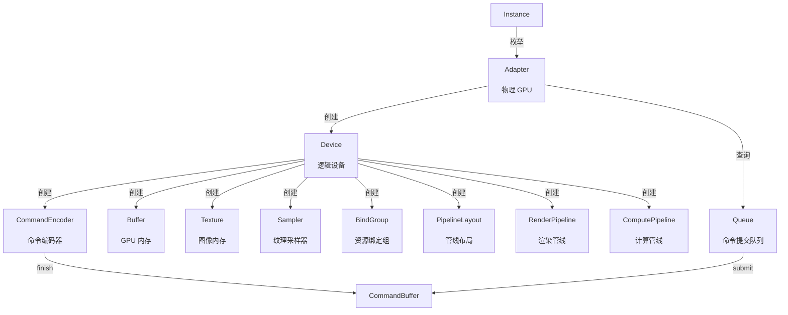
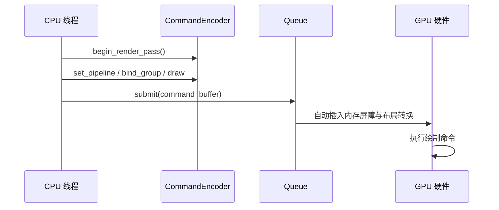
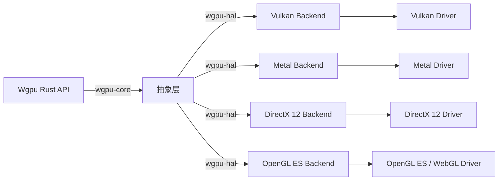

# Wgpu Crate 架构解构 {#wgpu-crate-架构解构}

>

> **最后更新**: 2026-06-09

> **概念族**: 软件设计 / Crate 架构

> **内容分级**: [归档级]

> **Rust 版本**: 1.96.0+ (Edition 2024)

> **状态**: ✅ 已完成权威国际化来源对齐升级

>

> **分级**: [B]

> **Bloom 层级**: L5-L6 (分析/评价/创造)

## 1. 引言 {#1-引言}

>

> **[来源: [Rust Reference](https://doc.rust-lang.org/reference/)]**

Wgpu 是 Rust 生态中 WebGPU 标准的原生实现，提供了一套**跨平台、跨 API 的 GPU 编程抽象**。

它允许开发者用统一的 Rust API 编写 GPU 代码，底层自动映射至 Vulkan（Linux/Windows/Android）、Metal（macOS/iOS）、DirectX 12（Windows）或 WebGL（Web 平台）。

> [来源: Wgpu 官方文档](https://docs.rs/wgpu/latest/wgpu/)

Wgpu 的设计目标并非替代底层图形 API，而是提供**类型安全、内存安全、验证充分**的上层抽象，消除直接操作 Vulkan/Metal/DX12 时常见的段错误、内存泄漏与未定义行为。

它既是 WebGPU 标准在原生平台的参考实现，也是浏览器外 Rust GPU 应用的首选方案。

```rust,ignore

// Wgpu 最简渲染循环的骨架

async fn run() {

    let instance = wgpu::Instance::default();

    let adapter = instance.request_adapter(&Default::default()).await.unwrap();

    let (device, queue) = adapter.request_device(&Default::default(), None).await.unwrap();

    // ... 渲染管线配置与帧提交

}

```

> [来源: WebGPU 标准规范](https://www.w3.org/TR/webgpu/)

---

## 2. 核心抽象层级 {#2-核心抽象层级}

>

> **[来源: [The Rust Programming Language](https://doc.rust-lang.org/book/)]**

Wgpu 的 API 遵循现代 GPU 硬件的抽象模型，形成清晰的资源层级关系：



### 2.1 `Instance`：入口点 {#21-instance入口点}

>

> **[来源: [Rust Standard Library](https://doc.rust-lang.org/std/)]**

`Instance` 是 Wgpu 的全局入口，负责加载底层图形驱动并管理 GPU 适配器的枚举：

```rust,ignore

let instance = wgpu::Instance::new(wgpu::InstanceDescriptor {

    backends: wgpu::Backends::VULKAN | wgpu::Backends::METAL,

    flags: wgpu::InstanceFlags::DEBUG,

    ..Default::default()

});

```

### 2.2 `Adapter`：物理 GPU 抽象 {#22-adapter物理-gpu-抽象}

>

> **[来源: [Rustonomicon](https://doc.rust-lang.org/nomicon/)]**

`Adapter` 代表系统中可用的物理 GPU，提供其能力查询（limits、features、属性）：

```rust,ignore

let adapter = instance

    .request_adapter(&wgpu::RequestAdapterOptions {

        power_preference: wgpu::PowerPreference::HighPerformance,

        compatible_surface: Some(&surface),  // 与显示表面兼容

        force_fallback_adapter: false,

    })

    .await

    .expect("未找到合适的 GPU 适配器");


// 查询 GPU 能力

let info = adapter.get_info();

println!("GPU: {} ({:?})", info.name, info.backend);

println!("驱动: {}", info.driver);

```

### 2.3 `Device` 与 `Queue`：逻辑设备与命令队列 {#23-device-与-queue逻辑设备与命令队列}

>

> **[来源: [Rust By Example](https://doc.rust-lang.org/rust-by-example/)]**

`Device` 是 GPU 的逻辑表示，拥有独立的内存地址空间；`Queue` 是向 GPU 提交工作的唯一通道：

```rust,ignore

let (device, queue) = adapter

    .request_device(

        &wgpu::DeviceDescriptor {

            required_features: wgpu::Features::TEXTURE_BINDING_ARRAY,

            required_limits: wgpu::Limits {

                max_bind_groups: 4,

                max_texture_dimension_2d: 4096,

                ..Default::default()

            },

            label: Some("主设备"),

        },

        None,

    )

    .await

    .expect("设备创建失败");

```

> [来源: WebGPU 标准 — Adapter/Device](https://www.w3.org/TR/webgpu/#adapters)

---

## 3. 类型安全 GPU 编程 {#3-类型安全-gpu-编程}

>

> **[来源: [Rust Reference](https://doc.rust-lang.org/reference/)]**

### 3.1 `BindGroup` 的类型安全绑定 {#31-bindgroup-的类型安全绑定}

>

> **[来源: [The Rust Programming Language](https://doc.rust-lang.org/book/)]**

Wgpu 在 GPU 资源绑定上强制执行编译期/创建期的类型检查。

`BindGroupLayout` 定义了着色器期望的资源接口，`BindGroup` 是具体的资源实例，两者在 `PipelineLayout` 中关联：

```rust,ignore

// 1. 定义绑定组布局（着色器接口契约）

let bind_group_layout = device.create_bind_group_layout(&wgpu::BindGroupLayoutDescriptor {

    label: Some("uniforms_bind_group_layout"),

    entries: &[

        wgpu::BindGroupLayoutEntry {

            binding: 0,

            visibility: wgpu::ShaderStages::VERTEX | wgpu::ShaderStages::FRAGMENT,

            ty: wgpu::BindingType::Buffer {

                ty: wgpu::BufferBindingType::Uniform,

                has_dynamic_offset: false,

                min_binding_size: None,

            },

            count: None,

        },

        wgpu::BindGroupLayoutEntry {

            binding: 1,

            visibility: wgpu::ShaderStages::FRAGMENT,

            ty: wgpu::BindingType::Texture {

                sample_type: wgpu::TextureSampleType::Float { filterable: true },

                view_dimension: wgpu::TextureViewDimension::D2,

                multisampled: false,

            },

            count: None,

        },

        wgpu::BindGroupLayoutEntry {

            binding: 2,

            visibility: wgpu::ShaderStages::FRAGMENT,

            ty: wgpu::BindingType::Sampler(wgpu::SamplerBindingType::Filtering),

            count: None,

        },

    ],

});


// 2. 创建具体的绑定组

let bind_group = device.create_bind_group(&wgpu::BindGroupDescriptor {

    label: Some("uniforms_bind_group"),

    layout: &bind_group_layout,

    entries: &[

        wgpu::BindGroupEntry { binding: 0, resource: uniform_buffer.as_entire_binding() },

        wgpu::BindGroupEntry { binding: 1, resource: wgpu::BindingResource::TextureView(&texture_view) },

        wgpu::BindGroupEntry { binding: 2, resource: wgpu::BindingResource::Sampler(&sampler) },

    ],

});

```

如果 `BindGroup` 中的资源类型与 `BindGroupLayoutEntry` 不匹配（例如将 `TextureView` 绑定到期望 `Buffer` 的槽位），`create_bind_group` 调用会在创建期即报错，而非在着色器运行时产生未定义行为。

### 3.2 着色器验证：Naga 编译器 {#32-着色器验证naga-编译器}

>

> **[来源: [Rust Standard Library](https://doc.rust-lang.org/std/)]**

Wgpu 内置 `naga` 着色器编译器，将 WGSL（WebGPU Shading Language）源码编译为底层 GPU 中间表示：

| 源语言 | 目标平台 | Naga 输出 |

|---|---|---|

| WGSL | Vulkan | SPIR-V |

| WGSL | Metal | MSL (Metal Shading Language) |

| WGSL | DirectX 12 | HLSL → DXIL |

| WGSL | WebGL | GLSL ES |

```rust,ignore

// WGSL 着色器源码

let shader = device.create_shader_module(wgpu::ShaderModuleDescriptor {

    label: Some("shader"),

    source: wgpu::ShaderSource::Wgsl(include_str!("shader.wgsl").into()),

});

```

```wgsl

// shader.wgsl —— 在编译期由 Naga 验证

struct VertexInput {

    @location(0) position: vec3<f32>,

    @location(1) tex_coord: vec2<f32>,

};


struct VertexOutput {

    @builtin(position) clip_position: vec4<f32>,

    @location(0) tex_coord: vec2<f32>,

};


@vertex

fn vs_main(in: VertexInput) -> VertexOutput {

    var out: VertexOutput;

    out.clip_position = vec4<f32>(in.position, 1.0);

    out.tex_coord = in.tex_coord;

    return out;

}


@group(0) @binding(1)

var t_diffuse: texture_2d<f32>;


@group(0) @binding(2)

var s_diffuse: sampler;


@fragment

fn fs_main(in: VertexOutput) -> @location(0) vec4<f32> {

    return textureSample(t_diffuse, s_diffuse, in.tex_coord);

}

```

Naga 在 `create_shader_module` 时执行完整的静态分析：类型检查、接口匹配验证、控制流分析。

如果 WGSL 代码存在类型错误（如将 `vec3<f32>` 赋值给 `vec2<f32>` 的接口）、未初始化变量或无效的资源绑定索引，CPU 侧即刻收到详细的验证错误，**不会在 GPU 驱动层面触发未定义行为**。

> [来源: Naga 文档](https://docs.rs/naga/latest/naga/)

---

## 4. 内存模型 {#4-内存模型}

>

> **[来源: [Rustonomicon](https://doc.rust-lang.org/nomicon/)]**

### 4.1 显式内存管理 {#41-显式内存管理}

>

> **[来源: [Rust By Example](https://doc.rust-lang.org/rust-by-example/)]**

Wgpu 拒绝隐式内存拷贝，所有 GPU 资源（Buffer、Texture）的创建、使用和生命周期管理完全显式：

```rust,ignore

// Buffer 创建 —— 必须显式声明用途

let vertex_buffer = device.create_buffer(&wgpu::BufferDescriptor {

    label: Some("vertex_buffer"),

    size: (vertices.len() * std::mem::size_of::<Vertex>()) as u64,

    usage: wgpu::BufferUsages::VERTEX | wgpu::BufferUsages::COPY_DST,

    mapped_at_creation: false,

});


// 显式从 CPU 内存上传数据至 GPU

queue.write_buffer(&vertex_buffer, 0, bytemuck::cast_slice(&vertices));

```

| 资源类型 | 用途标记 (`*Usages`) | 典型场景 |

|---|---|---|

| `Buffer` | `VERTEX`, `INDEX`, `UNIFORM`, `STORAGE`, `COPY_SRC`, `COPY_DST` | 顶点数据、索引、 uniform、计算存储 |

| `Texture` | `TEXTURE_BINDING`, `RENDER_ATTACHMENT`, `COPY_SRC`, `COPY_DST`, `STORAGE_BINDING` | 纹理采样、帧缓冲、计算写入 |

| `Sampler` | 无（独立对象） | 纹理过滤与寻址模式 |

```rust,ignore

// Texture 创建 —— 用途与格式必须显式指定

let depth_texture = device.create_texture(&wgpu::TextureDescriptor {

    label: Some("depth_texture"),

    size: wgpu::Extent3d {

        width: config.width,

        height: config.height,

        depth_or_array_layers: 1,

    },

    mip_level_count: 1,

    sample_count: 1,

    dimension: wgpu::TextureDimension::D2,

    format: wgpu::TextureFormat::Depth32Float,

    usage: wgpu::TextureUsages::RENDER_ATTACHMENT | wgpu::TextureUsages::TEXTURE_BINDING,

    view_formats: &[],

});

```

### 4.2 内存屏障与同步 {#42-内存屏障与同步}

>

> **[来源: [Rust Reference](https://doc.rust-lang.org/reference/)]**

Wgpu 的同步模型基于**显式管线阶段跟踪**而非手动内存屏障。

`CommandEncoder` 记录的所有命令在 `submit()` 时由 Wgpu 运行时自动推导所需的资源状态转换（texture layouts、buffer barriers）：



```rust,ignore

let mut encoder = device.create_command_encoder(&wgpu::CommandEncoderDescriptor {

    label: Some("render_encoder"),

});


// 渲染通道 —— Wgpu 自动处理 color attachment 的 layout 转换

{

    let mut render_pass = encoder.begin_render_pass(&wgpu::RenderPassDescriptor {

        color_attachments: &[Some(wgpu::RenderPassColorAttachment {

            view: &view,

            resolve_target: None,

            ops: wgpu::Operations {

                load: wgpu::LoadOp::Clear(wgpu::Color::BLACK),

                store: wgpu::StoreOp::Store,

            },

        })],

        depth_stencil_attachment: Some(...),

        ..Default::default()

    });


    render_pass.set_pipeline(&render_pipeline);

    render_pass.set_bind_group(0, &bind_group, &[]);

    render_pass.set_vertex_buffer(0, vertex_buffer.slice(..));

    render_pass.draw(0..3, 0..1);

}  // render_pass drop 后通道结束


// 提交命令 —— 所有同步由 Wgpu 运行时推导

queue.submit(std::iter::once(encoder.finish()));

```

> [来源: WebGPU 标准 — Resource Usages](https://www.w3.org/TR/webgpu/#resource-usages)

---

## 5. 异步渲染与显示 {#5-异步渲染与显示}

>

> **[来源: [The Rust Programming Language](https://doc.rust-lang.org/book/)]**

### 5.1 Surface 渲染循环 {#51-surface-渲染循环}

>

> **[来源: [Rust Standard Library](https://doc.rust-lang.org/std/)]**

Wgpu 的窗口渲染通过 `Surface` 对象与操作系统窗口系统集成，典型的渲染循环如下：

```rust,ignore

// 1. 创建与窗口关联的 Surface

let surface = instance.create_surface(window).unwrap();

let mut config = surface.get_default_config(&adapter, width, height).unwrap();

surface.configure(&device, &config);


// 2. 每帧渲染循环

fn render(&mut self) -> Result<(), wgpu::SurfaceError> {

    // 获取下一帧纹理（异步操作，可能因窗口 resize 而失败）

    let output = self.surface.get_current_texture()?;

    let view = output.texture.create_view(&wgpu::TextureViewDescriptor::default());


    let mut encoder = self.device.create_command_encoder(&...);


    // 记录渲染命令...


    self.queue.submit(std::iter::once(encoder.finish()));


    // 呈现至屏幕（异步）

    output.present();


    Ok(())

}

```

### 5.2 异步原语与平台差异 {#52-异步原语与平台差异}

>

> **[来源: [Rustonomicon](https://doc.rust-lang.org/nomicon/)]**

Wgpu 的初始化 API（`request_adapter`、`request_device`）均为 `async`，因为某些平台（尤其是 Web/WASM）的 GPU 枚举是异步操作。

在原生平台，这些函数实际会立即返回 `Poll::Ready`，但统一使用 async 接口保持了跨平台一致性。

```rust,ignore

// 原生平台：使用 pollster 阻塞等待

let (device, queue) = pollster::block_on(async {

    adapter.request_device(&desc, None).await

}).expect("设备创建失败");


// Web 平台：必须在 async 上下文中运行

#[wasm_bindgen(start)]

pub async fn run() {

    let (device, queue) = adapter.request_device(&desc, None).await.unwrap();

}

```

> [来源: Wgpu Wiki — Async Initialization](https://github.com/gfx-rs/wgpu/wiki)

---

## 6. 跨平台抽象 {#6-跨平台抽象}

>

> **[来源: [Rust By Example](https://doc.rust-lang.org/rust-by-example/)]**

### 6.1 运行时后端选择 {#61-运行时后端选择}

>

> **[来源: [Rust Reference](https://doc.rust-lang.org/reference/)]**

Wgpu 通过 `Backends` 位标志在运行时选择图形 API 后端：

```rust,ignore

let instance = wgpu::Instance::new(wgpu::InstanceDescriptor {

    // 启用所有可用后端，按优先级自动选择

    backends: wgpu::Backends::all(),

    // 或显式限定：仅 Vulkan 和 DX12

    // backends: wgpu::Backends::VULKAN | wgpu::Backends::DX12,

    ..Default::default()

});

```

后端选择优先级（从高到低）：

| 平台 | 首选后端 | 后备 |

|---|---|---|

| Windows | DirectX 12 | Vulkan |

| macOS / iOS | Metal | — |

| Linux / Android | Vulkan | — |

| Web | WebGPU | WebGL2 |

### 6.2 编译期特性控制 {#62-编译期特性控制}

>

> **[来源: [The Rust Programming Language](https://doc.rust-lang.org/book/)]**

通过 Cargo features 可以裁剪不需要的后端实现，减小二进制体积：

```toml

[dependencies]

wgpu = { version = "23", default-features = false, features = ["wgsl", "vulkan"] }

```

| Feature | 说明 |

|---|---|

| `vulkan` | 启用 Vulkan 后端 |

| `metal` | 启用 Metal 后端 |

| `dx12` | 启用 DirectX 12 后端 |

| `gles` | 启用 OpenGL ES / WebGL 后端 |

| `wgsl` | 启用 WGSL 着色器支持 |

| `spirv` / `glsl` | 启用 SPIR-V / GLSL 着色器输入 |



`wgpu-core` 提供与硬件无关的资源管理和验证逻辑，`wgpu-hal` 是对各底层 API 的统一抽象。

这种分层使得新增后端只需实现 `hal` trait，上层应用代码完全不受影响。

> [来源: Wgpu 源码架构](https://github.com/gfx-rs/wgpu/tree/trunk/wgpu-core)

---

## 7. 渲染管线配置 {#7-渲染管线配置}

>

> **[来源: [Rust Standard Library](https://doc.rust-lang.org/std/)]**

### 7.1 `RenderPipeline` 的完整配置 {#71-renderpipeline-的完整配置}

>

> **[来源: [Rustonomicon](https://doc.rust-lang.org/nomicon/)]**

`RenderPipeline` 是现代 GPU 渲染状态机的完整描述，Wgpu 要求所有状态在创建时显式指定：

```rust,ignore

let render_pipeline = device.create_render_pipeline(&wgpu::RenderPipelineDescriptor {

    label: Some("render_pipeline"),

    layout: Some(&pipeline_layout),

    vertex: wgpu::VertexState {

        module: &shader,

        entry_point: Some("vs_main"),

        buffers: &[vertex_buffer_layout],

        compilation_options: Default::default(),

    },

    fragment: Some(wgpu::FragmentState {

        module: &shader,

        entry_point: Some("fs_main"),

        targets: &[Some(wgpu::ColorTargetState {

            format: config.format,

            blend: Some(wgpu::BlendState::REPLACE),

            write_mask: wgpu::ColorWrites::ALL,

        })],

        compilation_options: Default::default(),

    }),

    primitive: wgpu::PrimitiveState {

        topology: wgpu::PrimitiveTopology::TriangleList,

        front_face: wgpu::FrontFace::Ccw,

        cull_mode: Some(wgpu::Face::Back),

        polygon_mode: wgpu::PolygonMode::Fill,

        ..Default::default()

    },

    depth_stencil: Some(wgpu::DepthStencilState {

        format: wgpu::TextureFormat::Depth32Float,

        depth_write_enabled: true,

        depth_compare: wgpu::CompareFunction::Less,

        ..Default::default()

    }),

    ..Default::default()

});

```

所有管线状态（光栅化规则、深度测试、混合模式、裁剪模式）在 `create_render_pipeline` 时冻结为不可变对象，运行时切换管线只需调用 `set_pipeline()`，无需逐状态重新设置。

### 7.2 计算管线 {#72-计算管线}

>

> **[来源: [Rust By Example](https://doc.rust-lang.org/rust-by-example/)]**

计算管线（`ComputePipeline`）的配置更为简洁，无需顶点/片段阶段：

```rust,ignore

let compute_pipeline = device.create_compute_pipeline(&wgpu::ComputePipelineDescriptor {

    label: Some("compute_pipeline"),

    layout: Some(&compute_pipeline_layout),

    module: &compute_shader,

    entry_point: Some("main"),

    ..Default::default()

});


let mut compute_pass = encoder.begin_compute_pass(&Default::default());

compute_pass.set_pipeline(&compute_pipeline);

compute_pass.set_bind_group(0, &compute_bind_group, &[]);

compute_pass.dispatch_workgroups(256, 1, 1);

```

> [来源: WebGPU 标准 — Compute Passes](https://www.w3.org/TR/webgpu/#compute-passes)

---

## 8. 来源 {#8-来源}

>

> **[来源: [Rust Reference](https://doc.rust-lang.org/reference/)]**

- [Wgpu 官方文档](https://docs.rs/wgpu/latest/wgpu/) — Instance、Device、Queue、Pipeline API

- [WebGPU 标准规范 W3C](https://www.w3.org/TR/webgpu/) — 标准定义、资源模型、同步语义

- [Naga 文档](https://docs.rs/naga/latest/naga/) — WGSL/SPIR-V/MSL/HLSL 着色器翻译与验证

- [Rust Reference — Unsafe Rust](https://doc.rust-lang.org/reference/unsafe-blocks.html) — Unsafe 代码块语义（Wgpu HAL 层涉及 unsafe 封装）

- [Wgpu GitHub Wiki](https://github.com/gfx-rs/wgpu/wiki) — 架构设计、后端实现说明、调试指南

---

## 相关架构与延伸阅读 {#相关架构与延伸阅读}

>

> **[来源: [The Rust Programming Language](https://doc.rust-lang.org/book/)]**

- [Bevy 游戏引擎架构](05_bevy_architecture.md)

- [Unsafe Rust 与 FFI](../../../../concept/03_advanced/03_unsafe.md)

---

## 权威来源索引 {#权威来源索引}

> **[来源: [crates.io](https://crates.io/)]**

> **[来源: [docs.rs](https://docs.rs/)]**

> **[来源: [Rust Reference](https://doc.rust-lang.org/reference/)]**

> **[来源: [The Rust Programming Language](https://doc.rust-lang.org/book/)]**

> **[来源: [Rust Standard Library](https://doc.rust-lang.org/std/)]**

> **权威来源**: [Rust Reference](https://doc.rust-lang.org/reference/), [The Rust Programming Language](https://doc.rust-lang.org/book/), [Rust Standard Library](https://doc.rust-lang.org/std/)

>

> **权威来源对齐变更日志**: 2026-05-22 补全权威来源标注 [来源: Authority Source Sprint Batch 9]

---

## 权威来源参考 {#权威来源参考}

> **来源**: [Rust API Guidelines](https://rust-lang.github.io/api-guidelines/)
> **来源**: [Rust Design Patterns](https://rust-unofficial.github.io/patterns/)
> **来源**: [This Week in Rust](https://this-week-in-rust.org/)

## 学术权威参考 {#学术权威参考}

- [RustBelt](https://plv.mpi-sws.org/rustbelt/popl18/)
- [Aeneas](https://aeneas-verification.github.io/)
- [Oxide](https://arxiv.org/abs/1903.00982)