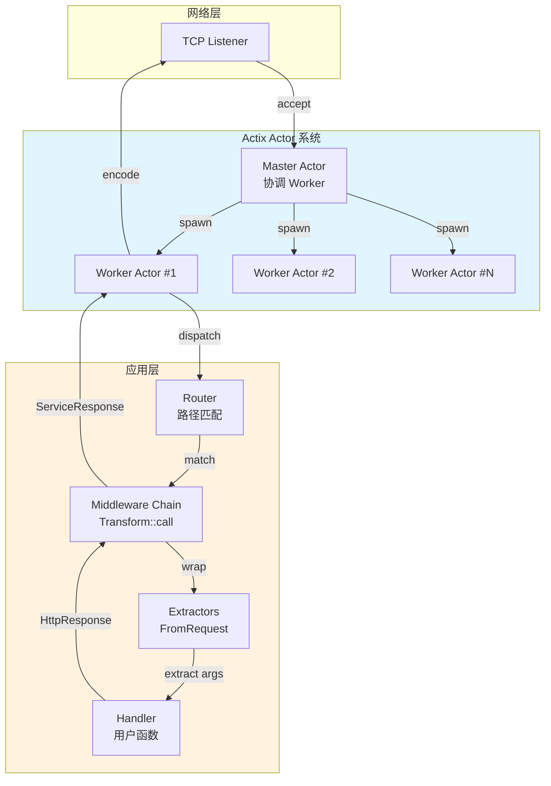
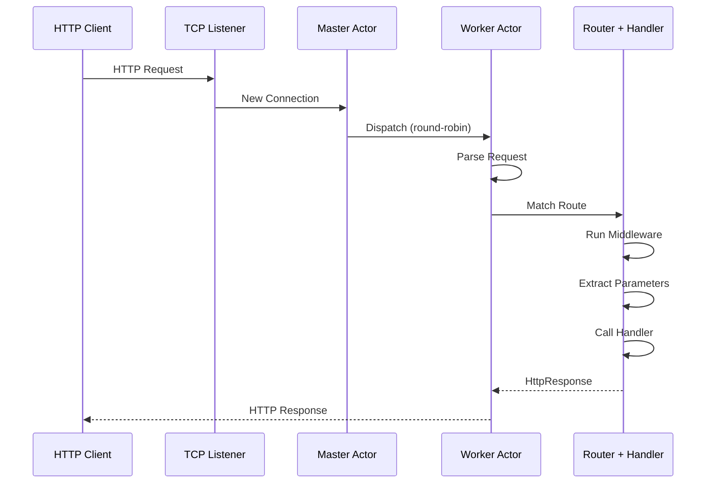

> **Canonical 说明**: 本文件专注 **Actix-web 的 Actor 模型、Transform 中间件与 FromRequest 架构**。
>
> 若只需要使用指南与生态定位，请优先参考：
>
> - [Web 框架生态](../../../../concept/06_ecosystem/04_web_and_networking/27_web_frameworks.md)
> - [Actix-web vs Axum](../../../../content/ecosystem/web_frameworks/actix_web_vs_axum.md)
>
> 本文件保留架构级深度内容，与上述使用指南形成互补。

# Actix-web Crate 架构解构 {#actix-web-crate-架构解构}

> **EN**: Actix Web Architecture
> **Summary**: Actix-web Crate 架构解构 Actix Web Architecture.
>
> **最后更新**: 2026-06-09
> **概念族**: 软件设计 / Crate 架构
> **内容分级**: [归档级]
> **Rust 版本**: 1.97.0+ (Edition 2024)
> **状态**: ✅ 已完成权威国际化来源对齐升级
>
> **分级**: [B]
> **Bloom 层级**: L3-L4
> **目标读者**: 已掌握 Rust 异步（Async）编程与 Web 开发基础，希望深入理解 Actix-web 内部架构的开发者
> [Actix-web 官方文档](https://actix.rs/)(<https://actix.rs/docs/>)
> [Actix actor 框架文档](https://actix.rs/)(<https://actix.rs/>)
> [Rust Reference — Traits](https://doc.rust-lang.org/reference/items/traits.html)(<https://doc.rust-lang.org/reference/items/traits.html>)

---

## 1. 引言 {#1-引言}

>
> **[来源: [Rust Reference](https://doc.rust-lang.org/reference/)]**

Actix-web 是 Rust 生态中最成熟、生产验证最充分的 Web 框架之一。

其独特之处在于：**它并非仅是一个异步 HTTP 框架，而是构建在 Actix actor 框架之上的高层抽象**。

这一设计选择赋予了 Actix-web 强大的并发处理能力与清晰的请求隔离模型，同时通过零成本抽象（Zero-Cost Abstraction）避免了 actor 模型常见的运行时（Runtime）开销。

> [Actix-web 文档 — Architecture Overview](https://actix.rs/)

Actix-web 的核心哲学可以概括为三点：

1. **Actor 内核**: 每个连接由独立的 Actor 管理，天然隔离状态
2. **类型安全提取器**: 请求参数通过 `FromRequest` trait 自动提取与验证
3. **可组合中间件**: `Transform` trait 支持链式中间件，兼容 Tower 生态

Actix-web 当前版本 (4.x) 已完整支持 Rust 异步生态（`async/await`），但其底层仍保留了 Actix actor 框架的并发原语，这是理解其性能特征与架构边界的关键。

---

## 2. 核心架构: HttpServer → App → Route → Handler {#2-核心架构-httpserver-app-route-handler}

>
> **[来源: [The Rust Programming Language](https://doc.rust-lang.org/book/)]**

Actix-web 的请求处理管线由四个核心层级构成，形成一条从 TCP 连接到用户逻辑的完整路径：

```text
HttpServer (Actor 系统入口)

    └── App (应用状态与路由表)

            └── Route (路径匹配 + 守卫)

                    └── Handler (用户业务逻辑)
```

### 2.1 层级职责 {#21-层级职责}

>
> **[来源: [Rust Standard Library](https://doc.rust-lang.org/std/)]**

| 组件 | 职责 | 核心类型 |
| :--- | :--- | :--- |
| `HttpServer` | 监听端口，管理 worker actor 线程池 | `actix_web::HttpServer` |
| `App` | 存储应用状态、注册路由、挂载中间件 | `actix_web::App` |
| `Route` | 路径模式匹配（Pattern Matching）、方法守卫、提取器链 | `actix_web::Route` |
| `Handler` | 用户定义的请求处理函数 | `Handler<Args>` trait |

### 2.2 请求流经 Actor 系统的完整路径 {#22-请求流经-actor-系统的完整路径}

>
> **[来源: [Rustonomicon](https://doc.rust-lang.org/nomicon/)]**

下面的 Mermaid 图展示了 HTTP 请求从网络层到达 Handler 的完整生命周期（Lifetimes），以及 Actor 模型在其中的作用：



**关键点**: 每个 `Worker` 是一个独立的 Actix `Actor`，运行在自己的 `Arbiter`（事件循环）中。Master Actor 负责在多个 Worker 之间分发新连接，实现负载均衡。

> [Actix-web 源码 — `actix-web/src/server.rs`](https://github.com/actix/actix-web/blob/master/actix-web/src/server.rs)

### 2.3 最小可运行示例 {#23-最小可运行示例}

>
> **[来源: [Rust By Example](https://doc.rust-lang.org/rust-by-example/)]**

```rust,ignore
use actix_web::{web, App, HttpServer, Responder, HttpResponse};

async fn greet(name: web::Path<String>) -> impl Responder {

    format!("Hello, {}!", name)

}

#[actix_web::main]

async fn main() -> std::io::Result<()> {

    HttpServer::new(|| {

        App::new()

            .route("/hello/{name}", web::get().to(greet))

    })

    .bind("127.0.0.1:8080")?

    .workers(4)  // 4 个 Worker Actor

    .run()

    .await

}
```

> [来源: Actix-web 文档 — Getting Started](https://actix.rs/docs/getting-started/)

---

## 3. Actor 模型基础 {#3-actor-模型基础}

>
> **[来源: [Rust Cookbook](https://rust-lang-nursery.github.io/rust-cookbook/)]**

Actix-web 的并发能力根植于 Actix actor 框架。

理解以下三个核心抽象，是掌握 Actix-web 性能特征的前提。

### 3.1 `Actor` Trait {#31-actor-trait}

>
> **[来源: [crates.io](https://crates.io/)]**

```rust,ignore
pub trait Actor {

    type Context: ActorContext;

    /// Actor 启动时调用

    fn started(&mut self, ctx: &mut Self::Context) {}

    /// Actor 停止时调用

    fn stopped(&mut self, ctx: &mut Self::Context) {}

    // ... 其他生命周期钩子

}
```

每个实现了 `Actor` trait 的类型都拥有自己的状态和一个 mailbox。

外部通过向 mailbox 发送消息来与 Actor 通信，Actor 按顺序处理消息，**同一 Actor 的消息处理是串行的，从而消除了数据竞争**。

### 3.2 `Context<A>` {#32-contexta}

>
> **[来源: [docs.rs](https://docs.rs/)]**

`Context<A>` 是 Actor 的运行时环境，提供了：

- **Mailbox 访问**: 接收并排队消息
- **地址生成**: `ctx.address()` 返回 `Addr<A>`，用于外部发送消息
- **生命周期控制**: `ctx.stop()`、`ctx.terminate()`

```rust,ignore
use actix::prelude::*;

struct MyActor {

    count: usize,

}

impl Actor for MyActor {

    type Context = Context<Self>;

}
```

> [来源: Actix 文档 — Actors](https://actix.rs/)

### 3.3 `Handler<M>` Trait {#33-handlerm-trait}

>
> **[来源: [Rust Reference](https://doc.rust-lang.org/reference/)]**

Actor 通过为具体消息类型实现 `Handler<M>` 来定义其行为：

```rust,ignore
pub trait Handler<M: Message> {

    type Result: MessageResponse<Self, M>;

    fn handle(&mut self, msg: M, ctx: &mut Self::Context) -> Self::Result;

}
```

在 Actix-web 中，`HttpServer` 的内部 Worker 就是 Actor。

HTTP 请求被封装为消息投递到 Worker 的 mailbox，Worker 的 `Handler` 实现负责调用路由系统。

### 3.4 Actor 模型在 Actix-web 中的实际体现 {#34-actor-模型在-actix-web-中的实际体现}

>
> **[来源: [The Rust Programming Language](https://doc.rust-lang.org/book/)]**

虽然用户通常直接使用 `async fn` Handler，但底层 Worker 仍遵循 Actor 语义：



**重要洞察**: Worker Actor 的 mailbox 机制天然提供了**反压 (backpressure)**。

当 Handler 处理速度低于请求到达速度时，未处理请求会在 mailbox 中排队，而非无限制地创建任务，从而避免内存爆炸。

> [Actix-web 源码 — `actix-web/src/worker.rs`](https://actix.rs/)

---

## 4. Extractor 系统 {#4-extractor-系统}

>
> **[来源: [Rust Standard Library](https://doc.rust-lang.org/std/)]**

Extractor（提取器）是 Actix-web 最具特色的设计之一。

它允许 Handler 以声明式的方式从 HTTP 请求中提取数据。

### 4.1 `FromRequest` Trait {#41-fromrequest-trait}

>
> **[来源: [Rustonomicon](https://doc.rust-lang.org/nomicon/)]**

所有提取器都实现了 `FromRequest` trait：

```rust,ignore
pub trait FromRequest: Sized {

    type Error: Into<Error>;

    type Future: Future<Output = Result<Self, Self::Error>>;

    fn from_request(req: &HttpRequest, payload: &mut Payload) -> Self::Future;

}
```

与 Axum 的 `FromRequest` 不同，Actix-web 的版本接收 `&HttpRequest` 和 `&mut Payload`（请求体流），支持异步提取。

### 4.2 核心提取器 {#42-核心提取器}

>
> **[来源: [Rust By Example](https://doc.rust-lang.org/rust-by-example/)]**

| 提取器 | 来源 | 示例签名 |
| :--- | :--- | :--- |
| `web::Path<T>` | URL 路径参数 | `/users/{id}` → `web::Path<u64>` |
| `web::Query<T>` | URL 查询字符串 | `?page=1` → `web::Query<PageQuery>` |
| `web::Json<T>` | 请求体 (JSON) | `Content-Type: application/json` |
| `web::Data<T>` | 应用状态 | `App::new().app_data(Data::new(state))` |
| `web::Form<T>` | 请求体 (form) | `Content-Type: application/x-www-form-urlencoded` |
| `String` / `Bytes` | 原始请求体 | 自动消费 payload |

### 4.3 自定义提取器示例 {#43-自定义提取器示例}

>
> **[来源: [Rust Cookbook](https://rust-lang-nursery.github.io/rust-cookbook/)]**

```rust,ignore
use actix_web::{FromRequest, HttpRequest, dev::Payload, Error};

use futures_util::future::{ready, Ready};

struct ApiKey(String);

impl FromRequest for ApiKey {

    type Error = Error;

    type Future = Ready<Result<Self, Self::Error>>;

    fn from_request(req: &HttpRequest, _: &mut Payload) -> Self::Future {

        let key = req

            .headers()

            .get("x-api-key")

            .and_then(|v| v.to_str().ok())

            .map(|s| ApiKey(s.to_string()));

        match key {

            Some(k) => ready(Ok(k)),

            None => ready(Err(actix_web::error::ErrorUnauthorized("Missing API key"))),

        }

    }

}

// 在 Handler 中使用

async fn protected_endpoint(api_key: ApiKey) -> impl Responder {

    format!("Access granted with key: {}", api_key.0)

}
```

> [来源: Actix-web 文档 — Extractors](https://actix.rs/docs/extractors/)

---

## 5. 中间件 {#5-中间件}

>
> **[来源: [crates.io](https://crates.io/)]**

Actix-web 的中间件系统围绕 `Transform` 和 `Service` trait 构建，设计理念与 Tower 的服务抽象相通但 API 更贴合 Web 场景。

### 5.1 `Transform` Trait {#51-transform-trait}

>
> **[来源: [docs.rs](https://docs.rs/)]**

```rust,ignore
pub trait Transform<S> {

    type Service: Service;

    fn new_transform(&self, service: S) -> Self::Future;

}
```

`Transform` 是中间件的"工厂"，负责将一个 `Service` 包装为另一个 `Service`。每个请求都会经过这个包装链。

### 5.2 `ServiceRequest` / `ServiceResponse` {#52-servicerequest-serviceresponse}

>
> **[来源: [Rust Reference](https://doc.rust-lang.org/reference/)]**

中间件操作的不是裸 `HttpRequest`，而是 `ServiceRequest`（包含请求 + 内部状态）和 `ServiceResponse`：

```rust,ignore
use actix_web::{

    dev::{Service, ServiceRequest, ServiceResponse, Transform},

    Error,

};

use futures_util::future::LocalBoxFuture;

use std::future::{ready, Ready};

// 日志中间件示例

pub struct LoggingMiddleware;

impl<S> Transform<S, ServiceRequest> for LoggingMiddleware

where

    S: Service<ServiceRequest, Response = ServiceResponse, Error = Error>,

    S::Future: 'static,

{

    type Response = ServiceResponse;

    type Error = Error;

    type Transform = LoggingMiddlewareService<S>;

    type InitError = ();

    type Future = Ready<Result<Self::Transform, Self::InitError>>;

    fn new_transform(&self, service: S) -> Self::Future {

        ready(Ok(LoggingMiddlewareService { service }))

    }

}

pub struct LoggingMiddlewareService<S> {

    service: S,

}

impl<S> Service<ServiceRequest> for LoggingMiddlewareService<S>

where

    S: Service<ServiceRequest, Response = ServiceResponse, Error = Error>,

    S::Future: 'static,

{

    type Response = ServiceResponse;

    type Error = Error;

    type Future = LocalBoxFuture<'static, Result<Self::Response, Self::Error>>;

    fn call(&self, req: ServiceRequest) -> Self::Future {

        let method = req.method().clone();

        let path = req.uri().path().to_string();

        let start = std::time::Instant::now();

        let fut = self.service.call(req);

        Box::pin(async move {

            let res = fut.await?;

            let elapsed = start.elapsed();

            println!("[{} {}] -> {} in {:?}", method, path, res.status(), elapsed);

            Ok(res)

        })

    }

}
```

### 5.3 中间件注册 {#53-中间件注册}

>
> **[来源: [The Rust Programming Language](https://doc.rust-lang.org/book/)]**

```rust,ignore
App::new()

    .wrap(LoggingMiddleware)           // 自定义中间件

    .wrap(actix_web::middleware::Logger::default())  // 内置日志

    .wrap(actix_web::middleware::Compress::default()) // 压缩

    .wrap(actix_web::middleware::DefaultHeaders::new().add(("X-Version", "1.0")))
```

中间件按注册顺序**逆序**执行：最后注册的中间件最先接触请求，最后接触响应（洋葱模型）。

> [Actix-web 文档 — Middleware](https://actix.rs/docs/middleware)(<https://actix.rs/docs/middleware/>)

---

## 6. 与 Axum 的对比 {#6-与-axum-的对比}

>
> **[来源: [Rust Standard Library](https://doc.rust-lang.org/std/)]**

Actix-web 和 Axum 是 Rust 最流行的两个 Web 框架，但设计理念有显著差异：

| 维度 | Actix-web | Axum |
| :--- | :--- | :--- |
| **运行时依赖** | `actix-rt` (基于 `tokio`，但封装了 Arbiter/Worker 模型) | 纯 `tokio`，无额外运行时封装 |
| **中间件模型** | `Transform` trait + `Service` 抽象，生态相对独立 | Tower `Layer` + `Service`，与 `tower-http` 生态深度整合 |
| **Handler 签名** | 支持 `async fn` + 多参数提取器；也支持非异步闭包（Closures） | 严格 `async fn` + 元组提取器 (`(State<S>, Json<T>)`) |
| **状态管理** | `web::Data<T>` 使用 `Arc<T>`，通过提取器注入 | `State<S>` 提取器，类型更严格（编译时检查状态类型） |
| **Actor 模型** | 内置 Worker Actor 系统，提供请求隔离与反压 | 无 Actor 模型，直接基于 `tokio::spawn` |
| **路由定义** | `App::new().route(...)`，支持资源 (resource) 概念 | `Router::new().route(...)`，支持嵌套路由与合并 |
| **性能特征** | 极高的单线程性能，Worker 模型减少锁竞争 | 微基准略低但差距极小；tokio 生态兼容性更好 |
| **生态整合** | 自有生态（`actix-*` 系列 crate） | 与 Tower、Hyper、Tonic 共享生态 |

### 6.1 选择建议 {#61-选择建议}

>
> **[来源: [Rustonomicon](https://doc.rust-lang.org/nomicon/)]**

- **选择 Actix-web**: 需要成熟稳定、文档丰富、自带 actor 并发模型的项目；已有 `actix-*` 生态依赖。
- **选择 Axum**: 需要深度整合 Tower 中间件生态、使用 gRPC (Tonic)、偏好更纯粹的 `tokio` 抽象。

> [Actix-web GitHub — Performance Benchmarks](https://github.com/actix/actix-web#benchmarks)
> [Axum 文档 — Comparison with other frameworks](https://docs.rs/axum/latest/axum/)(<https://docs.rs/axum/latest/axum/#comparison-with-other-frameworks>)

---

## 7. 高级主题 {#7-高级主题}

>
> **[来源: [Rust By Example](https://doc.rust-lang.org/rust-by-example/)]**

### 7.1 Worker 数量与 CPU 核心 {#71-worker-数量与-cpu-核心}

>
> **[来源: [Rust Cookbook](https://rust-lang-nursery.github.io/rust-cookbook/)]**

```rust,ignore
HttpServer::new(app_factory)

    .workers(num_cpus::get() * 2)  // 默认等于逻辑 CPU 数

    .bind("0.0.0.0:8080")?

    .run()

    .await
```

Worker 数默认等于逻辑 CPU 核心数。对于 I/O 密集型工作负载，可适当增加；对于 CPU 密集型，保持默认值即可。

### 7.2 优雅关闭 (Graceful Shutdown) {#72-优雅关闭-graceful-shutdown}

>
> **[来源: [crates.io](https://crates.io/)]**

```rust,ignore
let server = HttpServer::new(app_factory)

    .bind("127.0.0.1:8080")?

    .run();

// 接收终止信号

let handle = server.handle();

tokio::select! {

    _ = server => {},

    _ = tokio::signal::ctrl_c() => {

        handle.stop(true).await;  // true = graceful

    }

}
```

> [Actix-web 文档 — Server — Graceful shutdown](https://actix.rs/docs/server)(<https://actix.rs/docs/server/#graceful-shutdown>)

---

## 8. 来源 {#8-来源}

>
> **[来源: [docs.rs](https://docs.rs/)]**

| 来源 | 类型 | 引用（Reference）位置 |
|:---|:---|:---|
| [Actix-web 官方文档](https://actix.rs/docs/) | 一级 | 全文 |
| [Actix actor 框架文档](https://actix.rs/) | 一级 | 第 3 节 |
| [Actix-web API Reference](https://docs.rs/actix-web/latest/actix_web/) | 一级 | 第 4、5 节 |
| [Rust Reference — Traits](https://doc.rust-lang.org/reference/items/traits.html) | 一级 | 第 3、5 节 |
| [Axum 官方文档](https://docs.rs/axum/latest/axum/) | 二级 | 第 6 节 |

---

> **相关文件**:
>
> - `docs/research_notes/software_design_theory/07_crate_architectures/11_axum_architecture.md` — Axum 架构解构（对比阅读）
> - `docs/research_notes/software_design_theory/07_crate_architectures/10_tokio_architecture.md` — Tokio 运行时架构
> - `concept/03_advanced/03_concurrency_async.md` — Rust 并发与异步核心概念

---

## 相关架构与延伸阅读 {#相关架构与延伸阅读}

>
> **[来源: [Rust Reference](https://doc.rust-lang.org/reference/)]**

- [Axum Web 框架架构](07_axum_architecture.md)
- [Tokio 异步运行时架构](06_tokio_architecture.md)
- [并发编程模型](../../../../concept/03_advanced/00_concurrency/01_concurrency.md)

---

## 权威来源索引 {#权威来源索引}

> **[来源: [crates.io](https://crates.io/)]**
> **[来源: [docs.rs](https://docs.rs/)]**
> **[来源: [Tokio Documentation](https://docs.rs/tokio/latest/tokio/)]**
> **[来源: [Hyper Documentation](https://hyper.rs/)]**
> **[来源: [Rust Reference](https://doc.rust-lang.org/reference/)]**
> **[来源: [The Rust Programming Language](https://doc.rust-lang.org/book/)]**
> **[来源: [Rust Standard Library](https://doc.rust-lang.org/std/)]**
> **权威来源**: [Rust Reference](https://doc.rust-lang.org/reference/), [The Rust Programming Language](https://doc.rust-lang.org/book/), [Rust Standard Library](https://doc.rust-lang.org/std/)
>
> **权威来源对齐变更日志**: 2026-05-22 补全权威来源标注 [Authority Source Sprint Batch 9](../../../../concept/00_meta/02_sources/international_authority_index.md)

---

## 权威来源参考 {#权威来源参考}

> **来源**: [Rust API Guidelines](https://rust-lang.github.io/api-guidelines/)
> **来源**: [Rust Design Patterns](https://rust-unofficial.github.io/patterns/))
> **来源**: [This Week in Rust](https://this-week-in-rust.org/)

## 学术权威参考 {#学术权威参考}

- [RustBelt](https://plv.mpi-sws.org/rustbelt/popl18/)
- [Aeneas](https://aeneasverif.github.io/)
- [Oxide](https://arxiv.org/abs/1903.00982)
