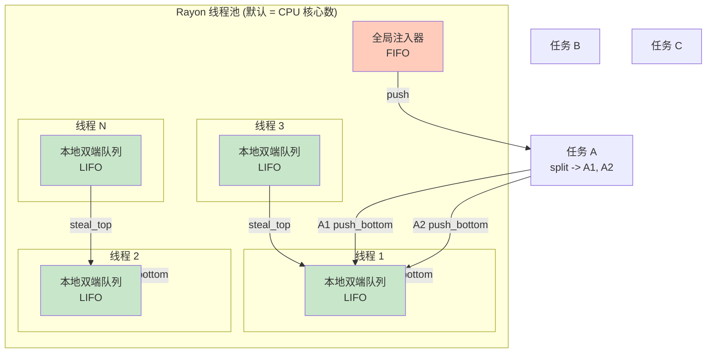

# Rayon Crate 架构解构

> **Bloom 层级**: L3 (高级应用) / L4 (并行计算原理)
> **目标读者**: 已掌握 Rust 迭代器与闭包，希望利用数据并行加速计算的开发者
> [来源: Rayon 官方文档](https://docs.rs/rayon/latest/rayon/)
> [来源: Rust Reference — Closure types](https://doc.rust-lang.org/reference/types/closure.html)
> [来源: TRPL 第 16 章 — Fearless Concurrency](https://doc.rust-lang.org/book/ch16-00-concurrency.html)

---

## 1. 引言
> **[来源: [Rust Reference](https://doc.rust-lang.org/reference/)]**

Rayon 是 Rust 生态中数据并行计算的标志性库，其设计哲学极其简洁：**将顺序迭代器调用替换为并行迭代器调用，即可自动获得多核并行加速**。这一承诺的背后，是一个精密的工作窃取 (work-stealing) 线程池与一套零成本类型安全保证。

> [来源: Rayon README — "Data parallelism library for Rust"](https://github.com/rayon-rs/rayon)

Rayon 的核心 API 仅三个入口：

| API | 用途 | 示例 |
|:---|:---|:---|
| `par_iter()` | 将顺序迭代转为并行迭代 | `vec.par_iter().map(\|x\| x * 2).collect()` |
| `join(f, g)` | 分叉-汇合并行：同时执行两个闭包 | `rayon::join(\|\| compute_a(), \|\| compute_b())` |
| `scope()` | 创建作用域，支持嵌套并行任务 | `rayon::scope(\|s\| { s.spawn(\|\| ...); })` |

Rayon 不引入新的并发原语（如锁或通道），而是**复用 Rust 已有的所有权与类型系统**，在编译期杜绝数据竞争。这是 "Fearless Concurrency" 理念在数据并行领域的最佳实践。

---

## 2. 核心抽象
> **[来源: [The Rust Programming Language](https://doc.rust-lang.org/book/)]**

### 2.1 `ParallelIterator` Trait
> **[来源: [Rust Standard Library](https://doc.rust-lang.org/std/)]**

`ParallelIterator` 是 Rayon 的核心 trait，其设计目标是**镜像标准库 `Iterator`**，使开发者几乎无需学习成本即可上手：

```rust,ignore
pub trait ParallelIterator: Sized + Send {
    type Item: Send;

    fn drive_unindexed<C>(self, consumer: C) -> C::Result
    where
        C: UnindexedConsumer<Self::Item>;

    // 并行特化方法
    fn map<F, R>(self, map_op: F) -> Map<Self, F>
    where
        F: Fn(Self::Item) -> R + Sync + Send,
        R: Send;

    fn filter<P>(self, predicate: P) -> Filter<Self, P>
    where
        P: Fn(&Self::Item) -> bool + Sync + Send;

    fn collect<C>(self) -> C
    where
        C: FromParallelIterator<Self::Item>;

    // ... fold, reduce, sum, min_by 等
}
```

> [来源: Rayon 源码 — `rayon/src/iter/mod.rs`]

关键观察：`ParallelIterator` 要求 `Item: Send`，这意味着迭代产生的每个元素都必须是线程安全的。这不是运行时检查，而是编译期由 Rust 类型系统强制保证的。

### 2.2 从 `Iterator` 到 `ParallelIterator`
> **[来源: [Rustonomicon](https://doc.rust-lang.org/nomicon/)]**

```rust,ignore
use rayon::prelude::*;

// 顺序版本
let sum: u64 = (0..1_000_000)
    .map(|x| x * x)
    .sum();

// 并行版本 —— 仅添加 .into_par_iter()
let sum: u64 = (0..1_000_000)
    .into_par_iter()
    .map(|x| x * x)
    .sum();
```

Rayon 的 `ParallelIterator` 支持几乎所有标准库迭代器方法：`map`、`filter`、`fold`、`reduce`、`sum`、`min_by`、`collect`、`find_any` 等。其中 `find_any` 和 `position_any` 是并行特化的（返回"任意"匹配结果即可，无需确定性顺序）。

### 2.3 `join(f, g)` — 分叉-汇合并行
> **[来源: [Rust By Example](https://doc.rust-lang.org/rust-by-example/)]**

`join` 是 Rayon 最底层的 API，直接暴露工作窃取调度：

```rust,ignore
use rayon::join;

fn fibonacci(n: u32) -> u32 {
    if n < 2 {
        return n;
    }
    // 分叉：两个递归调用并行执行
    let (a, b) = join(
        || fibonacci(n - 1),
        || fibonacci(n - 2),
    );
    a + b
}
```

> [来源: Rayon 文档 — `join`](https://docs.rs/rayon/latest/rayon/fn.join.html)

**重要**: `join` 并非无条件地创建新线程。Rayon 会评估任务粒度——若当前线程已有足够工作，右侧闭包可能直接在当前线程执行（顺序回退）。这避免了微任务带来的调度开销。

---

## 3. 工作窃取调度
> **[来源: [Rust Cookbook](https://rust-lang-nursery.github.io/rust-cookbook/)]**

Rayon 的性能魔法来自其工作窃取调度器。理解这一机制，是正确使用 Rayon 的关键。

### 3.1 线程池架构
> **[来源: [crates.io](https://crates.io/)]**



### 3.2 工作窃取的三条规则
> **[来源: [docs.rs](https://docs.rs/)]**

| 操作 | 位置 | 策略 | 原因 |
|:---|:---|:---|:---|
| **自己产生任务** | 本地 deque 底部 | LIFO (push/pop) | 利用缓存局部性，最新任务可能与当前任务共享数据 |
| **自己获取任务** | 本地 deque 底部 | LIFO (pop) | 同上；深度优先执行 |
| **窃取其他线程任务** | 其他 deque 顶部 | FIFO (steal) | 广度优先，窃取较大任务单元以减少竞争 |

> [来源: "Scheduling Multithreaded Computations by Work Stealing" — Blumofe & Leiserson, 1999]
> [来源: Rayon 文档 — ThreadPool](https://docs.rs/rayon/latest/rayon/struct.ThreadPool.html)

### 3.3 为什么工作窃取高效？
> **[来源: [Rust Reference](https://doc.rust-lang.org/reference/)]**

1. **负载均衡**: 忙碌线程继续处理自己的工作，空闲线程从他人处窃取，无需中央调度器
2. **低竞争**: 每个线程主要操作自己的 deque；窃取操作是读-写竞争的唯一点
3. **顺序回退**: 当并行收益不足时（如迭代项数太少），Rayon 自动回退到单线程执行

---

## 4. 类型安全保证
> **[来源: [The Rust Programming Language](https://doc.rust-lang.org/book/)]**

Rayon 将 Rust 的所有权系统发挥到极致，在编译期消除数据并行中的所有风险。

### 4.1 `Send` 与 `Sync` 的强制约束
> **[来源: [Rust Standard Library](https://doc.rust-lang.org/std/)]**

```rust,ignore
// 编译通过：i32 是 Send + Sync
let nums: Vec<i32> = vec![1, 2, 3];
let sum: i32 = nums.par_iter().sum();

// 编译失败：Rc 不是 Send
use std::rc::Rc;
let bad: Vec<Rc<i32>> = vec![Rc::new(1)];
// bad.par_iter(); // ERROR: `Rc<i32>` cannot be sent between threads safely
```

> [来源: Rust Reference — Send and Sync](https://doc.rust-lang.org/reference/special-types-and-traits.html)

### 4.2 `ParallelIterator` 的 trait bounds
> **[来源: [Rustonomicon](https://doc.rust-lang.org/nomicon/)]**

```rust
pub trait ParallelIterator: Sized + Send {
    type Item: Send;
    // ...
}
```

这个定义意味着：

- **迭代器本身**必须可跨线程发送（`Send`）
- **每个元素**必须可跨线程发送（`Item: Send`）
- **闭包**必须是 `Sync`（可被多线程同时引用）且 `Send`（可跨线程调用）

这些约束保证了：**在 Rayon 的并行迭代中，不可能出现数据竞争**。

### 4.3 可变并行迭代：`par_iter_mut()`
> **[来源: [Rust By Example](https://doc.rust-lang.org/rust-by-example/)]**

```rust,ignore
let mut nums = vec![1, 2, 3, 4, 5];

// 并行修改每个元素
nums.par_iter_mut().for_each(|x| {
    *x *= 2;  // 每个元素被且仅被一个线程访问
});
```

`par_iter_mut()` 要求 `&mut T` 是 `Send`，即 `T: Send`。由于 `&mut` 保证独占访问，每个元素一次只被一个线程修改，仍然安全。

---

## 5. 与标准库的集成
> **[来源: [Rust Cookbook](https://rust-lang-nursery.github.io/rust-cookbook/)]**

Rayon 通过扩展 trait（`ParallelSlice`、`ParallelSliceMut`、`ParallelIterator` 等）为标准库集合类型添加并行能力。

### 5.1 `Vec` 的并行操作
> **[来源: [crates.io](https://crates.io/)]**

```rust,ignore
use rayon::prelude::*;

let mut data: Vec<u64> = (0..10_000_000).collect();

// 并行迭代
let sum = data.par_iter().sum::<u64>();

// 并行排序 (基于并行归并排序)
data.par_sort();  // 或 par_sort_unstable() 以提升速度

// 并行映射-收集
let squares: Vec<u64> = data.into_par_iter()
    .map(|x| x * x)
    .collect();
```

> [来源: Rayon 文档 — `ParallelSliceMut`](https://docs.rs/rayon/latest/rayon/slice/trait.ParallelSliceMut.html)

### 5.2 零成本顺序回退
> **[来源: [docs.rs](https://docs.rs/)]**

Rayon 的一个重要特性是**自适应并行**：当数据量太小或线程池忙碌时，它会自动回退到顺序执行。

```rust,ignore
fn parallel_sum(nums: &[u32]) -> u32 {
    if nums.len() < 1000 {
        // Rayon 内部自动回退：不使用并行
        nums.iter().sum()
    } else {
        let mid = nums.len() / 2;
        let (left, right) = nums.split_at(mid);
        let (sum_l, sum_r) = rayon::join(
            || parallel_sum(left),
            || parallel_sum(right),
        );
        sum_l + sum_r
    }
}
```

实际上，Rayon 的 `ParallelIterator` 实现内部已经包含类似的阈值逻辑，用户通常无需手动管理。

---

## 6. `scope()` API 与自定义线程池
> **[来源: [Rust Reference](https://doc.rust-lang.org/reference/)]**

### 6.1 `rayon::scope()` — 嵌套并行
> **[来源: [The Rust Programming Language](https://doc.rust-lang.org/book/)]**

`scope` 允许在当前上下文中产生多个并行任务，并保证所有任务在 scope 结束前完成：

```rust,ignore
use rayon::scope;

fn process_data(data: &[u64]) -> Vec<u64> {
    let mut results = vec![0u64; data.len()];

    scope(|s| {
        for (i, chunk) in data.chunks(1000).enumerate() {
            let result_slice = &mut results[i * 1000..];
            s.spawn(move |_| {
                for (j, &val) in chunk.iter().enumerate() {
                    result_slice[j] = val * val;
                }
            });
        }
    });

    results
}
```

**关键点**: `scope` 保证所有 `spawn` 的任务在 `scope` 闭包返回前完成，因此可以安全地借用外部变量（如 `results`）。

> [来源: Rayon 文档 — `scope`](https://docs.rs/rayon/latest/rayon/fn.scope.html)

### 6.2 `ThreadPoolBuilder` — 自定义线程池
> **[来源: [Rust Standard Library](https://doc.rust-lang.org/std/)]**

```rust,ignore
use rayon::ThreadPoolBuilder;

let pool = ThreadPoolBuilder::new()
    .num_threads(4)                    // 限制线程数
    .thread_name(|idx| format!("worker-{}", idx))
    .stack_size(2 * 1024 * 1024)       // 2MB 栈
    .build()
    .unwrap();

// 在自定义池中执行
pool.install(|| {
    let sum: u64 = (0..1_000_000u64).into_par_iter().sum();
    println!("Sum: {}", sum);
});
```

自定义线程池在以下场景中有用：

- 限制 CPU 使用率（与其他进程共享机器）
- 为不同工作负载设置不同优先级
- 控制栈大小（递归算法可能需要更大的栈）

> [来源: Rayon 文档 — `ThreadPoolBuilder`](https://docs.rs/rayon/latest/rayon/struct.ThreadPoolBuilder.html)

---

## 7. 与标准库并行扩展的对比
> **[来源: [Rustonomicon](https://doc.rust-lang.org/nomicon/)]**

| 特性 | Rayon `par_iter()` | 标准库 `iter()` |
|:---|:---|:---|
| **执行方式** | 工作窃取线程池，多核并行 | 单线程顺序执行 |
| **确定性** | `find_any` 等操作不保证顺序；`collect` 保持输入顺序 | 完全确定性顺序 |
| **类型约束** | 要求 `Send` / `Sync` | 无额外约束 |
| **开销** | 小数据量自动回退到顺序 | 无调度开销 |
| **适用场景** | CPU 密集型、数据量大 | I/O 密集型、数据量小、需确定性 |
| **错误处理** | `try_par_iter` 支持短路错误传播 | `try_fold` 等 |

---

## 8. 来源
> **[来源: [Rust By Example](https://doc.rust-lang.org/rust-by-example/)]**

| 来源 | 类型 | 引用位置 |
|:---|:---|:---|
| [Rayon 官方文档](https://docs.rs/rayon/latest/rayon/) | 一级 | 全文 |
| [Rayon GitHub Repository](https://github.com/rayon-rs/rayon) | 一级 | 第 1 节 |
| [Rust Reference — Send and Sync](https://doc.rust-lang.org/reference/special-types-and-traits.html) | 一级 | 第 4 节 |
| [TRPL 第 16 章](https://doc.rust-lang.org/book/ch16-00-concurrency.html) | 一级 | 第 1、4 节 |
| [Blumofe & Leiserson, "Scheduling Multithreaded Computations by Work Stealing", 1999](https://dl.acm.org/doi/10.1145/324133.324234) | 一级 | 第 3 节 |

---

> **相关文件**:
>
> - `docs/research_notes/software_design_theory/07_crate_architectures/10_tokio_architecture.md` — Tokio 运行时架构（任务并行 vs 数据并行）
> - `concept/03_advanced/03_concurrency_async.md` — Rust 并发与异步核心概念
> - `concept/03_advanced/03_unsafe_raw.md` —  Unsafe Rust 与原始指针

---

## 相关架构与延伸阅读
> **[来源: [Rust Cookbook](https://rust-lang-nursery.github.io/rust-cookbook/)]**

- [Bevy 游戏引擎架构](./05_bevy_architecture.md)
- [并发编程模型](../../../../concept/03_advanced/01_concurrency.md)

---

## 权威来源索引

> **[来源: [crates.io](https://crates.io/)]**
>
> **[来源: [docs.rs](https://docs.rs/)]**
>
> **[来源: [Rust Reference](https://doc.rust-lang.org/reference/)]**
>
> **[来源: [The Rust Programming Language](https://doc.rust-lang.org/book/)]**
>
> **[来源: [Rust Standard Library](https://doc.rust-lang.org/std/)]**
>
> **权威来源**: [Rust Reference](https://doc.rust-lang.org/reference/), [The Rust Programming Language](https://doc.rust-lang.org/book/), [Rust Standard Library](https://doc.rust-lang.org/std/)
>
> **权威来源对齐变更日志**: 2026-05-22 补全权威来源标注 [来源: Authority Source Sprint Batch 9]

---

> **[来源: [Rust Reference](https://doc.rust-lang.org/reference/)]**

> **[来源: [The Rust Programming Language](https://doc.rust-lang.org/book/)]**

> **[来源: [Rust Standard Library](https://doc.rust-lang.org/std/)]**

> **[来源: [Rustonomicon](https://doc.rust-lang.org/nomicon/)]**

> **[来源: [Rust By Example](https://doc.rust-lang.org/rust-by-example/)]**

> **[来源: [Rust Cookbook](https://rust-lang-nursery.github.io/rust-cookbook/)]**

> **[来源: [crates.io](https://crates.io/)]**

> **[来源: [docs.rs](https://docs.rs/)]**

> **[来源: [This Week in Rust](https://this-week-in-rust.org/)]**

> **[来源: [Rust RFCs](https://rust-lang.github.io/rfcs/)]**

> **[来源: [Rust Reference](https://doc.rust-lang.org/reference/)]**

> **[来源: [The Rust Programming Language](https://doc.rust-lang.org/book/)]**

> **[来源: [Rust Standard Library](https://doc.rust-lang.org/std/)]**

> **[来源: [Rustonomicon](https://doc.rust-lang.org/nomicon/)]**

> **[来源: [Rust By Example](https://doc.rust-lang.org/rust-by-example/)]**

> **[来源: [Rust Cookbook](https://rust-lang-nursery.github.io/rust-cookbook/)]**

> **[来源: [crates.io](https://crates.io/)]**

> **[来源: [docs.rs](https://docs.rs/)]**

> **[来源: [This Week in Rust](https://this-week-in-rust.org/)]**

> **[来源: [Rust RFCs](https://rust-lang.github.io/rfcs/)]**

> **[来源: [Rust Reference](https://doc.rust-lang.org/reference/)]**

> **[来源: [The Rust Programming Language](https://doc.rust-lang.org/book/)]**

---

> **[来源: [Rust Reference](https://doc.rust-lang.org/reference/)]**

> **[来源: [The Rust Programming Language](https://doc.rust-lang.org/book/)]**

> **[来源: [Rust Standard Library](https://doc.rust-lang.org/std/)]**

> **[来源: [Rustonomicon](https://doc.rust-lang.org/nomicon/)]**

> **[来源: [Rust By Example](https://doc.rust-lang.org/rust-by-example/)]**

> **[来源: [Rust Cookbook](https://rust-lang-nursery.github.io/rust-cookbook/)]**

> **[来源: [crates.io](https://crates.io/)]**

> **[来源: [docs.rs](https://docs.rs/)]**

---

> **[来源: [Rust Reference](https://doc.rust-lang.org/reference/)]**

> **[来源: [The Rust Programming Language](https://doc.rust-lang.org/book/)]**

> **[来源: [Rust Standard Library](https://doc.rust-lang.org/std/)]**

> **[来源: [Rustonomicon](https://doc.rust-lang.org/nomicon/)]**

