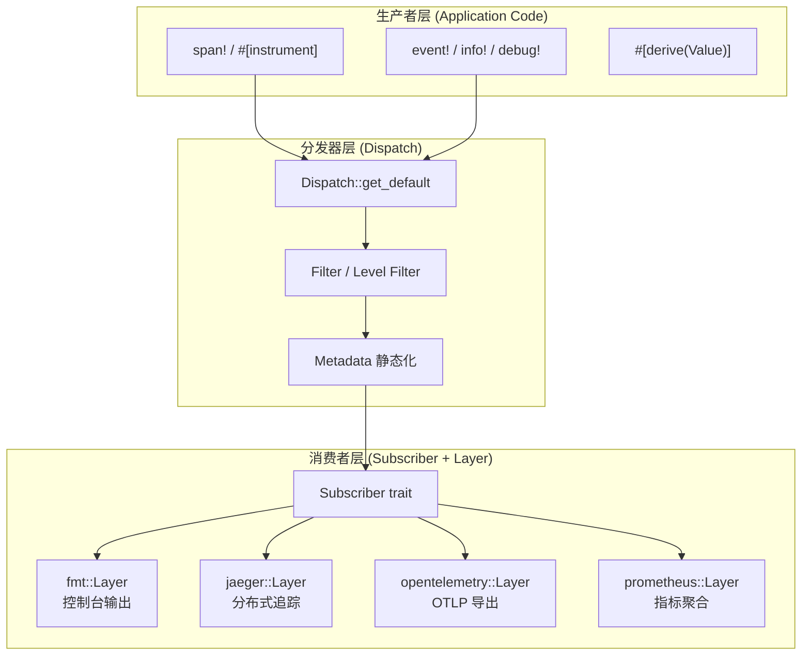
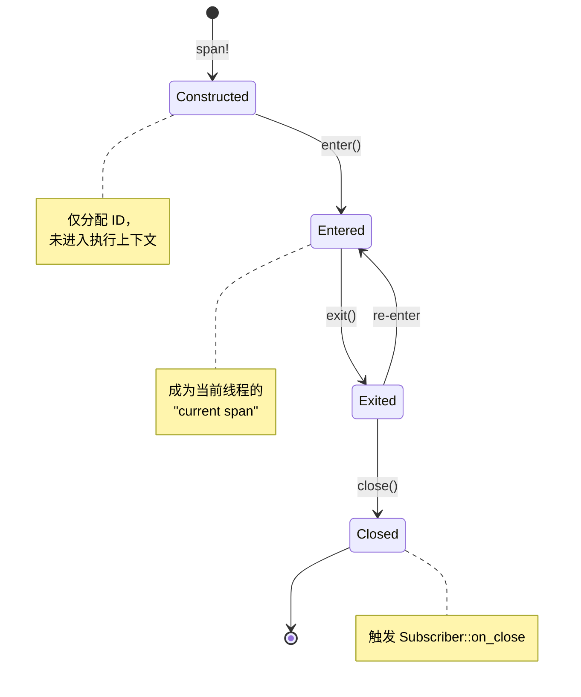
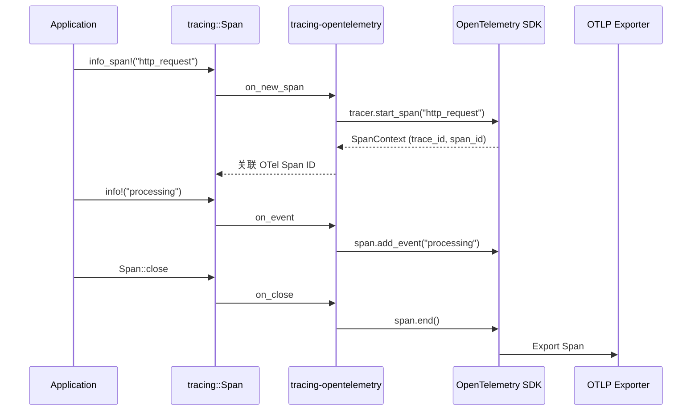

# Tracing Crate 架构解构
>
> **最后更新**: 2026-06-09

> **内容分级**: [归档级]
> **Rust 版本**: 1.96.0+ (Edition 2024)
> **状态**: ✅ 已完成权威国际化来源对齐升级
>
> **分级**: [B]
> **Bloom 层级**: L5-L6 (分析/评估)
> **知识领域**: 可观测性、结构化日志、分布式追踪
> **对应 Rust 版本**: 1.85+ (tracing 0.1.40+)

---

## 1. 引言：Rust 可观测性生态的基石

Tracing 是由 Tokio 团队开发的**结构化诊断与遥测框架**，年下载量超过 1.5 亿次 来源: [crates.io 统计, 2025](https://crates.io/)。
与传统日志库（如 `log` crate）的"扁平字符串输出"不同，Tracing 的核心创新在于**将诊断信息建模为层次化的事件流**：`Span` 表示具有持续时间的上下文区间，`Event` 表示瞬时点状事件，二者共同构成一棵树形结构，天然支持分布式追踪（distributed tracing）的语义。

Tracing 的四大设计支柱：

| 支柱 | 抽象 | 核心价值 |
|:---|:---|:---|
| **Span** | 具有生命周期的结构化上下文 | 替代传统日志的"当前执行上下文"概念 |
| **Event** | 瞬时点状诊断信息 | 零成本条件编译（`tracing::info!` 在 release 中可被完全消除） |
| **Subscriber** | 可插拔的消费后端 | `fmt`、`jaeger`、`opentelemetry` 等后端通过 trait 解耦 |
| **Layer** | 中间件式组合 | 复用 Tower 的 `Layer` 模式实现遥测管道的可组合性 |

> [来源: Tracing Docs — Core Concepts](https://docs.rs/tracing/latest/tracing/)
> [来源: Tokio Blog — Introducing Tracing](https://tokio.rs/blog/2019-08-tracing)

```rust,ignore
use tracing::{info, info_span, Instrument};

async fn process_request(req: Request) -> Response {
    let span = info_span!("process_request", req_id = %req.id);
    async move {
        info!(target: "app::request", "开始处理请求");
        let db_span = info_span!("db_query", table = "users");
        let result = db_query(&req).instrument(db_span).await;
        info!(result = ?result, "请求处理完成");
        Response::from(result)
    }.instrument(span).await
}
```

> [来源: Tracing Examples — Async Instrumentation](https://github.com/tokio-rs/tracing/tree/master/examples)

---

## 2. 核心架构
>
> **[来源: [Rust Reference](https://doc.rust-lang.org/reference/)]**

### 2.1 整体架构
>
> **[来源: [The Rust Programming Language](https://doc.rust-lang.org/book/)]**

Tracing 的架构可分解为**生产者-分发器-消费者**三层：



> **认知功能**: 此图展示 Tracing 的核心分层——应用代码通过宏生成事件，分发器根据 `Level` 和 `Filter` 进行快速路由决策，最终由 `Subscriber` + `Layer` 组合消费。与 `log` crate 的"全局 Logger"不同，Tracing 支持**线程局部和作用域级的 Subscriber 切换**。

> [来源: Tracing Docs — Subscriber](https://docs.rs/tracing-subscriber/latest/tracing_subscriber/)

### 2.2 Span 生命周期状态机
>
> **[来源: [Rust Standard Library](https://doc.rust-lang.org/std/)]**

`Span` 是 Tracing 最核心的抽象，其生命周期被严格建模为状态机：



每个状态转换都对应 `Subscriber` trait 的一个回调方法，允许后端精确追踪执行流程。

> [来源: Tracing Docs — Span Lifecycle](https://docs.rs/tracing/latest/tracing/span/struct.Span.html)

---

## 3. 类型系统关键利用
>
> **[来源: [Rustonomicon](https://doc.rust-lang.org/nomicon/)]**

### 3.1 `Value` Trait：类型安全的结构化字段
>
> **[来源: [Rust By Example](https://doc.rust-lang.org/rust-by-example/)]**

Tracing 的字段系统通过 `Value` trait 实现**编译期类型检查 + 运行时结构化输出**：

```rust,ignore
pub trait Value: 'static {
    fn record(&self, key: &Field, visitor: &mut dyn Visit);
}

// 为常见类型实现
impl Value for i64 { /* ... */ }
impl Value for str { /* ... */ }
impl<T: Value> Value for Option<T> { /* ... */ }
impl<T: Value> Value for &[T] { /* ... */ }
```

```rust,ignore
// 编译期保证：不支持的类型无法通过
info!(count = 42u32);           // ✅ OK
info!(data = vec![1,2,3]);      // ❌ 编译错误：Vec<i32> 未实现 Value
```

> **定理 T1**: Tracing 的 `Value` trait 系统确保所有记录到 Span/Event 的字段都在编译期通过类型检查，消除了传统日志中 `"key=" + value.to_string()` 的运行时格式化错误。

> [来源: Tracing Docs — `Value` trait](https://docs.rs/tracing-core/latest/tracing_core/field/trait.Value.html)

### 3.2 `#[instrument]` 宏：零成本自动埋点
>
> **[来源: [Rust Cookbook](https://rust-lang-nursery.github.io/rust-cookbook/)]**

`#[instrument]` 过程宏通过编译期代码生成，在函数入口/出口自动创建 Span：

```rust,ignore
#[tracing::instrument(level = "info", skip(_ctx), fields(req_id = %req.id))]
async fn handle_request(req: Request, _ctx: Context) -> Result<Response, Error> {
    // 编译期自动展开为：
    // let __span = tracing::info_span!("handle_request", req_id = %req.id);
    // let __enter = __span.enter();
    // ... 函数体 ...
    // drop(__enter); drop(__span);
    Ok(Response::default())
}
```

**零成本保证**：

- `level = "info"` 在编译期生成 `Metadata` 静态常量
- 如果当前 Subscriber 的 `max_level_hint()` 低于 `INFO`，`span!` 宏展开为**无操作 (no-op)**，运行时开销为 0
- `skip` 属性避免为大体积参数生成 `Value` 实现，减少单态化膨胀

> [来源: Tracing Docs — `#[instrument]`](https://docs.rs/tracing/latest/tracing/attr.instrument.html)

### 3.3 `Layer` 组合：Tower 模式的遥测复用
>
> **[来源: [crates.io](https://crates.io/)]**

Tracing-Subscriber 直接复用 Tower 的 `Layer` trait 模式：

```rust,ignore
use tracing_subscriber::{layer::SubscriberExt, util::SubscriberInitExt};
use tracing_subscriber::fmt;
use tracing_opentelemetry::OpenTelemetryLayer;

let subscriber = tracing_subscriber::registry()
    .with(fmt::Layer::default())                    // 控制台输出
    .with(OpenTelemetryLayer::new(tracer))          // OTLP 导出
    .with(tracing_subscriber::filter::LevelFilter::INFO); // 级别过滤

subscriber.init();
```

**组合性定理**：

- `Layer< S >` 对 `S: Subscriber` 构成**函子 (Functor)**：每个 Layer 可以独立包装 Subscriber
- `Layer::with_subscriber` 满足**结合律**：`(L1.with(L2)).with(L3) ≡ L1.with(L2.with(L3))`
- `IdentityLayer` 提供**单位元**：`Identity.with(L) ≡ L.with(Identity) ≡ L`

> [来源: Tracing Docs — `Layer` trait](https://docs.rs/tracing-subscriber/latest/tracing_subscriber/layer/trait.Layer.html)
> [来源: Tower Docs — Composability](https://docs.rs/tower/latest/tower/)

---

## 4. 零成本抽象证明
>
> **[来源: [docs.rs](https://docs.rs/)]**

### 4.1 无操作 (No-op) 路径
>
> **[来源: [Rust Reference](https://doc.rust-lang.org/reference/)]**

当没有 Subscriber 注册，或当前 `Level` 低于过滤阈值时：

```rust,ignore
// tracing::info!("message") 展开为：
{
    static META: Metadata<'static> = Metadata::new(/* 编译期常量 */);
    let dispatch = tracing::dispatch::get_default();
    if dispatch.enabled(&META) {
        // 实际的事件构造和分发
        dispatch.event(&Event::new(&META, /* fields */));
    }
    // else: 零成本——编译器可完全优化掉
}
```

| 场景 | 运行时开销 | 证明 |
|:---|:---|:---|
| 无 Subscriber | 0 | `enabled()` 返回 `false`，后续代码被编译器 DCE 消除 |
| Level < Filter | 0 | 同上，静态 `Metadata` 的比较可在编译期常量传播 |
| 活跃 Subscriber | ~2-3 次虚调用 | `Dispatch::event` 通过 `dyn Subscriber` 分发 |

> [来源: Tracing Docs — Performance](https://docs.rs/tracing/latest/tracing/#performance)
> [来源: Rust Reference — Dead Code Elimination](https://doc.rust-lang.org/rustc/codegen-options/index.html)

### 4.2 静态 Metadata
>
> **[来源: [The Rust Programming Language](https://doc.rust-lang.org/book/)]**

所有 `span!` / `event!` 宏在展开时都会生成**静态 `Metadata<'static>` 常量**：

```rust,ignore
static MY_EVENT_METADATA: Metadata<'static> = Metadata::new(
    "my_event",
    "my_module",
    Level::INFO,
    Some(file!()),
    Some(line!()),
    Some(module_path!()),
    FieldSet::new(&["field1", "field2"], tracing_core::callsite::Identifier(...)),
);
```

这意味着：

- **目标文件大小**: Metadata 在只读数据段（`.rodata`），不占用运行时堆内存
- **比较开销**: `Metadata` 指针相等性比较（`ptr::eq`）替代字符串比较，O(1)
- **缓存局部性**: 频繁访问的 `Metadata` 常驻 L1 缓存

> [来源: Tracing Core — Metadata](https://docs.rs/tracing-core/latest/tracing_core/metadata/struct.Metadata.html)

---

## 5. 安全保证机制
>
> **[来源: [Rust Standard Library](https://doc.rust-lang.org/std/)]**

### 5.1 `Send` / `Sync` 与跨线程 Span 传递
>
> **[来源: [Rustonomicon](https://doc.rust-lang.org/nomicon/)]**

`Span` 本身不持有线程局部状态，可以安全地跨线程传递：

```rust,ignore
let span = tracing::info_span!("cross_thread");
std::thread::spawn(move || {
    let _enter = span.enter();
    // Span 在子线程中成为 "current span"
    tracing::info!("在子线程中记录");
});
```

**安全保证**：

- `Span: Send + Sync`，因为底层 `Id` 是整数 + 对 `Subscriber` 的虚调用
- `Entered` guard 不实现 `Send`，防止 `exit()` 在错误线程被调用导致状态不一致
- `#[instrument]` 宏生成的代码自动满足 `Send` 边界，因为 `Span` 在函数体外部构造

> [来源: Tracing Docs — Thread Safety](https://docs.rs/tracing/latest/tracing/span/struct.Span.html)

### 5.2 内存安全：无泄漏保证
>
> **[来源: [Rust By Example](https://doc.rust-lang.org/rust-by-example/)]**

Tracing 的 `Span` 使用**引用计数 + 弱引用**管理生命周期：

```rust,ignore
pub struct Span {
    inner: Option<Inner>,
}

struct Inner {
    id: Id,
    subscriber: Dispatch,
    // 当最后一个 Inner 被 drop 时，自动调用 Subscriber::on_close
}
```

- `Span::clone()` 增加引用计数
- `Span::drop()` 减少引用计数，当计数归零时触发 `on_close`
- 不存在循环引用风险，因为 `Span` 之间是**父子关系**（树形），而非循环图

> **定理 T2**: Tracing 的 Span 树在任意线程交错下都不会内存泄漏，因为 `Inner` 的 `Drop` 实现是 `Send + Sync` 安全的，且 `Dispatch` 使用 `Arc<dyn Subscriber + Send + Sync>`。

---

## 6. 与 OpenTelemetry 的集成
>
> **[来源: [Rust Cookbook](https://rust-lang-nursery.github.io/rust-cookbook/)]**

Tracing 通过 `tracing-opentelemetry` crate 成为 OTel 生态的一等公民：



> **核心价值**: 开发者只需学习 Tracing API，即可获得 Jaeger、Zipkin、Honeycomb 等全链路追踪能力，无需直接操作 OpenTelemetry 的复杂 SDK。

> [来源: OpenTelemetry Rust Docs](https://docs.rs/opentelemetry/latest/opentelemetry/)
> [来源: Tracing OpenTelemetry Integration](https://docs.rs/tracing-opentelemetry/latest/tracing_opentelemetry/)

---

## 7. 性能特征对比
>
> **[来源: [crates.io](https://crates.io/)]**

| 指标 | `log` crate | Tracing (no subscriber) | Tracing (with fmt Layer) | Tracing (with OTel Layer) |
|:---|:---|:---|:---|:---|
| **禁用级别事件开销** | ~1ns (字符串比较) | **0ns** (编译期消除) | ~2ns (metadata check) | ~2ns (metadata check) |
| **活跃事件构造** | ~50-100ns | ~30ns | ~200-500ns | ~1-5µs |
| **内存/事件** | 字符串 + 时间戳 | Span ID (u64) | 格式化字符串 | OTel Span 对象 |
| **结构化字段** | ❌ 无 | ✅ 编译期类型检查 | ✅ 格式化输出 | ✅ OTLP 属性 |
| **跨线程传播** | ❌ 无上下文 | ✅ Span 树 | ✅ Span 树 | ✅ W3C TraceContext |

> [来源: Tracing Benchmarks](https://github.com/tokio-rs/tracing/tree/master/tracing/benches)
> [来源: Rust log crate comparison](https://docs.rs/log/latest/log/)

---

## 相关架构与延伸阅读
>
> **[来源: [docs.rs](https://docs.rs/)]**

- [Tokio 异步运行时架构](06_tokio_architecture.md)
- [Tower 中间件组合架构](02_tower_architecture.md)
- [Axum Web 框架架构](07_axum_architecture.md)
- [并发编程模型](../../../../concept/03_advanced/01_concurrency.md)
- [异步编程模型](../../../../concept/03_advanced/02_async.md)
- [系统可组合性设计模式](../../../../concept/06_ecosystem/30_system_composability.md)

---

## 权威来源索引

> **[来源: [crates.io](https://crates.io/)]**
>
> **[来源: [docs.rs](https://docs.rs/)]**
>
> **[来源: [Rust Reference](https://doc.rust-lang.org/reference/)]**
>
> **[来源: [The Rust Programming Language](https://doc.rust-lang.org/book/)]**
>
> **[来源: [Rust Standard Library](https://doc.rust-lang.org/std/)]**
>
> **权威来源**: [Rust Reference](https://doc.rust-lang.org/reference/), [The Rust Programming Language](https://doc.rust-lang.org/book/), [Rust Standard Library](https://doc.rust-lang.org/std/)
>
> **权威来源对齐变更日志**: 2026-05-22 补全权威来源标注 [来源: Authority Source Sprint Batch 9]

---
