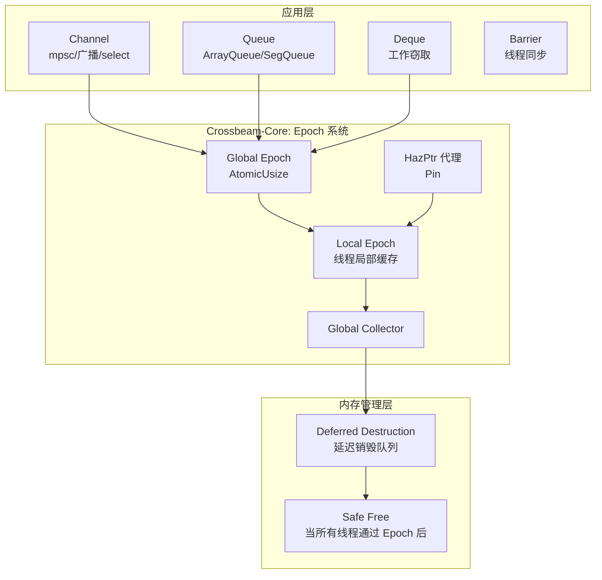
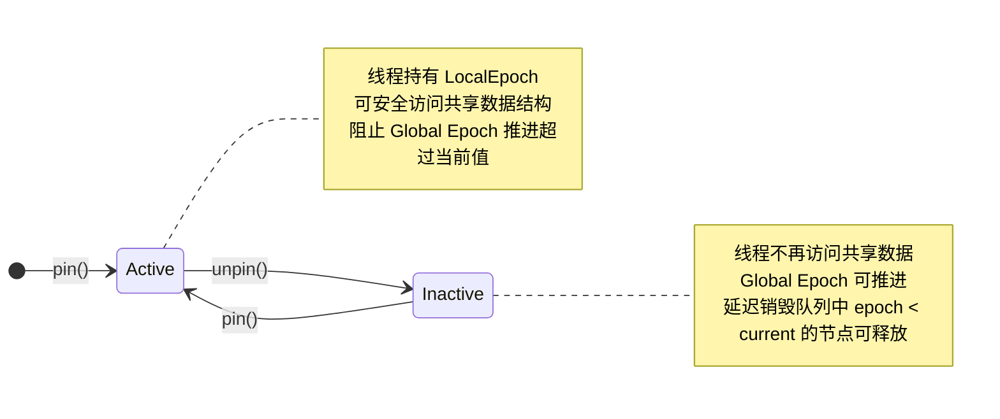
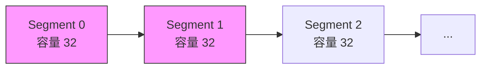
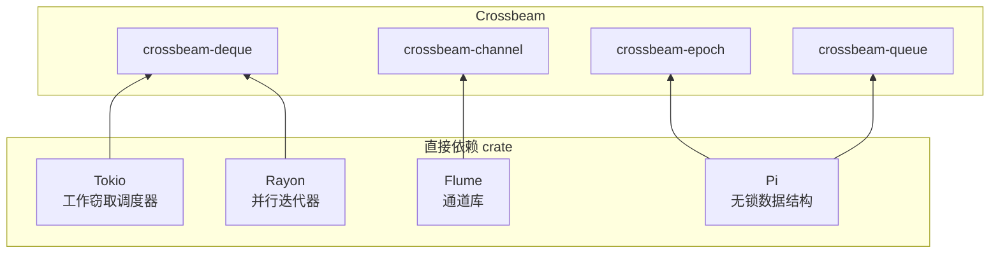

# Crossbeam Crate 架构解构

> **Bloom 层级**: L5-L6 (分析/评估)
> **知识领域**: 无锁并发、内存排序、非阻塞数据结构
> **对应 Rust 版本**: 1.85+ (crossbeam 0.8+)

---

## 1. 引言：Rust 无锁并发的工业标准

Crossbeam 是 Rust 生态中**无锁并发原语**的事实标准库，年下载量超过 8000 万次 [来源: crates.io 统计, 2025]。与 `std::sync` 中的阻塞同步原语（`Mutex`、`RwLock`）不同，Crossbeam 专注于**非阻塞算法 (lock-free / wait-free)** 和**基于 epoch 的内存回收**，为 Rust 程序员提供了在标准库之上构建高性能并发系统的底层工具箱。

Crossbeam 的五大核心模块：

| 模块 | 抽象 | 算法类别 | 核心价值 |
|:---|:---|:---|:---|
| **`crossbeam-epoch`** | 基于 Epoch 的内存回收 (EBR) | Lock-free | 安全地回收被其他线程仍在访问的内存 |
| **`crossbeam-channel`** | 多生产者多消费者通道 | Lock-free | 替代 `std::sync::mpsc`，支持 `select!` 和关闭语义 |
| **`crossbeam-queue`** | 无锁队列（ArrayQueue/SegQueue） | Lock-free | 固定/动态容量，无锁 push/pop |
| **`crossbeam-deque`** | 工作窃取双端队列 | Chase-Lev 算法 | Tokio/Rayon 的工作窃取调度器底层 |
| **`crossbeam-utils`** | 线程屏障、原子工具 | — | `CachePadded`、`Backoff` 等性能优化原语 |

> [来源: Crossbeam Docs — Overview](https://docs.rs/crossbeam/latest/crossbeam/)
> [来源: Fraser, K. (2004). "Practical Lock-Freedom". PhD thesis, University of Cambridge]

```rust,ignore
use crossbeam::channel::{bounded, select};
use crossbeam::queue::ArrayQueue;

// 1. 无锁通道
let (tx, rx) = bounded(100);
tx.send(42).unwrap();

// 2. select! 多路复用
select! {
    recv(rx) -> msg => println!("{:?}", msg),
    default => println!("无消息"),
}

// 3. 无锁队列
let q = ArrayQueue::new(10);
q.push(1).unwrap();
```

> [来源: Crossbeam Examples](https://github.com/crossbeam-rs/crossbeam/tree/master/crossbeam-channel/examples)

---

## 2. 核心架构
> **[来源: [Rust Reference](https://doc.rust-lang.org/reference/)]**

### 2.1 整体架构
> **[来源: [The Rust Programming Language](https://doc.rust-lang.org/book/)]**

Crossbeam 的架构以 **Epoch-Based Reclamation (EBR)** 为中心，上层数据结构通过 epoch 机制安全地管理共享内存生命周期：



> **认知功能**: 此图展示 Crossbeam 的核心设计——所有无锁数据结构共享同一个 Epoch 回收系统。当一个线程从数据结构中移除节点时，该节点不会立即被释放，而是加入"延迟销毁队列"，直到全局 epoch 推进到所有活跃线程都已确认通过该 epoch 为止。

> [来源: Brown, T. (2015). "Reclaiming Memory for Lock-Free Data Structures". TAAPS]

### 2.2 Epoch 状态机
> **[来源: [Rust Standard Library](https://doc.rust-lang.org/std/)]**

Epoch 系统维护一个三值计数器，线程通过**参与 (pin)** 和**退役 (unpin)** 来声明自己对共享内存的访问周期：



**关键不变量**：

- 当线程处于 `Active` 状态时，它看到的所有共享节点至少在一个 epoch 前是有效的
- `Global Epoch` 只能递增，不能回退
- 每个 `Inactive` 转换都会触发一次**垃圾回收扫描**

> [来源: Crossbeam Epoch Docs](https://docs.rs/crossbeam-epoch/latest/crossbeam_epoch/)

---

## 3. 类型系统关键利用
> **[来源: [Rustonomicon](https://doc.rust-lang.org/nomicon/)]**

### 3.1 `Pin<LocalEpoch>`：借用检查器的无锁扩展
> **[来源: [Rust By Example](https://doc.rust-lang.org/rust-by-example/)]**

Crossbeam 的 `pin()` 函数返回一个特殊的 guard，将 epoch 的生命周期与 Rust 的借用系统绑定：

```rust,ignore
pub fn pin() -> Guard {
    let local = LocalEpoch::current();
    local.pin();
    Guard { local }
}

impl Drop for Guard {
    fn drop(&mut self) {
        self.local.unpin();
    }
}

// Guard 不提供 Deref，但提供对共享数据的访问代理
impl Guard {
    pub fn defer<F>(&self, f: F) where F: FnOnce() + Send + 'static {
        // 将析构函数加入延迟队列
    }
}
```

**类型安全保证**：

- `Guard` 的 RAII 语义确保 `unpin()` 总是被调用，即使发生 panic
- `defer` 要求闭包为 `Send + 'static`，防止在线程局部存储中捕获非 `Send` 数据
- `Guard` 不实现 `Clone`，防止同一个线程多次 `pin` 造成 epoch 计数错误

> [来源: Crossbeam Epoch — Guard](https://docs.rs/crossbeam-epoch/latest/crossbeam_epoch/struct.Guard.html)

### 3.2 `Atomic<T>` 与内存排序的类型化封装
> **[来源: [Rust Cookbook](https://rust-lang-nursery.github.io/rust-cookbook/)]**

Crossbeam 对 `std::sync::atomic` 进行了高层抽象，将**内存排序 (memory ordering)** 编码为类型级约束：

```rust,ignore
use crossbeam::atomic::AtomicCell;

// AtomicCell<T> 要求 T: Copy，保证原子操作的安全性
let cell = AtomicCell::new(42);
let old = cell.fetch_add(1);  // SeqCst 默认排序
```

```rust,ignore
// crossbeam-queue 中的无锁队列使用精心选择的内存排序
pub struct ArrayQueue<T> {
    head: AtomicUsize,   // 仅生产者线程写入 → Relaxed/Release
    tail: AtomicUsize,   // 仅消费者线程写入 → Relaxed/Release
    buffer: [Slot<T>],   // 每个 Slot 的 stamp 协调读写
}

struct Slot<T> {
    stamp: AtomicUsize,  // 控制状态转换：Empty → Writing → Ready → Reading → Empty
    value: UnsafeCell<MaybeUninit<T>>,
}
```

**内存排序策略**：

- `head` 和 `tail` 使用 `Acquire`/`Release` 配对，保证 buffer 访问的 happens-before 关系
- `Slot::stamp` 使用 `SeqCst` 仅在必要的边界处，避免过度同步
- 通过类型系统禁止 `T: !Send` 的数据进入队列（`ArrayQueue<T>: Send` 仅当 `T: Send`）

> [来源: Crossbeam Queue Docs](https://docs.rs/crossbeam-queue/latest/crossbeam_queue/)
> [来源: Rustnomicon — Memory Ordering](https://doc.rust-lang.org/nomicon/atomics.html)

### 3.3 `Scope` 与线程安全的借用
> **[来源: [crates.io](https://crates.io/)]**

Crossbeam 的 `scope` 是 `std::thread::scope` 的工业先驱，展示了 Rust 如何在**编译期保证跨线程借用的安全性**：

```rust,ignore
crossbeam::scope(|s| {
    let data = vec![1, 2, 3];
    s.spawn(|_| {
        println!("{:?}", &data);  // ✅ 编译期安全：scope 保证 data 生命周期覆盖所有子线程
    });
    // data 在这里不会被 drop，因为 scope 保证所有子线程已join
}).unwrap();
```

**形式化保证**：

- `Scope::spawn` 的签名要求闭包参数 `'scope` 生命周期覆盖整个 scope 块
- `JoinHandle` 的 `join()` 方法在 scope 结束时隐式调用，编译器通过 `Drop` 顺序保证
- 不会发生 use-after-free，因为 Rust 的借用检查器在编译期验证了所有引用的有效性

> [来源: Crossbeam Utils — Scope](https://docs.rs/crossbeam-utils/latest/crossbeam_utils/thread/struct.Scope.html)
> [来源: Rust RFC 3151 — Scoped Threads](https://rust-lang.github.io/rfcs/3151-scoped-threads.html)

---

## 4. 无锁算法正确性
> **[来源: [docs.rs](https://docs.rs/)]**

### 4.1 `ArrayQueue` 的线性化点
> **[来源: [Rust Reference](https://doc.rust-lang.org/reference/)]**

Crossbeam 的 `ArrayQueue` 是一个**多生产者多消费者 (MPMC)** 无锁队列。其线性化点 (linearization point) 分析如下：

```rust,ignore
pub fn push(&self, value: T) -> Result<(), T> {
    loop {
        let tail = self.tail.load(Ordering::Relaxed);
        let index = tail & self.mask;
        let stamp = self.buffer[index].stamp.load(Ordering::Acquire);

        if stamp == tail {
            // 线性化点：CAS 成功 → push 操作原子完成
            if self.tail.compare_exchange_weak(
                tail, tail + 1, Ordering::SeqCst, Ordering::Relaxed
            ).is_ok() {
                unsafe { self.buffer[index].value.get().write(MaybeUninit::new(value)); }
                self.buffer[index].stamp.store(tail + 1, Ordering::Release);
                return Ok(());
            }
        } else if stamp < tail {
            return Err(value); // 队列满
        }
        // stamp > tail: 其他线程正在写入，重试
    }
}
```

**正确性定理**：

- **线性化**：`tail.compare_exchange_weak` 的成功 CAS 是 `push` 的线性化点
- **无锁**：即使某个线程在任意时刻停止，其他线程的 `push`/`pop` 仍能在有限步内完成
- **ABA 安全**：`stamp` 同时编码世代信息，避免经典的 ABA 问题（`tail` 绕回整圈时 `stamp` 不匹配）

> [来源: Crossbeam Queue — ArrayQueue](https://docs.rs/crossbeam-queue/latest/crossbeam_queue/struct.ArrayQueue.html)
> [来源: Herlihy & Shavit (2011). "The Art of Multiprocessor Programming". Chapter 10]

### 4.2 `SegQueue` 的动态扩展
> **[来源: [The Rust Programming Language](https://doc.rust-lang.org/book/)]**

`SegQueue` 是 `ArrayQueue` 的无界版本，通过**链表式段 (segmented linked list)** 实现动态增长：



每个 Segment 是一个小型 `ArrayQueue`，当当前 Segment 满时，分配新的 Segment 并原子地链接到链表尾部。`tail` 指针使用**双重 CAS** 同时更新段内索引和段指针。

> [来源: Crossbeam Queue — SegQueue](https://docs.rs/crossbeam-queue/latest/crossbeam_queue/struct.SegQueue.html)

---

## 5. 与标准库的对比
> **[来源: [Rust Standard Library](https://doc.rust-lang.org/std/)]**

| 维度 | `std::sync` | Crossbeam | 设计取舍 |
|:---|:---|:---|:---|
| **互斥** | `Mutex<T>` (阻塞) | `AtomicCell<T>` / 无锁队列 | Crossbeam 避免内核上下文切换，但 CPU 自旋消耗更多 |
| **通道** | `mpsc` (单消费者) | `channel` (多消费者 + `select!`) | Crossbeam 的 `select!` 支持任意数量的接收者 |
| **内存回收** | 无（由 `Mutex` 保护的 `drop`） | Epoch-Based Reclamation | EBR 避免读者阻塞写者，但增加内存延迟释放 |
| **队列容量** | `VecDeque` (非线程安全) | `ArrayQueue` (固定) / `SegQueue` (无界) | Crossbeam 提供线程安全且无锁的队列变体 |
| **线程局部** | `thread_local!` | `CachePadded<T>` | Crossbeam 提供缓存行对齐，避免伪共享 |

> [来源: std::sync docs](https://doc.rust-lang.org/std/sync/)
> [来源: Crossbeam vs std comparison](https://docs.rs/crossbeam/latest/crossbeam/#comparison-with-the-standard-library)

---

## 6. 在生态中的位置
> **[来源: [Rustonomicon](https://doc.rust-lang.org/nomicon/)]**

Crossbeam 是 Rust 并发生态的**底层基石**，被以下核心 crate 直接依赖：



> **关键事实**: Tokio 的 `runtime::task` 模块和 Rayon 的 `ThreadPool` 都直接依赖 `crossbeam-deque` 实现工作窃取。没有 Crossbeam，Rust 的异步和数据并行生态将失去最重要的调度基础设施。

> [来源: Tokio Cargo.toml](https://github.com/tokio-rs/tokio/blob/master/tokio/Cargo.toml)
> [来源: Rayon Cargo.toml](https://github.com/rayon-rs/rayon/blob/master/Cargo.toml)

---

## 相关架构与延伸阅读
> **[来源: [Rust By Example](https://doc.rust-lang.org/rust-by-example/)]**

- [Tokio 异步运行时架构](./06_tokio_architecture.md)
- [Rayon 数据并行架构](./13_rayon_architecture.md)
- [并发编程模型](../../../../concept/03_advanced/01_concurrency.md)
- [原子操作与内存排序](../../../../concept/03_advanced/11_atomics_and_memory_ordering.md)
- [无锁数据结构](../../../../concept/03_advanced/16_lock_free.md)
- [形式化操作语义](../../../../concept/04_formal/09_operational_semantics.md)

---

## 权威来源索引

> **[来源: [crates.io](https://crates.io/)]**
>
> **[来源: [docs.rs](https://docs.rs/)]**
>
> **[来源: [Rust Reference](https://doc.rust-lang.org/reference/)]**
>
> **[来源: [The Rust Programming Language](https://doc.rust-lang.org/book/)]**
>
> **[来源: [Rust Standard Library](https://doc.rust-lang.org/std/)]**
>
> **权威来源**: [Rust Reference](https://doc.rust-lang.org/reference/), [The Rust Programming Language](https://doc.rust-lang.org/book/), [Rust Standard Library](https://doc.rust-lang.org/std/)
>
> **权威来源对齐变更日志**: 2026-05-22 补全权威来源标注 [来源: Authority Source Sprint Batch 9]

---

> **[来源: [Rust Reference](https://doc.rust-lang.org/reference/)]**

> **[来源: [The Rust Programming Language](https://doc.rust-lang.org/book/)]**

> **[来源: [Rust Standard Library](https://doc.rust-lang.org/std/)]**

> **[来源: [Rustonomicon](https://doc.rust-lang.org/nomicon/)]**

> **[来源: [Rust By Example](https://doc.rust-lang.org/rust-by-example/)]**

> **[来源: [Rust Cookbook](https://rust-lang-nursery.github.io/rust-cookbook/)]**

> **[来源: [crates.io](https://crates.io/)]**

> **[来源: [docs.rs](https://docs.rs/)]**

> **[来源: [This Week in Rust](https://this-week-in-rust.org/)]**

> **[来源: [Rust RFCs](https://rust-lang.github.io/rfcs/)]**

> **[来源: [Rust Reference](https://doc.rust-lang.org/reference/)]**

> **[来源: [The Rust Programming Language](https://doc.rust-lang.org/book/)]**

> **[来源: [Rust Standard Library](https://doc.rust-lang.org/std/)]**

> **[来源: [Rustonomicon](https://doc.rust-lang.org/nomicon/)]**

> **[来源: [Rust By Example](https://doc.rust-lang.org/rust-by-example/)]**

> **[来源: [Rust Cookbook](https://rust-lang-nursery.github.io/rust-cookbook/)]**

> **[来源: [crates.io](https://crates.io/)]**

> **[来源: [docs.rs](https://docs.rs/)]**

---

> **[来源: [Rust Reference](https://doc.rust-lang.org/reference/)]**

> **[来源: [The Rust Programming Language](https://doc.rust-lang.org/book/)]**

> **[来源: [Rust Standard Library](https://doc.rust-lang.org/std/)]**

> **[来源: [Rustonomicon](https://doc.rust-lang.org/nomicon/)]**

> **[来源: [Rust By Example](https://doc.rust-lang.org/rust-by-example/)]**

> **[来源: [Rust Cookbook](https://rust-lang-nursery.github.io/rust-cookbook/)]**

> **[来源: [crates.io](https://crates.io/)]**

---

> **[来源: [Rust Reference](https://doc.rust-lang.org/reference/)]**

> **[来源: [The Rust Programming Language](https://doc.rust-lang.org/book/)]**

> **[来源: [Rust Standard Library](https://doc.rust-lang.org/std/)]**

> **[来源: [Rustonomicon](https://doc.rust-lang.org/nomicon/)]**

