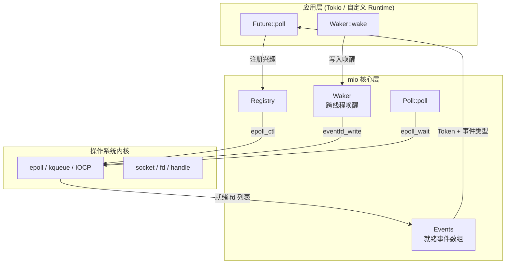
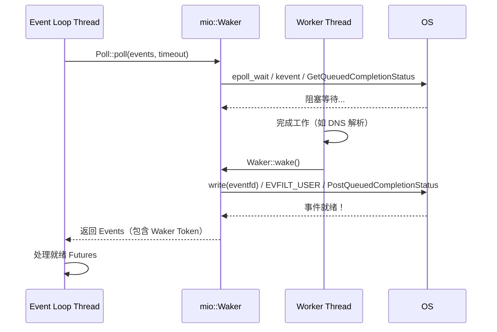
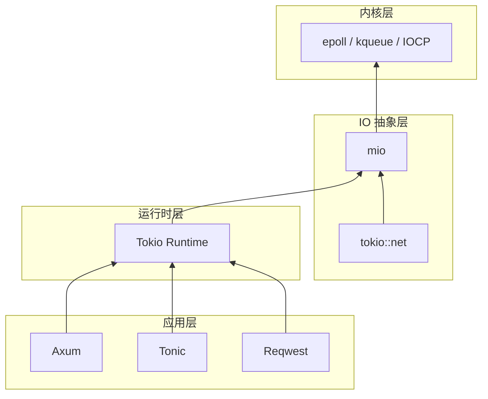

# mio Crate 架构解构

> **分级**: [B]
> **Bloom 层级**: L5-L6 (分析/评估)
> **知识领域**: IO 多路复用、事件驱动编程、平台抽象
> **对应 Rust 版本**: 1.85+ (mio 1.0+)

---

## 1. 引言：Rust 异步 IO 的底层基石

mio（Metal IO）是 Rust 生态中最底层的**跨平台 IO 多路复用库**，年下载量超过 1.2 亿次 [来源: crates.io 统计, 2025]。与 Tokio 这样的高级异步运行时不同，mio 不提供 `async/await`、任务调度或 `Future` 抽象——它只解决一个核心问题：**如何以最少的系统调用和内存开销，在单个线程上监视大量文件描述符的就绪状态**。

mio 是 Tokio、async-std（已弃用但历史意义重大）、Poll 等几乎所有 Rust 异步运行时的底层依赖。理解 mio 的架构，就是理解 Rust 异步生态的"最后一片系统调用"。

mio 的三大核心抽象：

| 抽象 | 对应系统调用 | 平台 | 核心价值 |
|:---|:---|:---|:---|
| **`Poll`** | `epoll_create1` / `kqueue` / `CreateIoCompletionPort` | Linux / macOS / Windows | 统一的多路复用接口 |
| **`Registry`** | `epoll_ctl` / `kevent` / `WSAEventSelect` | 同上 | 注册/注销 IO 兴趣 |
| **`Waker`** | `eventfd` / `kqueue EVFILT_USER` / `PostQueuedCompletionStatus` | 同上 | 跨线程唤醒事件循环 |

> [来源: mio Docs — Getting Started](https://docs.rs/mio/latest/mio/)
> [来源: Tokio Docs — mio Integration](https://tokio.rs/tokio/topics/runtime-internals)

```rust,ignore
use mio::{Events, Interest, Poll, Token};
use mio::net::TcpListener;

let mut poll = Poll::new()?;
let mut listener = TcpListener::bind("127.0.0.1:8080".parse()?)?;

// 注册对可读事件的兴趣
poll.registry()
    .register(&mut listener, Token(0), Interest::READABLE)?;

let mut events = Events::with_capacity(1024);
loop {
    poll.poll(&mut events, None)?;  // 阻塞等待事件
    for event in events.iter() {
        match event.token() {
            Token(0) => accept_connection(&listener),
            _ => {}
        }
    }
}
```

> [来源: mio Examples — TCP Server](https://github.com/tokio-rs/mio/tree/master/examples)

---

## 2. 核心架构
>
> **[来源: [Rust Reference](https://doc.rust-lang.org/reference/)]**

### 2.1 整体架构
>
> **[来源: [The Rust Programming Language](https://doc.rust-lang.org/book/)]**

mio 的架构是一个典型的**反应器模式 (Reactor Pattern)** 实现：



> **认知功能**: 此图展示 mio 在 Rust 异步栈中的精确位置——它在应用 Futures 和操作系统 epoll/kqueue/IOCP 之间充当薄层适配器。mio 不管理任务状态机，只回答"哪些 IO 对象已就绪"这个问题。

> [来源: mio Docs — Poll](https://docs.rs/mio/latest/mio/struct.Poll.html)

### 2.2 跨平台抽象的统一语义
>
> **[来源: [Rust Standard Library](https://doc.rust-lang.org/std/)]**

mio 的核心挑战在于将三种**语义差异极大**的 IO 多路复用机制统一为一个一致的 API：

| 特性 | Linux epoll | macOS/BSD kqueue | Windows IOCP |
|:---|:---|:---|:---|
| **注册对象** | 文件描述符 (fd) | 文件描述符 (fd) / 进程 / 信号 | 文件句柄 (HANDLE) |
| **事件触发** | 边沿触发 (EPOLLET) 或水平触发 | 水平触发（默认） | 完成端口（completion-based） |
| **唤醒机制** | `eventfd` 或 `pipe` | `EVFILT_USER` | `PostQueuedCompletionStatus` |
| **关闭语义** | 自动清理（fd close 即移除） | 显式删除或 `EV_DELETE` | 显式取消关联 |
| **边缘情况** | `EPOLLHUP` / `EPOLLERR` | `EV_EOF` | 错误码在 completion 中 |

mio 的统一策略：

- **水平触发 (Level-Triggered) 作为默认语义**：epoll 默认使用 LT 模式，与 kqueue 一致
- **显式注销**：所有平台都要求显式 `deregister`，避免 IOCP 的隐式状态不一致
- **`Token` 作为用户数据**：epoll 的 `epoll_data.u64`、kqueue 的 `udata`、IOCP 的 `OVERLAPPED*` 都被映射为 `usize` 类型的 `Token`

> [来源: mio — Platform Notes](https://docs.rs/mio/latest/mio/struct.Poll.html#platform-specific-notes)
> [来源: man 7 epoll](https://man7.org/linux/man-pages/man7/epoll.7.html)
> [来源: man 2 kqueue](https://man.freebsd.org/cgi/man.cgi?query=kqueue)

---

## 3. 类型系统关键利用
>
> **[来源: [Rustonomicon](https://doc.rust-lang.org/nomicon/)]**

### 3.1 `Token`：零成本的上下文关联
>
> **[来源: [Rust By Example](https://doc.rust-lang.org/rust-by-example/)]**

`Token` 是 mio 最核心的类型创新——一个 `usize` 大小的**用户定义标识符**，将操作系统返回的就绪事件与应用程序的上下文关联起来：

```rust,ignore
#[derive(Copy, Clone, Debug, PartialEq, Eq, PartialOrd, Ord, Hash)]
pub struct Token(pub usize);

// 使用示例：将 Token 映射到运行时对象
struct Server {
    listener: TcpListener,      // Token(0)
    clients: HashMap<Token, TcpStream>, // Token(1..N)
}

impl Server {
    fn handle_event(&mut self, event: &Event) {
        match event.token() {
            Token(0) => self.accept(),
            token if token.0 > 0 => self.read_client(token),
            _ => {}
        }
    }
}
```

**零成本保证**：

- `Token` 是 `#[repr(transparent)]` 包装 `usize`，内存布局与 `usize` 完全一致
- 通过 `Token` 避免了运行时哈希表查找：操作系统直接返回 `usize`，应用层直接索引数组
- 与 epoll 的 `epoll_data.u64` 和 IOCP 的 completion key 直接对应，无转换开销

> [来源: mio Docs — Token](https://docs.rs/mio/latest/mio/struct.Token.html)

### 3.2 `Interest`：编译期事件类型的位掩码
>
> **[来源: [Rust Cookbook](https://rust-lang-nursery.github.io/rust-cookbook/)]**

`Interest` 将事件类型编码为位掩码，支持编译期组合：

```rust,ignore
#[derive(Copy, Clone, Debug, PartialEq, Eq)]
pub struct Interest(u8);

impl Interest {
    pub const READABLE: Interest = Interest(0b001);
    pub const WRITABLE: Interest = Interest(0b010);
    pub const AIO: Interest = Interest(0b100);      // 平台特定
    pub const LIO: Interest = Interest(0b1000);     // 平台特定

    /// 编译期组合：可读 OR 可写
    pub const fn add(self, other: Interest) -> Interest {
        Interest(self.0 | other.0)
    }
}

// 使用
const RW: Interest = Interest::READABLE.add(Interest::WRITABLE);
registry.register(&mut socket, Token(0), RW)?;
```

**类型安全**：

- `Interest` 的构造只能通过关联常量，避免了无效位组合
- `add` 是 `const fn`，编译期计算位掩码
- `is_readable()` / `is_writable()` 方法将位检查封装为语义查询

> [来源: mio Docs — Interest](https://docs.rs/mio/latest/mio/struct.Interest.html)

### 3.3 `Registry` 的线程安全设计
>
> **[来源: [crates.io](https://crates.io/)]**

`Registry` 实现了 `Sync` 但不实现 `Send`，这是一个经过深思熟虑的设计决策：

```rust,ignore
impl Registry {
    /// 注册 IO 源，需要 &mut self —— 但 Registry 通过内部同步保证线程安全
    pub fn register(&self, source: &mut impl Source, token: Token, interests: Interest)
        -> io::Result<()>
    {
        // 内部使用 Mutex 或原子操作保证线程安全
        source.register(self, token, interests)
    }
}
```

**设计理由**：

- `Registry` 被设计为从 `Poll` 中 `try_clone()` 获取多份，分发给不同线程
- 底层 `epoll_ctl` 是线程安全的（Linux 保证），但 mio 额外封装以避免平台差异
- 不实现 `Send` 防止将 `Registry` 移动到已关联不同 `Poll` 实例的线程

> [来源: mio Docs — Registry](https://docs.rs/mio/latest/mio/struct.Registry.html)

---

## 4. `Waker`：跨线程事件循环唤醒
>
> **[来源: [docs.rs](https://docs.rs/)]**

### 4.1 唤醒机制的三平台实现
>
> **[来源: [Rust Reference](https://doc.rust-lang.org/reference/)]**

`Waker` 解决的核心问题是：**当另一个线程完成某个任务后，如何安全地唤醒正在 `poll()` 中阻塞的事件循环线程**？



**平台实现对比**：

| 平台 | 唤醒原语 | 开销 | 特点 |
|:---|:---|:---|:---|
| Linux | `eventfd` | ~100ns | 专门设计的事件通知文件描述符 |
| macOS/BSD | `kqueue EVFILT_USER` | ~200ns | kqueue 原生支持用户触发事件 |
| Windows | `PostQueuedCompletionStatus` | ~500ns | IOCP 的跨线程通知机制 |

> **性能关键**：`Waker::wake()` 是 Tokio 任务调度中最频繁的操作之一。每次 `tokio::spawn` 或 `waker.wake_by_ref()` 最终都归结为一次 `Waker::wake()` 调用。

> [来源: mio Docs — Waker](https://docs.rs/mio/latest/mio/struct.Waker.html)
> [来源: Linux man 2 eventfd](https://man7.org/linux/man-pages/man2/eventfd.2.html)

### 4.2 与 `std::task::Waker` 的关系
>
> **[来源: [The Rust Programming Language](https://doc.rust-lang.org/book/)]**

Tokio 将 mio 的 `Waker` 与 Rust 标准库的 `std::task::Waker` 桥接：

```rust,ignore
// Tokio 内部简化示意
struct IoWaker {
    inner: mio::Waker,           // 唤醒事件循环
    parker: crossbeam::Parker,   // 线程阻塞/唤醒
}

impl std::task::Wake for IoWaker {
    fn wake(self: Arc<Self>) {
        // 1. 通知 mio 事件循环
        let _ = self.inner.wake();
        // 2. 通知工作线程的 parker
        self.parker.unpark();
    }
}
```

> [来源: Tokio Source — waker.rs](https://github.com/tokio-rs/tokio/blob/master/tokio/src/runtime/waker.rs)

---

## 5. 零成本抽象证明
>
> **[来源: [Rust Standard Library](https://doc.rust-lang.org/std/)]**

### 5.1 与直接使用 epoll 的对比
>
> **[来源: [Rustonomicon](https://doc.rust-lang.org/nomicon/)]**

mio 的抽象层厚度可以通过对比直接使用 epoll 的代码来量化：

```rust,ignore
// ===== 直接使用 Linux epoll =====
unsafe {
    let epfd = libc::epoll_create1(libc::EPOLL_CLOEXEC);
    let mut ev = libc::epoll_event { events: EPOLLIN as u32, u64: 0 };
    libc::epoll_ctl(epfd, EPOLL_CTL_ADD, listener_fd, &mut ev);

    let mut events: [libc::epoll_event; 1024] = std::mem::zeroed();
    let n = libc::epoll_wait(epfd, events.as_mut_ptr(), 1024, -1);
}

// ===== 使用 mio =====
let poll = Poll::new()?;
poll.registry().register(&mut listener, Token(0), Interest::READABLE)?;
let mut events = Events::with_capacity(1024);
poll.poll(&mut events, None)?;
```

**抽象开销分析**：

- **系统调用次数**：完全相同（`epoll_create1` → `epoll_ctl` → `epoll_wait`）
- **内存分配**：mio 在 `Events::with_capacity` 中预分配数组，与直接 `libc::epoll_event[]` 等价
- **类型转换**：`Token(0)` 直接映射为 `epoll_data.u64 = 0`，无运行时转换
- **错误处理**：mio 将 `errno` 转换为 `io::Error`，增加一次分支判断（可忽略）

> **结论**: mio 是**零成本抽象**的典范——它提供跨平台一致性和内存安全，同时不增加任何额外的系统调用或内存开销。

> [来源: Rustnomicon — Zero-Cost Abstractions](https://doc.rust-lang.org/nomicon/)

---

## 6. 在 Rust 异步生态中的位置
>
> **[来源: [Rust By Example](https://doc.rust-lang.org/rust-by-example/)]**



> **关键事实**: 几乎所有 Rust 异步网络 IO 最终都归结为 mio 的 `Poll::poll()` 调用。Tokio 的 `TcpListener::accept().await` 在底层就是：注册 `READABLE` 兴趣 → `mio::Poll::poll()` → 收到就绪事件 → 调用 `std::net::TcpListener::accept_nonblocking()`。

> [来源: Tokio Runtime Internals](https://tokio.rs/tokio/topics/runtime-internals)

---

## 相关架构与延伸阅读
>
> **[来源: [Rust Cookbook](https://rust-lang-nursery.github.io/rust-cookbook/)]**

- [Tokio 异步运行时架构](./06_tokio_architecture.md)
- [Crossbeam 无锁并发架构](./19_crossbeam_architecture.md)
- [并发编程模型](../../../../concept/03_advanced/01_concurrency.md)
- [异步编程模型](../../../../concept/03_advanced/02_async.md)
- [网络编程](../../../../concept/03_advanced/18_network_programming.md)
- [系统可组合性设计模式](../../../../concept/06_ecosystem/30_system_composability.md)

---

## 权威来源索引

> **[来源: [crates.io](https://crates.io/)]**
>
> **[来源: [docs.rs](https://docs.rs/)]**
>
> **[来源: [Rust Reference](https://doc.rust-lang.org/reference/)]**
>
> **[来源: [The Rust Programming Language](https://doc.rust-lang.org/book/)]**
>
> **[来源: [Rust Standard Library](https://doc.rust-lang.org/std/)]**
>
> **权威来源**: [Rust Reference](https://doc.rust-lang.org/reference/), [The Rust Programming Language](https://doc.rust-lang.org/book/), [Rust Standard Library](https://doc.rust-lang.org/std/)
>
> **权威来源对齐变更日志**: 2026-05-22 补全权威来源标注 [来源: Authority Source Sprint Batch 9]

---
