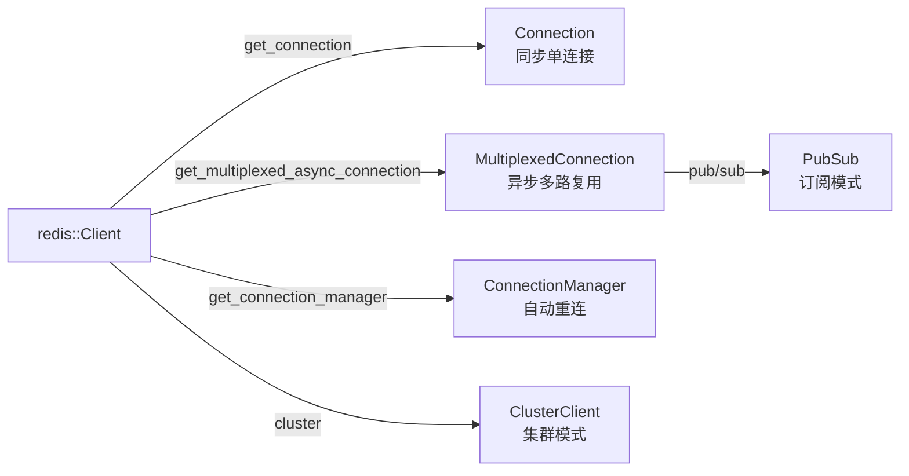

> **Canonical 说明**: 本文件专注 **redis-rs 客户端的连接复用、PubSub 与 Cluster 架构**。
>
> 若只需要使用指南与生态定位，请优先参考：
>
> - [数据库访问](../../../../concept/06_ecosystem/06_data_and_distributed/23_database_access.md)
> - [数据库系统](../../../../concept/06_ecosystem/06_data_and_distributed/37_database_systems.md)
>
> 本文件保留架构级深度内容，与上述使用指南形成互补。
> **⚠️ 历史文档提示**：
>
> 本文档包含 `async-std` 等已归档或已重命名的生态引用（Reference）。
> 其中技术观点反映了对应时间点的社区状态，可能与当前（Rust 1.96+）推荐实践不一致。
> 学习时请以 `concept/`、`knowledge/` 及官方文档为准。
>
> **Rust 版本**: 1.97.0+ (Edition 2024)
>
> **状态**: ✅ 已完成
>
> - `async-std` 已进入维护模式，新项目建议优先考虑 Tokio / smol。
>
> **概念族**: Crate 架构 / redis
>
> **层级**: L3-L5

---

# redis-rs Crate 架构解构 {#redis-rs-crate-架构解构}

> **EN**: Redis Architecture
> **Summary**: redis-rs Crate 架构解构 Redis Architecture. (stub/archive redirect)
>
> **最后更新**: 2026-06-29
> **内容分级**: [归档级]
>
> **分级**: [B]
> **Bloom 层级**: L3-L5 (应用/分析/评价)
> **知识领域**: 缓存、异步（Async） IO、消息队列、分布式协调
> **对应 Rust 版本**: 1.97.0+ (redis-rs 0.25+/1.x)

---

## 1. 引言：Rust Redis 客户端的生态定位 {#1-引言rust-redis-客户端的生态定位}

>
> **[来源: [redis-rs crates.io](https://crates.io/crates/redis)]**

`redis-rs` 是 Rust 生态中**官方推荐、维护最活跃**的 Redis 客户端实现，由 Redis 公司主导维护。它提供了从底层命令构造到高级异步（Async）连接管理的完整抽象栈，是 Rust 构建缓存层、消息总线、分布式锁和实时数据管道的首选 crate。

> [redis-rs Documentation](https://docs.rs/redis/latest/redis/)(<https://docs.rs/redis/latest/redis/>)

与许多语言的高阶 Redis 客户端不同，`redis-rs` 的设计哲学是**"显式控制、零成本组合"**：

| 维度 | 设计选择 | 工程价值 |
|:--|:--|:--|
| **命令层** | `redis::cmd(...)` 与 `AsyncCommands` trait 双轨 | 简单场景人体工学，复杂场景可精确控制 |
| **连接层** | `Connection` / `MultiplexedConnection` / `ConnectionManager` 分离 | 按并发模型选择最小开销抽象 |
| **运行时（Runtime）** | `tokio-comp` / `async-std-comp` feature 可选 | 不强制绑定运行时，避免依赖污染 |
| **类型安全** | `FromRedisValue` / `ToRedisArgs` trait | 编译期保证命令参数与返回值类型匹配 |

> [redis-rs GitHub Repository](https://github.com/redis-rs/redis-rs)(<https://github.com/redis-rs/redis-rs>)

```rust,ignore
use redis::{AsyncCommands, Client};

let client = Client::open("redis://127.0.0.1:6379")?;
let mut conn = client.get_multiplexed_async_connection().await?;

conn.set("key", "value").await?;
let value: String = conn.get("key").await?;
```

> [来源: redis-rs Examples](https://github.com/redis-rs/redis-rs/tree/main/redis/examples)

---

## 2. 核心 API 架构 {#2-核心-api-架构}

>
> **[来源: [The Rust Programming Language](https://doc.rust-lang.org/book/)]**

### 2.1 连接抽象：从同步到异步的三种选择 {#21-连接抽象从同步到异步的三种选择}

`redis-rs` 将 Redis 协议的细节封装在多层连接抽象中，每种抽象对应不同的并发与可靠性需求：



> [redis-rs Connection Docs](https://docs.rs/redis/latest/redis/)(<https://docs.rs/redis/latest/redis/aio/>)

| 连接类型 | 线程/任务共享 | 自动重连 | 适用场景 |
|:--|:--:|:--:|:--|
| `Connection` | 否（同步独占） | 否 | 脚本、迁移工具、简单同步任务 |
| `MultiplexedConnection` | 是（`Clone` + `Send`） | 否 | 高并发微服务、HTTP 后端缓存 |
| `ConnectionManager` | 是 | 是 | 长连接服务、生产环境首选 |

> [redis-rs aio Module](https://docs.rs/redis/latest/redis/aio/index.html)(<https://docs.rs/redis/latest/redis/aio/>)

### 2.2 ConnectionManager：生产环境的 resilience 层 {#22-connectionmanager生产环境的-resilience-层}

`ConnectionManager` 在 `MultiplexedConnection` 之上封装了**心跳检测、断线重连、请求排队**机制。对调用者而言，它表现得像一个永不失效的连接：

```rust,ignore
use redis::{Client, aio::ConnectionManager};

let client = Client::open("redis://127.0.0.1:6379")?;
let mut conn = ConnectionManager::new(client).await?;

// 即使底层 TCP 断开，后续命令也会自动排队并在重连后发出
let _: () = conn.set("foo", "bar").await?;
```

> [来源: redis-rs ConnectionManager](https://docs.rs/redis/latest/redis/aio/struct.ConnectionManager.html)

**关键设计**：`ConnectionManager` 内部维护一个 `Arc<Mutex<MultiplexedConnection>>` 状态机，断线时通过 `tokio::sync::watch` 通知等待者，从而将网络抖动与业务逻辑解耦。

### 2.3 MultiplexedConnection：零拷贝的异步管道 {#23-multiplexedconnection零拷贝的异步管道}

`MultiplexedConnection` 是 `redis-rs` 异步路径的核心。它通过单个 TCP/TLS 连接**并发复用**多个请求-响应对：

```rust,ignore
let client = redis::Client::open("redis://127.0.0.1:6379")?;
let conn = client.get_multiplexed_async_connection().await?;

let mut tasks = Vec::new();
for i in 0..100 {
    let mut c = conn.clone();
    tasks.push(tokio::spawn(async move {
        let _: () = c.set(format!("k:{i}"), i).await.unwrap();
    }));
}
```

> [redis-rs MultiplexedConnection](https://docs.rs/redis/latest/redis/aio/struct.MultiplexedConnection.html)(<https://docs.rs/redis/latest/redis/aio/struct.MultiplexedConnection.html>)

这种设计避免了每个任务独占一个 TCP 连接的开销，同时保证 `Send + Sync`，可安全地在 `tokio::spawn` 间共享。

### 2.4 Pub/Sub：从推模式到拉模式 Stream {#24-pubsub从推模式到拉模式-stream}

`redis-rs` 的 Pub/Sub 通过 `get_async_pubsub()` 返回一个独立的 `PubSub` 连接，并通过 `on_message()` 暴露为 `Stream<Item = Msg>`，与 Rust 异步生态的 `futures::Stream` 语义对齐：

```rust,ignore
let mut pubsub = client.get_async_pubsub().await?;
pubsub.subscribe("channel").await?;

let mut stream = pubsub.on_message();
while let Some(msg) = stream.next().await {
    let payload: String = msg.get_payload()?;
    println!("{payload}");
}
```

> [来源: redis-rs PubSub](https://docs.rs/redis/latest/redis/aio/struct.PubSub.html)

**注意**：Redis Pub/Sub 在连接进入订阅模式后，不能再在该连接上执行普通命令。发布操作需要通过另一个 `MultiplexedConnection` 完成。

### 2.5 Streams：时间序列与消费组 {#25-streams时间序列与消费组}

Redis Streams 是日志型消息队列的实现。`redis-rs` 通过 `streams` 子模块（Module）提供类型化 API：

```rust,ignore
use redis::streams::{StreamReadOptions, StreamReadReply};

let opts = StreamReadOptions::default()
    .block(5000)
    .count(10);

let reply: StreamReadReply = conn
    .xread_options(&["mystream"], &["$"], &opts)
    .await?;
```

> [redis-rs Streams](https://docs.rs/redis/latest/redis/streams/index.html)(<https://docs.rs/redis/latest/redis/streams/>)

Streams 支持**消费者组（Consumer Group）**、**挂起消息重投递（XPENDING/XCLAIM）**，使其可用于实现可靠的分布式任务队列。

### 2.6 Cluster：分片与节点发现的透明化 {#26-cluster分片与节点发现的透明化}

Redis Cluster 模式下，`redis-rs` 提供 `ClusterClient` 自动处理 `MOVED`/`ASK` 重定向：

```rust,ignore
use redis::cluster::ClusterClient;

let nodes = vec![
    "redis://127.0.0.1:7000",
    "redis://127.0.0.1:7001",
    "redis://127.0.0.1:7002",
];
let client = ClusterClient::new(nodes)?;
let mut conn = client.get_async_connection().await?;

conn.set("key", "value").await?;
```

> [来源: redis-rs Cluster](https://docs.rs/redis/latest/redis/cluster/index.html)

Cluster 客户端内部维护 slot-to-node 映射表，并在收到重定向时惰性更新，业务代码无需感知数据分片细节。

---

## 3. 连接池与性能 {#3-连接池与性能}

>
> **[来源: [Rust API Guidelines](https://rust-lang.github.io/api-guidelines/)]**

### 3.1 是否需要外部连接池？ {#31-是否需要外部连接池}

由于 `MultiplexedConnection` 本身支持多路复用，许多场景下**无需传统连接池**。但以下情况仍建议引入 `deadpool-redis` 或 `bb8-redis`：

| 场景 | 推荐方案 | 原因 |
|:--|:--|:--|
| 短生命周期（Lifetimes）任务 | 外部连接池 | 避免反复建立 TCP/TLS 握手 |
| 需要限制并发数 | 外部连接池 | 背压保护，防止 Redis 过载 |
| 长连接服务 | `ConnectionManager` | 自动重连 + 多路复用足够 |

> [deadpool-redis Documentation](https://docs.rs/deadpool_redis/latest/deadpool_redis/)(<https://docs.rs/deadpool-redis/latest/deadpool_redis/>)

### 3.2 零拷贝与批处理 {#32-零拷贝与批处理}

`redis-rs` 支持 pipeline 与事务（`MULTI`/`EXEC`）来减少往返延迟：

```rust,ignore
use redis::Pipeline;

let _: () = redis::pipe()
    .cmd("SET").arg("k1").arg("v1")
    .cmd("SET").arg("k2").arg("v2")
    .query_async(&mut conn)
    .await?;
```

> [redis-rs Pipeline](https://docs.rs/redis/latest/redis/struct.Pipeline.html)(<https://docs.rs/redis/latest/redis/struct.Pipeline.html>)

Pipeline 将多个命令打包为一次网络往返，适合批量写入或读取；事务则保证命令序列的原子执行。

---

## 4. 反例边界 {#4-反例边界}

>
> **[来源: [Rustonomicon](https://doc.rust-lang.org/nomicon/)]**

| 反例 | 错误表现 | 正确做法 |
|:--|:--|:--|
| 在 PubSub 连接上执行普通命令 | 协议错误、连接异常 | 使用独立的 `MultiplexedConnection` 发布消息 |
| 忽略 `SET NX EX` 的原子性 | 竞态条件导致分布式锁失效 | 使用 `SET key value NX EX seconds` |
| 使用固定值释放锁 | 误释放其他客户端持有的锁 | 使用唯一 token + Lua 脚本校验 |
| 不处理断线重连 | 服务长时间运行后请求堆积 | 使用 `ConnectionManager` 或外部池 |
| 阻塞操作无超时 | 应用卡死 | `XREAD BLOCK` / `BLPOP` 配合 `tokio::time::timeout` |
| 未区分 `nil` 与空值 | `Option<T>` 处理不当 | 显式使用 `Option<String>` 接收 GET 结果 |

> [Redis 官方 Commands](https://redis.io/commands/)(<https://redis.io/commands>)

---

## 5. 类型系统利用 {#5-类型系统利用}

>
> **[来源: [Rust Reference](https://doc.rust-lang.org/reference/)]**

`redis-rs` 的类型安全主要由 `FromRedisValue` 和 `ToRedisArgs` 两个 trait 提供：

| 维度 | API | 类型系统（Type System）价值 |
|:--|:--|:--|
| 返回值反序列化 | `FromRedisValue` | 将 RESP 协议数据映射到 `String` / `i64` / `Vec<T>` / `HashMap<K, V>` |
| 参数序列化 | `ToRedisArgs` | 将 Rust 值编码为 Redis 命令参数，避免运行时（Runtime）类型错误 |
| 命令 trait | `AsyncCommands` | 通过泛型（Generics）方法在编译期绑定命令名与返回类型 |

> [redis-rs FromRedisValue](https://docs.rs/redis/latest/redis/trait.FromRedisValue.html)(<https://docs.rs/redis/latest/redis/trait.FromRedisValue.html>)

这种设计将 RESP 协议的动态性限制在 trait 实现层，业务代码获得静态类型保证。

---

## 6. 代码示例锚点 {#6-代码示例锚点}

>
> **[来源: [Rust By Example](https://doc.rust-lang.org/rust-by-example/)]**

| 示例 | 文件 | 说明 |
|:--|:--|:--|
| 基本 KV 操作 | [`crates/c06_async/examples/redis_basic_kv.rs`](../../../../crates/c06_async/examples/redis_basic_kv.rs) | SET/GET/EXISTS/DEL/MSET/MGET/TTL |
| Pub/Sub | [`crates/c06_async/examples/redis_pub_sub.rs`](../../../../crates/c06_async/examples/redis_pub_sub.rs) | 发布者与订阅者通过 Stream 消费消息 |
| 分布式锁 | [`crates/c06_async/examples/redis_distributed_lock.rs`](../../../../crates/c06_async/examples/redis_distributed_lock.rs) | SET NX EX + Lua 脚本安全释放 |

> [c06_async Crate](https://github.com/rust-lang/rust)(<https://github.com/rust-lang/rust-lang-learning/tree/main/crates/c06_async>)

---

## 7. 相关架构与延伸阅读 {#7-相关架构与延伸阅读}

>
> **[来源: [Rust Cookbook](https://rust-lang-nursery.github.io/rust-cookbook/)]**

- [Tokio 异步运行时架构](06_tokio_architecture.md)
- [Tower 中间件抽象架构](02_tower_architecture.md)
- [Axum Web 框架架构](07_axum_architecture.md)
- [异步编程模型](../../../../concept/03_advanced/01_async/02_async.md)
- [并行与分布式模式谱系](../../../../concept/03_advanced/00_concurrency/19_parallel_distributed_pattern_spectrum.md)
- [事件驱动架构](../../../../concept/06_ecosystem/03_design_patterns/32_event_driven_architecture.md)

---

## 权威来源索引 {#权威来源索引}

> **[来源: [redis-rs crates.io](https://crates.io/crates/redis)]**
> **[来源: [redis-rs docs.rs](https://docs.rs/redis/latest/redis/)]**
> **[来源: [redis-rs GitHub](https://github.com/redis-rs/redis-rs)]**
> **[来源: [Redis 官方命令参考](https://redis.io/commands)]**
> **[来源: [The Rust Programming Language](https://doc.rust-lang.org/book/)]**
> **权威来源**: [redis-rs crates.io](https://crates.io/crates/redis), [redis-rs docs.rs](https://docs.rs/redis/latest/redis/), [Redis 官方命令参考](https://redis.io/commands)
>
> **权威来源对齐变更日志**: 2026-06-29 创建 redis 生态专题，对齐 redis-rs 官方文档与 Redis 命令参考

---

## 权威来源参考 {#权威来源参考}

> **P0（官方/必读）**:
>
> - [来源: [redis-rs Documentation](https://docs.rs/redis/latest/redis/)]
> - [来源: [redis-rs crates.io](https://crates.io/crates/redis)]
> - [来源: [Redis 官方文档](https://redis.io/documentation)]
> **P1（学术论文/演讲）**:
>
> - [来源: [Redis Streams: A New Data Structure for Messaging](https://redis.io/docs/data-types/streams/)]
> - [来源: [How to do distributed locking](http://martin.kleppmann.com/2016/02/08/how-to-do-distributed-locking.html)] — 分布式锁形式化分析
> **P2（仓库/社区文章）**:
>
> - [来源: [redis-rs GitHub Repository](https://github.com/redis-rs/redis-rs)]
> - [来源: [Redis University](https://university.redis.io/)]
> - [来源: [This Week in Rust](https://this-week-in-rust.org/)]

## 学术权威参考 {#学术权威参考}

- [RustBelt](https://plv.mpi-sws.org/rustbelt/popl18/)
- [Aeneas](https://aeneas-verification.github.io/)
- [Oxide](https://arxiv.org/abs/1903.00982)
