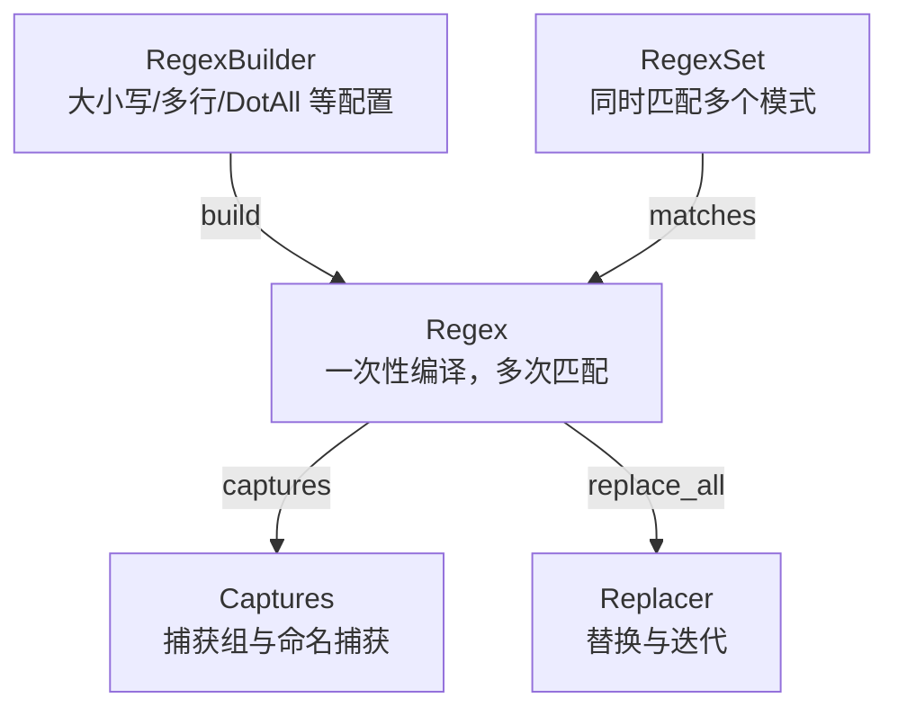
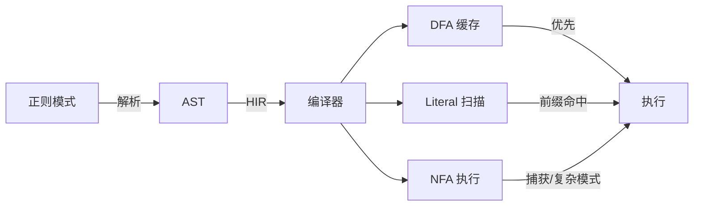

> **Canonical 说明**: 本文件专注 **regex crate 的 DFA/NFA/Hybrid 正则引擎架构**。
>
> 若只需要使用指南与生态定位，请优先参考：
>
> - [字符串与文本](../../../../concept/01_foundation/09_strings_and_text.md)
> - [字符串与编码](../../../../concept/01_foundation/18_strings_and_encoding.md)
>
> 本文件保留架构级深度内容，与上述使用指南形成互补。
> **⚠️ 历史文档提示**：
>
> 本文档反映 regex 1.11+ 在 Rust 1.96+ 生态下的设计状态。
> 学习时请以 `concept/`、`knowledge/` 及官方文档为准。
>
> **Rust 版本**: 1.96.1+ (Edition 2024)
>
> **状态**: ✅ 已完成
>
> **概念族**: Crate 架构 / regex
>
> **层级**: L3-L5

---

# regex Crate 架构解构 {#regex-crate-架构解构}

> **EN**: Regex Architecture
> **Summary**: regex Crate 架构解构 Regex Architecture.
>
> **最后更新**: 2026-06-29
> **内容分级**: [归档级]
>
> **分级**: [B]
> **Bloom 层级**: L3-L5 (应用/分析/评价)
> **知识领域**: 正则表达式、字符串处理、文本解析、模式验证
> **对应 Rust 版本**: 1.96.1+ (regex 1.11+)

---

## 1. 引言：Rust `regex` crate 的生态定位 {#1-引言rust-regex-crate-的生态定位}

>
> **[来源: [regex crates.io](https://crates.io/crates/regex)]**

`regex` crate 是 Rust 生态中最广泛使用的正则表达式引擎，由 Rust 核心团队维护。它以**安全、高性能、Unicode 正确**著称，被 `ripgrep`、`clap`、`tracing`、`serde` 等众多工业级 crate 间接或直接依赖，是 Rust 文本处理基础设施的关键组成部分。

> [来源: regex docs.rs](https://docs.rs/regex/latest/regex/)

与许多动态语言的正则实现不同，`regex` crate 在设计上强调**可预期的线性时间匹配**与**内存安全**：

| 维度 | 设计选择 | 工程价值 |
|:--|:--|:--|
| **匹配模型** | 编译期解析 + 运行期 DFA/NFA/Hybrid 执行 | 兼顾速度与表达能力 |
| **API 风格** | `Regex` / `RegexBuilder` / `RegexSet` 三分层 | 从简单匹配到高级配置均有对应抽象 |
| **Unicode** | 默认启用完整 Unicode 支持 | 多语言文本无需额外配置 |
| **安全性** | 拒绝易导致灾难性回溯的模式 | 不可控用户输入下仍保持线性时间 |
| **零拷贝** | `Captures` / `Match` 借用原字符串 | 避免不必要的内存分配 |

> [来源: regex GitHub Repository](https://github.com/rust-lang/regex)

```rust
use regex::Regex;

let re = Regex::new(r"\d{4}-\d{2}-\d{2}").unwrap();
assert!(re.is_match("2026-06-29"));
```

> [来源: regex Examples](https://docs.rs/regex/latest/regex/#example)

---

## 2. 核心 API 架构 {#2-核心-api-架构}

>
> **[来源: [The Rust Programming Language](https://doc.rust-lang.org/book/)]**

### 2.1 三层入口：`Regex` / `RegexBuilder` / `RegexSet` {#21-三层入口regex-regexbuilder-regexset}



> [来源: regex Regex Docs](https://docs.rs/regex/latest/regex/struct.Regex.html)

| 类型 | 职责 | 典型使用场景 |
|:--|:--|:--|
| `Regex` | 编译后的不可变正则对象，线程安全 | 简单的 `is_match` / `find` / `replace` |
| `RegexBuilder` | 控制大小写敏感、多行模式、Unicode 等选项 | 需要运行时配置匹配语义 |
| `RegexSet` | 同时测试多个模式，返回匹配索引集合 | 日志分类、路由表、关键词过滤 |

> [来源: regex RegexBuilder Docs](https://docs.rs/regex/latest/regex/struct.RegexBuilder.html)

### 2.2 匹配与捕获 {#22-匹配与捕获}

`Regex` 提供位置查询、分组捕获与命名捕获三种粒度：

```rust
use regex::Regex;

let re = Regex::new(r"(?<year>\d{4})-(?<month>\d{2})-(?<day>\d{2})").unwrap();
let caps = re.captures("Date: 2026-06-29").unwrap();

assert_eq!(&caps[0], "2026-06-29");
assert_eq!(&caps["year"], "2026");
assert_eq!(&caps["month"], "06");
```

> [来源: regex Captures Docs](https://docs.rs/regex/latest/regex/struct.Captures.html)

**关键设计**：`Captures` 通过生命周期借用输入字符串，避免匹配过程中的拷贝；`caps.name("year")` 返回 `Option<Match>`，强制调用者处理缺失的分组。

### 2.3 命名捕获与迭代器 {#23-命名捕获与迭代器}

正则对象本身实现 `Iterator` 相关方法，支持流式消费：

```rust
use regex::Regex;

let re = Regex::new(r"[a-zA-Z_][a-zA-Z0-9_]*").unwrap();
for ident in re.find_iter("let foo = bar + 1;") {
    println!("{}", ident.as_str());
}
```

> [来源: regex Match Docs](https://docs.rs/regex/latest/regex/struct.Match.html)

| 方法 | 返回类型 | 语义 |
|:--|:--|:--|
| `find` | `Option<Match>` | 首次匹配 |
| `find_iter` | `Matches` | 所有非重叠匹配 |
| `captures_iter` | `CaptureMatches` | 所有捕获结果 |
| `split` | `Split` | 按匹配项切分 |
| `splitn` | `SplitN` | 限制切分段数 |

### 2.4 替换 API {#24-替换-api}

`replace_all` 与 `replacen` 支持字符串与闭包两种替换策略：

```rust
use regex::Regex;

let re = Regex::new(r"\d+").unwrap();
let masked = re.replace_all("User ID: 12345", "***");
assert_eq!(masked, "User ID: ***");

let incremented = re.replace_all("a1b2c3", |caps: &regex::Captures| {
    caps[0].parse::<i32>().unwrap().wrapping_add(1).to_string()
});
```

> [来源: regex Replacer Docs](https://docs.rs/regex/latest/regex/trait.Replacer.html)

**类型注意**：`replace_all` 返回 `Cow<str>`，当没有匹配时直接借用原字符串，无需分配。

### 2.5 `RegexSet`：多模式并行匹配 {#25-regexset多模式并行匹配}

`RegexSet` 适合"模式集合中任意一个是否命中"的场景，内部共享 NFA/DFA 构造：

```rust
use regex::RegexSet;

let set = RegexSet::new(&[
    r"^\d+$",
    r"^[a-zA-Z]+$",
    r"^[a-zA-Z0-9_]+$",
]).unwrap();

let matches: Vec<usize> = set.matches("abc123").into_iter().collect();
assert!(matches.contains(&2));
```

> [来源: regex RegexSet Docs](https://docs.rs/regex/latest/regex/struct.RegexSet.html)

---

## 3. 性能特征 {#3-性能特征}

>
> **[来源: [Rust Reference](https://doc.rust-lang.org/reference/)]**

`regex` crate 的引擎实现为**混合自动机（Hybrid Automaton）**，根据模式与输入在编译期/运行期选择 DFA、NFA 或 Literal 优化路径：

| 引擎 | 时间复杂度 | 空间特征 | 适用场景 |
|:--|:--|:--|:--|
| **DFA（确定性有限自动机）** | O(n) | 最坏指数级状态，运行时按需构建 | 简单模式、大规模文本扫描 |
| **NFA（非确定性有限自动机）** | O(m × n) | 状态线性于模式 | 捕获组、反向引用、复杂模式 |
| **Literal 优化** | O(n) 或子线性 | 极小额外内存 | 纯字符串搜索、前缀加速 |

> [来源: regex Performance Notes](https://docs.rs/regex/latest/regex/#performance)



> [来源: regex Implementation Notes](https://docs.rs/regex/latest/regex/#module-level-documentation)

**关键保证**：`regex` 默认拒绝包含无界量词嵌套的结构（如 `(a+)+`），从源头避免灾难性回溯。这一限制通过**禁止部分 PCRE 风格扩展**（如反向引用、递归模式）实现。

---

## 4. 反例边界 {#4-反例边界}

>
> **[来源: [Rustonomicon](https://doc.rust-lang.org/nomicon/)]**

| 反例 | 错误表现 | 正确做法 |
|:--|:--|:--|
| 使用 `.unwrap()` 编译用户输入的正则 | 非法模式触发 panic | 使用 `Regex::new(pattern)?` 或 `RegexBuilder`，将错误返回给调用者 |
| 在热循环中重复编译同一正则 | 编译开销远超匹配开销 | 使用 `lazy_static!` / `once_cell` / `LazyLock` 缓存 `Regex` 实例 |
| 用 `.*` 贪婪匹配大文本 | 回溯或过度扫描导致性能退化 | 使用非贪婪量词 `.*?` 或精确字符类；必要时限制输入长度 |
| 将正则作为完整解析器 | 难以处理嵌套/递归结构 | 复杂语言使用专用解析器（`nom`、`pest`、`serde` 等） |
| 忽略 Unicode 边界 | 多语言文本匹配错误 | 默认保持 Unicode 启用，显式使用 `(?-u)` 仅在必要时禁用 |
| 用捕获组做单纯存在判断 | 额外分配与捕获开销 | 需要快速判定时使用 `is_match` 而非 `captures` |

> [来源: regex Caveats](https://docs.rs/regex/latest/regex/#caveats)

**特别警示**：`regex` crate 不是 PCRE 的超集实现。若业务需要反向引用、递归正则、 look-around 等特性，应选择 `fancy-regex` 或 `regex-syntax` 自定义，而不是强行在 `regex` 中构造等价模式。

---

## 5. 类型系统利用 {#5-类型系统利用}

>
> **[来源: [Rust Reference](https://doc.rust-lang.org/reference/)]**

| 维度 | API | 类型系统价值 |
|:--|:--|:--|
| **不可变性保证** | `Regex` | 编译后不可变，天然 `Send + Sync`，可跨线程共享 |
| **生命周期借用** | `Match<'t>` / `Captures<'t>` | 匹配结果生命周期绑定输入字符串，防止悬垂引用 |
| **错误处理** | `Result<Regex, regex::Error>` | 非法模式必须在调用点显式处理 |
| **零拷贝** | `Cow<str>` | 无替换时借用原字符串，减少堆分配 |
| **类型安全迭代器** | `Matches` / `CaptureMatches` | 迭代元素类型在编译期确定，无运行时类型分支 |

> [来源: regex Error Docs](https://docs.rs/regex/latest/regex/enum.Error.html)

---

## 6. 代码示例锚点 {#6-代码示例锚点}

>
> **[来源: [Rust By Example](https://doc.rust-lang.org/rust-by-example/)]**

| 示例 | 文件 | 说明 |
|:--|:--|:--|
| 基础匹配与捕获 | [`crates/c07_process/examples/regex_basic_matching.rs`](../../../../crates/c07_process/examples/regex_basic_matching.rs) | `Regex` / `RegexBuilder` / `RegexSet`、捕获组、命名捕获、替换、迭代器 |
| 常见验证场景 | [`crates/c07_process/examples/regex_common_validation.rs`](../../../../crates/c07_process/examples/regex_common_validation.rs) | 邮箱、URL、IPv4、日志字段解析 |

> [来源: c07_process Crate](../../../../crates/c07_process/README.md)

---

## 7. 相关架构与延伸阅读 {#7-相关架构与延伸阅读}

>
> **[来源: [Rust Cookbook](https://rust-lang-nursery.github.io/rust-cookbook/)]**

- [Clap CLI 解析架构](04_clap_architecture.md) — 参数验证中常用的正则模式
- [Serde 序列化架构](01_serde_architecture.md) — 字符串反序列化与验证边界
- [字符串与文本](../../../../concept/01_foundation/09_strings_and_text.md)
- [知识图谱索引：字符串处理 / 解析 / 验证](../../../../docs/research_notes/10_knowledge_graph_index.md)

---

## 权威来源索引 {#权威来源索引}

> **[来源: [regex crates.io](https://crates.io/crates/regex)]**
> **[来源: [regex docs.rs](https://docs.rs/regex/latest/regex/)]**
> **[来源: [regex GitHub](https://github.com/rust-lang/regex)]**
> **[来源: [The Rust Programming Language](https://doc.rust-lang.org/book/)]**
> **权威来源**: [regex crates.io](https://crates.io/crates/regex), [regex docs.rs](https://docs.rs/regex/latest/regex/), [regex GitHub](https://github.com/rust-lang/regex)
>
> **权威来源对齐变更日志**: 2026-06-29 创建 regex 生态专题，对齐 regex 1.11 官方文档与 Rust Reference

---

## 权威来源参考 {#权威来源参考}

> **P0（官方/必读）**:
>
> - [来源: [regex Documentation](https://docs.rs/regex/latest/regex/)]
> - [来源: [regex crates.io](https://crates.io/crates/regex)]
> - [来源: [The Rust Reference](https://doc.rust-lang.org/reference/)]
> - [来源: [Rust Standard Library – str](https://doc.rust-lang.org/std/primitive.str.html)]
> **P1（学术论文/演讲）**:
>
> - [来源: [Regular Expression Matching Can Be Simple And Fast (Russ Cox)](https://swtch.com/~rsc/regexp/regexp1.html)] — 正则表达式理论与 DFA/NFA 实现
> - [来源: [Regular Expression Matching: the Virtual Machine Approach (Russ Cox)](https://swtch.com/~rsc/regexp/regexp2.html)] — Thompson NFA 虚拟机实现
> **P2（仓库/社区文章）**:
>
> - [来源: [regex GitHub Repository](https://github.com/rust-lang/regex)]
> - [来源: [ripgrep – regex 应用案例](https://github.com/BurntSushi/ripgrep)]
> - [来源: [This Week in Rust](https://this-week-in-rust.org/)]

## 学术权威参考 {#学术权威参考}

- [RustBelt](https://plv.mpi-sws.org/rustbelt/popl18/)
- [Aeneas](https://aeneas-verification.github.io/)
- [Oxide](https://arxiv.org/abs/1903.00982)
