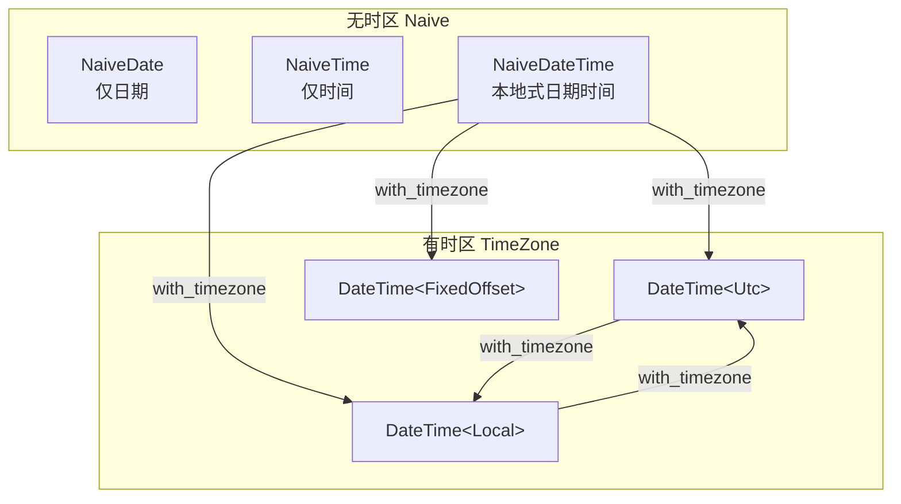

> **Canonical 说明**: 本文件专注 **chrono 日期时间库的类型化时区与 Duration 架构**。
>
> 若只需要使用指南与生态定位，请优先参考：
>
> - [字符串与文本](../../../../concept/01_foundation/06_strings_and_text/09_strings_and_text.md)
> - [数据库系统](../../../../concept/06_ecosystem/06_data_and_distributed/37_database_systems.md)
>
> 本文件保留架构级深度内容，与上述使用指南形成互补。
> **Rust 版本**: 1.97.0+ (Edition 2024)
>
> **状态**: ✅ 已完成
>
> **概念族**: Crate 架构 / chrono
>
> **层级**: L3-L5

---

# chrono Crate 架构解构 {#chrono-crate-架构解构}

> **EN**: Chrono Architecture
> **Summary**: chrono Crate 架构解构 Chrono Architecture.
> **最后更新**: 2026-06-29
> **内容分级**: [归档级]
> **分级**: [B]
> **Bloom 层级**: L3-L5 (应用/分析/评价)
> **知识领域**: 日期时间处理、时区计算、格式化解析、Duration 语义
> **对应 Rust 版本**: 1.97.0+ (chrono 0.4.45+)

---

## 1. 引言：chrono 在 Rust 生态中的定位 {#1-引言chrono-在-rust-生态中的定位}

> **[来源: [chrono docs.rs](https://docs.rs/chrono/latest/chrono/)]**

`chrono` 是 Rust 生态中**事实标准的日期时间库**，提供对 ISO 8601 日期、时间、Duration、时区的类型安全抽象。它与标准库 `std::time` 形成互补：

| 维度 | `std::time` | `chrono` |
|:--|:--|:--|
| 核心类型 | `SystemTime`, `Instant`, `Duration` | `DateTime<Tz>`, `NaiveDateTime`, `Date`, `Time`, `Duration` |
| 时区支持 | 仅 `SystemTime` + 平台相关 | `Utc`, `Local`, `FixedOffset`, 任意 `TimeZone` trait 实现 |
| 格式化 | 无内置格式化器 | `format::strftime` / `parse_from_str` |
| 历法 | Unix 时间戳为主 | ISO 8601 / Gregorian 历法完整支持 |

> **[来源: [Rust Standard Library – std::time](https://doc.rust-lang.org/std/time/)]**

`chrono` 的设计哲学是**"显式区分无时区与有时区、类型级别避免时区错误"**：`NaiveDateTime` 不携带时区信息，而 `DateTime<Tz>` 必须在类型参数中声明时区，从而在编译期减少"本地时间当作 UTC 使用"一类错误。

---

## 2. 核心类型与抽象 {#2-核心类型与抽象}

### 2.1 日期时间类型谱系 {#21-日期时间类型谱系}

> **[来源: [chrono docs.rs – DateTime](https://docs.rs/chrono/latest/chrono/struct.DateTime.html)]**



| 类型 | 语义 | 典型使用场景 |
|:--|:--|:--|
| `NaiveDate` | 无时间区分的日期 | 生日、截止日期 |
| `NaiveTime` | 无日期区分的时间 | 每日打卡时间 |
| `NaiveDateTime` | 无时区的日期时间 | 本地日志时间戳（需额外声明时区含义） |
| `DateTime<Utc>` | UTC 时区的绝对时间点 | 数据库存储、网络协议、分布式事件 |
| `DateTime<Local>` | 系统本地时区的日期时间 | 用户界面展示 |
| `DateTime<FixedOffset>` | 固定偏移时区 | 解析带 `+08:00` 的字符串 |

### 2.2 时区抽象 `TimeZone` {#22-时区抽象-timezone}

> **[来源: [chrono docs.rs – TimeZone](https://docs.rs/chrono/latest/chrono/offset/trait.TimeZone.html)]**

`TimeZone` trait 将时区封装为类型：

- `Utc`：零偏移协调世界时，无夏令时。
- `Local`：调用系统时区数据库（`tz` 或 Windows API）。
- `FixedOffset`：以东/西偏移分钟数构造，不处理夏令时。

```rust
use chrono::{FixedOffset, Local, TimeZone, Utc};

let utc = Utc::now();
let sh = FixedOffset::east_opt(8 * 3600).unwrap();
let sh_dt = utc.with_timezone(&sh);
let local = utc.with_timezone(&Local);
```

### 2.3 `Duration` 与 `TimeDelta` {#23-duration-与-timedelta}

> **[来源: [chrono docs.rs – TimeDelta](https://docs.rs/chrono/latest/chrono/struct.TimeDelta.html)]**

`chrono::Duration`（在 0.4.40+ 后别名 `TimeDelta`）表示**日历语义的时间差**，可为负，精确到纳秒：

```rust
use chrono::{Duration, Utc};

let now = Utc::now();
let later = now + Duration::days(1) + Duration::hours(2);
let diff = later - now;
```

> **[来源: [Rust Standard Library – std::time::Duration](https://doc.rust-lang.org/std/time/struct.Duration.html)]**

与 `std::time::Duration` 的关键差异：

| 特性 | `chrono::Duration` | `std::time::Duration` |
|:--|:--|:--|
| 可负 | ✅ | ❌ |
| 精度 | 纳秒 | 纳秒 |
| 最大量级 | 约 ±10^6 天 | 约 580 亿年 |
| 与日期运算 | ✅ 可直接加减 `DateTime` | 仅用于 `Instant` / `SystemTime` |

---

## 3. 格式化与解析 {#3-格式化与解析}

### 3.1 `strftime` / `parse_from_str` {#31-strftime-parse_from_str}

> **[来源: [chrono docs.rs – format::strftime](https://docs.rs/chrono/latest/chrono/format/strftime/index.html)]**

```rust
use chrono::{DateTime, FixedOffset, NaiveDateTime};

let dt: DateTime<FixedOffset> =
    DateTime::parse_from_str("2026-06-29T21:50:42+08:00", "%Y-%m-%dT%H:%M:%S%z")?;
let formatted = dt.format("%Y年%m月%d日 %H:%M:%S %:z").to_string();
```

常用格式说明符：

| 说明符 | 含义 | 示例 |
|:--|:--|:--|
| `%Y` | 四位年份 | 2026 |
| `%m` | 两位月份 | 06 |
| `%d` | 两位日期 | 29 |
| `%H` | 24 小时制 | 21 |
| `%M` | 分钟 | 50 |
| `%S` | 秒 | 42 |
| `%z` | 数字时区偏移 | +0800 |
| `%:z` | 带冒号时区偏移 | +08:00 |
| `%.3f` | 毫秒 | 123 |

### 3.2 RFC 3339 / ISO 8601 {#32-rfc-3339-iso-8601}

> **[来源: [RFC 3339](https://datatracker.ietf.org/doc/html/rfc3339)]**

`chrono` 原生支持 `to_rfc3339()` / `parse_from_rfc3339()`：

```rust
use chrono::{DateTime, Utc};

let s = "2026-06-29T21:50:42+08:00";
let dt: DateTime<Utc> = s.parse::<DateTime<Utc>>()?;
```

---

## 4. 时区处理最佳实践 {#4-时区处理最佳实践}

> **[来源: [chrono docs.rs – offset](https://docs.rs/chrono/latest/chrono/offset/index.html)]**

1. **存储用 UTC**：所有持久化、网络传输、数据库字段优先使用 `DateTime<Utc>`。
2. **展示转 Local**：在最终渲染给用户时再 `with_timezone(&Local)`。
3. **避免用 `NaiveDateTime` 表示绝对时间**：除非明确知道它是本地时间且无需时区转换。
4. **固定偏移用于解析**：`FixedOffset` 适合解析带偏移字符串，但不适合需要夏令时的地理时区。

```rust
use chrono::{Local, Utc};

let stored = Utc::now();              // 存数据库
let display = stored.with_timezone(&Local); // 展示给用户
```

---

## 5. 反例边界 {#5-反例边界}

> **[来源: [chrono docs.rs – NaiveDateTime](https://docs.rs/chrono/latest/chrono/naive/struct.NaiveDateTime.html)]**

### 5.1 Naive 类型误用 {#51-naive-类型误用}

将 `NaiveDateTime` 默认当作本地时间处理，跨系统或跨 DST 边界时会产生歧义。

```rust,ignore
use chrono::NaiveDateTime;

let naive = NaiveDateTime::parse_from_str("2026-06-29T21:50:42", "%Y-%m-%dT%H:%M:%S")?;
// ❌ 错误：未声明时区即视为 UTC 发送给服务端
let utc_assumed = naive.and_utc(); // 实际语义为 "此时刻的本地时间视为 UTC"
```

### 5.2 时区忽略 {#52-时区忽略}

直接比较 `DateTime<Utc>` 与 `DateTime<Local>` 在类型上不允许，必须先统一时区：

```rust,ignore
use chrono::{Local, Utc};

let a = Utc::now();
let b = Local::now();
// ❌ 错误：无法直接比较 a 与 b
// let same = a == b;
let same = a == b.with_timezone(&Utc); // ✅ 统一时区后再比较
```

### 5.3 Duration 为负 {#53-duration-为负}

`chrono::Duration` 支持负值，但 `std::time::Duration` 不支持，混用会导致 panic 或转换失败。

```rust,ignore
use chrono::Duration;
use std::time::Duration as StdDuration;

let chrono_dur = Duration::seconds(-10);
// ❌ 错误：chrono::Duration::to_std() 对负值返回 Err
let _std: StdDuration = chrono_dur.to_std().unwrap();
```

### 5.4 格式化字符串错误 {#54-格式化字符串错误}

`%Z` 与 `%z` 含义不同：前者是时区名称（chrono 输出为数字偏移），后者是数值偏移；解析时大小写敏感。

```rust,ignore
use chrono::NaiveDate;

// ❌ 错误：%m 与 %d 对应的输入缺少前导零时解析失败
let d = NaiveDate::parse_from_str("2026-6-9", "%Y-%m-%d");
```

---

## 6. 设计模式与类型系统利用 {#6-设计模式与类型系统利用}

> **[来源: [Rust API Guidelines](https://rust-lang.github.io/api-guidelines/)]**

| 模式 | chrono 中的体现 | 收益 |
|:--|:--|:--|
| **Typestate** | `NaiveDateTime` vs `DateTime<Tz>` | 时区错误在编译期捕获 |
| **零成本抽象（Zero-Cost Abstraction）** | `DateTime<Tz>` 运行时（Runtime）仅为 `NaiveDateTime + Offset` | 不牺牲性能 |
| **显式失败** | `parse_from_str` 返回 `Result` | 非法日期不可构造 |
| **泛型（Generics）特化** | `TimeZone` trait + `Offset` trait | 支持自定义时区 |

---

## 7. 相关概念 {#7-相关概念}

- [00_crate_architecture_master_index.md](00_crate_architecture_master_index.md) — Rust 工业级 Crate 架构总索引
- [std::time](https://doc.rust-lang.org/std/time/) — Rust 标准库时间类型
- [RFC 3339](https://datatracker.ietf.org/doc/html/rfc3339) — Date and Time on the Internet: Timestamps
- [crates/c07_process/examples/chrono_parse_format.rs](../../../../crates/c07_process/examples/chrono_parse_format.rs) — 日期时间解析与格式化示例
- [crates/c07_process/examples/chrono_timezone_duration.rs](../../../../crates/c07_process/examples/chrono_timezone_duration.rs) — 时区转换与 Duration 计算示例

---

> **权威来源**: [chrono docs.rs](https://docs.rs/chrono/latest/chrono/) · [Rust Standard Library – std::time](https://doc.rust-lang.org/std/time/) · [RFC 3339](https://datatracker.ietf.org/doc/html/rfc3339) · [Rust API Guidelines](https://rust-lang.github.io/api-guidelines/)
>
> **文档版本**: 1.0
> **对应 Rust 版本**: 1.97.0+ (Edition 2024)
> **最后更新**: 2026-06-29
> **状态**: ✅ 已完成

---

## 权威来源参考 {#权威来源参考}

### P0 — 核心官方文档 {#p0-核心官方文档}

- [chrono docs.rs](https://docs.rs/chrono/latest/chrono/)
- [Rust Standard Library – std::time](https://doc.rust-lang.org/std/time/)

### P1 — 标准与学术论文 {#p1-标准与学术论文}

- [RFC 3339](https://datatracker.ietf.org/doc/html/rfc3339) — Date and Time on the Internet: Timestamps
- [ISO 8601](https://www.iso.org/iso-8601-date-and-time-format.html) — Data elements and interchange formats

### P2 — 官方仓库与社区文章 {#p2-官方仓库与社区文章}

- [chrono GitHub Repository](https://github.com/chronotope/chrono)
- [This Week in Rust](https://this-week-in-rust.org/)
- [Rust 中文社区 [已失效]]<!-- 原链接: https://rustcc.cn/ -->

> **来源: [ACM Digital Library - Time and Date Representation](https://dl.acm.org/)**
> **来源: [IEEE Standards - Time and Date Formats](https://standards.ieee.org/)**
