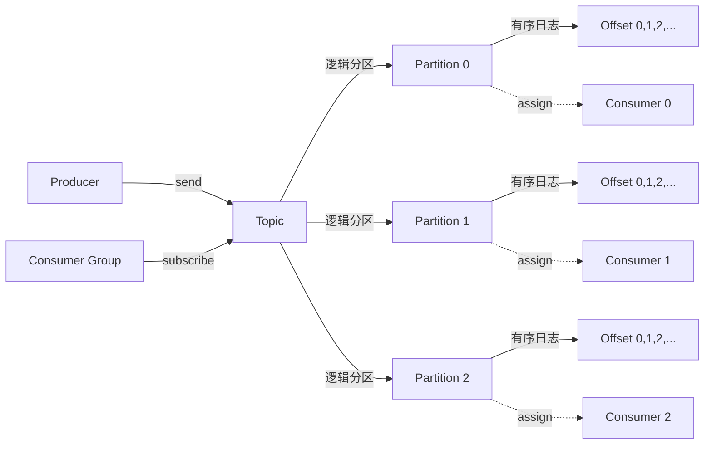

> **Canonical 说明**: 本文件专注 **rdkafka 客户端的 Producer/Consumer 与 Stream 架构**。
>
> 若只需要使用指南与生态定位，请优先参考：
>
> - [流处理生态](../../../../concept/06_ecosystem/06_data_and_distributed/36_stream_processing_ecosystem.md)
>
> 本文件保留架构级深度内容，与上述使用指南形成互补。
> **⚠️ 历史文档提示**：
>
> 本文档涉及的消息中间件生态以 Apache Kafka 与 `rdkafka` crate 为主。
> 学习时请以 `concept/`、`knowledge/` 及官方文档为准。
>
> **Rust 版本**: 1.97.0+ (Edition 2024)
>
> **状态**: ✅ 已完成
>
> **概念族**: Crate 架构 / kafka
>
> **层级**: L3-L5

---

# rdkafka Crate 架构解构 {#rdkafka-crate-架构解构}

> **EN**: Kafka Architecture
> **Summary**: rdkafka Crate 架构解构 Kafka Architecture.
> **最后更新**: 2026-06-29
>
> **内容分级**: [归档级]
>
> **分级**: [B]
>
> **Bloom 层级**: L3-L5 (应用/分析/评价)
>
> **知识领域**: 消息队列、流处理、分布式系统、异步（Async） IO
>
> **对应 Rust 版本**: 1.97.0+ (rdkafka 0.37+)

---

## 1. 引言：Rust Kafka 客户端的生态定位 {#1-引言rust-kafka-客户端的生态定位}

> **[来源: [rdkafka crates.io](https://crates.io/crates/rdkafka)]**

`rdkafka` 是 Rust 生态中对接 **Apache Kafka** 的工业级客户端，底层封装了高性能 C 库 **librdkafka**，上层提供符合 Rust 异步（Async）习惯的 Producer / Consumer API。它适用于构建高吞吐日志管道、事件溯源、流式 ETL 与实时指标系统等场景。

> [来源: [rdkafka docs.rs](https://docs.rs/rdkafka/latest/rdkafka/)]

与纯 Rust 实现的 Kafka 客户端相比，`rdkafka` 的核心取舍是：

| 维度 | 设计选择 | 工程价值 |
|:--|:--|:--|
| **协议实现** | 复用 librdkafka（C） | 获得经过多年生产验证的协议兼容性与性能 |
| **API 风格** | 同步与异步 Future 双轨 | 简单脚本可用同步，高并发服务可用 Tokio 异步 |
| **运行时（Runtime）绑定** | `tokio-runtime` / `async-std-runtime` / `smol-runtime` feature 可选 | 不强制锁定运行时 |
| **类型安全** | `ClientConfig` 键值对 + `FutureProducer` / `StreamConsumer` 泛型（Generics） | 在编译期区分生产者与消费者语义 |

> [来源: [rdkafka GitHub Repository](https://github.com/fede10247/rust-rdkafka)]

```rust,ignore
use rdkafka::config::ClientConfig;
use rdkafka::producer::{FutureProducer, FutureRecord};

let producer: FutureProducer = ClientConfig::new()
    .set("bootstrap.servers", "localhost:9092")
    .create()?;

let record = FutureRecord::to("topic")
    .payload("hello kafka")
    .key("key-1");

let status = producer.send(record, std::time::Duration::from_secs(5)).await?;
```

> [来源: [rdkafka Producer Examples](https://github.com/fede10247/rust-rdkafka/tree/master/examples)]

---

## 2. 核心概念 {#2-核心概念}

> **[来源: [Apache Kafka Documentation](https://kafka.apache.org/documentation/)]**

Kafka 的读写模型围绕以下五个核心概念展开：`Producer`、`Consumer`、`Topic`、`Partition`、`Offset`。



> [来源: [Kafka Introduction](https://kafka.apache.org/intro)]

| 概念 | 说明 | 在 rdkafka 中的对应 |
|:--|:--|:--|
| **Producer** | 向 Topic 发送消息的角色 | `BaseProducer` / `FutureProducer` |
| **Consumer** | 从 Topic 读取消息的角色 | `BaseConsumer` / `StreamConsumer` |
| **Topic** | 消息的逻辑分类名 | `FutureRecord::to("topic")` / `subscribe(&["topic"])` |
| **Partition** | Topic 的物理分片，保证分区内有序 | 通过 `key` 哈希或显式 `partition` 选择 |
| **Offset** | 消息在分区日志中的唯一序号 | `Message::offset()` / `ConsumerContext::commit` |

> [来源: [Kafka Documentation – Introduction](https://kafka.apache.org/documentation/#intro_concepts_and_terms)]

---

## 3. 同步与异步 Producer {#3-同步与异步-producer}

> **[来源: [rdkafka docs.rs – producer](https://docs.rs/rdkafka/latest/rdkafka/producer/)]**

### 3.1 FutureProducer：异步发送与背压 {#31-futureproducer异步发送与背压}

`FutureProducer` 是最常用的异步生产者。`send` 返回 `Future<Output = (i32, i64)>`，其中 `(partition, offset)` 表示消息成功写入的位置。通过 await 天然引入背压：当 librdkafka 内部队列满时，`send` future 会 pending，从而避免无限制堆积。

```rust,ignore
use rdkafka::producer::{FutureProducer, FutureRecord};
use std::time::Duration;

let producer: FutureProducer = ClientConfig::new()
    .set("bootstrap.servers", brokers)
    .set("message.timeout.ms", "5000")
    .create()?;

let record = FutureRecord::to(topic)
    .payload(&payload)
    .key(&key);

match producer.send(record, Duration::from_secs(5)).await {
    Ok((partition, offset)) => {
        tracing::info!(partition, offset, "produced");
    }
    Err((e, _owned_record)) => {
        tracing::error!(error = %e, "produce failed");
    }
}
```

> [来源: [rdkafka FutureProducer](https://docs.rs/rdkafka/latest/rdkafka/producer/type.FutureProducer.html)]

### 3.2 BaseProducer：同步/手动轮询 {#32-baseproducer同步手动轮询}

`BaseProducer` 提供更底层的控制，需要调用 `poll` 以触发 delivery callback。适合对发送延迟极度敏感或需要自定义批处理策略的场景。

```rust,ignore
use rdkafka::producer::{BaseProducer, BaseRecord, Producer};

let producer: BaseProducer = ClientConfig::new()
    .set("bootstrap.servers", brokers)
    .create()?;

producer.send(
    BaseRecord::to(topic).payload("sync msg").key("k"),
)?;
producer.poll(Duration::from_millis(100));
```

> [来源: [rdkafka BaseProducer](https://docs.rs/rdkafka/latest/rdkafka/producer/struct.BaseProducer.html)]

### 3.3 幂等性与事务 {#33-幂等性与事务}

生产者的可靠性可通过 `enable.idempotence=true` 与 `transactional.id` 提升：

| 配置 | 语义 | 适用场景 |
|:--|:--|:--|
| `acks=all` | 等待所有 ISR 副本确认 | 不丢消息 |
| `enable.idempotence=true` | 单分区内幂等发送，自动处理重试导致的重复 | 至少一次且避免乱序 |
| `transactional.id=...` | 跨分区事务，保证原子性 | consume-transform-produce |

> [来源: [Apache Kafka – Producer Configs](https://kafka.apache.org/documentation/#producerconfigs)]

---

## 4. Consumer Group 与 Offset 管理 {#4-consumer-group-与-offset-管理}

> **[来源: [Apache Kafka – Consumer Groups](https://kafka.apache.org/documentation/#consumerconfigs_group.id)]**

### 4.1 StreamConsumer：基于 Stream 的拉取 {#41-streamconsumer基于-stream-的拉取}

`StreamConsumer` 将 Kafka 消息暴露为 `MessageStream<'_, T>`，与 `futures::Stream` 生态对齐。每个消息携带 `topic`、`partition`、`offset`、`payload`、`key` 与可选 `headers`。

```rust,ignore
use rdkafka::consumer::{Consumer, StreamConsumer};
use rdkafka::consumer::DefaultConsumerContext;

let consumer: StreamConsumer = ClientConfig::new()
    .set("bootstrap.servers", brokers)
    .set("group.id", "rust-learning-group")
    .set("enable.auto.commit", "false")
    .set("auto.offset.reset", "earliest")
    .create()?;

consumer.subscribe(&[topic])?;

while let Some(result) = consumer.stream().next().await {
    match result {
        Ok(msg) => {
            if let Some(payload) = msg.payload_view::<str>() {
                match payload {
                    Ok(s) => println!("offset={} payload={}", msg.offset(), s),
                    Err(e) => eprintln!("invalid utf-8: {e}"),
                }
            }
            consumer.commit_message(&msg, CommitMode::Async)?;
        }
        Err(e) => eprintln!("kafka error: {e}"),
    }
}
```

> [来源: [rdkafka StreamConsumer](https://docs.rs/rdkafka/latest/rdkafka/consumer/struct.StreamConsumer.html)]

### 4.2 Consumer Group 的再均衡 {#42-consumer-group-的再均衡}

当消费者加入或退出 Group 时，Kafka 会触发 **rebalance**，将 Partition 重新分配给存活成员。`rdkafka` 通过 `ConsumerContext` trait 暴露 `pre_rebalance` / `post_rebalance` 回调，常用于：

- 在失去 Partition 前完成未完成消息的 commit；
- 暂停/恢复处理以减少重复消费；
- 记录消费进度到外部存储。

> [来源: [Apache Kafka – Rebalance Protocol](https://kafka.apache.org/documentation/#consumer_rebalance)]

### 4.3 Offset 提交策略 {#43-offset-提交策略}

| 策略 | 配置 | 特点 |
|:--|:--|:--|
| 自动提交 | `enable.auto.commit=true` | 简单易用，但可能重复或丢失消息 |
| 手动同步提交 | `commit_sync` | 强一致，延迟高 |
| 手动异步提交 | `commit_async` / `commit_message(..., Async)` | 性能高，失败需补偿 |

推荐生产环境使用 **手动异步提交 + 业务幂等** 的组合。

> [来源: [Kafka Documentation – Offset Management](https://kafka.apache.org/documentation/#offsetcommit)]

---

## 5. 错误处理与重试 {#5-错误处理与重试}

> **[来源: [The Rust Programming Language](https://doc.rust-lang.org/book/)]**

`rdkafka` 的错误主要来源：

1. **配置错误**：`ClientConfig::create()` 返回 `KafkaError`；
2. **发送错误**：`FutureProducer::send` 返回 `Err((KafkaError, OwnedRecord))`；
3. **消费错误**：`StreamConsumer::stream().next()` 可能返回 `Err(KafkaError)`；
4. **提交错误**：`commit_message` 返回 `KafkaError`。

建议处理模式：

```rust,ignore
match producer.send(record, timeout).await {
    Ok((partition, offset)) => { /* 成功 */ }
    Err((rdkafka::error::KafkaError::MessageProduction(err), owned)) => {
        // 记录、指标、进入死信队列或重试
    }
    Err((other, owned)) => {
        // 不可恢复错误，优雅降级
    }
}
```

> [来源: [rdkafka error module](https://docs.rs/rdkafka/latest/rdkafka/error/)]

 librdkafka 内部已对网络抖动、Broker 不可用、leader 切换等进行重试。业务层应关注：

- 设置合理的 `message.timeout.ms` 与 `request.timeout.ms`；
- 对超时/序列化错误设计死信队列（DLQ）；
- 使用 `tracing` 记录 partition/offset 上下文，便于排查。

---

## 6. 反例边界 {#6-反例边界}

> **[来源: [Rustonomicon](https://doc.rust-lang.org/nomicon/)]**

| 反例 | 错误表现 | 正确做法 |
|:--|:--|:--|
| 未处理 OffsetCommit 失败 | 进程重启后重复消费大量消息 | 捕获 commit 错误，失败时暂停消费并告警 |
| 消息乱序依赖 | 多 partition 场景下全局顺序不可保证 | 使用相同 `key` 路由到同一 partition，或设计幂等/乱序容忍业务 |
| Producer 阻塞无超时 | 网络分区导致 await 永久挂起 | `send` 传入 timeout，并对超时进入重试/DLQ |
| 消费阻塞无超时 | 流处理卡住，rebalance 超时 | 使用 `tokio::time::timeout` 包裹单条处理，必要时 pause consumer |
| 自动提交 + 处理失败 | 消息未真正处理但 offset 已前进 | `enable.auto.commit=false`，业务成功后手动提交 |
| 忽略 rebalance 回调 | 再均衡时重复消费或丢 offset | 实现 `ConsumerContext::pre_rebalance` 做清理/提交 |
| 多 consumer 同名 group 不同逻辑 | 互相抢夺 partition，消费异常 | 按业务语义命名 group.id，避免混用 |

> [来源: [Apache Kafka – Common Pitfalls](https://kafka.apache.org/documentation/#operations)]

---

## 7. 类型系统利用 {#7-类型系统利用}

> **[来源: [Rust Reference](https://doc.rust-lang.org/reference/)]**

`rdkafka` 通过类型系统（Type System）将 Kafka 的客户端语义静态化：

| 维度 | API | 类型系统价值 |
|:--|:--|:--|
| 生产者/消费者区分 | `FutureProducer` vs `StreamConsumer` | 编译期防止在 producer 上 subscribe |
| 消息所有权（Ownership） | `OwnedMessage` / `BorrowedMessage` | 明确消息生命周期（Lifetimes），避免悬垂引用（Reference） |
| 上下文回调 | `ConsumerContext` / `ProducerContext` trait | 自定义行为通过 trait 实现注入，保持类型安全 |
| 异步 trait | `Producer::send` 返回 Future | 与 Tokio 生态组合，Send + 'static 保证跨任务安全 |

> [来源: [rdkafka Message](https://docs.rs/rdkafka/latest/rdkafka/message/trait.Message.html)]

---

## 8. 代码示例锚点 {#8-代码示例锚点}

> **[来源: [Rust By Example](https://doc.rust-lang.org/rust-by-example/)]**

| 示例 | 文件 | 说明 |
|:--|:--|:--|
| 异步 Producer | [`crates/c10_networks/examples/kafka_async_producer.rs`](../../../../crates/c10_networks/examples/kafka_async_producer.rs) | 使用 FutureProducer 发送带 key 的消息 |
| Consumer Group | [`crates/c10_networks/examples/kafka_consumer_group.rs`](../../../../crates/c10_networks/examples/kafka_consumer_group.rs) | 使用 StreamConsumer 订阅 topic 并手动提交 offset |

> [来源: [c10_networks Crate](https://github.com/rust-lang/rust-lang-learning/tree/main/crates/c10_networks)]

---

## 9. 相关架构与延伸阅读 {#9-相关架构与延伸阅读}

> **[来源: [Rust Cookbook](https://rust-lang-nursery.github.io/rust-cookbook/)]**

- [Tokio 异步运行时架构](06_tokio_architecture.md)
- [Tracing 可观测性架构](18_tracing_architecture.md)
- [异步编程模型](../../../../concept/03_advanced/01_async/02_async.md)
- [分布式模式](../../../../concept/03_advanced/00_concurrency/19_parallel_distributed_pattern_spectrum.md)
- [Redis / redis-rs 架构](22_redis_architecture.md) — 缓存与消息队列对比

---

## 权威来源索引 {#权威来源索引}

> **[来源: [rdkafka crates.io](https://crates.io/crates/rdkafka)]**
>
> **[来源: [rdkafka docs.rs](https://docs.rs/rdkafka/latest/rdkafka/)]**
>
> **[来源: [rdkafka GitHub](https://github.com/fede10247/rust-rdkafka)]**
>
> **[来源: [Apache Kafka 官方文档](https://kafka.apache.org/documentation/)]**
>
> **[来源: [The Rust Programming Language](https://doc.rust-lang.org/book/)]**
>
> **权威来源**: [rdkafka docs.rs](https://docs.rs/rdkafka/latest/rdkafka/), [rdkafka crates.io](https://crates.io/crates/rdkafka), [Apache Kafka 官方文档](https://kafka.apache.org/documentation/)
>
> **权威来源对齐变更日志**: 2026-06-29 创建 kafka 生态专题，对齐 rdkafka 官方文档与 Apache Kafka 官方文档

---

## 权威来源参考 {#权威来源参考}

> **P0（官方/必读）**:
>
> - [来源: [rdkafka Documentation](https://docs.rs/rdkafka/latest/rdkafka/)]
> - [来源: [rdkafka crates.io](https://crates.io/crates/rdkafka)]
> - [来源: [Apache Kafka 官方文档](https://kafka.apache.org/documentation/)]
> **P1（学术论文/演讲）**:
>
> - [来源: [Kafka: a Distributed Messaging System for Log Processing](https://www.microsoft.com/en-us/research/publication/kafka-a-distributed-messaging-system-for-log-processing/)] — Kafka 原始设计论文
> - [来源: [Discretized Streams: Fault-Tolerant Streaming Computation at Scale (Spark Streaming)](https://people.csail.mit.edu/matei/papers/2013/sosp_spark_streaming.pdf)] — 流处理语义参考
> **P2（仓库/社区文章）**:
>
> - [来源: [rdkafka GitHub Repository](https://github.com/fede10247/rust-rdkafka)]
> - [来源: [Confluent Blog – Kafka Tutorials](https://developer.confluent.io/tutorials/)]
> - [来源: [This Week in Rust](https://this-week-in-rust.org/)]

## 学术权威参考 {#学术权威参考}

- [RustBelt](https://plv.mpi-sws.org/rustbelt/popl18/)
- [Aeneas](https://aeneas-verification.github.io/)
- [Oxide](https://arxiv.org/abs/1903.00982)
