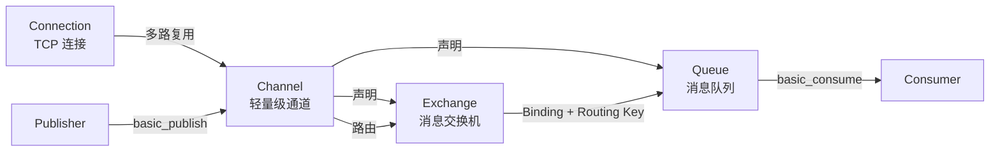

> **Canonical 说明**: 本文件专注 **lapin AMQP/RabbitMQ 客户端的 Channel 与 Consumer 架构**。
>
> 若只需要使用指南与生态定位，请优先参考：
>
> - [流处理生态](../../../../concept/06_ecosystem/06_data_and_distributed/36_stream_processing_ecosystem.md)
> - [网络协议](../../../../concept/06_ecosystem/04_web_and_networking/38_network_protocols.md)
>
> 本文件保留架构级深度内容，与上述使用指南形成互补。
> **Rust 版本**: 1.97.0+ (Edition 2024)
>
> **状态**: ✅ 已完成
>
> **概念族**: Crate 架构 / lapin
>
> **层级**: L3-L5

---

# lapin Crate 架构解构 {#lapin-crate-架构解构}

> **EN**: Lapin Architecture
> **Summary**: lapin Crate 架构解构 Lapin Architecture.
> **最后更新**: 2026-06-29
>
> **内容分级**: [归档级]
>
> **分级**: [B]
>
> **Bloom 层级**: L3-L5 (应用/分析/评价)
>
> **知识领域**: 消息队列、AMQP、RabbitMQ、异步（Async） IO、分布式系统
>
> **对应 Rust 版本**: 1.97.0+ (lapin 2.5+)

---

## 1. 引言：Rust RabbitMQ 客户端的生态定位 {#1-引言rust-rabbitmq-客户端的生态定位}

> **[来源: [lapin crates.io](https://crates.io/crates/lapin)]**

`lapin` 是 Rust 生态中主流的 **AMQP 0-9-1** 异步（Async）客户端，主要面向 **RabbitMQ** 消息代理。它基于纯 Rust 实现 AMQP 协议，提供运行时（Runtime）无关的异步 API（默认集成 Tokio），适用于任务队列、事件驱动微服务、发布-订阅、RPC 等场景。

> [来源: [lapin docs.rs](https://docs.rs/lapin/latest/lapin/)]

与 Kafka 等日志型消息系统相比，RabbitMQ / lapin 的核心取舍是：

| 维度 | 设计选择 | 工程价值 |
|:--|:--|:--|
| **协议实现** | 纯 Rust AMQP 0-9-1 | 无 FFI，跨平台构建友好，类型安全 |
| **运行时绑定** | `tokio`（默认）/ `smol` / `async-global-executor` feature 可选 | 不强制锁定运行时 |
| **消息模型** | 队列 + 交换机 + 绑定 + 路由键 | 灵活的消息路由语义 |
| **可靠性** | Publisher Confirm、事务、QoS prefetch、ACK/NACK | 细粒度控制投递保证 |
| **类型安全** | `Connection` / `Channel` / `Consumer` 等结构体（Struct）静态化 | 编译期区分发布/消费语义 |

> [来源: [lapin GitHub Repository](https://github.com/amqp-rs/lapin)]

```rust,ignore
use lapin::{
    options::*, types::FieldTable, BasicProperties, Connection, ConnectionProperties,
};

let addr = std::env::var("AMQP_ADDR").unwrap_or_else(|_| "amqp://127.0.0.1:5672/%2f".into());
let conn = Connection::connect(&addr, ConnectionProperties::default()).await?;
let channel = conn.create_channel().await?;

channel
    .queue_declare("hello", QueueDeclareOptions::durable(), FieldTable::default())
    .await?;

channel
    .basic_publish(
        "",
        "hello",
        BasicPublishOptions::default(),
        b"Hello, RabbitMQ!",
        BasicProperties::default(),
    )
    .await?
    .await?;
```

> [来源: [lapin examples](https://github.com/amqp-rs/lapin/tree/main/examples)]

---

## 2. 核心概念 {#2-核心概念}

> **[来源: [RabbitMQ AMQP 0-9-1 Model Explained](https://www.rabbitmq.com/tutorials/amqp-concepts)]**

AMQP / RabbitMQ 的读写模型围绕以下核心概念展开：`Connection`、`Channel`、`Queue`、`Exchange`、`Binding`、`Routing Key`、`Publisher`、`Consumer`。



> [来源: [RabbitMQ Tutorials](https://www.rabbitmq.com/tutorials)]

| 概念 | 说明 | 在 lapin 中的对应 |
|:--|:--|:--|
| **Connection** | 客户端与 Broker 的 TCP/TLS 连接 | `Connection::connect(...)` |
| **Channel** | 连接上的轻量级多路复用通道；大多数操作在 Channel 上执行 | `conn.create_channel()` |
| **Queue** | 存储消息的缓冲区 | `channel.queue_declare(...)` |
| **Exchange** | 接收发布消息并按规则路由到队列 | `channel.exchange_declare(...)` |
| **Binding** | 交换机与队列之间的绑定关系 | `channel.queue_bind(...)` |
| **Routing Key** | 消息路由关键字，决定消息进入哪些队列 | `basic_publish(..., routing_key, ...)` |
| **Publisher** | 向 Exchange / Queue 发送消息的角色 | `channel.basic_publish(...)` |
| **Consumer** | 从 Queue 订阅并消费消息的角色 | `channel.basic_consume(...)` |

> [来源: [AMQP 0-9-1 Specification](https://www.rabbitmq.com/resources/specs/amqp0-9-1.pdf)]

### 2.1 Publisher 与 Publisher Confirm {#21-publisher-与-publisher-confirm}

> **[来源: [RabbitMQ Publisher Confirms](https://www.rabbitmq.com/docs/confirms)]**

开启 `confirm_select` 后，Broker 会对每条消息返回 **ACK**（成功路由）或 **NACK**（无法处理）。`lapin` 中 `basic_publish` 返回 `Result<PublisherConfirm>`，通过双重 await 可等待服务器确认。

```rust,ignore
use lapin::publisher_confirm::Confirmation;

channel.confirm_select(ConfirmSelectOptions::default()).await?;

let confirm = channel
    .basic_publish(
        "",
        "hello",
        BasicPublishOptions::default(),
        b"important message",
        BasicProperties::default(),
    )
    .await?;

match confirm.await? {
    Confirmation::Ack(_) => println!("message acked"),
    Confirmation::Nack(_) => eprintln!("message nacked"),
    Confirmation::NotRequested => {}
}
```

> [来源: [lapin publisher_confirm](https://docs.rs/lapin/latest/lapin/publisher_confirm/)]

### 2.2 Consumer 与 ACK/NACK {#22-consumer-与-acknack}

> **[来源: [RabbitMQ Consumers](https://www.rabbitmq.com/docs/consumers)]**

`basic_consume` 返回一个 `Consumer`，它实现 `Stream<Item = Result<Delivery>>`。消费者需要在处理成功后显式 `ack`，失败时选择 `nack`（重试）或 `reject`（丢弃）。

```rust,ignore
use futures::StreamExt;

let mut consumer = channel
    .basic_consume(
        "hello",
        "my_consumer",
        BasicConsumeOptions::default(),
        FieldTable::default(),
    )
    .await?;

while let Some(delivery) = consumer.next().await {
    let delivery = delivery?;
    match std::str::from_utf8(&delivery.data) {
        Ok(s) => println!("received: {s}"),
        Err(e) => eprintln!("invalid utf-8: {e}"),
    }
    delivery.ack(BasicAckOptions::default()).await?;
}
```

> [来源: [lapin Consumer](https://docs.rs/lapin/latest/lapin/consumer/struct.Consumer.html)]

### 2.3 QoS Prefetch {#23-qos-prefetch}

> **[来源: [RabbitMQ Consumer Prefetch](https://www.rabbitmq.com/docs/consumer-prefetch)]**

`basic_qos(prefetch_count, ...)` 限制未确认消息同时推送给消费者的数量，是控制背压与防止消费者过载的关键手段。

```rust,ignore
channel.basic_qos(10, BasicQosOptions::default()).await?;
```

| 配置 | 语义 | 推荐场景 |
|:--|:--|:--|
| `prefetch_count = 0` | 无限制，Broker 尽量推送 | 低延迟、快速消费者 |
| `prefetch_count = 1` | 每次只推送 1 条未确认消息 | 任务重、需要公平分发 |
| `prefetch_count = N` | 最多 N 条未确认消息 | 平衡吞吐与背压 |

> [来源: [RabbitMQ QoS](https://www.rabbitmq.com/docs/consumer-prefetch)]

---

## 3. 交换机类型与路由模式 {#3-交换机类型与路由模式}

> **[来源: [RabbitMQ Exchanges](https://www.rabbitmq.com/docs/exchanges)]**

RabbitMQ 提供多种交换机类型，决定消息如何从交换机路由到队列：

| 类型 | 路由行为 | 典型用法 |
|:--|:--|:--|
| **direct** | 精确匹配 routing key | 点对点任务队列 |
| **fanout** | 广播到所有绑定队列 | 发布-订阅 |
| **topic** | 按 `*` / `#` 通配符匹配 routing key | 日志分级、事件总线 |
| **headers** | 按消息头属性匹配 | 复杂属性路由 |

```rust,ignore
use lapin::ExchangeKind;

channel
    .exchange_declare(
        "logs",
        ExchangeKind::Fanout,
        ExchangeDeclareOptions::durable(),
        FieldTable::default(),
    )
    .await?;
```

> [来源: [RabbitMQ Exchange Types](https://www.rabbitmq.com/docs/exchanges#exchange-types)]

---

## 4. 错误处理与连接恢复 {#4-错误处理与连接恢复}

> **[来源: [RabbitMQ Connections](https://www.rabbitmq.com/docs/connections)]**

`lapin` 的主要错误来源：

1. **连接错误**：`Connection::connect` 返回 `lapin::Error`；
2. **通道错误**：通道级异常（如访问不存在的队列）会导致通道关闭；
3. **发布错误**：`basic_publish` 返回 `Err` 或确认 NACK；
4. **消费错误**：`Consumer` 流返回 `Err`。

`lapin` 支持自动连接恢复：

```rust,ignore
let props = ConnectionProperties::default().enable_auto_recover();
let conn = Connection::connect(&addr, props).await?;
```

恢复后，通道、队列、交换机、绑定与消费者会被自动重建，但发布中的消息仍可能丢失，业务层应设计重试/幂等。

> [来源: [lapin Connection Recovery](https://docs.rs/lapin/latest/lapin/struct.Connection.html)]

---

## 5. 反例边界 {#5-反例边界}

> **[来源: [Rustonomicon](https://doc.rust-lang.org/nomicon/)]**

| 反例 | 错误表现 | 正确做法 |
|:--|:--|:--|
| 未确认发布即退出 | 进程崩溃后消息可能仍在客户端缓冲区，未到达 Broker | 使用 Publisher Confirm 并在退出前 `wait_for_confirms` |
| 未处理 ACK/NACK | 消息被重复投递或堆积，导致队列不断增长 | 成功处理立即 `ack`，失败按策略 `nack`/`reject` |
| 同一 Channel 跨任务共享并发发布 | AMQP 通道非线程安全，可能产生帧交错或协议错误 | 每个任务/线程持有独立 Channel，或使用连接池 |
| 连接泄漏 | 连接未关闭导致文件描述符与 Broker 资源耗尽 | 使用 `drop(conn)` 或 RAII 作用域管理连接生命周期（Lifetimes） |
| 无限 prefetch | 消费者一次性接收过多消息，内存爆炸或处理超时 | 设置合理的 `basic_qos(prefetch_count)` |
| 自动 ack + 处理失败 | 消息未真正处理但已被确认，造成消息丢失 | `BasicConsumeOptions { no_ack: false, .. }` 并手动 ack |
| 忽略通道关闭错误 | 后续操作全部失败且难以定位 | 监听 `channel.on_error` 回调并重建 Channel |
| 硬编码 guest/guest 与明文 URI | 生产环境凭证泄露风险 | 使用环境变量或密钥管理服务注入连接字符串 |

> [来源: [RabbitMQ Production Checklist](https://www.rabbitmq.com/docs/production-checklist)]

---

## 6. 类型系统利用 {#6-类型系统利用}

> **[来源: [Rust Reference](https://doc.rust-lang.org/reference/)]**

`lapin` 通过类型系统（Type System）将 AMQP 客户端语义静态化：

| 维度 | API | 类型系统价值 |
|:--|:--|:--|
| 发布/消费区分 | `basic_publish` vs `basic_consume` | 编译期防止在 Consumer 上调用发布操作 |
| 连接/通道分层 | `Connection` / `Channel` | 明确资源所有权（Ownership），避免跨线程共享通道 |
| 确认语义 | `PublisherConfirm` / `Confirmation` | 必须显式等待确认，减少未处理发布 |
| 异步 trait | `Consumer` 实现 `Stream` | 与 futures/tokio 生态组合，`Send` 保证跨任务安全 |
| 路由类型 | `ExchangeKind` 枚举（Enum） | 交换机类型在编译期选择，避免字符串拼写错误 |

> [来源: [lapin API docs](https://docs.rs/lapin/latest/lapin/)]

---

## 7. 代码示例锚点 {#7-代码示例锚点}

> **[来源: [Rust By Example](https://doc.rust-lang.org/rust-by-example/)]**

| 示例 | 文件 | 说明 |
|:--|:--|:--|
| 发布消息到队列 | [`crates/c10_networks/examples/lapin_publisher.rs`](../../../../crates/c10_networks/examples/lapin_publisher.rs) | 声明队列并使用 basic_publish 发送消息 |
| 从队列消费消息 | [`crates/c10_networks/examples/lapin_consumer.rs`](../../../../crates/c10_networks/examples/lapin_consumer.rs) | 使用 Consumer 流拉取并手动 ack 消息 |

> [来源: [c10_networks Crate](https://github.com/rust-lang/rust-lang-learning/tree/main/crates/c10_networks)]

---

## 8. 相关架构与延伸阅读 {#8-相关架构与延伸阅读}

> **[来源: [Rust Cookbook](https://rust-lang-nursery.github.io/rust-cookbook/)]**

- [Tokio 异步运行时架构](06_tokio_architecture.md)
- [Tracing 可观测性架构](18_tracing_architecture.md)
- [Kafka / rdkafka 架构](26_kafka_architecture.md) — 日志型消息队列对比
- [异步编程模型](../../../../concept/03_advanced/01_async/02_async.md)
- [分布式模式](../../../../concept/03_advanced/00_concurrency/19_parallel_distributed_pattern_spectrum.md)

---

## 权威来源索引 {#权威来源索引}

> **[来源: [lapin crates.io](https://crates.io/crates/lapin)]**
>
> **[来源: [lapin docs.rs](https://docs.rs/lapin/latest/lapin/)]**
>
> **[来源: [lapin GitHub](https://github.com/amqp-rs/lapin)]**
>
> **[来源: [RabbitMQ 官方文档](https://www.rabbitmq.com/docs)]**
>
> **[来源: [AMQP 0-9-1 Specification](https://www.rabbitmq.com/resources/specs/amqp0-9-1.pdf)]**
>
> **权威来源**: [lapin docs.rs](https://docs.rs/lapin/latest/lapin/), [lapin crates.io](https://crates.io/crates/lapin), [RabbitMQ 官方文档](https://www.rabbitmq.com/docs)
>
> **权威来源对齐变更日志**: 2026-06-29 创建 lapin 生态专题，对齐 lapin 官方文档与 RabbitMQ 官方文档

---

## 权威来源参考 {#权威来源参考}

> **P0（官方/必读）**:
>
> - [来源: [lapin Documentation](https://docs.rs/lapin/latest/lapin/)]
> - [来源: [lapin crates.io](https://crates.io/crates/lapin)]
> - [来源: [RabbitMQ 官方文档](https://www.rabbitmq.com/docs)]
> - [来源: [AMQP 0-9-1 Specification](https://www.rabbitmq.com/resources/specs/amqp0-9-1.pdf)]
> **P1（学术论文/演讲）**:
>
> - [来源: [Advanced Message Queuing Protocol (AMQP) White Paper](https://www.amqp.org/sites/amqp.org/files/amqp.pdf)] — AMQP 设计目标与模型
> - [来源: [The End of Cloud Computing as a Platform for the Internet of Things](https://dl.acm.org/doi/10.1145/3093744.3093746)] — 消息中间件在分布式系统中的应用参考
> **P2（仓库/社区文章）**:
>
> - [来源: [lapin GitHub Repository](https://github.com/amqp-rs/lapin)]
> - [来源: [RabbitMQ Tutorials](https://www.rabbitmq.com/tutorials)]
> - [来源: [This Week in Rust](https://this-week-in-rust.org/)]

## 学术权威参考 {#学术权威参考}

- [RustBelt](https://plv.mpi-sws.org/rustbelt/popl18/)
- [Aeneas](https://aeneas-verification.github.io/)
- [Oxide](https://arxiv.org/abs/1903.00982)
