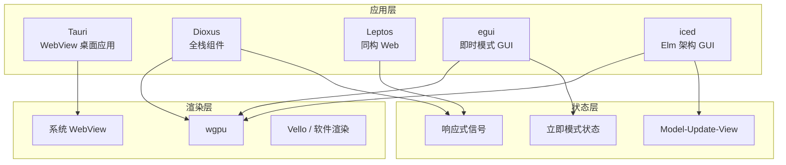

> **Canonical 说明**: 本文件专注 **跨平台 UI 生态（Tauri / Dioxus / Leptos / egui / iced）架构比较**。
>
> 若只需要使用指南与生态定位，请优先参考：
>
> - [游戏开发](../../../../concept/06_ecosystem/21_game_development.md)
> - [响应式编程](../../../../concept/06_ecosystem/40_reactive_programming.md)
>
> 本文件保留架构级深度内容，与上述使用指南形成互补。
> **Rust 版本**: 1.96.1+ (Edition 2024)
>
> **状态**: ✅ 已完成
>
> **概念族**: Crate 架构 / GUI 跨平台 UI
>
> **层级**: L3-L5

---

# GUI / 跨平台 UI 生态架构解构 {#gui-跨平台-ui-生态架构解构}

> **EN**: GUI
> **Summary**: 跨平台 UI 生态架构解构 GUI.
> **最后更新**: 2026-06-29
>
> **内容分级**: [归档级]
>
> **分级**: [B]
>
> **Bloom 层级**: L3-L5 (应用/分析/评价)
>
> **知识领域**: 跨平台 GUI、Web 组件、桌面应用、响应式 UI、即时模式 GUI、Elm 架构
>
> **对应 Rust 版本**: 1.96.1+ (Tauri 2.11 / Dioxus 0.7 / Leptos 0.8 / egui 0.34 / iced 0.14)

---

## 1. 引言：Rust GUI 生态的五种主流路线 {#1-引言rust-gui-生态的五种主流路线}

> **[来源: [Rust GUI 生态调研](https://areweguiyet.com/)]**

Rust 跨平台 UI 生态目前呈现**五条互补路线**：以 Web 技术为核心的桌面封装（Tauri）、全栈同构 Web 框架（Dioxus / Leptos）、原生即时模式 GUI（egui）、声明式 Elm 架构 GUI（iced）。它们在不同维度上做出取舍：

| 维度 | Tauri | Dioxus | Leptos | egui | iced |
|:---|:---|:---|:---|:---|:---|
| **核心定位** | Web 技术桌面应用 | 全栈 Web / 桌面 / 移动 | 全栈同构 Web | 即时模式原生 GUI | 声明式跨平台 GUI |
| **渲染后端** | 系统 WebView | 自定义渲染 / Web | 浏览器 / SSR | wgpu / 原生 | wgpu / 软件渲染 |
| **状态模型** | 前端 JS/TS + Rust 后端 | 响应式信号 | 细粒度响应式 | 立即模式每帧重建 | Elm Model-Update-View |
| **跨平台** | 桌面（Win/Mac/Linux） | Web / 桌面 / 移动 | Web / SSR / 部分桌面 | 桌面 / Web | 桌面 / Web |
| **包体积** | 小（复用系统 WebView） | 中 | 中 | 小 | 中 |
| **学习曲线** | 中（需懂 Web 前端） | 中 | 中 | 低 | 中 |
| **代表版本** | 2.11.2 | 0.7.6 | 0.8.12 | 0.34.3 | 0.14.0 |

> **[来源: [Tauri 官方文档](https://tauri.app/)]**
> **[来源: [Dioxus 官方文档](https://dioxuslabs.com/)]**
> **[来源: [Leptos 官方文档](https://leptos.dev/)]**
> **[来源: [egui 官方文档](https://www.egui.rs/)]**
> **[来源: [iced 官方文档](https://iced.rs/)]**

---

## 2. 生态定位与选型矩阵 {#2-生态定位与选型矩阵}

### 2.1 按场景选型 {#21-按场景选型}

> **[来源: [areweguiyet.com](https://areweguiyet.com/)]**

| 场景 | 推荐框架 | 理由 |
|:---|:---|:---|
| 现有 Web 应用封装为桌面客户端 | **Tauri** | 复用前端代码，系统 WebView 保证小包体 |
| 纯 Rust 全栈 Web / 桌面 / 移动 | **Dioxus** | 单一代码库多平台渲染，组件模型接近 React |
| 需要 SSR/CSR 同构与细粒度响应式 | **Leptos** | 编译期优化响应式图，Axum 集成成熟 |
| 工具面板、调试器、内嵌 UI | **egui** | 即时模式 API 极简，集成到游戏/渲染循环容易 |
| 跨平台原生应用，偏好 Elm 架构 | **iced** | 声明式、可组合、主题系统完善 |

### 2.2 技术栈层级 {#22-技术栈层级}



> **[来源: [wgpu 官方文档](https://wgpu.rs/)]**

---

## 3. 核心 API 对比 {#3-核心-api-对比}

### 3.1 Tauri：命令桥接模式 {#31-tauri命令桥接模式}

> **[来源: [Tauri Command API](https://tauri.app/develop/calling-rust/)]**

Tauri 的核心抽象是 **Command**：Rust 后端暴露函数，前端通过 IPC 调用。

```rust
#[tauri::command]
fn greet(name: &str) -> String {
    format!("Hello, {name}!")
}

tauri::Builder::default()
    .invoke_handler(tauri::generate_handler![greet])
    .run(tauri::generate_context!())
    .unwrap();
```

| 特性 | 说明 |
|:---|:---|
| `#[tauri::command]` | 标记可被前端调用的 Rust 函数 |
| `generate_handler!` | 将命令注册到 Builder |
| `generate_context!` | 从 `tauri.conf.json` 加载应用上下文 |
| 状态注入 | 通过 `State<T>` 共享应用状态 |

### 3.2 Dioxus：React 风格组件 {#32-dioxusreact-风格组件}

> **[来源: [Dioxus Reference](https://dioxuslabs.com/learn/0.7/)]**

Dioxus 使用函数式组件与 `rsx!` 宏，状态通过 `use_signal` / `use_hook` 管理。

```rust
#[component]
fn Counter() -> Element {
    let mut count = use_signal(|| 0);

    rsx! {
        button { onclick: move |_| count += 1, "+" }
        p { "Count: {count}" }
    }
}
```

| 特性 | 说明 |
|:---|:---|
| `#[component]` | 声明组件，支持 props |
| `rsx!` | JSX 风格的声明式 UI 宏 |
| `use_signal` | 响应式状态钩子 |
| `dioxus_web::launch` | Web 端渲染入口 |

### 3.3 Leptos：细粒度响应式 {#33-leptos细粒度响应式}

> **[来源: [Leptos Book](https://book.leptos.dev/)]**

Leptos 的核心是**细粒度信号**：只有实际读取信号的 DOM 节点会在信号变化时更新。

```rust
#[component]
fn Counter() -> impl IntoView {
    let (count, set_count) = signal(0);

    view! {
        <button on:click=move |_| set_count.update(|n| *n += 1)>
            "Count: " {count}
        </button>
    }
}
```

| 特性 | 说明 |
|:---|:---|
| `signal` | 创建读写信号对 |
| `#[component]` | 生成 props 与视图 |
| `view!` | 类似 HTML 的宏 |
| `leptos_axum` | SSR / 服务端渲染集成 |

### 3.4 egui：即时模式 {#34-egui即时模式}

> **[来源: [egui docs.rs](https://docs.rs/egui/latest/egui/)]**

egui 每帧重新构建 UI，状态保存在应用侧，控件返回值即事件结果。

```rust
impl eframe::App for MyApp {
    fn ui(&mut self, ui: &mut egui::Ui, _frame: &mut eframe::Frame) {
        ui.horizontal(|ui| {
            if ui.button("-").clicked() { self.count -= 1; }
            ui.label(format!("{}", self.count));
            if ui.button("+").clicked() { self.count += 1; }
        });
    }
}
```

| 特性 | 说明 |
|:---|:---|
| `egui::Ui` | 每帧传入的绘制上下文 |
| `clicked()` | 立即返回交互结果 |
| `eframe::App` | 原生窗口运行器接口 |
| 无持久组件树 | 状态完全由用户管理 |

### 3.5 iced：Elm 架构 {#35-icedelm-架构}

> **[来源: [iced docs.rs](https://docs.rs/iced/latest/iced/)]**

iced 强制分离 `Model`、`Message`、`update`、`view`，与 The Elm Architecture 一致。

```rust
enum Message { Increment, Decrement }

struct Counter { value: i32 }

impl Counter {
    fn update(&mut self, msg: Message) {
        match msg {
            Message::Increment => self.value += 1,
            Message::Decrement => self.value -= 1,
        }
    }

    fn view(&self) -> Element<'_, Message> {
        column![text(self.value), button("+").on_press(Message::Increment)].into()
    }
}
```

| 特性 | 说明 |
|:---|:---|
| `Model` | 应用状态 |
| `Message` | 用户事件枚举 |
| `update` | 纯函数状态迁移 |
| `view` | 由状态生成 UI |

---

## 4. 反例边界 {#4-反例边界}

> **[来源: [Rustonomicon](https://doc.rust-lang.org/nomicon/)]**

### 4.1 线程模型：UI 主线程与后台计算 {#41-线程模型ui-主线程与后台计算}

Rust GUI 框架通常要求**所有 UI 操作发生在主线程**。在 Tauri / Dioxus / Leptos 中，后台任务需通过通道或信号回传结果；直接在后台线程修改 UI 状态会导致运行时错误或数据竞争。

```rust,ignore
// ❌ 错误：在 Tokio 任务中直接修改 egui 状态
std::thread::spawn(|| {
    app_state.count += 1; // 可能触发渲染器内部状态不一致
});
```

### 4.2 状态管理：响应式信号循环依赖 {#42-状态管理响应式信号循环依赖}

Dioxus / Leptos 中，信号 A 派生自信号 B，同时 B 又派生自 A，会导致无限递归或死锁。

```rust,ignore
let (a, set_a) = signal(0);
let b = Memo::new(move |_| a.get() + 1);
// ❌ 错误：在 b 的派生函数中写入 a
create_effect(move |_| { set_a.set(b.get() + 1); });
```

### 4.3 渲染阻塞：即时模式中的重型计算 {#43-渲染阻塞即时模式中的重型计算}

egui 每帧都在主线程执行 `ui` 函数。若在其中进行 I/O 或复杂计算，会直接阻塞渲染。

```rust,ignore
impl eframe::App for MyApp {
    fn ui(&mut self, ui: &mut egui::Ui, _frame: &mut eframe::Frame) {
        // ❌ 错误：在 ui 中执行同步网络请求
        let data = reqwest::blocking::get("https://example.com").unwrap();
        ui.label(data.text().unwrap());
    }
}
```

### 4.4 生命周期：Tauri Command 中的非 Send 类型 {#44-生命周期tauri-command-中的非-send-类型}

Tauri 命令可能在异步运行时中执行，返回的 Future 及其捕获的状态必须满足 `Send`。

```rust,ignore
use std::rc::Rc;

#[tauri::command]
async fn bad_command() -> String {
    let local = Rc::new(42);
    // ❌ 错误：Rc 不能跨 await 边界（未实现 Send）
    async { format!("{}", local) }.await
}
```

### 4.5 平台差异：Web 与原生 API 混用 {#45-平台差异web-与原生-api-混用}

Dioxus / Leptos 的 Web 示例使用浏览器 API（如 `web_sys`），在原生桌面目标下不可用。

```rust,ignore
// ❌ 错误：在 dioxus-desktop 目标中调用 web-sys API
let window = web_sys::window().unwrap();
```

---

## 5. 设计模式与类型系统利用 {#5-设计模式与类型系统利用}

> **[来源: [Rust API Guidelines](https://rust-lang.github.io/api-guidelines/)]**

| 框架 | 核心模式 | 类型系统价值 |
|:---|:---|:---|
| **Tauri** | Command + State 注入 | `State<T>` 在编译期保证单例存在 |
| **Dioxus** | 函数式组件 + 响应式钩子 | `Element` 生命周期与组件树一致 |
| **Leptos** | 细粒度信号 + 同构视图 | `signal` / `Memo` 在类型级别区分读写 |
| **egui** | 即时模式 + 闭包回调 | 每帧 `&mut Ui` 借用避免持久组件树 |
| **iced** | Elm Model-Update-View | `Message` 枚举穷举所有交互，强制处理分支 |

---

## 6. 代码示例锚点 {#6-代码示例锚点}

> **[来源: [Rust By Example](https://doc.rust-lang.org/rust-by-example/)]**

| 示例 | 文件 | 说明 |
|:---|:---|:---|
| Tauri 桌面最小核心 | [`crates/c16_gui/examples/tauri_desktop_minimal.rs`](../../../../crates/c16_gui/examples/tauri_desktop_minimal.rs) | 命令注册与 Builder 配置 |
| Dioxus Web 组件 | [`crates/c16_gui/examples/dioxus_web_minimal.rs`](../../../../crates/c16_gui/examples/dioxus_web_minimal.rs) | `rsx!` 与 `use_signal` |
| Leptos 计数器 | [`crates/c16_gui/examples/leptos_counter.rs`](../../../../crates/c16_gui/examples/leptos_counter.rs) | 细粒度信号与 `view!` |
| egui 原生窗口 | [`crates/c16_gui/examples/egui_native_minimal.rs`](../../../../crates/c16_gui/examples/egui_native_minimal.rs) | `eframe::App` 实现 |
| Iced 计数器 | [`crates/c16_gui/examples/iced_counter.rs`](../../../../crates/c16_gui/examples/iced_counter.rs) | Elm 架构 Model-Update-View |

---

## 7. 相关架构与延伸阅读 {#7-相关架构与延伸阅读}

> **[来源: [Rust Cookbook](https://rust-lang-nursery.github.io/rust-cookbook/)]**

- [00_crate_architecture_master_index.md](00_crate_architecture_master_index.md) — Rust 工业级 Crate 架构总索引
- [20_ratatui_architecture.md](20_ratatui_architecture.md) — 终端 UI 框架对比
- [11_wgpu_architecture.md](11_wgpu_architecture.md) — 底层 GPU 渲染抽象
- [12_wasm_architecture.md](12_wasm_architecture.md) — WebAssembly 互操作基础
- [concept: 响应式编程](../../../../concept/06_ecosystem/40_reactive_programming.md)
- [concept: WebAssembly](../../../../concept/06_ecosystem/11_webassembly.md)

---

> **权威来源**:
>
> [Tauri 官方文档](https://tauri.app/) ·
> [Dioxus 官方文档](https://dioxuslabs.com/) ·
> [Leptos 官方文档](https://leptos.dev/) ·
> [egui 官方文档](https://www.egui.rs/) ·
> [iced 官方文档](https://iced.rs/) ·
> [areweguiyet.com](https://areweguiyet.com/) ·
> [Rust API Guidelines](https://rust-lang.github.io/api-guidelines/)
>
> **文档版本**: 1.0
> **对应 Rust 版本**: 1.96.1+ (Edition 2024)
> **最后更新**: 2026-06-29
> **状态**: ✅ 已完成

---

## 权威来源索引 {#权威来源索引}

> **[来源: [areweguiyet.com](https://areweguiyet.com/)]**
>
> **[来源: [Tauri 官方文档](https://tauri.app/)]**
>
> **[来源: [Dioxus 官方文档](https://dioxuslabs.com/)]**
>
> **[来源: [Leptos 官方文档](https://leptos.dev/)]**
>
> **[来源: [egui docs.rs](https://docs.rs/egui/latest/egui/)]**
>
> **[来源: [iced docs.rs](https://docs.rs/iced/latest/iced/)]**
>
> **权威来源对齐变更日志**: 2026-06-29 创建 GUI / 跨平台 UI 生态专题

---

## 权威来源参考 {#权威来源参考}

### P0 — 核心官方文档 {#p0-核心官方文档}

- [Tauri 官方文档](https://tauri.app/)
- [Dioxus 官方文档](https://dioxuslabs.com/)
- [Leptos 官方文档](https://leptos.dev/)
- [egui 官方文档与 docs.rs](https://docs.rs/egui/latest/egui/)
- [iced 官方文档与 docs.rs](https://docs.rs/iced/latest/iced/)

### P1 — 标准、论文与架构参考 {#p1-标准论文与架构参考}

- [areweguiyet.com](https://areweguiyet.com/) — Rust GUI 生态全景
- [wgpu 官方文档](https://wgpu.rs/) — 跨平台 GPU 渲染基础
- [The Elm Architecture](https://guide.elm-lang.org/architecture/)

### P2 — 仓库、教程与社区 {#p2-仓库教程与社区}

- [Tauri GitHub Repository](https://github.com/tauri-apps/tauri)
- [Dioxus GitHub Repository](https://github.com/DioxusLabs/dioxus)
- [Leptos GitHub Repository](https://github.com/leptos-rs/leptos)
- [egui GitHub Repository](https://github.com/emilk/egui)
- [iced GitHub Repository](https://github.com/iced-rs/iced)
- [This Week in Rust](https://this-week-in-rust.org/)
- [Rust 中文社区](https://rustcc.cn/)

## 学术权威参考 {#学术权威参考}

- [RustBelt](https://plv.mpi-sws.org/rustbelt/popl18/)
- [Aeneas](https://aeneas-verification.github.io/)
- [Oxide](https://arxiv.org/abs/1903.00982)
