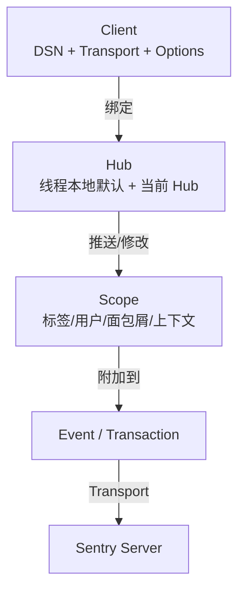

> **Rust 版本**: 1.96.0+ (Edition 2024)
>
> **状态**: ✅ 已完成
>
> **概念族**: Crate 架构 / sentry
>
> **层级**: L3-L5

---

# sentry Crate 架构解构 {#sentry-crate-架构解构}

> **最后更新**: 2026-06-29
>
> **内容分级**: [归档级]
>
> **分级**: [B]
>
> **Bloom 层级**: L3-L5 (应用/分析/评价)
>
> **知识领域**: 可观测性、错误追踪、分布式追踪、崩溃报告
>
> **对应 Rust 版本**: 1.96.0+ (sentry 0.48+)

---

## 1. 引言：Rust Sentry 客户端的生态定位 {#1-引言rust-sentry-客户端的生态定位}

> **[来源: [sentry crates.io](https://crates.io/crates/sentry)]**

`sentry` crate 是 [Sentry](https://sentry.io/) 官方提供的 Rust 客户端，用于捕获错误、异常、崩溃、性能事务（Performance Transactions）与自定义消息，并将它们发送到 Sentry 服务端进行聚合、告警与分析。它是 Rust 生态中生产级可观测性栈的核心组件之一。

> [来源: [sentry docs.rs](https://docs.rs/sentry/latest/sentry/)]

与纯日志库或纯指标库不同，Sentry 的设计哲学是**"事件为中心、范围（Scope）为上下文、Hub 为并发边界"**：

| 维度 | 设计选择 | 工程价值 |
|:--|:--|:--|
| **数据模型** | Event / Breadcrumb / Transaction / Span | 将错误、上下文与性能追踪统一为事件流 |
| **并发模型** | 线程本地 `Hub` + 全局默认 `Hub` | 在异步/多线程场景下隔离上下文 |
| **集成能力** | panic、tracing、anyhow、tower、actix 等可选集成 | 不改变业务代码即可捕获关键信号 |
| **传输层** | 默认 `reqwest` + `native-tls` / `rustls` 可选 | 与现有 HTTP/TLS 栈对齐 |
| **初始化模型** | `sentry::init` 返回 `ClientInitGuard`，drop 时 flush | RAII 保证退出时事件不丢失 |

> [来源: [sentry-rust GitHub Repository](https://github.com/getsentry/sentry-rust)]

```rust,ignore
let _guard = sentry::init((
    "https://key@sentry.io/42",
    sentry::ClientOptions { release: sentry::release_name!(), ..Default::default() },
));
sentry::capture_message("Hello World!", sentry::Level::Info);
```

> [来源: [sentry Examples](https://github.com/getsentry/sentry-rust/tree/master/sentry/examples)]

---

## 2. 核心 API 架构 {#2-核心-api-架构}

> **[来源: [The Rust Programming Language](https://doc.rust-lang.org/book/)]**

### 2.1 三层运行时模型：Client / Hub / Scope {#21-三层运行时模型client-hub-scope}



> [来源: [sentry Hub Docs](https://docs.rs/sentry/latest/sentry/struct.Hub.html)]

| 类型 | 职责 | 关键方法 |
|:--|:--|:--|
| `Client` | 持有 DSN、传输层、采样率、before-send 钩子 | `sentry::init` 构建并绑定到 Hub |
| `Hub` | 管理当前线程/异步任务关联的 Client 与 Scope 栈 | `Hub::current`, `Hub::with` |
| `Scope` | 为事件附加上下文：tags、user、breadcrumbs、extra、contexts | `configure_scope`, `with_scope` |
| `Event` | 上报单元：异常、消息、线程、堆栈等 | `capture_event`, `capture_error` |
| `Transaction` / `Span` | 性能监控：追踪请求生命周期 | `start_transaction`, `start_child`, `finish` |

> [来源: [sentry Client Docs](https://docs.rs/sentry/latest/sentry/struct.Client.html)]

### 2.2 初始化与 Guard {#22-初始化与-guard}

`sentry::init` 接受多种配置形式（DSN 字符串、`ClientOptions`、tuple 等），返回的 guard 必须在作用域内保持存活：

```rust,ignore
let _guard = sentry::init(("https://key@sentry.io/42", sentry::ClientOptions {
    release: sentry::release_name!(),
    traces_sample_rate: 1.0,
    ..Default::default()
}));
```

> [来源: [sentry init Docs](https://docs.rs/sentry/latest/sentry/fn.init.html)]

### 2.3 错误与消息捕获 {#23-错误与消息捕获}

```rust,ignore
sentry::capture_message("deployment completed", sentry::Level::Info);

if let Err(e) = do_something().await {
    sentry::capture_error(&e);
}
```

> [来源: [sentry capture_error Docs](https://docs.rs/sentry/latest/sentry/fn.capture_error.html)]

### 2.4 Scope 与 Breadcrumb {#24-scope-与-breadcrumb}

Scope 用于为当前或单次事件附加上下文：

```rust,ignore
sentry::configure_scope(|scope| {
    scope.set_tag("environment", "production");
    scope.set_user(Some(sentry::User {
        id: Some("42".into()),
        username: Some("alice".into()),
        ..Default::default()
    }));
    scope.add_breadcrumb(sentry::Breadcrumb {
        message: Some("user clicked checkout".into()),
        ..Default::default()
    });
});
```

> [来源: [sentry Scope Docs](https://docs.rs/sentry/latest/sentry/struct.Scope.html)]

### 2.5 性能监控：Transaction 与 Span {#25-性能监控transaction-与-span}

```rust,ignore
let ctx = sentry::TransactionContext::new("process_order", "http.request");
let tx = sentry::start_transaction(ctx);
{
    let _span = tx.start_child("db", "save_order");
    db.save(&order).await?;
}
tx.finish();
```

> [来源: [sentry Performance Docs](https://docs.sentry.io/platforms/rust/performance/)]

---

## 3. 类型系统利用 {#3-类型系统利用}

> **[来源: [Rust Reference](https://doc.rust-lang.org/reference/)]**

| 维度 | API | 类型系统价值 |
|:--|:--|:--|
| 初始化 Guard | `ClientInitGuard` | RAII 保证 Client 生命周期与 flush 行为 |
| Hub 绑定 | `SentryFuture` / `SentryFutureExt` | 在异步 Future 执行期间静态绑定 Hub |
| Scope 修改 | `configure_scope<F: FnOnce(&mut Scope)>` | 编译期保证 Scope 借用的独占性 |
| 事件构造 | `Event<'static>` / `protocol` 模块 | 将动态 JSON 事件约束为类型化结构 |
| 集成 trait | `Integration` | 通过 trait 对象扩展 panic/tracing/anyhow 等集成 |

> [来源: [sentry API docs](https://docs.rs/sentry/latest/sentry/)]

---

## 4. 反例边界 {#4-反例边界}

> **[来源: [Rustonomicon](https://doc.rust-lang.org/nomicon/)]**

| 反例 | 错误表现 | 正确做法 |
|:--|:--|:--|
| 丢弃 `ClientInitGuard` 后立即发送事件 | 事件未 flush 即进程退出 | 保持 guard 存活到 `main` 结束 |
| 在异步任务中不绑定 Hub | 事件丢失当前请求上下文 | 使用 `SentryFutureExt::bind_hub` 或集成中间件 |
| 高基数标签（如用户 ID）作为 tag | Sentry 标签爆炸、查询性能下降 | 将高基数数据放入 `extra` 或 `contexts` |
| 在循环中无采样地捕获大量相同错误 | 配额迅速耗尽、噪音淹没真正问题 | 配置 `before_send` 去重或 `sample_rate` |
| 忽略 `Level::Debug` 等低级别事件 | 关键上下文缺失 | 根据环境配置合适的最小级别 |
| 硬编码 DSN | 凭证泄露 | 通过环境变量 `SENTRY_DSN` 注入 |
| 未在退出前 finish transaction | 性能数据不完整 | 确保 transaction/span 在请求结束时调用 `finish` |

> [来源: [Sentry Data Management Best Practices](https://docs.sentry.io/product/data-management-settings/)]

---

## 5. 代码示例锚点 {#5-代码示例锚点}

> **[来源: [Rust By Example](https://doc.rust-lang.org/rust-by-example/)]**

| 示例 | 文件 | 说明 |
|:--|:--|:--|
| 错误捕获与性能监控 | [`crates/c06_async/examples/sentry_error_capture.rs`](../../../../crates/c06_async/examples/sentry_error_capture.rs) | init、capture_message/capture_error、scope、transaction |

> [来源: [c06_async Crate](../../../../crates/c06_async/README.md)]

---

## 6. 相关架构与延伸阅读 {#6-相关架构与延伸阅读}

> **[来源: [Rust Cookbook](https://rust-lang-nursery.github.io/rust-cookbook/)]**

- [Tokio 异步运行时架构](06_tokio_architecture.md)
- [Tracing 可观测性架构](18_tracing_architecture.md) — 与 sentry-tracing 集成
- [Tower 中间件抽象架构](02_tower_architecture.md) — sentry-tower 集成
- [错误处理深入](../../../../concept/02_intermediate/15_error_handling_deep_dive.md)
- [异步编程模型](../../../../concept/03_advanced/02_async.md)

---

## 权威来源索引 {#权威来源索引}

> **[来源: [sentry crates.io](https://crates.io/crates/sentry)]**
>
> **[来源: [sentry docs.rs](https://docs.rs/sentry/latest/sentry/)]**
>
> **[来源: [sentry-rust GitHub](https://github.com/getsentry/sentry-rust)]**
>
> **[来源: [Sentry 官方文档](https://docs.sentry.io/platforms/rust/)]**
>
> **[来源: [The Rust Programming Language](https://doc.rust-lang.org/book/)]**
>
> **权威来源**: [sentry crates.io](https://crates.io/crates/sentry), [sentry docs.rs](https://docs.rs/sentry/latest/sentry/), [Sentry 官方文档](https://docs.sentry.io/platforms/rust/)
>
> **权威来源对齐变更日志**: 2026-06-29 创建 Sentry 生态专题，对齐 sentry-rust 官方文档与 Sentry 平台参考

---

## 权威来源参考 {#权威来源参考}

> **P0（官方/必读）**:
>
> - [来源: [sentry Documentation](https://docs.rs/sentry/latest/sentry/)]
> - [来源: [sentry crates.io](https://crates.io/crates/sentry)]
> - [来源: [Sentry Rust Platform Docs](https://docs.sentry.io/platforms/rust/)]

> **P1（学术论文/演讲）**:
>
> - [来源: [Exception Handling in Event-Driven Programs](https://dl.acm.org/doi/10.1145/2660193.2660205)] — 错误聚合与上下文理论基础
> - [来源: [Dapper, a Large-Scale Distributed Systems Tracing Infrastructure](https://dl.acm.org/doi/10.5555/2488256.2488257)] — 分布式追踪基础

> **P2（仓库/社区文章）**:
>
> - [来源: [sentry-rust GitHub Repository](https://github.com/getsentry/sentry-rust)]
> - [来源: [Sentry Blog](https://blog.sentry.io/)]
> - [来源: [This Week in Rust](https://this-week-in-rust.org/)]

## 学术权威参考 {#学术权威参考}

- [RustBelt](https://plv.mpi-sws.org/rustbelt/popl18/)
- [Aeneas](https://aeneas-verification.github.io/)
- [Oxide](https://arxiv.org/abs/1903.00982)
