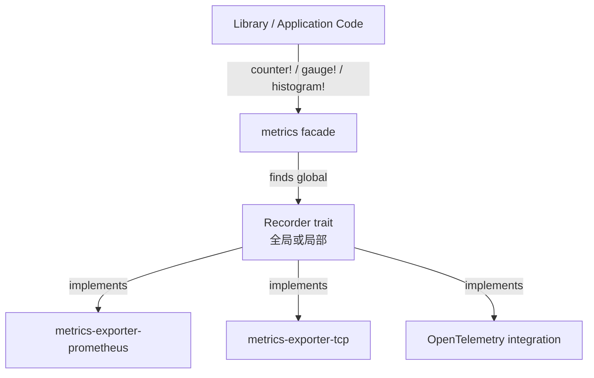

> **Canonical 说明**: 本文件专注 **metrics 指标门面与 Prometheus 导出的 Recorder trait 架构**。
>
> 若只需要使用指南与生态定位，请优先参考：
>
> - [日志与可观测性](../../../../concept/06_ecosystem/00_toolchain/13_logging_observability.md)
>
> 本文件保留架构级深度内容，与上述使用指南形成互补。
> **Rust 版本**: 1.96.1+ (Edition 2024)
>
> **状态**: ✅ 已完成
>
> **概念族**: Crate 架构 / metrics
>
> **层级**: L3-L5

---

# metrics Crate 架构解构 {#metrics-crate-架构解构}

> **EN**: Metrics Architecture
> **Summary**: metrics Crate 架构解构 Metrics Architecture.
> **最后更新**: 2026-06-29
>
> **内容分级**: [归档级]
>
> **分级**: [B]
>
> **Bloom 层级**: L3-L5 (应用/分析/评价)
>
> **知识领域**: 可观测性、指标、Prometheus、facade 模式
>
> **对应 Rust 版本**: 1.96.1+ (metrics 0.24+)

---

## 1. 引言：Rust 指标生态的门面（Facade） {#1-引言rust-指标生态的门面facade}

> **[来源: [metrics crates.io](https://crates.io/crates/metrics)]**

`metrics` crate 是 Rust 生态中最流行的**指标门面库**，提供一套统一的宏 API（`counter!`、`gauge!`、`histogram!` 与 `describe_*!`），将指标的记录逻辑与后端导出实现解耦。应用或库只需调用 `metrics` 的宏，实际的存储、聚合与导出由用户选择的 `Recorder` 实现（如 `metrics-exporter-prometheus`）完成。

> [来源: [metrics docs.rs](https://docs.rs/metrics/latest/metrics/)]

与直接使用 Prometheus、StatsD 或 OpenTelemetry SDK 不同，`metrics` 的设计哲学是**"库只发射、应用决定导出"**：

| 维度 | 设计选择 | 工程价值 |
|:--|:--|:--|
| **API 形态** | 过程宏（Procedural Macro） + 句柄类型（`Counter`/`Gauge`/`Histogram`） | 代码侵入性低，无需全局可变状态 |
| **后端解耦** | `Recorder` trait | 同一业务代码可在测试、本地 Prometheus、云监控之间切换 |
| **零成本默认** | 未安装 Recorder 时使用 noop recorder | 库可无负担埋点，不引入运行时开销 |
| **Key / Labels** | `Key` 组合名称与标签，`Label` 为字符串键值 | 支持高基数标签，但建议由 Recorder 过滤 |
| **导出生态** | Prometheus、TCP、OpenTelemetry 等 | 覆盖主流指标消费端 |

> [来源: [metrics GitHub Repository](https://github.com/metrics-rs/metrics)]

```rust,ignore
use metrics::{counter, histogram};

let start = std::time::Instant::now();
process_query().await;
histogram!("query_duration_seconds").record(start.elapsed().as_secs_f64());
counter!("queries_total", "op" => "search").increment(1);
```

> [来源: [metrics Examples](https://github.com/metrics-rs/metrics/tree/main/metrics/examples)]

---

## 2. 核心 API 架构 {#2-核心-api-架构}

> **[来源: [The Rust Programming Language](https://doc.rust-lang.org/book/)]**

### 2.1 Facade + Recorder 两层模型 {#21-facade-recorder-两层模型}



> [来源: [metrics Recorder Docs](https://docs.rs/metrics/latest/metrics/trait.Recorder.html)]

| 类型 | 职责 | 关键方法 |
|:--|:--|:--|
| `counter!` / `gauge!` / `histogram!` | 用户侧宏，返回句柄 | `.increment(n)`, `.set(v)`, `.record(v)` |
| `describe_counter!` / `describe_gauge!` / `describe_histogram!` | 注册指标元数据 | 提供 unit/description |
| `Recorder` trait | 后端实现接口 | `register_counter`, `register_gauge`, `register_histogram`, `record_histogram` |
| `Key` | 指标标识 = 名称 + 有序 labels | 由宏隐式构造 |
| `Counter` / `Gauge` / `Histogram` | 句柄类型 | 对 Recorder 的轻量封装 |

> [来源: [metrics Macro Docs](https://docs.rs/metrics/latest/metrics/macro.counter.html)]

### 2.2 指标类型 {#22-指标类型}

`metrics` 仅定义三种基础类型，覆盖绝大多数可观测性场景：

| 类型 | 语义 | 句柄操作 |
|:--|:--|:--|
| **Counter** | 单调递增计数器（重启可归零） | `increment(n)`, `absolute(n)` |
| **Gauge** | 可任意升降的标量 | `increment(n)`, `decrement(n)`, `set(v)` |
| **Histogram** | 观测值分布（延迟、大小等） | `record(v)` |

> [来源: [metrics Kind Docs](https://docs.rs/metrics/latest/metrics/)]

### 2.3 安装 Recorder {#23-安装-recorder}

以 `metrics-exporter-prometheus` 为例：

```rust,ignore
use metrics_exporter_prometheus::PrometheusBuilder;

PrometheusBuilder::new()
    .with_http_listener("0.0.0.0:9090".parse()?)
    .install()?;
```

> [来源: [metrics-exporter-prometheus docs.rs](https://docs.rs/metrics-exporter-prometheus/latest/metrics_exporter_prometheus/)]

### 2.4 描述指标 {#24-描述指标}

`describe_*!` 宏可在 Recorder 中注册指标的元数据，便于在首次 emit 之前就暴露指标：

```rust,ignore
metrics::describe_counter!("http_requests_total", "Total number of HTTP requests");
metrics::describe_histogram!("http_request_duration_seconds", Unit::Seconds, "HTTP request latency");
```

> [来源: [metrics describe_counter Docs](https://docs.rs/metrics/latest/metrics/macro.describe_counter.html)]

---

## 3. 类型系统利用 {#3-类型系统利用}

> **[来源: [Rust Reference](https://doc.rust-lang.org/reference/)]**

| 维度 | API | 类型系统价值 |
|:--|:--|:--|
| 指标类型分离 | `Counter` / `Gauge` / `Histogram` 句柄 | 编译期防止对 histogram 调用 `increment` 等非法操作 |
| 键名静态化 | 宏接受 `&'static str` 名称 | 鼓励使用常量/静态键名，避免运行时构造 |
| 标签有序 | `Key` 保持标签插入顺序 | 相同标签集合以相同顺序构造时才等价 |
| Recorder 单例 | `set_global_recorder` / `install` | 类型系统（Type System） + 运行时共同保证全局唯一 |
| 零成本抽象（Zero-Cost Abstraction） | 无 Recorder 时为原子 load + compare | 不对未启用指标的场景引入额外开销 |

> [来源: [metrics API docs](https://docs.rs/metrics/latest/metrics/)]

---

## 4. 反例边界 {#4-反例边界}

> **[来源: [Rustonomicon](https://doc.rust-lang.org/nomicon/)]**

| 反例 | 错误表现 | 正确做法 |
|:--|:--|:--|
| 高基数标签使用动态值 | 内存与导出成本爆炸、查询变慢 | 将用户 ID、IP 等放入 tracing 日志或低采样指标 |
| 对 gauge 使用 `increment` 理解错误 | Gauge 不是 counter，语义混乱 | 外部测量值用 `set`，自增计数用 counter |
| 未安装 Recorder 就期望指标被收集 | 指标静默丢失 | 在 `main` 最早阶段安装 exporter |
| 重复安装全局 Recorder | 运行时（Runtime） panic 或后续安装被忽略 | 保证只调用一次 `install` |
| 标签顺序不一致 | 同一指标被 Recorder 视为不同时间序列 | 固定标签构造顺序 |
| histogram 使用非秒单位未说明 | Prometheus 等后端单位混乱 | 使用 `Unit::Seconds` 等语义单位，或在名称中体现 |
| 指标名称含非法字符 | 某些 exporter 会替换为下划线 | 遵循 snake_case，避免特殊字符 |

> [来源: [Prometheus Best Practices](https://prometheus.io/docs/practices/naming/)]

---

## 5. 代码示例锚点 {#5-代码示例锚点}

> **[来源: [Rust By Example](https://doc.rust-lang.org/rust-by-example/)]**

| 示例 | 文件 | 说明 |
|:--|:--|:--|
| 指标记录与 Prometheus 导出 | [`crates/c06_async/examples/metrics_basic_prometheus.rs`](../../../../crates/c06_async/examples/metrics_basic_prometheus.rs) | counter/gauge/histogram + PrometheusBuilder HTTP listener |

> [来源: [c06_async Crate](../../../../crates/c06_async/README.md)]

---

## 6. 相关架构与延伸阅读 {#6-相关架构与延伸阅读}

> **[来源: [Rust Cookbook](https://rust-lang-nursery.github.io/rust-cookbook/)]**

- [Tracing 可观测性架构](18_tracing_architecture.md) — 日志/追踪与指标互补
- [Sentry 错误追踪架构](33_sentry_architecture.md) — 错误事件与指标组合
- [日志与可观测性](../../../../concept/06_ecosystem/00_toolchain/13_logging_observability.md)
- [异步编程模型](../../../../concept/03_advanced/01_async/02_async.md)

---

## 权威来源索引 {#权威来源索引}

> **[来源: [metrics crates.io](https://crates.io/crates/metrics)]**
>
> **[来源: [metrics docs.rs](https://docs.rs/metrics/latest/metrics/)]**
>
> **[来源: [metrics-exporter-prometheus crates.io](https://crates.io/crates/metrics-exporter-prometheus)]**
>
> **[来源: [metrics-exporter-prometheus docs.rs](https://docs.rs/metrics-exporter-prometheus/latest/metrics_exporter_prometheus/)]**
>
> **[来源: [Prometheus 官方文档](https://prometheus.io/docs/)]**
>
> **[来源: [The Rust Programming Language](https://doc.rust-lang.org/book/)]**
>
> **权威来源**: [metrics crates.io](https://crates.io/crates/metrics), [metrics docs.rs](https://docs.rs/metrics/latest/metrics/), [Prometheus 官方文档](https://prometheus.io/docs/)
>
> **权威来源对齐变更日志**: 2026-06-29 创建 metrics 生态专题，对齐 metrics-rs 官方文档与 Prometheus 最佳实践

---

## 权威来源参考 {#权威来源参考}

> **P0（官方/必读）**:
>
> - [来源: [metrics Documentation](https://docs.rs/metrics/latest/metrics/)]
> - [来源: [metrics crates.io](https://crates.io/crates/metrics)]
> - [来源: [metrics-exporter-prometheus Documentation](https://docs.rs/metrics-exporter-prometheus/latest/metrics_exporter_prometheus/)]
> - [来源: [Prometheus Best Practices](https://prometheus.io/docs/practices/)]
> **P1（学术论文/演讲）**:
>
> - [来源: [Borgmon: Google’s Large-Scale Monitoring System](https://dl.acm.org/doi/10.1145/2741948.2741950)] — 白盒监控与指标理论基础
> - [来源: [Adaptive Thresholding for Monitoring](https://dl.acm.org/doi/10.1145/3190508.3190528)] — 指标告警策略参考
> **P2（仓库/社区文章）**:
>
> - [来源: [metrics-rs GitHub Repository](https://github.com/metrics-rs/metrics)]
> - [来源: [Prometheus Rust Client](https://github.com/prometheus/client_rust)] — 与直接 Prometheus client 对比参考
> - [来源: [This Week in Rust](https://this-week-in-rust.org/)]

## 学术权威参考 {#学术权威参考}

- [RustBelt](https://plv.mpi-sws.org/rustbelt/popl18/)
- [Aeneas](https://aeneas-verification.github.io/)
- [Oxide](https://arxiv.org/abs/1903.00982)
