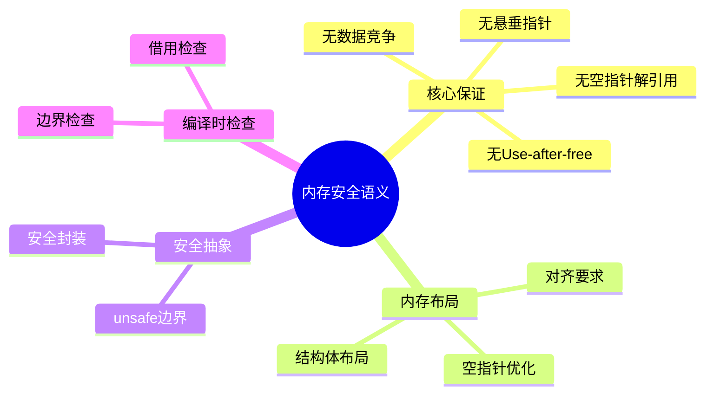

# 内存安全语义 {#内存安全语义}

> **EN**: Memory Safety Index
> **Summary**: 内存安全语义 Memory Safety Index. (stub/archive redirect)
> **分级**: [B]
> **Bloom 层级**: L5-L6 (分析/评价/创造)
> **创建日期**: 2026-02-20
> **最后更新**: 2026-06-25（已按 Rust 1.97.0 复审）
> **Rust 版本**: 1.97.0+ (Edition 2024)
> **状态**: ✅ 已完成
> 内容已整合至： [10_borrow_checker_proof.md](../../../research_notes/formal_methods/10_borrow_checker_proof.md)

## 知识结构思维导图 {#知识结构思维导图}
>
> **来源: [Rust Official Docs](https://doc.rust-lang.org/)**



## 与核心文档的关联 {#与核心文档的关联}
>
> **来源: [Rust Official Docs](https://doc.rust-lang.org/)**

| 本文档 | 核心文档 | 关系 |
| :--- | :--- | :--- |
| 本README | research_notes/formal_methods/10_borrow_checker_proof.md | 索引/重定向 |
| 本README | research_notes/10_safe_unsafe_comprehensive_analysis.md | 索引/重定向 |

[返回理论基础](../README.md) | [返回主索引](../../00_master_index.md)

---

## 内存安全的核心保证 {#内存安全的核心保证}
>
> **来源: [Rust Official Docs](https://doc.rust-lang.org/)**

Rust 通过所有权（Ownership）和借用（Borrowing）系统在编译时保证内存安全（Memory Safety）：

```rust
// 保证 1：无空指针解引用
fn no_null_deref() {
    let opt: Option<&i32> = None;
    // opt.unwrap();  // panic，但不会是未定义行为

    // 安全解包
    if let Some(val) = opt {
        println!("{}", val);
    }
}

// 保证 2：无悬垂指针
fn no_dangling_ptr() {
    let ptr: *const i32;
    {
        let x = 5;
        // ptr = &x;  // 错误：x 的生命周期不够长
    }  // x 在这里被释放
    // 使用 ptr 将是未定义行为
}

// 保证 3：无数据竞争
fn no_data_race() {
    use std::sync::Arc;
    use std::sync::Mutex;
    use std::thread;

    let data = Arc::new(Mutex::new(0));
    let mut handles = vec![];

    for _ in 0..10 {
        let data = Arc::clone(&data);
        handles.push(thread::spawn(move || {
            let mut num = data.lock().unwrap();
            *num += 1;  // 互斥访问保证无数据竞争
        }));
    }

    for h in handles {
        h.join().unwrap();
    }
}

// 保证 4：无 use-after-free
fn no_use_after_free() {
    let s = String::from("hello");
    let r = &s;
    drop(s);  // 错误：不能在有引用时丢弃所有者
    // println!("{}", r);
}
```

## 更多代码示例 {#更多代码示例}

### 内存布局与对齐 {#内存布局与对齐}

> **来源: [Rust Standard Library](https://doc.rust-lang.org/std/)**

```rust
// Rust 保证内存对齐安全
use std::mem;

fn memory_layout() {
    // 自动计算对齐
    println!("i32 对齐: {} 字节", mem::align_of::<i32>());
    println!("Vec<i32> 对齐: {} 字节", mem::align_of::<Vec<i32>>());

    // 结构体内存布局
    struct Point {
        x: f64,
        y: f64,
    }
    println!("Point 大小: {} 字节", mem::size_of::<Point>());

    // 枚举的判别式优化
    enum OptionU8 {
        Some(u8),
        None,
    }
    // Rust 使用空指针优化，Option<&T> 大小等于 &T
    println!("Option<&u8>: {} 字节", mem::size_of::<Option<&u8>>());
    println!("&u8: {} 字节", mem::size_of::<&u8>());
}
```

### 安全抽象边界 {#安全抽象边界}

> **来源: [Rust Standard Library](https://doc.rust-lang.org/std/)**

```rust
// 安全封装 unsafe 操作
pub struct SafeBuffer {
    ptr: *mut u8,
    len: usize,
    cap: usize,
}

impl SafeBuffer {
    // 安全的构造函数
    pub fn new(capacity: usize) -> Option<Self> {
        if capacity == 0 {
            return None;
        }
        // 在 unsafe 块内分配内存
        let layout = std::alloc::Layout::array::<u8>(capacity).ok()?;
        let ptr = unsafe { std::alloc::alloc(layout) };
        if ptr.is_null() {
            return None;
        }
        Some(Self { ptr, len: 0, cap: capacity })
    }

    // 安全地获取切片
    pub fn as_slice(&self) -> &[u8] {
        // SAFETY: ptr 有效，len 在范围内
        unsafe { std::slice::from_raw_parts(self.ptr, self.len) }
    }

    // 安全地写入数据
    pub fn push(&mut self, byte: u8) -> Result<(), &'static str> {
        if self.len >= self.cap {
            return Err("Buffer full");
        }
        // SAFETY: 已检查边界
        unsafe {
            *self.ptr.add(self.len) = byte;
        }
        self.len += 1;
        Ok(())
    }
}

impl Drop for SafeBuffer {
    fn drop(&mut self) {
        // SAFETY: 确保释放分配的资源
        unsafe {
            let layout = std::alloc::Layout::array::<u8>(self.cap).unwrap();
            std::alloc::dealloc(self.ptr, layout);
        }
    }
}
```

### 编译时内存安全检查 {#编译时内存安全检查}

> **来源: [POPL](https://www.sigplan.org/Conferences/POPL/)**

```rust
// Rust 编译器在编译时防止内存错误
fn compile_time_checks() {
    let data = vec![1, 2, 3];

    // 边界检查：运行时安全
    let idx = 5;
    // data[idx];  // panic，但不会导致缓冲区溢出

    // 使用 get 方法安全访问
    if let Some(val) = data.get(idx) {
        println!("Value: {}", val);
    }

    // 迭代器保证安全
    for item in &data {
        println!("{}", item);
    }
}

// 借用检查器防止 use-after-free
fn prevent_use_after_free() {
    let s = String::from("hello");
    let r = &s;
    // drop(s);  // 错误：不能在有引用时丢弃
    println!("{}", r);  // 保证 r 仍然有效
}
```

---

## 相关研究笔记 {#相关研究笔记}

| 文档 | 描述 | 路径 |
| :--- | :--- | :--- |
| 借用检查器证明 | 借用检查器的形式化正确性证明 | [../../../research_notes/formal_methods/10_borrow_checker_proof.md](../../../research_notes/formal_methods/10_borrow_checker_proof.md) |
| 所有权模型 | 所有权系统的形式化模型 | [../../../research_notes/formal_methods/10_ownership_model.md](../../../research_notes/formal_methods/10_ownership_model.md) |
| 安全/非安全分析 | unsafe Rust 的边界分析 | [../../../research_notes/10_safe_unsafe_comprehensive_analysis.md](../../../research_notes/10_safe_unsafe_comprehensive_analysis.md) |
| 证明索引 | 内存安全相关证明 | [../../../research_notes/10_proof_index.md](../../../../archive/research_notes_2026_06_25/10_proof_index.md) |
| 工具指南 | 内存安全验证工具 | [../../../research_notes/10_tools_guide.md](../../../../archive/research_notes_2026_06_25/10_tools_guide.md) |

---

> **权威来源**: [Rust Reference](https://doc.rust-lang.org/reference/), [The Rust Programming Language](https://doc.rust-lang.org/book/), [Rust Standard Library](https://doc.rust-lang.org/std/)
>
> **权威来源对齐变更日志**: 2026-05-19 新增 Rust Reference、TRPL、标准库官方来源标注 [Authority Source Sprint Batch 8](../../../../concept/00_meta/02_sources/international_authority_index.md)

**文档版本**: 1.1
**对应 Rust 版本**: 1.97.0+ (Edition 2024)
**最后更新**: 2026-06-25（已按 Rust 1.97.0 复审）
**状态**: ✅ 权威来源对齐完成 (Batch 8)

---

## 权威来源索引 {#权威来源索引}

> **来源: [Wikipedia - Formal Methods](https://en.wikipedia.org/wiki/Formal_Methods)**
> **来源: [Coq Reference](https://coq.inria.fr/doc/)**
> **来源: [TLA+](https://lamport.azurewebsites.net/tla/tla.html)**
> **来源: [ACM - Formal Verification](https://dl.acm.org/)**
> **来源: [Rust Reference - doc.rust-lang.org/reference](https://doc.rust-lang.org/reference/)**
> **来源: [The Rust Programming Language](https://doc.rust-lang.org/book/)**
