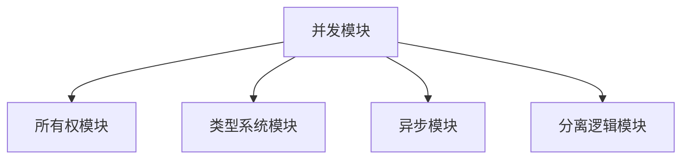

# 交叉引用自动检测说明

## 📊 目录

- [1. 交叉引用意义](#1-交叉引用意义)
- [2. 自动检测方法与工具](#2-自动检测方法与工具)
- [3. 脚本结构体体体与典型流程](#3-脚本结构体体体与典型流程)
- [4. 工程集成与CI流程](#4-工程集成与ci流程)
- [5. 工程经验与前沿趋势](#5-工程经验与前沿趋势)

## 1. 交叉引用意义

- 并发模块与所有权、类型系统、异步、分离逻辑等模块高度耦合，交叉引用有助于知识网络构建、错误检测、文档一致性维护。

## 2. 自动检测方法与工具

- **静态分析脚本**：扫描Markdown/代码文件，自动提取引用链接、锚点、交叉模块关系。
- **CI集成工具**：如markdown-link-check、doctoc、custom Python/Rust脚本。
- **知识网络可视化**：Mermaid/Graphviz生成主题地图，展示模块间引用关系。

## 3. 脚本结构体体体与典型流程

- 解析文档目录，提取所有`[链接文本](目标路径)`、`#锚点`。
- 检查引用目标是否存在、是否失效。
- 统计交叉引用密度，生成知识网络图。
- 典型脚本片段：

```python
import re, os
for root, _, files in os.walk('formal_rust/language/'):
    for f in files:
        if f.endswith('.md'):
            with open(os.path.join(root, f), encoding='utf-8') as file:
                for line in file:
                    for m in re.finditer(r'\[.*?\]\((.*?)\)', line):
                        print(f"Found link: {m.group(1)} in {f}")
```

- Mermaid可视化示例：



## 4. 工程集成与CI流程

- 在CI流程中自动运行交叉引用检测脚本，发现失效链接、孤立文档、引用循环。
- 生成交叉引用报告与知识网络图，辅助文档维护与知识梳理。

## 5. 工程经验与前沿趋势

- 持续集成自动检测，提升文档一致性与可维护性。
- 结合主题地图、知识网络可视化，辅助知识管理与工程协作。
- 未来值值值趋势：AI驱动的语义交叉引用检测、自动修复、知识图谱集成。

---

> 本文档将持续递归补充，欢迎结合最新理论、自动化脚本、工程案例、可视化工具、前沿趋势递交补充，推动Rust并发模块交叉引用自动检测体系不断进化。

"

---
