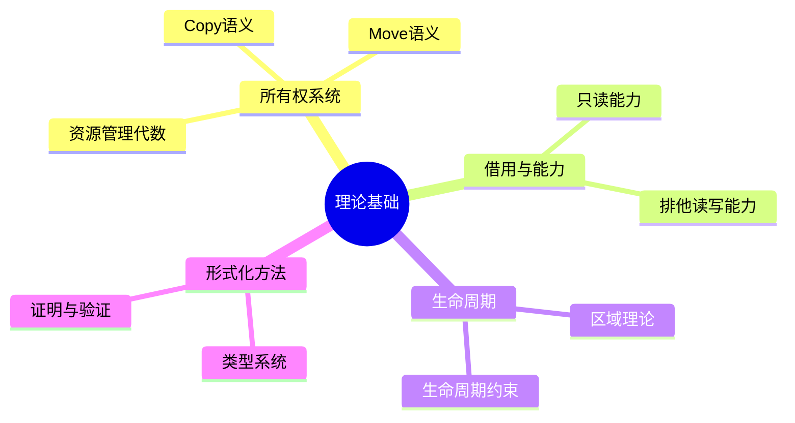

# 理论基础 {#理论基础}

> **EN**: Theoretical Foundations Index
> **Summary**: 理论基础 Theoretical Foundations Index. (stub/archive redirect)
> **分级**: [B]
> **Bloom 层级**: L5-L6
> **创建日期**: 2026-02-20
> **最后更新**: 2026-06-25（已按 Rust 1.97.0 复审）
> **Rust 版本**: 1.97.0+ (Edition 2024)
> **状态**: ✅ 已完成
> 内容已整合至研究笔记，请参见：

| 主题 | 链接 |
| :--- | :--- |
| 类型系统（Type System） | [type_theory/](../../research_notes/type_theory/README.md) |
| 所有权（Ownership）与借用（Borrowing） | [formal_methods/](../../../archive/research_notes_2026_06_25/formal_methods/README.md) |
| 所有权模型 | [10_ownership_model.md](../../research_notes/formal_methods/10_ownership_model.md) |
| 借用检查器 | [10_borrow_checker_proof.md](../../research_notes/formal_methods/10_borrow_checker_proof.md) |
| 生命周期（Lifetimes） | 10_lifetime_formalization.md |
| Trait 系统 | [10_trait_system_formalization.md](../../../archive/research_notes_2026_06_25/type_theory/10_trait_system_formalization.md) |
| 型变理论 | [10_variance_theory.md](../../research_notes/type_theory/10_variance_theory.md) |

---

## 核心理论概念 {#核心理论概念}
>
> **来源: [Rust Official Docs](https://doc.rust-lang.org/)**

### 所有权系统的数学基础 {#所有权系统的数学基础}
>
> **来源: [Rust Official Docs](https://doc.rust-lang.org/)**

Rust 的所有权系统可以形式化为资源管理代数：

```rust
// 所有权作为线性类型的实现
// 每个值在其生命周期内满足：|owners| ≤ 1

// 所有权转移（Move语义）
fn move_semantics() {
    let v = vec![1, 2, 3];  // v 获得所有权
    let v2 = v;              // 所有权从 v 转移到 v2
    // v 现在处于未初始化状态
    drop(v2);                // 所有权随 v2 的 drop 结束
}

// Copy 类型：隐式克隆语义
fn copy_semantics() {
    let x: i32 = 5;     // i32 实现 Copy
    let y = x;           // x 被复制到 y，x 仍然有效
    println!("x = {}, y = {}", x, y);  // 两者都可用
}
```

### 借用作为能力（Capability） {#借用作为能力capability}
>
> **来源: [Rust Official Docs](https://doc.rust-lang.org/)**

借用可以建模为对资源访问的能力：

```rust
// 不可变借用 = 只读能力
// 可变借用 = 读写能力（排他）

fn capabilities_demo() {
    let mut data = vec![1, 2, 3];

    // 获取多个只读能力
    let r1: &[i32] = &data;  // 读能力 1
    let r2: &[i32] = &data;  // 读能力 2
    println!("{} {}", r1[0], r2[0]);

    // 读能力释放后，获取读写能力
    let r3: &mut [i32] = &mut data;  // 排他读写能力
    r3[0] = 10;
}
```

### 生命周期作为区域（Region） {#生命周期作为区域region}

生命周期可以形式化为程序执行中的时间区域：

```rust
// 显式生命周期标注
// 'a 表示一个生命周期区域

fn longest<'a>(x: &'a str, y: &'a str) -> &'a str {
    // 返回的引用至少与 x 和 y 中较短的生命周期一样长
    if x.len() > y.len() { x } else { y }
}

// 生命周期约束
struct Parser<'input> {
    text: &'input str,  // Parser 不能比 text 活得长
}

impl<'input> Parser<'input> {
    fn new(text: &'input str) -> Self {
        Self { text }
    }
}
```

## 知识结构思维导图 {#知识结构思维导图}



## 与核心文档的关联 {#与核心文档的关联}

| 本文档 | 核心文档 | 关系 |
| :--- | :--- | :--- |
| 本README | research_notes/formal_methods/ | 索引/重定向 |
| 本README | research_notes/type_theory/ | 索引/重定向 |

[返回主索引](../00_master_index.md)

---

## 形式化链接 {#形式化链接}

### 理论基础文档 {#理论基础文档}

| 主题 | 文档路径 | 关键概念 |
| :--- | :--- | :--- |
| **类型系统（Type System）基础** | [../../research_notes/type_theory/10_type_system_foundations.md](../../../archive/research_notes_2026_06_25/type_theory/10_type_system_foundations.md) | Curry-Howard 对应、类型推导 |
| **所有权模型** | [../../research_notes/formal_methods/10_ownership_model.md](../../research_notes/formal_methods/10_ownership_model.md) | 线性类型、资源管理代数 |
| **借用检查器** | [../../research_notes/formal_methods/10_borrow_checker_proof.md](../../research_notes/formal_methods/10_borrow_checker_proof.md) | 借用规则、不变式证明 |
| **生命周期形式化** | ../../research_notes/formal_methods/10_lifetime_formalization.md | 区域理论、生命周期约束 |
| **Trait 形式化** | [../../research_notes/type_theory/10_trait_system_formalization.md](../../../archive/research_notes_2026_06_25/type_theory/10_trait_system_formalization.md) | 类型类、关联类型 |
| **型变理论** | [../../research_notes/type_theory/10_variance_theory.md](../../research_notes/type_theory/10_variance_theory.md) | 协变/逆变/不变规则 |

### 证明与工具 {#证明与工具}

| 资源 | 路径 |
| :--- | :--- |
| 形式化证明索引 | [../../research_notes/10_proof_index.md](../../../archive/research_notes_2026_06_25/10_proof_index.md) |
| 验证工具指南 | [../../research_notes/10_tools_guide.md](../../../archive/research_notes_2026_06_25/10_tools_guide.md) |
| 安全/非安全分析 | [../../research_notes/10_safe_unsafe_comprehensive_analysis.md](../../research_notes/10_safe_unsafe_comprehensive_analysis.md) |

---

> **权威来源**: [Rust Reference](https://doc.rust-lang.org/reference/), [The Rust Programming Language](https://doc.rust-lang.org/book/), [Rust Standard Library](https://doc.rust-lang.org/std/)
>
> **权威来源对齐变更日志**: 2026-05-19 新增 Rust Reference、TRPL、标准库官方来源标注 [Authority Source Sprint Batch 8](../../../concept/00_meta/02_sources/international_authority_index.md)

**文档版本**: 1.1
**对应 Rust 版本**: 1.97.0+ (Edition 2024)
**最后更新**: 2026-06-25（已按 Rust 1.97.0 复审）
**状态**: ✅ 权威来源对齐完成 (Batch 8)

---

## 权威来源索引 {#权威来源索引}

> **来源: [Wikipedia - Rust (programming language)](https://en.wikipedia.org/wiki/Rust_(programming_language))**
> **来源: [Rust Reference](https://doc.rust-lang.org/reference/)**
> **来源: [The Rust Programming Language](https://doc.rust-lang.org/book/)**
> **来源: [Rust Standard Library](https://doc.rust-lang.org/std/)**
> **来源: [ACM](https://dl.acm.org/)**
> **来源: [IEEE](https://standards.ieee.org/)**
> **来源: [Rust RFCs](https://github.com/rust-lang/rfcs)**
> **来源: [Rustonomicon](https://doc.rust-lang.org/nomicon/)**
