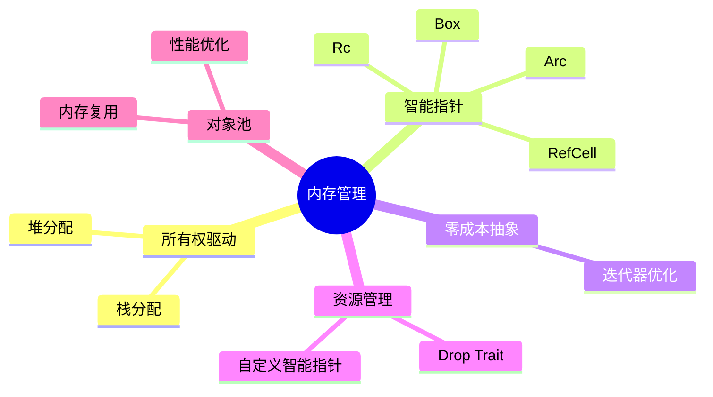

# 内存管理理论

> **创建日期**: 2026-02-20
> **最后更新**: 2026-02-20
> **Rust 版本**: 1.93.0+ (Edition 2024)
> **状态**: ✅ 已完成
> 内容已整合至： [memory_analysis.md](../../../../research_notes/experiments/memory_analysis.md)

## 知识结构思维导图



## 与核心文档的关联

| 本文档 | 核心文档 | 关系 |
|:---|:---|:---|
| 本README | research_notes/experiments/memory_analysis.md | 索引/重定向 |
| 本README | research_notes/formal_methods/ownership_model.md | 索引/重定向 |

[返回主索引](../../00_master_index.md)

---

## Rust 内存管理模型

### 所有权驱动的内存管理

```rust
// 栈分配：自动管理
fn stack_allocation() {
    let x = 5;           // i32 存储在栈上
    let arr = [1, 2, 3]; // 固定大小数组，栈上
}  // 自动释放

// 堆分配：通过所有权管理
fn heap_allocation() {
    let s = Box::new(5);     // Box：独占所有权
    let v = vec![1, 2, 3];   // Vec：动态数组
    let s = String::from("hello"); // String：可变字符串
}  // 自动调用 drop，释放堆内存
```

### 智能指针

```rust
use std::rc::Rc;
use std::sync::Arc;
use std::cell::RefCell;

// Box<T>：堆上单个所有者
fn box_demo() {
    let b = Box::new(5);
    println!("{}", b);
}

// Rc<T>：引用计数（单线程共享）
fn rc_demo() {
    let data = Rc::new(vec![1, 2, 3]);
    let data2 = Rc::clone(&data);  // 引用计数 +1
    println!("count: {}", Rc::strong_count(&data));  // 2
}

// Arc<T>：原子引用计数（多线程共享）
fn arc_demo() {
    let data = Arc::new(vec![1, 2, 3]);
    let data2 = Arc::clone(&data);
    std::thread::spawn(move || {
        println!("{:?}", data2);
    });
}

// RefCell<T>：运行时借用检查
fn refcell_demo() {
    let cell = RefCell::new(vec![1, 2, 3]);
    cell.borrow_mut().push(4);  // 运行时检查
}
```

### 零成本抽象

```rust
// 迭代器是零成本抽象
fn zero_cost_iter() {
    let v = vec![1, 2, 3, 4, 5];

    // 编译器会优化为高效的循环
    let sum: i32 = v.iter()
        .filter(|&&x| x > 2)
        .map(|x| x * 2)
        .sum();

    // 等效于手写的优化循环
}
```

### 自定义智能指针与 Drop  trait

```rust
use std::ops::Deref;

// 自定义智能指针：跟踪资源生命周期
struct TrackedBox<T> {
    data: Box<T>,
    name: String,
}

impl<T> TrackedBox<T> {
    fn new(data: T, name: &str) -> Self {
        println!("[{}] Creating tracked box", name);
        Self {
            data: Box::new(data),
            name: name.to_string(),
        }
    }
}

impl<T> Deref for TrackedBox<T> {
    type Target = T;
    fn deref(&self) -> &Self::Target {
        &self.data
    }
}

impl<T> Drop for TrackedBox<T> {
    fn drop(&mut self) {
        println!("[{}] Dropping tracked box", self.name);
    }
}

// 使用示例
fn custom_smart_pointer_demo() {
    let tracked = TrackedBox::new(vec![1, 2, 3], "my_vec");
    println!("Data: {:?}", *tracked);
    // tracked 离开作用域时自动调用 drop
}
```

### 内存池与对象复用

```rust
use std::sync::Mutex;

// 简单的对象池模式
struct ObjectPool<T> {
    pool: Mutex<Vec<T>>,
    create: Box<dyn Fn() -> T + Send>,
}

impl<T: Send> ObjectPool<T> {
    fn new<F>(create: F) -> Self
    where
        F: Fn() -> T + Send + 'static,
    {
        Self {
            pool: Mutex::new(Vec::new()),
            create: Box::new(create),
        }
    }

    fn acquire(&self) -> T {
        self.pool.lock().unwrap().pop().unwrap_or_else(|| (self.create)())
    }

    fn release(&self, obj: T) {
        self.pool.lock().unwrap().push(obj);
    }
}

// 使用示例
fn object_pool_demo() {
    let pool = ObjectPool::new(|| vec![0u8; 1024]); // 1KB 缓冲区池

    let mut buf = pool.acquire();
    buf.fill(1);
    // 使用缓冲区...

    pool.release(buf); // 归还到池中复用
}
```

---

## 使用场景

| 场景 | 内存管理策略 | 推荐类型 |
| :--- | :--- | :--- |
| 单线程独享资源 | 所有权转移 | `Box<T>` |
| 单线程共享数据 | 引用计数 | `Rc<T>` |
| 多线程共享数据 | 原子引用计数 | `Arc<T>` |
| 内部可变性（单线程） | 运行时借用检查 | `RefCell<T>` |
| 内部可变性（多线程） | 原子操作 | `Mutex<T>`, `RwLock<T>` |
| 大对象延迟初始化 | 懒加载模式 | `Lazy<T>`, `OnceCell` |
| 高频分配/释放 | 对象池 | 自定义 `ObjectPool<T>` |
| 内存映射文件 | 操作系统抽象 | `Mmap` (memmap2 crate) |

---

## 相关研究笔记

### 实验分析

| 文档 | 描述 | 路径 |
| :--- | :--- | :--- |
| 内存分析 | 内存使用分析实验 | [../../../../research_notes/experiments/memory_analysis.md](../../../../research_notes/experiments/memory_analysis.md) |
| 编译器优化 | 内存相关编译器优化 | [../../../../research_notes/experiments/compiler_optimizations.md](../../../../research_notes/experiments/compiler_optimizations.md) |

### 形式化方法

| 文档 | 描述 | 路径 |
| :--- | :--- | :--- |
| 所有权模型 | 所有权系统形式化 | [../../../../research_notes/formal_methods/ownership_model.md](../../../../research_notes/formal_methods/ownership_model.md) |
| 生命周期形式化 | 生命周期系统理论 | [../../../../research_notes/formal_methods/lifetime_formalization.md](../../../../research_notes/formal_methods/lifetime_formalization.md) |

### 类型理论

| 文档 | 描述 | 路径 |
| :--- | :--- | :--- |
| 类型系统基础 | 类型系统理论 | [../../../../research_notes/type_theory/type_system_foundations.md](../../../../research_notes/type_theory/type_system_foundations.md) |
| 生命周期形式化 | 生命周期类型理论 | [../../../../research_notes/type_theory/lifetime_formalization.md](../../../../research_notes/type_theory/lifetime_formalization.md) |
| 方差理论 | 类型方差与内存安全 | [../../../../research_notes/type_theory/variance_theory.md](../../../../research_notes/type_theory/variance_theory.md) |

### 安全分析

| 文档 | 描述 | 路径 |
| :--- | :--- | :--- |
| 安全/非安全分析 | unsafe 内存操作分析 | [../../../../research_notes/SAFE_UNSAFE_COMPREHENSIVE_ANALYSIS.md](../../../../research_notes/SAFE_UNSAFE_COMPREHENSIVE_ANALYSIS.md) |

---

## 相关 crates

| crate | 描述 | 路径 |
| :--- | :--- | :--- |
| c04_memory | 内存管理实现 | [../../../../crates/c04_memory/](../../../../crates/c04_memory/) |
