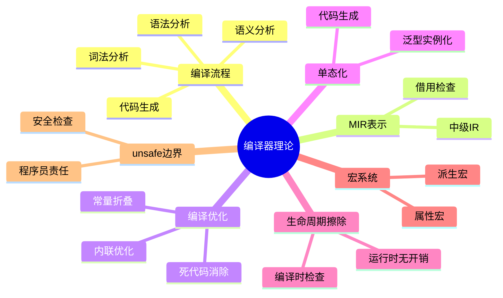

# 编译器理论

> **创建日期**: 2026-02-20
> **最后更新**: 2026-02-28
> **Rust 版本**: 1.93.1+ (Edition 2024)
> **状态**: ✅ 已完成
> 内容已整合至： [compiler_optimizations.md](../../research_notes/experiments/compiler_optimizations.md)、[01_compiler_features.md](../../06_toolchain/01_compiler_features.md)

## 知识结构思维导图



## 与核心文档的关联

| 本文档 | 核心文档 | 关系 |
| :--- | :--- | :--- |
| 本README | research_notes/experiments/compiler_optimizations.md | 索引/重定向 |
| 本README | 06_toolchain/01_compiler_features.md | 索引/重定向 |

[返回主索引](../00_master_index.md)

---

## Rust 编译器架构

### 编译流程

```text
源代码 (.rs)
    ↓
词法分析 → Token 流
    ↓
语法分析 → AST (抽象语法树)
    ↓
语义分析 → HIR (高级中间表示)
    ↓
类型检查 → 带类型注解的 HIR
    ↓
借用检查 → MIR (中级中间表示)
    ↓
MIR 优化 → 优化后的 MIR
    ↓
代码生成 → LLVM IR
    ↓
LLVM 优化 → 优化后的 LLVM IR
    ↓
目标代码生成 → 机器码
    ↓
链接器 → 可执行文件/库
```

### MIR（中级中间表示）

```rust
// Rust 代码
fn add(a: i32, b: i32) -> i32 {
    a + b
}

// 对应的 MIR（概念性表示）
// fn add(_1: i32, _2: i32) -> i32 {
//     let mut _0: i32;  // 返回值
//
//     bb0: {
//         _0 = Add(_1, _2);
//         return;
//     }
// }
```

### 借用检查的 MIR 分析

```rust
// 借用检查器在 MIR 上工作
fn borrow_check_example() {
    let mut x = 5;
    let y = &mut x;
    *y += 1;
    // 借用在这里结束
    println!("{}", x);  // 可以再次使用 x
}

// MIR 表示借用状态
// bb0: {
//     _1 = 5;              // x = 5
//     _2 = &mut _1;        // y = &mut x
//     *_2 = Add(*_2, 1);   // *y += 1
//     // _2 的生命周期结束
//     _3 = _1;             // 使用 x
// }
```

### 编译器优化

```rust
// 常量折叠
const fn const_fold() -> i32 {
    2 + 3 * 4  // 编译时计算为 14
}

// 内联优化
#[inline]
fn small_function(x: i32) -> i32 {
    x * 2
}

fn caller() -> i32 {
    small_function(5)  // 可能内联为 5 * 2 = 10
}

// 死代码消除
fn dead_code() {
    let x = 5;  // 未使用，会被消除
    println!("Hello");
}
```

### 泛型单态化

```rust
// 泛型定义
fn identity<T>(x: T) -> T {
    x
}

// 单态化后为每个类型生成独立代码
// fn identity_i32(x: i32) -> i32 { x }
// fn identity_f64(x: f64) -> f64 { x }
// fn identity_string(x: String) -> String { x }

fn monomorphization_demo() {
    let _ = identity(42i32);
    let _ = identity(3.14f64);
    let _ = identity(String::from("hello"));
}
```

### 生命周期擦除

```rust
// 源代码带生命周期注解
fn longest<'a>(x: &'a str, y: &'a str) -> &'a str {
    if x.len() > y.len() { x } else { y }
}

// 编译后生命周期被擦除
// 实际代码不包含生命周期信息
// fn longest(x: &str, y: &str) -> &str { ... }

// 生命周期仅在编译时检查，运行时不存在
fn lifetime_erasure() {
    let s1 = String::from("hello");
    let s2 = String::from("world");
    let result = longest(&s1, &s2);
    println!("{}", result);
}
```

### 属性宏与派生宏

```rust
// 过程宏示例
use proc_macro::TokenStream;

// 自定义 derive 宏
#[derive(Debug, Clone, PartialEq)]
struct Point {
    x: f64,
    y: f64,
}

// 属性宏
#[inline(always)]
fn hot_function() {}

#[cold]
fn cold_path() {}

// 条件编译
#[cfg(target_os = "linux")]
fn linux_only() {}

#[cfg(all(feature = "serde", not(feature = "minimal")))]
fn with_serde() {}

// 编译期断言
const _: () = assert!(std::mem::size_of::<usize>() == 8, "64-bit only");
```

### unsafe 代码检查边界

```rust
// 编译器确保 unsafe 块边界清晰
fn safe_wrapper(data: &[u8]) -> &[u8] {
    // 安全检查
    if data.len() < 4 {
        return &[];
    }

    // unsafe 块内部是程序员的责任
    unsafe {
        // 原始指针操作
        let ptr = data.as_ptr().add(2);
        std::slice::from_raw_parts(ptr, data.len() - 2)
    }
}

// unsafe trait 与 unsafe fn
unsafe trait Zeroable {
    fn zero() -> Self;
}

unsafe impl Zeroable for u32 {
    fn zero() -> Self { 0 }
}

unsafe fn very_dangerous() {
    // 调用者必须确保调用条件
}
```

---

## 使用场景

| 场景 | 编译器特性 | 应用 |
| :--- | :--- | :--- |
| 嵌入式开发 | `#[no_std]`, 代码大小优化 | 无运行时依赖 |
| 高性能计算 | SIMD, 循环展开, 向量化 | 数值计算加速 |
| WebAssembly | `--target wasm32-unknown-unknown` | 浏览器内运行 |
| 内核开发 | `#[no_std]`, 自定义 alloc | 操作系统内核 |
| 实时系统 | `const fn`, 编译期计算 | 确定性行为 |
| FFI 边界 | `extern "C"`, `repr(C)` | 与其他语言互操作 |
| 元编程 | 过程宏, 声明宏 | 代码生成 |
| 条件编译 | `cfg` 属性 | 多平台支持 |

---

## 相关研究笔记

### 实验分析

| 文档 | 描述 | 路径 |
| :--- | :--- | :--- |
| 编译器优化实验 | 编译器优化分析 | [../../research_notes/experiments/compiler_optimizations.md](../../research_notes/experiments/compiler_optimizations.md) |
| 内存分析 | 内存使用分析 | [../../research_notes/experiments/memory_analysis.md](../../research_notes/experiments/memory_analysis.md) |
| 性能基准 | 性能测试方法论 | [../../research_notes/experiments/performance_benchmarks.md](../../research_notes/experiments/performance_benchmarks.md) |

### 形式化方法

| 文档 | 描述 | 路径 |
| :--- | :--- | :--- |
| 借用检查证明 | 借用检查器形式化 | [../../research_notes/formal_methods/borrow_checker_proof.md](../../research_notes/formal_methods/borrow_checker_proof.md) |
| 所有权模型 | 所有权系统形式化 | [../../research_notes/formal_methods/ownership_model.md](../../research_notes/formal_methods/ownership_model.md) |
| 生命周期形式化 | 生命周期系统理论 | [../../research_notes/formal_methods/lifetime_formalization.md](../../research_notes/formal_methods/lifetime_formalization.md) |

### 类型理论

| 文档 | 描述 | 路径 |
| :--- | :--- | :--- |
| 类型系统基础 | 类型系统理论 | [../../research_notes/type_theory/type_system_foundations.md](../../research_notes/type_theory/type_system_foundations.md) |
| 高级类型 | 高级类型特性 | [../../research_notes/type_theory/advanced_types.md](../../research_notes/type_theory/advanced_types.md) |
| 变型理论 | 类型变型 | [../../research_notes/type_theory/variance_theory.md](../../research_notes/type_theory/variance_theory.md) |

### 工具链

| 文档 | 描述 | 路径 |
| :--- | :--- | :--- |
| 编译器特性 | 编译器配置与优化选项 | [../../06_toolchain/01_compiler_features.md](../../06_toolchain/01_compiler_features.md) |

---

## 相关 crates

| crate | 描述 | 路径 |
| :--- | :--- | :--- |
| c11_advanced | 高级特性实现 | [../../crates/c11_advanced/](../../crates/c11_advanced/README.md) |
| c12_macros | 宏系统实现 | [../../crates/c12_macros/](../../crates/c12_macros/README.md) |
