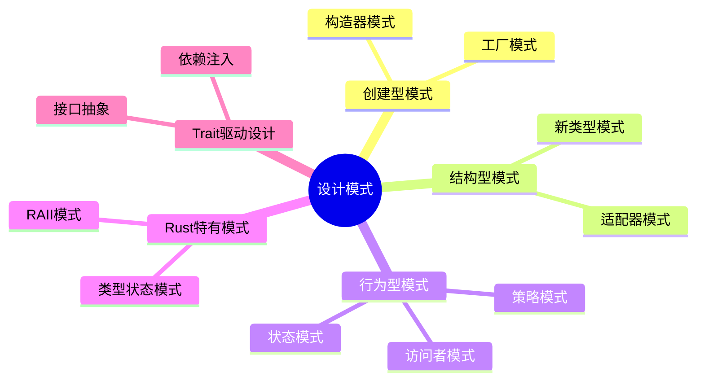

# 设计模式

> **创建日期**: 2026-02-20
> **最后更新**: 2026-02-20
> **Rust 版本**: 1.93.0+ (Edition 2024)
> **状态**: ✅ 已完成
> 内容已整合至： [c09_design_pattern/](../../../crates/c09_design_pattern/)

## 知识结构思维导图



## 与核心文档的关联

| 本文档 | 核心文档 | 关系 |
| :--- | :--- | :--- |
| 本README | crates/c09_design_pattern/ | 索引/重定向 |
| 本README | research_notes/software_design_theory/ | 索引/重定向 |

[返回主索引](../00_master_index.md)

---

## Rust 设计模式概览

### 类型系统驱动的模式

```rust
// 类型状态模式（Type State Pattern）
struct Door<State> {
    _state: std::marker::PhantomData<State>,
}

struct Closed;
struct Open;

impl Door<Closed> {
    fn new() -> Self {
        Self { _state: std::marker::PhantomData }
    }

    fn open(self) -> Door<Open> {
        Door { _state: std::marker::PhantomData }
    }
}

impl Door<Open> {
    fn close(self) -> Door<Closed> {
        Door { _state: std::marker::PhantomData }
    }

    fn walk_through(&self) {
        println!("Walking through the door");
    }
}

// 使用：编译时防止无效状态转换
fn type_state_demo() {
    let door = Door::new();
    let door = door.open();
    door.walk_through();
    let _door = door.close();
    // _door.walk_through();  // 编译错误：Closed 状态没有 walk_through
}
```

### 构造器模式

```rust
// 消耗型构造器（Consuming Builder）
struct HttpRequest {
    url: String,
    method: String,
    headers: Vec<(String, String)>,
}

struct HttpRequestBuilder {
    url: Option<String>,
    method: String,
    headers: Vec<(String, String)>,
}

impl HttpRequestBuilder {
    fn new() -> Self {
        Self {
            url: None,
            method: "GET".to_string(),
            headers: vec![],
        }
    }

    fn url(mut self, url: impl Into<String>) -> Self {
        self.url = Some(url.into());
        self
    }

    fn method(mut self, method: impl Into<String>) -> Self {
        self.method = method.into();
        self
    }

    fn header(mut self, key: impl Into<String>, value: impl Into<String>) -> Self {
        self.headers.push((key.into(), value.into()));
        self
    }

    fn build(self) -> Result<HttpRequest, String> {
        Ok(HttpRequest {
            url: self.url.ok_or("URL is required")?,
            method: self.method,
            headers: self.headers,
        })
    }
}

fn builder_demo() -> Result<(), String> {
    let request = HttpRequestBuilder::new()
        .url("https://example.com")
        .method("POST")
        .header("Content-Type", "application/json")
        .build()?;

    Ok(())
}
```

### RAII 模式

```rust
// 资源获取即初始化
struct FileGuard {
    path: String,
}

impl FileGuard {
    fn new(path: &str) -> std::io::Result<Self> {
        // 打开文件
        println!("Opening file: {}", path);
        Ok(Self {
            path: path.to_string(),
        })
    }
}

impl Drop for FileGuard {
    fn drop(&mut self) {
        // 自动清理
        println!("Closing file: {}", self.path);
    }
}

// 使用：自动资源管理
fn raii_demo() {
    let _file = FileGuard::new("data.txt").unwrap();
    // 使用文件...
}  // 自动调用 drop，关闭文件
```

### 策略模式（使用 Trait）

```rust
// 策略 trait
trait PaymentStrategy {
    fn pay(&self, amount: f64) -> Result<(), String>;
    fn fee(&self, amount: f64) -> f64;
}

// 具体策略
struct CreditCard {
    card_number: String,
}

impl PaymentStrategy for CreditCard {
    fn pay(&self, amount: f64) -> Result<(), String> {
        println!("Paying ${} with credit card {}", amount, self.card_number);
        Ok(())
    }

    fn fee(&self, amount: f64) -> f64 {
        amount * 0.02 // 2% 手续费
    }
}

struct PayPal {
    email: String,
}

impl PaymentStrategy for PayPal {
    fn pay(&self, amount: f64) -> Result<(), String> {
        println!("Paying ${} with PayPal {}", amount, self.email);
        Ok(())
    }

    fn fee(&self, amount: f64) -> f64 {
        amount * 0.03 // 3% 手续费
    }
}

// 上下文
struct ShoppingCart<'a> {
    items: Vec<(String, f64)>,
    payment_strategy: &'a dyn PaymentStrategy,
}

impl<'a> ShoppingCart<'a> {
    fn new(strategy: &'a dyn PaymentStrategy) -> Self {
        Self {
            items: vec![],
            payment_strategy: strategy,
        }
    }

    fn add_item(&mut self, name: &str, price: f64) {
        self.items.push((name.to_string(), price));
    }

    fn checkout(&self) -> Result<(), String> {
        let total: f64 = self.items.iter().map(|(_, price)| price).sum();
        let fee = self.payment_strategy.fee(total);
        let final_amount = total + fee;

        println!("Total: ${}, Fee: ${}, Final: ${}", total, fee, final_amount);
        self.payment_strategy.pay(final_amount)
    }
}

fn strategy_demo() {
    let credit_card = CreditCard {
        card_number: "1234-5678-9012-3456".to_string(),
    };

    let mut cart = ShoppingCart::new(&credit_card);
    cart.add_item("Book", 29.99);
    cart.add_item("Pen", 5.99);
    cart.checkout().unwrap();
}
```

### 访问者模式

```rust
// AST 节点 trait
trait Expr {
    fn accept(&self, visitor: &mut dyn ExprVisitor);
}

// 具体节点
struct Number {
    value: i32,
}

impl Expr for Number {
    fn accept(&self, visitor: &mut dyn ExprVisitor) {
        visitor.visit_number(self);
    }
}

struct Binary {
    left: Box<dyn Expr>,
    op: char,
    right: Box<dyn Expr>,
}

impl Expr for Binary {
    fn accept(&self, visitor: &mut dyn ExprVisitor) {
        visitor.visit_binary(self);
    }
}

// 访问者 trait
trait ExprVisitor {
    fn visit_number(&mut self, n: &Number);
    fn visit_binary(&mut self, b: &Binary);
}

// 求值访问者
struct Evaluator {
    result: i32,
}

impl ExprVisitor for Evaluator {
    fn visit_number(&mut self, n: &Number) {
        self.result = n.value;
    }

    fn visit_binary(&mut self, b: &Binary) {
        let mut left_eval = Evaluator { result: 0 };
        b.left.accept(&mut left_eval);

        let mut right_eval = Evaluator { result: 0 };
        b.right.accept(&mut right_eval);

        self.result = match b.op {
            '+' => left_eval.result + right_eval.result,
            '-' => left_eval.result - right_eval.result,
            '*' => left_eval.result * right_eval.result,
            '/' => left_eval.result / right_eval.result,
            _ => 0,
        };
    }
}

fn visitor_demo() {
    let expr = Binary {
        left: Box::new(Number { value: 10 }),
        op: '+',
        right: Box::new(Number { value: 20 }),
    };

    let mut evaluator = Evaluator { result: 0 };
    expr.accept(&mut evaluator);
    println!("Result: {}", evaluator.result); // 30
}
```

### 新类型模式（Newtype Pattern）

```rust
use std::fmt;

// 新类型包装，提供类型安全和自定义行为
#[derive(Clone, Copy, PartialEq, Eq, PartialOrd, Ord)]
struct UserId(u64);

#[derive(Clone, Copy, PartialEq, Eq, PartialOrd, Ord)]
struct ProductId(u64);

impl fmt::Display for UserId {
    fn fmt(&self, f: &mut fmt::Formatter<'_>) -> fmt::Result {
        write!(f, "U-{}", self.0)
    }
}

impl fmt::Display for ProductId {
    fn fmt(&self, f: &mut fmt::Formatter<'_>) -> fmt::Result {
        write!(f, "P-{}", self.0)
    }
}

// 类型安全：UserId 和 ProductId 不能互换
fn find_user(id: UserId) -> Option<String> {
    Some(format!("User {}", id))
}

fn find_product(id: ProductId) -> Option<String> {
    Some(format!("Product {}", id))
}

fn newtype_demo() {
    let user_id = UserId(42);
    let product_id = ProductId(42);

    println!("{}", user_id);      // U-42
    println!("{}", product_id);   // P-42

    find_user(user_id);
    // find_user(product_id);  // 编译错误！
}
```

---

## 使用场景

| 场景 | 设计模式 | 优势 |
| :--- | :--- | :--- |
| 状态机实现 | 类型状态模式 | 编译时状态检查 |
| 复杂对象构建 | 构造器模式 | 可读性、可选参数 |
| 资源管理 | RAII | 自动清理、异常安全 |
| 算法替换 | 策略模式 | 运行时灵活性 |
| AST 处理 | 访问者模式 | 可扩展操作 |
| ID/标识符 | 新类型模式 | 类型安全 |
| 错误处理 | Result 类型 | 显式错误传播 |
| 依赖注入 | Trait 对象 | 可测试性 |

---

## 相关研究笔记

### 软件设计理论

| 文档 | 描述 | 路径 |
| :--- | :--- | :--- |
| 设计模式形式化 | 设计模式理论 | [../../research_notes/software_design_theory/01_design_patterns_formal/README.md](../../research_notes/software_design_theory/01_design_patterns_formal/README.md) |
| Rust 惯用法 | Rust 特定模式 | [../../research_notes/software_design_theory/06_rust_idioms.md](../../research_notes/software_design_theory/06_rust_idioms.md) |
| 反模式 | 常见陷阱 | [../../research_notes/software_design_theory/07_anti_patterns.md](../../research_notes/software_design_theory/07_anti_patterns.md) |

### 创建型模式

| 文档 | 描述 | 路径 |
| :--- | :--- | :--- |
| 抽象工厂 | 抽象工厂模式 | [../../research_notes/software_design_theory/01_design_patterns_formal/01_creational/abstract_factory.md](../../research_notes/software_design_theory/01_design_patterns_formal/01_creational/abstract_factory.md) |
| 构造器 | 构造器模式 | [../../research_notes/software_design_theory/01_design_patterns_formal/01_creational/builder.md](../../research_notes/software_design_theory/01_design_patterns_formal/01_creational/builder.md) |
| 工厂方法 | 工厂方法模式 | [../../research_notes/software_design_theory/01_design_patterns_formal/01_creational/factory_method.md](../../research_notes/software_design_theory/01_design_patterns_formal/01_creational/factory_method.md) |

### 结构型模式

| 文档 | 描述 | 路径 |
| :--- | :--- | :--- |
| 适配器 | 适配器模式 | [../../research_notes/software_design_theory/01_design_patterns_formal/02_structural/adapter.md](../../research_notes/software_design_theory/01_design_patterns_formal/02_structural/adapter.md) |
| 装饰器 | 装饰器模式 | [../../research_notes/software_design_theory/01_design_patterns_formal/02_structural/decorator.md](../../research_notes/software_design_theory/01_design_patterns_formal/02_structural/decorator.md) |
| 外观 | 外观模式 | [../../research_notes/software_design_theory/01_design_patterns_formal/02_structural/facade.md](../../research_notes/software_design_theory/01_design_patterns_formal/02_structural/facade.md) |

### 行为型模式

| 文档 | 描述 | 路径 |
| :--- | :--- | :--- |
| 观察者 | 观察者模式 | [../../research_notes/software_design_theory/01_design_patterns_formal/03_behavioral/observer.md](../../research_notes/software_design_theory/01_design_patterns_formal/03_behavioral/observer.md) |
| 策略 | 策略模式 | [../../research_notes/software_design_theory/01_design_patterns_formal/03_behavioral/strategy.md](../../research_notes/software_design_theory/01_design_patterns_formal/03_behavioral/strategy.md) |
| 状态 | 状态模式 | [../../research_notes/software_design_theory/01_design_patterns_formal/03_behavioral/state.md](../../research_notes/software_design_theory/01_design_patterns_formal/03_behavioral/state.md) |

---

## 相关 crates

| crate | 描述 | 路径 |
| :--- | :--- | :--- |
| c09_design_pattern | 设计模式实现集合 | [../../../crates/c09_design_pattern/](../../../crates/c09_design_pattern/) |
