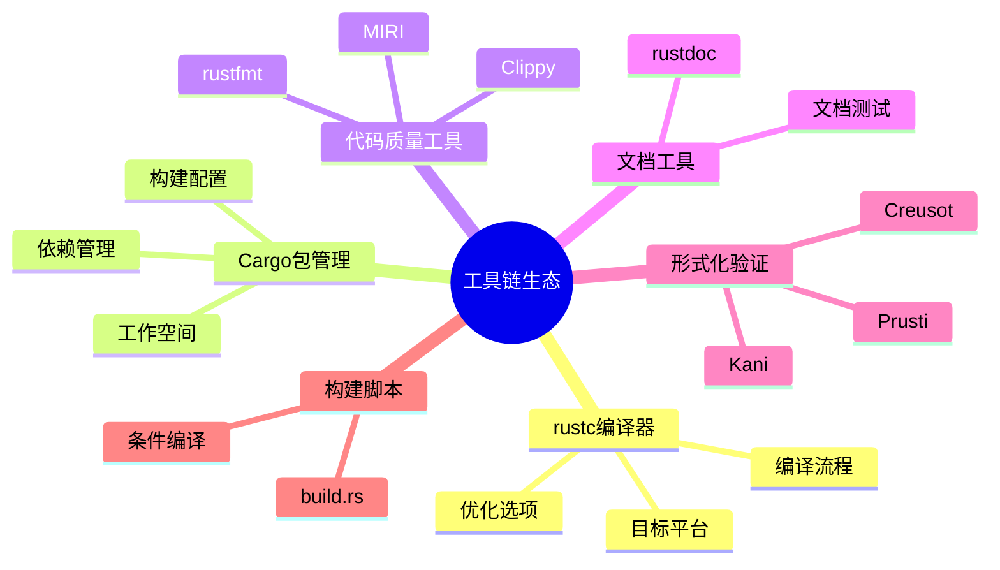

# 工具链生态

> **创建日期**: 2026-02-20
> **最后更新**: 2026-02-20
> **Rust 版本**: 1.93.0+ (Edition 2024)
> **状态**: ✅ 已完成

> **概念说明**: Rust 工具链生态系统由编译器（rustc）、包管理器（Cargo）、文档生成器（rustdoc）和质量工具（Clippy、rustfmt、MIRI）组成。这些工具协同工作，提供从代码编写、编译、测试到部署的完整开发体验。

> 内容已整合至： [06_toolchain/](../../06_toolchain/)

[返回主索引](../00_master_index.md)

---

## 工具链核心组件

### Rust 编译器 (rustc)

```bash
# 基本编译
rustc main.rs                    # 编译单个文件
rustc --crate-type lib lib.rs    # 编译为库
rustc --crate-type bin main.rs   # 编译为二进制（默认）

# 优化级别
rustc -C opt-level=0 main.rs     # 无优化（快速编译）
rustc -C opt-level=3 main.rs     # 最大优化
rustc -C opt-level=s main.rs     # 优化大小

# 目标平台
rustc --target x86_64-unknown-linux-gnu main.rs
rustc --target wasm32-unknown-unknown main.rs
```

```rust
// 编译器属性示例
#![feature(...)]  // 启用不稳定特性

// 条件编译
#[cfg(target_os = "linux")]
fn linux_specific() {}

#[cfg(windows)]
fn windows_specific() {}

// 内联属性
#[inline]
fn always_inline() {}

#[inline(never)]
fn never_inline() {}

// 优化提示
#[cold]  // 此分支很少执行
fn error_path() {}

#[must_use]  // 返回值必须使用
fn important_result() -> i32 { 42 }
```

### Cargo：构建系统与包管理器

```toml
# Cargo.toml 完整示例
[package]
name = "my-project"
version = "0.1.0"
edition = "2024"
authors = ["Name <email@example.com>"]
license = "MIT OR Apache-2.0"
description = "A brief description"
repository = "https://github.com/user/repo"
rust-version = "1.93"

[dependencies]
# 依赖版本规范
serde = "1.0"                    # 语义化版本
serde = "=1.0.150"               # 精确版本
serde = ">=1.0, <2.0"            # 范围
serde = { version = "1.0", features = ["derive"] }  # 带特性
serde = { git = "https://github.com/serde-rs/serde" }  # Git 依赖
serde = { path = "../serde" }    # 本地路径

[dev-dependencies]
# 仅开发时使用的依赖
mockall = "0.12"

[build-dependencies]
# 构建脚本依赖
cc = "1.0"

[features]
# 条件编译特性
default = ["std"]
std = []
async = ["tokio"]
full = ["std", "async"]

[profile.release]
opt-level = 3
lto = true
codegen-units = 1
panic = "abort"

[profile.dev]
opt-level = 1
incremental = true
```

### 常用 Cargo 命令

```bash
# 项目管理
cargo new my-project         # 创建二进制项目
cargo new --lib my-library   # 创建库项目
cargo init                   # 在当前目录初始化

# 构建
cargo build                  # 调试构建
cargo build --release        # 发布构建
cargo build --all-targets    # 构建所有目标（bin, test, bench）
cargo check                  # 快速检查（不生成代码）

# 测试
cargo test                   # 运行所有测试
cargo test --lib             # 仅库测试
cargo test --doc             # 文档测试
cargo test <filter>          # 运行匹配的测试

# 依赖管理
cargo add serde              # 添加依赖
cargo add --dev mockall      # 添加开发依赖
cargo update                 # 更新 Cargo.lock
cargo tree                   # 显示依赖树
cargo tree -d                # 显示重复依赖

# 文档
cargo doc                    # 生成文档
cargo doc --open             # 生成并打开
cargo doc --no-deps          # 不生成依赖文档

# 其他工具
cargo fmt                    # 格式化代码
cargo clippy                 # 运行 linter
cargo fix                    # 自动修复警告
cargo bench                  # 运行基准测试
cargo publish                # 发布到 crates.io
cargo install <crate>        # 安装二进制 crate
```

### 代码质量工具

```bash
# Clippy：Rust 的 linter
cargo clippy
cargo clippy --all-targets --all-features
cargo clippy -- -D warnings  # 将警告视为错误

# 配置 .clippy.toml 或 clippy.toml
# allow = ["some_lint"]
# warn = ["another_lint"]
# deny = ["dangerous_lint"]

# rustfmt：代码格式化
cargo fmt
cargo fmt -- --check         # CI 中使用

# 配置 rustfmt.toml
# edition = "2024"
# max_width = 100
# tab_spaces = 4
```

### 形式化验证工具

```rust
// MIRI：检测未定义行为
// cargo miri test

// 使用示例
unsafe fn undefined_behavior_demo() {
    let ptr = std::ptr::null::<i32>();
    // let _ = *ptr;  // MIRI 会检测到此 UB
}

// Prusti：基于契约的验证
// #[requires(x > 0)]
// #[ensures(result > x)]
// fn double(x: i32) -> i32 { x * 2 }

// Kani：模型检查器
// #[kani::proof]
// fn check_add() {
//     let x: u32 = kani::any();
//     let y: u32 = kani::any();
//     kani::assume(x < 100 && y < 100);
//     assert!(x + y < 200);
// }
```

### 工作空间示例

```toml
# 根 Cargo.toml - 工作空间配置
[workspace]
members = ["crate-a", "crate-b", "crate-c"]
resolver = "2"

[workspace.dependencies]
serde = { version = "1.0", features = ["derive"] }
tokio = { version = "1.35", features = ["full"] }
anyhow = "1.0"

[workspace.package]
version = "0.1.0"
edition = "2024"
authors = ["Team <team@example.com>"]
license = "MIT OR Apache-2.0"
```

### 构建脚本 (build.rs)

```rust
// build.rs - 自定义构建脚本
use std::env;
use std::path::Path;

fn main() {
    // 告诉 Cargo 当这些文件变化时重新运行构建
    println!("cargo:rerun-if-changed=build.rs");
    println!("cargo:rerun-if-changed=src/some_file.rs");

    // 设置编译时环境变量
    let version = env::var("CARGO_PKG_VERSION").unwrap();
    println!("cargo:rustc-env=MY_APP_VERSION={}", version);

    // 条件编译标志
    let target = env::var("TARGET").unwrap();
    if target.contains("windows") {
        println!("cargo:rustc-cfg=windows");
    }

    // 链接外部库
    println!("cargo:rustc-link-lib=static=mylib");
    println!("cargo:rustc-link-search=native=/usr/local/lib");
}
```

---

## 形式化方法

| 文档 | 描述 | 路径 |
| :--- | :--- | :--- |
| 形式化方法概述 | 形式化验证基础理论 | [../../research_notes/formal_methods/README.md](../../research_notes/formal_methods/README.md) |
| 类型系统形式化 | 类型理论数学定义 | [../../research_notes/type_theory/type_system_foundations.md](../../research_notes/type_theory/type_system_foundations.md) |
| 所有权模型形式化 | 所有权系统数学定义 | [../../research_notes/formal_methods/ownership_model.md](../../research_notes/formal_methods/ownership_model.md) |
| 借用检查器证明 | 借用检查器形式化证明 | [../../research_notes/formal_methods/borrow_checker_proof.md](../../research_notes/formal_methods/borrow_checker_proof.md) |
| Send/Sync 形式化 | 线程安全形式化定义 | [../../research_notes/formal_methods/send_sync_formalization.md](../../research_notes/formal_methods/send_sync_formalization.md) |
| 证明索引 | 形式化证明集合 | [../../research_notes/PROOF_INDEX.md](../../research_notes/PROOF_INDEX.md) |

## 相关研究笔记

| 文档 | 描述 | 路径 |
| :--- | :--- | :--- |
| 工具链文档 | 完整工具链指南 | [../../06_toolchain/](../../06_toolchain/) |
| 编译器特性 | 完整编译器指南 | [../../06_toolchain/01_compiler_features.md](../../06_toolchain/01_compiler_features.md) |
| Cargo 工作空间 | 工作空间配置 | [../../06_toolchain/02_cargo_workspace_guide.md](../../06_toolchain/02_cargo_workspace_guide.md) |
| Rustdoc 高级 | 文档生成高级用法 | [../../06_toolchain/03_rustdoc_advanced.md](../../06_toolchain/03_rustdoc_advanced.md) |
| 编译器优化实验 | 优化分析 | [../../research_notes/experiments/compiler_optimizations.md](../../research_notes/experiments/compiler_optimizations.md) |
| 性能基准 | 性能测试方法论 | [../../research_notes/experiments/performance_benchmarks.md](../../research_notes/experiments/performance_benchmarks.md) |
| 研究方法论 | 研究方法指南 | [../../research_notes/research_methodology.md](../../research_notes/research_methodology.md) |
| 工具指南 | 验证工具使用 | [../../research_notes/TOOLS_GUIDE.md](../../research_notes/TOOLS_GUIDE.md) |
| 质量检查清单 | 代码质量检查 | [../../research_notes/QUALITY_CHECKLIST.md](../../research_notes/QUALITY_CHECKLIST.md) |
| 最佳实践 | 工程最佳实践 | [../../research_notes/BEST_PRACTICES.md](../../research_notes/BEST_PRACTICES.md) |

---

## 知识结构思维导图



## 与核心文档的关联

| 本文档 | 核心文档 | 关系 |
| :--- | :--- | :--- |
| 本README | 06_toolchain/ | 索引/重定向 |
| 本README | research_notes/TOOLS_GUIDE.md | 索引/重定向 |

[返回主索引](../00_master_index.md) | [编译器理论](./01_compiler/README.md) | [包管理器理论](./02_package_manager/README.md) | [构建工具理论](./03_build_tools/README.md)
