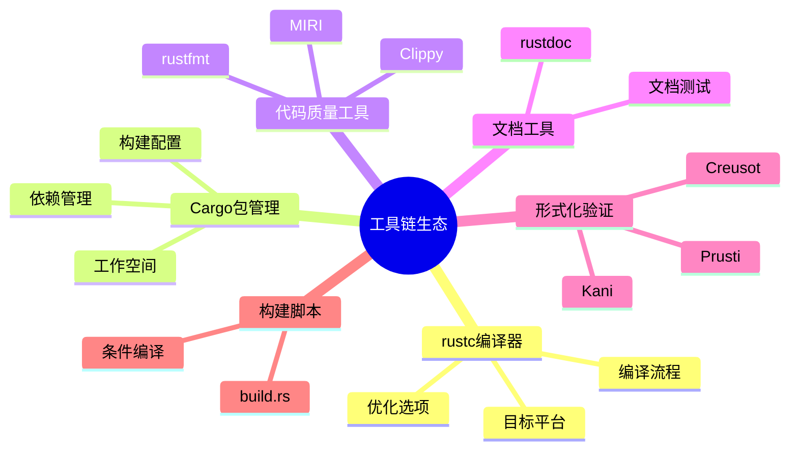

# 工具链生态

> **EN**: Toolchain Ecosystem Index
> **Summary**: 工具链生态 Toolchain Ecosystem Index. (stub/archive redirect)
> **分级**: [B]
> **创建日期**: 2026-02-20
> **最后更新**: 2026-06-25（已按 Rust 1.96.0 复审）
> **Rust 版本**: 1.96.0+ (Edition 2024)
> **状态**: ✅ 已完成
> **概念说明**: Rust 工具链生态系统由编译器（rustc）、包管理器（Cargo）、文档生成器（rustdoc）和质量工具（Clippy、rustfmt、MIRI）组成。这些工具协同工作，提供从代码编写、编译、测试到部署的完整开发体验。
> 内容已整合至： [06_toolchain/](../../06_toolchain/README.md)

[返回主索引](../00_master_index.md)

---

## 工具链核心组件 {#工具链核心组件}
>
> **来源: [Rust Official Docs](https://doc.rust-lang.org/)**

### Rust 编译器 (rustc) {#rust-编译器-rustc}

> **来源: [Rust Standard Library](https://doc.rust-lang.org/std/)**
>
> **来源: [Rust Official Docs](https://doc.rust-lang.org/)**

```bash
# 基本编译 {#基本编译}

> **Bloom 层级**: L5-L6 (分析/评价/创造)
rustc main.rs                    # 编译单个文件
rustc --crate-type lib lib.rs    # 编译为库
rustc --crate-type bin main.rs   # 编译为二进制（默认）

# 优化级别 {#优化级别}
rustc -C opt-level=0 main.rs     # 无优化（快速编译）
rustc -C opt-level=3 main.rs     # 最大优化
rustc -C opt-level=s main.rs     # 优化大小

# 目标平台 {#目标平台}
rustc --target x86_64-unknown-linux-gnu main.rs
rustc --target wasm32-unknown-unknown main.rs
```
```rust,ignore
// 编译器属性示例
#![feature(...)]  // 启用不稳定特性

// 条件编译
#[cfg(target_os = "linux")]
fn linux_specific() {}

#[cfg(windows)]
fn windows_specific() {}

// 内联属性
#[inline]
fn always_inline() {}

#[inline(never)]
fn never_inline() {}

// 优化提示
#[cold]  // 此分支很少执行
fn error_path() {}

#[must_use]  // 返回值必须使用
fn important_result() -> i32 { 42 }
```
### Cargo：构建系统与包管理器 {#cargo构建系统与包管理器}

> **来源: [POPL](https://www.sigplan.org/Conferences/POPL/)**
>
> **来源: [Rust Official Docs](https://doc.rust-lang.org/)**

```toml
# Cargo.toml 完整示例 {#cargotoml-完整示例}
[package]
name = "my-project"
version = "0.1.0"
edition = "2024"
authors = ["Name <email@example.com>"]
license = "MIT OR Apache-2.0"
description = "A brief description"
repository = "https://github.com/user/repo"
rust-version = "1.96.0"

[dependencies]
# 依赖版本规范 {#依赖版本规范}
serde = "1.0"                    # 语义化版本
serde = "=1.0.150"               # 精确版本
serde = ">=1.0, <2.0"            # 范围
serde = { version = "1.0", features = ["derive"] }  # 带特性
serde = { git = "https://github.com/serde-rs/serde" }  # Git 依赖
serde = { path = "../serde" }    # 本地路径

[dev-dependencies]
# 仅开发时使用的依赖 {#仅开发时使用的依赖}
mockall = "0.12"

[build-dependencies]
# 构建脚本依赖 {#构建脚本依赖}
cc = "1.0"

[features]
# 条件编译特性 {#条件编译特性}
default = ["std"]
std = []
async = ["tokio"]
full = ["std", "async"]

[profile.release]
opt-level = 3
lto = true
codegen-units = 1
panic = "abort"

[profile.dev]
opt-level = 1
incremental = true
```
### 常用 Cargo 命令 {#常用-cargo-命令}

> **来源: [PLDI](https://www.sigplan.org/Conferences/PLDI/)**
>
> **来源: [Rust Official Docs](https://doc.rust-lang.org/)**

```bash
# 项目管理 {#项目管理}
cargo new my-project         # 创建二进制项目
cargo new --lib my-library   # 创建库项目
cargo init                   # 在当前目录初始化

# 构建 {#构建}
cargo build                  # 调试构建
cargo build --release        # 发布构建
cargo build --all-targets    # 构建所有目标（bin, test, bench）
cargo check                  # 快速检查（不生成代码）

# 测试 {#测试}
cargo test                   # 运行所有测试
cargo test --lib             # 仅库测试
cargo test --doc             # 文档测试
cargo test <filter>          # 运行匹配的测试

# 依赖管理 {#依赖管理}
cargo add serde              # 添加依赖
cargo add --dev mockall      # 添加开发依赖
cargo update                 # 更新 Cargo.lock
cargo tree                   # 显示依赖树
cargo tree -d                # 显示重复依赖

# 文档 {#文档}
cargo doc                    # 生成文档
cargo doc --open             # 生成并打开
cargo doc --no-deps          # 不生成依赖文档

# 其他工具 {#其他工具}
cargo fmt                    # 格式化代码
cargo clippy                 # 运行 linter
cargo fix                    # 自动修复警告
cargo bench                  # 运行基准测试
cargo publish                # 发布到 crates.io
cargo install <crate>        # 安装二进制 crate
```
### 代码质量工具 {#代码质量工具}

> **来源: [Wikipedia - Memory Safety](https://en.wikipedia.org/wiki/Memory_Safety)**
>
> **来源: [Rust Official Docs](https://doc.rust-lang.org/)**

```bash
# Clippy：Rust 的 linter {#clippyrust-的-linter}
cargo clippy
cargo clippy --all-targets --all-features
cargo clippy -- -D warnings  # 将警告视为错误

# 配置 .clippy.toml 或 clippy.toml {#配置-clippytoml-或-clippytoml}
# allow = ["some_lint"] {#allow-some_lint}
# warn = ["another_lint"] {#warn-another_lint}
# deny = ["dangerous_lint"] {#deny-dangerous_lint}

# rustfmt：代码格式化 {#rustfmt代码格式化}
cargo fmt
cargo fmt -- --check         # CI 中使用

# 配置 rustfmt.toml {#配置-rustfmttoml}
# edition = "2024" {#edition-2024}
# max_width = 100 {#max_width-100}
# tab_spaces = 4 {#tab_spaces-4}
```
### 形式化验证工具 {#形式化验证工具}

> **来源: [Wikipedia - Type System](https://en.wikipedia.org/wiki/Type_system)**
>
> **来源: [Rust Official Docs](https://doc.rust-lang.org/)**

```rust
// MIRI：检测未定义行为
// cargo miri test

// 使用示例
unsafe fn undefined_behavior_demo() {
    let ptr = std::ptr::null::<i32>();
    // let _ = *ptr;  // MIRI 会检测到此 UB
}

// Prusti：基于契约的验证
// #[requires(x > 0)]
// #[ensures(result > x)]
// fn double(x: i32) -> i32 { x * 2 }

// Kani：模型检查器
// #[kani::proof]
// fn check_add() {
//     let x: u32 = kani::any();
//     let y: u32 = kani::any();
//     kani::assume(x < 100 && y < 100);
//     assert!(x + y < 200);
// }
```
### 工作空间示例 {#工作空间示例}

> **来源: [Wikipedia - Concurrency](https://en.wikipedia.org/wiki/Concurrency)**
>
> **来源: [Rust Official Docs](https://doc.rust-lang.org/)**

```toml
# 根 Cargo.toml - 工作空间配置 {#根-cargotoml---工作空间配置}
[workspace]
members = ["crate-a", "crate-b", "crate-c"]
resolver = "2"

[workspace.dependencies]
serde = { version = "1.0", features = ["derive"] }
tokio = { version = "1.35", features = ["full"] }
anyhow = "1.0"

[workspace.package]
version = "0.1.0"
edition = "2024"
authors = ["Team <team@example.com>"]
license = "MIT OR Apache-2.0"
```
### 构建脚本 (build.rs) {#构建脚本-buildrs}

> **来源: [Wikipedia - Asynchronous I/O](https://en.wikipedia.org/wiki/Asynchronous_I/O)**
>
> **来源: [Rust Official Docs](https://doc.rust-lang.org/)**

```rust
// build.rs - 自定义构建脚本
use std::env;
use std::path::Path;

fn main() {
    // 告诉 Cargo 当这些文件变化时重新运行构建
    println!("cargo:rerun-if-changed=build.rs");
    println!("cargo:rerun-if-changed=src/some_file.rs");

    // 设置编译时环境变量
    let version = env::var("CARGO_PKG_VERSION").unwrap();
    println!("cargo:rustc-env=MY_APP_VERSION={}", version);

    // 条件编译标志
    let target = env::var("TARGET").unwrap();
    if target.contains("windows") {
        println!("cargo:rustc-cfg=windows");
    }

    // 链接外部库
    println!("cargo:rustc-link-lib=static=mylib");
    println!("cargo:rustc-link-search=native=/usr/local/lib");
}
```
---

## 形式化方法 {#形式化方法}
>
> **来源: [Rust Official Docs](https://doc.rust-lang.org/)**

| 文档 | 描述 | 路径 |
| :--- | :--- | :--- |
| 形式化方法概述 | 形式化验证基础理论 | [../../research_notes/formal_methods/README.md](../../../archive/research_notes_2026_06_25/formal_methods/README.md) |
| 类型系统形式化 | 类型理论数学定义 | [../../research_notes/type_theory/10_type_system_foundations.md](../../../archive/research_notes_2026_06_25/type_theory/10_type_system_foundations.md) |
| 所有权模型形式化 | 所有权系统数学定义 | [../../research_notes/formal_methods/10_ownership_model.md](../../research_notes/formal_methods/10_ownership_model.md) |
| 借用检查器证明 | 借用检查器形式化证明 | [../../research_notes/formal_methods/10_borrow_checker_proof.md](../../research_notes/formal_methods/10_borrow_checker_proof.md) |
| Send/Sync 形式化 | 线程安全形式化定义 | [../../research_notes/formal_methods/10_send_sync_formalization.md](../../../archive/research_notes_2026_06_25/formal_methods/10_send_sync_formalization.md) |
| 证明索引 | 形式化证明集合 | [../../research_notes/10_proof_index.md](../../../archive/research_notes_2026_06_25/10_proof_index.md) |

## 相关研究笔记 {#相关研究笔记}
>
> **来源: [Rust Official Docs](https://doc.rust-lang.org/)**

| 文档 | 描述 | 路径 |
| :--- | :--- | :--- |
| 工具链文档 | 完整工具链指南 | [../../06_toolchain/](../../06_toolchain/README.md) |
| 编译器特性 | 完整编译器指南 | [../../06_toolchain/01_compiler_features.md](../../06_toolchain/01_compiler_features.md) |
| Cargo 工作空间 | 工作空间配置 | ../../06_toolchain/02_cargo_workspace_guide.md |
| Rustdoc 高级 | 文档生成高级用法 | [../../06_toolchain/03_rustdoc_advanced.md](../../06_toolchain/03_rustdoc_advanced.md) |
| 编译器优化实验 | 优化分析 | [../../research_notes/experiments/10_compiler_optimizations.md](../../../archive/research_notes_2026_06_25/experiments/10_compiler_optimizations.md) |
| 性能基准 | 性能测试方法论 | [../../research_notes/experiments/10_performance_benchmarks.md](../../../archive/research_notes_2026_06_25/experiments/10_performance_benchmarks.md) |
| 研究方法论 | 研究方法指南 | [../../research_notes/10_research_methodology.md](../../../archive/research_notes_2026_06_25/10_research_methodology.md) |
| 工具指南 | 验证工具使用 | [../../research_notes/10_tools_guide.md](../../../archive/research_notes_2026_06_25/10_tools_guide.md) |
| 质量检查清单 | 代码质量检查 | [../../research_notes/10_quality_checklist.md](../../../archive/research_notes_2026_06_25/10_quality_checklist.md) |
| 最佳实践 | 工程最佳实践 | [../../research_notes/10_best_practices.md](../../../archive/research_notes_2026_06_25/10_best_practices.md) |

---

## 知识结构思维导图 {#知识结构思维导图}
>
> **来源: [Rust Official Docs](https://doc.rust-lang.org/)**


```mermaid
mindmap
  root((工具链生态))
    rustc编译器
      编译流程
      优化选项
      目标平台
    Cargo包管理
      依赖管理
      工作空间
      构建配置
    代码质量工具
      Clippy
      rustfmt
      MIRI
    文档工具
      rustdoc
      文档测试
    形式化验证
      Prusti
      Kani
      Creusot
    构建脚本
      build.rs
      条件编译
```
## 与核心文档的关联 {#与核心文档的关联}

| 本文档 | 核心文档 | 关系 |
| :--- | :--- | :--- |
| 本README | 06_toolchain/ | 索引/重定向 |
| 本README | research_notes/10_tools_guide.md | 索引/重定向 |

[返回主索引](../00_master_index.md) |
[编译器理论](01_compiler/README.md) |
[包管理器理论](02_package_manager/README.md) |
[构建工具理论](03_build_tools/README.md)

---

> **权威来源**: [Rust Reference](https://doc.rust-lang.org/reference/), [The Rust Programming Language](https://doc.rust-lang.org/book/), [Rust Standard Library](https://doc.rust-lang.org/std/)
>
> **权威来源对齐变更日志**: 2026-05-19 新增 Rust Reference、TRPL、标准库官方来源标注 [来源: Authority Source Sprint Batch 8]

**文档版本**: 1.1
**对应 Rust 版本**: 1.96.0+ (Edition 2024)
**最后更新**: 2026-06-25（已按 Rust 1.96.0 复审）
**状态**: ✅ 权威来源对齐完成 (Batch 8)

---

## 权威来源索引 {#权威来源索引}

> **来源: [Wikipedia - Compiler Construction](https://en.wikipedia.org/wiki/Compiler_Construction)**
> **来源: [Rust Compiler Team Blog](https://blog.rust-lang.org/inside-rust/)**
> **来源: [LLVM Documentation](https://llvm.org/docs/)**
> **来源: [ACM](https://dl.acm.org/)**
> **来源: [Wikipedia - Machine Learning](https://en.wikipedia.org/wiki/Machine_Learning)**
> **来源: [Wikipedia - Artificial Intelligence](https://en.wikipedia.org/wiki/Artificial_Intelligence)**
> **来源: [tch-rs Documentation](https://docs.rs/tch/latest/tch/)**
> **来源: [ACM - AI Systems](https://dl.acm.org/)**
