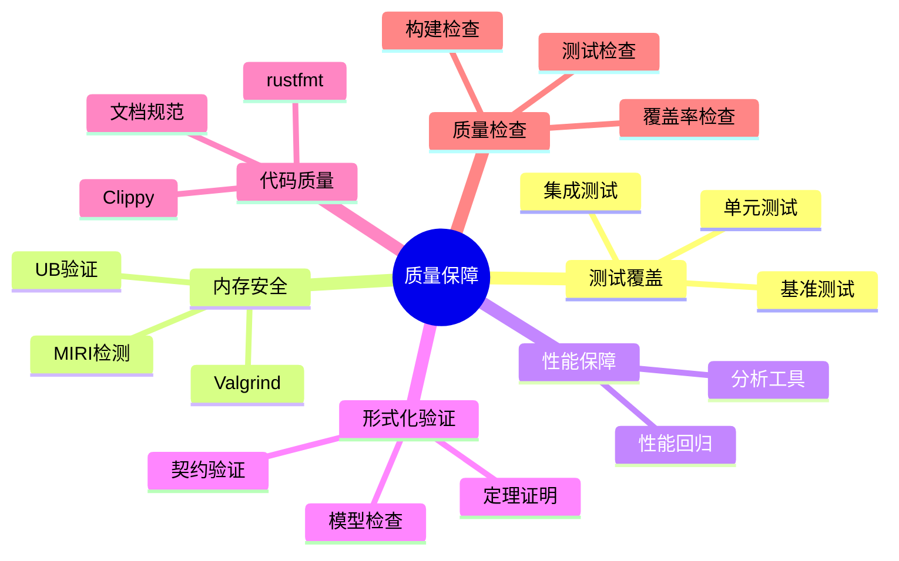

# 质量保障 {#质量保障}
>
> **EN**: Quality Assurance Index
> **Summary**: 质量保障 Quality Assurance Index. (stub/archive redirect)
> **分级**: [B]
> **Bloom 层级**: L5-L6
> **创建日期**: 2026-02-20
> **最后更新**: 2026-06-25（已按 Rust 1.97.0 复审）
> **Rust 版本**: 1.97.0+ (Edition 2024)
> **状态**: ✅ 已完成
> **概念说明**: 质量保障（Quality Assurance）是通过系统化的测试、分析和验证活动确保软件满足需求的过程。Rust 的质量保障结合编译时检查（类型系统（Type System）、借用（Borrowing）检查）、运行时（Runtime）测试（单元测试、集成测试、基准测试）和形式化验证（模型检查、定理证明）来提供多层次的质量保证。

> **权威来源**: 本文件为 Rust 形式化工程体系专题入口；通用 Rust 概念解释请见对应 `concept/` 权威页：
>
> - [`concept/01_foundation/10_testing_basics/16_testing_basics.md`](../../../concept/01_foundation/10_testing_basics/16_testing_basics.md)
> - [`concept/06_ecosystem/09_testing_and_quality/12_testing_strategies.md`](../../../concept/06_ecosystem/09_testing_and_quality/12_testing_strategies.md)
> - [`concept/04_formal/04_model_checking/31_miri.md`](../../../concept/04_formal/04_model_checking/31_miri.md)
>
> 根据 AGENTS.md §3.4，`docs/` 仅保留专题工程视角内容；通用概念解释统一维护在 `concept/` 中。

---

## 📋 目录 {#目录}
>
> **来源: [Rust Official Docs](https://doc.rust-lang.org/)**

- [质量保障 {#质量保障}](#质量保障-质量保障)
  - [📋 目录 {#目录}](#-目录-目录)
  - [🎯 宗旨 {#宗旨}](#-宗旨-宗旨)
  - [📐 质量保障维度 {#质量保障维度}](#-质量保障维度-质量保障维度)
  - [📚 核心文档 {#核心文档}](#-核心文档-核心文档)
  - [🔬 形式化验证衔接 {#形式化验证衔接}](#-形式化验证衔接-形式化验证衔接)
  - [✅ 质量检查清单 {#质量检查清单}](#-质量检查清单-质量检查清单)
  - [代码质量示例 {#代码质量示例}](#代码质量示例-代码质量示例)
    - [测试最佳实践 {#测试最佳实践}](#测试最佳实践-测试最佳实践)
    - [MIRI 检测示例 {#miri-检测示例}](#miri-检测示例-miri-检测示例)
    - [基准测试示例 {#基准测试示例}](#基准测试示例-基准测试示例)
    - [代码覆盖率示例 {#代码覆盖率示例}](#代码覆盖率示例-代码覆盖率示例)
    - [形式化验证示例 {#形式化验证示例}](#形式化验证示例-形式化验证示例)
  - [🔗 与 research\_notes 衔接 {#与-research\_notes-衔接}](#-与-research_notes-衔接-与-research_notes-衔接)
  - [形式化方法 {#形式化方法}](#形式化方法-形式化方法)
  - [知识结构思维导图 {#知识结构思维导图}](#知识结构思维导图-知识结构思维导图)
  - [与核心文档的关联 {#与核心文档的关联}](#与核心文档的关联-与核心文档的关联)
  - [权威来源索引 {#权威来源索引}](#权威来源索引-权威来源索引)

---

## 🎯 宗旨 {#宗旨}
>
> **来源: [Rust Official Docs](https://doc.rust-lang.org/)**

本模块（Module）提供 Rust 形式化工程系统的质量保障体系，涵盖：

1. **测试与覆盖**：单元测试、集成测试、覆盖率
2. **性能保障**：基准测试、性能回归、MIRI/Valgrind
3. **形式化验证**：与 ownership、borrow、type_system 定理衔接
4. **文档与规范**：研究笔记质量检查、贡献规范

---

## 📐 质量保障维度 {#质量保障维度}
>
> **来源: [Rust Official Docs](https://doc.rust-lang.org/)**

| 维度 | 内容 | 文档 |
| :--- | :--- | :--- |
| **测试覆盖** | 单元/集成/基准、覆盖率报告 | [TESTING_COVERAGE_GUIDE](../../05_guides/05_testing_coverage_guide.md) |
| **性能测试** | 基准测试、性能回归、分析工具 | [PERFORMANCE_TESTING_REPORT](../../05_guides/05_performance_testing_report.md) |
| **内存安全（Memory Safety）** | MIRI、Valgrind、无 UB 验证 | [SAFE_UNSAFE_COMPREHENSIVE_ANALYSIS](../../research_notes/10_safe_unsafe_comprehensive_analysis.md) |
| **形式化验证** | Prusti、Kani、Creusot | [TOOLS_GUIDE](../../research_notes/10_tools_guide.md)、[FORMAL_VERIFICATION_GUIDE](../../research_notes/10_formal_verification_guide.md) |
| **代码质量** | Clippy、rustfmt、文档 | [QUALITY_CHECKLIST](../../research_notes/10_quality_checklist.md) |

---

## 📚 核心文档 {#核心文档}
>
> **来源: [Rust Official Docs](https://doc.rust-lang.org/)**

- [**05_testing_coverage_guide.md**](../../05_guides/05_testing_coverage_guide.md) — 测试策略、覆盖率、MIRI 集成
- [**05_performance_testing_report.md**](../../05_guides/05_performance_testing_report.md) — 性能基准、报告、回归

---

## 🔬 形式化验证衔接 {#形式化验证衔接}
>
> **来源: [Rust Official Docs](https://doc.rust-lang.org/)**

| 验证目标 | 形式化定理 | 工具 |
| :--- | :--- | :--- |
| 内存安全（Memory Safety） | ownership T2/T3、borrow T1 | MIRI、Valgrind |
| 数据竞争自由 | async T6.2 | MIRI、ThreadSanitizer |
| 类型安全 | type_system T1–T3 | cargo check |
| 契约满足 | unsafe 前置/后置条件 | Prusti、Kani |

---

## ✅ 质量检查清单 {#质量检查清单}
>
> **来源: [Rust Official Docs](https://doc.rust-lang.org/)**

1. **构建**：`cargo build` 通过
2. **测试**：`cargo test` 通过
3. **格式**：`cargo fmt --check`
4. **Lint**：`cargo clippy`
5. **文档**：`cargo doc --no-deps`
6. **MIRI**（可选）：`cargo miri test`

---

## 代码质量示例 {#代码质量示例}
>
> **来源: [Rust Official Docs](https://doc.rust-lang.org/)**

### 测试最佳实践 {#测试最佳实践}

> **来源: [Wikipedia - Rust (programming language)](https://en.wikipedia.org/wiki/Rust_(programming_language))**
>
> **来源: [Rust Official Docs](https://doc.rust-lang.org/)**

```rust,ignore
// 单元测试
#[cfg(test)]
mod tests {
    use super::*;

    #[test]
    fn test_add() {
        assert_eq!(add(2, 3), 5);
    }

    #[test]
    #[should_panic(expected = "overflow")]
    fn test_add_overflow() {
        let _ = i32::MAX + 1;  // 会 panic
    }

    #[test]
    fn test_result() -> Result<(), String> {
        let result = some_operation()?;
        assert_eq!(result, 42);
        Ok(())
    }
}

// 属性测试（使用 proptest）
#[cfg(test)]
mod property_tests {
    use proptest::prelude::*;

    proptest! {
        #[test]
        fn test_add_commutative(a: i32, b: i32) {
            prop_assert_eq!(add(a, b), add(b, a));
        }
    }
}

// 模糊测试（使用 cargo-fuzz）
#![no_main]
use libfuzzer_sys::fuzz_target;

fuzz_target!(|data: &[u8]| {
    if let Ok(s) = std::str::from_utf8(data) {
        let _ = parse_input(s);
    }
});
```

### MIRI 检测示例 {#miri-检测示例}

> **来源: [Rust Reference - doc.rust-lang.org/reference](https://doc.rust-lang.org/reference/)**
>
> **来源: [Rust Official Docs](https://doc.rust-lang.org/)**

```rust
// 此代码在 MIRI 中会检测到未定义行为
#[cfg(test)]
mod miri_tests {
    #[test]
    fn test_pointer_validity() {
        let ptr = std::ptr::null::<i32>();
        // MIRI 会阻止以下操作
        // unsafe { let _ = *ptr; }
    }

    #[test]
    fn test_data_race() {
        use std::sync::Arc;
        use std::thread;

        // Arc 保证线程安全
        let data = Arc::new(std::sync::Mutex::new(0));

        let handles: Vec<_> = (0..10)
            .map(|_| {
                let data = Arc::clone(&data);
                thread::spawn(move || {
                    let mut guard = data.lock().unwrap();
                    *guard += 1;
                })
            })
            .collect();

        for h in handles {
            h.join().unwrap();
        }

        assert_eq!(*data.lock().unwrap(), 10);
    }
}
```

### 基准测试示例 {#基准测试示例}

> **来源: [The Rust Programming Language](https://doc.rust-lang.org/book/)**
>
> **来源: [Rust Official Docs](https://doc.rust-lang.org/)**

```rust,ignore
// 使用 criterion 进行基准测试
use criterion::{black_box, criterion_group, criterion_main, Criterion};

fn fibonacci(n: u64) -> u64 {
    match n {
        0 => 1,
        1 => 1,
        n => fibonacci(n - 1) + fibonacci(n - 2),
    }
}

fn criterion_benchmark(c: &mut Criterion) {
    c.bench_function("fib 20", |b| b.iter(|| fibonacci(black_box(20))));
}

criterion_group!(benches, criterion_benchmark);
criterion_main!(benches);
```

### 代码覆盖率示例 {#代码覆盖率示例}

> **来源: [Rustonomicon - doc.rust-lang.org/nomicon](https://doc.rust-lang.org/nomicon/)**
>
> **来源: [Rust Official Docs](https://doc.rust-lang.org/)**

```bash
# 使用 tarpaulin 生成覆盖率报告 {#使用-tarpaulin-生成覆盖率报告}
cargo install cargo-tarpaulin
cargo tarpaulin --out Html

# 使用 llvm-cov {#使用-llvm-cov}
cargo install cargo-llvm-cov
cargo llvm-cov --html

# CI 中的覆盖率检查 {#ci-中的覆盖率检查}
cargo tarpaulin --fail-under 80  # 覆盖率必须 >= 80%
```

### 形式化验证示例 {#形式化验证示例}

> **来源: [ACM](https://dl.acm.org/)**

```rust
// 使用 Kani 验证关键函数
#[cfg(kani)]
mod verification {
    // 验证无溢出
    #[kani::proof]
    fn verify_add_no_overflow() {
        let a: u32 = kani::any();
        let b: u32 = kani::any();
        kani::assume(a < 1000 && b < 1000);
        let result = a + b;
        assert!(result < 2000);
    }

    // 验证内存安全
    #[kani::proof]
    fn verify_vec_push() {
        let mut v = Vec::new();
        v.push(1);
        v.push(2);
        assert!(v.len() == 2);
        assert!(v[0] == 1);
        assert!(v[1] == 2);
    }
}

// 使用 Prusti 验证契约
#[cfg(prusti)]
mod contracts {
    /// 前置条件：除数不能为零
    /// 后置条件：结果乘以除数等于被除数
    #[requires(b != 0)]
    #[ensures(result * b == a)]
    fn divide(a: i32, b: i32) -> i32 {
        a / b
    }
}
```

---

## 🔗 与 research_notes 衔接 {#与-research_notes-衔接}

| 文档 | 用途 | 路径 |
| :--- | :--- | :--- |
| **QUALITY_CHECKLIST** | 研究笔记质量检查 | [../../research_notes/10_quality_checklist.md](../../research_notes/10_quality_checklist.md) |
| **experiments/performance_benchmarks** | 性能基准方法论 | [../../research_notes/experiments/10_performance_benchmarks.md](../../research_notes/experiments/10_performance_benchmarks.md) |
| **SAFE_UNSAFE_COMPREHENSIVE_ANALYSIS** | 安全边界与 UB | [../../research_notes/10_safe_unsafe_comprehensive_analysis.md](../../research_notes/10_safe_unsafe_comprehensive_analysis.md) |
| **type_theory/00_completeness_gaps** | 类型理论完备性缺口 | [../../research_notes/formal_methods/00_completeness_gaps.md](../../research_notes/formal_methods/00_completeness_gaps.md) |
| **TOOLS_GUIDE** | 形式化验证工具指南 | [../../research_notes/10_tools_guide.md](../../research_notes/10_tools_guide.md) |
| **FORMAL_VERIFICATION_GUIDE** | 形式化验证入门 | [../../research_notes/10_formal_verification_guide.md](../../research_notes/10_formal_verification_guide.md) |
| **PROOF_INDEX** | 形式化证明索引 | [../../research_notes/10_proof_index.md](../../research_notes/10_proof_index.md) |
| **CORE_THEOREMS_FULL_PROOFS** | 核心定理完整证明 | [../../research_notes/10_core_theorems_full_proofs.md](../../research_notes/10_core_theorems_full_proofs.md) |
| **BEST_PRACTICES** | 工程最佳实践 | [../../research_notes/10_best_practices.md](../../research_notes/10_best_practices.md) |
| **TESTING_COVERAGE_GUIDE** | 测试覆盖指南 | [../../05_guides/05_testing_coverage_guide.md](../../05_guides/05_testing_coverage_guide.md) |

---

## 形式化方法 {#形式化方法}

| 文档 | 描述 | 路径 |
| :--- | :--- | :--- |
| 形式化方法概述 | 形式化验证基础理论 | [../../research_notes/formal_methods/README.md](../../research_notes/formal_methods/README.md) |
| 类型系统（Type System）形式化 | 类型理论数学定义 | [../../research_notes/type_theory/10_type_system_foundations.md](../../research_notes/type_theory/10_type_system_foundations.md) |
| 所有权（Ownership）模型形式化 | 所有权系统数学定义 | [../../research_notes/formal_methods/10_ownership_model.md](../../research_notes/formal_methods/10_ownership_model.md) |
| 借用检查器证明 | 借用检查器形式化 | [../../research_notes/formal_methods/10_borrow_checker_proof.md](../../research_notes/formal_methods/10_borrow_checker_proof.md) |
| 证明索引 | 形式化证明集合 | [../../research_notes/10_proof_index.md](../../research_notes/10_proof_index.md) |

---

## 知识结构思维导图 {#知识结构思维导图}


```mermaid
mindmap
  root((质量保障))
    测试覆盖
      单元测试
      集成测试
      基准测试
    内存安全
      MIRI检测
      Valgrind
      UB验证
    性能保障
      性能回归
      分析工具
    形式化验证
      模型检查
      定理证明
      契约验证
    代码质量
      Clippy
      rustfmt
      文档规范
    质量检查
      构建检查
      测试检查
      覆盖率检查
```

## 与核心文档的关联 {#与核心文档的关联}

| 本文档 | 核心文档 | 关系 |
| :--- | :--- | :--- |
| 本README | research_notes/10_quality_checklist.md | 索引/重定向 |
| 本README | research_notes/10_tools_guide.md | 索引/重定向 |
| 本README | 05_testing_coverage_guide.md | 索引/重定向 |

[返回主索引](../00_master_index.md)

---

> **权威来源**: [Rust Reference](https://doc.rust-lang.org/reference/), [The Rust Programming Language](https://doc.rust-lang.org/book/), [Rust Standard Library](https://doc.rust-lang.org/std/)
>
> **权威来源对齐变更日志**: 2026-05-19 新增 Rust Reference、TRPL、标准库官方来源标注 [Authority Source Sprint Batch 8](../../../concept/00_meta/02_sources/international_authority_index.md)

**文档版本**: 1.1
**对应 Rust 版本**: 1.97.0+ (Edition 2024)
**最后更新**: 2026-06-25（已按 Rust 1.97.0 复审）
**状态**: ✅ 权威来源对齐完成 (Batch 8)

---

## 权威来源索引 {#权威来源索引}

> **来源: [Wikipedia - Formal Methods](https://en.wikipedia.org/wiki/Formal_Methods)**
> **来源: [Coq Reference Manual](https://coq.inria.fr/doc/)**
> **来源: [TLA+ Documentation](https://lamport.azurewebsites.net/tla/tla.html)**
> **来源: [ACM - Formal Verification](https://dl.acm.org/)**
> **来源: [Wikipedia - Concurrency](https://en.wikipedia.org/wiki/Concurrency)**
