# 质量保障 {#-质量保障维度}

> **创建日期**: 2026-02-20
> **最后更新**: 2026-02-20
> **Rust 版本**: 1.93.0+ (Edition 2024)
> **状态**: ✅ 已完成

> **概念说明**: 质量保障（Quality Assurance）是通过系统化的测试、分析和验证活动确保软件满足需求的过程。Rust 的质量保障结合编译时检查（类型系统、借用检查）、运行时测试（单元测试、集成测试、基准测试）和形式化验证（模型检查、定理证明）来提供多层次的质量保证。

---

## 📋 目录 {#-目录}

- [质量保障](#质量保障)
  - [📋 目录](#-目录)
  - [🎯 宗旨](#-宗旨)
  - [📐 质量保障维度](#-质量保障维度)
  - [📚 核心文档](#-核心文档)
  - [🔬 形式化验证衔接](#-形式化验证衔接)
  - [✅ 质量检查清单](#-质量检查清单)
  - [代码质量示例](#代码质量示例)
    - [测试最佳实践](#测试最佳实践)
    - [MIRI 检测示例](#miri-检测示例)
    - [基准测试示例](#基准测试示例)
    - [代码覆盖率示例](#代码覆盖率示例)
    - [形式化验证示例](#形式化验证示例)
  - [🔗 与 research\_notes 衔接](#-与-research_notes-衔接)
  - [形式化方法](#形式化方法)

---

## 🎯 宗旨 {#-宗旨}

本模块提供 Rust 形式化工程系统的质量保障体系，涵盖：

1. **测试与覆盖**：单元测试、集成测试、覆盖率
2. **性能保障**：基准测试、性能回归、MIRI/Valgrind
3. **形式化验证**：与 ownership、borrow、type_system 定理衔接
4. **文档与规范**：研究笔记质量检查、贡献规范

---

## 📐 质量保障维度

| 维度 | 内容 | 文档 |
| :--- | :--- | :--- |
| **测试覆盖** | 单元/集成/基准、覆盖率报告 | [TESTING_COVERAGE_GUIDE](../../05_guides/TESTING_COVERAGE_GUIDE.md) |
| **性能测试** | 基准测试、性能回归、分析工具 | [PERFORMANCE_TESTING_REPORT](../../05_guides/PERFORMANCE_TESTING_REPORT.md) |
| **内存安全** | MIRI、Valgrind、无 UB 验证 | [SAFE_UNSAFE_COMPREHENSIVE_ANALYSIS](../../research_notes/SAFE_UNSAFE_COMPREHENSIVE_ANALYSIS.md) |
| **形式化验证** | Prusti、Kani、Creusot | [TOOLS_GUIDE](../../research_notes/TOOLS_GUIDE.md)、[FORMAL_VERIFICATION_GUIDE](../../research_notes/FORMAL_VERIFICATION_GUIDE.md) |
| **代码质量** | Clippy、rustfmt、文档 | [QUALITY_CHECKLIST](../../research_notes/QUALITY_CHECKLIST.md) |

---

## 📚 核心文档 {#-核心文档}

- [**TESTING_COVERAGE_GUIDE.md**](../../05_guides/TESTING_COVERAGE_GUIDE.md) — 测试策略、覆盖率、MIRI 集成
- [**PERFORMANCE_TESTING_REPORT.md**](../../05_guides/PERFORMANCE_TESTING_REPORT.md) — 性能基准、报告、回归

---

## 🔬 形式化验证衔接 {#-形式化验证衔接}

| 验证目标 | 形式化定理 | 工具 |
| :--- | :--- | :--- |
| 内存安全 | ownership T2/T3、borrow T1 | MIRI、Valgrind |
| 数据竞争自由 | async T6.2 | MIRI、ThreadSanitizer |
| 类型安全 | type_system T1–T3 | cargo check |
| 契约满足 | unsafe 前置/后置条件 | Prusti、Kani |

---

## ✅ 质量检查清单 {#-质量检查清单}

1. **构建**：`cargo build` 通过
2. **测试**：`cargo test` 通过
3. **格式**：`cargo fmt --check`
4. **Lint**：`cargo clippy`
5. **文档**：`cargo doc --no-deps`
6. **MIRI**（可选）：`cargo miri test`

---

## 代码质量示例

### 测试最佳实践

```rust
// 单元测试
#[cfg(test)]
mod tests {
    use super::*;

    #[test]
    fn test_add() {
        assert_eq!(add(2, 3), 5);
    }

    #[test]
    #[should_panic(expected = "overflow")]
    fn test_add_overflow() {
        let _ = i32::MAX + 1;  // 会 panic
    }

    #[test]
    fn test_result() -> Result<(), String> {
        let result = some_operation()?;
        assert_eq!(result, 42);
        Ok(())
    }
}

// 属性测试（使用 proptest）
#[cfg(test)]
mod property_tests {
    use proptest::prelude::*;

    proptest! {
        #[test]
        fn test_add_commutative(a: i32, b: i32) {
            prop_assert_eq!(add(a, b), add(b, a));
        }
    }
}

// 模糊测试（使用 cargo-fuzz）
#![no_main]
use libfuzzer_sys::fuzz_target;

fuzz_target!(|data: &[u8]| {
    if let Ok(s) = std::str::from_utf8(data) {
        let _ = parse_input(s);
    }
});
```

### MIRI 检测示例

```rust
// 此代码在 MIRI 中会检测到未定义行为
#[cfg(test)]
mod miri_tests {
    #[test]
    fn test_pointer_validity() {
        let ptr = std::ptr::null::<i32>();
        // MIRI 会阻止以下操作
        // unsafe { let _ = *ptr; }
    }

    #[test]
    fn test_data_race() {
        use std::sync::Arc;
        use std::thread;

        // Arc 保证线程安全
        let data = Arc::new(std::sync::Mutex::new(0));

        let handles: Vec<_> = (0..10)
            .map(|_| {
                let data = Arc::clone(&data);
                thread::spawn(move || {
                    let mut guard = data.lock().unwrap();
                    *guard += 1;
                })
            })
            .collect();

        for h in handles {
            h.join().unwrap();
        }

        assert_eq!(*data.lock().unwrap(), 10);
    }
}
```

### 基准测试示例

```rust
// 使用 criterion 进行基准测试
use criterion::{black_box, criterion_group, criterion_main, Criterion};

fn fibonacci(n: u64) -> u64 {
    match n {
        0 => 1,
        1 => 1,
        n => fibonacci(n - 1) + fibonacci(n - 2),
    }
}

fn criterion_benchmark(c: &mut Criterion) {
    c.bench_function("fib 20", |b| b.iter(|| fibonacci(black_box(20))));
}

criterion_group!(benches, criterion_benchmark);
criterion_main!(benches);
```

### 代码覆盖率示例

```bash
# 使用 tarpaulin 生成覆盖率报告
cargo install cargo-tarpaulin
cargo tarpaulin --out Html

# 使用 llvm-cov
cargo install cargo-llvm-cov
cargo llvm-cov --html

# CI 中的覆盖率检查
cargo tarpaulin --fail-under 80  # 覆盖率必须 >= 80%
```

### 形式化验证示例

```rust
// 使用 Kani 验证关键函数
#[cfg(kani)]
mod verification {
    // 验证无溢出
    #[kani::proof]
    fn verify_add_no_overflow() {
        let a: u32 = kani::any();
        let b: u32 = kani::any();
        kani::assume(a < 1000 && b < 1000);
        let result = a + b;
        assert!(result < 2000);
    }

    // 验证内存安全
    #[kani::proof]
    fn verify_vec_push() {
        let mut v = Vec::new();
        v.push(1);
        v.push(2);
        assert!(v.len() == 2);
        assert!(v[0] == 1);
        assert!(v[1] == 2);
    }
}

// 使用 Prusti 验证契约
#[cfg(prusti)]
mod contracts {
    /// 前置条件：除数不能为零
    /// 后置条件：结果乘以除数等于被除数
    #[requires(b != 0)]
    #[ensures(result * b == a)]
    fn divide(a: i32, b: i32) -> i32 {
        a / b
    }
}
```

---

## 🔗 与 research_notes 衔接

| 文档 | 用途 | 路径 |
| :--- | :--- | :--- |
| **QUALITY_CHECKLIST** | 研究笔记质量检查 | [../../research_notes/QUALITY_CHECKLIST.md](../../research_notes/QUALITY_CHECKLIST.md) |
| **experiments/performance_benchmarks** | 性能基准方法论 | [../../research_notes/experiments/performance_benchmarks.md](../../research_notes/experiments/performance_benchmarks.md) |
| **SAFE_UNSAFE_COMPREHENSIVE_ANALYSIS** | 安全边界与 UB | [../../research_notes/SAFE_UNSAFE_COMPREHENSIVE_ANALYSIS.md](../../research_notes/SAFE_UNSAFE_COMPREHENSIVE_ANALYSIS.md) |
| **type_theory/00_completeness_gaps** | 类型理论完备性缺口 | [../../research_notes/type_theory/00_completeness_gaps.md](../../research_notes/type_theory/00_completeness_gaps.md) |
| **TOOLS_GUIDE** | 形式化验证工具指南 | [../../research_notes/TOOLS_GUIDE.md](../../research_notes/TOOLS_GUIDE.md) |
| **FORMAL_VERIFICATION_GUIDE** | 形式化验证入门 | [../../research_notes/FORMAL_VERIFICATION_GUIDE.md](../../research_notes/FORMAL_VERIFICATION_GUIDE.md) |
| **PROOF_INDEX** | 形式化证明索引 | [../../research_notes/PROOF_INDEX.md](../../research_notes/PROOF_INDEX.md) |
| **CORE_THEOREMS_FULL_PROOFS** | 核心定理完整证明 | [../../research_notes/CORE_THEOREMS_FULL_PROOFS.md](../../research_notes/CORE_THEOREMS_FULL_PROOFS.md) |
| **BEST_PRACTICES** | 工程最佳实践 | [../../research_notes/BEST_PRACTICES.md](../../research_notes/BEST_PRACTICES.md) |
| **TESTING_COVERAGE_GUIDE** | 测试覆盖指南 | [../../05_guides/TESTING_COVERAGE_GUIDE.md](../../05_guides/TESTING_COVERAGE_GUIDE.md) |

---

## 形式化方法

| 文档 | 描述 | 路径 |
| :--- | :--- | :--- |
| 形式化方法概述 | 形式化验证基础理论 | [../../research_notes/formal_methods/README.md](../../research_notes/formal_methods/README.md) |
| 类型系统形式化 | 类型理论数学定义 | [../../research_notes/type_theory/type_system_foundations.md](../../research_notes/type_theory/type_system_foundations.md) |
| 所有权模型形式化 | 所有权系统数学定义 | [../../research_notes/formal_methods/ownership_model.md](../../research_notes/formal_methods/ownership_model.md) |
| 借用检查器证明 | 借用检查器形式化 | [../../research_notes/formal_methods/borrow_checker_proof.md](../../research_notes/formal_methods/borrow_checker_proof.md) |
| 证明索引 | 形式化证明集合 | [../../research_notes/PROOF_INDEX.md](../../research_notes/PROOF_INDEX.md) |

---

## 知识结构思维导图

```mermaid
mindmap
  root((质量保障))
    测试覆盖
      单元测试
      集成测试
      基准测试
    内存安全
      MIRI检测
      Valgrind
      UB验证
    性能保障
      性能回归
      分析工具
    形式化验证
      模型检查
      定理证明
      契约验证
    代码质量
      Clippy
      rustfmt
      文档规范
    质量检查
      构建检查
      测试检查
      覆盖率检查
```



## 与核心文档的关联

| 本文档 | 核心文档 | 关系 |
| :--- | :--- | :--- |
| 本README | research_notes/QUALITY_CHECKLIST.md | 索引/重定向 |
| 本README | research_notes/TOOLS_GUIDE.md | 索引/重定向 |
| 本README | TESTING_COVERAGE_GUIDE.md | 索引/重定向 |

[返回主索引](../00_master_index.md)
