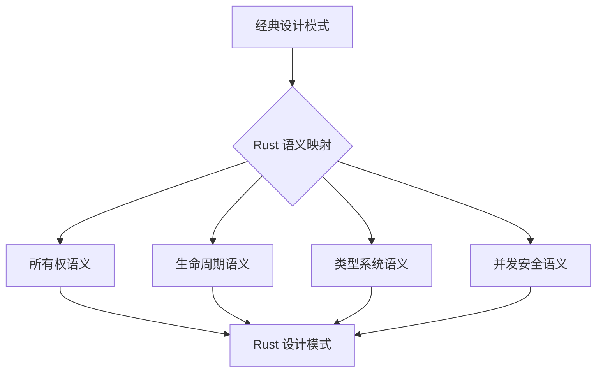
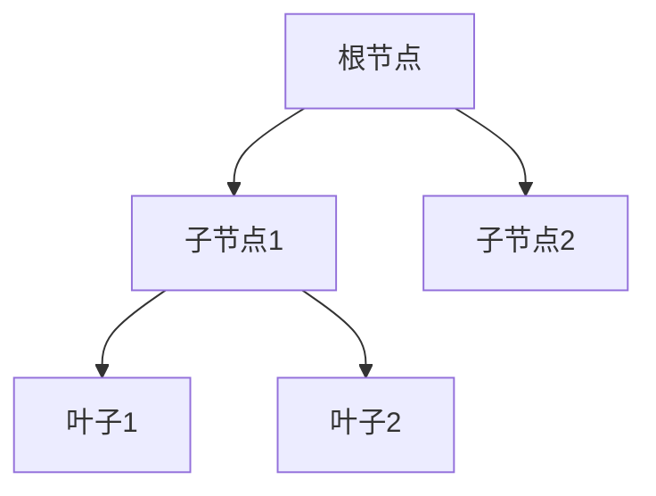
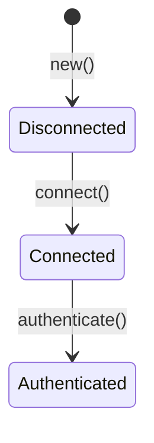
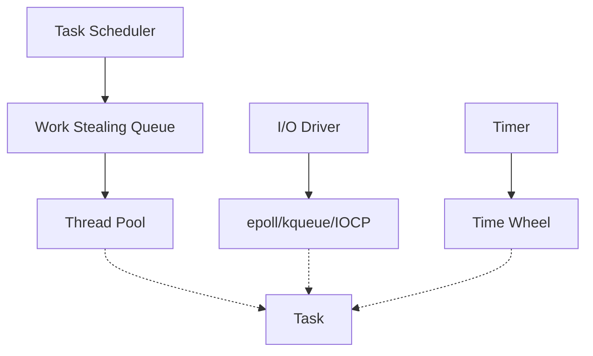

# 设计模式语义分析

## 目录

- [设计模式语义分析](#设计模式语义分析)
  - [目录](#目录)
  - [1. 引言](#1-引言)
    - [1.1 设计模式的语义视角](#11-设计模式的语义视角)
    - [1.2 Rust 设计模式的独特性](#12-rust-设计模式的独特性)
    - [1.3 所有权对设计模式的影响](#13-所有权对设计模式的影响)
    - [1.4 设计模式语义分析框架](#14-设计模式语义分析框架)
  - [2. 创建型模式语义](#2-创建型模式语义)
    - [2.1 所有权转移模式 (Move Semantics)](#21-所有权转移模式-move-semantics)
      - [2.1.1 所有权转移的形式化语义](#211-所有权转移的形式化语义)
      - [2.1.2 构造器模式与所有权](#212-构造器模式与所有权)
      - [2.1.3 Builder 模式的语义分析](#213-builder-模式的语义分析)
    - [2.2 借用检查模式 (Borrow Check)](#22-借用检查模式-borrow-check)
      - [2.2.1 借用的生命周期语义](#221-借用的生命周期语义)
      - [2.2.2 不可变借用共享语义](#222-不可变借用共享语义)
      - [2.2.3 可变借用独占语义](#223-可变借用独占语义)
    - [2.3 智能指针模式 (Smart Pointers)](#23-智能指针模式-smart-pointers)
      - [2.3.1 Box 语义（唯一所有权）](#231-box-语义唯一所有权)
      - [2.3.2 Rc 语义（引用计数）](#232-rc-语义引用计数)
      - [2.3.3 Arc 语义（原子引用计数）](#233-arc-语义原子引用计数)
      - [2.3.4 Weak 语义（弱引用）](#234-weak-语义弱引用)
  - [3. 结构型模式语义](#3-结构型模式语义)
    - [3.1 组合模式 (Composition)](#31-组合模式-composition)
      - [3.1.1 所有权树形结构语义](#311-所有权树形结构语义)
      - [3.1.2 Drop 传播语义](#312-drop-传播语义)
      - [3.1.3 递归类型语义](#313-递归类型语义)
    - [3.2 类型状态模式 (Type State)](#32-类型状态模式-type-state)
      - [3.2.1 状态作为类型参数](#321-状态作为类型参数)
      - [3.2.2 状态转换语义](#322-状态转换语义)
      - [3.2.3 编译时状态机验证](#323-编译时状态机验证)
    - [3.3 适配器模式 (Adapter)](#33-适配器模式-adapter)
      - [3.3.1 trait 适配语义](#331-trait-适配语义)
      - [3.3.2 From/Into 语义](#332-frominto-语义)
      - [3.3.3 Deref 适配语义](#333-deref-适配语义)
  - [4. 行为型模式语义](#4-行为型模式语义)
    - [4.1 迭代器模式 (Iterator)](#41-迭代器模式-iterator)
      - [4.1.1 迭代器协议语义](#411-迭代器协议语义)
      - [4.1.2 惰性求值语义](#412-惰性求值语义)
      - [4.1.3 消费者适配器语义](#413-消费者适配器语义)
    - [4.2 观察者模式 (Observer)](#42-观察者模式-observer)
      - [4.2.1 回调所有权语义](#421-回调所有权语义)
    - [4.3 访问者模式 (Visitor)](#43-访问者模式-visitor)
      - [4.3.1 双重分发语义](#431-双重分发语义)
      - [5.1.2 生产者-消费者语义](#512-生产者-消费者语义)
    - [5.2 锁模式 (Lock)](#52-锁模式-lock)
      - [5.2.1 Mutex 保护语义](#521-mutex-保护语义)
      - [5.2.2 RwLock 读写语义](#522-rwlock-读写语义)
    - [5.3 原子模式 (Atomic)](#53-原子模式-atomic)
      - [5.3.1 原子操作语义](#531-原子操作语义)
      - [5.3.2 内存序语义](#532-内存序语义)
      - [5.3.3 无锁数据结构语义](#533-无锁数据结构语义)
  - [6. 异步设计模式语义](#6-异步设计模式语义)
    - [6.1 Future 组合模式](#61-future-组合模式)
    - [6.2 Stream 处理模式](#62-stream-处理模式)
    - [6.3 取消模式 (Cancellation)](#63-取消模式-cancellation)
  - [7. 模式的形式化表示](#7-模式的形式化表示)
    - [7.1 模式作为类型](#71-模式作为类型)
    - [7.2 模式作为效果](#72-模式作为效果)
  - [8. 模式组合与变换](#8-模式组合与变换)
    - [8.1 模式嵌套语义](#81-模式嵌套语义)
    - [8.2 模式链式组合](#82-模式链式组合)
    - [8.3 模式重构语义](#83-模式重构语义)
  - [9. 实际案例分析](#9-实际案例分析)
    - [9.1 Tokio 中的设计模式](#91-tokio-中的设计模式)
    - [9.2 Actix 中的 Actor 模式](#92-actix-中的-actor-模式)
  - [10. 总结](#10-总结)
    - [10.1 核心洞察](#101-核心洞察)
    - [10.2 形式化语义的实践价值](#102-形式化语义的实践价值)
    - [10.3 未来研究方向](#103-未来研究方向)

---

## 1. 引言

### 1.1 设计模式的语义视角

**设计模式（Design Patterns）** 是软件工程中解决常见问题的可复用解决方案。
从语义角度分析设计模式，意味着我们不仅关注模式的结构和实现，更关注其**形式化语义**、**类型系统行为**和**运行时保证**。

形式化地说，设计模式可以表示为从问题域到解空间的映射：

$$
\llbracket \text{Pattern} \rrbracket : \text{Problem} \times \text{Context} \to \text{Solution} \times \text{Guarantees}
$$

### 1.2 Rust 设计模式的独特性

Rust 的设计模式具有独特性，主要源于其**所有权系统**和**类型系统**的交互：

| 特性 | 传统语言 | Rust |
|-----|---------|------|
| 资源管理 | 手动/GC | 所有权+借用检查 |
| 并发安全 | 运行时检查 | 编译时保证 |
| 空安全 | 可选 | 编译时保证（Option） |
| 错误处理 | 异常 | 显式（Result） |
| 状态机 | 运行时 | 编译时（类型状态） |

### 1.3 所有权对设计模式的影响

所有权系统从根本上改变了设计模式的实现方式。所有权对模式的影响可以用**资源转移语义**来描述。

### 1.4 设计模式语义分析框架



---

## 2. 创建型模式语义

### 2.1 所有权转移模式 (Move Semantics)

#### 2.1.1 所有权转移的形式化语义

所有权转移是 Rust 资源管理的基础，其形式化语义可以表示为：

$$
\text{Move} : x : T \to y : T \quad \text{where } \text{Own}(x) \land \neg \text{Own}(x') \land \text{Own}(y)
$$

```rust
fn move_semantics_demo() {
    let s1 = String::from("hello");  // Own(s1)
    let s2 = s1;                      // 所有权转移，¬Own(s1), Own(s2)
    // println!("{}", s1);            // 编译错误！
    println!("{}", s2);               // OK
}
```

#### 2.1.2 构造器模式与所有权

```rust
struct Resource { data: Vec<i32>, name: String }

impl Resource {
    fn new(name: &str) -> Self {
        Resource { data: vec![], name: name.to_string() }
    }

    fn with_data(mut self, data: Vec<i32>) -> Self {
        self.data = data;
        self
    }

    fn transform(self) -> ProcessedResource {
        let sum = self.data.iter().sum();
        ProcessedResource { original_name: self.name, computed_sum: sum }
    }
}

struct ProcessedResource { original_name: String, computed_sum: i32 }
```

#### 2.1.3 Builder 模式的语义分析

```rust
struct HttpRequestBuilder<'a> {
    method: &'a str,
    url: &'a str,
    headers: Vec<(&'a str, &'a str)>,
}

impl<'a> HttpRequestBuilder<'a> {
    fn new(method: &'a str, url: &'a str) -> Self {
        Self { method, url, headers: vec![] }
    }

    fn header(mut self, key: &'a str, value: &'a str) -> Self {
        self.headers.push((key, value));
        self
    }

    fn build(self) -> HttpRequest<'a> {
        HttpRequest { method: self.method, url: self.url, headers: self.headers }
    }
}

struct HttpRequest<'a> { method: &'a str, url: &'a str, headers: Vec<(&'a str, &'a str)> }
```

### 2.2 借用检查模式 (Borrow Check)

#### 2.2.1 借用的生命周期语义

```rust
fn borrow_lifecycle() {
    let s = String::from("hello");

    let r1 = &s;  // 'a
    println!("r1: {}", r1);

    let r2 = &s;  // 'b，与 'a 重叠允许
    println!("r2: {}", r2);

    // 'a, 'b 结束

    let r3 = &mut s;  // 'c
    r3.push_str(" world");
}

fn longest<'a>(x: &'a str, y: &'a str) -> &'a str {
    if x.len() > y.len() { x } else { y }
}
```

#### 2.2.2 不可变借用共享语义

```rust
fn shared_borrow_semantics() {
    let data = vec![1, 2, 3, 4, 5];

    let r1 = &data;  // 'a
    let r2 = &data;  // 'b
    let r3 = &data;  // 'c

    println!("r1[0] = {}, r2[1] = {}, r3[2] = {}", r1[0], r2[1], r3[2]);

    let r4 = &mut data;  // OK: 'a, 'b, 'c 已结束
    r4.push(6);
}
```

#### 2.2.3 可变借用独占语义

```rust
fn exclusive_mutable_borrow() {
    let mut data = String::from("hello");

    let r1 = &mut data;
    r1.push_str(" world");

    let r2 = &mut data;
    r2.push_str("!");

    println!("{}", data);
}
```

### 2.3 智能指针模式 (Smart Pointers)

#### 2.3.1 Box 语义（唯一所有权）

```rust
fn box_semantics() {
    let boxed = Box::new(vec![1, 2, 3, 4, 5]);
    let first = boxed[0];
    let moved = boxed;
}

enum BinaryTree {
    Leaf,
    Node { value: i32, left: Box<BinaryTree>, right: Box<BinaryTree> },
}
```

#### 2.3.2 Rc 语义（引用计数）

```rust
use std::rc::Rc;

fn rc_semantics() {
    let shared = Rc::new(String::from("shared data"));
    println!("Count: {}", Rc::strong_count(&shared));

    let shared2 = Rc::clone(&shared);
    println!("Count: {}", Rc::strong_count(&shared));
}

fn rc_with_interior_mutability() {
    use std::cell::RefCell;
    let shared_data: Rc<RefCell<Vec<i32>>> = Rc::new(RefCell::new(vec![1, 2, 3]));
    Rc::clone(&shared_data).borrow_mut().push(4);
    println!("{:?}", shared_data.borrow());
}
```

#### 2.3.3 Arc 语义（原子引用计数）

```rust
use std::sync::Arc;
use std::thread;

fn arc_semantics() {
    let data = Arc::new(vec![1, 2, 3, 4, 5]);
    let mut handles = vec![];

    for i in 0..3 {
        let data_clone = Arc::clone(&data);
        handles.push(thread::spawn(move || {
            let sum: i32 = data_clone.iter().sum();
            println!("Thread {} sum: {}", i, sum);
        }));
    }

    for h in handles { h.join().unwrap(); }
}
```

#### 2.3.4 Weak 语义（弱引用）

```rust
use std::rc::{Rc, Weak};
use std::cell::RefCell;

struct Node {
    value: i32,
    parent: RefCell<Weak<Node>>,
    children: RefCell<Vec<Rc<Node>>>,
}

fn weak_semantics() {
    let root = Rc::new(Node {
        value: 1,
        parent: RefCell::new(Weak::new()),
        children: RefCell::new(vec![]),
    });

    let child = Rc::new(Node {
        value: 2,
        parent: RefCell::new(Rc::downgrade(&root)),
        children: RefCell::new(vec![]),
    });

    root.children.borrow_mut().push(Rc::clone(&child));

    if let Some(parent) = child.parent.borrow().upgrade() {
        println!("Parent value: {}", parent.value);
    }
}
```

---

## 3. 结构型模式语义

### 3.1 组合模式 (Composition)

#### 3.1.1 所有权树形结构语义



```rust
trait Component {
    fn name(&self) -> &str;
    fn size(&self) -> usize;
}

struct File { name: String, content: Vec<u8> }
impl Component for File {
    fn name(&self) -> &str { &self.name }
    fn size(&self) -> usize { self.content.len() }
}

struct Directory {
    name: String,
    children: Vec<Box<dyn Component>>,
}

impl Component for Directory {
    fn name(&self) -> &str { &self.name }
    fn size(&self) -> usize {
        self.children.iter().map(|c| c.size()).sum()
    }
}

impl Directory {
    fn add(&mut self, c: Box<dyn Component>) {
        self.children.push(c);
    }
}
```

#### 3.1.2 Drop 传播语义

```rust
struct Resource { id: usize, name: String }

impl Drop for Resource {
    fn drop(&mut self) {
        println!("Resource {} ({}) dropped", self.id, self.name);
    }
}

struct Container {
    resources: Vec<Resource>,
}

impl Drop for Container {
    fn drop(&mut self) {
        println!("Container dropping {} resources", self.resources.len());
        // resources 向量在此处 drop
    }
}
```

#### 3.1.3 递归类型语义

```rust
enum List<T> {
    Nil,
    Cons(T, Box<List<T>>),
}

impl<T> List<T> {
    fn len(&self) -> usize {
        match self {
            List::Nil => 0,
            List::Cons(_, tail) => 1 + tail.len(),
        }
    }
}

use std::rc::Rc;
enum SharedList<T> {
    Nil,
    Cons(T, Rc<SharedList<T>>),
}
```

### 3.2 类型状态模式 (Type State)

#### 3.2.1 状态作为类型参数



```rust
use std::marker::PhantomData;

struct Disconnected;
struct Connected;
struct Authenticated;

struct Connection<State> {
    address: String,
    _state: PhantomData<State>,
}

impl Connection<Disconnected> {
    fn new(addr: &str) -> Self {
        Connection { address: addr.to_string(), _state: PhantomData }
    }

    fn connect(self) -> Result<Connection<Connected>, String> {
        Ok(Connection { address: self.address, _state: PhantomData })
    }
}

impl Connection<Connected> {
    fn authenticate(self, _token: &str) -> Connection<Authenticated> {
        Connection { address: self.address, _state: PhantomData }
    }
}

impl Connection<Authenticated> {
    fn query(&self, _sql: &str) -> Vec<String> {
        vec!["result".to_string()]
    }
}
```

#### 3.2.2 状态转换语义

```rust
trait ConnectionState {}
impl ConnectionState for Disconnected {}
impl ConnectionState for Connected {}

enum ConnectionError {
    NetworkError(String),
    AuthenticationFailed,
}

struct ConnectionManager<State: ConnectionState> {
    address: String,
    _state: PhantomData<State>,
}

impl ConnectionManager<Disconnected> {
    fn new(addr: &str) -> Self {
        ConnectionManager { address: addr.to_string(), _state: PhantomData }
    }

    fn connect(self) -> Result<ConnectionManager<Connected>, ConnectionError> {
        Ok(ConnectionManager {
            address: self.address,
            _state: PhantomData,
        })
    }
}
```

#### 3.2.3 编译时状态机验证

```rust
struct NoMethod;
struct NoUrl;
struct Ready;

struct HttpRequestBuilder<Method, Url> {
    method: Option<String>,
    url: Option<String>,
    _method: PhantomData<Method>,
    _url: PhantomData<Url>,
}

impl HttpRequestBuilder<NoMethod, NoUrl> {
    fn new() -> Self {
        HttpRequestBuilder {
            method: None, url: None,
            _method: PhantomData, _url: PhantomData,
        }
    }
}

impl<U> HttpRequestBuilder<NoMethod, U> {
    fn method(self, m: &str) -> HttpRequestBuilder<Ready, U> {
        HttpRequestBuilder {
            method: Some(m.to_string()),
            url: self.url,
            _method: PhantomData, _url: PhantomData,
        }
    }
}

impl<M> HttpRequestBuilder<M, NoUrl> {
    fn url(self, u: &str) -> HttpRequestBuilder<M, Ready> {
        HttpRequestBuilder {
            method: self.method,
            url: Some(u.to_string()),
            _method: PhantomData, _url: PhantomData,
        }
    }
}

impl HttpRequestBuilder<Ready, Ready> {
    fn send(self) -> HttpResponse {
        HttpResponse { status: 200 }
    }
}

struct HttpResponse { status: u16 }
```

### 3.3 适配器模式 (Adapter)

#### 3.3.1 trait 适配语义

```rust
trait Target {
    fn request(&self) -> String;
}

struct Adaptee { data: String }
impl Adaptee {
    fn specific_request(&self) -> String {
        format!("Specific: {}", self.data)
    }
}

struct Adapter { adaptee: Adaptee }
impl Target for Adapter {
    fn request(&self) -> String {
        self.adaptee.specific_request()
    }
}
```

#### 3.3.2 From/Into 语义

```rust
struct OldUser { name: String, age: u32 }
struct NewUser { first_name: String, last_name: String, birth_year: u32 }

impl From<OldUser> for NewUser {
    fn from(old: OldUser) -> Self {
        let parts: Vec<&str> = old.name.split_whitespace().collect();
        NewUser {
            first_name: parts.get(0).unwrap_or(&"").to_string(),
            last_name: parts.get(1).unwrap_or(&"").to_string(),
            birth_year: 2024 - old.age,
        }
    }
}

fn from_into_semantics() {
    let old = OldUser { name: "John Doe".to_string(), age: 30 };
    let new: NewUser = old.into();
    println!("{} {}", new.first_name, new.last_name);
}

#[derive(Debug)]
struct MyError { message: String }

impl From<std::io::Error> for MyError {
    fn from(e: std::io::Error) -> Self {
        MyError { message: format!("IO Error: {}", e) }
    }
}
```

#### 3.3.3 Deref 适配语义

```rust
use std::ops::{Deref, DerefMut};

struct MyBox<T>(T);

impl<T> MyBox<T> {
    fn new(x: T) -> Self { MyBox(x) }
}

impl<T> Deref for MyBox<T> {
    type Target = T;
    fn deref(&self) -> &Self::Target { &self.0 }
}

impl<T> DerefMut for MyBox<T> {
    fn deref_mut(&mut self) -> &mut Self::Target { &mut self.0 }
}

fn deref_semantics() {
    let y = MyBox::new(5);
    assert_eq!(5, *y);  // 等价于 *(y.deref())

    fn greet(name: &str) { println!("Hello, {}!", name); }
    let name = MyBox::new(String::from("Rust"));
    greet(&name);  // 自动解引用链
}
```

---

## 4. 行为型模式语义

### 4.1 迭代器模式 (Iterator)

#### 4.1.1 迭代器协议语义

```rust
struct Counter { count: u32, max: u32 }

impl Counter {
    fn new(max: u32) -> Self { Counter { count: 0, max } }
}

impl Iterator for Counter {
    type Item = u32;
    fn next(&mut self) -> Option<Self::Item> {
        if self.count < self.max {
            self.count += 1;
            Some(self.count)
        } else {
            None
        }
    }
}

struct Fibonacci { curr: u64, next: u64 }
impl Fibonacci {
    fn new() -> Self { Fibonacci { curr: 0, next: 1 } }
}

impl Iterator for Fibonacci {
    type Item = u64;
    fn next(&mut self) -> Option<Self::Item> {
        let current = self.curr;
        self.curr = self.next;
        self.next = current + self.next;
        Some(current)
    }
}

fn iterator_protocol() {
    let fib_sum: u64 = Fibonacci::new().take(10).sum();
    println!("Sum: {}", fib_sum);
}
```

#### 4.1.2 惰性求值语义

```rust
fn lazy_evaluation_semantics() {
    let data = vec![1, 2, 3, 4, 5, 6, 7, 8, 9, 10];

    let iter = data.iter()
        .map(|x| { println!("Mapping: {}", x); x * 2 })
        .filter(|x| { println!("Filtering: {}", x); *x > 10 });

    println!("Iterator created, no computation yet");

    let result: Vec<i32> = iter.collect();  // 消费时才执行
    println!("Result: {:?}", result);
}
```

#### 4.1.3 消费者适配器语义

```rust
fn consumer_adapters() {
    let data = vec![1, 2, 3, 4, 5];

    let sum = data.iter().fold(0, |acc, x| acc + x);
    let max = data.iter().reduce(|acc, x| if acc > x { acc } else { x });
    let has_even = data.iter().any(|x| x % 2 == 0);
    let first_even = data.iter().find(|x| *x % 2 == 0);

    println!("Sum: {}, Max: {:?}, Has even: {}", sum, max, has_even);
}
```

### 4.2 观察者模式 (Observer)

#### 4.2.1 回调所有权语义

```rust
use std::rc::{Rc, Weak};
use std::cell::RefCell;

#[derive(Clone, Debug)]
struct Event { event_type: String, data: String }

trait Observer {
    fn on_event(&self, event: &Event);
    fn id(&self) -> usize;
}

struct Subject {
    observers: Vec<Weak<dyn Observer>>,
}

impl Subject {
    fn attach(&mut self, o: Weak<dyn Observer>) {
        self.observers.push(o);
    }

    fn notify(&self, event: Event) {
        for o in &self.observers {
            if let Some(obs) = o.upgrade() {
                obs.on_event(&event);
            }
        }
    }
}

struct ConcreteObserver { id: usize, name: String }
impl Observer for ConcreteObserver {
    fn on_event(&self, event: &Event) {
        println!("Observer '{}' received: {:?}", self.name, event);
    }
    fn id(&self) -> usize { self.id }
}
```

### 4.3 访问者模式 (Visitor)

#### 4.3.1 双重分发语义

```rust
trait Visitor {
    fn visit_binary(&mut self, expr: &BinaryExpr);
    fn visit_literal(&mut self, expr: &Literal);
}

trait Expr {
    fn accept(&self, visitor: &mut dyn Visitor);
}

struct BinaryExpr { left: Box<dyn Expr>, op: String, right: Box<dyn Expr> }
impl Expr for BinaryExpr {
    fn accept(&self, v: &mut dyn Visitor) { v.visit_binary(self); }
}

struct Literal { value: i32 }
impl Expr for Literal {
    fn accept(&self, v: &mut dyn Visitor) { v.visit_literal(self); }
}

struct Evaluator { result: i32 }
impl Visitor for Evaluator {
    fn visit_literal(&mut self, expr: &Literal) { self.result = expr.value; }
    fn visit_binary(&mut self, _expr: &BinaryExpr) { }
}

---

## 5. 并发设计模式语义

### 5.1 通道模式 (Channel)

#### 5.1.1 所有权传递语义

```rust
use std::sync::mpsc::{channel, Sender, Receiver};
use std::thread;

fn channel_ownership_semantics() {
    let (tx, rx): (Sender<String>, Receiver<String>) = channel();

    let handle = thread::spawn(move || {
        let data = String::from("owned data");
        tx.send(data).unwrap();
        // data 不能再使用
    });

    let received = rx.recv().unwrap();
    println!("Received: {}", received);

    handle.join().unwrap();
}

fn mpmc_semantics() {
    let (tx, rx) = channel::<i32>();

    for i in 0..3 {
        let tx_clone = tx.clone();
        thread::spawn(move || {
            for j in 0..5 {
                tx_clone.send(i * 10 + j).unwrap();
            }
        });
    }

    drop(tx);  // 关闭发送端

    for received in rx {
        println!("Received: {}", received);
    }
}
```

#### 5.1.2 生产者-消费者语义

```rust
use std::sync::mpsc;
use std::thread;

struct WorkItem { id: usize }
struct WorkResult { id: usize }

fn producer_consumer_pattern() {
    let (work_tx, work_rx) = mpsc::channel::<WorkItem>();
    let (result_tx, result_rx) = mpsc::channel::<WorkResult>();

    let producer = thread::spawn(move || {
        for i in 0..100 {
            work_tx.send(WorkItem { id: i }).unwrap();
        }
    });

    for _ in 0..4 {
        let work_rx = work_rx.clone();
        let result_tx = result_tx.clone();
        thread::spawn(move || {
            for work in work_rx {
                result_tx.send(WorkResult { id: work.id }).unwrap();
            }
        });
    }

    drop(work_rx);
    drop(result_tx);

    let mut results = vec![];
    for result in result_rx {
        results.push(result);
    }

    println!("Processed {} items", results.len());
}
```

### 5.2 锁模式 (Lock)

#### 5.2.1 Mutex 保护语义

```rust
use std::sync::{Arc, Mutex};
use std::thread;

fn mutex_protection_semantics() {
    let counter = Arc::new(Mutex::new(0));
    let mut handles = vec![];

    for i in 0..10 {
        let counter = Arc::clone(&counter);
        handles.push(thread::spawn(move || {
            let mut num = counter.lock().unwrap();
            *num += 1;
            println!("Thread {} incremented to {}", i, *num);
        }));
    }

    for h in handles { h.join().unwrap(); }
    println!("Final count: {}", *counter.lock().unwrap());
}
```

#### 5.2.2 RwLock 读写语义

```rust
use std::sync::{Arc, RwLock};

fn rwlock_semantics() {
    let data = Arc::new(RwLock::new(vec![1, 2, 3, 4, 5]));

    // 多个读者
    for i in 0..3 {
        let data = Arc::clone(&data);
        thread::spawn(move || {
            let read_guard = data.read().unwrap();
            println!("Reader {} sees: {:?}", i, *read_guard);
        });
    }

    // 一个写者
    {
        let data = Arc::clone(&data);
        thread::spawn(move || {
            let mut write_guard = data.write().unwrap();
            write_guard.push(4);
        });
    }
}
```

### 5.3 原子模式 (Atomic)

#### 5.3.1 原子操作语义

```rust
use std::sync::atomic::{AtomicI32, AtomicBool, Ordering};
use std::thread;

fn atomic_operation_semantics() {
    let counter = AtomicI32::new(0);

    let mut handles = vec![];
    for _ in 0..10 {
        let counter = &counter;
        handles.push(thread::spawn(move || {
            for _ in 0..100 {
                counter.fetch_add(1, Ordering::Relaxed);
            }
        }));
    }

    for h in handles { h.join().unwrap(); }
    println!("Counter: {}", counter.load(Ordering::Relaxed));
}
```

#### 5.3.2 内存序语义

```rust
fn memory_ordering_semantics() {
    use std::sync::atomic::Ordering;

    let data = AtomicI32::new(0);
    let ready = AtomicBool::new(false);

    thread::scope(|s| {
        s.spawn(|| {
            data.store(42, Ordering::Relaxed);
            ready.store(true, Ordering::Release);
        });

        s.spawn(|| {
            while !ready.load(Ordering::Acquire) {
                thread::yield_now();
            }
            assert_eq!(data.load(Ordering::Relaxed), 42);
        });
    });
}
```

#### 5.3.3 无锁数据结构语义

```rust
use std::sync::atomic::{AtomicPtr, Ordering};
use std::ptr;

struct LockFreeStack<T> {
    head: AtomicPtr<Node<T>>,
}

struct Node<T> {
    data: T,
    next: *mut Node<T>,
}

impl<T> LockFreeStack<T> {
    fn new() -> Self {
        LockFreeStack { head: AtomicPtr::new(ptr::null_mut()) }
    }

    fn push(&self, data: T) {
        let new_node = Box::into_raw(Box::new(Node {
            data,
            next: ptr::null_mut(),
        }));

        loop {
            let head = self.head.load(Ordering::Relaxed);
            unsafe { (*new_node).next = head; }

            if self.head.compare_exchange_weak(
                head, new_node, Ordering::Release, Ordering::Relaxed
            ).is_ok() {
                break;
            }
        }
    }
}
```

---

## 6. 异步设计模式语义

### 6.1 Future 组合模式

```rust
async fn future_composition() -> i32 {
    let a = async { 1 }.await;
    let b = async { 2 }.await;
    a + b
}

async fn error_handling() -> Result<i32, String> {
    fetch_user(1).await
        .map_err(|e| format!("fetch failed: {}", e))?
        .load_profile().await
        .map_err(|e| format!("profile failed: {}", e))
        .map(|p| p.get_score())
}

async fn fetch_user(id: i32) -> Result<User, String> {
    if id > 0 { Ok(User { id }) } else { Err("Invalid id".to_string()) }
}

struct User { id: i32 }
impl User {
    async fn load_profile(&self) -> Result<Profile, String> {
        Ok(Profile { score: 100 })
    }
}
struct Profile { score: i32 }
impl Profile { fn get_score(&self) -> i32 { self.score } }
```

### 6.2 Stream 处理模式

```rust
use futures::stream::{self, StreamExt};

async fn stream_processing() {
    let data = stream::iter(vec![1, 2, 3, 4, 5, 6, 7, 8, 9, 10]);

    let result: Vec<i32> = data
        .filter(|x| futures::future::ready(x % 2 == 0))
        .map(|x| x * x)
        .take(3)
        .collect()
        .await;

    println!("{:?}", result);
}

async fn backpressure_control() {
    use tokio::sync::mpsc;

    let (tx, mut rx) = mpsc::channel::<i32>(100);

    tokio::spawn(async move {
        for i in 0..1000 {
            if tx.send(i).await.is_err() { break; }
        }
    });

    while let Some(item) = rx.recv().await {
        tokio::time::sleep(tokio::time::Duration::from_millis(10)).await;
        println!("Processed: {}", item);
    }
}
```

### 6.3 取消模式 (Cancellation)

```rust
async fn cancellation_pattern() {
    use tokio::select;

    let work = async {
        for i in 0..10 {
            tokio::time::sleep(tokio::time::Duration::from_millis(100)).await;
            println!("Working: {}", i);
        }
    };

    let timeout = tokio::time::sleep(tokio::time::Duration::from_millis(500));

    tokio::select! {
        _ = work => println!("Completed"),
        _ = timeout => println!("Cancelled by timeout"),
    }
}

async fn cooperative_cancellation() {
    use tokio_util::sync::CancellationToken;

    let token = CancellationToken::new();
    let child_token = token.child_token();

    let task = tokio::spawn(async move {
        loop {
            tokio::select! {
                _ = child_token.cancelled() => {
                    println!("Task cancelled");
                    break;
                }
                _ = tokio::time::sleep(tokio::time::Duration::from_millis(100)) => {
                    println!("Working...");
                }
            }
        }
    });

    tokio::time::sleep(tokio::time::Duration::from_secs(1)).await;
    token.cancel();
    let _ = task.await;
}
```

---

## 7. 模式的形式化表示

### 7.1 模式作为类型

设计模式作为**类型构造子**：

$$
\text{Pattern} : \text{Type}_1 \times \cdots \times \text{Type}_n \to \text{Type}_{\text{result}}
$$

```rust
// Iterator 作为类型构造子
struct IteratorPattern<T, I> { inner: I, _marker: PhantomData<T> }

// Option/Result 作为类型构造子
enum OptionPattern<T> { Some(T), None }
enum ResultPattern<T, E> { Ok(T), Err(E) }

// Future 作为类型构造子
trait FuturePattern {
    type Output;
    fn poll(&mut self) -> Poll<Self::Output>;
}

// 高阶类型约束
trait Functor {
    type Wrapped<A>;
    fn map<A, B, F>(self, f: F) -> Self::Wrapped<B> where F: FnMut(A) -> B;
}
```

### 7.2 模式作为效果

```rust
// 效果系统语义
struct State<S, A> {
    run: Box<dyn Fn(S) -> (A, S)>,
}

struct Reader<E, A> {
    run: Box<dyn Fn(E) -> A>,
}

struct Writer<W, A> {
    value: A,
    log: W,
}

// 副作用追踪
struct Effectful<T, Effects> {
    value: T,
    _effects: PhantomData<Effects>,
}
```

---

## 8. 模式组合与变换

### 8.1 模式嵌套语义

```rust
// 嵌套模式示例
// Arc<RwLock<Vec<T>>> - 线程安全的共享可变集合
// Pin<Box<dyn Future<Output = Result<T, E>>>> - 固定的堆分配 Future
// Rc<RefCell<HashMap<K, V>>> - 单线程共享可变映射

fn nested_patterns() {
    use std::sync::{Arc, RwLock};

    let data: Arc<RwLock<Vec<i32>>> = Arc::new(RwLock::new(vec![1, 2, 3]));

    {
        let mut write = data.write().unwrap();
        write.push(4);
    }

    let read = data.read().unwrap();
    println!("{:?}", *read);
}
```

### 8.2 模式链式组合

```rust
fn pattern_chains() {
    let data = vec![1, 2, 3, 4, 5, 6, 7, 8, 9, 10];

    // 迭代器链
    let result: Vec<i32> = data.iter()
        .filter(|x| x % 2 == 0)
        .map(|x| x * x)
        .take(3)
        .collect();

    // Future 链
    // async { ... }.await.map(...).and_then(...)

    // Builder 链
    // Builder::new().method(...).url(...).header(...).build()
}
```

### 8.3 模式重构语义

```rust
// 重构前：递归实现
fn factorial_recursive(n: u64) -> u64 {
    if n == 0 { 1 } else { n * factorial_recursive(n - 1) }
}

// 重构后：迭代实现
fn factorial_iterative(n: u64) -> u64 {
    let mut result = 1;
    for i in 1..=n { result *= i; }
    result
}

// 验证等价性
fn verify_equivalence() {
    for n in 0..20 {
        assert_eq!(factorial_recursive(n), factorial_iterative(n));
    }
}
```

---

## 9. 实际案例分析

### 9.1 Tokio 中的设计模式



**核心模式**：

- **运行时架构**：分层架构，调度器、I/O 驱动、定时器分离
- **任务调度**：协作式调度 + 工作窃取队列
- **背压处理**：有界通道实现
- **取消语义**：CancellationToken + 协作取消

### 9.2 Actix 中的 Actor 模式

**核心模式**：

- **Actor 生命周期**：started → running → stopping → stopped
- **消息路由**：发布-订阅、轮询分发、哈希分发
- **监督策略**：Restart、Stop、Resume、Escalate
- **层次监督**：父子 Actor 关系，失败向上传播

---

## 10. 总结

### 10.1 核心洞察

1. **所有权作为设计模式的基础**：所有 Rust 设计模式都必须考虑所有权语义
2. **类型系统即证明系统**：编译时验证保证运行时安全
3. **零成本抽象的语义保证**：抽象在编译期消解，保证保留
4. **并发安全的形式化保证**：Send/Sync 在类型系统层面保证

### 10.2 形式化语义的实践价值

| 应用场景 | 形式化语义价值 |
|---------|--------------|
| 代码审查 | 验证语义等价性 |
| 测试设计 | 生成测试用例 |
| 性能优化 | 分析抽象开销 |
| 并发验证 | 证明无数据竞争 |
| API 设计 | 形式化接口契约 |

### 10.3 未来研究方向

- 更丰富的效果系统
- 形式化验证工具集成
- 异步程序的完善语义
- 设计模式的自动推导
- unsafe 代码的语义边界

---

*本文档从语义角度深入分析了 Rust 中的设计模式，为编写更安全、高效、可维护的 Rust 代码提供了形式化理解框架。*

```
