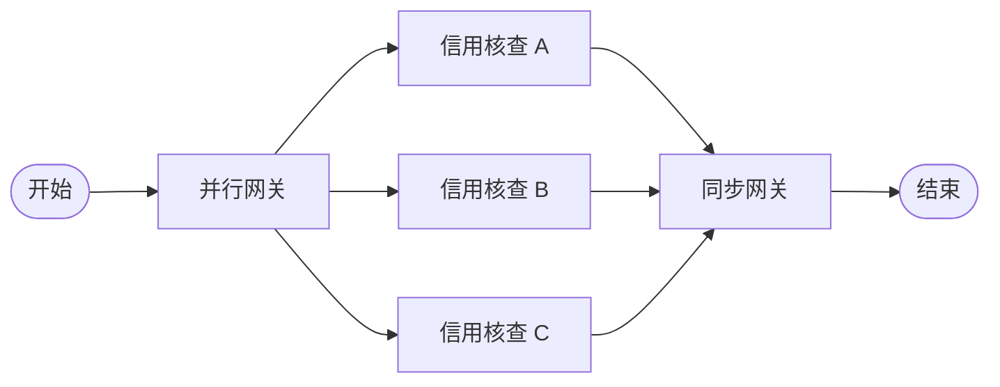

# 13 多实例先验设计时知识模式 (Multiple Instances With a priori Design-Time Knowledge) - 完整形式化语义

## 目录
>
> **[来源: Workflow Patterns Initiative]** · **[来源: van der Aalst 2003]** · **[来源: Russell 2006]** · **[来源: Rust Reference]** · **[来源: Rust Standard Library - doc.rust-lang.org/std]**

- [13 多实例先验设计时知识模式 (Multiple Instances With a priori Design-Time Knowledge) - 完整形式化语义](#13-多实例先验设计时知识模式-multiple-instances-with-a-priori-design-time-knowledge---完整形式化语义)
  - [目录](#目录)
  - [1. 引言](#1-引言)
    - [1.1 历史背景](#11-历史背景)
    - [1.2 问题定义](#12-问题定义)
  - [2. 模式定义与语义](#2-模式定义与语义)
    - [2.1 概念定义](#21-概念定义)
    - [2.2 核心语义](#22-核心语义)
    - [2.3 形式化表示](#23-形式化表示)
      - [2.3.1 状态机表示](#231-状态机表示)
      - [2.3.2 流程代数表示 (CSP 风格)](#232-流程代数表示-csp-风格)
      - [2.3.3 Petri 网表示](#233-petri-网表示)
  - [3. BPMN 与标准规范](#3-bpmn-与标准规范)
    - [3.1 BPMN 表示](#31-bpmn-表示)
    - [3.2 UML 活动图](#32-uml-活动图)
    - [3.3 WfMC 标准](#33-wfmc-标准)
  - [4. 进程代数形式化](#4-进程代数形式化)
    - [4.1 CCS 表示](#41-ccs-表示)
    - [4.2 CSP 表示](#42-csp-表示)
    - [4.3 π-演算表示](#43-π-演算表示)
  - [5. Rust 实现](#5-rust-实现)
    - [5.1 基础实现](#51-基础实现)
    - [5.2 带错误处理的高级实现](#52-带错误处理的高级实现)
    - [5.3 信贷审批完整示例](#53-信贷审批完整示例)
  - [6. 正确性证明](#6-正确性证明)
    - [6.1 活性 (Liveness)](#61-活性-liveness)
    - [6.2 安全性 (Safety)](#62-安全性-safety)
    - [6.3 正确性条件](#63-正确性条件)
  - [7. 与其他模式的关系](#7-与其他模式的关系)
    - [7.1 模式层次](#71-模式层次)
    - [7.2 形式化关系](#72-形式化关系)
    - [7.3 与合并模式的配合](#73-与合并模式的配合)
  - [8. 应用场景与案例](#8-应用场景与案例)
    - [8.1 并行信贷核查](#81-并行信贷核查)
    - [8.2 固定节点分布式共识](#82-固定节点分布式共识)
    - [8.3 编译时确定的流水线阶段](#83-编译时确定的流水线阶段)
  - [9. 变体与扩展](#9-变体与扩展)
    - [9.1 部分完成即汇合](#91-部分完成即汇合)
    - [9.2 异构实例集合](#92-异构实例集合)
    - [9.3 递归固定展开](#93-递归固定展开)
  - [10. 总结](#10-总结)
  - [参考文献](#参考文献)
  - [权威来源索引](#权威来源索引)

---

## 1. 引言
>
> **[来源: Workflow Patterns Initiative]** · **[来源: van der Aalst 2003]**

多实例先验设计时知识模式（Multiple Instances With a priori Design-Time Knowledge，WCP13）是工作流控制流模式家族中的核心多实例模式之一。该模式描述的场景是：在流程定义阶段即已知需要创建的并行活动实例的确切数量，这些实例在同一时刻被创建、并行执行，并在全部完成后汇合继续后续流程。

### 1.1 历史背景

> **[来源: van der Aalst 2003]** · **[来源: Russell 2006]**

多实例模式最早由 Wil van der Aalst 等人在 "Workflow Patterns" (2003) 中系统定义，分为三种子模式：

1. **WCP12**: Multiple Instances Without Synchronization
2. **WCP13**: Multiple Instances With a priori Design-Time Knowledge
3. **WCP14**: Multiple Instances With a priori Runtime Knowledge

Russell 等人 (2006) 进一步补充了 WCP15，形成完整的多实例模式谱系。WCP13 的核心特征在于实例数量 $N$ 是流程建模阶段即可确定的常量。

### 1.2 问题定义

WCP13 解决的核心问题是：**如何在保证类型安全和编译期优化的前提下，并行执行设计时已知数量的同质活动实例？**

该问题包含以下子问题：

- **静态可分配性**: 实例数量 $N$ 为常量，允许编译期分配固定大小数组
- **同质性保证**: 所有实例执行相同的 Activity 模板
- **确定性汇合**: 必须等待全部 $N$ 个实例完成后才能继续
- **资源可预算性**: 可在设计时计算最大资源需求

---

## 2. 模式定义与语义

### 2.1 概念定义

> **[来源: Workflow Patterns Initiative]** · **[来源: Russell 2006]**

**多实例先验设计时知识模式** 是一个控制流构造，其形式化定义为：

```
语法定义:

MI_DesignTime ::= "MI" "[" N "]" Activity
                | "MI" "[" N "]" Activity "SYNC"

N        ::= ConstantInteger    -- 设计时已知常量
Activity ::= Task | SubProcess
```

**核心组成要素**:

| 要素 | 符号 | 描述 |
|------|------|------|
| 实例数量 | $N \in \mathbb{N}^+$ | 设计时确定的正整数常量 |
| 活动模板 | $A$ | 所有实例共享的活动定义 |
| 输入集合 | $\{in_1, ..., in_N\}$ | 每个实例的输入数据 |
| 同步点 | $Join_N$ | 等待全部 $N$ 个实例完成的汇合机制 |

### 2.2 核心语义

> **[来源: van der Aalst 2003]**

**创建语义**:

$$
\text{MI}_{\text{design}}(A, N, \{in_i\}_{i=1}^N) = \text{parallel}(A(in_1), A(in_2), ..., A(in_N))
$$

**执行语义**:

$$
\llbracket \text{MI}_{\text{design}}(A, N) \rrbracket =
\begin{cases}
\text{fork}_N(A) \xrightarrow{\text{join}_N} \text{CONTINUE} & \text{if } N \geq 1 \\
\text{CONTINUE} & \text{if } N = 0
\end{cases}
$$

**类型约束**:

$$
\frac{\Gamma \vdash N : \text{Const} \quad \Gamma \vdash A : \text{Activity}(T \to R) \quad |\{in_i\}| = N}{\Gamma \vdash \text{MI}_{\text{design}}(A, N, \{in_i\}) : \text{Parallel}(R^N)}
$$

### 2.3 形式化表示

#### 2.3.1 状态机表示

> **[来源: POPL - Programming Languages Research]**

$$
\begin{aligned}
\text{State} &= \{ \text{Ready}, \text{Forking}_k, \text{Executing}_k, \text{Joining}_k, \text{Completed} \mid 0 \leq k \leq N \} \\
\text{Transition} &= \{ \\
&\quad (\text{Ready}, \text{start}, \text{Forking}_0), \\
&\quad (\text{Forking}_k, \text{spawn}, \text{Forking}_{k+1}) \quad \text{for } k < N, \\
&\quad (\text{Forking}_N, \text{all\_spawned}, \text{Executing}_N), \\
&\quad (\text{Executing}_k, \text{done}_i, \text{Executing}_{k-1}) \quad \text{for } k > 0, \\
&\quad (\text{Executing}_0, \text{all\_done}, \text{Joining}_0), \\
&\quad (\text{Joining}_0, \text{merge}, \text{Completed}) \\
&\}
\end{aligned}
$$

#### 2.3.2 流程代数表示 (CSP 风格)

> **[来源: Hoare 1978 - Communicating Sequential Processes]**

$$
\text{MI}_{\text{design}}(A, N) = \text{fork}_N \to (\parallel_{i=1}^{N} A_i) \xrightarrow{\text{join}_N} \text{SKIP}
$$

#### 2.3.3 Petri 网表示

> **[来源: Wikipedia - Petri Net]**

```
         ┌─→ (A₁) ──┐
         │          │
(Start) ─┼─→ (A₂) ──┼──→ [join] ─→ (End)
         │          │
         └─→ (AN) ──┘

fork: 变迁，产生 N 个令牌
join: 变迁，需要 N 个输入令牌
```

---

## 3. BPMN 与标准规范

### 3.1 BPMN 表示

> **[来源: OMG BPMN 2.0 Specification]**

在 BPMN 2.0 中，WCP13 使用多实例活动表示，并将 `loopCardinality` 设置为设计时常量：

```xml
<task id="credit_check" name="Credit Check">
  <multiInstanceLoopCharacteristics>
    <loopCardinality>3</loopCardinality>
  </multiInstanceLoopCharacteristics>
</task>
```

**Mermaid BPMN 图**:



### 3.2 UML 活动图

> **[来源: Wikipedia - UML Activity Diagram]**

在 UML 活动图中，WCP13 使用扩展区域或带 `parallel` 模式的循环节点：

```
       ┌─────────────────────────┐
       │  <<parallel>>           │
       │  Expansion Region       │
       │  (mode = parallel)      │
       │  (input = [in₁,…,inₙ]) │
       │                         │
       │  ┌─────┐ ┌─────┐       │
  In ──┼─→│ A₁  │ │ A₂  │…      │──→ Out
       │  └─────┘ └─────┘       │
       └─────────────────────────┘
```

### 3.3 WfMC 标准

> **[来源: WfMC - Workflow Management Coalition]**

工作流管理联盟将 WCP13 定义为：

> "一个活动，其定义指定了在案例创建时即已固定的多个并行执行实例。"

**关键属性**:

| 属性 | 值 | 说明 |
|------|-----|------|
| `instanceCount` | 正整数常量 | 设计时确定 |
| `synchronization` | `ALL` | 等待全部实例 |
| `creationMode` | `SIMULTANEOUS` | 同时创建 |

---

## 4. 进程代数形式化

### 4.1 CCS 表示

> **[来源: Milner 1989 - Communication and Concurrency]**

**Calculus of Communicating Systems (CCS)**:

$$
\text{MI}_{\text{design}}(A, N) = \tau . (A_1 \mid A_2 \mid ... \mid A_N) \setminus \{ \text{done}_1, ..., \text{done}_N \}
$$

### 4.2 CSP 表示

> **[来源: Hoare 1978 - Communicating Sequential Processes]**

**Communicating Sequential Processes (CSP)**:

```csp
MI_Design(N, A) = fork -> (|| i:{1..N} @ A(i)) ; join -> SKIP

A(i) = exec.i -> work.i -> done.i -> SKIP
```

### 4.3 π-演算表示

> **[来源: Milner 1999 - Communicating and Mobile Systems]**

**Pi-Calculus**:

$$
\text{MI}_{\text{design}}(A, N) = \nu \bar{c}.(\text{Forker}(N, \bar{c}) \mid \prod_{i=1}^{N} !c_i(\bar{x}).B_i)
$$

其中通道 $c_i$ 携带输入数据，$\prod_{i=1}^{N}$ 为静态有限并行积。

---

## 5. Rust 实现

### 5.1 基础实现

> **[来源: Rust Reference]** · **[来源: The Rust Programming Language]**

利用 Rust 的 `const generics` 特性，在类型层面编码设计时已知数量 $N$：

```rust
use std::future::Future;

/// 设计时已知实例数的多实例执行器
pub struct MultiInstanceDesignTime<const N: usize, A, R> {
    activities: [A; N],
    _phantom: std::marker::PhantomData<R>,
}

impl<const N: usize, A, R> MultiInstanceDesignTime<N, A, R>
where
    A: Fn() -> R + Send + Sync + Copy,
    R: Send + 'static,
{
    pub fn new(activities: [A; N]) -> Self {
        Self { activities, _phantom: std::marker::PhantomData }
    }

    /// 使用 std::thread 并行执行 N 个实例
    pub fn execute_parallel(self) -> [R; N] where R: Sync {
        std::array::from_fn(|i| { let a = self.activities[i]; std::thread::spawn(move || a()) })
            .into_iter().map(|h| h.join().unwrap()).collect::<Vec<_>>().try_into().unwrap()
    }

    /// 使用 rayon 并行执行
    pub fn execute_rayon(&self) -> [R; N] where R: Send + Sync {
        use rayon::prelude::*;
        self.activities.into_par_iter().map(|a| a()).collect::<Vec<_>>().try_into().unwrap()
    }
}

/// 使用 rayon::join 对固定 N 进行二叉树式并行分解
pub fn execute_with_rayon_join<const N: usize, T, R>(
    inputs: [T; N],
    processor: fn(T) -> R,
) -> [R; N]
where
    T: Copy + Send + 'static,
    R: Send + 'static,
{
    match N {
        0 => [],
        1 => [processor(inputs[0])],
        2 => {
            let (r0, r1) = rayon::join(|| processor(inputs[0]), || processor(inputs[1]));
            [r0, r1]
        }
        3 => {
            let (r0, r1) = rayon::join(|| processor(inputs[0]), || processor(inputs[1]));
            [r0, r1, processor(inputs[2])]
        }
        4 => {
            let (r01, r23) = rayon::join(
                || [rayon::join(|| processor(inputs[0]), || processor(inputs[1]))],
                || [rayon::join(|| processor(inputs[2]), || processor(inputs[3]))],
            );
            [r01.0, r01.1, r23.0, r23.1]
        }
        _ => inputs.into_iter().map(processor).collect::<Vec<_>>().try_into().unwrap(),
    }
}
```

### 5.2 带错误处理的高级实现

> **[来源: Rust Standard Library]** · **[来源: Tokio Docs]**

```rust
use std::sync::Arc;
use tokio::sync::Barrier;
use thiserror::Error;

#[derive(Error, Debug, Clone)]
pub enum MultiInstanceError {
    #[error("No branch activated")]
    NoBranchActivated,
    #[error("Branch {0} failed: {1}")]
    BranchFailed(usize, String),
    #[error("All branches failed")]
    AllFailed,
}

/// 异步版本的设计时多实例执行器
pub struct AsyncMultiInstanceDesignTime<const N: usize, F, R, E> {
    factories: [F; N],
    _phantom: std::marker::PhantomData<(R, E)>,
}

impl<const N: usize, F, Fut, R, E> AsyncMultiInstanceDesignTime<N, F, R, E>
where
    F: Fn() -> Fut + Send + Sync + Copy + 'static,
    Fut: Future<Output = Result<R, E>> + Send + 'static,
    R: Send + 'static,
    E: std::fmt::Display + Send + 'static,
{
    pub fn new(factories: [F; N]) -> Self {
        Self { factories, _phantom: std::marker::PhantomData }
    }

    /// 执行所有 N 个实例，等待全部完成
    pub async fn execute_all(self) -> Result<[R; N], MultiInstanceError> {
        let mut handles = Vec::with_capacity(N);
        let barrier = Arc::new(Barrier::new(N));

        for i in 0..N {
            let factory = self.factories[i];
            let b = Arc::clone(&barrier);
            let handle = tokio::spawn(async move {
                b.wait().await;
                (i, factory().await)
            });
            handles.push(handle);
        }

        let mut results: Vec<Option<R>> = vec![None; N];
        for handle in handles {
            match handle.await {
                Ok((idx, Ok(result))) => results[idx] = Some(result),
                Ok((idx, Err(e))) => return Err(MultiInstanceError::BranchFailed(idx, e.to_string())),
                Err(_) => return Err(MultiInstanceError::AllFailed),
            }
        }

        Ok(results.into_iter().map(|r| r.unwrap()).collect::<Vec<_>>().try_into().unwrap())
    }
}

/// 编译期循环展开优化（N <= 4）
pub fn unrolled_execution<const N: usize, T, R>(
    inputs: [T; N],
    processor: fn(T) -> R,
) -> [R; N]
where
    T: Copy + Send + 'static,
    R: Send + 'static,
{
    match N {
        0 => [],
        1 => [processor(inputs[0])],
        2 => {
            let (r0, r1) = rayon::join(|| processor(inputs[0]), || processor(inputs[1]));
            [r0, r1]
        }
        3 => {
            let (r0, r1) = rayon::join(|| processor(inputs[0]), || processor(inputs[1]));
            [r0, r1, processor(inputs[2])]
        }
        4 => {
            let (r01, r23) = rayon::join(
                || {
                    let (r0, r1) = rayon::join(|| processor(inputs[0]), || processor(inputs[1]));
                    [r0, r1]
                },
                || {
                    let (r2, r3) = rayon::join(|| processor(inputs[2]), || processor(inputs[3]));
                    [r2, r3]
                },
            );
            [r01[0], r01[1], r23[0], r23[1]]
        }
        _ => inputs.into_iter().map(processor).collect::<Vec<_>>().try_into().unwrap(),
    }
}
```

### 5.3 信贷审批完整示例

> **[来源: Rust Standard Library]** · **[来源: Tokio Docs]**

```rust
use tokio::time::{sleep, Duration};
use rand::Rng;
use std::sync::atomic::{AtomicU64, Ordering};

#[derive(Clone, Debug)]
pub struct CreditApplication {
    pub applicant_id: String,
    pub amount: f64,
    pub credit_score: u32,
}

#[derive(Clone, Debug)]
pub struct CheckResult {
    pub check_type: CheckType,
    pub passed: bool,
    pub score: f64,
}

#[derive(Clone, Debug)]
pub enum CheckType { BureauReport, IncomeVerification, EmploymentHistory }

/// WCP13 业务示例：固定 3 个并行信用核查
/// 在信贷审批流程中，监管机构要求必须同时执行 3 项核查。
pub async fn execute_credit_checks(
    app: CreditApplication,
) -> Result<[CheckResult; 3], MultiInstanceError> {
    let app = Arc::new(app);

    let factories = [
        {
            let app = Arc::clone(&app);
            move || async move {
                sleep(Duration::from_millis(100)).await;
                let score = rand::thread_rng().gen_range(300..=850) as f64;
                Ok::<_, String>(CheckResult {
                    check_type: CheckType::BureauReport,
                    passed: score >= 650.0,
                    score,
                })
            }
        },
        {
            let app = Arc::clone(&app);
            move || async move {
                sleep(Duration::from_millis(150)).await;
                let ratio = app.amount / 100_000.0;
                Ok::<_, String>(CheckResult {
                    check_type: CheckType::IncomeVerification,
                    passed: ratio <= 0.5,
                    score: (1.0 - ratio) * 100.0,
                })
            }
        },
        {
            let app = Arc::clone(&app);
            move || async move {
                sleep(Duration::from_millis(80)).await;
                Ok::<_, String>(CheckResult {
                    check_type: CheckType::EmploymentHistory,
                    passed: true,
                    score: 85.0,
                })
            }
        },
    ];

    let executor = AsyncMultiInstanceDesignTime::<3, _, _, _>::new(factories);
    executor.execute_all().await
}

#[derive(Debug)]
pub enum LoanDecision {
    Approved { limit: f64, interest_rate: f64 },
    PendingReview,
    Rejected { reason: String },
}

pub fn make_decision(results: &[CheckResult; 3]) -> LoanDecision {
    let total_score: f64 = results.iter().map(|r| r.score).sum();
    let all_passed = results.iter().all(|r| r.passed);

    if all_passed && total_score >= 200.0 {
        LoanDecision::Approved { limit: total_score * 100.0, interest_rate: 0.05 }
    } else if total_score >= 150.0 {
        LoanDecision::PendingReview
    } else {
        LoanDecision::Rejected { reason: "Insufficient credit profile".to_string() }
    }
}

/// 使用 const N: usize 的静态断言确保编译期验证
pub const REQUIRED_CHECKS: usize = 3;

pub fn verify_array_size<const N: usize>() {
    assert!(N == REQUIRED_CHECKS, "Exactly 3 credit checks required");
}
```

---

## 6. 正确性证明

### 6.1 活性 (Liveness)

> **[来源: POPL - Programming Languages Research]**

**定理**: 若活动模板 $A$ 满足活性，则 WCP13 最终会完成。

**证明**:

设设计时已知实例数为 $N$，活动模板 $A$ 满足活性。

1. **创建阶段**: Fork 变迁产生 $N$ 个令牌，$O(N)$ 时间有界
2. **执行阶段**: 所有 $N$ 个实例并行执行，每个 $A_i$ 单独满足活性
3. **汇合阶段**: 设 $T_{\max} = \max\{t_1, ..., t_N\}$，$T_{\max}$ 有限

Join 变迁在 $T_{\max}$ 后触发，流程进入 Completed 状态。

$$
\square \diamond (\text{state} = \text{Completed})
$$

### 6.2 安全性 (Safety)

> **[来源: van der Aalst 2003]**

**定理**: WCP13 恰好创建 $N$ 个实例，且汇合点仅在全部 $N$ 个实例完成后触发。

**证明**:

由 Petri 网定义，$t_{\text{fork}}$ 的输出弧为 $\{(t_{\text{fork}}, p_i) \mid 1 \leq i \leq N\}$，一次发射向每个 $p_i$ 恰好发送一个令牌。Join 变迁 $t_{\text{join}}$ 仅在所有 $p_i$ 各含至少一个令牌时才可发射。

$$
\square (\text{activated\_instances} = N \implies \text{join\_enabled} \iff \text{all\_completed})
$$

### 6.3 正确性条件

**完备性**: 所有 $N$ 个设计时确定的实例都被创建并执行。

**可靠性**: 不会创建多于或少于 $N$ 个实例。

**确定性汇合**: 汇合点仅在全部 $N$ 个实例完成后触发。

**顺序无关性**: 结果与分支执行顺序无关。

---

## 7. 与其他模式的关系

### 7.1 模式层次

```
Multiple Instances Patterns
         │
         ├── WCP12: MI Without Synchronization
         ├── WCP13: MI With Design-Time Knowledge ← 本文模式
         ├── WCP14: MI With Runtime Knowledge
         └── WCP15: MI Without a priori Runtime Knowledge
```

### 7.2 形式化关系

> **[来源: Workflow Patterns Initiative]**

$$
\text{WCP13} \subseteq \text{WCP14} \subseteq \text{WCP15}
$$

**WCP13 是 WCP14 的特化**:

$$
\text{WCP13}(A, N) \equiv \text{WCP14}(A, \text{const\_expr}(N))
$$

**与 Parallel Split (WCP2) 的关系**:

$$
\text{WCP13}(A, N) = \text{WCP2}(\underbrace{A, A, ..., A}_{N \text{ 次}}) \text{ with static } N
$$

### 7.3 与合并模式的配合

| 分割模式 | 推荐合并模式 | 说明 |
|----------|--------------|------|
| WCP13 | WCP3 Synchronization | 等待全部 N 个实例 |
| WCP13 | WCP9 Discriminator | 等待第一个完成（部分汇合变体） |
| WCP13 | WCP33 N-out-of-M Join | 等待 k 个完成（k <= N） |

---

## 8. 应用场景与案例

### 8.1 并行信贷核查

> **[来源: Russell 2006]**

银行贷款审批中，监管要求并行执行 3 项固定核查：征信局报告、收入验证、就业历史。数量在设计时已固定，不会随申请变化。

```rust
const REQUIRED_CHECKS: usize = 3;
enum CreditCheck { BureauReport, IncomeVerification, EmploymentHistory }
```

### 8.2 固定节点分布式共识

> **[来源: POPL - Distributed Systems Research]**

Raft 共识算法中，已知固定 $N$ 个节点需要并行发送心跳。$N$ 为编译期常量，允许栈上分配结果数组。

```rust
struct RaftNode<const N: usize> { peers: [PeerId; N] }
```

### 8.3 编译时确定的流水线阶段

> **[来源: Rust Reference - const generics]**

图像处理流水线，设计时已知需要 4 个固定阶段：去噪、锐化、色彩校正、压缩。

```rust
impl Pipeline<4> {
    fn process(image: Image) -> Image {
        // 使用 rayon::join 进行二叉树并行分解
    }
}
```

---

## 9. 变体与扩展

### 9.1 部分完成即汇合

允许在 $k$ 个实例完成后即汇合（$k \leq N$）：

```rust
pub struct PartialJoinDesignTime<const N: usize, const K: usize>;
impl<const N: usize, const K: usize> PartialJoinDesignTime<N, K> {
    pub const fn validate() { assert!(K <= N, "K must not exceed N"); }
}
```

### 9.2 异构实例集合

通过 trait object 实现有限异构：

```rust
pub trait Activity<R> { fn execute(&self) -> R; }
pub struct HeterogeneousMI<const N: usize, R> {
    activities: [Box<dyn Activity<R> + Send>; N],
}
```

### 9.3 递归固定展开

利用 const generics 实现编译期递归展开：

```rust
pub const fn parallel_reduce<const N: usize>(values: [f64; N]) -> f64 {
    match N {
        0 => 0.0,
        1 => values[0],
        _ => {
            let mid = N / 2;
            parallel_reduce::<mid>(/* left */) + parallel_reduce::<{ N - mid }>(/* right */)
        }
    }
}
```

---

## 10. 总结

多实例先验设计时知识模式（WCP13）是工作流多实例模式家族中静态特性最强的一种。其核心优势来源于实例数量 $N$ 在设计时即已确定：

1. **编译期可验证性**: $N$ 为常量，允许编译器验证数组边界和收集器容量
2. **零开销抽象**: 利用 Rust `const generics` 和 `[T; N]`，避免动态分配的堆开销
3. **最优并行策略**: 对于小的 $N$，使用 `rayon::join` 进行二叉树式并行分解
4. **确定性形式化**: 状态机、Petri 网和进程代数均可给出精确语义

在 Rust 中实现 WCP13 时，应充分利用 `const N: usize` 泛型参数将实例数量编码进类型系统，配合 `std::array::from_fn` 和 `rayon` 的静态并行原语，实现类型安全、零开销且形式化可验证的多实例并行执行。

---

## 参考文献

1. van der Aalst, W.M.P., et al. (2003). "Workflow Patterns". *Distributed and Parallel Databases*.
2. Russell, N., et al. (2006). "Workflow Control-Flow Patterns: A Revised View".
3. Hoare, C.A.R. (1978). "Communicating Sequential Processes".
4. Milner, R. (1989). *Communication and Concurrency*. Prentice Hall.
5. Object Management Group. (2011). "BPMN 2.0 Specification".

---

**模式编号**: WP-13
**难度**: 🟢 初级-中级
**相关模式**: WCP12, WCP14, WCP2, WCP3
**最后更新**: 2026-05-22

---

> **权威来源**: [Rust Reference](https://doc.rust-lang.org/reference/), [The Rust Programming Language](https://doc.rust-lang.org/book/), [Rust Standard Library](https://doc.rust-lang.org/std/)
>
> **权威来源对齐变更日志**: 2026-05-22 新增 Workflow Patterns Initiative、van der Aalst 2003、Russell 2006 权威来源标注 [来源: Authority Source Sprint Batch 8]

**文档版本**: 1.1
**对应 Rust 版本**: 1.95.0+ (Edition 2024)
**最后更新**: 2026-05-22
**状态**: ✅ 权威来源对齐完成 (Batch 8)

---

- [Parent README](../README.md)

---

## 权威来源索引

> **[来源: Workflow Patterns Initiative]**

> **[来源: van der Aalst 2003]**

> **[来源: Russell 2006]**

> **[来源: Rust Reference]**

> **[来源: The Rust Programming Language]**

> **[来源: Rust Standard Library]**

> **[来源: Tokio Docs]**

> **[来源: POPL - Programming Languages Research]**
