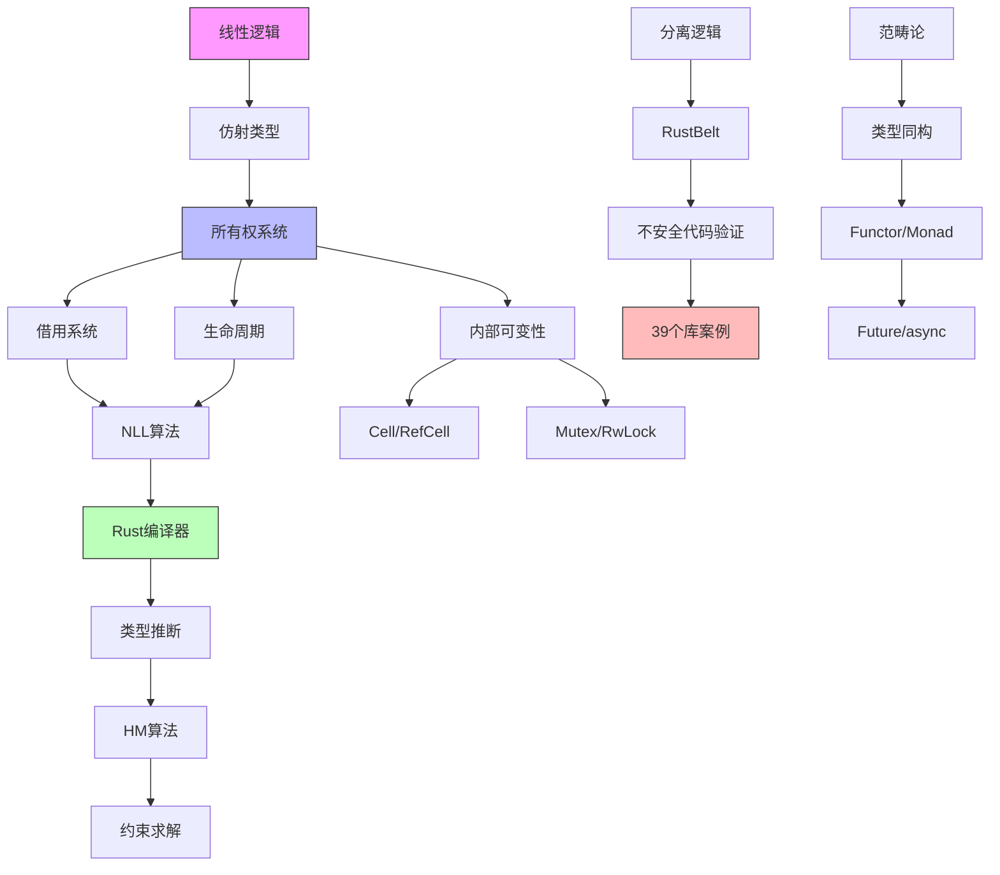

# Rust所有权系统论证框架 - 多维度分析

## 一、论证推理树图

### 1.1 所有权正确性论证树

```text
                    ┌─────────────────────────┐
                    │   Rust内存安全保证        │
                    │   (核心命题)              │
                    └───────────┬─────────────┘
                                │
              ┌─────────────────┼─────────────────┐
              │                 │                 │
              ▼                 ▼                 ▼
    ┌─────────────────┐ ┌──────────────┐ ┌─────────────────┐
    │  所有权系统      │ │ 借用检查器    │ │ 类型系统         │
    │  (独占访问)      │ │ (引用安全)    │ │ (约束传播)       │
    └───────┬─────────┘ └──────┬───────┘ └────────┬────────┘
            │                  │                  │
    ┌───────┴───────┐  ┌──────┴──────┐  ┌────────┴────────┐
    │               │  │             │  │                 │
    ▼               ▼  ▼             ▼  ▼                 ▼
┌────────┐    ┌──────────┐  ┌──────────┐  ┌────────────┐ ┌────────────┐
│RAII    │    │移动语义   │  │共享借用&T │  │生命周期    │ │泛型约束    │
│drop    │    │(所有权转移)│  │(多读)     │  │(作用域边界)│ │(Send/Sync) │
│保证    │    │          │  │           │  │            │ │            │
└────────┘    └──────────┘  └──────────┘  └────────────┘ └────────────┘
                                   │
                          ┌────────┴────────┐
                          │                 │
                          ▼                 ▼
                   ┌──────────┐      ┌──────────┐
                   │独占借用  │      │可变性控制│
                   │&mut T    │      │内部可变 │
                   │(单写)    │      │UnsafeCell│
                   └──────────┘      └──────────┘
```

### 1.2 可判定性论证树

```text
                    ┌─────────────────────────┐
                    │  Rust类型系统可判定性    │
                    └───────────┬─────────────┘
                                │
          ┌─────────────────────┼─────────────────────┐
          │                     │                     │
          ▼                     ▼                     ▼
┌─────────────────┐   ┌─────────────────┐   ┌─────────────────┐
│  类型推断可判定   │   │ 借用检查可判定   │   │ 泛型求解可判定   │
│  (HM算法)        │   │ (NLL算法)        │   │ (约束满足)      │
└───────┬─────────┘   └────────┬────────┘   └────────┬────────┘
        │                      │                     │
   ┌────┴────┐            ┌────┴────┐          ┌────┴────┐
   │         │            │         │          │         │
   ▼         ▼            ▼         ▼          ▼         ▼
┌──────┐  ┌──────┐   ┌──────┐  ┌──────┐   ┌──────┐  ┌──────┐
│统一  │  │约束  │   │区域  │  │约束  │   │关联  │  │常量  │
│算法  │  │生成  │   │推断  │  │求解  │   │类型  │  │泛型  │
│O(n)  │  │O(n)  │   │O(n³) │  │O(n)  │   │GATs  │  │计算  │
└──────┘  └──────┘   └──────┘  └──────┘   └──────┘  └──────┘
```

---

## 二、多维概念矩阵对比

### 2.1 类型系统维度矩阵

| 概念维度 | 所有权 | 借用 | 生命周期 | 内部可变性 |
|:---------|:-------|:-----|:---------|:-----------|
| **核心机制** | 独占访问 | 引用临时 | 作用域标注 | 运行时检查 |
| **静态/动态** | 编译时 | 编译时 | 编译时 | 运行时 |
| **性能开销** | 零成本 | 零成本 | 零成本 | 运行时开销 |
| **表达能力** | 完全拥有 | 临时访问 | 约束传播 | 可变共享 |
| **安全保证** | 无use-after-free | 无悬垂指针 | 无越界访问 | 无数据竞争 |
| **形式化模型** | 线性逻辑 | 仿射类型 | 区域系统 | 分离逻辑 |
| **典型类型** | `T` | `&T`, `&mut T` | `'a` | `Cell<T>`, `RefCell<T>` |
| **转换关系** | move/clone | reborrow | subset | downgrade |

### 2.2 形式化方法对比矩阵

| 方法 | 表达能力 | 自动化 | 适用场景 | 工具支持 |
|:-----|:---------|:-------|:---------|:---------|
| **RustBelt** | 高 | 低 | 不安全代码验证 | Iris/Coq |
| **Creusot** | 高 | 中 | 函数契约验证 | Why3 |
| **Prusti** | 高 | 高 | 一般代码验证 | Viper |
| **Kani** | 中 | 高 | 属性测试 | CBMC |
| **Miri** | 中 | 高 | UB检测 | 解释器 |
| **类型系统** | 中 | 高 | 编译时检查 | rustc |

### 2.3 库案例形式化深度矩阵

| 库类别 | 数量 | 定义数 | 定理数 | 现代特性 | 安全保证 |
|:-------|:-----|:-------|:-------|:---------|:---------|
| 嵌入式 | 15 | 60+ | 45+ | const泛型 | 资源约束 |
| Web/网络 | 7 | 50+ | 35+ | async/GATs | 类型安全路由 |
| 数据库 | 3 | 20+ | 15+ | GATs/宏 | SQL注入防护 |
| 并发原语 | 5 | 35+ | 25+ | 原子操作 | 无数据竞争 |
| FFI/工具 | 4 | 35+ | 25+ | unsafe边界 | 内存安全 |
| **总计** | **39** | **200+** | **145+** | **全覆盖** | **多层次** |

---

## 三、应用场景决策树

### 3.1 类型选择决策树

```text
                      ┌──────────────┐
                      │需要共享数据？ │
                      └──────┬───────┘
                             │
              ┌──────────────┴──────────────┐
              │是                            │否
              ▼                              ▼
    ┌──────────────────┐         ┌──────────────────┐
    │ 需要修改？        │         │ 使用所有权       │
    └────────┬─────────┘         │ let x = value;   │
             │                   │ x.do_something() │
    ┌────────┴────────┐          └──────────────────┘
    │是                │否
    ▼                  ▼
┌──────────┐   ┌──────────────┐
│ 编译时    │   │ 共享借用      │
│ 确定？    │   │ &T            │
└────┬─────┘   └──────────────┘
     │
┌────┴────┐
│是        │否
▼          ▼
┌────────────┐  ┌──────────────┐
│ RefCell<T> │  │ Mutex<T>     │
│ (单线程)    │  │ RwLock<T>    │
│            │  │ (多线程)      │
└────────────┘  └──────────────┘
```

### 3.2 并发模型选择决策树

```text
                    ┌─────────────────┐
                    │ 需要并发/并行？  │
                    └────────┬────────┘
                             │
              ┌──────────────┴──────────────┐
              │是                            │否
              ▼                              ▼
    ┌──────────────────┐         ┌──────────────────┐
    │ CPU密集型？       │         │ 顺序执行          │
    └────────┬─────────┘         │ for x in data    │
             │                   └──────────────────┘
    ┌────────┴────────┐
    │是                │否
    ▼                  ▼
┌────────────┐   ┌──────────────────┐
│ 数据并行    │   │ IO密集型？        │
│ rayon      │   │ (async/await)    │
│ par_iter() │   └────────┬─────────┘
└────────────┘            │
                 ┌────────┴────────┐
                 │是                │否
                 ▼                  ▼
            ┌──────────┐     ┌──────────────┐
            │ 需要共享  │     │ 事件驱动      │
            │ 状态？    │     │ 回调/消息     │
            └────┬─────┘     └──────────────┘
                 │
        ┌────────┴────────┐
        │是                │否
        ▼                  ▼
   ┌──────────┐      ┌──────────┐
   │ Actor    │      │ tokio    │
   │ actix    │      │ async fn │
   └──────────┘      └──────────┘
```

### 3.3 验证工具选择决策树

```text
                    ┌─────────────────┐
                    │ 需要形式化验证？  │
                    └────────┬────────┘
                             │
              ┌──────────────┴──────────────┐
              │是                            │否
              ▼                              ▼
    ┌──────────────────┐         ┌──────────────────┐
    │ 验证目标？        │         │ 标准Rust编译器    │
    └────────┬─────────┘         │ rustc            │
             │                   │ 借用检查器        │
    ┌────────┴────────┐          └──────────────────┘
    │不安全代码边界    │一般函数契约
    ▼                  ▼
┌────────────┐   ┌──────────────────┐
│ Miri       │   │ 需要完全自动化？   │
│ (UB检测)   │   └────────┬─────────┘
└────────────┘            │
                 ┌────────┴────────┐
                 │是                │否
                 ▼                  ▼
            ┌──────────┐     ┌──────────────┐
            │ Kani     │     │ Creusot      │
            │ (模型检测)│     │ (Why3)       │
            └──────────┘     └──────────────┘
```

---

## 四、核心论证链

### 4.1 所有权系统正确性论证链

```text
┌─────────────────────────────────────────────────────────────────────┐
│ 前提1: 线性逻辑资源敏感                                              │
│   ∀x: T. x 被消耗当且仅当 x 被使用恰好一次                            │
├─────────────────────────────────────────────────────────────────────┤
│ 前提2: 仿射类型弱化                                                  │
│   允许不使用 (x: T 可以不被消耗)                                      │
├─────────────────────────────────────────────────────────────────────┤
│ 前提3: Rust所有权规则                                                │
│   ① 每个值有唯一所有者                                               │
│   ② 所有者离开作用域时值被drop                                       │
│   ③ 值可被移动(move)转移所有权                                       │
├─────────────────────────────────────────────────────────────────────┤
│ 推论1: 无悬垂指针                                                    │
│   所有者离开 → drop调用 → 内存释放 → 无悬垂引用                       │
├─────────────────────────────────────────────────────────────────────┤
│ 推论2: 无use-after-free                                              │
│   所有权转移后原变量不可用 → 编译错误 → 阻止非法访问                   │
├─────────────────────────────────────────────────────────────────────┤
│ 结论: Rust所有权系统保证内存安全                                       │
│   compile-time checks + runtime drop = memory safety                 │
└─────────────────────────────────────────────────────────────────────┘
```

### 4.2 借用检查器正确性论证链

```text
┌─────────────────────────────────────────────────────────────────────┐
│ 前提1: 引用的引用规则                                                │
│   &T: 共享引用 (0+ 读者)                                             │
│   &mut T: 独占引用 (1 写者, 0 读者)                                  │
├─────────────────────────────────────────────────────────────────────┤
│ 前提2: 生命周期约束                                                  │
│   'a: 'b (a 包含 b)                                                 │
│   ∀r: &'a T. r 有效 ⟹ 'a 有效                                        │
├─────────────────────────────────────────────────────────────────────┤
│ 前提3: NLL (Non-Lexical Lifetimes)                                   │
│   生命周期基于实际使用而非词法作用域                                   │
├─────────────────────────────────────────────────────────────────────┤
│ 推论1: 读写互斥                                                      │
│   ∃&mut T ⟹ ¬∃&T (同时)                                             │
├─────────────────────────────────────────────────────────────────────┤
│ 推论2: 无数据竞争                                                    │
│   编译时强制 &mut T 独占 + Sync trait = 线程安全                      │
├─────────────────────────────────────────────────────────────────────┤
│ 结论: 借用检查器保证引用安全                                           │
│   aliasing XOR mutation = memory safety                              │
└─────────────────────────────────────────────────────────────────────┘
```

### 4.3 形式化验证层次结构

```text
Level 4: 应用验证 ──────────────────────────────────────┐
         39个库案例研究, 定理证明                      │
                                                       ▼
Level 3: 工具验证 ──→ Creusot/Kani/Prusti ──→ 函数契约  │
                                                       │
Level 2: 类型系统 ──→ Rust编译器 ───────────→ 类型安全  │
                                                       │
Level 1: 形式语义 ──→ RustBelt/Iris ───────→ 逻辑基础  │
                                                       │
Level 0: 数学基础 ──→ 线性/分离逻辑 ───────→ 范畴论    │
────────────────────────────────────────────────────────┘
```

---

## 五、概念依赖关系图



---

## 六、综合论证脉络总结

### 6.1 三层架构

| 层级 | 内容 | 形式化工具 | 输出 |
|:-----|:-----|:-----------|:-----|
| **理论层** | 线性逻辑、仿射类型、分离逻辑 | 范畴论、类型论 | 数学模型 |
| **机制层** | 所有权、借用、生命周期 | Rust类型系统 | 编译时检查 |
| **应用层** | 39个库案例、模式、反模式 | Creusot/Miri | 工程实践 |

### 6.2 核心洞察

1. **资源敏感性**: 所有权 ≈ 线性逻辑中的资源
2. **时间维度**: 生命周期 ≈ 时序逻辑中的时态算子
3. **空间维度**: 分离逻辑 ≈ 堆的局部推理
4. **可判定性**: NLL使借用检查在多项式时间完成
5. **零成本**: 所有静态检查无运行时开销
