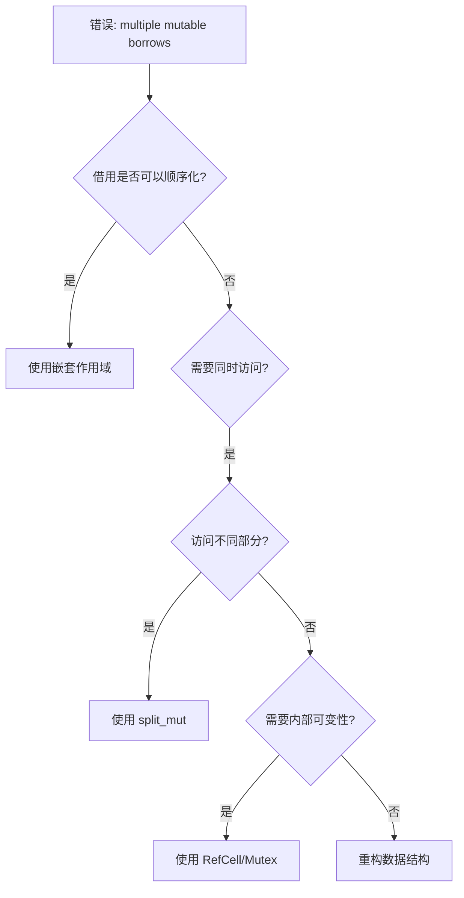
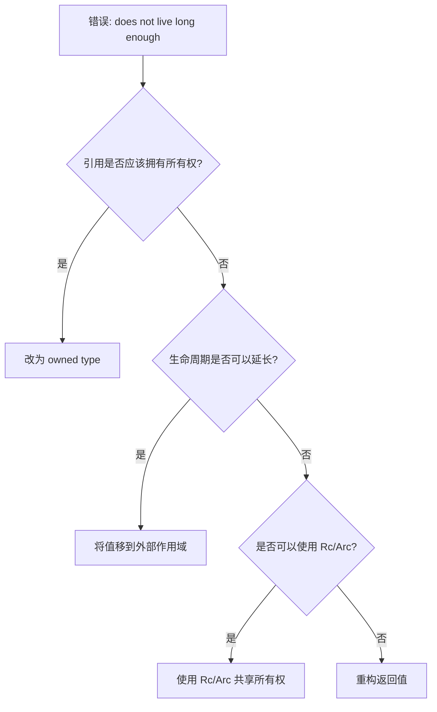

# Rust 所有权系统 - 错误诊断完全指南

> **Bloom 层级**: L5-L6 (分析/评价/创造)

> 系统化的错误诊断方法，从错误信息到解决方案

---

## 📑 目录
>
> **[来源: [Rust Reference](https://doc.rust-lang.org/reference/)]**
>
- [Rust 所有权系统 - 错误诊断完全指南](#rust-所有权系统---错误诊断完全指南)
  - [📑 目录](#-目录)
  - [🧭 诊断方法论](#-诊断方法论)
    - [三步诊断法](#三步诊断法)
  - [常见错误分类](#常见错误分类)
    - [E0382: 使用已移动的值](#e0382-使用已移动的值)
    - [E0499: 多重可变借用](#e0499-多重可变借用)
    - [E0502: 可变与不可变借用冲突](#e0502-可变与不可变借用冲突)
    - [E0597: 引用生命周期不够长](#e0597-引用生命周期不够长)
  - [生命周期相关错误](#生命周期相关错误)
    - [E0621: 显式生命周期要求](#e0621-显式生命周期要求)
    - [E0106: 缺少生命周期说明符](#e0106-缺少生命周期说明符)
  - [智能指针相关错误](#智能指针相关错误)
    - [E0500: 闭包同时需要可变和不可变借用](#e0500-闭包同时需要可变和不可变借用)
    - [E0716: 临时值生命周期太短](#e0716-临时值生命周期太短)
  - [并发相关错误](#并发相关错误)
    - [E0277: 类型未实现 Send](#e0277-类型未实现-send)
    - [E0596: 无法通过共享引用修改](#e0596-无法通过共享引用修改)
  - [诊断工具](#诊断工具)
    - [使用 rustc 详细输出](#使用-rustc-详细输出)
    - [使用 Clippy](#使用-clippy)
    - [使用 rust-analyzer](#使用-rust-analyzer)
  - [错误快速参考表](#错误快速参考表)
  - [预防性编程](#预防性编程)
    - [所有权友好的 API 设计](#所有权友好的-api-设计)
  - [练习](#练习)
    - [练习 1: 诊断并修复](#练习-1-诊断并修复)
    - [练习 2: 诊断并修复](#练习-2-诊断并修复)
  - [更多资源](#更多资源)
  - [*本指南持续更新，欢迎贡献*](#本指南持续更新欢迎贡献)
  - [相关概念](#相关概念)
  - [权威来源索引](#权威来源索引)
  - [权威来源索引](#权威来源索引-1)

## 🧭 诊断方法论
>
> **[来源: Rust Reference]** · **[来源: Wikipedia - Rust (programming language)]** · **[来源: Rustonomicon]** · **[来源: TRPL]** · **[来源: RFCs - github.com/rust-lang/rfcs]** · **[来源: Rust Standard Library - doc.rust-lang.org/std]**

### 三步诊断法
>
> **[来源: Rust Reference]** · **[来源: Wikipedia - Rust (programming language)]** · **[来源: Rustonomicon]** · **[来源: TRPL]** · **[来源: RFCs - github.com/rust-lang/rfcs]** · **[来源: Rust Standard Library - doc.rust-lang.org/std]**

```text
1. 理解错误信息
   └── 读取编译器消息，识别关键术语

2. 分析代码上下文
   └── 定位问题位置，理解所有权流

3. 应用修复模式
   └── 选择合适的解决方案
```

---

## 常见错误分类
>
> **[来源: Rust Reference]** · **[来源: Wikipedia - Rust (programming language)]** · **[来源: Rustonomicon]** · **[来源: TRPL]** · **[来源: RFCs - github.com/rust-lang/rfcs]** · **[来源: Rust Standard Library - doc.rust-lang.org/std]**

### E0382: 使用已移动的值
>
> **[来源: [The Rust Programming Language](https://doc.rust-lang.org/book/)]**

**错误信息**:

```text
error[E0382]: borrow of moved value: `s1`
  --> src/main.rs:5:27
   |
 2 |     let s1 = String::from("hello");
   |         -- move occurs because `s1` has type `String`,
   |            which does not implement the `Copy` trait
 3 |     let s2 = s1;
   |              -- value moved here
 4 |
 5 |     println!("{}", s1);
   |                    ^^ value borrowed here after move
```

**诊断流程**:

```mermaid
graph TD
    A[错误: value borrowed after move] --> B{需要保留原值?}
    B -->|是| C{值是否实现了 Clone?}
    B -->|否| D[无需修改，这是预期行为]

    C -->|是| E[使用 .clone()]
    C -->|否| F{可以使用引用?}

    F -->|是| G[改用借用 &T]
    F -->|否| H[重构代码结构]
```

**解决方案**:

| 场景 | 修复前 | 修复后 |
|:-----|:-------|:-------|
| 需要两个独立副本 | `let s2 = s1;` | `let s2 = s1.clone();` |
| 只需要读取 | `let s2 = s1;` | `let s2 = &s1;` |
| 函数参数 | `fn foo(v: Vec)` | `fn foo(v: &[T])` |
| 返回所有权 | `fn get() -> T` | `fn get() -> &T` |

---

### E0499: 多重可变借用
>
> **[来源: [Rust Standard Library](https://doc.rust-lang.org/std/)]**

**错误信息**:

```text
error[E0499]: cannot borrow `data` as mutable more than once at a time
  --> src/main.rs:5:14
   |
 4 |     let r1 = &mut data;
   |              --------- first mutable borrow occurs here
 5 |     let r2 = &mut data;
   |              ^^^^^^^^^ second mutable borrow occurs here
 6 |     println!("{}", r1);
   |                    -- first borrow later used here
```

**诊断流程**:



**解决方案**:

```rust,ignore
// 方案 1: 嵌套作用域
let mut data = vec![1, 2, 3];
{
    let r1 = &mut data;
    r1.push(4);
}  // r1 在这里释放
let r2 = &mut data;  // 可以

// 方案 2: 函数边界
let mut data = vec![1, 2, 3];
process(&mut data);  // 借用结束
process(&mut data);  // 可以再次借用

// 方案 3: 分割借用
let mut data = [1, 2, 3, 4, 5];
let (first, rest) = data.split_at_mut(2);
let (middle, last) = rest.split_at_mut(2);
// first, middle, last 可以同时使用

// 方案 4: 内部可变性
use std::cell::RefCell;
let data = RefCell::new(vec![1, 2, 3]);
data.borrow_mut().push(4);
data.borrow_mut().push(5);  // 可以
```

---

### E0502: 可变与不可变借用冲突
>
> **[来源: [Rustonomicon](https://doc.rust-lang.org/nomicon/)]**

**错误信息**:

```text
error[E0502]: cannot borrow `data` as mutable because
               it is also borrowed as immutable
```

**常见场景与修复**:

```rust,ignore
// 场景: 遍历并修改
let mut data = vec![1, 2, 3];

// ❌ 错误
for item in &data {
    data.push(*item);  // 错误！
}

// ✅ 修复 1: 收集后处理
let to_add: Vec<i32> = data.iter().copied().collect();
data.extend(to_add);

// ✅ 修复 2: 使用索引
let len = data.len();
for i in 0..len {
    let val = data[i];
    data.push(val);
}

// ✅ 修复 3: 使用 retain (过滤并修改)
data.retain(|&x| {
    // 可以访问并决定是否保留
    x > 0
});
```

---

### E0597: 引用生命周期不够长
>
> **[来源: [Rust By Example](https://doc.rust-lang.org/rust-by-example/)]**

**错误信息**:

```text
error[E0597]: `s` does not live long enough
  --> src/main.rs:5:13
   |
 4 |     let r = {
   |         let s = String::from("hello");
   |         &s
   |     };
   |       - `s` dropped here while still borrowed
 5 |     println!("{}", r);
   |                 ^ borrowed value does not live long enough
```

**诊断流程**:



**解决方案**:

```rust
// 方案 1: 拥有所有权
fn get_string() -> String {
    String::from("hello")
}

// 方案 2: 延长生命周期
fn main() {
    let s = String::from("hello");  // 移到外部
    let r = &s;
    println!("{}", r);
}  // s 在这里释放

// 方案 3: 使用 Rc
use std::rc::Rc;
fn get_shared() -> Rc<String> {
    Rc::new(String::from("hello"))
}

// 方案 4: 'static 生命周期
fn get_static() -> &'static str {
    "hello"  // 字符串字面量是 'static
}
```

---

## 生命周期相关错误
>
> **[来源: [Rust Cookbook](https://rust-lang-nursery.github.io/rust-cookbook/)]**

### E0621: 显式生命周期要求
>
> **[来源: [crates.io](https://crates.io/)]**

**错误信息**:

```text
error[E0621]: explicit lifetime required in the type of `x`
```

**修复模式**:

```rust,ignore
// 错误
fn longest(x: &str, y: &str) -> &str {
    if x.len() > y.len() { x } else { y }
}

// 修复
fn longest<'a>(x: &'a str, y: &'a str) -> &'a str {
    if x.len() > y.len() { x } else { y }
}

// 或者使用 elided lifetime (单输入)
fn first(x: &str) -> &str {  // 自动推断
    &x[0..1]
}
```

---

### E0106: 缺少生命周期说明符
>
> **[来源: [docs.rs](https://docs.rs/)]**

**错误信息**:

```text
error[E0106]: missing lifetime specifier
```

**修复模式**:

```rust,ignore
// 错误
struct Parser {
    text: &str,
}

// 修复
struct Parser<'a> {
    text: &'a str,
}

// 或者拥有所有权
struct Parser {
    text: String,
}
```

---

## 智能指针相关错误
>
> **[来源: [Rust Reference](https://doc.rust-lang.org/reference/)]**

### E0500: 闭包同时需要可变和不可变借用
>
> **[来源: [The Rust Programming Language](https://doc.rust-lang.org/book/)]**

**错误信息**:

```text
error: cannot borrow `x` as mutable because
       it is also borrowed as immutable
```

**修复模式**:

```rust
use std::cell::RefCell;

// 错误
let mut x = vec![1, 2, 3];
let print = || println!("{:?}", x);  // 不可变借用
let add = || x.push(4);               // 可变借用

// 修复
let x = RefCell::new(vec![1, 2, 3]);
let print = || println!("{:?}", *x.borrow());
let add = || x.borrow_mut().push(4);
```

---

### E0716: 临时值生命周期太短
>
> **[来源: [Rust Standard Library](https://doc.rust-lang.org/std/)]**

**错误信息**:

```text
error[E0716]: temporary value dropped while borrowed
```

**修复模式**:

```rust
// 错误
let r = &String::from("hello");

// 修复 1: 绑定到变量
let s = String::from("hello");
let r = &s;

// 修复 2: 直接拥有
let r = String::from("hello");

// 修复 3: 使用字符串字面量
let r: &'static str = "hello";
```

---

## 并发相关错误
>
> **[来源: [Rustonomicon](https://doc.rust-lang.org/nomicon/)]**

### E0277: 类型未实现 Send
>
> **[来源: [Rust By Example](https://doc.rust-lang.org/rust-by-example/)]**

**错误信息**:

```text
error[E0277]: `Rc<i32>` cannot be sent between threads safely
```

**修复模式**:

```rust,ignore
// 错误
use std::rc::Rc;
use std::thread;

let data = Rc::new(5);
thread::spawn(move || {
    println!("{}", data);
});

// 修复: 使用 Arc
use std::sync::Arc;
let data = Arc::new(5);
thread::spawn(move || {
    println!("{}", data);
});
```

---

### E0596: 无法通过共享引用修改
>
> **[来源: [Rust Cookbook](https://rust-lang-nursery.github.io/rust-cookbook/)]**

**错误信息**:

```text
error[E0596]: cannot borrow data in a `&` reference as mutable
```

**修复模式**:

```rust,ignore
// 错误
let data = Arc::new(vec![1, 2, 3]);
data.push(4);  // 错误！

// 修复
let data = Arc::new(Mutex::new(vec![1, 2, 3]));
data.lock().unwrap().push(4);  // OK
```

---

## 诊断工具
>
> **[来源: [crates.io](https://crates.io/)]**

### 使用 rustc 详细输出
>
> **[来源: [docs.rs](https://docs.rs/)]**

```bash
# 详细错误信息
rustc --explain E0382

# 详细诊断
RUST_BACKTRACE=1 cargo run
```

### 使用 Clippy
>
> **[来源: [Rust Reference](https://doc.rust-lang.org/reference/)]**

```bash
# 安装
cargo install clippy

# 运行
cargo clippy

# 所有警告
cargo clippy -- -W clippy::all
```

### 使用 rust-analyzer
>
> **[来源: [The Rust Programming Language](https://doc.rust-lang.org/book/)]**

- 实时错误提示
- 快速修复建议
- 类型提示

---

## 错误快速参考表
>
> **[来源: [Rust Standard Library](https://doc.rust-lang.org/std/)]**

| 错误码 | 描述 | 快速修复 |
|:-------|:-----|:---------|
| E0382 | use of moved value | `.clone()` 或 `&T` |
| E0499 | multiple mutable borrows | 作用域或 `RefCell` |
| E0502 | mutable + immutable | 顺序化借用 |
| E0597 | lifetime too short | 延长作用域或 `Rc/Arc` |
| E0621 | explicit lifetime required | 添加 `'a` 注解 |
| E0106 | missing lifetime specifier | `struct<'a>` |
| E0277 | Send/Sync not satisfied | `Rc` → `Arc` |
| E0596 | cannot borrow as mutable | `Mutex` 或 `RefCell` |
| E0716 | temporary value dropped | 绑定到变量 |

---

## 预防性编程
>
> **[来源: [Rustonomicon](https://doc.rust-lang.org/nomicon/)]**

### 所有权友好的 API 设计
>
> **[来源: [Rust By Example](https://doc.rust-lang.org/rust-by-example/)]**

```rust,ignore
// 1. 优先使用借用
pub fn process(data: &[u8]) -> Result<(), Error>;

// 2. 使用类型状态防止错误
pub struct Ready;
pub struct Processing;

impl Connection<Ready> {
    pub fn start(self) -> Connection<Processing>;
}

// 3. 使用 RAII
pub struct LockGuard<'a> {
    lock: &'a Lock,
}

impl<'a> Drop for LockGuard<'a> {
    fn drop(&mut self) {
        self.lock.release();
    }
}

// 4. 使用 Newtype 模式
pub struct UserId(u64);
pub struct OrderId(u64);

// 防止混淆
fn find_user(id: UserId) -> User;
fn find_order(id: OrderId) -> Order;
```

---

## 练习
>
> **[来源: [Rust Cookbook](https://rust-lang-nursery.github.io/rust-cookbook/)]**

### 练习 1: 诊断并修复
>
> **[来源: [crates.io](https://crates.io/)]**

```rust,ignore
fn main() {
    let mut data = vec![1, 2, 3];
    let first = &data[0];
    data.push(4);
    println!("{}", first);
}
```

<details>
<summary>解决方案</summary>

```rust
fn main() {
    let mut data = vec![1, 2, 3];
    {
        let first = &data[0];
        println!("{}", first);
    }
    data.push(4);
}
```

</details>

### 练习 2: 诊断并修复
>
> **[来源: [docs.rs](https://docs.rs/)]**

```rust,ignore
fn get_ref() -> &String {
    let s = String::from("hello");
    &s
}
```

<details>
<summary>解决方案</summary>

```rust
fn get_owned() -> String {
    String::from("hello")
}

// 或者
fn get_static() -> &'static str {
    "hello"
}
```

</details>

---

## 更多资源
>
> **[来源: [Rust Reference](https://doc.rust-lang.org/reference/)]**

- [交互式学习指南](./INTERACTIVE_LEARNING_GUIDE.md)
- [全面 FAQ](./COMPREHENSIVE_FAQ.md)
- [案例分析](case-studies/README.md)
- [Rust 错误索引](https://doc.rust-lang.org/error_codes/error-index.html)

---

*本指南持续更新，欢迎贡献*
---

> **权威来源**: [Rust Reference](https://doc.rust-lang.org/reference/), [The Rust Programming Language](https://doc.rust-lang.org/book/), [Rust Standard Library](https://doc.rust-lang.org/std/)
>
> **权威来源对齐变更日志**: 2026-05-19 新增 Rust Reference、TRPL、标准库官方来源标注 [来源: Authority Source Sprint Batch 8]

**文档版本**: 1.1
**对应 Rust 版本**: 1.96.0+ (Edition 2024)
**最后更新**: 2026-05-19
**状态**: ✅ 权威来源对齐完成 (Batch 8)

---

## 相关概念
>
> **[来源: [The Rust Programming Language](https://doc.rust-lang.org/book/)]**

- [rust-ownership-decidability 目录](./README.md)
- [上级目录](../README.md)

---

## 权威来源索引

> **[来源: Wikipedia - Memory Safety]**

> **[来源: TRPL Ch. 4 - Ownership]**

> **[来源: Rustonomicon - Ownership]**

> **[来源: POPL 2018 - RustBelt]**

> **[来源: Wikipedia - Exception Handling]**

> **[来源: TRPL Ch. 9 - Error Handling]**

> **[来源: Rust Reference - Result]**

> **[来源: RFC 2504 - Try Trait]**

---

## 权威来源索引

> **[来源: [RustBelt](https://plv.mpi-sws.org/rustbelt/)]**
>
> **[来源: [Tree Borrows](https://plv.mpi-sws.org/rustbelt/tree-borrows/)]**
>
> **[来源: [Rust By Example](https://doc.rust-lang.org/rust-by-example/)]**
>
> **[来源: [Rust Cookbook](https://rust-lang-nursery.github.io/rust-cookbook/)]**
>
> **[来源: [Rust Error Handling Guidelines](https://doc.rust-lang.org/rust-by-example/error.html)]**
>
> **[来源: [Rust Reference](https://doc.rust-lang.org/reference/)]**
>
> **[来源: [The Rust Programming Language](https://doc.rust-lang.org/book/)]**
>
> **[来源: [Rust Standard Library](https://doc.rust-lang.org/std/)]**
>

---

> **[来源: [Rust Reference](https://doc.rust-lang.org/reference/)]**

> **[来源: [The Rust Programming Language](https://doc.rust-lang.org/book/)]**

> **[来源: [Rust Standard Library](https://doc.rust-lang.org/std/)]**

> **[来源: [Rustonomicon](https://doc.rust-lang.org/nomicon/)]**

> **[来源: [Rust By Example](https://doc.rust-lang.org/rust-by-example/)]**

> **[来源: [Rust Cookbook](https://rust-lang-nursery.github.io/rust-cookbook/)]**

> **[来源: [crates.io](https://crates.io/)]**

> **[来源: [docs.rs](https://docs.rs/)]**

> **[来源: [This Week in Rust](https://this-week-in-rust.org/)]**

> **[来源: [Rust RFCs](https://rust-lang.github.io/rfcs/)]**

> **[来源: [Rust Reference](https://doc.rust-lang.org/reference/)]**

> **[来源: [The Rust Programming Language](https://doc.rust-lang.org/book/)]**

> **[来源: [Rust Standard Library](https://doc.rust-lang.org/std/)]**

> **[来源: [Rustonomicon](https://doc.rust-lang.org/nomicon/)]**

> **[来源: [Rust By Example](https://doc.rust-lang.org/rust-by-example/)]**

> **[来源: [Rust Cookbook](https://rust-lang-nursery.github.io/rust-cookbook/)]**

> **[来源: [crates.io](https://crates.io/)]**

> **[来源: [docs.rs](https://docs.rs/)]**

> **[来源: [This Week in Rust](https://this-week-in-rust.org/)]**

> **[来源: [Rust RFCs](https://rust-lang.github.io/rfcs/)]**

> **[来源: [Rust Reference](https://doc.rust-lang.org/reference/)]**

> **[来源: [The Rust Programming Language](https://doc.rust-lang.org/book/)]**

> **[来源: [Rust Standard Library](https://doc.rust-lang.org/std/)]**

> **[来源: [Rustonomicon](https://doc.rust-lang.org/nomicon/)]**

> **[来源: [Rust By Example](https://doc.rust-lang.org/rust-by-example/)]**

> **[来源: [Rust Cookbook](https://rust-lang-nursery.github.io/rust-cookbook/)]**

> **[来源: [crates.io](https://crates.io/)]**

> **[来源: [docs.rs](https://docs.rs/)]**

> **[来源: [This Week in Rust](https://this-week-in-rust.org/)]**

> **[来源: [Rust RFCs](https://rust-lang.github.io/rfcs/)]**

> **[来源: [Rust Reference](https://doc.rust-lang.org/reference/)]**

> **[来源: [The Rust Programming Language](https://doc.rust-lang.org/book/)]**

> **[来源: [Rust Standard Library](https://doc.rust-lang.org/std/)]**

> **[来源: [Rustonomicon](https://doc.rust-lang.org/nomicon/)]**

> **[来源: [Rust By Example](https://doc.rust-lang.org/rust-by-example/)]**

> **[来源: [Rust Cookbook](https://rust-lang-nursery.github.io/rust-cookbook/)]**

> **[来源: [crates.io](https://crates.io/)]**

> **[来源: [docs.rs](https://docs.rs/)]**

> **[来源: [This Week in Rust](https://this-week-in-rust.org/)]**

> **[来源: [Rust RFCs](https://rust-lang.github.io/rfcs/)]**

> **[来源: [Rust Reference](https://doc.rust-lang.org/reference/)]**

> **[来源: [The Rust Programming Language](https://doc.rust-lang.org/book/)]**

---

> **[来源: [Rust Reference](https://doc.rust-lang.org/reference/)]**

> **[来源: [The Rust Programming Language](https://doc.rust-lang.org/book/)]**

> **[来源: [Rust Standard Library](https://doc.rust-lang.org/std/)]**

> **[来源: [Rustonomicon](https://doc.rust-lang.org/nomicon/)]**

> **[来源: [Rust By Example](https://doc.rust-lang.org/rust-by-example/)]**

> **[来源: [Rust Cookbook](https://rust-lang-nursery.github.io/rust-cookbook/)]**

> **[来源: [crates.io](https://crates.io/)]**

> **[来源: [docs.rs](https://docs.rs/)]**

> **[来源: [This Week in Rust](https://this-week-in-rust.org/)]**

> **[来源: [Rust RFCs](https://rust-lang.github.io/rfcs/)]**

> **[来源: [Rust Reference](https://doc.rust-lang.org/reference/)]**

> **[来源: [The Rust Programming Language](https://doc.rust-lang.org/book/)]**

> **[来源: [Rust Standard Library](https://doc.rust-lang.org/std/)]**

> **[来源: [Rustonomicon](https://doc.rust-lang.org/nomicon/)]**

> **[来源: [Rust By Example](https://doc.rust-lang.org/rust-by-example/)]**

---

> **[来源: [Rust Reference](https://doc.rust-lang.org/reference/)]**

> **[来源: [The Rust Programming Language](https://doc.rust-lang.org/book/)]**

> **[来源: [Rust Standard Library](https://doc.rust-lang.org/std/)]**

> **[来源: [Rustonomicon](https://doc.rust-lang.org/nomicon/)]**

> **[来源: [Rust By Example](https://doc.rust-lang.org/rust-by-example/)]**
