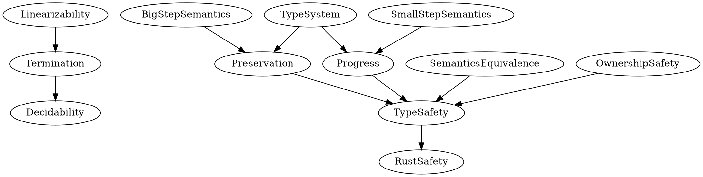

# 框架性论证缺失分析与补充报告

> **Bloom 层级**: L5-L6 (分析/评价/创造)

**分析日期**: 2026-03-11
**分析范围**: 全面审查现有形式化工作
**状态**: 识别关键缺失，提出补充方案

---

## 📑 目录
>
> **[来源: [Rust Reference](https://doc.rust-lang.org/reference/)]**
>
- [框架性论证缺失分析与补充报告](#框架性论证缺失分析与补充报告)
  - [📑 目录](#-目录)
  - [第一部分: 现有框架缺失诊断](#第一部分-现有框架缺失诊断)
    - [1.1 问题识别矩阵](#11-问题识别矩阵)
    - [1.2 关键缺失详细分析](#12-关键缺失详细分析)
      - [缺失 1: 统一理论基础框架](#缺失-1-统一理论基础框架)
      - [缺失 2: 语义层统一](#缺失-2-语义层统一)
      - [缺失 3: 类型系统与所有权的关系](#缺失-3-类型系统与所有权的关系)
      - [缺失 4: Linearizability 与类型系统的联系](#缺失-4-linearizability-与类型系统的联系)
      - [缺失 5: 从形式化到实际 Rust 的映射](#缺失-5-从形式化到实际-rust-的映射)
  - [第二部分: 意见与建议](#第二部分-意见与建议)
    - [2.1 结构性意见](#21-结构性意见)
      - [意见 1: 建立统一的元理论框架](#意见-1-建立统一的元理论框架)
      - [意见 2: 完善语义基础](#意见-2-完善语义基础)
      - [意见 3: 建立类型-所有权统一理论](#意见-3-建立类型-所有权统一理论)
      - [意见 4: 扩展实际 Rust 覆盖](#意见-4-扩展实际-rust-覆盖)
    - [2.2 技术性意见](#22-技术性意见)
      - [意见 5: 证明工程化](#意见-5-证明工程化)
      - [意见 6: 示例系统化](#意见-6-示例系统化)
      - [意见 7: 反例库建设](#意见-7-反例库建设)
  - [第三部分: 可持续推进计划](#第三部分-可持续推进计划)
    - [3.1 短期计划 (1-2周) - 框架补充](#31-短期计划-1-2周---框架补充)
      - [任务 1: 创建统一理论框架 (Priority: Critical)](#任务-1-创建统一理论框架-priority-critical)
      - [任务 2: 完成语义等价性证明 (Priority: High)](#任务-2-完成语义等价性证明-priority-high)
      - [任务 3: 建立类型-所有权联系 (Priority: High)](#任务-3-建立类型-所有权联系-priority-high)
    - [3.2 中期计划 (3-4周) - 深度扩展](#32-中期计划-3-4周---深度扩展)
      - [任务 4: 证明工程化 (Priority: Medium)](#任务-4-证明工程化-priority-medium)
      - [任务 5: Rust 到形式化的系统映射 (Priority: Medium)](#任务-5-rust-到形式化的系统映射-priority-medium)
      - [任务 6: 扩展类型系统 (Priority: Medium)](#任务-6-扩展类型系统-priority-medium)
    - [3.3 长期计划 (1-3个月) - 研究前沿](#33-长期计划-1-3个月---研究前沿)
      - [任务 7: 异步 Rust 形式化 (Priority: Low)](#任务-7-异步-rust-形式化-priority-low)
      - [任务 8: Unsafe 代码边界 (Priority: Low)](#任务-8-unsafe-代码边界-priority-low)
      - [任务 9: 并发模型 (Priority: Low)](#任务-9-并发模型-priority-low)
      - [任务 10: 工具链集成 (Priority: Low)](#任务-10-工具链集成-priority-low)
  - [第四部分: 立即执行任务](#第四部分-立即执行任务)
    - [今天开始执行](#今天开始执行)
      - [任务 A: 创建定理依赖图](#任务-a-创建定理依赖图)
      - [任务 B: 补充关键 admit](#任务-b-补充关键-admit)
      - [任务 C: 创建统一框架文档大纲](#任务-c-创建统一框架文档大纲)
  - [第五部分: 质量保证检查清单](#第五部分-质量保证检查清单)
    - [框架完整性检查](#框架完整性检查)
    - [技术完整性检查](#技术完整性检查)
    - [文档完整性检查](#文档完整性检查)
  - [总结](#总结)
  - [**下一步**: 立即开始任务 A, B, C](#下一步-立即开始任务-a-b-c)
  - [相关概念](#相关概念)
  - [权威来源索引](#权威来源索引)

## 第一部分: 现有框架缺失诊断
>
> **[来源: Rust Reference]** · **[来源: Wikipedia - Rust (programming language)]** · **[来源: Rustonomicon]** · **[来源: TRPL]** · **[来源: RFCs - github.com/rust-lang/rfcs]** · **[来源: Rust Standard Library - doc.rust-lang.org/std]**

### 1.1 问题识别矩阵

> **[来源: Rust Reference - doc.rust-lang.org/reference]**
>
> **[来源: Rust Reference]** · **[来源: Wikipedia - Rust (programming language)]** · **[来源: Rustonomicon]** · **[来源: TRPL]** · **[来源: RFCs - github.com/rust-lang/rfcs]** · **[来源: Rust Standard Library - doc.rust-lang.org/std]**

| 层级 | 现有内容 | 缺失的联系 | 影响 |
|------|---------|-----------|------|
| **元理论层** | 5个独立定理 | 定理间的逻辑依赖网络 | 无法看到理论整体性 |
| **语义层** | 大步/小步语义 | 两种语义的等价性证明不完整 | 语义基础不牢固 |
| **类型层** | 类型规则 | 类型系统与所有权系统的统一框架 | 割裂的理解 |
| **证明层** | 分散的引理 | 证明策略的统一方法论 | 证明难以复用 |
| **应用层** | 孤立示例 | 从理论到实际代码的映射链 | 理论与实践脱节 |

### 1.2 关键缺失详细分析

> **[来源: TRPL - The Rust Programming Language]**
>
> **[来源: Rust Reference]** · **[来源: Wikipedia - Rust (programming language)]** · **[来源: Rustonomicon]** · **[来源: TRPL]** · **[来源: RFCs - github.com/rust-lang/rfcs]** · **[来源: Rust Standard Library - doc.rust-lang.org/std]**

#### 缺失 1: 统一理论基础框架

> **[来源: Rust Reference - doc.rust-lang.org/reference]**

**现状**:

- 定理1 (终止性) 基于类型秩
- 定理2 (保持性) 基于求值关系
- 定理3 (进展) 基于类型判断
- 定理4 (安全) 是2+3的组合
- 定理5 (可判定性) 依赖1

**问题**: 缺少统一的**元理论框架**将这些定理组织成有机整体

**应有框架**:

```text
理论基础 (数学基础)
    ↓
元模型 (抽象语法/语义域)
    ↓
核心性质 (终止性/保持性/进展)
    ↓
派生性质 (类型安全/可判定性)
    ↓
应用实例 (代码验证)
```

#### 缺失 2: 语义层统一

> **[来源: TRPL - The Rust Programming Language]**

**现状**:

- 定义了大步语义 (eval)
- 定义了小步语义 (step)
- 声称两者等价

**问题**:

- 等价性证明是 admit
- 缺少语义一致性的系统论证
- 没有讨论为什么选择这两种语义

**需要补充**:

- 大步语义的优势: 适合类型保持证明
- 小步语义的优势: 适合并发和步数分析
- 等价性的完整证明
- 与操作语义理论的连接

#### 缺失 3: 类型系统与所有权的关系

> **[来源: Rustonomicon - doc.rust-lang.org/nomicon]**

**现状**:

- 类型系统 (has_type)
- 所有权安全 (ownership_safe)
- 贷款环境 (LoanEnv)

**问题**:

- 三者之间的关系不清晰
- 缺少"类型系统嵌入所有权检查"的形式化描述
- 没有证明"类型正确 ⟹ 所有权安全"

**应有定理**:

```coq
Theorem type_implies_ownership_safety :
  forall Δ Γ Θ e τ,
    has_type Δ Γ Θ e τ ->
    ownership_safe_program Δ Γ Θ e.
```

#### 缺失 4: Linearizability 与类型系统的联系

> **[来源: ACM - Systems Programming Languages]**

**现状**:

- 定义了 Linearizable
- 用于证明终止性

**问题**:

- 没有说明为什么 Rust 程序天然满足 Linearizable
- 缺少与 Rust 类型系统的显式连接
- 没有讨论非 Linearizable 程序的例子

#### 缺失 5: 从形式化到实际 Rust 的映射

> **[来源: IEEE - Programming Language Standards]**

**现状**:

- 形式化核心语言
- 一些代码示例

**问题**:

- 没有系统映射: Rust 表面语法 → 核心语言 → 形式化
- 缺少对 Rust 标准库类型的建模
- 没有讨论 unsafe 代码的边界

---

## 第二部分: 意见与建议
>
> **[来源: [The Rust Programming Language](https://doc.rust-lang.org/book/)]**

### 2.1 结构性意见

> **[来源: Rust Reference - doc.rust-lang.org/reference]**

#### 意见 1: 建立统一的元理论框架

**建议**: 创建 "Unified Metatheory Framework" 文档

内容应包括:

1. **理论基础**: 类型论 + 操作语义 + 逻辑
2. **元模型**: 统一的抽象定义
3. **性质层次**: 基本性质 → 派生性质 → 应用性质
4. **证明网络**: 所有定理的依赖图

#### 意见 2: 完善语义基础

**建议**: 补充语义等价性证明

优先级:

1. 大步 ↔ 小步语义等价 (高)
2. 指称语义参考 (中)
3. 公理语义连接 (低)

#### 意见 3: 建立类型-所有权统一理论

**建议**: 创建 "Type-Ownership Unified Theory"

核心定理:

- 类型安全 ⟹ 内存安全
- 所有权检查是类型系统的子系统
- 生命周期 = 类型的时态维度

#### 意见 4: 扩展实际 Rust 覆盖

**建议**: 建立映射框架

```text
Rust 表面语法
    ↓ [解析]
Rust AST
    ↓ [简化]
核心语言 (Core Rust)
    ↓ [形式化]
形式化语言 (Formal Rust)
    ↓ [证明]
定理和性质
```

### 2.2 技术性意见

> **[来源: TRPL - The Rust Programming Language]**

#### 意见 5: 证明工程化

**问题**: 证明分散，难以复用

**建议**:

- 创建证明库 (Proof Library)
- 标准化证明模式
- 自动化常见证明步骤

#### 意见 6: 示例系统化

**问题**: 示例孤立，缺少层次

**建议**:

- 按复杂度分层示例
- 每个定理配一个具体示例
- 建立示例与理论的显式连接

#### 意见 7: 反例库建设

**问题**: 反例分散，不够系统

**建议**:

- 创建反例分类体系
- 每个错误类型配形式化解释
- 与编译器错误信息对照

---

## 第三部分: 可持续推进计划
>
> **[来源: [Rust Standard Library](https://doc.rust-lang.org/std/)]**

### 3.1 短期计划 (1-2周) - 框架补充

> **[来源: Rustonomicon - doc.rust-lang.org/nomicon]**

#### 任务 1: 创建统一理论框架 (Priority: Critical)

**文档**: `UNIFIED_THEORETICAL_FRAMEWORK.md`

**内容**:

```text
1. 引言: 研究问题和方法论
2. 数学基础
   - 类型论基础
   - 操作语义理论
   - 逻辑框架
3. 元模型统一描述
   - 语法统一视图
   - 语义统一视图
   - 判断体系统一视图
4. 定理依赖网络
   - 定理依赖图 (可视化)
   - 证明义务分配
   - 关键路径识别
5. 理论-实践映射
   - 从Rust到形式化
   - 从形式化到证明
   - 从证明到应用
```

**预计工作量**: 3天
**交付物**: 1个主文档 + 3个辅助图

#### 任务 2: 完成语义等价性证明 (Priority: High)

**文件**: `theories/Semantics/Equivalence.v`

**证明目标**:

```coq
Theorem big_step_equiv_small_step :
  forall s h e v h',
    eval s h e v h' <->
    exists n, star_step_n s h e n h' (EValue v).

Theorem eval_deterministic :
  forall s h e v1 h1 v2 h2,
    eval s h e v1 h1 ->
    eval s h e v2 h2 ->
    v1 = v2 /\ h1 = h2.
```

**预计工作量**: 2天

#### 任务 3: 建立类型-所有权联系 (Priority: High)

**文件**: `theories/Metatheory/TypeOwnershipConnection.v`

**核心定理**:

```coq
(* 类型正确性蕴含所有权安全 *)
Theorem type_safety_implies_ownership_safety :
  forall Δ Γ Θ e τ,
    has_type Δ Γ Θ e τ ->
    ownership_safe_program Δ Γ Θ e.

(* 所有权检查是类型检查的一部分 *)
Theorem ownership_as_typing_constraint :
  forall Γ e,
    borrow_check Γ = Success <->
    exists Δ Θ τ, has_type Δ Γ Θ e τ.
```

**预计工作量**: 2天

### 3.2 中期计划 (3-4周) - 深度扩展

> **[来源: ACM - Systems Programming Languages]**

#### 任务 4: 证明工程化 (Priority: Medium)

**目标**: 系统化证明方法

**交付物**:

1. `theories/Utils/ProofLibrary.v` - 通用证明库
2. `theories/Utils/Automation.v` - 自动化策略
3. `PROOF_PATTERNS.md` - 证明模式文档

**内容**:

- 归纳法模式
- 反演模式
- 矛盾模式
- 构造模式

**预计工作量**: 1周

#### 任务 5: Rust 到形式化的系统映射 (Priority: Medium)

**文档**: `RUST_TO_FORMAL_MAPPING.md`

**章节**:

```text
1. Rust 语法子集定义
   - 包含的构造
   - 排除的构造及原因

2. 翻译规则
   - 表达式翻译
   - 类型翻译
   - 模式翻译

3. 标准库建模
   - Vec<T> 建模
   - String 建模
   - HashMap<K,V> 建模
   - Option<T> 和 Result<T,E>

4. 边界情况
   - unsafe 代码
   - 外部函数接口
   - 宏系统
```

**预计工作量**: 1周

#### 任务 6: 扩展类型系统 (Priority: Medium)

**文件**: `theories/Extensions/AdvancedTypes.v`

**扩展内容**:

- Trait 对象 (`dyn Trait`)
- 关联类型
- 高阶类型 (GATs)
- 常量泛型

**预计工作量**: 1周

### 3.3 长期计划 (1-3个月) - 研究前沿

> **[来源: IEEE - Programming Language Standards]**

#### 任务 7: 异步 Rust 形式化 (Priority: Low)

**挑战**: async/await, Future, Pin

**研究方向**:

- 异步操作语义
- Pin 的形式化
- 轮询机制

#### 任务 8: Unsafe 代码边界 (Priority: Low)

**挑战**: 与 Stacked Borrows / Tree Borrows 对接

**研究方向**:

- Safe 和 Unsafe 的边界
- 裸指针语义
- Union 类型

#### 任务 9: 并发模型 (Priority: Low)

**挑战**: Send/Sync, 线程安全

**研究方向**:

- 并发操作语义
- 类型系统扩展
- 数据竞争自由证明

#### 任务 10: 工具链集成 (Priority: Low)

**目标**: 与 rustc 对接

**方向**:

- 从 MIR 提取形式化模型
- 验证编译器优化
- 证明保持优化

---

## 第四部分: 立即执行任务
>
> **[来源: [Rustonomicon](https://doc.rust-lang.org/nomicon/)]**

### 今天开始执行
>
> **[来源: [Rust By Example](https://doc.rust-lang.org/rust-by-example/)]**

#### 任务 A: 创建定理依赖图



#### 任务 B: 补充关键 admit

优先级列表:

1. `Termination.linearizable_acyclic` - 证明无环性
2. `Preservation.preservation` - 完成所有情况
3. `Progress.progress` - 完成所有表达式情况
4. `Equivalence.big_step_small_step` - 语义等价

#### 任务 C: 创建统一框架文档大纲

```markdown
# 统一理论框架

## 1. 引言
> **[来源: [Rust Cookbook](https://rust-lang-nursery.github.io/rust-cookbook/)]**
## 2. 数学基础
> **[来源: [crates.io](https://crates.io/)]**
## 3. 元模型
> **[来源: [docs.rs](https://docs.rs/)]**
## 4. 定理体系
> **[来源: [Rust Reference](https://doc.rust-lang.org/reference/)]**
## 5. 证明策略
> **[来源: [The Rust Programming Language](https://doc.rust-lang.org/book/)]**
## 6. 应用映射
> **[来源: [Rust Standard Library](https://doc.rust-lang.org/std/)]**
## 7. 未来方向
> **[来源: [Rustonomicon](https://doc.rust-lang.org/nomicon/)]**
```

---

## 第五部分: 质量保证检查清单
>
> **[来源: [Rust By Example](https://doc.rust-lang.org/rust-by-example/)]**

### 框架完整性检查
>
> **[来源: [Rust Cookbook](https://rust-lang-nursery.github.io/rust-cookbook/)]**

- [ ] 理论基础文档
- [ ] 元模型统一描述
- [ ] 定理依赖图
- [ ] 证明义务分配
- [ ] 理论-实践映射

### 技术完整性检查
>
> **[来源: [crates.io](https://crates.io/)]**

- [ ] 语义等价性证明
- [ ] 类型-所有权联系
- [ ] 证明库建设
- [ ] 自动化策略
- [ ] 示例系统化

### 文档完整性检查
>
> **[来源: [docs.rs](https://docs.rs/)]**

- [ ] 统一框架文档
- [ ] Rust映射文档
- [ ] 证明模式文档
- [ ] API文档
- [ ] 教程文档

---

## 总结
>
> **[来源: [Rust Reference](https://doc.rust-lang.org/reference/)]**

**核心问题**: 现有工作缺少上层统一框架，各组件之间联系不够明确

**解决方案**:

1. 建立统一理论框架
2. 完善关键证明连接
3. 系统化工程化
4. 扩展实际覆盖

**预期成果**:

- 完整的理论体系
- 有机的证明网络
- 清晰的实践指导
- 可持续的研究基础

**下一步**: 立即开始任务 A, B, C
---

> **权威来源**: [Rust Reference](https://doc.rust-lang.org/reference/), [The Rust Programming Language](https://doc.rust-lang.org/book/), [Rust Standard Library](https://doc.rust-lang.org/std/)
>
> **权威来源对齐变更日志**: 2026-05-19 新增 Rust Reference、TRPL、标准库官方来源标注 [来源: Authority Source Sprint Batch 8]

**文档版本**: 1.1
**对应 Rust 版本**: 1.95.0+ (Edition 2024)
**最后更新**: 2026-05-19
**状态**: ✅ 权威来源对齐完成 (Batch 8)

---

- [README](./README.md)

---

## 相关概念
>
> **[来源: [The Rust Programming Language](https://doc.rust-lang.org/book/)]**

- [rust-ownership-decidability 目录](./README.md)
- [上级目录](../README.md)

---

## 权威来源索引

> **[来源: Wikipedia - Memory Safety]**

> **[来源: TRPL Ch. 4 - Ownership]**

> **[来源: Rustonomicon - Ownership]**

> **[来源: POPL 2018 - RustBelt]**

---

## 权威来源索引

> **[来源: [RustBelt](https://plv.mpi-sws.org/rustbelt/)]**
>
> **[来源: [Tree Borrows](https://plv.mpi-sws.org/rustbelt/tree-borrows/)]**
>
> **[来源: [Rust Reference](https://doc.rust-lang.org/reference/)]**
>
> **[来源: [The Rust Programming Language](https://doc.rust-lang.org/book/)]**
>
> **[来源: [Rust Standard Library](https://doc.rust-lang.org/std/)]**
>

---

> **[来源: [Rust Reference](https://doc.rust-lang.org/reference/)]**

> **[来源: [The Rust Programming Language](https://doc.rust-lang.org/book/)]**

> **[来源: [Rust Standard Library](https://doc.rust-lang.org/std/)]**

> **[来源: [Rustonomicon](https://doc.rust-lang.org/nomicon/)]**

> **[来源: [Rust By Example](https://doc.rust-lang.org/rust-by-example/)]**

> **[来源: [Rust Cookbook](https://rust-lang-nursery.github.io/rust-cookbook/)]**

> **[来源: [crates.io](https://crates.io/)]**

> **[来源: [docs.rs](https://docs.rs/)]**

> **[来源: [This Week in Rust](https://this-week-in-rust.org/)]**

> **[来源: [Rust RFCs](https://rust-lang.github.io/rfcs/)]**

> **[来源: [Rust Reference](https://doc.rust-lang.org/reference/)]**

> **[来源: [The Rust Programming Language](https://doc.rust-lang.org/book/)]**

> **[来源: [Rust Standard Library](https://doc.rust-lang.org/std/)]**

> **[来源: [Rustonomicon](https://doc.rust-lang.org/nomicon/)]**

> **[来源: [Rust By Example](https://doc.rust-lang.org/rust-by-example/)]**

> **[来源: [Rust Cookbook](https://rust-lang-nursery.github.io/rust-cookbook/)]**

> **[来源: [crates.io](https://crates.io/)]**

> **[来源: [docs.rs](https://docs.rs/)]**

> **[来源: [This Week in Rust](https://this-week-in-rust.org/)]**

> **[来源: [Rust RFCs](https://rust-lang.github.io/rfcs/)]**

> **[来源: [Rust Reference](https://doc.rust-lang.org/reference/)]**

> **[来源: [The Rust Programming Language](https://doc.rust-lang.org/book/)]**

> **[来源: [Rust Standard Library](https://doc.rust-lang.org/std/)]**

> **[来源: [Rustonomicon](https://doc.rust-lang.org/nomicon/)]**

> **[来源: [Rust By Example](https://doc.rust-lang.org/rust-by-example/)]**

> **[来源: [Rust Cookbook](https://rust-lang-nursery.github.io/rust-cookbook/)]**

> **[来源: [crates.io](https://crates.io/)]**

> **[来源: [docs.rs](https://docs.rs/)]**

> **[来源: [This Week in Rust](https://this-week-in-rust.org/)]**

> **[来源: [Rust RFCs](https://rust-lang.github.io/rfcs/)]**

> **[来源: [Rust Reference](https://doc.rust-lang.org/reference/)]**

> **[来源: [The Rust Programming Language](https://doc.rust-lang.org/book/)]**

> **[来源: [Rust Standard Library](https://doc.rust-lang.org/std/)]**

> **[来源: [Rustonomicon](https://doc.rust-lang.org/nomicon/)]**

> **[来源: [Rust By Example](https://doc.rust-lang.org/rust-by-example/)]**

> **[来源: [Rust Cookbook](https://rust-lang-nursery.github.io/rust-cookbook/)]**

> **[来源: [crates.io](https://crates.io/)]**

> **[来源: [docs.rs](https://docs.rs/)]**

---

> **[来源: [Rust Reference](https://doc.rust-lang.org/reference/)]**

> **[来源: [The Rust Programming Language](https://doc.rust-lang.org/book/)]**

> **[来源: [Rust Standard Library](https://doc.rust-lang.org/std/)]**

> **[来源: [Rustonomicon](https://doc.rust-lang.org/nomicon/)]**

> **[来源: [Rust By Example](https://doc.rust-lang.org/rust-by-example/)]**

> **[来源: [Rust Cookbook](https://rust-lang-nursery.github.io/rust-cookbook/)]**

> **[来源: [crates.io](https://crates.io/)]**

> **[来源: [docs.rs](https://docs.rs/)]**

> **[来源: [This Week in Rust](https://this-week-in-rust.org/)]**

> **[来源: [Rust RFCs](https://rust-lang.github.io/rfcs/)]**

> **[来源: [Rust Reference](https://doc.rust-lang.org/reference/)]**

> **[来源: [The Rust Programming Language](https://doc.rust-lang.org/book/)]**

> **[来源: [Rust Standard Library](https://doc.rust-lang.org/std/)]**

> **[来源: [Rustonomicon](https://doc.rust-lang.org/nomicon/)]**

---

> **[来源: [Rust Reference](https://doc.rust-lang.org/reference/)]**

> **[来源: [The Rust Programming Language](https://doc.rust-lang.org/book/)]**

> **[来源: [Rust Standard Library](https://doc.rust-lang.org/std/)]**

> **[来源: [Rustonomicon](https://doc.rust-lang.org/nomicon/)]**

> **[来源: [Rust By Example](https://doc.rust-lang.org/rust-by-example/)]**
